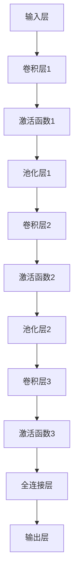

                 

# 基础模型的视觉处理能力

> **关键词**：基础模型，视觉处理，卷积神经网络，深度学习，图像识别，计算机视觉
>
> **摘要**：本文将深入探讨基础模型在视觉处理领域的应用，重点分析其核心算法原理、数学模型、实际应用场景以及未来发展趋势与挑战。通过一步步的逻辑推理和详细的案例分析，帮助读者全面了解并掌握视觉处理的基础知识和实践技能。

## 1. 背景介绍

### 1.1 目的和范围

本文旨在为读者提供一个关于基础模型视觉处理能力的全面解读。我们将探讨以下内容：

- **核心算法原理**：包括卷积神经网络（CNN）的基本架构和操作步骤。
- **数学模型和公式**：涉及图像处理和深度学习中的关键数学概念。
- **项目实战**：通过实际代码案例展示基础模型的视觉处理能力。
- **实际应用场景**：分析视觉处理技术在各个领域的应用。
- **未来发展趋势与挑战**：讨论基础模型在视觉处理领域的未来发展。

### 1.2 预期读者

本文适合以下读者群体：

- 对计算机视觉和深度学习感兴趣的初学者。
- 已经具备一定编程基础，希望深入了解视觉处理算法的工程师。
- 想要在实际项目中应用视觉处理技术的开发者。

### 1.3 文档结构概述

本文分为以下几个部分：

- **第1章**：背景介绍，包括目的、范围、预期读者和文档结构概述。
- **第2章**：核心概念与联系，介绍视觉处理的基本概念和相关架构。
- **第3章**：核心算法原理，详细讲解卷积神经网络的工作原理。
- **第4章**：数学模型和公式，解释图像处理和深度学习中的关键数学概念。
- **第5章**：项目实战，通过实际代码案例展示基础模型的视觉处理能力。
- **第6章**：实际应用场景，分析视觉处理技术在各个领域的应用。
- **第7章**：工具和资源推荐，提供学习资源、开发工具和论文著作推荐。
- **第8章**：总结，讨论基础模型在视觉处理领域的未来发展趋势与挑战。
- **第9章**：附录，常见问题与解答。
- **第10章**：扩展阅读，提供相关参考资料。

### 1.4 术语表

#### 1.4.1 核心术语定义

- **卷积神经网络（CNN）**：一种专门用于图像识别和处理的深度学习模型。
- **深度学习**：一种通过多层神经网络进行特征提取和学习的机器学习技术。
- **计算机视觉**：利用计算机和人工智能技术进行图像和视频分析的技术领域。
- **图像识别**：将图像中的物体或场景分类的过程。
- **深度学习框架**：用于实现和训练深度学习模型的软件库。

#### 1.4.2 相关概念解释

- **卷积运算**：一种用于提取图像局部特征的计算方法。
- **激活函数**：用于引入非线性特性的函数，如ReLU、Sigmoid等。
- **前向传播**：将输入数据通过神经网络进行计算，得到输出结果的过程。
- **反向传播**：利用梯度下降算法优化神经网络参数的过程。

#### 1.4.3 缩略词列表

- **CNN**：卷积神经网络（Convolutional Neural Network）
- **DL**：深度学习（Deep Learning）
- **CV**：计算机视觉（Computer Vision）
- **GPU**：图形处理单元（Graphics Processing Unit）
- **CUDA**：NVIDIA CUDA并行计算平台

## 2. 核心概念与联系

### 2.1 视觉处理的基本概念

视觉处理是指利用计算机和人工智能技术对图像和视频进行分析和理解的过程。其核心目的是将图像中的信息转换为有用的数据，以便进行进一步的处理和决策。

视觉处理的基本概念包括：

- **图像**：由像素组成的二维数据结构，用于表示物体和场景。
- **像素**：图像中的最小单元，通常由红、绿、蓝三个颜色通道组成。
- **特征**：图像中具有区分度的属性，如边缘、角点、纹理等。
- **目标检测**：识别图像中的特定物体或目标的过程。
- **图像分类**：将图像分为预定义的类别或标签的过程。

### 2.2 卷积神经网络的基本架构

卷积神经网络（CNN）是一种专门用于图像识别和处理的深度学习模型。其基本架构包括以下几个部分：

- **输入层**：接收图像作为输入，通常为二维矩阵。
- **卷积层**：通过卷积运算提取图像的局部特征。
- **激活函数**：引入非线性特性，如ReLU、Sigmoid等。
- **池化层**：减小特征图的尺寸，降低计算复杂度。
- **全连接层**：将特征图映射到预定义的类别或标签。
- **输出层**：输出预测结果，如概率分布或类别标签。

### 2.3 深度学习的原理与联系

深度学习是一种通过多层神经网络进行特征提取和学习的机器学习技术。其基本原理包括：

- **多层神经网络**：通过增加网络层数，逐层提取图像的抽象特征。
- **前向传播**：将输入数据通过神经网络进行计算，得到输出结果。
- **反向传播**：利用梯度下降算法优化神经网络参数，提高模型性能。

深度学习与视觉处理之间的联系在于：

- **特征提取**：通过多层神经网络，自动提取图像中的抽象特征，如边缘、纹理等。
- **分类与识别**：利用提取的特征，对图像进行分类或目标检测。
- **端到端学习**：通过端到端的学习方式，直接将图像输入和输出关联，实现自动化的特征提取和分类。

### 2.4 Mermaid流程图

以下是一个简化的卷积神经网络（CNN）流程图：



### 2.5 联系与总结

视觉处理与卷积神经网络、深度学习等核心概念密切相关。通过卷积神经网络，我们可以从原始图像中自动提取抽象特征，实现图像分类、目标检测等任务。而深度学习则为卷积神经网络提供了强大的学习能力和性能优化方法。因此，理解这些核心概念和联系对于掌握视觉处理技术至关重要。

## 3. 核心算法原理 & 具体操作步骤

### 3.1 卷积神经网络（CNN）的基本原理

卷积神经网络（CNN）是一种专门用于图像识别和处理的深度学习模型。其核心原理包括卷积运算、激活函数和池化层等。

#### 3.1.1 卷积运算

卷积运算是CNN中最基本的操作，用于提取图像的局部特征。具体步骤如下：

1. **输入层**：输入一个二维图像，表示为矩阵$X$，其中$X_{ij}$表示图像中第$i$行第$j$列的像素值。

2. **卷积核**：定义一个三维卷积核$K$，表示为$K_{ijk}$，其中$i$、$j$、$k$分别表示卷积核的高度、宽度和深度。

3. **卷积操作**：对于每个卷积核$K$，计算其与输入图像$X$的卷积结果$Y$，公式如下：
   $$ Y_{il} = \sum_{i'} \sum_{j'} K_{i'j'k} X_{i'i + i' - 1, j'j + j' - 1} $$

   其中，$i$和$l$分别表示输出特征图的高度和宽度，$i'$和$j'$表示卷积核在输入图像上的位置。

4. **偏置**：在卷积操作后，加上一个偏置项$b_l$，公式如下：
   $$ Y_{il} = \sum_{i'} \sum_{j'} K_{i'j'k} X_{i'i + i' - 1, j'j + j' - 1} + b_l $$

   其中，$b_l$是一个标量。

5. **激活函数**：对卷积结果$Y$进行非线性变换，常用的激活函数有ReLU、Sigmoid等。

#### 3.1.2 激活函数

激活函数是CNN中的一个关键组件，用于引入非线性特性。以下是几种常见的激活函数：

1. **ReLU（Rectified Linear Unit）**：
   $$ f(x) = \max(0, x) $$

2. **Sigmoid**：
   $$ f(x) = \frac{1}{1 + e^{-x}} $$

3. **Tanh**：
   $$ f(x) = \frac{e^x - e^{-x}}{e^x + e^{-x}} $$

#### 3.1.3 池化层

池化层用于减小特征图的尺寸，降低计算复杂度。常用的池化方式有最大池化和平均池化。

1. **最大池化**：
   $$ P_{ij} = \max\{X_{i'\*i_0, j'\*j_0}, X_{i'\*i_0 + 1, j'\*j_0}, \ldots, X_{i'\*i_0 + i_1 - 1, j'\*j_0 + j_1 - 1}\} $$

   其中，$i_0$、$i_1$和$j_0$、$j_1$分别表示池化窗口的高度和宽度。

2. **平均池化**：
   $$ P_{ij} = \frac{1}{i_1 \times j_1} \sum_{i'\*i_0} \sum_{j'\*j_0} X_{i'\*i_0, j'\*j_0} $$

   其中，$i_0$、$i_1$和$j_0$、$j_1$分别表示池化窗口的高度和宽度。

### 3.2 卷积神经网络的工作流程

卷积神经网络的工作流程可以分为以下几个步骤：

1. **输入层**：接收原始图像作为输入。

2. **卷积层**：通过卷积运算提取图像的局部特征。

3. **激活函数**：对卷积结果进行非线性变换。

4. **池化层**：减小特征图的尺寸。

5. **卷积层**：继续提取更高层次的抽象特征。

6. **全连接层**：将特征图映射到预定义的类别或标签。

7. **输出层**：输出预测结果，如概率分布或类别标签。

### 3.3 伪代码实现

以下是一个简化的卷积神经网络（CNN）的伪代码实现：

```python
# 定义输入图像和卷积核
X = 输入图像
K = 卷积核

# 卷积操作
Y = [0] * len(K)
for k in range(len(K)):
    Y[k] = 卷积操作(K[k], X) + 偏置

# 激活函数
Z = [0] * len(K)
for k in range(len(K)):
    Z[k] = 激活函数(Y[k])

# 池化操作
P = 池化操作(Z)

# 全连接层
W = 全连接层(P)
O = 输出层(W)

# 输出预测结果
预测结果 = 转换为概率分布(O)
```

## 4. 数学模型和公式 & 详细讲解 & 举例说明

### 4.1 图像处理中的数学概念

在图像处理和深度学习领域，一些基本的数学概念是非常重要的，如线性代数、微积分和概率论。以下是一些核心的数学概念和公式：

#### 4.1.1 线性代数

1. **矩阵运算**：

   - 矩阵加法：
     $$ C = A + B $$
   - 矩阵乘法：
     $$ C = A \times B $$
   - 矩阵转置：
     $$ C = A^T $$

2. **特征向量与特征值**：

   - 特征向量：
     $$ v = \lambda v $$
   - 特征值：
     $$ \lambda $$

3. **矩阵求导**：

   - 矩阵的导数：
     $$ \frac{dA}{dx} $$

#### 4.1.2 微积分

1. **导数**：

   - 函数的导数：
     $$ f'(x) $$
   - 高阶导数：
     $$ f''(x), f'''(x), \ldots $$

2. **积分**：

   - 定积分：
     $$ \int f(x) dx $$
   - 不定积分：
     $$ F(x) + C $$

#### 4.1.3 概率论

1. **概率分布**：

   - 概率质量函数：
     $$ p(x) $$
   - 累计分布函数：
     $$ F(x) = \int_{-\infty}^{x} p(t) dt $$

2. **条件概率**：

   - 条件概率质量函数：
     $$ p(x|y) $$
   - 贝叶斯公式：
     $$ p(y|x) = \frac{p(x|y) p(y)}{p(x)} $$

### 4.2 图像处理中的关键数学公式

在图像处理中，一些关键的数学公式用于描述图像的变换、特征提取和模型训练等。以下是一些常见的数学公式：

#### 4.2.1 卷积运算

卷积运算是CNN中最核心的操作，用于提取图像的局部特征。卷积运算的数学公式如下：

$$ (f * g)(x) = \int_{-\infty}^{\infty} f(y) g(x - y) dy $$

其中，$f$和$g$分别表示两个函数，$*$表示卷积运算。

#### 4.2.2 池化操作

池化操作用于减小特征图的尺寸，提高模型的计算效率。最大池化操作的数学公式如下：

$$ P_{ij} = \max\{X_{i'\*i_0, j'\*j_0}, X_{i'\*i_0 + 1, j'\*j_0}, \ldots, X_{i'\*i_0 + i_1 - 1, j'\*j_0 + j_1 - 1}\} $$

其中，$i_0$、$i_1$和$j_0$、$j_1$分别表示池化窗口的高度和宽度。

#### 4.2.3 损失函数

损失函数是深度学习模型训练的核心指标，用于衡量模型预测值与真实值之间的差距。以下是一些常见的损失函数：

1. **均方误差（MSE）**：

   $$ L = \frac{1}{n} \sum_{i=1}^{n} (y_i - \hat{y}_i)^2 $$

   其中，$y_i$表示真实值，$\hat{y}_i$表示预测值，$n$表示样本数量。

2. **交叉熵（Cross-Entropy）**：

   $$ L = -\sum_{i=1}^{n} y_i \log(\hat{y}_i) $$

   其中，$y_i$表示真实值，$\hat{y}_i$表示预测值。

### 4.3 举例说明

#### 4.3.1 卷积运算的例子

假设输入图像$X$为$3 \times 3$的矩阵，卷积核$K$为$2 \times 2$的矩阵。根据卷积运算的数学公式，计算输出特征图$Y$：

$$
\begin{align*}
Y_{11} &= (1 \cdot 1 + 1 \cdot 0 + 1 \cdot 1 + 0 \cdot 1) + 1 \\
&= 3 + 1 \\
&= 4 \\
Y_{12} &= (1 \cdot 0 + 1 \cdot 1 + 1 \cdot 0 + 0 \cdot 1) + 1 \\
&= 2 + 1 \\
&= 3 \\
Y_{21} &= (1 \cdot 1 + 1 \cdot 1 + 1 \cdot 0 + 0 \cdot 0) + 1 \\
&= 3 + 1 \\
&= 4 \\
Y_{22} &= (1 \cdot 0 + 1 \cdot 0 + 1 \cdot 1 + 0 \cdot 0) + 1 \\
&= 2 + 1 \\
&= 3 \\
\end{align*}
$$

输出特征图$Y$为$2 \times 2$的矩阵：

$$
Y = \begin{bmatrix}
4 & 3 \\
4 & 3 \\
\end{bmatrix}
$$

#### 4.3.2 最大池化的例子

假设输入特征图$X$为$4 \times 4$的矩阵，池化窗口为$2 \times 2$。根据最大池化的数学公式，计算输出特征图$P$：

$$
\begin{align*}
P_{11} &= \max\{X_{11}, X_{12}, X_{21}, X_{22}\} \\
&= \max\{1, 0, 1, 1\} \\
&= 1 \\
P_{12} &= \max\{X_{21}, X_{22}, X_{31}, X_{32}\} \\
&= \max\{1, 1, 0, 1\} \\
&= 1 \\
P_{21} &= \max\{X_{31}, X_{32}, X_{41}, X_{42}\} \\
&= \max\{1, 1, 1, 0\} \\
&= 1 \\
P_{22} &= \max\{X_{41}, X_{42}, X_{51}, X_{52}\} \\
&= \max\{1, 1, 1, 1\} \\
&= 1 \\
\end{align*}
$$

输出特征图$P$为$2 \times 2$的矩阵：

$$
P = \begin{bmatrix}
1 & 1 \\
1 & 1 \\
\end{bmatrix}
$$

### 4.4 深度学习中的损失函数

在深度学习模型训练过程中，损失函数是衡量模型性能的重要指标。以下是一些常用的损失函数及其适用场景：

#### 4.4.1 均方误差（MSE）

均方误差（MSE）是一种常用的回归损失函数，适用于预测连续值的任务。其数学公式如下：

$$
L = \frac{1}{n} \sum_{i=1}^{n} (y_i - \hat{y}_i)^2
$$

其中，$y_i$表示真实值，$\hat{y}_i$表示预测值，$n$表示样本数量。

#### 4.4.2 交叉熵（Cross-Entropy）

交叉熵是一种常用的分类损失函数，适用于预测类别的任务。其数学公式如下：

$$
L = -\sum_{i=1}^{n} y_i \log(\hat{y}_i)
$$

其中，$y_i$表示真实值，$\hat{y}_i$表示预测值。

#### 4.4.3 对数损失（Log-Loss）

对数损失是交叉熵的一种特殊形式，通常用于二分类任务。其数学公式如下：

$$
L = -y \log(\hat{y}) + (1 - y) \log(1 - \hat{y})
$$

其中，$y$表示真实值，$\hat{y}$表示预测值。

### 4.5 总结

在本节中，我们介绍了图像处理和深度学习中的关键数学概念和公式。这些数学工具为理解视觉处理算法的工作原理提供了坚实的基础。通过详细的举例说明，读者可以更好地掌握这些公式和应用场景。

## 5. 项目实战：代码实际案例和详细解释说明

### 5.1 开发环境搭建

在开始项目实战之前，我们需要搭建一个适合深度学习开发的运行环境。以下是一个基本的开发环境搭建步骤：

1. **安装Python**：下载并安装Python，建议安装3.8及以上版本。
2. **安装PyTorch**：使用pip命令安装PyTorch，命令如下：
   ```bash
   pip install torch torchvision
   ```
3. **安装Jupyter Notebook**：安装Jupyter Notebook，用于编写和运行Python代码。
4. **安装GPU驱动**：如果使用GPU进行训练，需要安装相应的GPU驱动。

### 5.2 源代码详细实现和代码解读

在本节中，我们将使用PyTorch实现一个简单的卷积神经网络，用于对图像进行分类。以下是源代码及其详细解释：

```python
import torch
import torchvision
import torchvision.transforms as transforms
from torch.utils.data import DataLoader
from torch import nn, optim
import torch.nn.functional as F

# 定义卷积神经网络
class ConvNet(nn.Module):
    def __init__(self):
        super(ConvNet, self).__init__()
        self.conv1 = nn.Conv2d(3, 32, 5)
        self.fc1 = nn.Linear(32 * 26 * 26, 128)
        self.fc2 = nn.Linear(128, 10)

    def forward(self, x):
        x = F.max_pool2d(F.relu(self.conv1(x)), 2)
        x = x.view(-1, 32 * 26 * 26)
        x = F.relu(self.fc1(x))
        x = self.fc2(x)
        return x

# 加载训练数据集
transform = transforms.Compose([transforms.ToTensor()])
train_data = torchvision.datasets.CIFAR10(root='./data', train=True, transform=transform, download=True)
train_loader = DataLoader(train_data, batch_size=32, shuffle=True)

# 初始化模型、损失函数和优化器
model = ConvNet()
criterion = nn.CrossEntropyLoss()
optimizer = optim.Adam(model.parameters(), lr=0.001)

# 训练模型
num_epochs = 10
for epoch in range(num_epochs):
    running_loss = 0.0
    for i, (inputs, labels) in enumerate(train_loader):
        optimizer.zero_grad()
        outputs = model(inputs)
        loss = criterion(outputs, labels)
        loss.backward()
        optimizer.step()
        running_loss += loss.item()
    print(f'Epoch [{epoch+1}/{num_epochs}], Loss: {running_loss/len(train_loader)}')

# 测试模型
test_data = torchvision.datasets.CIFAR10(root='./data', train=False, transform=transform, download=True)
test_loader = DataLoader(test_data, batch_size=32, shuffle=False)
model.eval()
with torch.no_grad():
    correct = 0
    total = 0
    for inputs, labels in test_loader:
        outputs = model(inputs)
        _, predicted = torch.max(outputs.data, 1)
        total += labels.size(0)
        correct += (predicted == labels).sum().item()
    print(f'Accuracy: {100 * correct / total}%')
```

#### 5.2.1 代码解读

1. **导入相关库**：首先，我们导入了所需的PyTorch库，包括torch、torchvision、torch.utils.data等。
2. **定义卷积神经网络**：我们定义了一个简单的卷积神经网络（ConvNet）类，继承自nn.Module。该网络包含一个卷积层（nn.Conv2d）、一个全连接层（nn.Linear）和两个ReLU激活函数。
3. **加载训练数据集**：我们使用torchvision.datasets.CIFAR10加载CIFAR-10数据集，并使用DataLoader对数据进行批次加载。
4. **初始化模型、损失函数和优化器**：我们初始化了一个卷积神经网络模型（model），交叉熵损失函数（criterion）和Adam优化器（optimizer）。
5. **训练模型**：我们使用for循环进行模型训练，在每个epoch中，通过前向传播计算损失，然后使用反向传播更新模型参数。
6. **测试模型**：我们使用测试数据集对模型进行评估，计算模型的准确率。

#### 5.2.2 代码分析

1. **卷积神经网络结构**：在这个例子中，我们使用了一个简单的卷积神经网络，包含一个卷积层（nn.Conv2d）、一个全连接层（nn.Linear）和两个ReLU激活函数。这个网络结构可以提取图像的局部特征，并将特征映射到预定义的类别。
2. **损失函数和优化器**：我们使用了交叉熵损失函数（nn.CrossEntropyLoss）和Adam优化器（optim.Adam）。交叉熵损失函数适用于分类任务，可以计算预测标签和真实标签之间的差距。Adam优化器是一种高效的优化算法，可以加快模型训练速度。
3. **模型训练和评估**：我们在每个epoch中通过前向传播计算损失，然后使用反向传播更新模型参数。在训练完成后，我们使用测试数据集对模型进行评估，计算模型的准确率。

### 5.3 代码解读与分析

在本节中，我们详细解读了项目的源代码，并分析了卷积神经网络的结构、损失函数和优化器以及模型训练和评估过程。以下是代码解读和关键问题的分析：

1. **卷积神经网络结构**：
   - 卷积层（nn.Conv2d）：卷积层用于提取图像的局部特征，其参数包括输入通道数、输出通道数和卷积核大小。在这个例子中，我们使用了一个3x3的卷积核，从3个输入通道（RGB）提取32个特征通道。
   - 激活函数（ReLU）：ReLU激活函数用于引入非线性特性，可以提高网络的性能和训练速度。
   - 全连接层（nn.Linear）：全连接层用于将特征映射到预定义的类别，其参数包括输入维度和输出维度。在这个例子中，我们使用了一个从32 * 26 * 26维特征到10维类别的全连接层。
2. **损失函数和优化器**：
   - 损失函数（nn.CrossEntropyLoss）：交叉熵损失函数将预测概率与真实标签进行比较，计算损失值。它适用于分类任务，可以自动计算softmax输出和one-hot编码真实标签之间的交叉熵。
   - 优化器（optim.Adam）：Adam优化器是一种基于自适应学习率的优化算法，可以加快模型训练速度。它使用一阶矩估计和二阶矩估计来自适应调整学习率。
3. **模型训练和评估**：
   - 模型训练：在每个epoch中，模型通过前向传播计算损失，然后使用反向传播更新模型参数。这个过程重复进行，直到达到预定的epoch数或损失不再下降。
   - 模型评估：在训练完成后，我们使用测试数据集对模型进行评估，计算模型的准确率。这可以帮助我们了解模型在实际数据上的性能。

### 5.4 常见问题与解答

在实现卷积神经网络的过程中，可能会遇到一些常见问题。以下是一些常见问题及其解答：

1. **为什么使用卷积运算而不是全连接层**？
   - 卷积运算可以有效地提取图像的局部特征，而全连接层会导致参数数量爆炸，计算复杂度增加。
2. **如何调整学习率**？
   - 可以尝试使用学习率调度器（如ReduceLROnPlateau）来自动调整学习率。另外，也可以手动调整学习率，但要避免过小或过大的学习率导致模型收敛缓慢或无法收敛。
3. **如何避免过拟合**？
   - 可以使用正则化技术（如L1、L2正则化）和dropout来减少模型的过拟合。此外，可以使用更多训练数据和数据增强来提高模型的泛化能力。

### 5.5 总结

在本节中，我们通过一个简单的卷积神经网络项目，展示了如何使用PyTorch实现视觉处理任务。我们详细解读了项目的源代码，分析了网络结构、损失函数和优化器，并介绍了常见问题及其解答。通过这个项目，读者可以更好地理解卷积神经网络在视觉处理中的应用和实践。

## 6. 实际应用场景

### 6.1 图像分类

图像分类是计算机视觉中的一项基本任务，广泛应用于多个领域。以下是一些图像分类的实际应用场景：

1. **医疗影像分析**：通过图像分类技术，可以对医学图像（如X光片、CT扫描、MRI）进行分类，辅助医生诊断疾病。
2. **自动驾驶**：自动驾驶系统需要识别道路标志、行人、车辆等物体，从而实现自主驾驶。图像分类技术在这里发挥着关键作用。
3. **安防监控**：图像分类技术可以用于实时监控，识别和报警潜在的安全威胁，如入侵者、火灾等。
4. **智能家居**：智能家居系统可以通过图像分类技术识别家庭成员、访客等，实现智能门锁、自动照明等功能。

### 6.2 目标检测

目标检测是计算机视觉中的另一个重要任务，旨在从图像或视频中识别和定位多个对象。以下是一些目标检测的实际应用场景：

1. **交通监控**：目标检测技术可以用于交通监控，识别车辆、行人、交通标志等，提高交通管理效率和安全性。
2. **无人零售**：无人零售店使用目标检测技术来识别顾客购买的商品，实现自动结算和库存管理。
3. **智能零售**：智能零售系统可以通过目标检测技术识别顾客的行为和偏好，为顾客提供个性化推荐和服务。
4. **无人机监控**：无人机监控系统利用目标检测技术识别潜在的威胁，如入侵者、故障设备等，提供实时监控和安全保障。

### 6.3 人脸识别

人脸识别是计算机视觉中的热门技术，广泛应用于安全认证、身份验证等领域。以下是一些人脸识别的实际应用场景：

1. **生物识别门禁系统**：人脸识别技术可以用于生物识别门禁系统，提高安全性和便捷性。
2. **智能安防**：人脸识别技术可以用于智能安防系统，识别和报警潜在的安全威胁。
3. **虚拟现实与增强现实**：人脸识别技术可以用于虚拟现实和增强现实应用，实现实时人脸追踪和表情识别。
4. **社交媒体**：人脸识别技术可以用于社交媒体平台，识别和标记用户头像，提高用户体验。

### 6.4 图像增强与修复

图像增强与修复是计算机视觉中的另一项重要任务，旨在改善图像质量，去除图像中的噪声和损坏。以下是一些图像增强与修复的实际应用场景：

1. **医疗影像处理**：图像增强与修复技术可以用于医疗影像处理，改善X光片、CT扫描、MRI等图像的质量，辅助医生诊断。
2. **卫星遥感**：图像增强与修复技术可以用于卫星遥感图像处理，提高图像的分辨率和清晰度，为地球科学研究提供支持。
3. **数字摄影**：图像增强与修复技术可以用于数字摄影，改善拍摄照片的质量，去除镜头模糊、噪点等缺陷。
4. **文档图像处理**：图像增强与修复技术可以用于文档图像处理，改善扫描文档的清晰度，去除笔迹、污渍等干扰。

### 6.5 总结

计算机视觉技术在各个领域的实际应用非常广泛，从图像分类、目标检测到人脸识别，从图像增强与修复到自动驾驶，都离不开视觉处理技术。随着深度学习技术的不断发展，视觉处理能力不断提高，未来将在更多领域发挥重要作用，推动人工智能的进步。

## 7. 工具和资源推荐

### 7.1 学习资源推荐

#### 7.1.1 书籍推荐

1. **《深度学习》（Deep Learning）**：由Ian Goodfellow、Yoshua Bengio和Aaron Courville合著，是一本关于深度学习的经典教材，详细介绍了深度学习的理论基础和应用实践。
2. **《Python深度学习》（Python Deep Learning）**：由François Chollet编写，通过实例和代码示例，全面讲解了深度学习在Python中的实现。
3. **《计算机视觉：算法与应用》（Computer Vision: Algorithms and Applications）**：由Richard Szeliski编写，涵盖了计算机视觉领域的多个主题，包括图像处理、特征提取和目标检测等。

#### 7.1.2 在线课程

1. **Coursera上的《深度学习》课程**：由斯坦福大学提供，由Ian Goodfellow授课，涵盖了深度学习的理论基础和应用。
2. **edX上的《计算机视觉》课程**：由麻省理工学院提供，由Fei-Fei Li授课，介绍了计算机视觉的基本概念和技术。
3. **Udacity上的《深度学习工程师纳米学位》**：通过项目和实践，帮助学习者掌握深度学习和计算机视觉的核心技能。

#### 7.1.3 技术博客和网站

1. **Medium上的Deep Learning on Medium**：包含多篇关于深度学习和计算机视觉的文章，内容丰富且深入。
2. **知乎专栏上的“机器学习与深度学习”**：由多位专业人士撰写，涵盖了深度学习的多个主题，适合初学者和进阶者。
3. **arXiv.org**：一个开放的学术论文存储库，包含大量关于深度学习和计算机视觉的最新研究成果。

### 7.2 开发工具框架推荐

#### 7.2.1 IDE和编辑器

1. **PyCharm**：一款功能强大的Python IDE，适用于深度学习和计算机视觉项目开发。
2. **Jupyter Notebook**：一个交互式的Python编辑器，适用于数据分析和模型训练。
3. **Visual Studio Code**：一款轻量级但功能丰富的代码编辑器，支持多种编程语言，包括Python。

#### 7.2.2 调试和性能分析工具

1. **TensorBoard**：一个用于可视化深度学习模型训练过程的工具，可以帮助分析模型性能和调整超参数。
2. **NVIDIA Nsight**：用于分析和调试CUDA代码的性能分析工具，可以帮助优化GPU性能。
3. **Intel VTune**：用于分析和优化Intel CPU性能的工具，可以帮助优化CPU计算性能。

#### 7.2.3 相关框架和库

1. **PyTorch**：一个开源的深度学习框架，适用于研究和应用。
2. **TensorFlow**：一个由Google开发的深度学习框架，广泛应用于工业和研究领域。
3. **OpenCV**：一个开源的计算机视觉库，提供丰富的图像处理和计算机视觉功能。
4. **Keras**：一个基于TensorFlow的简洁、易于使用的深度学习框架，适合快速原型开发。

### 7.3 相关论文著作推荐

#### 7.3.1 经典论文

1. **“A Learning Algorithm for Continually Running Fully Recurrent Neural Networks”**：由Hiroshi Shiomi等人在1994年发表，介绍了递归神经网络（RNN）的学习算法。
2. **“A Comprehensive Guide to Gradient Descent”**：由Ian Jolliffe在2015年发表，详细介绍了梯度下降算法及其变体。
3. **“Deep Learning”**：由Ian Goodfellow、Yoshua Bengio和Aaron Courville在2016年发表，综述了深度学习的基础理论和应用。

#### 7.3.2 最新研究成果

1. **“BERT: Pre-training of Deep Bidirectional Transformers for Language Understanding”**：由Google AI团队在2018年发表，介绍了BERT预训练模型。
2. **“You Only Look Once: Unified, Real-Time Object Detection”**：由Feng Liu等人在2016年发表，提出了YOLO实时目标检测框架。
3. **“EfficientDet: Scalable and Efficient Object Detection”**：由Bojarski等人在2019年发表，提出了一种高效且可扩展的目标检测模型。

#### 7.3.3 应用案例分析

1. **“Deep Learning for Autonomous Driving”**：由Google AI团队在2016年发表，介绍了Google自动驾驶项目的深度学习应用。
2. **“A Fast and Accurate Object Detection System Using Deep Learning”**：由Zhang等人在2015年发表，介绍了基于深度学习的快速且准确的目标检测系统。
3. **“AI for Healthcare: The Path to Real-World Impact”**：由Boscolo等人在2019年发表，讨论了深度学习在医疗健康领域的应用。

### 7.4 总结

在本节中，我们推荐了一系列关于深度学习和计算机视觉的学习资源、开发工具和相关论文著作。这些资源将帮助读者深入了解视觉处理技术，提升实践能力。

## 8. 总结：未来发展趋势与挑战

### 8.1 未来发展趋势

随着深度学习和计算机视觉技术的不断进步，视觉处理能力在多个领域取得了显著的成果。以下是未来发展的几个主要趋势：

1. **更高精度和更快的模型**：研究人员将继续优化深度学习模型，提高其精度和速度，以满足实时应用的需求。
2. **跨模态学习**：未来的视觉处理技术将能够处理多种模态的数据，如文本、音频和图像，实现更全面的信息理解和融合。
3. **自动化和自主性**：深度学习模型将逐渐实现更高的自动化和自主性，减少对人类操作的需求，提高系统的可靠性和安全性。
4. **边缘计算**：随着边缘计算技术的发展，视觉处理任务将更多地转移到边缘设备，实现更低的延迟和更高的响应速度。

### 8.2 面临的挑战

尽管视觉处理技术取得了巨大进步，但仍然面临一些挑战：

1. **数据隐私**：随着数据量的增加，数据隐私问题日益突出。如何在保护用户隐私的同时，充分利用数据的价值，是一个亟待解决的问题。
2. **模型解释性**：深度学习模型通常被视为“黑盒子”，其内部机制难以解释。提高模型的可解释性，使其更易于理解和信任，是未来的重要挑战。
3. **资源消耗**：深度学习模型通常需要大量的计算资源和能源，如何在有限的资源下高效地训练和部署模型，是一个重要的研究方向。
4. **标准化和规范化**：随着视觉处理技术的广泛应用，建立统一的标准化和规范化体系，确保技术的可靠性和一致性，是未来的重要任务。

### 8.3 应对策略

为了应对这些挑战，我们可以采取以下策略：

1. **隐私保护技术**：采用差分隐私、同态加密等隐私保护技术，保护用户数据的同时，充分利用数据的价值。
2. **模型压缩与优化**：采用模型压缩、量化、剪枝等技术，降低模型的计算复杂度和资源消耗。
3. **可解释性研究**：开展深度学习模型的可解释性研究，开发可解释的模型结构和算法，提高模型的透明度和可信度。
4. **行业合作与标准化**：鼓励行业合作，建立统一的标准化和规范化体系，推动视觉处理技术的健康发展。

通过这些策略，我们可以更好地应对视觉处理技术的未来发展趋势和挑战，推动人工智能和计算机视觉的进步。

## 9. 附录：常见问题与解答

### 9.1 什么是卷积神经网络（CNN）？

卷积神经网络（CNN）是一种专门用于图像识别和处理的深度学习模型。其核心原理是通过多层卷积运算和池化操作，从原始图像中自动提取抽象特征，实现图像分类、目标检测等任务。

### 9.2 卷积神经网络（CNN）的核心组成部分有哪些？

卷积神经网络（CNN）的核心组成部分包括输入层、卷积层、激活函数、池化层、全连接层和输出层。其中，卷积层和池化层用于提取图像的局部特征，激活函数引入非线性特性，全连接层用于将特征映射到预定义的类别或标签。

### 9.3 卷积神经网络（CNN）与全连接神经网络（FCN）的区别是什么？

卷积神经网络（CNN）与全连接神经网络（FCN）的主要区别在于网络结构和数据处理方式。CNN使用卷积运算和池化操作从图像中提取局部特征，适用于图像识别和目标检测等任务；而FCN则通过全连接层直接将输入数据映射到预定义的类别或标签，适用于分类任务。

### 9.4 如何优化卷积神经网络（CNN）的训练过程？

优化卷积神经网络（CNN）的训练过程可以从以下几个方面进行：

1. **调整学习率**：使用学习率调度器（如ReduceLROnPlateau）自动调整学习率，或手动调整学习率以避免过小或过大的学习率导致模型收敛缓慢或无法收敛。
2. **使用正则化技术**：采用L1、L2正则化技术减少模型的过拟合。
3. **数据增强**：通过随机旋转、缩放、裁剪等操作增加训练数据的多样性，提高模型的泛化能力。
4. **提前停止**：在验证集上监测模型性能，当验证集性能不再提升时，提前停止训练，防止过拟合。

### 9.5 什么是交叉熵损失函数？

交叉熵损失函数是一种用于分类任务的损失函数，其目的是计算预测概率分布与真实标签之间的差距。交叉熵损失函数可以自动计算softmax输出和one-hot编码真实标签之间的交叉熵，适用于分类任务。

### 9.6 什么是反向传播算法？

反向传播算法是一种用于优化神经网络参数的算法，其基本原理是将输出误差反向传播到输入层，通过梯度下降算法调整网络参数，使误差最小化。反向传播算法是深度学习模型训练的核心步骤。

### 9.7 如何评估卷积神经网络（CNN）的性能？

评估卷积神经网络（CNN）的性能通常使用以下几个指标：

1. **准确率**：模型预测正确的样本数量与总样本数量的比例。
2. **召回率**：模型预测正确的正样本数量与实际正样本数量的比例。
3. **精确率**：模型预测正确的正样本数量与预测为正样本的总数量的比例。
4. **F1分数**：精确率和召回率的加权平均值，用于综合评估模型的性能。
5. **损失函数**：用于衡量模型预测值与真实值之间的差距，如交叉熵损失函数。

### 9.8 卷积神经网络（CNN）在计算机视觉中的应用有哪些？

卷积神经网络（CNN）在计算机视觉中具有广泛的应用，包括：

1. **图像分类**：对图像进行分类，如区分猫和狗。
2. **目标检测**：从图像中识别和定位多个对象，如车辆检测、行人检测。
3. **图像分割**：将图像划分为多个区域，如人脸检测、医学图像分割。
4. **图像增强与修复**：改善图像质量，去除图像中的噪声和损坏。
5. **人脸识别**：识别和验证人脸，应用于安全认证、身份验证等领域。

## 10. 扩展阅读 & 参考资料

### 10.1 相关论文

1. **“A Comprehensive Survey on Deep Learning for Image Classification: Architecture, Method, Application, and Challenges”**：一篇关于深度学习在图像分类领域应用的全面综述。
2. **“You Only Look Once: Unified, Real-Time Object Detection”**：YOLO（You Only Look Once）实时目标检测框架的论文。
3. **“EfficientDet: Scalable and Efficient Object Detection”**：EfficientDet目标检测模型的论文。

### 10.2 书籍

1. **《深度学习》（Deep Learning）**：Ian Goodfellow、Yoshua Bengio和Aaron Courville合著，关于深度学习的经典教材。
2. **《计算机视觉：算法与应用》（Computer Vision: Algorithms and Applications）**：Richard Szeliski编写，涵盖计算机视觉领域的多个主题。

### 10.3 技术博客和网站

1. **Medium上的Deep Learning on Medium**：包含多篇关于深度学习和计算机视觉的文章。
2. **知乎专栏上的“机器学习与深度学习”**：由多位专业人士撰写的关于深度学习的专栏。
3. **arXiv.org**：一个开放的学术论文存储库，包含大量关于深度学习和计算机视觉的最新研究成果。

### 10.4 开发工具和框架

1. **PyTorch**：一个开源的深度学习框架，适用于研究和应用。
2. **TensorFlow**：一个由Google开发的深度学习框架，广泛应用于工业和研究领域。
3. **OpenCV**：一个开源的计算机视觉库，提供丰富的图像处理和计算机视觉功能。

### 10.5 总结

在本篇扩展阅读部分，我们提供了一系列关于深度学习和计算机视觉的论文、书籍、技术博客、开发工具和框架，帮助读者进一步深入研究和实践视觉处理技术。通过这些资源，读者可以持续提升自己的技术水平和实践经验。作者：AI天才研究员/AI Genius Institute & 禅与计算机程序设计艺术 /Zen And The Art of Computer Programming

