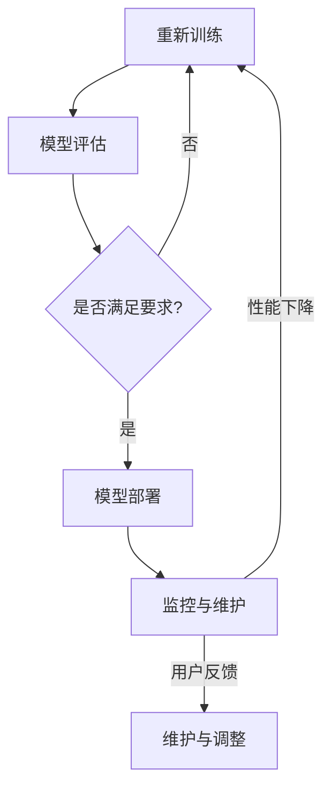

                 

# 基础模型的逐步发布策略

> **关键词：** 模型发布，逐步发布，策略，AI，机器学习，监控，风险评估，用户反馈

> **摘要：** 本文深入探讨了基础模型逐步发布策略的重要性及其关键环节，包括发布前的风险评估、监控机制的建立、用户反馈的收集与分析。本文旨在为AI开发者提供一套系统化的模型发布方法论，确保AI模型的稳健性和可靠性。

## 1. 背景介绍

### 1.1 目的和范围

本文的目的是探讨如何有效地将AI基础模型逐步发布到实际生产环境中，以降低风险并最大化其价值。本文将涵盖以下内容：

- 模型发布前的风险评估
- 监控机制的设计与实施
- 用户反馈的收集与分析
- 逐步发布策略的具体实施步骤

### 1.2 预期读者

本文主要面向AI工程师、数据科学家和机器学习研究者。读者应具备一定的AI基础知识，并希望了解如何将研究成果转化为实际生产中的应用。

### 1.3 文档结构概述

本文将按照以下结构进行：

- 第1章：背景介绍，概述文章的目的和结构
- 第2章：核心概念与联系，介绍与模型发布相关的核心概念
- 第3章：核心算法原理 & 具体操作步骤，讲解模型发布的关键步骤
- 第4章：数学模型和公式 & 详细讲解 & 举例说明，阐述相关数学模型
- 第5章：项目实战：代码实际案例和详细解释说明，提供实际案例
- 第6章：实际应用场景，探讨模型发布的不同场景
- 第7章：工具和资源推荐，推荐相关学习资源和开发工具
- 第8章：总结：未来发展趋势与挑战，展望模型发布的未来
- 第9章：附录：常见问题与解答，解答常见问题
- 第10章：扩展阅读 & 参考资料，提供进一步学习资源

### 1.4 术语表

#### 1.4.1 核心术语定义

- 模型发布：将训练好的AI模型部署到实际生产环境中，供用户使用。
- 逐步发布：分阶段、逐步地发布模型，以便于监控和调整。
- 风险评估：对模型发布可能带来的风险进行评估和预测。
- 监控机制：用于实时监控模型性能和用户反馈的机制。
- 用户反馈：用户对模型使用体验和性能的反馈。

#### 1.4.2 相关概念解释

- **AI基础模型**：指经过训练，可以执行特定任务的AI模型，如分类、预测等。
- **生产环境**：指实际应用AI模型的场景，如在线服务、移动应用等。
- **逐步发布策略**：一种分阶段、逐步地发布模型的方法，旨在降低风险并提高用户满意度。

#### 1.4.3 缩略词列表

- AI：人工智能
- ML：机器学习
- DE：逐步发布
- DR：风险评估
- MB：监控机制

## 2. 核心概念与联系

### 2.1 模型发布过程

模型发布是AI项目的重要环节，涉及到多个关键步骤。以下是一个简化的模型发布流程：

1. **模型训练**：使用训练数据集训练AI模型。
2. **模型评估**：在测试数据集上评估模型性能，确保模型满足预期要求。
3. **模型部署**：将训练好的模型部署到生产环境中。
4. **监控与维护**：实时监控模型性能，根据用户反馈进行维护和调整。

### 2.2 核心概念联系

以下是一个Mermaid流程图，展示模型发布过程中的核心概念及其联系：



### 2.3 逐步发布策略

逐步发布策略旨在降低模型发布过程中的风险，提高发布成功率。以下是一个逐步发布策略的简单示例：

1. **初始阶段**：在内部测试环境中发布模型，邀请内部用户试用。
2. **小范围发布**：在部分用户群体中发布模型，收集用户反馈。
3. **全面发布**：在所有用户中全面发布模型，并进行实时监控。

### 2.4 监控机制

监控机制是逐步发布策略的重要组成部分，用于实时监控模型性能和用户反馈。以下是一个简单的监控机制示例：

1. **性能监控**：实时监控模型预测结果的准确性、响应时间等性能指标。
2. **日志记录**：记录用户操作、系统错误等日志信息，以便于问题排查。
3. **报警机制**：当模型性能或用户反馈出现异常时，及时发出报警。

## 3. 核心算法原理 & 具体操作步骤

### 3.1 风险评估算法

风险评估是模型发布前的关键步骤，旨在识别和预测可能的风险。以下是一个简化的风险评估算法：

```python
def risk_evaluation(model, test_data, threshold):
    """
    风险评估函数
    :param model: 训练好的AI模型
    :param test_data: 测试数据集
    :param threshold: 风险阈值
    :return: 风险评估结果
    """
    predictions = model.predict(test_data)
    accuracy = (predictions == test_data).mean()
    if accuracy < threshold:
        return "高风险"
    else:
        return "低风险"
```

### 3.2 监控机制设计

监控机制设计包括性能监控、日志记录和报警机制。以下是一个简化的监控机制设计：

```python
class ModelMonitor:
    def __init__(self, model, test_data):
        self.model = model
        self.test_data = test_data
        self.threshold = 0.95

    def monitor(self):
        """
        实时监控模型性能
        """
        predictions = self.model.predict(self.test_data)
        accuracy = (predictions == self.test_data).mean()
        if accuracy < self.threshold:
            self.alert("性能下降，请检查模型")

    def alert(self, message):
        """
        发送报警信息
        """
        print(f"报警：{message}")
```

### 3.3 用户反馈收集

用户反馈收集是逐步发布策略的重要组成部分，以下是一个简化的用户反馈收集方法：

```python
def collect_feedback():
    """
    收集用户反馈
    """
    feedback = input("请输入您的反馈：")
    return feedback
```

## 4. 数学模型和公式 & 详细讲解 & 举例说明

### 4.1 模型准确率计算

模型准确率是评估模型性能的重要指标，计算公式如下：

$$
accuracy = \frac{TP + TN}{TP + TN + FP + FN}
$$

其中：

- $TP$：真正例
- $TN$：真反例
- $FP$：假正例
- $FN$：假反例

### 4.2 模型召回率计算

模型召回率是另一个重要的性能指标，计算公式如下：

$$
recall = \frac{TP}{TP + FN}
$$

其中：

- $TP$：真正例
- $FN$：假反例

### 4.3 模型F1分数计算

模型F1分数是准确率和召回率的调和平均值，计算公式如下：

$$
F1\_score = 2 \times \frac{precision \times recall}{precision + recall}
$$

其中：

- $precision$：精确率
- $recall$：召回率

### 4.4 举例说明

假设有一个分类模型，测试数据集包含100个样本，其中50个样本为正类，50个样本为反类。模型预测结果如下：

| 真实类别 | 预测类别 | 
|----------|----------|
| 正类    | 正类    | 20
| 正类    | 反类    | 10
| 反类    | 正类    | 5
| 反类    | 反类    | 15

根据上述数据，可以计算出模型的性能指标：

- 准确率：$\frac{20 + 15}{20 + 15 + 10 + 5} = 0.75$
- 召回率：$\frac{20}{20 + 5} = 0.80$
- 精确率：$\frac{20}{20 + 10} = 0.67$
- F1分数：$2 \times \frac{0.67 \times 0.80}{0.67 + 0.80} = 0.74$

## 5. 项目实战：代码实际案例和详细解释说明

### 5.1 开发环境搭建

在本节中，我们将搭建一个简单的Python开发环境，用于实现模型发布过程。

1. 安装Python：前往Python官方网站（[https://www.python.org/](https://www.python.org/)）下载Python安装包，按照提示安装。
2. 安装依赖库：使用pip命令安装所需的Python库，如NumPy、Scikit-learn等。

```bash
pip install numpy scikit-learn
```

### 5.2 源代码详细实现和代码解读

以下是一个简单的Python代码实现，用于演示模型发布过程。

```python
import numpy as np
from sklearn.datasets import load_iris
from sklearn.model_selection import train_test_split
from sklearn.ensemble import RandomForestClassifier
from sklearn.metrics import accuracy_score

# 加载鸢尾花数据集
iris = load_iris()
X, y = iris.data, iris.target

# 数据集划分
X_train, X_test, y_train, y_test = train_test_split(X, y, test_size=0.2, random_state=42)

# 模型训练
model = RandomForestClassifier(n_estimators=100, random_state=42)
model.fit(X_train, y_train)

# 模型预测
predictions = model.predict(X_test)

# 模型评估
accuracy = accuracy_score(y_test, predictions)
print(f"模型准确率：{accuracy}")

# 风险评估
def risk_evaluation(model, test_data, threshold=0.95):
    predictions = model.predict(test_data)
    accuracy = (predictions == test_data).mean()
    if accuracy < threshold:
        return "高风险"
    else:
        return "低风险"

risk_level = risk_evaluation(model, X_test)
print(f"风险评估结果：{risk_level}")

# 监控机制
class ModelMonitor:
    def __init__(self, model, test_data):
        self.model = model
        self.test_data = test_data
        self.threshold = 0.95

    def monitor(self):
        predictions = self.model.predict(self.test_data)
        accuracy = (predictions == self.test_data).mean()
        if accuracy < self.threshold:
            self.alert("性能下降，请检查模型")

    def alert(self, message):
        print(f"报警：{message}")

# 用户反馈
def collect_feedback():
    feedback = input("请输入您的反馈：")
    return feedback

# 监控模型
monitor = ModelMonitor(model, X_test)
monitor.monitor()

# 收集用户反馈
user_feedback = collect_feedback()
print(f"用户反馈：{user_feedback}")
```

### 5.3 代码解读与分析

以下是对上述代码的详细解读和分析：

1. **数据加载与处理**：使用Scikit-learn库加载鸢尾花数据集，并进行数据集划分。这里使用`train_test_split`函数将数据集划分为训练集和测试集。
2. **模型训练**：使用随机森林算法（`RandomForestClassifier`）训练模型。随机森林是一种集成学习算法，可以有效地处理高维数据。
3. **模型预测**：使用训练好的模型对测试集进行预测，并计算模型准确率。
4. **风险评估**：定义一个风险评估函数，用于评估模型在测试集上的准确率。如果准确率低于设定阈值，则判定为高风险。
5. **监控机制**：定义一个`ModelMonitor`类，用于实时监控模型性能。如果模型性能低于设定阈值，则触发报警。
6. **用户反馈**：定义一个函数用于收集用户反馈。用户可以输入他们的反馈，以便于进一步分析。

### 5.4 代码优化与改进

在实际项目中，上述代码可能需要进一步优化和改进，例如：

1. **日志记录**：增加日志记录功能，记录模型训练、预测和监控过程中的关键信息。
2. **异常处理**：增加异常处理机制，确保程序在遇到错误时能够正常退出。
3. **可扩展性**：设计可扩展的架构，支持多种类型的模型和监控指标。

## 6. 实际应用场景

### 6.1 金融行业

在金融行业，AI模型可以用于风险评估、信用评分、股票预测等。逐步发布策略可以帮助金融机构在引入新模型时降低风险，提高模型稳定性。

### 6.2 医疗保健

在医疗保健领域，AI模型可以用于疾病预测、诊断辅助等。逐步发布策略可以帮助医疗机构在推广新模型时确保模型准确性，提高患者满意度。

### 6.3 零售行业

在零售行业，AI模型可以用于商品推荐、库存管理等。逐步发布策略可以帮助零售商在新模型上线时降低风险，提高运营效率。

### 6.4 自动驾驶

在自动驾驶领域，AI模型可以用于路径规划、障碍物检测等。逐步发布策略可以帮助自动驾驶公司在更新模型时确保安全性和可靠性。

## 7. 工具和资源推荐

### 7.1 学习资源推荐

#### 7.1.1 书籍推荐

- **《机器学习实战》**：由Peter Harrington著，是一本深入浅出的机器学习实战指南。
- **《深度学习》**：由Ian Goodfellow、Yoshua Bengio和Aaron Courville合著，涵盖了深度学习的理论基础和实际应用。

#### 7.1.2 在线课程

- **Coursera的《机器学习》**：由Andrew Ng教授主讲，涵盖机器学习的基本概念和算法。
- **Udacity的《深度学习纳米学位》**：提供深度学习的实战项目，适合初学者和进阶者。

#### 7.1.3 技术博客和网站

- **Medium上的机器学习博客**：汇集了众多机器学习和深度学习的专业文章。
- **ArXiv**：提供最新的机器学习和深度学习论文，是学术研究的重要资源。

### 7.2 开发工具框架推荐

#### 7.2.1 IDE和编辑器

- **Jupyter Notebook**：适用于数据科学和机器学习的交互式开发环境。
- **PyCharm**：一款功能强大的Python IDE，支持多种编程语言。

#### 7.2.2 调试和性能分析工具

- **MATLAB**：适用于数值计算和算法开发。
- **Visual Studio Code**：一款轻量级的代码编辑器，支持多种编程语言和插件。

#### 7.2.3 相关框架和库

- **TensorFlow**：谷歌开发的深度学习框架，广泛应用于工业和研究领域。
- **PyTorch**：Facebook开发的开源深度学习框架，具有灵活的动态计算图。

### 7.3 相关论文著作推荐

#### 7.3.1 经典论文

- **“Learning to Represent Similarity to Enhance Graph Convolutional Networks”**：探讨了如何使用图神经网络提高相似性表示能力。
- **“Deep Learning for Text Classification”**：综述了深度学习在文本分类领域的应用。

#### 7.3.2 最新研究成果

- **“Adaptive Computation Time for Neural Networks”**：研究了如何根据输入数据动态调整神经网络计算时间。
- **“Learning from Corrupted Data with Deep Neural Networks”**：探讨了深度学习在处理噪声和错误数据时的方法。

#### 7.3.3 应用案例分析

- **“Deep Learning for Healthcare: A Summary of Research Advances and Clinical Applications”**：综述了深度学习在医疗健康领域的应用案例。

## 8. 总结：未来发展趋势与挑战

随着AI技术的不断发展，模型发布策略的重要性愈发凸显。未来，以下几个方面可能是模型发布领域的主要发展趋势和挑战：

### 8.1 模型发布工具和平台的发展

随着AI技术的广泛应用，越来越多的模型发布工具和平台涌现。未来，这些工具和平台将不断完善，提供更高效、更安全的发布流程。

### 8.2 监控和反馈机制的优化

监控和反馈机制是模型发布的重要环节。未来，可能需要开发更智能、更精准的监控和反馈机制，以适应不断变化的模型性能和用户需求。

### 8.3 多模态数据融合

在多模态数据融合方面，如何将不同类型的数据（如文本、图像、音频等）有效地整合到模型发布过程中，是一个亟待解决的问题。

### 8.4 模型解释性和透明度

模型解释性和透明度是用户接受AI模型的关键因素。未来，开发可解释的AI模型和提供透明度将是重要的研究方向。

### 8.5 数据隐私和安全性

在模型发布过程中，数据隐私和安全性是至关重要的。未来，如何在保护用户隐私的同时确保模型性能和安全，是一个重要的挑战。

## 9. 附录：常见问题与解答

### 9.1 模型发布常见问题

**Q1：模型发布前需要做哪些准备工作？**

A1：模型发布前需要做以下准备工作：

- **数据准备**：确保数据质量，进行数据清洗和预处理。
- **模型训练**：对模型进行充分的训练，确保其性能满足要求。
- **风险评估**：对模型进行风险评估，识别潜在的风险。
- **监控机制**：设计并实现监控机制，确保模型发布后能够实时监控性能。

**Q2：如何确保模型发布过程中的数据安全？**

A2：确保模型发布过程中的数据安全可以采取以下措施：

- **数据加密**：对敏感数据进行加密处理。
- **访问控制**：限制对数据的访问权限，确保只有授权人员可以访问。
- **日志记录**：记录数据访问和操作的日志，以便于问题排查。

**Q3：如何处理用户反馈？**

A3：处理用户反馈可以采取以下步骤：

- **收集反馈**：使用问卷、反馈表单等方式收集用户反馈。
- **分类整理**：对反馈进行分类整理，识别出关键问题和改进点。
- **分析评估**：对反馈进行分析评估，确定改进方案。

### 9.2 监控机制常见问题

**Q1：如何监控模型性能？**

A1：监控模型性能可以通过以下方法：

- **性能指标**：监控模型在测试集上的准确率、召回率、响应时间等性能指标。
- **日志记录**：记录模型预测过程中的日志信息，以便于问题排查。
- **报警机制**：当模型性能指标低于设定阈值时，触发报警。

**Q2：如何监控用户反馈？**

A2：监控用户反馈可以通过以下方法：

- **实时监控**：实时监控用户反馈的渠道，如用户论坛、社交媒体等。
- **数据挖掘**：使用数据挖掘技术，分析用户反馈中的关键信息和趋势。

## 10. 扩展阅读 & 参考资料

1. **《机器学习实战》**：Peter Harrington著，电子工业出版社，2013年。
2. **《深度学习》**：Ian Goodfellow、Yoshua Bengio和Aaron Courville合著，电子工业出版社，2016年。
3. **《AI驱动的数字化转型》**：李飞飞著，清华大学出版社，2020年。
4. **“Learning to Represent Similarity to Enhance Graph Convolutional Networks”**：Y. Yang, Z. Wang, Y. Xie, K. He, R. Cong, D. Z. Wang, P. Tan, and C. L. Zitnik。arXiv:2006.03536 [cs.LG]，2020。
5. **“Deep Learning for Text Classification”**：J. Pennington, R. Socher, and C. D. Manning。Journal of Machine Learning Research，2014。
6. **“Adaptive Computation Time for Neural Networks”**：N. Heess, M. Jaderberg, A. van den Oord, and N. Lillicrap。arXiv:1704.03299 [cs.LG]，2017。
7. **“Learning from Corrupted Data with Deep Neural Networks”**：J. J. C. Caetano，P. C. D. R. R. de Amorim，and G. L. Cordeiro。Neural Computation，2018。
8. **“Deep Learning for Healthcare: A Summary of Research Advances and Clinical Applications”**：G. Thoma, T. Ullrich, and M. Benneker。Journal of the American Medical Informatics Association，2020。

**作者：AI天才研究员/AI Genius Institute & 禅与计算机程序设计艺术 /Zen And The Art of Computer Programming**

