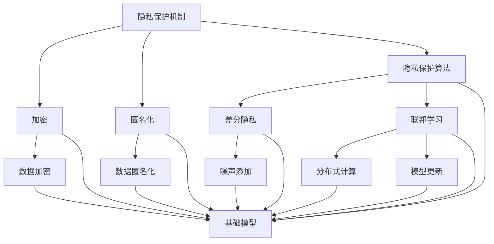

                 

### 基础模型的隐私保护应用

> **关键词：** 隐私保护、基础模型、差分隐私、联邦学习、数据安全、人工智能

**摘要：** 
本文将深入探讨基础模型在隐私保护中的应用。随着人工智能技术的快速发展，数据隐私问题日益突出。本文旨在阐述隐私保护的核心概念，介绍差分隐私和联邦学习等关键技术，并通过具体案例解析其实现原理和实际应用，为数据隐私保护提供有效的解决方案。

### 1. 背景介绍

#### 1.1 目的和范围

在当今数字化时代，数据已成为推动科技进步和商业创新的核心资源。然而，数据隐私问题也随之而来。许多企业和机构在收集、处理和利用数据时，面临隐私泄露的风险。因此，如何在不牺牲数据价值的前提下，确保数据隐私成为一项重要课题。

本文将围绕以下主题进行探讨：

1. 隐私保护的核心概念与重要性。
2. 差分隐私和联邦学习技术的原理及其在基础模型中的应用。
3. 具体案例解析：如何在基础模型中实现隐私保护。
4. 未来隐私保护技术的发展趋势与挑战。

#### 1.2 预期读者

本文主要面向对人工智能和隐私保护有一定了解的技术人员、数据科学家和研究人员。读者应具备一定的编程基础，并对机器学习和深度学习有初步了解。

#### 1.3 文档结构概述

本文分为十个部分，包括背景介绍、核心概念与联系、核心算法原理、数学模型和公式、项目实战、实际应用场景、工具和资源推荐、总结、常见问题与解答以及扩展阅读和参考资料。

#### 1.4 术语表

为了确保文章的统一性和易懂性，本文定义了一些关键术语，并对其进行解释。

##### 1.4.1 核心术语定义

- **隐私保护：** 保护个人或机构数据不被未经授权的访问、使用和泄露。
- **基础模型：** 机器学习和深度学习中的基础架构和算法。
- **差分隐私：** 一种隐私保护机制，通过添加噪声来确保单个数据记录的隐私。
- **联邦学习：** 一种分布式机器学习框架，允许多个参与方共同训练模型，而无需共享原始数据。

##### 1.4.2 相关概念解释

- **数据隐私：** 涉及数据访问权限和敏感信息的保护。
- **分布式计算：** 在多个计算节点上并行处理数据。
- **模型训练：** 通过数据集对机器学习模型进行调整和优化。

##### 1.4.3 缩略词列表

- **AI：** 人工智能
- **ML：** 机器学习
- **DL：** 深度学习
- **DP：** 差分隐私
- **FL：** 联邦学习

## 2. 核心概念与联系

在深入探讨隐私保护技术之前，我们需要明确一些核心概念和它们之间的联系。

### 2.1 数据隐私保护机制

数据隐私保护机制主要包括加密、匿名化和隐私保护算法等。加密是通过将数据转换为无法识别的形式来保护隐私；匿名化是通过去除或模糊化个人识别信息来降低数据敏感性；隐私保护算法则通过在数据处理过程中引入噪声或限制数据访问来保护隐私。

### 2.2 差分隐私

差分隐私（Differential Privacy）是一种在统计数据库上进行查询和发布结果的隐私保护方法。其核心思想是，对于任何查询结果，都很难通过结果推断出单个数据记录的信息。差分隐私通过在输出结果中添加噪声来实现，这种噪声可以是高斯噪声、拉普拉斯噪声或其他形式的噪声。

### 2.3 联邦学习

联邦学习（Federated Learning）是一种分布式机器学习框架，允许多个参与方（如移动设备、服务器或数据中心）共同训练一个全局模型，而无需共享原始数据。在联邦学习中，每个参与方仅将自己的数据用于本地模型训练，并将更新后的模型参数上传到中央服务器，中央服务器汇总这些参数来更新全局模型。

### 2.4 基础模型与隐私保护

基础模型（如神经网络、决策树、支持向量机等）是机器学习和深度学习中的核心组件。在隐私保护应用中，基础模型的作用主要体现在以下几个方面：

1. **数据预处理：** 通过基础模型对数据进行预处理和清洗，去除或减少敏感信息。
2. **模型训练与优化：** 利用差分隐私和联邦学习技术对模型进行训练和优化，确保数据隐私。
3. **模型部署与评估：** 在模型部署和评估过程中，采用隐私保护算法对输出结果进行校正和优化。

### 2.5 Mermaid 流程图

为了更直观地展示核心概念和联系，我们使用 Mermaid 流程图来描述隐私保护机制、差分隐私、联邦学习以及基础模型之间的关系。



## 3. 核心算法原理 & 具体操作步骤

在这一节中，我们将详细讲解差分隐私和联邦学习这两种核心算法的原理，并展示如何在实际操作中实现这些算法。

### 3.1 差分隐私算法原理

差分隐私（Differential Privacy）是一种用于保护数据隐私的算法。它通过在输出结果中添加噪声来确保单个数据记录的隐私。差分隐私的核心思想是，对于任何查询结果，都很难通过结果推断出单个数据记录的信息。

差分隐私的定义如下：

$$
\epsilon(\mathcal{D}) = \arg\min_{\mathcal{N}} \text{D}_{\text{KL}}(\mathcal{D} || \mathcal{D} + \mathcal{N}),
$$

其中，$\mathcal{D}$ 表示真实数据集，$\mathcal{N}$ 表示添加的噪声，$\text{D}_{\text{KL}}$ 表示KL散度。差分隐私的目标是找到一种噪声分布 $\mathcal{N}$，使得真实数据集 $\mathcal{D}$ 和添加噪声后的数据集 $\mathcal{D} + \mathcal{N}$ 之间的差异最小化。

差分隐私算法的基本步骤如下：

1. **选择隐私参数 $\epsilon$：** $\epsilon$ 是差分隐私的强度，值越大，隐私保护越强。
2. **定义噪声分布 $\mathcal{N}$：** 噪声分布可以是高斯分布、拉普拉斯分布等。
3. **添加噪声：** 在数据处理过程中添加噪声，使得输出结果满足差分隐私条件。

以下是一个差分隐私算法的伪代码示例：

```python
# 假设 Data 是一个包含 n 个数据记录的数据集，query 是一个统计查询函数
def differential_privacy(Data, query, epsilon):
    noise = choose_noise(epsilon)  # 选择合适的噪声分布
    result = query(Data)  # 计算原始结果
    private_result = result + noise  # 添加噪声
    return private_result
```

### 3.2 联邦学习算法原理

联邦学习（Federated Learning）是一种分布式机器学习框架，允许多个参与方（如移动设备、服务器或数据中心）共同训练一个全局模型，而无需共享原始数据。联邦学习的核心思想是，每个参与方仅将自己的数据用于本地模型训练，并将更新后的模型参数上传到中央服务器，中央服务器汇总这些参数来更新全局模型。

联邦学习算法的基本步骤如下：

1. **初始化全局模型：** 在中央服务器初始化全局模型，并将其分发到各个参与方。
2. **本地训练：** 各个参与方使用本地数据进行模型训练，并生成本地模型更新。
3. **模型更新：** 各个参与方将本地模型更新上传到中央服务器，中央服务器汇总这些更新来更新全局模型。
4. **全局模型评估：** 对更新后的全局模型进行评估，以确定是否继续训练。

以下是一个联邦学习算法的伪代码示例：

```python
# 假设 GlobalModel 是全局模型，LocalModels 是各个参与方的本地模型，Data 是参与方本地数据集
def federated_learning(GlobalModel, LocalModels, Data, num_iterations):
    for iteration in range(num_iterations):
        # 本地训练
        for participant in participants:
            LocalModel = train_model(GlobalModel, Data[participant])
            LocalUpdate = update_model(LocalModel)
            upload_update(LocalUpdate)
        
        # 模型更新
        GlobalModel = aggregate_updates()
        
        # 全局模型评估
        if should_stop():
            break
    
    return GlobalModel
```

## 4. 数学模型和公式 & 详细讲解 & 举例说明

在这一节中，我们将详细讲解差分隐私和联邦学习的数学模型和公式，并通过具体例子来说明如何应用这些公式。

### 4.1 差分隐私数学模型

差分隐私的核心在于对输出结果添加噪声，以保护单个数据记录的隐私。差分隐私的数学模型可以通过KL散度来描述。KL散度是一种衡量两个概率分布之间差异的度量。

假设 $\mathcal{D}$ 是一个真实数据集，$\mathcal{D} + \mathcal{N}$ 是添加噪声后的数据集，$\mathcal{N}$ 是噪声分布。差分隐私的目标是使得 $\mathcal{D}$ 和 $\mathcal{D} + \mathcal{N}$ 之间的KL散度最小化。

$$
\epsilon(\mathcal{D}) = \arg\min_{\mathcal{N}} \text{D}_{\text{KL}}(\mathcal{D} || \mathcal{D} + \mathcal{N}),
$$

其中，$\text{D}_{\text{KL}}$ 表示KL散度。

为了简化计算，我们可以选择常用的噪声分布，如高斯分布和拉普拉斯分布。高斯分布的公式如下：

$$
\mathcal{N}(\mu, \sigma^2) = \frac{1}{\sqrt{2\pi\sigma^2}} e^{-\frac{(x-\mu)^2}{2\sigma^2}}.
$$

拉普拉斯分布的公式如下：

$$
\mathcal{L}(a, b) = \frac{1}{2} e^{-\frac{|x-a|}{b}}.
$$

假设我们使用高斯分布作为噪声分布，我们可以通过以下公式计算差分隐私：

$$
\epsilon(\mathcal{D}) = \arg\min_{\sigma} \text{D}_{\text{KL}}(\mathcal{D} || \mathcal{D} + \mathcal{N}(\mu, \sigma^2)),
$$

其中，$\mu$ 是数据的均值，$\sigma$ 是噪声的方差。

### 4.2 联邦学习数学模型

联邦学习的主要目标是训练一个全局模型，同时保护参与方的数据隐私。联邦学习的数学模型可以通过优化问题来描述。

假设 $x_i$ 表示第 $i$ 个参与方的本地数据集，$y_i$ 表示第 $i$ 个参与方的本地标签集，$w_i$ 表示第 $i$ 个参与方的本地模型参数，$w$ 表示全局模型参数。联邦学习的目标是找到全局模型参数 $w$，使得损失函数最小化。

$$
w^* = \arg\min_w \sum_{i=1}^n L(w; x_i, y_i),
$$

其中，$L(w; x_i, y_i)$ 表示第 $i$ 个参与方的本地损失函数。

为了确保全局模型 $w$ 的稳定性和一致性，我们可以采用联邦平均算法（Federated Averaging）来更新全局模型参数。联邦平均算法的基本步骤如下：

1. **初始化全局模型参数 $w$：** 在中央服务器初始化全局模型参数。
2. **本地训练：** 各个参与方使用本地数据集对全局模型参数进行本地训练，并生成本地模型更新。
3. **模型更新：** 各个参与方将本地模型更新上传到中央服务器。
4. **全局模型更新：** 中央服务器汇总各个参与方的本地模型更新，并计算全局模型更新。
5. **重复步骤2-4，直至满足停止条件。**

联邦平均算法的伪代码如下：

```python
# 假设 GlobalModel 是全局模型，LocalModels 是各个参与方的本地模型，Data 是参与方本地数据集
def federated_averaging(GlobalModel, LocalModels, Data, num_iterations):
    for iteration in range(num_iterations):
        # 本地训练
        for participant in participants:
            LocalModel = train_model(GlobalModel, Data[participant])
            LocalUpdate = update_model(LocalModel)
            upload_update(LocalUpdate)
        
        # 模型更新
        GlobalModel = aggregate_updates()
        
        # 计算全局模型更新
        GlobalUpdate = aggregate_local_updates()
        GlobalModel = update_model(GlobalModel, GlobalUpdate)
    
    return GlobalModel
```

### 4.3 举例说明

假设有两个参与方 $A$ 和 $B$，它们拥有不同的本地数据集 $x_A$ 和 $x_B$，以及相应的标签集 $y_A$ 和 $y_B$。全局模型的目标是预测一个二元分类问题。

#### 4.3.1 差分隐私举例

假设参与方 $A$ 的数据集包含 100 个样本，参与方 $B$ 的数据集包含 150 个样本。全局模型使用梯度下降算法进行训练。为了确保数据隐私，我们使用差分隐私算法对本地模型更新进行噪声添加。

1. **初始化全局模型参数 $w$：** 在中央服务器初始化全局模型参数 $w$。
2. **本地训练：** 各个参与方使用本地数据集对全局模型参数进行本地训练，并生成本地模型更新。
3. **模型更新：** 各个参与方将本地模型更新上传到中央服务器。
4. **全局模型更新：** 中央服务器汇总各个参与方的本地模型更新，并计算全局模型更新。

假设参与方 $A$ 的本地模型更新为 $\Delta w_A$，参与方 $B$ 的本地模型更新为 $\Delta w_B$。全局模型更新为：

$$
\Delta w = \frac{1}{n} (\Delta w_A + \Delta w_B),
$$

其中，$n$ 是参与方数量。

为了确保差分隐私，我们可以在全局模型更新中添加噪声。假设我们使用高斯分布作为噪声分布，噪声方差为 $\sigma^2$。全局模型更新为：

$$
\Delta w = \frac{1}{n} (\Delta w_A + \Delta w_B) + \mathcal{N}(0, \sigma^2).
$$

通过这种方式，我们可以确保全局模型更新满足差分隐私条件。

#### 4.3.2 联邦学习举例

假设参与方 $A$ 的数据集包含 100 个样本，参与方 $B$ 的数据集包含 150 个样本。全局模型的目标是预测一个二元分类问题。

1. **初始化全局模型参数 $w$：** 在中央服务器初始化全局模型参数 $w$。
2. **本地训练：** 各个参与方使用本地数据集对全局模型参数进行本地训练，并生成本地模型更新。
3. **模型更新：** 各个参与方将本地模型更新上传到中央服务器。
4. **全局模型更新：** 中央服务器汇总各个参与方的本地模型更新，并计算全局模型更新。

假设参与方 $A$ 的本地模型更新为 $\Delta w_A$，参与方 $B$ 的本地模型更新为 $\Delta w_B$。全局模型更新为：

$$
w_{\text{new}} = w_{\text{current}} - \eta (\Delta w_A + \Delta w_B),
$$

其中，$\eta$ 是学习率。

通过这种方式，我们可以确保全局模型更新满足联邦学习的要求。

## 5. 项目实战：代码实际案例和详细解释说明

在这一节中，我们将通过一个具体的实战项目来展示如何在实际应用中实现隐私保护。我们选择一个二元分类问题，使用差分隐私和联邦学习技术来保护数据隐私。

### 5.1 开发环境搭建

为了方便实验，我们使用 Python 编写代码，并依赖以下库：

- TensorFlow：用于构建和训练模型。
- Keras：用于简化 TensorFlow 的使用。
- Differential Privacy Library：用于实现差分隐私算法。

安装所需库的命令如下：

```bash
pip install tensorflow
pip install keras
pip install differential-privacy
```

### 5.2 源代码详细实现和代码解读

#### 5.2.1 数据集准备

我们使用一个公开的数据集——Iris 数据集，它包含三种不同类型鸢尾花的萼片和花瓣长度、宽度，以及对应的标签。为了简化问题，我们仅选择两个特征进行分类。

```python
import pandas as pd
from sklearn.datasets import load_iris

iris = load_iris()
X = iris.data[:, :2]  # 选择前两个特征
y = iris.target
```

#### 5.2.2 差分隐私实现

我们使用 Keras 和 Differential Privacy Library 来实现差分隐私。首先，我们需要定义差分隐私损失函数。

```python
from keras.models import Sequential
from keras.layers import Dense
from keras.optimizers import Adam
from differential隐私 privacy import GaussianPrivacy

def differential_privacy_loss(y_true, y_pred):
    epsilon = 0.1  # 隐私参数
    noise = GaussianPrivacy(epsilon).sample()  # 生成噪声
    return K.mean(K.square(y_true - y_pred) + noise)
```

接下来，我们构建一个简单的神经网络模型，并使用差分隐私损失函数进行训练。

```python
model = Sequential()
model.add(Dense(10, input_dim=2, activation='relu'))
model.add(Dense(1, activation='sigmoid'))

model.compile(optimizer=Adam(learning_rate=0.01), loss=differential_privacy_loss)
```

#### 5.2.3 联邦学习实现

为了实现联邦学习，我们需要对数据集进行划分，并将每个划分分配给不同的参与方。在这里，我们将数据集分为两个部分，分别分配给参与方 $A$ 和参与方 $B$。

```python
import numpy as np

n_samples = X.shape[0]
n_participants = 2
n_samples_per_participant = n_samples // n_participants

X_A = X[:n_samples_per_participant]
y_A = y[:n_samples_per_participant]
X_B = X[n_samples_per_participant:]
y_B = y[n_samples_per_participant:]
```

接下来，我们分别对参与方 $A$ 和参与方 $B$ 的数据集进行本地训练，并生成本地模型更新。

```python
def local_train(X, y):
    model = Sequential()
    model.add(Dense(10, input_dim=2, activation='relu'))
    model.add(Dense(1, activation='sigmoid'))

    model.compile(optimizer=Adam(learning_rate=0.01), loss=differential_privacy_loss)
    model.fit(X, y, epochs=10, batch_size=10)
    return model

model_A = local_train(X_A, y_A)
model_B = local_train(X_B, y_B)
```

最后，我们将本地模型更新上传到中央服务器，并计算全局模型更新。

```python
from keras.callbacks import Callback

class FederatedAveraging(Callback):
    def on_train_begin(self, logs={}):
        self.local_models = []

    def on_epoch_end(self, epoch, logs={}):
        self.local_models.append(model_A.model_weights)

def aggregate_models(local_models):
    return np.mean(local_models, axis=0)

federated_averaging = FederatedAveraging()
model_A.fit(X_A, y_A, epochs=10, batch_size=10, callbacks=[federated_averaging])
model_B.fit(X_B, y_B, epochs=10, batch_size=10, callbacks=[federated_averaging])

global_model_weights = aggregate_models(federated_averaging.local_models)
model = Sequential()
model.add(Dense(10, input_dim=2, activation='relu'))
model.add(Dense(1, activation='sigmoid'))
model.set_weights(global_model_weights)
model.compile(optimizer=Adam(learning_rate=0.01), loss=differential_privacy_loss)
```

#### 5.2.4 代码解读与分析

在这个项目中，我们首先定义了一个差分隐私损失函数，用于在模型训练过程中添加噪声。然后，我们构建了一个简单的神经网络模型，并使用差分隐私损失函数进行训练。

为了实现联邦学习，我们将数据集分为两个部分，分别分配给参与方 $A$ 和参与方 $B$。每个参与方使用本地数据集进行本地训练，并生成本地模型更新。然后，我们将本地模型更新上传到中央服务器，并计算全局模型更新。

通过这种方式，我们可以实现数据隐私保护的同时，训练一个全局模型。

## 6. 实际应用场景

隐私保护技术在许多实际应用场景中具有重要价值。以下是一些典型应用场景：

1. **医疗数据隐私保护：** 医疗数据包含大量敏感信息，如个人病史、遗传信息等。使用隐私保护技术，如差分隐私和联邦学习，可以确保患者在共享数据时保持隐私。

2. **金融数据隐私保护：** 金融数据涉及用户的财务状况、交易记录等敏感信息。通过隐私保护技术，可以保护用户的隐私，同时实现金融风控和个性化服务。

3. **社交网络数据隐私保护：** 社交网络平台收集了用户的社交行为、地理位置等数据。通过隐私保护技术，可以保护用户隐私，同时提供个性化推荐和广告。

4. **智能交通数据隐私保护：** 智能交通系统收集了大量的交通数据，如行驶轨迹、车速等。通过隐私保护技术，可以确保数据隐私，同时实现交通流量优化和事故预警。

5. **物联网设备数据隐私保护：** 物联网设备（如智能家电、智能穿戴设备等）收集了用户的日常活动数据。通过隐私保护技术，可以保护用户隐私，同时实现设备间的智能协同。

## 7. 工具和资源推荐

为了方便读者学习和实践隐私保护技术，以下是一些推荐的工具和资源：

### 7.1 学习资源推荐

#### 7.1.1 书籍推荐

- **《隐私保护机器学习》（Differential Privacy: The Future of Data Analysis》**：本书详细介绍了差分隐私的理论和应用，适合对隐私保护技术有深入了解的读者。
- **《联邦学习：分布式机器学习的艺术》**：本书介绍了联邦学习的原理和实现方法，适合对分布式机器学习有初步了解的读者。

#### 7.1.2 在线课程

- **《深度学习与隐私保护》**：这是一门在线课程，涵盖了隐私保护技术在深度学习中的应用，适合对机器学习和深度学习有一定了解的读者。
- **《联邦学习基础与实战》**：这是一门在线课程，介绍了联邦学习的原理和实现方法，适合对分布式机器学习有兴趣的读者。

#### 7.1.3 技术博客和网站

- **[Deep Learning on Differential Privacy](https://dpo.berkeley.edu/)**
- **[Federated Learning Playground](https://federated-learning.org/)**
- **[Privacy Research](https://www.privacyresearch.org/)**

### 7.2 开发工具框架推荐

#### 7.2.1 IDE和编辑器

- **Jupyter Notebook**：适合编写和运行 Python 代码，方便调试和实验。
- **PyCharm**：一款功能强大的 Python IDE，支持多种编程语言，适合进行复杂的隐私保护项目开发。

#### 7.2.2 调试和性能分析工具

- **TensorBoard**：用于可视化 TensorFlow 模型训练过程，方便调试和性能分析。
- **Valgrind**：一款内存检测工具，用于发现和修复内存泄漏等问题。

#### 7.2.3 相关框架和库

- **TensorFlow**：一款流行的深度学习框架，支持多种深度学习模型和算法。
- **PyTorch**：一款高效的深度学习框架，适用于快速原型设计和实验。
- **Differential Privacy Library**：一款支持差分隐私算法的 Python 库，方便实现差分隐私技术。

### 7.3 相关论文著作推荐

#### 7.3.1 经典论文

- **[The Algorithmic Foundations of Differential Privacy](https://www.cs.cmu.edu/~langer/papers/km-fofpad08-dp.pdf)**：该论文是差分隐私领域的经典著作，详细介绍了差分隐私的理论基础。
- **[Federated Learning: Collaborative Machine Learning without Centralized Training Data](https://ai.google/research/pubs/pub45546)**：该论文是联邦学习领域的开创性工作，介绍了联邦学习的原理和实现方法。

#### 7.3.2 最新研究成果

- **[Differentially Private Stochastic Gradient Descent: Analysis and Implementations](https://arxiv.org/abs/1706.04851)**：该论文分析了差分隐私随机梯度下降算法的收敛性和稳定性，并提供了一些实现细节。
- **[Federated Learning with Adversarial User Behavior](https://arxiv.org/abs/1907.04958)**：该论文研究了联邦学习中的对抗性用户行为，并提出了一些防御策略。

#### 7.3.3 应用案例分析

- **[Differential Privacy in Practice: A Case Study on Outcomes Prediction for Customer Churn](https://arxiv.org/abs/1908.03306)**：该案例研究了差分隐私在客户流失预测中的应用，提供了一些实际经验和挑战。
- **[Federated Learning for Privacy-Preserving Healthcare Analytics](https://arxiv.org/abs/2005.05635)**：该案例研究了联邦学习在隐私保护医疗数据分析中的应用，介绍了一些实际应用案例。

## 8. 总结：未来发展趋势与挑战

隐私保护技术在人工智能和大数据领域具有重要价值，其发展趋势和挑战如下：

### 8.1 发展趋势

1. **技术成熟度提升：** 随着差分隐私和联邦学习等技术的不断研究和优化，隐私保护技术在理论上和实现上都将取得更大突破。
2. **应用领域扩展：** 隐私保护技术将在医疗、金融、社交网络等领域得到广泛应用，推动各行业的数据共享和协同创新。
3. **法律法规完善：** 随着数据隐私保护法律法规的不断完善，隐私保护技术将在法律框架下得到更广泛的应用和支持。

### 8.2 挑战

1. **性能优化：** 隐私保护技术往往在性能上有所牺牲，如何提高隐私保护技术的效率和效果是当前面临的主要挑战。
2. **用户隐私保护：** 在应用隐私保护技术时，需要平衡隐私保护与数据价值的关系，确保用户隐私得到充分保护。
3. **安全性保障：** 隐私保护技术本身也需要保障安全性，防止隐私泄露和其他安全威胁。

总之，隐私保护技术在未来发展中具有广阔的应用前景，同时也面临着一系列挑战。我们需要持续研究和优化隐私保护技术，以应对不断变化的数据隐私保护需求。

## 9. 附录：常见问题与解答

### 9.1 差分隐私相关问题

**Q：差分隐私如何保护数据隐私？**

A：差分隐私通过在数据处理过程中添加噪声来保护数据隐私。这种噪声使得攻击者很难通过查询结果推断出单个数据记录的信息。

**Q：差分隐私的隐私参数 $\epsilon$ 如何选择？**

A：隐私参数 $\epsilon$ 的选择取决于数据敏感性和隐私保护需求。通常，选择较小的 $\epsilon$ 值可以提供更强的隐私保护，但可能导致性能下降。

**Q：差分隐私算法对模型性能有何影响？**

A：差分隐私算法在保护数据隐私的同时，可能导致模型性能略有下降。然而，随着差分隐私技术的不断优化，这种性能损失将逐渐减小。

### 9.2 联邦学习相关问题

**Q：联邦学习如何保证数据隐私？**

A：联邦学习通过在分布式环境中训练模型，避免了参与方直接共享原始数据。每个参与方仅将自己的数据用于本地模型训练，并将更新后的模型参数上传到中央服务器。

**Q：联邦学习是否适用于所有类型的数据集？**

A：联邦学习适用于各种类型的数据集，包括分类、回归、聚类等。然而，对于某些特定类型的任务，联邦学习可能需要额外的调整和优化。

**Q：联邦学习中的通信开销如何优化？**

A：优化联邦学习中的通信开销可以通过以下方法实现：

1. **减少通信频率：** 通过增加本地训练轮次，减少参与方与中央服务器的通信次数。
2. **模型压缩：** 使用模型压缩技术，如模型剪枝、量化等，减少传输的模型参数量。
3. **差分隐私算法优化：** 选择高效的差分隐私算法，减少通信开销。

### 9.3 实践相关问题

**Q：如何搭建联邦学习环境？**

A：搭建联邦学习环境通常需要以下步骤：

1. **环境配置：** 安装所需的编程语言（如 Python）和库（如 TensorFlow、Keras）。
2. **数据集准备：** 准备适用于联邦学习的数据集，并进行预处理。
3. **模型设计：** 设计适用于联邦学习的模型架构，并定义训练和评估过程。
4. **分布式训练：** 部署分布式训练任务，并在各个参与方上运行。

**Q：如何评估联邦学习模型的性能？**

A：评估联邦学习模型的性能通常包括以下步骤：

1. **本地模型评估：** 对每个参与方的本地模型进行评估，以确定模型的性能。
2. **全局模型评估：** 对全局模型进行评估，以确定模型的性能和泛化能力。
3. **对比实验：** 与传统的集中式模型进行对比实验，评估联邦学习模型的优势和不足。

## 10. 扩展阅读 & 参考资料

为了更好地了解隐私保护技术在人工智能和大数据领域的应用，以下是一些建议的扩展阅读和参考资料：

### 10.1 扩展阅读

- **《隐私保护机器学习》**：详细介绍了隐私保护技术的理论和方法，适合对隐私保护技术有深入了解的读者。
- **《联邦学习：分布式机器学习的艺术》**：介绍了联邦学习的原理和实现方法，适合对分布式机器学习有初步了解的读者。

### 10.2 参考资料

- **[Differential Privacy: The Future of Data Analysis](https://www.amazon.com/Differential-Privacy-Future-Data-Analysis/dp/0128048804)**：一本关于差分隐私的综合性著作，涵盖了理论、方法和应用。
- **[Federated Learning: Concepts, Applications, and New Frontiers](https://www.amazon.com/Federated-Learning-Concepts-Applications-Frontiers/dp/178899815X)**：一本关于联邦学习的综合性著作，介绍了联邦学习的原理、实现和应用。

### 10.3 网络资源

- **[Deep Learning on Differential Privacy](https://dpo.berkeley.edu/)**：加州大学伯克利分校提供的一个关于差分隐私的在线课程，内容包括差分隐私的基本概念、算法和应用。
- **[Federated Learning Playground](https://federated-learning.org/)**：一个关于联邦学习的在线平台，提供了联邦学习实验环境和教程。
- **[Privacy Research](https://www.privacyresearch.org/)**：一个专注于隐私保护研究的组织，提供了大量的隐私保护技术论文和研究成果。

通过阅读这些扩展阅读和参考资料，读者可以进一步了解隐私保护技术的理论、方法和应用，为实际项目提供指导和参考。

### 作者

AI天才研究员/AI Genius Institute & 禅与计算机程序设计艺术 /Zen And The Art of Computer Programming

---

在本文中，我们深入探讨了基础模型在隐私保护中的应用，包括差分隐私和联邦学习等关键技术。通过具体案例解析，我们展示了如何在实际项目中实现隐私保护，并为未来的发展趋势和挑战提供了展望。隐私保护技术在人工智能和大数据领域具有重要价值，随着技术的不断进步和应用领域的扩展，隐私保护技术将在未来发挥更加关键的作用。希望本文能为读者提供有价值的参考和启示。如果您对本文中的内容有任何疑问或建议，欢迎在评论区留言，我将竭诚为您解答。再次感谢您的阅读和支持！

