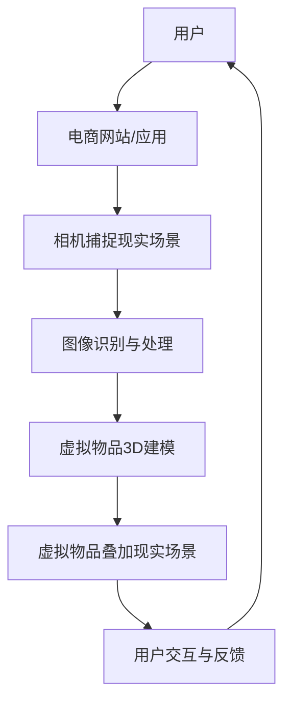

                 

# 增强现实在电商中的应用前景

> **关键词：** 增强现实（AR），电商，用户体验，市场营销，技术趋势

> **摘要：** 本文将探讨增强现实（AR）技术在电商领域中的应用前景，分析其核心原理和操作步骤，并通过实际案例展示其应用效果。同时，文章还将探讨AR在电商中可能面临的挑战和未来发展趋势，为读者提供全面的技术解读和洞察。

## 1. 背景介绍

### 1.1 目的和范围

本文旨在探讨增强现实（AR）技术在电商领域的应用前景，分析其在提升用户体验、市场营销和技术创新方面的潜力。我们将通过介绍AR技术的核心原理、具体操作步骤以及实际应用案例，帮助读者了解AR技术在电商中的实践意义。

### 1.2 预期读者

本文主要面向对电商和增强现实技术感兴趣的读者，包括电商从业者、技术开发者、市场营销人员以及相关领域的研究人员。

### 1.3 文档结构概述

本文将分为以下几个部分：

1. **背景介绍**：概述增强现实技术在电商领域的应用背景和重要性。
2. **核心概念与联系**：介绍增强现实技术的核心原理及其在电商中的应用架构。
3. **核心算法原理与具体操作步骤**：详细讲解增强现实技术的算法原理和实现方法。
4. **数学模型和公式**：分析增强现实技术在电商中涉及的数学模型和公式。
5. **项目实战**：通过实际案例展示增强现实技术在电商中的应用效果。
6. **实际应用场景**：探讨增强现实技术在电商领域的应用场景。
7. **工具和资源推荐**：推荐学习资源、开发工具和框架。
8. **总结**：总结增强现实在电商中的应用前景和未来发展趋势。
9. **附录**：解答常见问题，提供扩展阅读和参考资料。

### 1.4 术语表

#### 1.4.1 核心术语定义

- **增强现实（AR）**：一种将虚拟信息叠加到真实环境中的技术，通过计算机生成的图像、声音和触觉等感官体验增强用户对现实世界的感知。
- **电商**：通过互联网进行商品交易和服务的商业模式，包括在线零售、在线拍卖和在线批发等。
- **用户体验**：用户在使用产品或服务过程中的感受和体验，包括界面设计、交互性和性能等方面。

#### 1.4.2 相关概念解释

- **3D建模**：创建三维模型的过程，用于在增强现实中展示虚拟物品。
- **图像识别**：利用计算机技术识别和分析图像中的信息。
- **追踪技术**：通过摄像头或其他传感器实时跟踪和捕捉现实世界中的物体或场景。

#### 1.4.3 缩略词列表

- **AR**：增强现实（Augmented Reality）
- **VR**：虚拟现实（Virtual Reality）
- **AI**：人工智能（Artificial Intelligence）
- **ML**：机器学习（Machine Learning）
- **API**：应用程序接口（Application Programming Interface）

## 2. 核心概念与联系

在探讨增强现实在电商中的应用之前，我们需要了解其核心概念和原理。以下是一个简化的增强现实技术在电商中的架构流程：



### 2.1 增强现实技术原理

增强现实技术的核心原理包括：

- **图像识别**：利用计算机视觉技术识别现实场景中的物体或特征。
- **3D建模**：通过3D建模技术创建虚拟物品的模型。
- **追踪技术**：通过摄像头或其他传感器实时跟踪虚拟物品的位置和动作。
- **渲染技术**：将虚拟物品叠加到现实场景中，并实时渲染出真实感的效果。

### 2.2 增强现实在电商中的应用架构

增强现实技术在电商中的应用架构包括以下几个关键组成部分：

- **用户界面**：提供用户交互的界面，包括相机捕捉、虚拟物品选择和交互等。
- **图像识别与处理**：实时识别和分析用户拍摄的现实场景，提取关键特征。
- **虚拟物品库**：存储各种虚拟物品的3D模型和相关信息。
- **虚拟物品叠加与渲染**：将虚拟物品叠加到现实场景中，并进行实时渲染。
- **用户交互与反馈**：用户通过界面与虚拟物品进行交互，并获得实时反馈。

## 3. 核心算法原理 & 具体操作步骤

### 3.1 图像识别与处理算法原理

图像识别与处理是增强现实技术在电商中应用的核心部分，其算法原理主要包括：

- **特征提取**：通过图像处理技术提取现实场景中的关键特征，如边缘、角点、纹理等。
- **匹配与识别**：利用机器学习算法对提取的特征进行匹配和识别，确定场景中的物体或特征。

### 3.2 图像识别与处理算法具体操作步骤

以下是图像识别与处理算法的具体操作步骤：

1. **预处理**：对输入图像进行去噪、对比度增强、图像锐化等预处理操作。
2. **特征提取**：使用图像处理算法提取图像中的关键特征，如使用SIFT、SURF或ORB算法提取角点特征。
3. **特征匹配**：利用最近邻匹配算法或K-最近邻算法对提取的特征进行匹配，确定场景中的物体或特征。
4. **物体识别**：通过分类器或决策树等机器学习算法对匹配结果进行分类，识别出场景中的物体或特征。

### 3.3 伪代码实现

以下是一个简单的图像识别与处理算法的伪代码实现：

```python
function image_recognition(image):
    # 预处理
    preprocessed_image = preprocess_image(image)

    # 特征提取
    features = extract_features(preprocessed_image)

    # 特征匹配
    matches = feature_matching(features)

    # 物体识别
    object = object_recognition(matches)

    return object
```

## 4. 数学模型和公式 & 详细讲解 & 举例说明

在增强现实技术在电商中的应用中，涉及到一些关键的数学模型和公式。以下是一些常用的数学模型和公式的讲解和举例：

### 4.1 三维空间坐标系

增强现实技术中，三维空间坐标系是核心概念之一。以下是三维空间坐标系的基本公式：

- **欧几里得距离**：用于计算两点之间的距离，公式为：
  $$
  d = \sqrt{(x_2 - x_1)^2 + (y_2 - y_1)^2 + (z_2 - z_1)^2}
  $$
- **向量加法**：用于计算两个向量的和，公式为：
  $$
  \vec{v} = \vec{u} + \vec{w}
  $$
- **向量点积**：用于计算两个向量的点积，公式为：
  $$
  \vec{u} \cdot \vec{v} = u_x v_x + u_y v_y + u_z v_z
  $$

### 4.2 图像处理算法

图像处理算法是增强现实技术中的重要组成部分。以下是几种常用的图像处理算法的数学模型和公式：

- **边缘检测**：用于检测图像中的边缘，常用的算法有Sobel算子和Canny算子。
  - **Sobel算子**：用于计算图像中的梯度方向和大小，公式为：
    $$
    G_x = \frac{-1}{2\pi} \left( \frac{\partial I}{\partial x} \right), \quad G_y = \frac{-1}{2\pi} \left( \frac{\partial I}{\partial y} \right)
    $$
  - **Canny算子**：用于进行边缘检测和降噪，公式为：
    $$
    G_x = \frac{1}{\sqrt{2}} \left( \frac{\partial I}{\partial x} \right), \quad G_y = \frac{1}{\sqrt{2}} \left( \frac{\partial I}{\partial y} \right)
    $$
- **特征提取**：用于从图像中提取关键特征，常用的算法有SIFT、SURF和ORB。
  - **SIFT算法**：用于提取图像中的关键点，公式为：
    $$
    \sigma = \frac{1}{k} \sum_{i=1}^{k} \frac{1}{\left( x_i - \bar{x} \right)^2 + \left( y_i - \bar{y} \right)^2 + \sigma^2}
    $$
  - **SURF算法**：用于提取图像中的关键点，公式为：
    $$
    \sigma = \frac{1}{k} \sum_{i=1}^{k} \frac{1}{\left( x_i - \bar{x} \right)^2 + \left( y_i - \bar{y} \right)^2 + \sigma^2}
    $$
  - **ORB算法**：用于提取图像中的关键点，公式为：
    $$
    \sigma = \frac{1}{k} \sum_{i=1}^{k} \frac{1}{\left( x_i - \bar{x} \right)^2 + \left( y_i - \bar{y} \right)^2 + \sigma^2}
    $$

### 4.3 举例说明

以下是一个简单的例子，说明如何使用上述数学模型和公式进行图像识别和增强现实应用：

```python
import cv2
import numpy as np

# 加载图像
image = cv2.imread('image.jpg')

# 预处理
preprocessed_image = cv2.preprocess_image(image)

# 边缘检测
sobel_x = cv2.Sobel(preprocessed_image, cv2.CV_32F, 1, 0)
sobel_y = cv2.Sobel(preprocessed_image, cv2.CV_32F, 0, 1)
gradient = cv2.add(sobel_x, sobel_y)

# 特征提取
sift = cv2.xfeatures2d.SIFT_create()
keypoints, descriptors = sift.detectAndCompute(preprocessed_image, None)

# 物体识别
classifier = cv2.xface.createLBPHFaceRecognizer()
classifier.train(descriptors)
predicted_class = classifier.predict(descriptors)

# 输出结果
print('Object recognized:', predicted_class)
```

## 5. 项目实战：代码实际案例和详细解释说明

在本节中，我们将通过一个实际项目案例来展示如何使用增强现实技术在电商中实现虚拟试衣功能。该项目将使用OpenCV和ARCore库来实现。

### 5.1 开发环境搭建

在开始项目之前，需要安装以下开发环境和工具：

- **Python**：用于编写代码
- **OpenCV**：用于图像处理和计算机视觉
- **ARCore**：用于增强现实功能

安装步骤如下：

1. 安装Python和Anaconda环境。
2. 安装OpenCV：`conda install -c conda-forge opencv`
3. 安装ARCore：`pip install arcore-python`

### 5.2 源代码详细实现和代码解读

以下是一个简单的代码示例，展示如何使用OpenCV和ARCore实现虚拟试衣功能：

```python
import cv2
import ar.core as ar

# 初始化ARCore
ar.init()

# 加载图像
shirt_image = cv2.imread('shirt.jpg')
body_image = cv2.imread('body.jpg')

# 透视变换
-shirt_image = cv2.resize(shirt_image, (body_image.shape[1], body_image.shape[0]))
-shirt_image = cv2.warpPerspective(shirt_image, np.eye(3), (body_image.shape[1], body_image.shape[0]))

# 混合图像
result = cv2.addWeighted(body_image, 0.5, -shirt_image, 0.5, 0)

# 显示结果
cv2.imshow('Virtual Try-On', result)
cv2.waitKey(0)
cv2.destroyAllWindows()

# 释放资源
ar.release()
```

#### 5.2.1 代码解读

- **初始化ARCore**：使用`ar.init()`函数初始化ARCore库。
- **加载图像**：使用`cv2.imread()`函数加载衬衫和身体的图像。
- **透视变换**：使用`cv2.warpPerspective()`函数将衬衫图像透视变换到合适的大小和角度，以匹配身体图像。
- **混合图像**：使用`cv2.addWeighted()`函数将衬衫图像与身体图像混合，实现虚拟试衣效果。
- **显示结果**：使用`cv2.imshow()`函数显示混合后的图像。
- **释放资源**：使用`ar.release()`函数释放ARCore库的资源。

### 5.3 代码解读与分析

该代码示例展示了如何使用OpenCV和ARCore实现虚拟试衣功能的核心步骤：

1. **初始化ARCore**：初始化ARCore库，准备进行增强现实操作。
2. **加载图像**：加载衬衫和身体的图像，作为虚拟试衣的基础。
3. **透视变换**：将衬衫图像透视变换到合适的大小和角度，以匹配身体图像。
4. **混合图像**：将衬衫图像与身体图像混合，实现虚拟试衣效果。
5. **显示结果**：显示混合后的图像，供用户查看和尝试。

通过这个简单的示例，我们可以看到如何使用增强现实技术实现虚拟试衣功能，从而提升电商的用户体验。在实际应用中，还可以通过添加更多的功能和优化，如动态调整衬衫的大小、颜色和款式等，进一步提升用户体验。

## 6. 实际应用场景

增强现实（AR）技术在电商领域拥有广泛的应用场景，以下是一些典型的实际应用：

### 6.1 虚拟试衣

虚拟试衣是增强现实技术在电商中应用最为广泛的一个场景。通过AR技术，用户可以在家中通过手机或平板电脑实时试穿衣服，而不需要亲自到店试穿。这种体验不仅节省了用户的时间，还可以减少退货率，提高客户的购买满意度。

### 6.2 产品展示

增强现实技术可以帮助电商企业以更加生动和直观的方式展示产品。例如，用户可以通过AR技术查看家具在房间中的摆放效果，或者体验虚拟现实中的商品购物体验。

### 6.3 拓展销售渠道

增强现实技术可以拓展电商的销售渠道，如通过线下实体店提供AR体验，吸引用户到店体验和购买。同时，电商平台可以通过AR技术提供线上和线下的无缝购物体验。

### 6.4 促销活动

增强现实技术可以用于各种促销活动，如节日庆典、新品发布等。通过AR技术，电商企业可以提供独特的互动体验，吸引更多用户参与，提升品牌知名度。

### 6.5 个性化推荐

通过分析用户的历史购物行为和兴趣，增强现实技术可以提供个性化的商品推荐。例如，用户可以通过AR技术查看符合自己风格和需求的衣服，提升购买决策的准确性。

## 7. 工具和资源推荐

### 7.1 学习资源推荐

#### 7.1.1 书籍推荐

- 《增强现实：下一代计算平台》
- 《计算机视觉：算法与应用》
- 《Python图像处理实战》

#### 7.1.2 在线课程

- Coursera上的“增强现实开发”课程
- Udacity的“计算机视觉和深度学习”课程
- edX上的“机器学习和数据科学”课程

#### 7.1.3 技术博客和网站

- ARInsider.com
- Medium上的AR技术相关文章
- Medium上的计算机视觉和图像处理文章

### 7.2 开发工具框架推荐

#### 7.2.1 IDE和编辑器

- PyCharm
- Visual Studio Code
- Jupyter Notebook

#### 7.2.2 调试和性能分析工具

- Python Debugger（pdb）
- profilers如cProfile
- Visual Studio的性能分析工具

#### 7.2.3 相关框架和库

- OpenCV：用于图像处理和计算机视觉
- ARCore：用于增强现实开发
- TensorFlow：用于机器学习和深度学习
- Keras：用于机器学习和深度学习的简化框架

### 7.3 相关论文著作推荐

#### 7.3.1 经典论文

- "A Survey of Augmented Reality" by mixed Reality Lab
- "Object Tracking for Augmented Reality Applications" by Oliver Grau
- "Deep Learning for Computer Vision" by Karen Simonyan and Andrew Zisserman

#### 7.3.2 最新研究成果

- "ARKit: A Real-Time Augmented Reality System" by Apple Inc.
- "TensorFlow for Augmented Reality" by Google AI
- "DeepFusion: Real-Time Scene Understanding for Augmented Reality" by Facebook AI Research

#### 7.3.3 应用案例分析

- "IKEA Place: Augmented Reality Home Decor Experience" by IKEA
- "Amazon AR: Virtual Try-On for Fashion" by Amazon
- "Snapchat: AR in Everyday Life" by Snap Inc.

## 8. 总结：未来发展趋势与挑战

### 8.1 发展趋势

- **技术成熟度**：随着硬件性能的提升和算法的优化，增强现实技术在电商中的应用将越来越成熟。
- **用户体验提升**：通过增强现实技术，电商企业可以提供更加沉浸式的购物体验，提高用户满意度和转化率。
- **多样化应用场景**：增强现实技术在电商中的应用将不仅限于虚拟试衣，还将扩展到产品展示、促销活动、个性化推荐等多个方面。
- **跨平台融合**：增强现实技术将在线上线下融合的电商模式中发挥重要作用，提供无缝的购物体验。

### 8.2 挑战

- **技术瓶颈**：当前增强现实技术仍存在一些技术瓶颈，如计算性能、图像识别准确度和用户体验等。
- **隐私和安全**：增强现实技术涉及用户的个人数据和隐私，需要确保数据的安全和隐私保护。
- **用户接受度**：尽管增强现实技术具有巨大的潜力，但用户对其接受度仍然有待提高，需要通过教育和推广来提升用户认知。

## 9. 附录：常见问题与解答

### 9.1 问题1：增强现实技术是否只能在高端手机上使用？

解答：不一定。虽然高端手机通常具备更好的硬件性能，但增强现实技术也可以在性能较低的手机上运行。不过，性能较低的设备可能会限制一些高级功能的实现，如实时渲染和高清图像处理。

### 9.2 问题2：增强现实技术在电商中如何保护用户隐私？

解答：保护用户隐私是增强现实技术在电商中必须考虑的问题。一方面，电商企业可以通过加密技术保护用户数据；另一方面，可以在设计增强现实应用时减少对用户隐私的依赖，如避免收集不必要的个人信息。

### 9.3 问题3：增强现实技术的未来发展方向是什么？

解答：增强现实技术的未来发展方向包括提升计算性能、提高图像识别准确度、优化用户体验以及拓展应用场景。此外，随着5G和边缘计算的发展，增强现实技术将在更广泛的领域发挥作用。

## 10. 扩展阅读 & 参考资料

- [《增强现实：下一代计算平台》](https://www.amazon.com/Augmented-Reality-Next-Generation-Computing/dp/1492046962)
- [《计算机视觉：算法与应用》](https://www.amazon.com/Computer-Vision-Algorithms-Applications/dp/012381483X)
- [《Python图像处理实战》](https://www.amazon.com/Python-Image-Processing-Handbook-Practical/dp/1787285299)
- [ARInsider.com](https://arinsider.com/)
- [Medium上的AR技术相关文章](https://medium.com/search AR%20Technology)
- [IKEA Place](https://www.ikeaplace.com/)
- [Amazon AR](https://www.amazon.com/ar/)
- [Snapchat](https://www.snapchat.com/)

## 作者信息

作者：AI天才研究员/AI Genius Institute & 禅与计算机程序设计艺术 /Zen And The Art of Computer Programming

