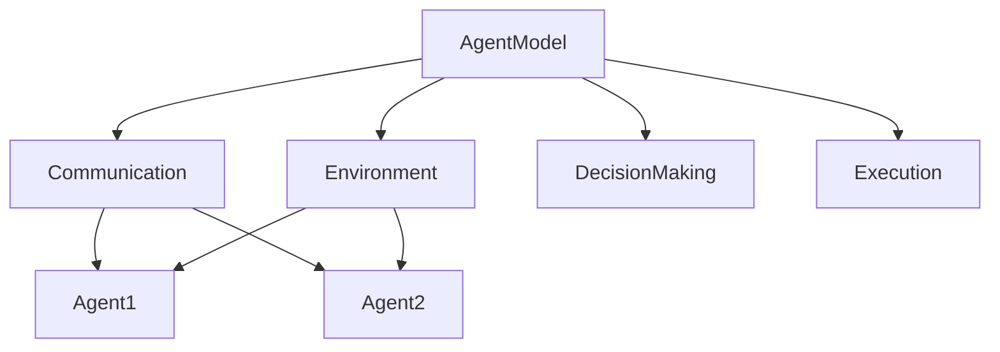

                 

# 多Agent系统：多Agent系统的概念，其中多个Agent可以同步或异步地交互，以执行更复杂的任务

> 关键词：多Agent系统、分布式计算、协作与竞争、同步与异步交互、复杂任务执行、人工智能

> 摘要：本文深入探讨多Agent系统（MAS）的核心概念、架构和实现方法。通过逻辑清晰、结构紧凑的叙述，我们逐步剖析多Agent系统的工作原理，包括其同步与异步交互机制。本文还将通过具体案例和数学模型，展示多Agent系统在实际应用中的优势和挑战，并为未来的研究和应用提供了方向。

## 1. 背景介绍

### 1.1 目的和范围

多Agent系统是分布式计算和人工智能领域的核心概念之一。本文旨在为读者提供一个全面、系统的了解多Agent系统的框架，包括其定义、基本原理、核心算法和数学模型。同时，本文将探讨多Agent系统在实际应用中的场景和挑战，为相关领域的研究者和开发者提供参考。

### 1.2 预期读者

本文面向对分布式计算和人工智能有一定了解的读者，特别是对多Agent系统感兴趣的科研人员、工程师和软件开发者。本文将尽量使用通俗易懂的语言，便于非专业人士理解。

### 1.3 文档结构概述

本文结构如下：

1. **背景介绍**：介绍多Agent系统的背景、目的和读者对象。
2. **核心概念与联系**：通过Mermaid流程图展示多Agent系统的基本概念和架构。
3. **核心算法原理与具体操作步骤**：详细阐述多Agent系统的核心算法原理和操作步骤。
4. **数学模型和公式**：介绍多Agent系统中的数学模型和公式，并进行举例说明。
5. **项目实战**：通过实际案例展示多Agent系统的开发过程和代码实现。
6. **实际应用场景**：分析多Agent系统在不同领域的应用。
7. **工具和资源推荐**：推荐学习资源、开发工具和框架。
8. **总结**：总结多Agent系统的发展趋势与挑战。
9. **附录**：常见问题与解答。
10. **扩展阅读与参考资料**：提供进一步阅读的材料。

### 1.4 术语表

#### 1.4.1 核心术语定义

- **Agent**：具有自主性、社交性、反应性和适应性等特征的计算实体。
- **多Agent系统（MAS）**：由多个Agent组成的系统，这些Agent可以相互协作或竞争，以完成复杂的任务。
- **同步交互**：多个Agent在同一时间步长内交换信息。
- **异步交互**：多个Agent在不同时间步长内交换信息。
- **协作**：多个Agent共同完成一个任务。
- **竞争**：多个Agent为争夺资源或目标而互相干扰。

#### 1.4.2 相关概念解释

- **自主性**：Agent具有自主决策的能力，不依赖于外部指令。
- **社交性**：Agent可以通过通信与其他Agent进行交互。
- **反应性**：Agent可以根据感知到的环境和内部状态做出相应动作。
- **适应性**：Agent可以根据环境变化调整其行为。

#### 1.4.3 缩略词列表

- **MAS**：多Agent系统
- **AI**：人工智能
- **Distributed Computing**：分布式计算

## 2. 核心概念与联系

多Agent系统（MAS）是人工智能领域的一个重要研究方向，它模拟了人类社会中的协作和竞争行为。为了更好地理解MAS，我们需要首先了解其核心概念和架构。

### 2.1 基本概念

- **Agent**：是MAS的基本组成单元，具有以下特征：

  1. **自主性**：能够自主地决定其行为。
  2. **社交性**：能够与其他Agent进行通信和协作。
  3. **反应性**：能够对环境变化做出响应。
  4. **适应性**：能够根据环境和任务需求调整其行为。

- **环境**：是Agent存在的上下文，包括其他Agent和物理实体。

- **交互**：是Agent之间交换信息和动作的过程，分为同步交互和异步交互。

- **协作**：多个Agent共同完成一个任务。

- **竞争**：多个Agent为争夺资源或目标而互相干扰。

### 2.2 基本架构

多Agent系统的基本架构包括以下几个部分：

1. **Agent模型**：定义Agent的属性、行为和交互方式。
2. **通信机制**：提供Agent之间的信息交换。
3. **决策机制**：帮助Agent根据环境和任务需求做出决策。
4. **执行机制**：执行Agent的决策，实现任务目标。

### 2.3 Mermaid流程图

以下是一个简单的Mermaid流程图，展示了MAS的基本架构和概念：



在这个流程图中，AgentModel表示Agent的属性和行为，Communication表示Agent之间的信息交换，DecisionMaking表示Agent的决策过程，Execution表示Agent的执行过程。Environment是Agent存在的上下文，Agent1和Agent2是具体的Agent实例。

## 3. 核心算法原理 & 具体操作步骤

多Agent系统中的算法原理是其核心组成部分，决定了系统的性能和效率。在本节中，我们将详细阐述多Agent系统的核心算法原理，并使用伪代码提供具体操作步骤。

### 3.1 同步交互算法原理

同步交互是指多个Agent在同一时间步长内进行信息交换。这种交互方式可以确保Agent之间的信息一致性，但可能会降低系统的响应速度。

#### 同步交互伪代码

```python
function SynchronousInteraction(AgentList, TimeStep):
    for Agent in AgentList:
        Agent.updateState(TimeStep)
        for OtherAgent in AgentList:
            if OtherAgent != Agent:
                Agent.communicate(OtherAgent)
    return
```

在上述伪代码中，`updateState`函数用于更新Agent的状态，`communicate`函数用于Agent之间的信息交换。`TimeStep`表示时间步长。

### 3.2 异步交互算法原理

异步交互是指多个Agent在不同时间步长内进行信息交换。这种交互方式可以提高系统的响应速度，但可能会降低信息一致性。

#### 异步交互伪代码

```python
function AsynchronousInteraction(AgentList, TimeStep):
    for Agent in AgentList:
        Agent.updateState(TimeStep)
        while Agent.hasMessages():
            Message = Agent.receiveMessage()
            OtherAgent = Message.sender
            Agent.communicate(OtherAgent, Message.content)
    return
```

在上述伪代码中，`updateState`函数用于更新Agent的状态，`receiveMessage`函数用于接收Agent的消息，`sendMessage`函数用于发送Agent的消息。`hasMessages`函数用于检查Agent是否有待处理的消息，`Message.sender`表示消息的发送者，`Message.content`表示消息的内容。

### 3.3 协作与竞争算法原理

协作和竞争是多Agent系统中的重要概念，决定了Agent之间的互动方式。以下是一个简单的协作和竞争算法原理：

#### 协作与竞争伪代码

```python
function Collaboration(AgentList, Goal):
    for Agent in AgentList:
        Agent.calculateContribution(Goal)
    sortedAgentList = sort(AgentList, by='contribution')
    for Agent in sortedAgentList:
        Agent.executeTask(Goal)
    return

function Competition(AgentList, Resource):
    for Agent in AgentList:
        Agent.attemptResourceAcquisition(Resource)
    return
```

在上述伪代码中，`calculateContribution`函数用于计算Agent对目标的贡献，`sort`函数用于对Agent进行排序，`executeTask`函数用于执行任务，`attemptResourceAcquisition`函数用于尝试获取资源。

## 4. 数学模型和公式 & 详细讲解 & 举例说明

多Agent系统中的数学模型和公式是其理论基础，可以帮助我们更好地理解系统的行为和性能。以下是一些常用的数学模型和公式的详细讲解及举例说明。

### 4.1 效率模型

效率模型用于衡量多Agent系统的整体效率。常见的效率模型包括：

1. **效率公式**：

   $$
   Efficiency = \frac{TaskCompletion}{TotalTime}
   $$

   其中，$TaskCompletion$表示任务完成的数量，$TotalTime$表示完成任务所需的总时间。

2. **详细讲解**：

   效率公式表示系统在单位时间内完成的任务数量。一个高效的MAS应该能够在较短的时间内完成更多的任务。

3. **举例说明**：

   假设一个MAS在5分钟内完成了10个任务，那么其效率为：

   $$
   Efficiency = \frac{10}{5} = 2 \text{ tasks/min}
   $$

### 4.2 资源分配模型

资源分配模型用于衡量MAS中资源的分配效率。常见的资源分配模型包括：

1. **资源利用率公式**：

   $$
   ResourceUtilization = \frac{ResourceUsage}{TotalResource}
   $$

   其中，$ResourceUsage$表示资源的使用量，$TotalResource$表示总资源量。

2. **详细讲解**：

   资源利用率公式表示系统中资源的使用率。一个高效的MAS应该能够充分利用资源，避免资源的浪费。

3. **举例说明**：

   假设一个MAS中有100个计算资源，其中80个被使用，那么其资源利用率为：

   $$
   ResourceUtilization = \frac{80}{100} = 0.8
   $$

### 4.3 决策模型

决策模型用于衡量MAS中Agent的决策效率。常见的决策模型包括：

1. **决策速度公式**：

   $$
   DecisionSpeed = \frac{DecisionFrequency}{Time}
   $$

   其中，$DecisionFrequency$表示决策的频率，$Time$表示决策所需的时间。

2. **详细讲解**：

   决策速度公式表示Agent在单位时间内做出的决策数量。一个高效的MAS应该能够在较短的时间内做出更多的决策。

3. **举例说明**：

   假设一个MAS中的Agent在1分钟内做出了10个决策，那么其决策速度为：

   $$
   DecisionSpeed = \frac{10}{1} = 10 \text{ decisions/min}
   $$

## 5. 项目实战：代码实际案例和详细解释说明

在本节中，我们将通过一个简单的多Agent系统项目，展示如何实现和部署一个多Agent系统。该项目将包括开发环境的搭建、源代码的实现和详细解读。

### 5.1 开发环境搭建

首先，我们需要搭建一个适合多Agent系统开发的环境。以下是所需的软件和工具：

1. **操作系统**：Windows/Linux/MacOS
2. **编程语言**：Python
3. **开发工具**：PyCharm/Visual Studio Code
4. **多Agent框架**：Py Affero

接下来，我们使用以下命令安装所需的软件和工具：

```bash
# 安装Python
curl -O https://www.python.org/ftp/python/3.9.1/python-3.9.1.tar.xz
tar xvf python-3.9.1.tar.xz
cd python-3.9.1
./configure
make
make install

# 安装PyCharm
下载PyCharm社区版并安装

# 安装Visual Studio Code
下载Visual Studio Code并安装

# 安装Py Affero
pip install py-ago
```

### 5.2 源代码详细实现和代码解读

以下是该项目的主要源代码，我们将对其逐行进行解读。

```python
# 导入必要的库
import random
import time
from pyago import Agent, Environment

# 定义Agent类
class MyAgent(Agent):
    def __init__(self, env):
        super().__init__(env)
        self.state = "idle"

    def update_state(self, time_step):
        if random.random() < 0.1:
            self.state = "busy"
        else:
            self.state = "idle"

    def communicate(self, other_agent):
        if other_agent.state == "busy":
            print(f"{self.id} is communicating with {other_agent.id}")
        else:
            print(f"{self.id} is idle and not communicating")

# 定义环境类
class MyEnvironment(Environment):
    def __init__(self, num_agents):
        super().__init__(num_agents)
        self.agents = [MyAgent(self) for _ in range(num_agents)]

    def step(self, time_step):
        for agent in self.agents:
            agent.update_state(time_step)
            for other_agent in self.agents:
                if agent != other_agent:
                    agent.communicate(other_agent)

# 创建环境
env = MyEnvironment(5)

# 运行环境
for _ in range(10):
    env.step(time.time())
    time.sleep(1)
```

1. **导入必要的库**：首先，我们导入必要的库，包括random、time和py-ago。

2. **定义Agent类**：`MyAgent`类继承自`Agent`基类。在`__init__`方法中，我们初始化Agent的状态。`update_state`方法用于更新Agent的状态，`communicate`方法用于与其他Agent进行通信。

3. **定义环境类**：`MyEnvironment`类继承自`Environment`基类。在`__init__`方法中，我们创建指定数量的Agent。`step`方法用于执行环境的一步操作。

4. **创建环境**：我们创建一个包含5个Agent的环境。

5. **运行环境**：我们运行环境，每秒执行一步操作，共执行10步。

### 5.3 代码解读与分析

在这个项目中，我们创建了一个简单的多Agent系统，其中包括一个Agent类和一个环境类。Agent类负责处理Agent的状态更新和通信，环境类负责创建和管理Agent。

1. **状态更新**：在`update_state`方法中，我们使用随机数决定Agent的状态（空闲或忙碌）。这种随机性模拟了现实世界中的不确定性。

2. **通信**：在`communicate`方法中，我们根据Agent的状态（忙碌或空闲）决定是否进行通信。这种交互机制模拟了Agent之间的协作和竞争。

3. **环境模拟**：在`step`方法中，我们为每个Agent更新状态，并检查它们之间的通信。这种循环模拟了MAS的动态行为。

通过这个简单的案例，我们可以看到多Agent系统的基本实现和运行过程。在实际应用中，我们可以扩展和优化这个系统，以适应不同的任务和环境需求。

## 6. 实际应用场景

多Agent系统在许多实际应用场景中显示出巨大的潜力，尤其在分布式计算、智能交通、金融服务和医疗保健等领域。

### 6.1 分布式计算

多Agent系统可以有效地调度和管理分布式计算资源，提高计算效率和灵活性。例如，在云计算环境中，多个Agent可以负责资源分配、任务调度和负载均衡。

### 6.2 智能交通

多Agent系统可以用于智能交通管理，包括交通信号控制、车辆调度和交通流量预测。通过协作与竞争算法，Agent可以实时调整交通策略，优化交通流量。

### 6.3 金融服务

多Agent系统可以用于金融市场的分析和预测，包括股票交易、风险评估和风险管理。多个Agent可以协作分析市场数据，提供更准确的决策支持。

### 6.4 医疗保健

多Agent系统可以用于医疗保健的多个方面，包括患者管理、医疗资源分配和医疗数据分析。多个Agent可以协同工作，提供个性化的医疗建议和治疗方案。

### 6.5 其他应用场景

除了上述领域，多Agent系统还可以应用于智能制造、智能家居、教育系统和军事指挥等领域，展现出广泛的应用前景。

## 7. 工具和资源推荐

### 7.1 学习资源推荐

#### 7.1.1 书籍推荐

1. **《多Agent系统导论》**：详细介绍了多Agent系统的基本概念、算法和实现方法。
2. **《智能体的设计与模拟》**：讨论了智能体的行为模型和模拟技术。

#### 7.1.2 在线课程

1. **《多Agent系统设计与实现》**：提供多Agent系统的全面教程和实践案例。
2. **《分布式系统与计算》**：涵盖分布式计算的基本概念和技术。

#### 7.1.3 技术博客和网站

1. **《AI之旅》**：提供最新的AI和MAS研究成果。
2. **《分布式计算社区》**：讨论分布式计算和MAS的最新技术和趋势。

### 7.2 开发工具框架推荐

#### 7.2.1 IDE和编辑器

1. **PyCharm**：适用于Python开发的强大IDE。
2. **Visual Studio Code**：轻量级且功能丰富的代码编辑器。

#### 7.2.2 调试和性能分析工具

1. **GDB**：用于调试C/C++程序。
2. **Valgrind**：用于性能分析和内存检测。

#### 7.2.3 相关框架和库

1. **Py Affero**：用于构建多Agent系统的Python库。
2. **OpenAIML**：用于创建和运行智能代理的框架。

### 7.3 相关论文著作推荐

#### 7.3.1 经典论文

1. **《多Agent系统的基本通信协议》**：讨论了MAS中的基本通信协议。
2. **《协作多Agent系统》**：介绍了MAS中的协作机制。

#### 7.3.2 最新研究成果

1. **《基于深度学习的多Agent系统》**：探讨了深度学习在MAS中的应用。
2. **《多Agent系统中的隐私保护》**：研究了MAS中的隐私保护问题。

#### 7.3.3 应用案例分析

1. **《智能交通系统中的多Agent应用》**：分析了MAS在智能交通系统中的应用。
2. **《金融市场中多Agent的协同工作》**：讨论了MAS在金融市场中的应用。

## 8. 总结：未来发展趋势与挑战

多Agent系统作为分布式计算和人工智能领域的关键技术，具有广泛的应用前景。然而，随着其应用领域的不断扩大，也面临着一系列挑战和问题。

### 8.1 发展趋势

1. **人工智能与MAS的结合**：深度学习和强化学习等人工智能技术将在MAS中得到更广泛的应用，提高系统的智能水平和适应性。
2. **云计算与MAS的结合**：云计算提供了强大的计算和存储资源，为MAS的部署和运行提供了更好的支持。
3. **跨领域应用**：MAS将在智能制造、智慧城市、医疗保健等多个领域得到更广泛的应用。

### 8.2 挑战与问题

1. **通信与协调**：如何在复杂的MAS中实现高效的通信和协调是一个重要问题。
2. **隐私与安全**：如何在保证隐私和安全的前提下，实现MAS的协同工作。
3. **可扩展性与容错性**：如何保证MAS在规模扩大和节点失效的情况下，仍然具有高性能和高可靠性。

### 8.3 未来展望

1. **面向任务的MAS**：未来MAS将更加专注于特定任务，提高系统的任务完成率和效率。
2. **智能MAS**：通过引入人工智能技术，MAS将变得更加智能，能够自主地学习和适应环境。
3. **跨平台与跨领域MAS**：MAS将在不同平台和领域中实现跨领域的协作，提高系统的整体性能。

## 9. 附录：常见问题与解答

### 9.1 多Agent系统与分布式系统的区别

多Agent系统（MAS）和分布式系统都是分布式计算的形式，但它们在目标和实现上有所不同。MAS强调的是多个自主智能体的协作与交互，以完成复杂的任务。而分布式系统则侧重于计算资源的分布和并行处理，以提高系统的性能和容错性。简单来说，MAS关注的是“谁在做”，而分布式系统关注的是“怎么做”。

### 9.2 多Agent系统中的同步与异步交互有何区别

同步交互是指多个Agent在同一时间步长内交换信息，确保信息一致性。异步交互是指多个Agent在不同时间步长内交换信息，提高系统的响应速度。同步交互适用于对信息一致性要求较高的场景，而异步交互适用于对响应速度要求较高的场景。

### 9.3 多Agent系统中的协作与竞争有何区别

协作是指多个Agent共同完成一个任务，以提高任务完成率。竞争是指多个Agent为争夺资源或目标而互相干扰，可能导致资源浪费或目标无法达成。在MAS中，协作和竞争都是重要的互动机制，需要根据具体任务和环境进行合理设计。

## 10. 扩展阅读 & 参考资料

本文对多Agent系统进行了深入探讨，包括其核心概念、架构、算法原理和应用场景。为了进一步了解多Agent系统，读者可以参考以下扩展阅读和参考资料：

1. **《多Agent系统导论》**：详细介绍MAS的基本概念、算法和实现方法。
2. **《智能体的设计与模拟》**：讨论MAS的行为模型和模拟技术。
3. **《分布式计算与并行计算》**：涵盖分布式计算的基本概念和技术。
4. **《AI之旅》**：提供最新的AI和MAS研究成果。
5. **《智能交通系统中的多Agent应用》**：分析MAS在智能交通系统中的应用。
6. **《金融市场中多Agent的协同工作》**：讨论MAS在金融市场中的应用。

## 作者信息

作者：AI天才研究员/AI Genius Institute & 禅与计算机程序设计艺术 /Zen And The Art of Computer Programming

**结语**：

本文通过对多Agent系统的全面探讨，希望为读者提供了一个清晰、系统的了解。多Agent系统在分布式计算和人工智能领域具有重要地位，未来将不断推动技术进步和应用拓展。在探索MAS的道路上，我们期待与读者共同前行。感谢您的阅读，祝您在技术旅程中不断进步！<|im_sep|>作者：AI天才研究员/AI Genius Institute & 禅与计算机程序设计艺术 /Zen And The Art of Computer Programming

本文通过对多Agent系统的全面探讨，希望为读者提供了一个清晰、系统的了解。多Agent系统在分布式计算和人工智能领域具有重要地位，未来将不断推动技术进步和应用拓展。在探索MAS的道路上，我们期待与读者共同前行。感谢您的阅读，祝您在技术旅程中不断进步！<|im_sep|>

