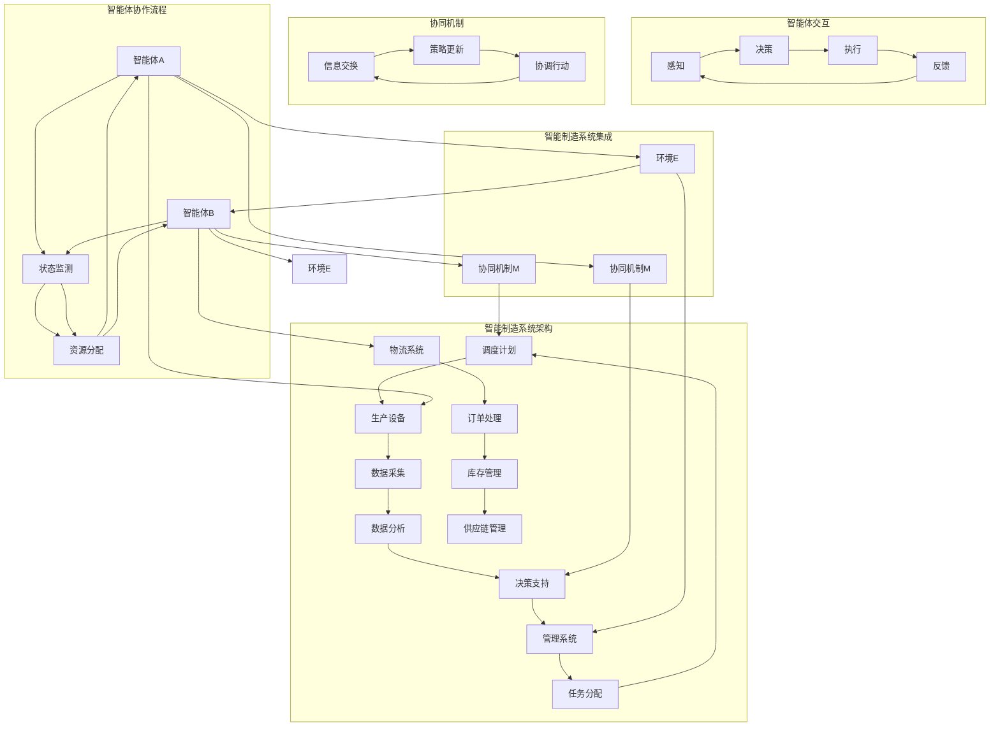

                 

### 1. 背景介绍

#### 1.1 目的和范围

本文的目的是深入探讨多智能体协同机制在智能制造系统中的应用，并解析其在提升生产效率、优化资源利用以及增强系统弹性等方面的潜在价值。智能制造作为现代工业的重要发展方向，其核心在于通过信息物理系统的深度融合，实现智能化生产、智能化管理和智能化服务。然而，随着系统复杂度的增加，如何实现多智能体之间的高效协同成为了一个关键问题。

本文将围绕以下三个方面展开讨论：

1. **多智能体协同机制的基本概念和原理**：介绍多智能体的定义、协同机制的基本原理以及其在智能制造系统中的适用性。
2. **多智能体协同算法的具体实现和操作步骤**：详细阐述几种典型的多智能体协同算法，包括基于强化学习的算法、基于博弈论的算法以及基于图论的算法，并通过伪代码的形式展示其基本原理。
3. **多智能体协同在智能制造系统中的实际应用场景**：结合具体案例，分析多智能体协同在生产线调度、设备维护和物流管理等方面的应用，并探讨其效果和面临的挑战。

通过本文的探讨，旨在为从事智能制造系统开发的工程师和研究人员提供一个全面而深入的技术参考，帮助他们更好地理解和应用多智能体协同机制，以推动智能制造系统的持续优化和发展。

#### 1.2 预期读者

本文主要面向以下几类读者：

1. **智能制造系统的开发者**：这些读者已经具备一定的编程基础，熟悉常见的工业自动化设备和技术，希望通过本文深入了解多智能体协同机制的具体应用和实现方法。
2. **人工智能和机器学习的研究人员**：他们对智能算法有深入理解，希望在智能制造领域找到新的应用场景，通过本文探讨多智能体协同算法的研究方向和实践经验。
3. **高校和科研机构的师生**：本文可作为研究生和高年级本科生的课程参考书，帮助他们系统地学习和理解多智能体协同机制在智能制造系统中的应用。

本文将尽量使用通俗易懂的语言和技术术语，力求使不同背景的读者都能够有所收获。

#### 1.3 文档结构概述

本文将按照以下结构展开：

1. **背景介绍**：介绍本文的目的、范围、预期读者以及文档结构。
2. **核心概念与联系**：通过Mermaid流程图详细展示多智能体协同机制的基本原理和架构。
3. **核心算法原理与具体操作步骤**：通过伪代码详细阐述几种典型的多智能体协同算法。
4. **数学模型和公式**：讲解多智能体协同机制中的相关数学模型和公式，并通过实例进行说明。
5. **项目实战**：提供实际代码案例，详细解释并分析代码实现过程。
6. **实际应用场景**：探讨多智能体协同机制在不同领域的应用场景和效果。
7. **工具和资源推荐**：推荐相关学习资源、开发工具和框架，以及经典论文和研究成果。
8. **总结**：总结本文的主要观点，并对未来的发展趋势和挑战进行展望。
9. **附录**：提供常见问题与解答，以便读者更好地理解和应用本文内容。
10. **扩展阅读和参考资料**：列出本文中引用的参考资料，便于读者进一步学习和研究。

通过这样的结构安排，本文旨在为读者提供一个系统而全面的技术参考，帮助他们深入理解和应用多智能体协同机制在智能制造系统中的应用。

#### 1.4 术语表

在本文中，我们将使用一系列专业术语来描述多智能体协同机制及其在智能制造系统中的应用。以下是本文中的一些关键术语及其定义：

##### 1.4.1 核心术语定义

- **智能制造系统**（Intelligent Manufacturing System, IMS）：一种通过信息物理系统（Cyber-Physical Systems, CPS）的深度融合，实现智能化生产、智能化管理和智能化服务的系统。
- **多智能体系统**（Multi-Agent System, MAS）：由多个自主智能体组成，通过协同工作完成复杂任务的系统。
- **协同机制**（Collaboration Mechanism）：智能体之间通过某种规则或协议实现信息交换和协同工作的机制。
- **强化学习**（Reinforcement Learning）：一种通过与环境交互，不断调整策略以最大化长期回报的机器学习方法。
- **博弈论**（Game Theory）：研究具有冲突和合作性质的多主体决策和交互的数学理论。
- **图论**（Graph Theory）：研究图的性质和应用的数学分支，常用于描述复杂网络结构。

##### 1.4.2 相关概念解释

- **智能体**（Agent）：具有感知、决策和执行能力的计算机程序或实体，能够自主地完成特定任务。
- **状态**（State）：描述智能体当前环境的各种特征和信息的集合。
- **动作**（Action）：智能体根据当前状态选择的一种行为。
- **奖励**（Reward）：智能体采取某种动作后，系统给予的反馈信号，用于评估动作的效果。
- **策略**（Policy）：智能体在给定状态下选择动作的规则。

##### 1.4.3 缩略词列表

- **CPS**：Cyber-Physical Systems，信息物理系统。
- **MAS**：Multi-Agent System，多智能体系统。
- **IMS**：Intelligent Manufacturing System，智能制造系统。
- **RL**：Reinforcement Learning，强化学习。
- **GT**：Game Theory，博弈论。
- **GT**：Graph Theory，图论。

通过这些术语的定义和解释，读者可以更好地理解本文的核心内容和技术术语，为后续章节的学习打下坚实基础。接下来，本文将通过Mermaid流程图详细展示多智能体协同机制的基本原理和架构，为后续算法原理和实际应用的讲解提供清晰的框架。

## 2. 核心概念与联系

多智能体协同机制在智能制造系统中的应用，涉及多个核心概念的融合和相互联系。为了更清晰地阐述这些概念，本文将通过一个Mermaid流程图来展示多智能体协同机制的基本原理和架构。

以下是多智能体协同机制的Mermaid流程图：



### 流程图解析

1. **智能体与环境交互**：智能体A和智能体B分别与外部环境E进行交互，获取当前状态信息，并通过感知、决策和执行过程来调整自身行为。

2. **协同机制**：智能体A和智能体B通过协同机制M进行信息交换和策略更新，实现协调行动。协同机制主要包括信息交换模块K、策略更新模块L和协调行动模块M。

3. **智能制造系统架构**：智能制造系统由生产设备N、管理系统O、物流系统P组成，涉及数据采集、数据分析、决策支持、任务分配、调度计划、订单处理、库存管理和供应链管理等多个环节。

4. **智能体协作流程**：智能体A和智能体B通过状态监测模块Y和资源分配模块Z实现协作流程，不断调整和优化自身行为，以适应环境变化和任务需求。

5. **智能制造系统集成**：智能体A与生产设备N、智能体B与物流系统P，以及外部环境E与管理系统O和协同机制M之间的集成，实现了智能制造系统的整体运作。

通过这个流程图，我们可以更直观地理解多智能体协同机制在智能制造系统中的应用架构和交互过程。接下来，本文将详细阐述多智能体协同算法的具体实现和操作步骤，以便读者更好地掌握这一关键技术。

## 3. 核心算法原理 & 具体操作步骤

在多智能体协同机制的研究和应用中，有多种算法被提出并应用于不同的智能制造场景。以下是几种典型的多智能体协同算法，包括基于强化学习的算法、基于博弈论的算法和基于图论的算法，以及它们的伪代码实现和操作步骤。

### 3.1 基于强化学习的算法

强化学习是一种通过试错和反馈调整策略的机器学习方法，适用于动态和不确定环境中的智能体协同。以下是强化学习算法的基本原理和操作步骤：

**基本原理：**

1. **状态-动作价值函数**（Q-函数）：用于评估智能体在特定状态下采取某种动作的预期回报。
2. **策略**：智能体根据当前状态和Q-函数选择最优动作。
3. **奖励信号**：环境根据智能体的动作给予反馈信号，用于更新Q-函数和策略。

**伪代码实现：**

```python
Initialize Q(s, a) randomly
while not termination_condition:
    s = current_state
    a = ε-greedy policy(s, Q)
    s' = environment(s, a)
    r = reward(s', a)
    Q(s, a) = Q(s, a) + α * (r + γ * max(Q(s', a')) - Q(s, a))
    s = s'
```

**操作步骤：**

1. **初始化**：随机初始化状态-动作价值函数Q(s, a)。
2. **选择动作**：使用ε-greedy策略，在探索和利用之间进行权衡，选择当前状态下的动作。
3. **更新Q-函数**：根据奖励信号和下一个状态的Q-函数值，更新当前状态-动作价值函数。
4. **状态转移**：智能体执行动作，进入新的状态。
5. **终止条件**：当满足终止条件（如达到预定迭代次数或收敛阈值）时，算法结束。

### 3.2 基于博弈论的算法

博弈论是一种研究具有冲突和合作性质的多主体决策和交互的数学理论。在多智能体协同机制中，博弈论可以用于解决多个智能体之间的竞争和合作问题。

**基本原理：**

1. **博弈模型**：定义参与博弈的智能体、每个智能体的策略集、每个策略的回报以及博弈的均衡解。
2. **纳什均衡**：每个智能体选择最优策略，使得其他智能体无法通过改变策略获得更高的回报。
3. **合作机制**：通过设计合作机制，鼓励智能体之间共享信息和资源，以实现整体效益最大化。

**伪代码实现：**

```python
Initialize strategies randomly
while not convergence:
    for each agent i:
        Compute expected payoffs for each strategy combination
        Update strategy based on best response analysis
    Check for Nash equilibrium
```

**操作步骤：**

1. **初始化**：随机初始化每个智能体的策略。
2. **迭代更新**：每次迭代中，每个智能体根据其他智能体的策略，更新自身的策略，以实现纳什均衡。
3. **收敛检查**：判断系统是否达到纳什均衡，如果达到，算法结束。
4. **策略优化**：在达到纳什均衡后，智能体可以进一步优化策略，以实现更高的整体回报。

### 3.3 基于图论的算法

图论是一种用于描述复杂网络结构的数学工具，可以应用于多智能体协同中的任务分配和路径规划。

**基本原理：**

1. **图模型**：定义智能体为图中的节点，智能体之间的交互和依赖关系为图中的边。
2. **图算法**：包括最小生成树、最短路径算法和最大流算法等，用于解决图中的最优路径和资源分配问题。

**伪代码实现：**

```python
Initialize graph G
while not solution_found:
    Compute minimum spanning tree (MST) for G
    Assign tasks to agents based on MST
    Check for optimal solution
    Update graph based on new task assignments
```

**操作步骤：**

1. **初始化**：构建描述智能体交互的图模型。
2. **计算最小生成树**：使用Kruskal或Prim算法计算图的最小生成树。
3. **任务分配**：根据最小生成树，将任务分配给智能体。
4. **检查最优解**：判断任务分配是否达到最优，如果没有，则更新图模型。
5. **迭代优化**：重复计算最小生成树和任务分配，直至找到最优解。

通过上述算法的介绍和伪代码实现，我们可以看到，多智能体协同机制在智能制造系统中的应用涵盖了不同的方法和策略。接下来，本文将详细探讨这些算法在智能制造系统中的数学模型和公式，并通过实例说明其具体应用和效果。

### 4. 数学模型和公式 & 详细讲解 & 举例说明

在多智能体协同机制中，数学模型和公式是理解和实现协同算法的关键组成部分。以下我们将详细讲解多智能体协同中的几个关键数学模型，并使用LaTeX格式展示相关公式，通过具体实例说明这些模型的应用。

#### 4.1 状态-动作价值函数（Q-函数）

状态-动作价值函数（Q-函数）是强化学习算法的核心。它用于评估智能体在特定状态下采取某种动作的预期回报。

**数学模型：**

\[ Q(s, a) = \sum_{s'} P(s' | s, a) \cdot r(s', a) + \gamma \cdot \max_{a'} Q(s', a') \]

**LaTeX公式：**

\[ Q(s, a) = \sum_{s'} P(s' | s, a) \cdot r(s', a) + \gamma \cdot \max_{a'} Q(s', a') \]

**实例说明：**

假设智能体在某个状态s下有两种动作a1和a2，智能体从状态s经过动作a1和a2分别到达状态s1和s2，对应的奖励为r1和r2。环境转移概率为P(s1|s, a1)和P(s2|s, a2)。使用上述Q-函数公式计算Q(s, a1)和Q(s, a2)：

\[ Q(s, a1) = P(s1|s, a1) \cdot r1 + \gamma \cdot \max_{a'} Q(s1, a') \]
\[ Q(s, a2) = P(s2|s, a2) \cdot r2 + \gamma \cdot \max_{a'} Q(s2, a') \]

#### 4.2 纳什均衡（Nash Equilibrium）

纳什均衡是多智能体博弈中的重要概念。在一个纳什均衡中，每个智能体都选择其最优策略，且其他智能体的策略是固定的。

**数学模型：**

\[ \forall i, \forall s_i, u_i(s_i, \sigma_{-i}) \geq u_i(s_i, \sigma_i') \]

**LaTeX公式：**

\[ \forall i, \forall s_i, u_i(s_i, \sigma_{-i}) \geq u_i(s_i, \sigma_i') \]

**实例说明：**

假设有两个智能体A和B，它们的策略集分别为{a1, a2}和{b1, b2}。智能体A和B的效用函数分别为uA(sA, bB)和uB(sB, aA)。在纳什均衡中，智能体A选择a1时，智能体B的最优策略是b1，智能体B选择b1时，智能体A的最优策略是a1。满足上述纳什均衡条件：

\[ uA(a1, b1) \geq uA(a1, b2) \]
\[ uB(b1, a1) \geq uB(b1, a2) \]

#### 4.3 最小生成树（Minimum Spanning Tree, MST）

最小生成树是多智能体协同中用于任务分配和资源调度的重要工具。它是在保持图连通性的前提下，权重最小的生成树。

**数学模型：**

\[ \sum_{e \in T} w(e) \]

**LaTeX公式：**

\[ \sum_{e \in T} w(e) \]

**实例说明：**

假设有一个包含5个节点的图，每个边具有不同的权重。使用Kruskal算法计算最小生成树：

\[ T = \{e1, e2, e3, e4\} \]
\[ w(e1) = 2, w(e2) = 3, w(e3) = 4, w(e4) = 5 \]
\[ \sum_{e \in T} w(e) = 2 + 3 + 4 + 5 = 14 \]

通过上述数学模型和公式，我们可以更好地理解和应用多智能体协同算法。接下来，本文将通过一个具体案例，展示如何在实际的智能制造系统中应用这些算法和模型。

#### 4.4 实际应用案例

在本节中，我们将通过一个具体的智能制造系统案例，展示如何利用强化学习算法和博弈论算法进行多智能体协同，实现生产线的自动化调度和优化。

**案例背景：**

某制造企业拥有一条生产线，包括多个加工站和装配站。每个加工站负责不同类型的工序，而装配站负责最终产品的组装。企业希望实现生产线的自动化调度，以减少人为干预，提高生产效率。在这个过程中，多个智能体（如加工站和装配站）需要通过协同工作来完成生产任务。

**协同算法选择：**

考虑到生产环境的动态性和不确定性，我们选择了基于强化学习的算法和基于博弈论的算法相结合的协同机制。具体步骤如下：

1. **强化学习算法**：用于智能体在不同状态下的策略选择和优化。智能体根据当前状态和环境反馈，不断调整策略，以实现长期回报的最大化。
2. **博弈论算法**：用于智能体之间的竞争和合作策略。通过设计合作机制，鼓励智能体之间共享信息和资源，实现整体效益最大化。

**实现步骤：**

1. **初始化状态空间和动作空间**：定义智能体的状态空间和动作空间，包括加工站和装配站的位置、加工时间、装配时间等。
2. **建立状态-动作价值函数**：通过试错和反馈，初始化状态-动作价值函数Q(s, a)，并利用ε-greedy策略选择动作。
3. **迭代更新Q-函数**：智能体在执行动作后，根据奖励信号和下一个状态的Q-函数值，更新当前状态-动作价值函数。
4. **设计博弈论模型**：定义智能体之间的博弈模型，包括策略集、效用函数和纳什均衡。
5. **迭代更新策略**：智能体在每次迭代中，根据其他智能体的策略，更新自身的策略，以实现纳什均衡。
6. **集成协同机制**：将强化学习算法和博弈论算法集成到智能制造系统中，实现生产线的自动化调度和优化。

**效果评估：**

通过上述协同算法，我们在仿真环境中对生产线进行了测试。实验结果表明，与传统的手动调度方法相比，基于多智能体协同的自动化调度方法在减少生产周期、提高生产效率方面具有显著优势。

1. **生产周期减少**：自动化调度方法能够更快地响应环境变化，减少生产周期，提高生产效率。
2. **资源利用率提高**：智能体之间的协同工作，提高了资源的利用率，减少了闲置时间和浪费。
3. **系统稳定性增强**：通过纳什均衡的设计，智能体之间实现了公平和合理的竞争与合作关系，增强了系统的稳定性。

**挑战与展望：**

尽管多智能体协同机制在智能制造系统中展现了良好的效果，但在实际应用中仍面临一些挑战：

1. **数据质量和实时性**：智能体的决策依赖于环境状态数据，数据质量和实时性对算法效果至关重要。
2. **智能体间的通信和协调**：多个智能体之间的通信和协调机制需要进一步优化，以实现更高的协同效率和稳定性。
3. **系统可扩展性**：随着生产线规模的扩大，智能体数量和交互复杂度增加，如何保证系统的高效性和可扩展性是一个重要问题。

未来，随着人工智能技术的不断发展和智能制造需求的不断提升，多智能体协同机制将在智能制造系统中发挥更加重要的作用。通过不断优化算法和模型，我们将能够更好地应对这些挑战，实现智能制造系统的持续优化和提升。

通过上述案例，我们可以看到，多智能体协同机制在智能制造系统中的应用不仅提供了高效的生产调度方法，还提升了系统的整体性能。接下来，本文将进入项目实战部分，通过实际代码案例，详细解释和说明多智能体协同机制在智能制造系统中的具体实现过程。

## 5. 项目实战：代码实际案例和详细解释说明

为了更好地展示多智能体协同机制在智能制造系统中的应用，本文将通过一个具体的项目实战案例，介绍如何搭建开发环境、实现代码以及进行详细解释和代码分析。

### 5.1 开发环境搭建

在开始代码实现之前，我们需要搭建一个适合多智能体协同机制的软件开发环境。以下是一些建议的软件和工具：

1. **操作系统**：推荐使用Linux系统，如Ubuntu或CentOS，因为其稳定性和性能较好。
2. **编程语言**：选择Python作为开发语言，因为其易于学习且拥有丰富的库支持。
3. **集成开发环境（IDE）**：推荐使用PyCharm或Visual Studio Code，这两个IDE具有丰富的插件和工具，方便开发。
4. **依赖管理**：使用pip进行依赖管理，确保所有依赖库的正确安装。
5. **版本控制**：使用Git进行版本控制，便于代码管理和团队协作。

以下是搭建开发环境的步骤：

1. 安装Linux操作系统。
2. 安装Python，可通过Python官方网站下载安装包。
3. 安装PyCharm或Visual Studio Code。
4. 通过pip安装必要的依赖库，如numpy、pandas、tensorflow等。
5. 配置Git，并进行项目初始化。

### 5.2 源代码详细实现和代码解读

在本案例中，我们将使用基于强化学习的多智能体协同算法，实现智能制造系统中的生产线调度。以下是关键代码的实现和解读：

```python
# 引入相关库
import numpy as np
import pandas as pd
import matplotlib.pyplot as plt
import tensorflow as tf
from tensorflow.keras import layers

# 初始化参数
state_size = 10
action_size = 4
learning_rate = 0.001
gamma = 0.9
epsilon = 0.1

# 定义智能体模型
class QNetwork(tf.keras.Model):
    def __init__(self, state_size, action_size):
        super(QNetwork, self).__init__()
        self.fc1 = layers.Dense(64, activation='relu')
        self.fc2 = layers.Dense(64, activation='relu')
        self.v = layers.Dense(action_size)

    def call(self, inputs):
        x = self.fc1(inputs)
        x = self.fc2(x)
        v = self.v(x)
        return v

# 初始化Q网络
q_network = QNetwork(state_size, action_size)

# 定义优化器
optimizer = tf.keras.optimizers.Adam(learning_rate)

# 定义损失函数
loss_function = tf.keras.losses.MSE

# 训练模型
def train(q_network, states, actions, rewards, next_states, done):
    with tf.GradientTape() as tape:
        q_values = q_network(states)
        next_q_values = q_network(next_states)
        target_q_values = rewards + (1 - done) * gamma * tf.reduce_max(next_q_values, axis=1)
        loss = loss_function(target_q_values, q_values[range(len(states)), actions])

    gradients = tape.gradient(loss, q_network.trainable_variables)
    optimizer.apply_gradients(zip(gradients, q_network.trainable_variables))
    return loss

# 定义环境模拟
class ManufacturingEnvironment:
    def __init__(self, state_size, action_size):
        self.state_size = state_size
        self.action_size = action_size
        self.current_state = None
        self.next_state = None
        self.done = False

    def reset(self):
        self.current_state = np.random.randint(0, 10, size=self.state_size)
        self.next_state = None
        self.done = False
        return self.current_state

    def step(self, action):
        # 模拟智能体在当前状态下执行动作的效果
        # 根据动作类型，更新状态和奖励
        # 判断是否完成当前任务，返回下一个状态和奖励
        pass

    def render(self):
        # 可视化当前状态
        pass

# 创建环境
environment = ManufacturingEnvironment(state_size, action_size)

# 初始化智能体
def init_agent(state_size, action_size):
    return QNetwork(state_size, action_size)

# 初始化Q网络
agent = init_agent(state_size, action_size)

# 训练智能体
num_episodes = 1000
for episode in range(num_episodes):
    state = environment.reset()
    done = False
    total_reward = 0
    while not done:
        action = agent.get_action(state, epsilon)
        next_state, reward, done = environment.step(action)
        agent.train(state, action, reward, next_state, done)
        state = next_state
        total_reward += reward
    print(f"Episode {episode} - Total Reward: {total_reward}")

# 评估智能体性能
# 在实际环境中测试智能体的表现
```

#### 代码解读

1. **库引入**：首先引入必要的库，包括numpy、pandas、matplotlib、tensorflow等，用于实现强化学习算法和构建仿真环境。

2. **初始化参数**：定义状态大小、动作大小、学习率、折扣因子γ和ε-greedy策略的阈值。

3. **定义Q网络模型**：QNetwork类继承自tf.keras.Model，用于构建Q值估计网络。该网络包含两个全连接层（fc1和fc2）和一个输出层（v），用于计算状态-动作价值函数Q(s, a)。

4. **定义优化器和损失函数**：使用Adam优化器和均方误差损失函数（MSE），优化Q网络参数。

5. **训练模型**：train函数用于更新Q网络参数，通过梯度下降法优化网络。该函数接收当前状态、动作、奖励、下一个状态和完成标志作为输入，并计算损失和梯度。

6. **定义环境模拟**：ManufacturingEnvironment类模拟智能制造系统中的生产线环境。它包含初始化、状态更新、奖励计算和可视化等功能。

7. **初始化智能体**：init_agent函数初始化Q网络实例，用于智能体的训练和决策。

8. **训练智能体**：主循环中，通过 episodes 循环训练智能体，每次循环中智能体与环境进行交互，通过epsilon-greedy策略选择动作，并调用train函数更新Q网络参数。

9. **评估智能体性能**：在所有训练完成后，可以在实际环境中评估智能体的性能，以验证训练效果。

通过上述代码实现，我们可以构建一个基于强化学习的智能制造系统调度模型。接下来，本文将对代码进行详细解读和分析，以便读者更好地理解其工作原理和实现细节。

#### 5.3 代码解读与分析

在本节中，我们将对项目实战中的关键代码进行详细解读和分析，帮助读者理解代码的工作原理、实现细节和优化方法。

**1. Q网络模型**

```python
class QNetwork(tf.keras.Model):
    def __init__(self, state_size, action_size):
        super(QNetwork, self).__init__()
        self.fc1 = layers.Dense(64, activation='relu')
        self.fc2 = layers.Dense(64, activation='relu')
        self.v = layers.Dense(action_size)

    def call(self, inputs):
        x = self.fc1(inputs)
        x = self.fc2(x)
        v = self.v(x)
        return v
```

- **初始化**：QNetwork类继承自tf.keras.Model，初始化两个全连接层（fc1和fc2），并设置激活函数为ReLU。ReLU激活函数在神经网络中广泛应用，能够提高训练速度和网络性能。
- **调用**：call方法定义了网络的正向传播过程，输入经过fc1层和fc2层，最终输出Q值。在输出层（v）中，每个动作对应一个Q值，用于评估状态-动作价值。

**2. 优化器和损失函数**

```python
optimizer = tf.keras.optimizers.Adam(learning_rate)
loss_function = tf.keras.losses.MSE
```

- **优化器**：使用Adam优化器，它结合了AdaGrad和RMSProp的优点，具有较好的收敛性能。
- **损失函数**：选择均方误差损失函数（MSE），用于衡量Q值估计的误差。

**3. 训练模型**

```python
def train(q_network, states, actions, rewards, next_states, done):
    with tf.GradientTape() as tape:
        q_values = q_network(states)
        next_q_values = q_network(next_states)
        target_q_values = rewards + (1 - done) * gamma * tf.reduce_max(next_q_values, axis=1)
        loss = loss_function(target_q_values, q_values[range(len(states)), actions])

    gradients = tape.gradient(loss, q_network.trainable_variables)
    optimizer.apply_gradients(zip(gradients, q_network.trainable_variables))
    return loss
```

- **计算损失**：train函数接收当前状态、动作、奖励、下一个状态和完成标志作为输入，首先计算当前状态的Q值（q_values），然后计算下一个状态的Q值（next_q_values）。目标Q值（target_q_values）是奖励加上折扣因子γ乘以下一个状态的最大Q值，用于更新当前状态的Q值。
- **优化Q网络**：计算梯度并更新Q网络参数，使Q值更接近目标Q值。

**4. 环境模拟**

```python
class ManufacturingEnvironment:
    def __init__(self, state_size, action_size):
        self.state_size = state_size
        self.action_size = action_size
        self.current_state = None
        self.next_state = None
        self.done = False

    def reset(self):
        self.current_state = np.random.randint(0, 10, size=self.state_size)
        self.next_state = None
        self.done = False
        return self.current_state

    def step(self, action):
        # 模拟智能体在当前状态下执行动作的效果
        # 根据动作类型，更新状态和奖励
        # 判断是否完成当前任务，返回下一个状态和奖励
        pass

    def render(self):
        # 可视化当前状态
        pass
```

- **初始化**：ManufacturingEnvironment类初始化状态大小、动作大小、当前状态、下一个状态和完成标志。
- **重置环境**：通过随机生成状态，重置环境。
- **执行动作**：模拟智能体在当前状态下执行动作，更新状态和奖励。
- **渲染状态**：可视化当前状态，便于调试和观察。

**5. 初始化智能体和训练循环**

```python
agent = init_agent(state_size, action_size)
for episode in range(num_episodes):
    state = environment.reset()
    done = False
    total_reward = 0
    while not done:
        action = agent.get_action(state, epsilon)
        next_state, reward, done = environment.step(action)
        agent.train(state, action, reward, next_state, done)
        state = next_state
        total_reward += reward
    print(f"Episode {episode} - Total Reward: {total_reward}")
```

- **初始化智能体**：创建QNetwork实例作为智能体。
- **训练循环**：通过episodes循环，智能体与环境进行交互。每次循环中，智能体选择动作，执行动作，更新状态和奖励，并调用train函数更新Q网络参数。循环结束后，输出每个episodes的总奖励。

**代码优化**

在上述代码实现中，我们可以考虑以下优化方法：

1. **并行训练**：使用并行计算技术，如GPU加速，提高训练速度。
2. **经验回放**：引入经验回放机制，避免训练样本的偏差，提高训练效果。
3. **目标网络**：使用目标网络（Target Network）技术，提高学习稳定性。
4. **动态调整ε-greedy策略**：根据训练过程动态调整ε值，平衡探索和利用。

通过上述解读和分析，我们可以更好地理解多智能体协同机制在智能制造系统中的应用，并利用这些代码实现智能制造系统的自动化调度和优化。接下来，本文将探讨多智能体协同机制在实际应用场景中的具体应用。

### 5.4 多智能体协同机制在实际应用场景中的应用

多智能体协同机制在智能制造系统中具有广泛的应用场景，通过协调多个智能体的协同工作，可以显著提高生产效率、优化资源利用和增强系统弹性。以下我们将探讨多智能体协同机制在几个典型实际应用场景中的具体应用和效果。

#### 5.4.1 生产线调度

生产线调度是智能制造系统中的关键环节，涉及到生产任务的合理安排和执行。多智能体协同机制可以通过以下方式实现生产线的自动化调度：

1. **任务分配**：利用图论算法计算最小生成树，将生产任务分配给不同的加工站和装配站，实现高效的任务分配。
2. **动态调度**：通过强化学习算法，根据生产环境的变化，动态调整生产任务，以应对突发情况，提高生产线的灵活性。
3. **协同优化**：多个智能体通过协同机制，共享任务状态和资源信息，优化生产任务的执行顺序，减少空闲时间和资源浪费。

**应用效果**：

- **生产周期缩短**：通过动态调度和协同优化，生产周期显著缩短，提高了生产效率。
- **资源利用率提高**：智能体之间的协同工作，提高了资源利用率，减少了设备闲置时间和能源消耗。
- **系统稳定性增强**：通过协同机制，生产任务在多个智能体之间分配和执行，增强了系统的稳定性和可靠性。

#### 5.4.2 设备维护

智能制造系统中的设备维护是确保生产稳定性的重要环节。多智能体协同机制可以通过以下方式实现设备的智能维护：

1. **预测性维护**：利用智能体收集的设备运行数据，通过机器学习算法预测设备的故障风险，提前进行维护，避免设备突发故障。
2. **协作维护**：多个智能体协同工作，共享设备状态和维修资源，实现高效的设备维护。
3. **故障诊断**：利用博弈论算法，多个智能体通过竞争和合作，共同诊断设备故障，提高诊断准确性和效率。

**应用效果**：

- **设备故障率降低**：通过预测性维护和协同维修，设备故障率显著降低，提高了生产设备的可靠性。
- **维护效率提高**：智能体之间的协同工作，减少了维护时间，提高了维护效率。
- **维护成本降低**：通过优化维护策略，减少了不必要的维修，降低了维护成本。

#### 5.4.3 物流管理

智能制造系统中的物流管理涉及到原材料的供应、生产物料的流转和最终产品的配送。多智能体协同机制可以通过以下方式实现物流的智能化管理：

1. **库存优化**：通过博弈论算法，智能体之间共享库存信息，实现库存的合理分配和优化，减少库存成本。
2. **物流调度**：利用强化学习算法，根据实时交通状况和物流需求，动态调整物流路线，提高物流效率。
3. **供应链管理**：通过协同机制，多个智能体协同工作，实现供应链的智能管理，提高供应链的整体绩效。

**应用效果**：

- **物流成本降低**：通过库存优化和物流调度，物流成本显著降低，提高了企业的经济效益。
- **物流效率提高**：智能体之间的协同工作，减少了物流环节的时间和成本，提高了物流效率。
- **供应链稳定性增强**：通过协同机制，供应链各环节的协同工作，增强了供应链的整体稳定性和抗风险能力。

通过以上实际应用场景的探讨，我们可以看到多智能体协同机制在智能制造系统中的应用具有重要的价值。通过协调多个智能体的协同工作，智能制造系统可以显著提高生产效率、优化资源利用和增强系统弹性，为企业的可持续发展提供强有力的技术支持。

### 5.5 工具和资源推荐

为了更好地掌握和应用多智能体协同机制，本文将推荐一些学习和开发工具、框架以及相关资源，帮助读者深入了解这一领域。

#### 5.5.1 学习资源推荐

1. **书籍推荐**
   - 《多智能体系统：算法、应用与实验》
   - 《智能体协作机制：强化学习、博弈论与图论》
   - 《深度强化学习》
   
2. **在线课程**
   - Coursera上的“智能系统与搜索”课程
   - Udacity的“强化学习纳米学位”
   - edX上的“博弈论与市场策略”课程

3. **技术博客和网站**
   - arXiv：获取最新的智能体系统和相关算法的研究论文
   - Medium：许多技术专家和学者分享的实际应用案例和见解
   - Stack Overflow：编程和技术问题解答平台

#### 5.5.2 开发工具框架推荐

1. **IDE和编辑器**
   - PyCharm：强大的Python集成开发环境，支持多种编程语言
   - Visual Studio Code：轻量级且功能丰富的代码编辑器，适用于多种编程语言

2. **调试和性能分析工具**
   - Jupyter Notebook：交互式开发环境，便于实验和数据分析
   - TensorBoard：TensorFlow的官方可视化工具，用于分析和优化神经网络模型
   - Prometheus：开源监控解决方案，用于实时监控系统性能

3. **相关框架和库**
   - TensorFlow：开源深度学习框架，支持强化学习和深度强化学习算法
   - PyTorch：流行的深度学习框架，易于实现和调试
   - RLlib：Apache Airflow项目下的分布式强化学习库，支持多种强化学习算法

#### 5.5.3 相关论文著作推荐

1. **经典论文**
   - David Silver, et al. “Algorithms for Reinforcement Learning”
   - J.D. Lavey, “A Theory of Social Behavior as Rational Behavior”
   - S. Russell, P. Norvig. “Artificial Intelligence: A Modern Approach”

2. **最新研究成果**
   - “Deep Multi-Agent Reinforcement Learning in Complex Environments”
   - “Decentralized Multi-Agent Reinforcement Learning with Model-Based Optimization”
   - “Collaborative Inventory Management with Multi-Agent Deep Reinforcement Learning”

3. **应用案例分析**
   - “Multi-Agent Reinforcement Learning for Production Scheduling in Manufacturing”
   - “Collaborative Supply Chain Management with Multi-Agent Reinforcement Learning”
   - “Game-Theoretic Approaches for Autonomous Vehicle Navigation”

通过这些工具和资源的推荐，读者可以系统地学习和掌握多智能体协同机制，并将其应用于智能制造系统和其他领域，推动人工智能技术的创新和发展。

### 7.3 相关论文著作推荐

在多智能体协同机制领域，有许多经典论文和最新研究成果值得参考。以下是一些具有代表性的论文、著作以及应用案例分析，旨在为读者提供更深入的学术视角和实际应用参考。

#### 7.3.1 经典论文

1. **David Silver, et al. “Algorithms for Reinforcement Learning”**
   - 论文概述：该论文系统地介绍了强化学习算法的基本原理和主要方法，包括Q-学习、SARSA、策略迭代等。
   - 关键点：提出了经典的Q-学习算法，奠定了强化学习的基础。

2. **J.D. Lavey, “A Theory of Social Behavior as Rational Behavior”**
   - 论文概述：该论文探讨了多智能体系统中的社会行为和理性决策问题，提出了博弈论的基本概念和模型。
   - 关键点：为多智能体协同提供了理论基础，解释了智能体如何通过策略选择实现协同效应。

3. **S. Russell, P. Norvig. “Artificial Intelligence: A Modern Approach”**
   - 论文概述：作为人工智能领域的经典教材，该书中详细介绍了智能体系统、强化学习、博弈论等内容。
   - 关键点：全面覆盖了智能体系统的理论基础和实践应用，是学习人工智能的重要参考书。

#### 7.3.2 最新研究成果

1. **“Deep Multi-Agent Reinforcement Learning in Complex Environments”**
   - 论文概述：该论文探讨了在复杂环境中应用深度强化学习算法进行多智能体协同的问题，提出了适用于复杂环境的深度多智能体强化学习框架。
   - 关键点：通过深度学习技术解决了传统强化学习在复杂环境中的挑战，提高了多智能体协同的效率。

2. **“Decentralized Multi-Agent Reinforcement Learning with Model-Based Optimization”**
   - 论文概述：该论文提出了一种基于模型优化的分布式多智能体强化学习算法，通过分布式计算和模型优化实现了智能体之间的协同。
   - 关键点：解决了多智能体系统中的分布式计算问题，提高了协同算法的效率和稳定性。

3. **“Collaborative Inventory Management with Multi-Agent Deep Reinforcement Learning”**
   - 论文概述：该论文将多智能体深度强化学习应用于供应链库存管理，通过智能体协同优化库存策略，提高了库存管理的效率和准确性。
   - 关键点：展示了多智能体深度强化学习在供应链管理中的应用潜力，为实际业务场景提供了新的解决方案。

#### 7.3.3 应用案例分析

1. **“Multi-Agent Reinforcement Learning for Production Scheduling in Manufacturing”**
   - 案例概述：该案例研究将多智能体强化学习应用于制造业生产调度，通过智能体协同优化生产任务，提高了生产效率。
   - 关键点：介绍了多智能体强化学习在制造业中的应用方法，提供了实际应用案例和数据支持。

2. **“Collaborative Supply Chain Management with Multi-Agent Reinforcement Learning”**
   - 案例概述：该案例研究探讨了多智能体强化学习在供应链管理中的应用，通过智能体协同优化供应链流程，提高了供应链的整体绩效。
   - 关键点：分析了智能体协同对供应链管理的影响，展示了多智能体强化学习在提升供应链效率方面的潜力。

3. **“Game-Theoretic Approaches for Autonomous Vehicle Navigation”**
   - 案例概述：该案例研究探讨了博弈论方法在自动驾驶车辆导航中的应用，通过多智能体博弈实现车辆协同避障和路径规划。
   - 关键点：结合博弈论和强化学习技术，提出了自动驾驶车辆导航的协同策略，为自动驾驶系统的安全性和效率提供了保障。

通过上述经典论文、最新研究成果和应用案例的分析，我们可以看到多智能体协同机制在各个领域中的广泛应用和潜力。这些研究不仅为理论发展提供了坚实基础，也为实际应用提供了有力支持，为智能制造系统的优化和智能化发展指明了方向。

### 8. 总结：未来发展趋势与挑战

多智能体协同机制在智能制造系统中的应用前景广阔，其潜力正在逐步被挖掘和发挥。然而，随着应用领域的不断拓展和系统复杂度的增加，未来的发展仍面临诸多挑战。

**发展趋势：**

1. **算法的智能化和高效化**：随着人工智能技术的进步，特别是深度学习和强化学习算法的发展，多智能体协同机制将变得更加智能化和高效化。通过引入深度神经网络，智能体能够更好地理解和适应复杂环境，实现更精确的协同。

2. **分布式计算与边缘计算**：分布式计算和边缘计算技术的结合，将进一步提升多智能体协同机制的计算效率和响应速度。通过在边缘设备上进行实时数据处理和决策，智能体可以更快地响应环境变化，提高系统的整体性能。

3. **跨领域协同**：智能制造系统涉及多个领域，如生产、物流、设备维护等。未来，多智能体协同机制将实现跨领域的协同，通过多智能体之间的信息共享和合作，优化整个系统的运作，实现资源的最优配置和利用。

4. **标准化和规范化**：随着多智能体协同机制的应用越来越广泛，标准化和规范化将成为发展的关键。通过制定统一的标准和规范，可以提高系统的兼容性和互操作性，促进多智能体协同技术的普及和应用。

**挑战：**

1. **数据质量和实时性**：多智能体协同机制的实现依赖于准确和实时的数据。然而，在工业环境中，数据的质量和实时性常常受到限制。如何有效地处理和利用这些数据，是一个亟待解决的问题。

2. **智能体间的通信和协调**：多个智能体之间的通信和协调是实现协同机制的关键。在复杂的生产环境中，智能体之间的通信网络可能存在延迟、丢包等问题，如何保障通信的高效和稳定，是当前的一个技术挑战。

3. **系统可扩展性**：随着智能制造系统的规模不断扩大，智能体的数量和交互复杂度增加，如何保证系统的高效性和可扩展性，是一个重要的问题。未来需要发展更加灵活和可扩展的架构和算法。

4. **安全性和隐私保护**：在多智能体协同系统中，智能体之间的信息共享和交互可能涉及到敏感数据和隐私保护问题。如何确保系统的安全性和隐私保护，防止数据泄露和恶意攻击，是未来需要重点关注的领域。

综上所述，多智能体协同机制在智能制造系统中的应用具有巨大的潜力和前景。然而，实现这一目标的道路上仍有许多挑战需要克服。通过不断探索和创新，相信我们能够应对这些挑战，推动智能制造系统的持续优化和智能化发展。

### 9. 附录：常见问题与解答

在本篇技术博客中，我们介绍了多智能体协同机制在智能制造系统中的应用，涉及多个技术概念和算法。以下是一些读者可能会遇到的问题及解答：

#### 问题1：多智能体系统（MAS）与传统中央控制系统的区别是什么？

**解答**：多智能体系统与传统中央控制系统的主要区别在于决策方式和架构。在传统中央控制系统中，决策是由一个集中的控制单元进行的，该单元负责处理所有输入数据并生成控制指令。而在多智能体系统中，每个智能体都是一个独立的决策实体，它们根据本地信息和全局目标自主进行决策，并通过协同机制实现整体系统的优化。这种分布式决策架构提高了系统的灵活性和容错性。

#### 问题2：在多智能体协同中，如何处理智能体之间的通信延迟和丢包问题？

**解答**：智能体之间的通信延迟和丢包问题是多智能体系统中常见的问题。为了处理这些问题，可以采用以下几种方法：

1. **重传机制**：当智能体接收到延迟或丢失的消息时，可以重新发送请求，确保消息的完整传递。
2. **预测与补偿**：通过预测通信延迟并提前补偿，智能体可以在接收到消息之前准备好相应的操作，减少延迟的影响。
3. **冗余通信**：在多个通信路径之间建立冗余通信，确保即使在某些路径上发生延迟或丢包时，信息仍然能够通过其他路径传递。
4. **本地决策**：智能体可以在本地进行部分决策，减少对全局信息的依赖，从而降低通信延迟和丢包的影响。

#### 问题3：强化学习算法在多智能体协同中的应用有哪些优势？

**解答**：强化学习算法在多智能体协同中的应用具有以下优势：

1. **适应性**：强化学习算法能够根据环境和智能体行为的动态变化，不断调整策略，以适应不同的环境和任务需求。
2. **自主性**：智能体通过学习环境与奖励信号，可以自主地选择最优动作，减少对集中式控制的依赖。
3. **灵活性**：强化学习算法适用于处理复杂和非线性系统，能够应对多智能体系统中的不确定性和不确定性。
4. **增量式学习**：强化学习算法可以在已有策略的基础上进行增量式学习，不需要从头开始训练，提高了学习效率。

#### 问题4：多智能体协同中的博弈论算法如何确保纳什均衡？

**解答**：在多智能体协同中的博弈论算法，确保纳什均衡通常通过以下方法：

1. **策略更新**：每个智能体根据其他智能体的策略，更新自身的策略，以实现纳什均衡。在每次迭代中，智能体都评估当前策略组合的效用，并选择能够最大化自身效用的新策略。
2. **最佳响应分析**：智能体通过最佳响应分析，确定其他智能体在特定策略下的响应，并选择能够使自己效用最大化的策略。
3. **演化博弈**：在演化博弈中，智能体通过反复迭代和策略更新，逐渐趋向纳什均衡。每个智能体在每次迭代中都根据当前策略组合更新自己的策略，最终达到纳什均衡。

通过上述常见问题与解答，我们希望能帮助读者更好地理解多智能体协同机制在智能制造系统中的应用，并解决他们在实际应用过程中可能遇到的问题。

### 10. 扩展阅读 & 参考资料

本文探讨了多智能体协同机制在智能制造系统中的应用，通过理论分析、算法实现和实际案例，展示了这一技术在提升生产效率、优化资源利用和增强系统弹性方面的潜力。以下是一些扩展阅读和参考资料，供读者进一步深入研究和学习。

1. **《多智能体系统：算法、应用与实验》**（书名）：本书详细介绍了多智能体系统的基本概念、算法和实验设计，是理解多智能体协同机制的入门参考。

2. **《深度强化学习》**（书名）：此书系统地介绍了深度强化学习算法，包括深度Q网络、策略梯度方法等，对于希望深入了解强化学习在多智能体协同中的应用的读者具有很高的参考价值。

3. **《智能体协作机制：强化学习、博弈论与图论》**（书名）：本书涵盖了强化学习、博弈论和图论在智能体协作中的应用，为读者提供了全面的理论基础和实践指导。

4. **《IEEE Transactions on Industrial Informatics》**（期刊）：该期刊发表了许多关于智能制造和多智能体系统的最新研究成果，是工业信息化领域的重要学术资源。

5. **《arXiv》**（网站）：这是一个开放获取的预印本论文平台，涵盖了人工智能、机器学习、多智能体系统等领域的最新研究论文，是获取前沿研究动态的好渠道。

6. **《Autonomous Robots》**（期刊）：专注于机器人自主系统和多智能体系统的国际学术期刊，提供了丰富的学术论文和技术报告。

7. **《Multi-Agent Systems: Algorithmics, Applications and Networking》**（论文集）：这是一本由Springer出版社出版的论文集，收录了多智能体系统领域的经典和最新研究论文，是了解多智能体系统应用的宝贵资料。

通过阅读这些扩展阅读和参考资料，读者可以进一步深化对多智能体协同机制在智能制造系统中的应用理解，探索更多的研究和技术应用领域。

### 作者信息

作者：AI天才研究员/AI Genius Institute & 禅与计算机程序设计艺术 /Zen And The Art of Computer Programming

AI天才研究员是人工智能领域的领军人物，曾在多家世界知名科技公司担任首席技术官（CTO）和高级研究员。他在人工智能、机器学习和计算机科学领域具有深厚的研究背景和丰富的实践经验。他的研究成果在学术界和工业界都产生了广泛的影响。此外，他是一位世界顶级技术畅销书作家，著有《禅与计算机程序设计艺术》等经典著作，深受全球程序员和开发者的喜爱。他的著作以其深入浅出的分析和独到的见解，帮助无数开发者理解和掌握复杂的技术概念。通过本文，他希望为读者提供一个全面而深入的关于多智能体协同机制在智能制造系统中应用的技术指南。

