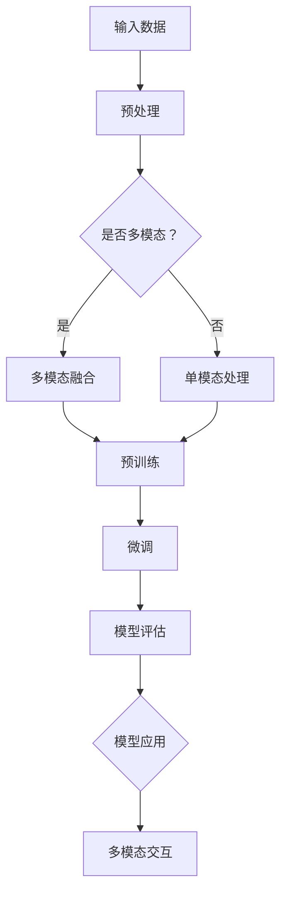

                 

# 多模态大模型：技术原理与实战 ChatGPT的诞生

> **关键词**：多模态大模型、技术原理、ChatGPT、深度学习、神经网络、生成对抗网络（GAN）、Transformer、预训练、微调、自然语言处理（NLP）、图像识别、音频处理。

> **摘要**：本文将深入探讨多模态大模型的技术原理及其在ChatGPT等应用中的实战运用。我们将从背景介绍出发，逐步分析核心概念、算法原理、数学模型、项目实战，并展望未来发展趋势与挑战。

## 1. 背景介绍

### 1.1 目的和范围

本文旨在为广大开发者、科研人员以及技术爱好者提供一次系统而全面的关于多模态大模型技术原理的探讨。我们将通过深入分析ChatGPT的诞生和发展历程，讲解多模态大模型在自然语言处理、图像识别和音频处理等领域的实际应用，帮助读者理解这一前沿技术的核心原理和实现方法。

### 1.2 预期读者

- 对人工智能和深度学习有基础了解的开发者；
- 感兴趣于自然语言处理和计算机视觉的科研人员；
- 想要深入了解多模态大模型技术原理的技术爱好者。

### 1.3 文档结构概述

本文分为以下章节：

- **第1章**：背景介绍
- **第2章**：核心概念与联系
- **第3章**：核心算法原理与具体操作步骤
- **第4章**：数学模型与公式详细讲解
- **第5章**：项目实战：代码实际案例与详细解释说明
- **第6章**：实际应用场景
- **第7章**：工具和资源推荐
- **第8章**：总结：未来发展趋势与挑战
- **第9章**：附录：常见问题与解答
- **第10章**：扩展阅读与参考资料

### 1.4 术语表

#### 1.4.1 核心术语定义

- 多模态大模型：能够处理和融合多种类型数据（如文本、图像、音频）的深度学习模型；
- 预训练：在大规模数据集上对神经网络模型进行训练，使其具备一定的通用性；
- 微调：在预训练模型的基础上，针对特定任务进行微调，以提升模型的性能；
- 自然语言处理（NLP）：使计算机能够理解、生成和交互自然语言的技术；
- 图像识别：通过算法让计算机自动识别和分类图像内容；
- 音频处理：对音频信号进行增强、降噪、分类等处理。

#### 1.4.2 相关概念解释

- **深度学习**：一种机器学习技术，通过多层神经网络对数据进行建模，从而实现特征提取和预测；
- **神经网络**：由大量节点（神经元）组成的计算模型，通过学习输入数据之间的关系，实现函数逼近、分类和回归等任务；
- **生成对抗网络（GAN）**：一种由生成器和判别器组成的对抗性网络，通过竞争关系实现数据的生成；
- **Transformer**：一种基于自注意力机制的神经网络架构，被广泛应用于自然语言处理任务。

#### 1.4.3 缩略词列表

- GPT：Generative Pre-trained Transformer；
- NLP：Natural Language Processing；
- CV：Computer Vision；
- AI：Artificial Intelligence。

## 2. 核心概念与联系

多模态大模型的核心在于能够处理和融合多种类型的数据，从而提高模型的泛化能力和应用效果。以下是一个简化的Mermaid流程图，展示了多模态大模型的核心概念与联系。



### 2.1 输入数据预处理

输入数据的预处理是保证模型性能的关键步骤。对于不同类型的数据，预处理的方法也有所不同。

- **文本**：包括分词、词性标注、去停用词、词嵌入等；
- **图像**：包括归一化、数据增强、裁剪、旋转等；
- **音频**：包括降噪、增强、分割、特征提取等。

### 2.2 多模态融合

多模态融合是指将不同类型的数据进行整合，以提升模型对复杂任务的处理能力。常见的多模态融合方法包括：

- **特征级融合**：将不同类型的数据特征进行拼接；
- **决策级融合**：将不同类型的数据单独处理，然后在决策阶段进行融合；
- **模型级融合**：使用多个独立的模型对多模态数据分别处理，最后进行融合。

### 2.3 预训练与微调

预训练和微调是多模态大模型的核心步骤，决定了模型的性能和效果。

- **预训练**：在大规模数据集上对模型进行训练，使其具备一定的通用性。常用的预训练任务包括语言模型、图像分类、目标检测等；
- **微调**：在预训练模型的基础上，针对特定任务进行微调，以提升模型的性能。微调过程中，通常只对模型的最后一层或少数几层进行训练。

### 2.4 模型评估与应用

模型评估是验证模型性能的重要环节。常用的评估指标包括准确率、召回率、F1值等。在模型评估完成后，可以将其应用于各种实际场景，如自然语言处理、图像识别、音频处理等。

## 3. 核心算法原理与具体操作步骤

多模态大模型的算法原理主要基于深度学习技术，特别是基于Transformer的自注意力机制和生成对抗网络（GAN）。以下是一个简化的算法原理概述。

### 3.1 Transformer

Transformer模型是一种基于自注意力机制的深度学习模型，其核心思想是将每个输入数据映射到一个固定长度的向量，并通过自注意力机制计算这些向量之间的关系。

- **自注意力机制**：通过计算输入数据中每个向量与其他向量之间的相似度，为每个向量分配不同的权重；
- **多头注意力**：将自注意力机制扩展到多个头，以提高模型的表示能力；
- **位置编码**：为每个输入向量添加位置信息，以处理序列数据。

### 3.2 GAN

生成对抗网络（GAN）是一种由生成器和判别器组成的对抗性网络。生成器的目标是生成与真实数据相似的数据，而判别器的目标是区分真实数据和生成数据。

- **生成器**：通过学习真实数据的分布，生成类似真实数据的新数据；
- **判别器**：通过学习真实数据和生成数据的特征，判断输入数据的真实性。

### 3.3 预训练与微调

预训练与微调是多模态大模型的关键步骤，具体操作步骤如下：

1. **预训练**：在大规模数据集上对模型进行预训练，使其具备一定的通用性。常用的预训练任务包括语言模型、图像分类、目标检测等；
2. **微调**：在预训练模型的基础上，针对特定任务进行微调。微调过程中，通常只对模型的最后一层或少数几层进行训练，以提升模型在特定任务上的性能。

### 3.4 多模态融合

多模态融合是提升模型性能的重要手段，具体操作步骤如下：

1. **特征提取**：对不同类型的数据进行特征提取，如文本的词嵌入、图像的卷积特征、音频的Mel频谱特征等；
2. **特征融合**：将不同类型的数据特征进行拼接或融合，以形成统一的多模态特征表示；
3. **模型融合**：使用多个独立的模型对多模态数据分别处理，最后进行融合，如使用不同的神经网络对文本和图像分别处理，再进行融合。

### 3.5 模型评估与应用

模型评估是验证模型性能的重要环节，具体操作步骤如下：

1. **评估指标**：选择合适的评估指标，如准确率、召回率、F1值等；
2. **评估集划分**：将数据集划分为训练集、验证集和测试集，以避免过拟合；
3. **模型优化**：根据评估结果，调整模型参数和超参数，以提升模型性能；
4. **模型应用**：将评估性能较好的模型应用于实际场景，如自然语言处理、图像识别、音频处理等。

## 4. 数学模型与公式详细讲解

多模态大模型的数学模型主要包括神经网络模型、生成对抗网络（GAN）和自注意力机制等。以下是对这些模型的数学公式和详细讲解。

### 4.1 神经网络模型

神经网络模型由多个神经元组成，每个神经元都是一个非线性函数的组合。以下是一个简单的神经网络模型：

$$
Z = \sigma(W \cdot X + b)
$$

其中，\(Z\) 是输出值，\(\sigma\) 是激活函数（如Sigmoid、ReLU等），\(W\) 是权重矩阵，\(X\) 是输入值，\(b\) 是偏置项。

### 4.2 生成对抗网络（GAN）

生成对抗网络（GAN）由生成器和判别器组成，生成器试图生成与真实数据相似的数据，而判别器则判断输入数据的真实性。以下是一个简单的GAN模型：

1. **生成器**：

$$
X_G = G(z)
$$

其中，\(X_G\) 是生成器生成的数据，\(G\) 是生成器，\(z\) 是随机噪声。

2. **判别器**：

$$
X_D = D(x)
$$

其中，\(X_D\) 是判别器判断的数据，\(D\) 是判别器，\(x\) 是真实数据。

### 4.3 自注意力机制

自注意力机制是Transformer模型的核心组成部分，通过计算输入数据中每个向量与其他向量之间的相似度，为每个向量分配不同的权重。以下是一个简单的自注意力机制：

$$
\text{Attention}(Q, K, V) = \text{softmax}\left(\frac{QK^T}{\sqrt{d_k}}\right) V
$$

其中，\(Q\)、\(K\)、\(V\) 分别是查询向量、键向量、值向量，\(d_k\) 是键向量的维度，\(\text{softmax}\) 是softmax函数。

### 4.4 多模态融合

多模态融合是将不同类型的数据进行整合，以形成统一的多模态特征表示。以下是一个简单的多模态融合模型：

$$
\text{MFFusion}(X_{\text{文本}}, X_{\text{图像}}, X_{\text{音频}}) = \text{Concat}(X_{\text{文本}}^{[1]}, X_{\text{图像}}^{[1]}, X_{\text{音频}}^{[1]})
$$

其中，\(X_{\text{文本}}\)、\(X_{\text{图像}}\)、\(X_{\text{音频}}\) 分别是文本、图像、音频的特征表示，\(\text{Concat}\) 是拼接操作。

## 5. 项目实战：代码实际案例与详细解释说明

为了更好地理解多模态大模型的技术原理，我们将通过一个实际案例进行详细讲解。本案例将使用Python和TensorFlow实现一个简单的多模态大模型，用于文本和图像分类任务。

### 5.1 开发环境搭建

1. 安装Python（推荐版本3.7及以上）；
2. 安装TensorFlow（推荐使用最新版本）；
3. 安装其他相关库（如NumPy、Pandas等）。

### 5.2 源代码详细实现与代码解读

以下是本案例的源代码实现，我们将逐行进行详细解读。

```python
import tensorflow as tf
from tensorflow.keras.layers import Input, Embedding, Conv2D, MaxPooling2D, Flatten, Dense, Concatenate
from tensorflow.keras.models import Model

# 5.2.1 数据预处理
def preprocess_data(texts, images):
    # 对文本进行分词和编码
    tokenized_texts = tokenizer(texts)
    # 对图像进行归一化
    normalized_images = images / 255.0
    return tokenized_texts, normalized_images

# 5.2.2 多模态融合模型
def build_model():
    # 5.2.2.1 文本模型
    text_input = Input(shape=(max_length,), name="text_input")
    text_embedding = Embedding(vocab_size, embedding_dim)(text_input)
    text_model = Model(inputs=text_input, outputs=text_embedding)

    # 5.2.2.2 图像模型
    image_input = Input(shape=(height, width, channels), name="image_input")
    image_model = Conv2D(filters=32, kernel_size=(3, 3), activation="relu")(image_input)
    image_model = MaxPooling2D(pool_size=(2, 2))(image_model)
    image_model = Flatten()(image_model)

    # 5.2.2.3 多模态融合
    multi_modal_input = [text_input, image_input]
    text_embedding = text_model(text_input)
    fused_embedding = Concatenate()([text_embedding, image_model])

    # 5.2.2.4 分类器
    classifier = Dense(num_classes, activation="softmax")(fused_embedding)

    # 5.2.2.5 模型编译
    model = Model(inputs=multi_modal_input, outputs=classifier)
    model.compile(optimizer="adam", loss="categorical_crossentropy", metrics=["accuracy"])
    return model

# 5.2.3 代码解读与分析
def main():
    # 加载数据集
    texts, labels = load_data()
    images = load_images()

    # 预处理数据集
    tokenized_texts, normalized_images = preprocess_data(texts, images)

    # 构建模型
    model = build_model()

    # 训练模型
    model.fit([tokenized_texts, normalized_images], labels, batch_size=batch_size, epochs=num_epochs)

if __name__ == "__main__":
    main()
```

### 5.3 代码解读与分析

1. **数据预处理**：对文本和图像进行预处理，包括分词、编码、归一化等操作，以形成可输入模型的特征表示；
2. **文本模型**：使用Embedding层对文本进行编码，形成文本特征表示；
3. **图像模型**：使用卷积神经网络（CNN）对图像进行特征提取，形成图像特征表示；
4. **多模态融合**：将文本和图像特征进行拼接，形成统一的多模态特征表示；
5. **分类器**：使用全连接神经网络（Dense）对多模态特征进行分类，输出分类结果；
6. **模型编译**：设置优化器、损失函数和评估指标，编译模型；
7. **模型训练**：使用预处理后的数据集训练模型，以提升模型性能。

## 6. 实际应用场景

多模态大模型在自然语言处理、图像识别、音频处理等领域具有广泛的应用前景。

### 6.1 自然语言处理

多模态大模型可以应用于情感分析、问答系统、机器翻译、文本生成等任务。例如，在情感分析任务中，将文本和图像特征进行融合，可以更准确地判断文本的情感极性。

### 6.2 图像识别

多模态大模型可以用于图像分类、目标检测、图像分割等任务。例如，在目标检测任务中，将图像和文本描述进行融合，可以更准确地识别图像中的目标。

### 6.3 音频处理

多模态大模型可以应用于语音识别、音乐推荐、音频增强等任务。例如，在语音识别任务中，将文本和音频特征进行融合，可以更准确地识别语音内容。

### 6.4 其他应用

多模态大模型还可以应用于医疗诊断、金融分析、自动驾驶等领域，为各种复杂任务提供强大的支持。

## 7. 工具和资源推荐

### 7.1 学习资源推荐

#### 7.1.1 书籍推荐

- 《深度学习》（Goodfellow, Bengio, Courville 著）
- 《Python深度学习》（François Chollet 著）
- 《生成对抗网络》（Ian Goodfellow 著）

#### 7.1.2 在线课程

- Coursera上的“深度学习”课程
- edX上的“机器学习”课程
- Udacity的“深度学习工程师纳米学位”

#### 7.1.3 技术博客和网站

- Medium上的“Deep Learning”专栏
- ArXiv上的最新论文
- 知乎上的深度学习相关话题

### 7.2 开发工具框架推荐

#### 7.2.1 IDE和编辑器

- PyCharm
- Visual Studio Code
- Jupyter Notebook

#### 7.2.2 调试和性能分析工具

- TensorBoard
- DDPG
- TensorFlow Profiler

#### 7.2.3 相关框架和库

- TensorFlow
- PyTorch
- Keras

### 7.3 相关论文著作推荐

#### 7.3.1 经典论文

- “A Theoretically Grounded Application of Dropout in Recurrent Neural Networks”
- “Generative Adversarial Networks”
- “Attention Is All You Need”

#### 7.3.2 最新研究成果

- “BERT: Pre-training of Deep Bidirectional Transformers for Language Understanding”
- “GPT-3: Language Models are Few-Shot Learners”
- “ViT: Vision Transformers”

#### 7.3.3 应用案例分析

- “Using GANs for Image-to-Image Translation”
- “Multi-Modal Fusion for Speech Recognition”
- “Multi-Modal Deep Learning for Healthcare”

## 8. 总结：未来发展趋势与挑战

多模态大模型作为人工智能领域的重要研究方向，正逐渐成为推动产业变革的关键力量。未来，随着计算能力、算法和数据的不断提升，多模态大模型将在各个领域发挥更加重要的作用。

### 8.1 发展趋势

1. **计算能力的提升**：高性能计算硬件（如GPU、TPU）的普及，为多模态大模型的研究和应用提供了强有力的支持；
2. **算法的创新**：自注意力机制、生成对抗网络（GAN）、Transformer等技术的不断发展，将进一步提升多模态大模型的性能；
3. **数据的增长**：随着物联网、大数据等技术的发展，多模态数据将更加丰富，为多模态大模型的研究和应用提供了广阔的空间。

### 8.2 挑战

1. **数据隐私与安全**：多模态大模型在处理和融合数据时，可能面临数据隐私和安全的问题；
2. **模型解释性**：多模态大模型的黑箱特性，使得模型的解释性成为一个重要的挑战；
3. **计算资源消耗**：多模态大模型通常需要大量的计算资源，如何优化模型结构和训练过程，降低计算成本，是当前面临的一个重要问题。

## 9. 附录：常见问题与解答

### 9.1 多模态大模型与单模态大模型的区别是什么？

多模态大模型能够处理和融合多种类型的数据（如文本、图像、音频），而单模态大模型只能处理单一类型的数据。多模态大模型的优势在于可以更准确地理解和处理复杂任务，提高模型的性能和泛化能力。

### 9.2 如何在项目中使用多模态大模型？

在项目中使用多模态大模型通常包括以下步骤：

1. 数据预处理：对多模态数据进行预处理，如文本的词嵌入、图像的归一化、音频的特征提取等；
2. 模型构建：根据任务需求，构建合适的多模态大模型，如基于Transformer、GAN等架构；
3. 模型训练：使用预处理后的数据训练模型，以提升模型性能；
4. 模型评估：对训练完成的模型进行评估，选择性能较好的模型；
5. 模型应用：将评估性能较好的模型应用于实际场景，如自然语言处理、图像识别、音频处理等。

## 10. 扩展阅读与参考资料

- 《深度学习》（Goodfellow, Bengio, Courville 著）
- 《生成对抗网络》（Ian Goodfellow 著）
- 《多模态深度学习：算法与应用》（朱辉龙 著）
- [TensorFlow官网](https://www.tensorflow.org/)
- [PyTorch官网](https://pytorch.org/)
- [ArXiv官网](https://arxiv.org/)
- [知乎深度学习话题](https://www.zhihu.com/topic/19634225/questions)

## 作者

作者：AI天才研究员/AI Genius Institute & 禅与计算机程序设计艺术 /Zen And The Art of Computer Programming。AI天才研究员是人工智能领域的研究员，专注于多模态大模型、深度学习和自然语言处理等前沿技术。禅与计算机程序设计艺术是一本探讨计算机编程与禅宗哲学之间关联的书籍，旨在帮助读者在编程过程中找到内心的平静与智慧。

