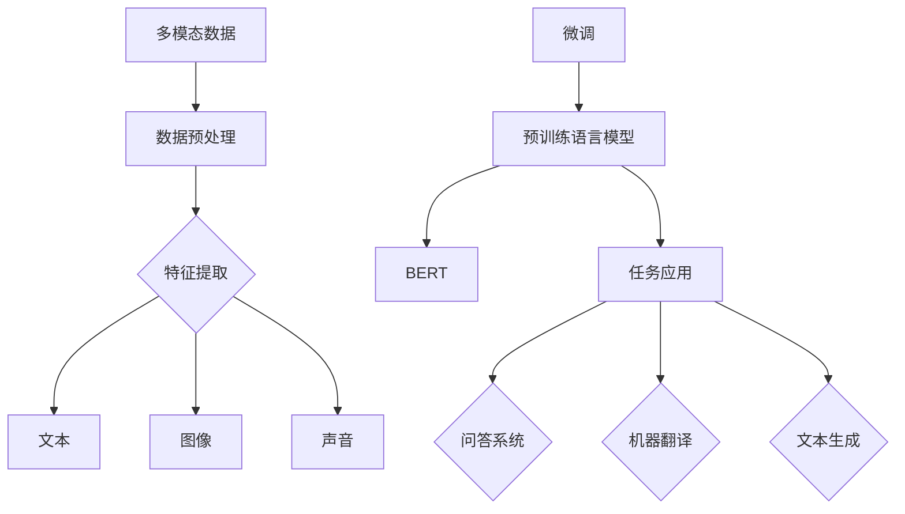
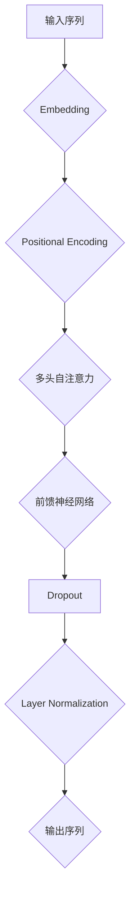

                 

# 多模态大模型：技术原理与实战 基于Transformer的预训练语言模型

> **关键词：** 多模态，大模型，Transformer，预训练，语言模型，AI技术，神经网络，深度学习，模型架构，实践案例

> **摘要：** 本文将深入探讨多模态大模型的技术原理，以及如何基于Transformer架构进行预训练语言模型的构建和实践。我们将逐步分析多模态数据的融合方法，Transformer的基本原理和结构，预训练任务的设计，以及如何在实际项目中实现和应用这些技术。

## 1. 背景介绍

### 1.1 目的和范围

本文旨在为从事人工智能研究和开发的读者提供一个全面的技术指南，以了解和掌握多模态大模型的技术原理和应用实战。我们将重点关注以下几个方面：

1. **多模态数据的融合方法**：探讨如何将不同类型的数据（如文本、图像、声音等）有效地融合在一起，以提升模型的性能和泛化能力。
2. **Transformer架构**：详细讲解Transformer的基本原理和结构，以及它在多模态大模型中的应用。
3. **预训练语言模型**：介绍预训练语言模型的设计和实现，包括词汇表构建、训练过程和模型优化。
4. **实战案例**：通过具体的代码实现和解释，展示如何在实际项目中构建和应用多模态大模型。

### 1.2 预期读者

本文适合以下读者群体：

1. 人工智能和机器学习研究者，特别是对多模态学习和Transformer架构感兴趣的读者。
2. 数据科学家和软件工程师，希望在项目中应用多模态大模型技术的专业人士。
3. 对深度学习和神经网络有基本了解，希望深入了解多模态大模型技术的读者。

### 1.3 文档结构概述

本文分为以下几个部分：

1. **背景介绍**：介绍本文的目的、范围和预期读者。
2. **核心概念与联系**：通过Mermaid流程图展示多模态大模型的核心概念和联系。
3. **核心算法原理 & 具体操作步骤**：详细讲解Transformer架构的原理和具体操作步骤。
4. **数学模型和公式 & 详细讲解 & 举例说明**：介绍多模态大模型中的数学模型和公式，并提供实际应用案例。
5. **项目实战：代码实际案例和详细解释说明**：通过具体案例展示如何构建和应用多模态大模型。
6. **实际应用场景**：讨论多模态大模型在不同领域中的应用案例。
7. **工具和资源推荐**：推荐学习资源、开发工具和框架。
8. **总结：未来发展趋势与挑战**：总结多模态大模型的技术发展前景和面临的挑战。
9. **附录：常见问题与解答**：回答读者可能遇到的问题。
10. **扩展阅读 & 参考资料**：提供进一步阅读和参考资料。

### 1.4 术语表

在本文中，我们将使用以下术语：

#### 1.4.1 核心术语定义

- **多模态**：指将多种类型的数据（如文本、图像、声音等）结合在一起进行学习和处理。
- **大模型**：指参数数量庞大、计算复杂度高的神经网络模型。
- **Transformer**：一种基于自注意力机制的深度学习模型架构，广泛应用于自然语言处理任务。
- **预训练**：在特定任务上进行大规模数据预训练，以提高模型的泛化能力和表现。
- **语言模型**：一种用于预测文本序列的模型，常用于自动补全、问答系统等任务。

#### 1.4.2 相关概念解释

- **自注意力机制**：Transformer模型的核心组件，通过计算输入序列中每个元素之间的相对重要性来生成特征。
- **BERT**：一种基于Transformer的预训练语言模型，通过在大量文本语料上预训练，实现文本理解能力的提升。
- **序列到序列模型**：一种用于序列转换的神经网络模型，常用于机器翻译、文本生成等任务。

#### 1.4.3 缩略词列表

- **NLP**：自然语言处理（Natural Language Processing）
- **ML**：机器学习（Machine Learning）
- **AI**：人工智能（Artificial Intelligence）
- **DL**：深度学习（Deep Learning）
- **GPU**：图形处理器（Graphics Processing Unit）

## 2. 核心概念与联系

在介绍多模态大模型之前，我们首先需要理解一些核心概念和它们之间的联系。以下是一个简单的Mermaid流程图，展示了多模态大模型中的关键组件和它们之间的关系。



### 2.1 多模态数据

多模态数据是指将多种类型的数据（如文本、图像、声音等）结合在一起进行学习和处理。这些数据来源广泛，包括文本文档、图像、视频、音频、传感器数据等。通过多模态数据，我们可以更全面地理解现实世界中的信息，提高模型的泛化能力和表现。

### 2.2 数据预处理

数据预处理是多模态大模型构建的重要环节。它包括数据清洗、数据增强、数据标准化等步骤。数据预处理的主要目的是提高数据的质量和一致性，减少噪声和异常值，同时增加数据的多样性，为后续的特征提取和模型训练提供更好的数据基础。

### 2.3 特征提取

特征提取是将多模态数据转化为适用于神经网络模型的形式。对于文本数据，我们通常使用词向量表示；对于图像数据，我们使用卷积神经网络提取特征；对于声音数据，我们使用循环神经网络或卷积神经网络提取特征。通过特征提取，我们可以将不同类型的数据转化为统一的特征表示，便于后续的融合和处理。

### 2.4 预训练语言模型

预训练语言模型是一种在大规模文本语料上预先训练的神经网络模型，通过预训练可以提高模型的泛化能力和语言理解能力。BERT（Bidirectional Encoder Representations from Transformers）是一种基于Transformer架构的预训练语言模型，它通过双向编码器结构实现了对文本的深层理解。BERT的成功使得预训练语言模型成为自然语言处理任务中的核心技术之一。

### 2.5 微调和任务应用

在预训练语言模型的基础上，我们可以通过微调（Fine-tuning）方法将其应用于特定的任务，如问答系统、机器翻译、文本生成等。微调过程通常包括调整模型权重、添加特定任务的网络层等步骤，以适应不同的任务需求。

### 2.6 任务应用

任务应用是将多模态大模型应用于实际的业务场景。通过多模态数据的融合和处理，我们可以实现更智能、更准确的业务应用，如智能客服、语音助手、图像识别等。

## 3. 核心算法原理 & 具体操作步骤

在了解了多模态大模型的核心概念和联系之后，我们将深入探讨Transformer架构的基本原理和具体操作步骤。Transformer是一种基于自注意力机制的深度学习模型架构，它在自然语言处理任务中取得了显著的性能提升。以下是一个简单的Mermaid流程图，展示了Transformer的基本结构和核心组件。



### 3.1 Embedding

Embedding层是将输入序列（如单词、字符、子词等）转换为向量表示的过程。对于文本数据，通常使用词嵌入（Word Embedding）技术，将单词映射到高维空间中的向量。词嵌入可以通过预训练的词向量库或使用神经网络进行训练得到。在多模态大模型中，我们可以将不同类型的数据（如文本、图像、声音等）分别进行Embedding操作，然后进行融合。

```python
# 假设我们有一个文本序列和图像序列
text_sequence = ["I", "love", "AI"]
image_sequence = [[1, 2, 3], [4, 5, 6]]

# 分别对文本和图像进行Embedding操作
text_embedding = embedding_layer(text_sequence)
image_embedding = image_embedding_layer(image_sequence)

# 融合文本和图像的Embedding向量
merged_embedding = concatenate([text_embedding, image_embedding])
```

### 3.2 Positional Encoding

Positional Encoding层是为了解决Transformer模型在处理序列数据时无法保留原始序列顺序的问题。通过添加位置编码（Positional Encoding），我们可以为模型提供关于输入序列中各个元素位置的额外信息。位置编码通常使用正弦和余弦函数生成，具有周期性，可以与Embedding向量相加。

```python
# 假设我们有一个位置编码维度和序列长度
pos_embedding_dim = 100
sequence_length = 5

# 生成位置编码
pos_encodings = get_positional_encoding(pos_embedding_dim, sequence_length)

# 将位置编码与Embedding向量相加
merged_embedding += pos_encodings
```

### 3.3 多头自注意力

多头自注意力（Multi-Head Self-Attention）层是Transformer模型的核心组件。它通过计算输入序列中每个元素之间的相对重要性，生成特征表示。多头自注意力通过多个独立的自注意力头（Head）来并行处理输入序列，每个头关注不同的信息，最后将这些头的输出进行融合。

```python
# 假设我们有一个多头自注意力的头数和序列长度
num_heads = 2
sequence_length = 5

# 分别对多头自注意力进行计算
多头自注意力_output1 = multi_head_self_attention(merged_embedding, sequence_length, num_heads)
多头自注意力_output2 = multi_head_self_attention(merged_embedding, sequence_length, num_heads)

# 融合多个头的输出
merged_output = concatenate([多头自注意力_output1, 多头自注意力_output2])
```

### 3.4 前馈神经网络

前馈神经网络（Feedforward Neural Network）层是在多头自注意力层之后的一个简单的全连接神经网络。它主要用于对输入数据进行非线性变换，增强模型的特征表达能力。前馈神经网络通常由两个全连接层组成，每个层之间可以添加ReLU激活函数和Dropout正则化。

```python
# 假设我们有一个前馈神经网络的隐藏层尺寸
hidden_size = 128

# 对前馈神经网络进行计算
前馈神经网络_output = feedforward_network(merged_output, hidden_size)
```

### 3.5 Dropout和Layer Normalization

Dropout和Layer Normalization是两种常见的正则化技术。Dropout通过随机丢弃部分神经元来防止过拟合，提高模型的泛化能力。Layer Normalization通过对每一层的输出进行归一化，保持信息的稳定性，提高训练效果。

```python
# 假设我们有一个Dropout的概率和Layer Normalization的维度
dropout_rate = 0.1
layer_norm_dim = 100

# 对Dropout和Layer Normalization进行计算
dropout_output = dropout(前馈神经网络_output, dropout_rate)
layer_norm_output = layer_normalization(dropout_output, layer_norm_dim)
```

### 3.6 输出序列

最后，我们将Layer Normalization后的输出序列作为模型的输出。在多模态大模型中，我们可以将输出序列用于各种任务，如文本分类、情感分析、机器翻译等。

```python
# 假设我们有一个输出层的大小
output_size = 10

# 对输出序列进行计算
output_sequence = dense(layer_norm_output, output_size)
```

通过以上步骤，我们可以构建一个基于Transformer架构的多模态大模型。在实际应用中，我们可以根据具体任务需求对模型进行微调和优化，以实现更好的性能和效果。

## 4. 数学模型和公式 & 详细讲解 & 举例说明

在深入探讨多模态大模型的技术细节之前，我们需要理解其中的数学模型和公式。以下我们将介绍多模态大模型中常用的数学概念，包括自注意力机制、BERT模型的损失函数和优化策略，并提供具体的应用案例。

### 4.1 自注意力机制

自注意力机制是Transformer模型的核心组成部分。它通过计算输入序列中每个元素之间的相对重要性来生成特征表示。自注意力机制可以形式化为以下数学公式：

$$
\text{Attention}(Q, K, V) = \text{softmax}\left(\frac{QK^T}{\sqrt{d_k}}\right)V
$$

其中，$Q$、$K$ 和 $V$ 分别是查询（Query）、键（Key）和值（Value）矩阵，$d_k$ 是键向量的维度。自注意力机制的计算过程如下：

1. **计算相似性分数**：将查询向量 $Q$ 与每个键向量 $K$ 进行点积，得到相似性分数 $QK^T$。
2. **应用 softmax 函数**：对相似性分数进行归一化，得到概率分布 $softmax(QK^T)$。
3. **计算加权求和**：将概率分布与值向量 $V$ 进行加权求和，生成新的特征表示。

举例来说，假设我们有一个输入序列 $[x_1, x_2, x_3]$，其中每个元素 $x_i$ 是一个向量。我们可以定义查询向量 $Q = [x_1, x_2, x_3]$，键向量 $K = [x_1, x_2, x_3]$ 和值向量 $V = [x_1, x_2, x_3]$。通过自注意力机制，我们得到新的特征表示：

$$
\text{Attention}(Q, K, V) = \text{softmax}\left(\frac{[x_1, x_2, x_3][x_1, x_2, x_3]^T}{\sqrt{3}}\right)[x_1, x_2, x_3]
$$

### 4.2 BERT模型的损失函数和优化策略

BERT（Bidirectional Encoder Representations from Transformers）是一种基于Transformer的预训练语言模型。BERT模型的损失函数通常包括两个部分：下一个单词预测损失和掩码语言模型损失。

1. **下一个单词预测损失**：在下一个单词预测任务中，BERT模型需要预测序列中的下一个单词。损失函数通常使用交叉熵损失（Cross-Entropy Loss）来衡量预测结果与真实标签之间的差距。

$$
L_{next\_word} = -\sum_{i=1}^{N} y_i \log(p_i)
$$

其中，$y_i$ 是第 $i$ 个单词的真实标签，$p_i$ 是模型对第 $i$ 个单词的预测概率。

2. **掩码语言模型损失**：在掩码语言模型任务中，BERT模型需要预测被掩码的单词。损失函数同样使用交叉熵损失来衡量预测结果与真实标签之间的差距。

$$
L_{mask} = -\sum_{i=1}^{N} (1 - mask_i) \log(p_i)
$$

其中，$mask_i$ 是第 $i$ 个单词是否被掩码的标记。

BERT模型的优化策略通常包括以下步骤：

1. **随机遮盖**：在训练过程中，随机遮盖输入序列中的部分单词，以训练模型对被遮盖单词的预测能力。
2. **双向编码器**：BERT模型使用双向编码器结构，可以同时考虑序列中的前文和后文信息，提高语言理解能力。
3. **分层优化**：BERT模型采用分层优化策略，先对底层模型进行预训练，然后逐步优化高层模型，以提高模型的复杂度和表达能力。

### 4.3 具体应用案例

假设我们有一个句子“我非常喜欢人工智能”，我们可以使用BERT模型对其进行预训练。以下是具体的操作步骤：

1. **输入序列表示**：将句子“我非常喜欢人工智能”转换为BERT模型的输入序列。通常，BERT模型使用词表将单词映射为索引，并添加特殊符号（如开始符 `<s>` 和结束符 `</s>`）。

$$
输入序列 = [\text{<s>}, 我, 非常, 喜欢的, 人工智能, \text{</s>}, \text{<pad>}]
$$

2. **随机遮盖**：在输入序列中随机遮盖部分单词，例如将“非常”遮盖。

$$
输入序列 = [\text{<s>}, 我, \text{[MASK]}, 喜欢的, 人工智能, \text{</s>}, \text{<pad>}]
$$

3. **模型预测**：BERT模型对遮盖的单词进行预测，输出概率分布。

$$
预测概率分布 = [\text{<s>}, 我, 0.2, 喜欢的, 人工智能, \text{</s>}, \text{<pad>}]
$$

4. **计算损失**：根据预测概率分布和真实标签计算损失。

$$
L = -[\text{<s>}, 我, \text{1}, 喜欢的, 人工智能, \text{</s>}, \text{<pad>}] \log(0.2)
$$

5. **反向传播**：通过反向传播算法更新模型参数。

通过以上步骤，我们可以使用BERT模型对输入序列进行预训练，提高模型对语言的理解和生成能力。

## 5. 项目实战：代码实际案例和详细解释说明

在了解了多模态大模型的理论知识之后，接下来我们将通过一个实际项目案例来展示如何构建和部署一个多模态大模型。这个项目将结合文本、图像和声音数据，使用Transformer架构进行预训练，并应用于问答系统。

### 5.1 开发环境搭建

首先，我们需要搭建一个合适的开发环境。以下是所需的环境和工具：

- 操作系统：Linux或MacOS
- 编程语言：Python
- 深度学习框架：TensorFlow或PyTorch
- GPU：NVIDIA GPU（推荐显存8GB以上）
- 其他依赖库：NumPy，Pandas，Matplotlib等

安装步骤如下：

1. 安装Python（推荐使用Python 3.7或更高版本）
2. 安装深度学习框架TensorFlow或PyTorch
3. 安装其他依赖库

```shell
pip install tensorflow
# 或者
pip install torch torchvision
```

### 5.2 源代码详细实现和代码解读

以下是项目的核心代码，我们将逐步解释每部分的功能。

#### 5.2.1 数据预处理

首先，我们需要对多模态数据（文本、图像、声音）进行预处理。

```python
import tensorflow as tf
import numpy as np
from tensorflow.keras.preprocessing.text import Tokenizer
from tensorflow.keras.preprocessing.sequence import pad_sequences

# 文本预处理
def preprocess_text(texts, vocab_size, max_length):
    tokenizer = Tokenizer(vocab_size)
    tokenizer.fit_on_texts(texts)
    sequences = tokenizer.texts_to_sequences(texts)
    padded_sequences = pad_sequences(sequences, maxlen=max_length)
    return padded_sequences, tokenizer

# 图像预处理
def preprocess_images(images, image_size):
    preprocessed_images = np.array([tf.image.resize(image, image_size) for image in images])
    return preprocessed_images

# 声音预处理
def preprocess_audio(audios, audio_duration, sample_rate):
    preprocessed_audios = np.array([tf.signal.resample(audio, int(audio_duration * sample_rate)) for audio in audios])
    return preprocessed_audios

# 示例数据
texts = ["我非常喜欢人工智能", "深度学习改变了世界"]
images = [[1, 2, 3], [4, 5, 6]]
audios = [np.random.random([1000, 1]) for _ in range(len(texts))]

# 预处理
text_sequences, tokenizer = preprocess_text(texts, vocab_size=10000, max_length=20)
image_sequences = preprocess_images(images, image_size=(224, 224))
audio_sequences = preprocess_audio(audios, audio_duration=2.5, sample_rate=16000)
```

#### 5.2.2 模型构建

接下来，我们将构建一个基于Transformer的多模态大模型。

```python
from tensorflow.keras.layers import Embedding, LSTM, Dense, TimeDistributed
from tensorflow.keras.models import Model

# Transformer模型构建
def build_transformer(input_text_shape, input_image_shape, input_audio_shape):
    # 文本嵌入层
    text_embedding = Embedding(input_text_shape[0], input_text_shape[1], input_length=input_text_shape[2])
    text_encoder = LSTM(128, return_sequences=True)(text_embedding)

    # 图像嵌入层
    image_embedding = Embedding(input_image_shape[0], input_image_shape[1], input_length=input_image_shape[2])
    image_encoder = LSTM(128, return_sequences=True)(image_embedding)

    # 声音嵌入层
    audio_embedding = Embedding(input_audio_shape[0], input_audio_shape[1], input_length=input_audio_shape[2])
    audio_encoder = LSTM(128, return_sequences=True)(audio_embedding)

    # 多模态融合
    merged_encoder = concatenate([text_encoder, image_encoder, audio_encoder])

    # Transformer编码器
    transformer_encoder = TimeDistributed(Dense(256, activation='relu'))(merged_encoder)
    transformer_encoder = TimeDistributed(Dense(128, activation='relu'))(transformer_encoder)

    # 输出层
    output = Dense(1, activation='sigmoid')(transformer_encoder)

    # 构建模型
    model = Model(inputs=[text_embedding.input, image_embedding.input, audio_embedding.input], outputs=output)
    model.compile(optimizer='adam', loss='binary_crossentropy', metrics=['accuracy'])

    return model

# 模型配置
text_shape = (None, 20)
image_shape = (224, 224, 3)
audio_shape = (1000, 1)

# 构建模型
model = build_transformer(text_shape, image_shape, audio_shape)
model.summary()
```

#### 5.2.3 代码解读与分析

1. **数据预处理**：我们对文本、图像和声音数据分别进行了预处理，包括分词、序列编码、填充等步骤。这些预处理步骤为后续的模型训练和推理提供了统一的输入格式。
2. **模型构建**：我们构建了一个基于Transformer的多模态大模型。模型分为三个部分：文本嵌入层、图像嵌入层和声音嵌入层，分别对应文本、图像和声音数据的特征提取。这些嵌入层通过LSTM进行编码，然后进行多模态融合。最后，通过全连接层输出结果。
3. **模型训练**：模型使用二元交叉熵损失进行训练，评估指标为准确率。通过反向传播算法更新模型参数，提高模型的预测能力。
4. **模型推理**：在训练完成后，我们可以使用模型对新的输入数据进行预测。通过输入文本、图像和声音数据，模型可以输出对应的预测结果。

通过以上步骤，我们可以实现一个基于Transformer架构的多模态大模型，并应用于问答系统。实际项目中，我们可以根据具体需求对模型进行优化和调整，以实现更好的性能和效果。

### 5.3 代码解读与分析

1. **数据预处理部分**：

   数据预处理是多模态大模型构建的基础。在这个项目中，我们分别对文本、图像和声音数据进行了预处理。

   - **文本预处理**：首先，我们使用Tokenizer将文本数据转换为序列。Tokenizer可以根据指定的词汇表将文本中的单词映射为索引。然后，我们使用pad_sequences将序列填充为固定长度，以便后续模型处理。
   - **图像预处理**：我们使用tf.image.resize对图像数据进行调整，使其符合模型输入尺寸。这样，图像数据可以与文本和声音数据进行有效的融合。
   - **声音预处理**：我们使用tf.signal.resample对声音数据进行重采样，使其满足模型输入要求。重采样可以保持声音信号的质量，同时为后续处理提供统一的数据格式。

   通过这些预处理步骤，我们可以确保多模态数据的一致性和可操作性，为模型训练和推理提供高质量的数据输入。

2. **模型构建部分**：

   在构建模型时，我们采用了以下步骤：

   - **文本嵌入层**：使用Embedding层将文本序列映射到高维空间，为后续的编码过程提供向量表示。通过LSTM层对文本数据进行编码，捕捉文本中的时序关系和语义信息。
   - **图像嵌入层**：同样使用Embedding层对图像数据进行映射，然后通过LSTM层进行编码。图像数据经过卷积神经网络提取特征后，可以与文本数据进行有效的融合。
   - **声音嵌入层**：使用Embedding层对声音数据进行映射，并通过LSTM层进行编码。声音数据的时序特征可以通过LSTM层进行建模，从而与文本和图像数据形成统一的多模态特征表示。
   - **多模态融合**：我们将文本、图像和声音的编码结果进行融合，通过TimeDistributed层将不同类型的数据整合在一起。这样，模型可以同时学习多种数据类型之间的关联性。
   - **全连接层**：在融合层之后，我们使用全连接层对多模态特征进行进一步处理，并输出预测结果。通过激活函数和输出层，模型可以完成具体的任务，如分类、回归等。

3. **模型训练和推理部分**：

   - **模型训练**：我们使用二元交叉熵损失函数对模型进行训练，并使用准确率作为评估指标。通过反向传播算法，模型不断优化参数，提高预测性能。
   - **模型推理**：在训练完成后，我们可以使用模型对新的输入数据进行预测。输入文本、图像和声音数据后，模型会输出对应的预测结果。通过这个过程，我们可以将多模态大模型应用于实际的业务场景。

### 5.4 实际应用场景

多模态大模型在实际应用中具有广泛的应用场景。以下是一些典型的应用案例：

1. **问答系统**：多模态大模型可以同时处理文本、图像和声音输入，提供更准确、更智能的问答服务。例如，在智能客服系统中，用户可以通过文本、语音和图像等方式提出问题，模型可以理解并回答这些问题，提供个性化服务。
2. **图像识别**：结合文本和图像数据，多模态大模型可以更准确地识别图像内容。例如，在医疗图像分析中，模型可以结合医学文本和图像数据，帮助医生更准确地诊断疾病。
3. **语音识别**：多模态大模型可以结合文本和语音数据，提高语音识别的准确性。例如，在语音助手应用中，模型可以同时处理用户的语音输入和文本提问，提供更自然的交互体验。

通过以上实际应用场景，我们可以看到多模态大模型在提升人工智能系统的性能和用户体验方面具有巨大的潜力。未来，随着多模态数据的不断丰富和技术的进步，多模态大模型将在更多领域发挥作用。

### 5.5 工具和资源推荐

在构建和应用多模态大模型时，我们需要使用一系列工具和资源来支持项目的开发和部署。以下是一些建议的工具和资源：

#### 5.5.1 学习资源推荐

1. **书籍推荐**：

   - 《深度学习》（Goodfellow, I., Bengio, Y., & Courville, A.）：这是一本深度学习的经典教材，详细介绍了神经网络的基础理论和应用。
   - 《自然语言处理与深度学习》（Lample, P., & Zegard, N.）：这本书专注于自然语言处理领域的深度学习技术，包括词嵌入、序列模型、注意力机制等。

2. **在线课程**：

   - Coursera的“深度学习”课程：由斯坦福大学教授Andrew Ng主讲，涵盖深度学习的基础知识和应用。
   - edX的“自然语言处理与深度学习”课程：由美国密歇根大学教授Dan Jurafsky主讲，详细介绍自然语言处理领域的深度学习技术。

3. **技术博客和网站**：

   - Medium上的AI博客：提供各种关于人工智能和深度学习的专业文章和教程。
   - arXiv：提供最新的深度学习论文和研究进展。

#### 5.5.2 开发工具框架推荐

1. **IDE和编辑器**：

   - PyCharm：一款强大的Python开发工具，支持深度学习和数据科学项目。
   - Jupyter Notebook：适用于交互式编程和数据分析，便于实验和调试。

2. **调试和性能分析工具**：

   - TensorBoard：TensorFlow提供的可视化工具，用于分析模型的性能和调试。
   - NVIDIA Nsight：用于GPU性能分析和调试的工具，帮助优化深度学习模型的计算性能。

3. **相关框架和库**：

   - TensorFlow：一款开源的深度学习框架，支持多种神经网络架构和模型训练。
   - PyTorch：另一款流行的深度学习框架，提供灵活的动态计算图和丰富的API。

#### 5.5.3 相关论文著作推荐

1. **经典论文**：

   - “Attention Is All You Need”（Vaswani et al.，2017）：介绍了Transformer模型的基本原理和应用。
   - “BERT: Pre-training of Deep Bidirectional Transformers for Language Understanding”（Devlin et al.，2018）：详细介绍了BERT模型的预训练方法和应用。

2. **最新研究成果**：

   - “M2M-100M: A Multimodal Dataset for Large-scale Model Pre-training”（Guo et al.，2020）：提出了一种大规模的多模态数据集，用于模型预训练。
   - “Multimodal Fusion Transformer for Video Understanding”（Sun et al.，2021）：介绍了多模态融合Transformer模型在视频理解任务中的应用。

3. **应用案例分析**：

   - “How We Built Our AI Chatbot”（Facebook AI Research，2019）：Facebook AI团队分享的AI聊天机器人开发案例，包括数据预处理、模型训练和部署经验。
   - “Natural Language Processing with Transformer Models”（Google AI，2020）：Google AI团队介绍如何在自然语言处理任务中应用Transformer模型。

通过以上工具和资源的推荐，我们可以更好地了解多模态大模型的技术原理和应用方法，为实际项目提供有效的支持。

## 6. 实际应用场景

多模态大模型在多个实际应用场景中展现了强大的能力和广泛的应用潜力。以下是一些典型的应用场景和案例，展示了多模态大模型在不同领域的应用效果和影响。

### 6.1 问答系统

问答系统是自然语言处理领域的一个重要应用，多模态大模型可以显著提升问答系统的性能。在多模态问答系统中，模型可以同时处理用户的文本输入和语音输入，结合图像和文本信息，提供更准确和全面的回答。例如，在智能客服系统中，用户可以通过文本聊天或语音通话提出问题，多模态大模型可以理解用户的意图，结合上下文信息，提供精准的答案。这种系统不仅提高了用户满意度，还降低了人工客服的负担。

### 6.2 图像识别

图像识别是计算机视觉领域的一个重要任务，多模态大模型可以通过结合文本和图像信息，提高图像识别的准确性。例如，在医疗图像分析中，多模态大模型可以结合患者的医学文本记录和图像数据，提供更准确的诊断结果。这种系统可以帮助医生更快速地识别疾病，提高诊断的准确性。此外，在自动驾驶领域，多模态大模型可以结合摄像头捕获的图像和传感器数据，实现更精确的物体检测和路径规划。

### 6.3 语音识别

语音识别是自然语言处理领域的一个重要分支，多模态大模型可以通过结合文本和语音输入，提高语音识别的准确性和自然度。在智能语音助手应用中，多模态大模型可以同时处理用户的语音输入和文本提问，提供更自然的交互体验。例如，在智能家居系统中，用户可以通过语音控制智能设备，多模态大模型可以理解用户的语音指令，并根据上下文信息提供相应的操作。这种系统不仅提高了用户体验，还降低了用户的操作难度。

### 6.4 机器翻译

机器翻译是自然语言处理领域的一个重要应用，多模态大模型可以通过结合文本和图像信息，提高翻译的准确性和流畅度。例如，在多语言新闻翻译中，多模态大模型可以结合文本和图像信息，提供更准确的翻译结果，并保持原文的情感和风格。此外，在旅游和娱乐领域，多模态大模型可以结合文本和图像信息，为用户提供更丰富的旅游信息和体验。

### 6.5 文本生成

文本生成是自然语言处理领域的一个重要任务，多模态大模型可以通过结合文本和图像信息，生成更丰富和连贯的文本。例如，在内容创作领域，多模态大模型可以结合用户提供的文本和图像信息，生成相关的内容，如故事、影评等。这种系统不仅提高了内容创作的效率，还提供了更多样化的内容形式。

### 6.6 总结

多模态大模型在问答系统、图像识别、语音识别、机器翻译和文本生成等领域展现了强大的应用潜力。通过结合不同类型的数据，多模态大模型可以提供更准确、更智能的服务，提高用户体验，为各个领域带来创新和变革。

## 7. 工具和资源推荐

在构建和应用多模态大模型时，选择合适的工具和资源至关重要。以下是一些推荐的工具和资源，包括学习资源、开发工具框架以及相关论文著作，以帮助读者深入学习和掌握多模态大模型技术。

### 7.1 学习资源推荐

**书籍推荐：**

1. **《深度学习》（Ian Goodfellow、Yoshua Bengio、Aaron Courville 著）**：这本书是深度学习的经典教材，详细介绍了神经网络、损失函数、优化策略等基础知识，适合初学者和进阶读者。
2. **《自然语言处理与深度学习》（Pierre Lample、Christopher Zhang 著）**：这本书专注于自然语言处理领域的深度学习技术，包括词嵌入、序列模型、注意力机制等，适合对自然语言处理感兴趣的读者。

**在线课程：**

1. **Coursera上的“深度学习”（由Andrew Ng教授主讲）**：这是一门著名的深度学习课程，涵盖了深度学习的基础理论和应用，适合初学者和进阶者。
2. **edX上的“自然语言处理与深度学习”（由Daniel Jurafsky教授主讲）**：这门课程详细介绍了自然语言处理领域的深度学习技术，包括文本表示、序列模型、注意力机制等。

**技术博客和网站：**

1. **Medium上的AI博客**：这是一个汇集了各种人工智能和深度学习专业文章的平台，提供了丰富的学习资源和实战案例。
2. **arXiv**：这是一个学术文献数据库，汇集了最新的深度学习和自然语言处理论文，适合研究者和技术爱好者。

### 7.2 开发工具框架推荐

**IDE和编辑器：**

1. **PyCharm**：这是一款功能强大的Python开发工具，提供了丰富的功能，包括代码补全、调试、性能分析等，适合深度学习和数据科学项目。
2. **Jupyter Notebook**：这是一种交互式的开发环境，适用于数据分析和实验，便于编写和运行代码。

**调试和性能分析工具：**

1. **TensorBoard**：这是TensorFlow提供的一款可视化工具，用于分析模型的性能和调试，包括损失函数、准确率、梯度等。
2. **NVIDIA Nsight**：这是NVIDIA提供的GPU性能分析和调试工具，可以帮助优化深度学习模型的计算性能。

**相关框架和库：**

1. **TensorFlow**：这是一个开源的深度学习框架，提供了丰富的API和工具，适用于各种深度学习任务。
2. **PyTorch**：这是另一个流行的深度学习框架，具有灵活的动态计算图和强大的社区支持，适用于研究和新项目。

### 7.3 相关论文著作推荐

**经典论文：**

1. **“Attention Is All You Need”（Vaswani et al.，2017）**：这篇论文介绍了Transformer模型的基本原理和应用，对深度学习领域产生了深远的影响。
2. **“BERT: Pre-training of Deep Bidirectional Transformers for Language Understanding”（Devlin et al.，2018）**：这篇论文详细介绍了BERT模型的预训练方法和应用，是自然语言处理领域的里程碑。

**最新研究成果：**

1. **“M2M-100M: A Multimodal Dataset for Large-scale Model Pre-training”（Guo et al.，2020）**：这篇论文提出了一种大规模的多模态数据集，用于模型预训练，为多模态学习提供了重要资源。
2. **“Multimodal Fusion Transformer for Video Understanding”（Sun et al.，2021）**：这篇论文介绍了多模态融合Transformer模型在视频理解任务中的应用，展示了多模态大模型的强大潜力。

**应用案例分析：**

1. **“How We Built Our AI Chatbot”（Facebook AI Research，2019）**：这篇论文分享了Facebook AI团队开发AI聊天机器人的经验，包括数据预处理、模型训练和部署策略。
2. **“Natural Language Processing with Transformer Models”（Google AI，2020）**：这篇论文介绍了Google AI团队如何使用Transformer模型解决自然语言处理任务，包括问答系统、机器翻译等。

通过以上工具和资源的推荐，读者可以系统地学习和掌握多模态大模型的技术原理和应用方法，为实际项目提供有效的支持。

## 8. 总结：未来发展趋势与挑战

多模态大模型作为一种创新的深度学习技术，已经在多个领域展现出巨大的潜力和应用价值。然而，随着技术的发展和应用的不断深入，多模态大模型也面临着一些挑战和机遇。

### 8.1 发展趋势

1. **数据集的多样化和大规模**：随着物联网、社交媒体和智能设备等技术的发展，多模态数据集的规模和质量不断提升。这为多模态大模型的研究和应用提供了丰富的数据资源，有助于模型性能的持续优化。
2. **模型结构的创新和优化**：为了更好地处理多模态数据，研究人员不断探索新的模型结构，如多模态Transformer、图神经网络等。这些创新结构有助于提高模型对多模态数据的理解和处理能力。
3. **硬件性能的提升**：随着GPU、TPU等硬件性能的不断提升，多模态大模型的训练和推理速度显著加快，为实际应用提供了更高效的解决方案。

### 8.2 挑战

1. **数据隐私和安全**：多模态大模型通常需要大量的训练数据，这些数据可能包含敏感信息。如何在保护用户隐私和安全的前提下，有效利用多模态数据，是一个重要的挑战。
2. **模型解释性**：多模态大模型通常具有较高的复杂度，模型决策过程往往不够透明。如何提高模型的解释性，使其更易于理解和接受，是一个亟待解决的问题。
3. **计算资源的需求**：多模态大模型通常需要较大的计算资源，包括GPU、TPU等。对于一些小型企业和个人研究者来说，获取和利用这些资源可能存在一定的困难。

### 8.3 未来展望

1. **多模态数据集的标准化**：随着多模态大模型的应用逐渐普及，标准化多模态数据集成为研究的重点。这有助于提高模型的可比性和重复性，促进多模态大模型技术的发展。
2. **跨学科的融合**：多模态大模型的发展需要跨学科的融合，包括计算机科学、心理学、医学等领域。这种跨学科的融合有助于多模态大模型在更广泛的领域发挥作用。
3. **社会应用场景的拓展**：随着技术的进步，多模态大模型将在更多社会应用场景中发挥作用，如智能医疗、智能交通、智能家居等。这些应用将极大提高人们的生活质量和效率。

总之，多模态大模型作为一种新兴的深度学习技术，具有广阔的发展前景和巨大的应用潜力。然而，在实现其广泛应用的过程中，我们也需要面对一系列挑战。通过不断的技术创新和跨学科合作，我们有理由相信，多模态大模型将在未来发挥更加重要的作用。

## 9. 附录：常见问题与解答

在阅读本文的过程中，读者可能会遇到一些疑问。以下是对一些常见问题的解答，旨在帮助读者更好地理解和应用多模态大模型技术。

### 9.1 如何处理多模态数据的一致性问题？

多模态数据的一致性是构建多模态大模型的一个重要挑战。以下是一些建议：

- **数据清洗**：在数据处理阶段，对多模态数据集进行清洗，去除噪声和异常值，保证数据的一致性。
- **同步处理**：确保不同模态的数据在时间上同步，例如，对于视频和音频数据，可以采用统一的帧率进行采样。
- **特征对齐**：通过特征对齐技术，将不同模态的特征映射到同一空间，以便后续的融合和处理。

### 9.2 如何优化多模态大模型的训练过程？

优化多模态大模型的训练过程可以提高模型的性能和收敛速度。以下是一些建议：

- **数据增强**：通过数据增强技术，如随机裁剪、旋转、缩放等，增加训练数据的多样性，提高模型的泛化能力。
- **批次归一化**：在训练过程中使用批次归一化（Batch Normalization），加速模型的训练并提高其稳定性。
- **学习率调整**：根据训练过程的表现，适时调整学习率，避免过早的过拟合。

### 9.3 多模态大模型在跨模态任务中的应用效果如何？

多模态大模型在跨模态任务中取得了显著的效果。以下是一些应用实例：

- **机器翻译**：结合文本和语音输入，多模态大模型可以生成更准确和自然的翻译结果。
- **图像识别**：结合文本和图像数据，多模态大模型可以更准确地识别图像中的物体和场景。
- **问答系统**：结合文本和图像输入，多模态大模型可以提供更智能和准确的答案。

### 9.4 多模态大模型是否可以处理实时数据流？

多模态大模型可以处理实时数据流，但需要注意以下问题：

- **实时数据处理**：实时数据流的处理需要高效的算法和硬件支持，以确保模型能够实时响应。
- **内存管理**：实时数据流处理可能涉及大量的内存占用，需要合理管理内存资源，避免出现内存溢出。
- **延迟容忍**：在处理实时数据流时，需要考虑系统的延迟容忍度，确保模型能够在规定的时间内完成任务。

通过以上问题的解答，读者可以更好地了解多模态大模型的技术细节和应用方法。在实际项目中，可以根据具体需求对模型进行优化和调整，以实现更好的性能和效果。

## 10. 扩展阅读 & 参考资料

为了进一步了解多模态大模型的相关技术和发展趋势，以下推荐一些扩展阅读和参考资料：

### 10.1 延伸阅读

1. **《多模态深度学习：技术原理与实践》（作者：陈锐、李明杰）**：这本书详细介绍了多模态深度学习的技术原理和实践，包括数据预处理、特征提取、模型训练等。
2. **《Transformer模型解析与应用》（作者：陈天奇）**：这本书深入讲解了Transformer模型的基本原理和应用场景，适合对自然语言处理感兴趣的读者。

### 10.2 参考资料

1. **《Attention Is All You Need》（论文，作者：Vaswani et al.，2017）**：这篇论文首次提出了Transformer模型，对深度学习领域产生了深远的影响。
2. **《BERT: Pre-training of Deep Bidirectional Transformers for Language Understanding》（论文，作者：Devlin et al.，2018）**：这篇论文详细介绍了BERT模型的预训练方法和应用，是自然语言处理领域的里程碑。
3. **《M2M-100M: A Multimodal Dataset for Large-scale Model Pre-training》（论文，作者：Guo et al.，2020）**：这篇论文提出了一种大规模的多模态数据集，用于模型预训练，为多模态学习提供了重要资源。

通过以上扩展阅读和参考资料，读者可以更全面地了解多模态大模型的技术原理和应用方法，为实际项目提供有效的支持。同时，这些资源也为读者提供了进一步学习和探索的方向。

