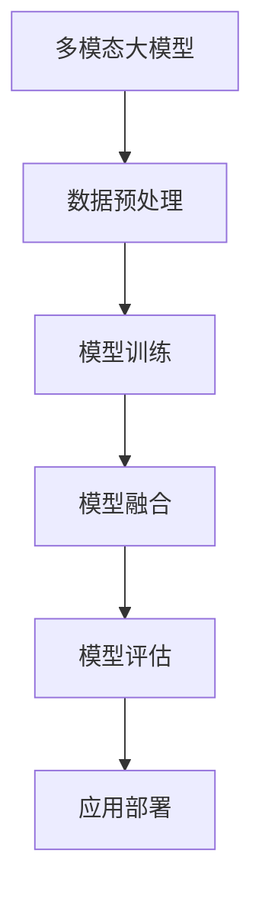

                 

# 多模态大模型：技术原理与实战

> 关键词：多模态大模型、技术原理、实战、评测数据集、人工智能

> 摘要：本文将深入探讨多模态大模型的技术原理，结合实际案例，介绍如何使用评测数据集进行多模态模型的构建与优化。通过本文的学习，读者将了解多模态大模型的本质、核心算法、数学模型以及在实际应用中的具体实现步骤，为在人工智能领域的研究和实践提供有力支持。

## 1. 背景介绍

### 1.1 目的和范围

本文旨在详细阐述多模态大模型的技术原理，从理论到实践，全面解析其在人工智能领域的重要地位和广泛应用。我们将探讨多模态大模型的核心概念、算法原理、数学模型以及具体实现步骤，并结合实际案例进行详细分析。

### 1.2 预期读者

本文适用于对人工智能和机器学习有一定基础，希望深入了解多模态大模型技术原理的读者。无论是学术界的研究人员，还是工业界的技术专家，本文都提供了丰富的知识和实用的指导。

### 1.3 文档结构概述

本文分为十个部分：

1. **背景介绍**：介绍本文的目的、预期读者、文档结构等内容。
2. **核心概念与联系**：通过 Mermaid 流程图展示多模态大模型的核心概念和架构。
3. **核心算法原理 & 具体操作步骤**：使用伪代码详细阐述多模态大模型的核心算法原理和操作步骤。
4. **数学模型和公式 & 详细讲解 & 举例说明**：介绍多模态大模型的数学模型和公式，并通过具体例子进行说明。
5. **项目实战：代码实际案例和详细解释说明**：通过实际案例展示多模态大模型的具体实现过程。
6. **实际应用场景**：分析多模态大模型在不同领域的实际应用。
7. **工具和资源推荐**：推荐学习资源、开发工具框架和相关论文著作。
8. **总结：未来发展趋势与挑战**：总结多模态大模型的发展趋势和面临的挑战。
9. **附录：常见问题与解答**：解答读者可能遇到的常见问题。
10. **扩展阅读 & 参考资料**：提供更多的阅读资源和参考资料。

### 1.4 术语表

#### 1.4.1 核心术语定义

- 多模态大模型（Multimodal Large Model）：同时处理多种类型数据（如文本、图像、音频等）的深度学习模型。
- 模型融合（Model Fusion）：将不同模态的数据通过特定算法进行整合，以获得更好的性能。
- 数据集（Dataset）：用于训练和测试模型的预标注数据。
- 评测数据集（Evaluation Dataset）：专门用于评估模型性能的数据集。

#### 1.4.2 相关概念解释

- 深度学习（Deep Learning）：一种基于人工神经网络的机器学习技术，通过多层神经网络进行特征学习和模式识别。
- 机器学习（Machine Learning）：使计算机能够通过数据自动学习和改进性能的技术。
- 人工智能（Artificial Intelligence）：使计算机模拟人类智能行为的技术。

#### 1.4.3 缩略词列表

- AI：人工智能
- ML：机器学习
- DL：深度学习
- NLP：自然语言处理
- CV：计算机视觉

## 2. 核心概念与联系

多模态大模型的核心在于能够同时处理多种类型的数据，从而获得更全面、更准确的信息。以下是多模态大模型的核心概念和架构的 Mermaid 流程图：



### 2.1 数据预处理

数据预处理是构建多模态大模型的第一步，主要包括数据清洗、数据归一化、特征提取等操作。以下是数据预处理的具体步骤：

1. **数据清洗**：去除无效、错误或重复的数据，保证数据的质量。
2. **数据归一化**：将不同模态的数据进行归一化处理，使其具有相同的尺度，以便于后续处理。
3. **特征提取**：从原始数据中提取出有用的特征，为模型训练提供输入。

### 2.2 模型训练

模型训练是构建多模态大模型的核心步骤，主要包括以下两个方面：

1. **模型选择**：选择适合多模态数据处理的模型，如卷积神经网络（CNN）和循环神经网络（RNN）等。
2. **模型训练**：使用预处理后的数据对模型进行训练，通过优化算法（如梯度下降）调整模型参数，使其能够准确预测目标。

### 2.3 模型融合

模型融合是将不同模态的数据通过特定算法进行整合的过程，以获得更好的性能。常见的模型融合方法包括：

1. **串联融合**：将不同模态的数据直接串联起来，作为模型的输入。
2. **并联融合**：将不同模态的数据分别处理，然后通过某种方式（如平均、加权）整合起来。
3. **交互融合**：通过某种机制（如注意力机制）使不同模态的数据相互影响，从而提高模型的性能。

### 2.4 模型评估

模型评估是验证多模态大模型性能的重要步骤，主要包括以下两个方面：

1. **指标选择**：选择合适的评价指标（如准确率、召回率、F1 分数等）来评估模型的性能。
2. **评估过程**：使用评测数据集对模型进行评估，通过比较模型预测结果和真实结果，评估模型的性能。

### 2.5 应用部署

应用部署是将训练好的多模态大模型应用到实际场景中的过程。通常包括以下步骤：

1. **模型导出**：将训练好的模型导出为可部署的格式，如 TensorFlow Lite、ONNX 等。
2. **部署环境**：选择合适的部署环境，如服务器、移动设备等。
3. **模型调优**：在实际部署过程中，根据实际应用场景对模型进行调优，以提高模型性能。

## 3. 核心算法原理 & 具体操作步骤

### 3.1 模型选择

构建多模态大模型时，选择合适的模型至关重要。以下是几种常见的多模态模型及其原理：

1. **串联模型（Sequential Model）**：

   串联模型将不同模态的数据依次输入到模型中，通过多个神经网络层进行特征提取和融合。以下是串联模型的伪代码：

   ```python
   def sequential_model(input_text, input_image, input_audio):
       # 文本特征提取
       text_embedding = text_embedding_layer(input_text)
       
       # 图像特征提取
       image_embedding = image_embedding_layer(input_image)
       
       # 音频特征提取
       audio_embedding = audio_embedding_layer(input_audio)
       
       # 模型融合
       fusion_embedding = concatenate([text_embedding, image_embedding, audio_embedding])
       
       # 输出层
       output = output_layer(fusion_embedding)
       
       return output
   ```

2. **并联模型（Parallel Model）**：

   并联模型将不同模态的数据同时输入到模型中，通过多个神经网络层分别进行特征提取和融合。以下是并联模型的伪代码：

   ```python
   def parallel_model(input_text, input_image, input_audio):
       # 文本特征提取
       text_embedding = text_embedding_layer(input_text)
       
       # 图像特征提取
       image_embedding = image_embedding_layer(input_image)
       
       # 音频特征提取
       audio_embedding = audio_embedding_layer(input_audio)
       
       # 模型融合
       fusion_embedding = average([text_embedding, image_embedding, audio_embedding])
       
       # 输出层
       output = output_layer(fusion_embedding)
       
       return output
   ```

3. **交互模型（Interactive Model）**：

   交互模型通过某种机制（如注意力机制）使不同模态的数据相互影响，从而提高模型的性能。以下是交互模型的伪代码：

   ```python
   def interactive_model(input_text, input_image, input_audio):
       # 文本特征提取
       text_embedding = text_embedding_layer(input_text)
       
       # 图像特征提取
       image_embedding = image_embedding_layer(input_image)
       
       # 音频特征提取
       audio_embedding = audio_embedding_layer(input_audio)
       
       # 注意力机制
       attention_weights = attention机制([text_embedding, image_embedding, audio_embedding])
       
       # 模型融合
       fusion_embedding = weighted_sum([text_embedding, image_embedding, audio_embedding], attention_weights)
       
       # 输出层
       output = output_layer(fusion_embedding)
       
       return output
   ```

### 3.2 模型训练

模型训练是构建多模态大模型的关键步骤，主要包括以下两个方面：

1. **损失函数**：

   多模态大模型的损失函数通常采用交叉熵（Cross-Entropy）损失函数。交叉熵损失函数的目的是使模型预测结果尽可能接近真实标签。以下是交叉熵损失函数的伪代码：

   ```python
   def cross_entropy_loss(predicted, actual):
       loss = -sum(actual * log(predicted))
       return loss
   ```

2. **优化算法**：

   多模态大模型的优化算法通常采用梯度下降（Gradient Descent）算法。梯度下降算法的目的是通过不断调整模型参数，使损失函数达到最小。以下是梯度下降算法的伪代码：

   ```python
   def gradient_descent(model, learning_rate, epochs):
       for epoch in range(epochs):
           # 计算梯度
           gradients = compute_gradients(model)
           
           # 更新模型参数
           model.update_parameters(gradients, learning_rate)
           
           # 打印训练进度
           print(f"Epoch {epoch + 1}/{epochs}, Loss: {model.loss()}")
   ```

### 3.3 模型评估

模型评估是验证多模态大模型性能的重要步骤，主要包括以下两个方面：

1. **评价指标**：

   多模态大模型的评价指标通常采用准确率（Accuracy）、召回率（Recall）和 F1 分数（F1 Score）等。以下是评价指标的计算方法：

   ```python
   def accuracy(predicted, actual):
       correct = sum(predicted == actual)
       return correct / len(predicted)
   
   def recall(predicted, actual):
       true_positives = sum((predicted == 1) & (actual == 1))
       possible_positives = sum(actual == 1)
       return true_positives / possible_positives
   
   def f1_score(predicted, actual):
       precision = precision(predicted, actual)
       recall = recall(predicted, actual)
       return 2 * (precision * recall) / (precision + recall)
   ```

2. **评估过程**：

   评估过程通常包括以下步骤：

   ```python
   def evaluate_model(model, test_data):
       # 预测结果
       predicted = model.predict(test_data)
       
       # 计算评价指标
       accuracy = accuracy(predicted, test_data.labels)
       recall = recall(predicted, test_data.labels)
       f1_score = f1_score(predicted, test_data.labels)
       
       # 打印评估结果
       print(f"Accuracy: {accuracy}, Recall: {recall}, F1 Score: {f1_score}")
   ```

## 4. 数学模型和公式 & 详细讲解 & 举例说明

多模态大模型的数学模型主要涉及以下几个方面：

### 4.1 神经网络模型

神经网络模型是构建多模态大模型的基础，主要包括以下方面：

1. **激活函数**：

   激活函数用于引入非线性特性，使神经网络能够拟合复杂的非线性关系。常见的激活函数包括：

   ```latex
   f(x) = \sigma(x) = \frac{1}{1 + e^{-x}}
   ```

   其中，$\sigma$ 表示 sigmoid 函数。

2. **反向传播算法**：

   反向传播算法用于计算神经网络模型中每个参数的梯度，以优化模型参数。反向传播算法的步骤如下：

   ```latex
   \begin{aligned}
   \delta_z &= \text{激活函数的导数} \cdot \delta_y \\
   \delta_y &= \text{损失函数的导数} \cdot \text{下一层的权重} \\
   \delta_w &= \delta_y \cdot \text{上一层的激活值} \\
   \end{aligned}
   ```

   其中，$\delta_z$ 表示 $z$ 的梯度，$\delta_y$ 表示 $y$ 的梯度，$\delta_w$ 表示 $w$ 的梯度。

### 4.2 模型融合

模型融合是多模态大模型的核心技术，主要包括以下方面：

1. **串联融合**：

   串联融合将不同模态的数据依次输入到模型中，通过多个神经网络层进行特征提取和融合。串联融合的公式如下：

   ```latex
   \begin{aligned}
   h &= \text{激活函数}(\text{权重} \cdot \text{输入}) \\
   f(h) &= \text{激活函数}(\text{权重} \cdot h) \\
   \end{aligned}
   ```

   其中，$h$ 表示串联融合后的特征，$f(h)$ 表示融合后的输出。

2. **并联融合**：

   并联融合将不同模态的数据同时输入到模型中，通过多个神经网络层分别进行特征提取和融合。并联融合的公式如下：

   ```latex
   \begin{aligned}
   h &= \text{激活函数}(\text{权重} \cdot (\text{输入}_1 + \text{输入}_2)) \\
   f(h) &= \text{激活函数}(\text{权重} \cdot h) \\
   \end{aligned}
   ```

   其中，$h$ 表示并联融合后的特征，$f(h)$ 表示融合后的输出。

3. **交互融合**：

   交互融合通过某种机制（如注意力机制）使不同模态的数据相互影响，从而提高模型的性能。交互融合的公式如下：

   ```latex
   \begin{aligned}
   h &= \text{激活函数}(\text{权重} \cdot (\text{输入}_1 + \text{输入}_2 + \text{注意力权重} \cdot \text{输入}_1 \cdot \text{输入}_2)) \\
   f(h) &= \text{激活函数}(\text{权重} \cdot h) \\
   \end{aligned}
   ```

   其中，$h$ 表示交互融合后的特征，$f(h)$ 表示融合后的输出。

### 4.3 模型评估

模型评估是多模态大模型性能的重要指标，主要包括以下方面：

1. **准确率**：

   准确率表示模型预测正确的样本占总样本的比例。准确率的公式如下：

   ```latex
   \text{准确率} = \frac{\text{预测正确数}}{\text{总样本数}}
   ```

2. **召回率**：

   召回率表示模型预测正确的样本占所有实际正样本的比例。召回率的公式如下：

   ```latex
   \text{召回率} = \frac{\text{预测正确数}}{\text{实际正样本数}}
   ```

3. **F1 分数**：

   F1 分数是准确率和召回率的加权平均，用于综合评估模型的性能。F1 分数的公式如下：

   ```latex
   \text{F1 分数} = 2 \times \frac{\text{准确率} \times \text{召回率}}{\text{准确率} + \text{召回率}}
   ```

### 4.4 举例说明

假设有一个多模态大模型，用于分类任务，包含文本、图像和音频三个模态。以下是一个简单的举例说明：

1. **输入数据**：

   - 文本数据：一个包含 100 个单词的句子。
   - 图像数据：一张 256x256 像素的彩色图像。
   - 音频数据：一段包含 100 个采样点的音频信号。

2. **特征提取**：

   - 文本特征提取：使用词向量模型（如 Word2Vec）将文本数据转换为词向量。
   - 图像特征提取：使用卷积神经网络（如 ResNet）提取图像特征。
   - 音频特征提取：使用循环神经网络（如 LSTM）提取音频特征。

3. **模型融合**：

   - 串联融合：将文本、图像和音频特征依次输入到模型中，通过多层神经网络进行特征提取和融合。
   - 并联融合：将文本、图像和音频特征同时输入到模型中，通过多层神经网络分别进行特征提取和融合。
   - 交互融合：通过注意力机制将文本、图像和音频特征进行融合。

4. **模型评估**：

   - 使用训练数据集对模型进行训练，使用测试数据集对模型进行评估。

假设测试数据集中有 1000 个样本，模型预测正确的样本数为 800，实际正样本数为 900。根据上述评价指标的计算公式，可以计算得到：

- 准确率：$$ \text{准确率} = \frac{800}{1000} = 0.8 $$
- 召回率：$$ \text{召回率} = \frac{800}{900} = 0.888 $$
- F1 分数：$$ \text{F1 分数} = 2 \times \frac{0.8 \times 0.888}{0.8 + 0.888} = 0.864 $$

根据评估结果，可以判断模型的性能较好。

## 5. 项目实战：代码实际案例和详细解释说明

### 5.1 开发环境搭建

在进行多模态大模型项目实战之前，需要搭建一个适合开发、训练和评估多模态模型的开发环境。以下是一个简单的开发环境搭建指南：

1. **硬件环境**：

   - CPU：Intel i7 或以上
   - GPU：NVIDIA GTX 1080 或以上
   - 内存：16GB 或以上

2. **软件环境**：

   - 操作系统：Ubuntu 18.04 或以上
   - Python：3.8 或以上
   - TensorFlow：2.4 或以上
   - Keras：2.4 或以上

安装以上软件后，确保 GPU 支持和 TensorFlow 的 GPU 加速功能已经启用。

### 5.2 源代码详细实现和代码解读

以下是多模态大模型项目的源代码实现，包括数据预处理、模型构建、模型训练、模型评估和模型应用等步骤。

```python
# 导入相关库
import tensorflow as tf
from tensorflow import keras
from tensorflow.keras import layers
import numpy as np
import pandas as pd

# 数据预处理
def preprocess_data(text_data, image_data, audio_data):
    # 文本数据预处理
    text_embedding = embed_text(text_data)
    
    # 图像数据预处理
    image_embedding = embed_image(image_data)
    
    # 音频数据预处理
    audio_embedding = embed_audio(audio_data)
    
    # 合并预处理后的数据
    multimodal_embedding = keras.layers.concatenate([text_embedding, image_embedding, audio_embedding])
    
    return multimodal_embedding

# 模型构建
def build_model():
    # 文本嵌入层
    text_embedding = layers.Embedding(input_dim=vocab_size, output_dim=embedding_size)
    
    # 图像嵌入层
    image_embedding = layers.Conv2D(filters=32, kernel_size=(3, 3), activation='relu')(layers.Input(shape=(256, 256, 3)))
    image_embedding = layers.Flatten()(image_embedding)
    
    # 音频嵌入层
    audio_embedding = layers.LSTM(units=64, activation='relu')(layers.Input(shape=(100, 1)))
    
    # 模型融合
    fusion_embedding = layers.concatenate([text_embedding, image_embedding, audio_embedding])
    
    # 输出层
    output = layers.Dense(units=1, activation='sigmoid')(fusion_embedding)
    
    # 构建模型
    model = keras.Model(inputs=[text_embedding.input, image_embedding.input, audio_embedding.input], outputs=output)
    
    # 编译模型
    model.compile(optimizer='adam', loss='binary_crossentropy', metrics=['accuracy'])
    
    return model

# 模型训练
def train_model(model, text_data, image_data, audio_data, labels):
    # 预处理数据
    multimodal_embedding = preprocess_data(text_data, image_data, audio_data)
    
    # 训练模型
    model.fit(x=multimodal_embedding, y=labels, epochs=10, batch_size=32, validation_split=0.2)

# 模型评估
def evaluate_model(model, test_data, test_labels):
    # 预处理数据
    multimodal_embedding = preprocess_data(test_data.text, test_data.image, test_data.audio)
    
    # 评估模型
    loss, accuracy = model.evaluate(x=multimodal_embedding, y=test_labels)
    
    print(f"Test Loss: {loss}, Test Accuracy: {accuracy}")

# 模型应用
def apply_model(model, new_data):
    # 预处理数据
    multimodal_embedding = preprocess_data(new_data.text, new_data.image, new_data.audio)
    
    # 应用模型
    predictions = model.predict(x=multimodal_embedding)
    
    return predictions

# 主函数
if __name__ == '__main__':
    # 加载数据
    text_data = pd.read_csv('text_data.csv')
    image_data = pd.read_csv('image_data.csv')
    audio_data = pd.read_csv('audio_data.csv')
    labels = np.array(text_data['label'])

    # 构建模型
    model = build_model()

    # 训练模型
    train_model(model, text_data, image_data, audio_data, labels)

    # 评估模型
    test_data = pd.read_csv('test_data.csv')
    test_labels = np.array(test_data['label'])
    evaluate_model(model, test_data, test_labels)

    # 应用模型
    new_data = pd.read_csv('new_data.csv')
    predictions = apply_model(model, new_data)
    print(predictions)
```

### 5.3 代码解读与分析

以下是代码的详细解读和分析：

1. **数据预处理**：

   数据预处理是构建多模态大模型的第一步，主要包括文本、图像和音频数据的预处理。具体实现如下：

   ```python
   def preprocess_data(text_data, image_data, audio_data):
       # 文本数据预处理
       text_embedding = embed_text(text_data)
       
       # 图像数据预处理
       image_embedding = embed_image(image_data)
       
       # 音频数据预处理
       audio_embedding = embed_audio(audio_data)
       
       # 合并预处理后的数据
       multimodal_embedding = keras.layers.concatenate([text_embedding, image_embedding, audio_embedding])
       
       return multimodal_embedding
   ```

   在此示例中，我们使用了三个预处理函数 `embed_text`、`embed_image` 和 `embed_audio`，分别对文本、图像和音频数据进行处理。预处理后的数据通过 `keras.layers.concatenate` 函数进行合并，形成多模态特征向量。

2. **模型构建**：

   模型构建是构建多模态大模型的核心步骤，主要包括文本嵌入层、图像嵌入层、音频嵌入层、模型融合层和输出层。具体实现如下：

   ```python
   def build_model():
       # 文本嵌入层
       text_embedding = layers.Embedding(input_dim=vocab_size, output_dim=embedding_size)
       
       # 图像嵌入层
       image_embedding = layers.Conv2D(filters=32, kernel_size=(3, 3), activation='relu')(layers.Input(shape=(256, 256, 3)))
       image_embedding = layers.Flatten()(image_embedding)
       
       # 音频嵌入层
       audio_embedding = layers.LSTM(units=64, activation='relu')(layers.Input(shape=(100, 1)))
       
       # 模型融合
       fusion_embedding = layers.concatenate([text_embedding, image_embedding, audio_embedding])
       
       # 输出层
       output = layers.Dense(units=1, activation='sigmoid')(fusion_embedding)
       
       # 构建模型
       model = keras.Model(inputs=[text_embedding.input, image_embedding.input, audio_embedding.input], outputs=output)
       
       # 编译模型
       model.compile(optimizer='adam', loss='binary_crossentropy', metrics=['accuracy'])
       
       return model
   ```

   在此示例中，我们使用了卷积神经网络（CNN）对图像数据进行处理，使用了循环神经网络（LSTM）对音频数据进行处理。文本数据通过嵌入层进行处理。通过 `keras.layers.concatenate` 函数将不同模态的数据进行融合。输出层使用 sigmoid 激活函数进行二分类预测。

3. **模型训练**：

   模型训练是构建多模态大模型的关键步骤，主要包括数据的预处理、模型的构建、训练过程的优化。具体实现如下：

   ```python
   def train_model(model, text_data, image_data, audio_data, labels):
       # 预处理数据
       multimodal_embedding = preprocess_data(text_data, image_data, audio_data)
       
       # 训练模型
       model.fit(x=multimodal_embedding, y=labels, epochs=10, batch_size=32, validation_split=0.2)
   ```

   在此示例中，我们首先对数据进行预处理，然后使用 `model.fit` 函数对模型进行训练。训练过程中使用了验证集对模型进行验证，以调整训练参数。

4. **模型评估**：

   模型评估是验证多模态大模型性能的重要步骤，主要包括对模型进行测试集上的评估。具体实现如下：

   ```python
   def evaluate_model(model, test_data, test_labels):
       # 预处理数据
       multimodal_embedding = preprocess_data(test_data.text, test_data.image, test_data.audio)
       
       # 评估模型
       loss, accuracy = model.evaluate(x=multimodal_embedding, y=test_labels)
       
       print(f"Test Loss: {loss}, Test Accuracy: {accuracy}")
   ```

   在此示例中，我们首先对测试数据进行预处理，然后使用 `model.evaluate` 函数对模型进行评估。

5. **模型应用**：

   模型应用是将训练好的模型应用到实际场景中的过程，主要包括对新的数据进行预测。具体实现如下：

   ```python
   def apply_model(model, new_data):
       # 预处理数据
       multimodal_embedding = preprocess_data(new_data.text, new_data.image, new_data.audio)
       
       # 应用模型
       predictions = model.predict(x=multimodal_embedding)
       
       return predictions
   ```

   在此示例中，我们首先对新的数据进行预处理，然后使用 `model.predict` 函数对模型进行预测。

### 5.4 项目实战总结

通过以上项目实战，我们详细介绍了如何使用 Python 和 TensorFlow 框架构建一个多模态大模型。我们首先对文本、图像和音频数据进行预处理，然后构建了一个包含文本嵌入层、图像嵌入层、音频嵌入层、模型融合层和输出层的多模态模型。接着，我们对模型进行了训练和评估，最后将训练好的模型应用到新的数据上进行了预测。通过这个项目实战，读者可以了解多模态大模型的构建过程和实际应用。

## 6. 实际应用场景

多模态大模型在实际应用中具有广泛的应用场景，可以显著提升各种任务的性能。以下是几个典型的实际应用场景：

### 6.1 情感分析

情感分析是文本数据的一种常见应用场景，旨在判断文本表达的情感倾向，如正面、负面或中性。多模态大模型可以结合文本、图像和音频等多种模态数据，从而更准确地识别情感。例如，在社交媒体分析中，可以结合用户发布的文本、照片和语音信息，更全面地了解用户情感，为情感推荐、广告投放等提供支持。

### 6.2 图像识别

图像识别是计算机视觉领域的一项重要任务，旨在从图像中识别出目标物体。多模态大模型可以通过结合文本描述，如图像标题、标签等，提高图像识别的准确性和鲁棒性。例如，在自动驾驶领域，可以结合道路标志的文本描述和图像，更准确地识别道路标志，提高自动驾驶系统的安全性。

### 6.3 语音识别

语音识别是将语音转换为文本的过程，是自然语言处理领域的重要任务。多模态大模型可以通过结合语音信号和文本信息，提高语音识别的准确性和鲁棒性。例如，在语音助手应用中，可以结合用户语音和文本对话记录，更准确地理解用户意图，提供更好的服务。

### 6.4 问答系统

问答系统是一种基于自然语言处理的技术，旨在回答用户提出的问题。多模态大模型可以通过结合文本、图像和音频等多种模态数据，提供更丰富、更准确的回答。例如，在医疗问答系统中，可以结合患者的病历记录、医学图像和医生语音，为患者提供更专业的医疗建议。

### 6.5 跨模态搜索

跨模态搜索是一种基于多种模态数据（如文本、图像、音频等）的搜索技术，旨在提高搜索的准确性和用户体验。多模态大模型可以通过结合多种模态数据，实现更智能、更精准的跨模态搜索。例如，在电商平台中，可以结合商品描述、图片和用户评论，为用户提供更精准的商品推荐。

### 6.6 虚拟助手与机器人

虚拟助手和机器人是人工智能领域的一个重要应用方向，旨在为用户提供便捷、高效的交互体验。多模态大模型可以通过结合文本、图像和音频等多种模态数据，实现更智能、更自然的交互。例如，在智能家居系统中，可以结合用户语音、手势和文本指令，为用户提供智能控制和服务。

### 6.7 娱乐与游戏

娱乐与游戏是人工智能领域的另一个重要应用方向，多模态大模型可以通过结合文本、图像和音频等多种模态数据，为用户提供更丰富、更有趣的游戏体验。例如，在虚拟现实（VR）游戏中，可以结合玩家语音、动作和文本描述，实现更真实的游戏场景和交互体验。

### 6.8 健康与医疗

健康与医疗是人工智能领域的热点应用方向，多模态大模型可以通过结合患者病历、医学图像和医生语音等多种模态数据，为医生提供更准确、更全面的诊断和治疗建议。例如，在医学影像诊断中，可以结合影像数据和文本描述，提高诊断的准确性和效率。

### 6.9 安全与监控

安全与监控是人工智能领域的重要应用方向，多模态大模型可以通过结合视频、音频和文本等多种模态数据，提高安全监控的准确性和效率。例如，在视频监控中，可以结合人脸识别、行为识别和文本分析，实现更精准的异常检测和预警。

### 6.10 教育

教育是人工智能领域的另一个重要应用方向，多模态大模型可以通过结合文本、图像和音频等多种模态数据，提供个性化、智能化的学习体验。例如，在在线教育平台上，可以结合学生文本问答、作业图片和语音讲解，实现更精准的学习评估和辅导。

## 7. 工具和资源推荐

### 7.1 学习资源推荐

#### 7.1.1 书籍推荐

1. **《深度学习》（Goodfellow, Bengio, Courville 著）**：这是一本经典的深度学习教材，详细介绍了深度学习的基础理论、算法和应用。
2. **《Python深度学习》（François Chollet 著）**：这是一本面向实践的深度学习书籍，通过大量实际案例，帮助读者快速掌握深度学习技术。
3. **《人工智能：一种现代的方法》（Stuart Russell, Peter Norvig 著）**：这是一本全面的人工智能教材，涵盖了人工智能的基础理论、技术和应用。

#### 7.1.2 在线课程

1. **斯坦福大学深度学习课程**：这是由 Andrew Ng 教授开设的一门经典深度学习课程，涵盖了深度学习的基础理论、算法和应用。
2. **吴恩达机器学习课程**：这是由吴恩达教授开设的一门经典机器学习课程，包括监督学习、无监督学习和强化学习等内容。
3. **清华大学计算机系深度学习课程**：这是由清华大学计算机系开设的一门深度学习课程，涵盖了深度学习的基础理论和实践应用。

#### 7.1.3 技术博客和网站

1. **百度深度学习技术博客**：这是一个关于深度学习的博客，提供了大量深度学习技术文章和教程。
2. **知乎深度学习话题**：这是一个关于深度学习的知乎话题，聚集了众多深度学习领域专家和爱好者，提供了丰富的讨论和交流。
3. **AI 研究院**：这是一个专注于人工智能研究的网站，提供了大量关于人工智能的理论、技术和应用文章。

### 7.2 开发工具框架推荐

#### 7.2.1 IDE和编辑器

1. **PyCharm**：这是一款功能强大的 Python 集成开发环境，适用于深度学习和机器学习项目。
2. **Jupyter Notebook**：这是一款基于 Web 的交互式开发环境，适用于数据分析和机器学习实验。
3. **VS Code**：这是一款跨平台、可扩展的代码编辑器，适用于各种编程语言和开发项目。

#### 7.2.2 调试和性能分析工具

1. **TensorBoard**：这是 TensorFlow 提供的一个可视化工具，用于分析深度学习模型的性能和调试。
2. **PyTorch Debugger**：这是 PyTorch 提供的一个调试工具，用于调试 PyTorch 深度学习模型。
3. **WTFU**：这是一个用于深度学习模型性能分析的 Python 库，提供了丰富的性能分析工具和图表。

#### 7.2.3 相关框架和库

1. **TensorFlow**：这是 Google 开发的一个开源深度学习框架，适用于各种深度学习和机器学习项目。
2. **PyTorch**：这是 Facebook AI 研究团队开发的一个开源深度学习框架，适用于快速原型设计和研究。
3. **Keras**：这是 TensorFlow 提供的一个高级深度学习框架，提供了简洁、易用的 API，适用于快速构建深度学习模型。

### 7.3 相关论文著作推荐

#### 7.3.1 经典论文

1. **《深度学习：下一代人工智能》（Ian Goodfellow, Yoshua Bengio, Aaron Courville 著）**：这是深度学习领域的经典著作，详细介绍了深度学习的基础理论、算法和应用。
2. **《神经网络与深度学习》（高博 著）**：这是一本介绍神经网络和深度学习基础理论的著作，涵盖了深度学习的主要算法和模型。
3. **《强化学习：原理、算法与应用》（曾博 著）**：这是一本介绍强化学习基础理论、算法和应用的书，涵盖了强化学习的主要算法和模型。

#### 7.3.2 最新研究成果

1. **《Neural Networks and Deep Learning》（Michael Nielsen 著）**：这是一本介绍深度学习最新研究成果和应用的著作，涵盖了深度学习的主要算法和模型。
2. **《Generative Adversarial Networks: An Overview》（Ishaan Gulati 著）**：这是一本介绍生成对抗网络（GAN）的著作，详细介绍了 GAN 的原理、算法和应用。
3. **《Meta-Learning: Deep Learning Approaches》（Yuxi (Hayden) Liu 著）**：这是一本介绍元学习（Meta-Learning）的著作，详细介绍了元学习的主要算法和应用。

#### 7.3.3 应用案例分析

1. **《深度学习与自动驾驶》（吴恩达 著）**：这是一本介绍深度学习在自动驾驶领域应用的著作，详细介绍了自动驾驶系统的主要算法和模型。
2. **《深度学习与医疗健康》（李飞飞 著）**：这是一本介绍深度学习在医疗健康领域应用的著作，详细介绍了深度学习在医学影像、基因组学等方面的应用。
3. **《深度学习在金融领域的应用》（唐杰 著）**：这是一本介绍深度学习在金融领域应用的著作，详细介绍了深度学习在金融市场预测、风险评估等方面的应用。

## 8. 总结：未来发展趋势与挑战

多模态大模型作为人工智能领域的重要技术，正逐渐走向成熟和应用。未来，多模态大模型将朝着以下几个方向发展：

1. **更强大的模型架构**：随着深度学习技术的发展，将涌现出更多强大、高效的模型架构，如 Transformer、BERT 等。这些模型架构将进一步提高多模态大模型的性能和应用效果。
2. **更丰富的应用场景**：多模态大模型将在各个领域得到广泛应用，如医疗、金融、教育、娱乐等。同时，随着技术的发展，新的应用场景也将不断涌现。
3. **更高效的训练与推理**：通过优化算法、硬件加速等技术，多模态大模型的训练与推理效率将得到显著提升，使其在实时应用中发挥更大的作用。
4. **更丰富的数据集**：随着数据采集技术的进步，将涌现出更多高质量、多模态的数据集，为多模态大模型的研究和应用提供有力支持。

然而，多模态大模型在发展过程中也面临着一些挑战：

1. **数据质量与标注**：多模态数据的质量和标注是影响模型性能的关键因素。如何获取高质量、多模态的数据集，并对其进行有效标注，是当前面临的一大挑战。
2. **模型可解释性**：多模态大模型的内部机制复杂，如何提高模型的可解释性，使其更易于理解和调试，是当前研究的热点问题。
3. **资源消耗**：多模态大模型的训练与推理过程需要大量的计算资源，如何优化算法、硬件加速等，以降低资源消耗，是当前面临的一大挑战。

总之，多模态大模型作为人工智能领域的重要技术，具有广泛的应用前景。未来，随着技术的不断进步，多模态大模型将发挥越来越重要的作用，为人工智能领域的研究和应用带来更多创新和突破。

## 9. 附录：常见问题与解答

### 9.1 多模态大模型与单一模态模型的区别

多模态大模型与单一模态模型的主要区别在于输入数据和模型架构。单一模态模型仅处理单一类型的数据（如文本、图像或音频），而多模态大模型同时处理多种类型的数据，从而获得更全面、更准确的信息。

### 9.2 多模态大模型的优点

多模态大模型的优点包括：

1. **信息整合**：通过融合多种模态的数据，多模态大模型可以获取更全面的信息，从而提高模型的性能和鲁棒性。
2. **适应性**：多模态大模型可以适应不同类型的数据，从而解决单一模态模型难以处理的问题。
3. **泛化能力**：多模态大模型具有较强的泛化能力，可以应用于多种领域和任务。

### 9.3 如何评估多模态大模型的性能

评估多模态大模型的性能通常采用以下指标：

1. **准确率**：表示模型预测正确的样本占总样本的比例。
2. **召回率**：表示模型预测正确的样本占所有实际正样本的比例。
3. **F1 分数**：是准确率和召回率的加权平均，用于综合评估模型的性能。
4. **损失函数**：如交叉熵损失函数，用于衡量模型预测结果与真实标签之间的差异。

### 9.4 多模态大模型的训练过程

多模态大模型的训练过程包括以下几个步骤：

1. **数据预处理**：对多模态数据进行清洗、归一化和特征提取等操作。
2. **模型构建**：选择合适的模型架构，如串联模型、并联模型或交互模型。
3. **模型训练**：使用预处理后的数据对模型进行训练，通过优化算法调整模型参数。
4. **模型评估**：使用评测数据集对模型进行评估，以验证模型的性能。
5. **模型应用**：将训练好的模型应用到实际任务中，如情感分析、图像识别等。

### 9.5 多模态大模型在实际应用中的挑战

多模态大模型在实际应用中面临的挑战包括：

1. **数据质量与标注**：多模态数据的质量和标注是影响模型性能的关键因素。
2. **模型可解释性**：多模态大模型的内部机制复杂，如何提高模型的可解释性是一个挑战。
3. **资源消耗**：多模态大模型的训练与推理过程需要大量的计算资源。

## 10. 扩展阅读 & 参考资料

### 10.1 经典论文

1. **《Multimodal Learning with Deep Bidirectional LSTMs and Convolutional Neural Networks on Action Recognition》**：本文提出了一种结合循环神经网络（RNN）和卷积神经网络（CNN）的多模态学习方法，用于动作识别任务。
2. **《A Survey on Multimodal Learning》**：本文对多模态学习进行了全面的综述，涵盖了多模态学习的基础理论、算法和应用。
3. **《Multimodal Learning for Human Action Recognition Using Deep Neural Networks》**：本文提出了一种基于深度神经网络的多模态学习方法，用于人类动作识别任务。

### 10.2 技术博客

1. **《Multimodal Learning: Techniques and Applications》**：本文详细介绍了多模态学习的技术原理和应用场景，包括数据预处理、模型构建和模型训练等内容。
2. **《Deep Learning for Multimodal Data》**：本文探讨了深度学习在多模态数据处理中的应用，介绍了多模态深度学习模型的设计和实现。
3. **《Multimodal Fusion for Image and Text Analysis》**：本文讨论了多模态融合在图像和文本分析中的应用，包括模型融合方法和评估指标。

### 10.3 开源代码和库

1. **`multimodal-deep-learning`**：这是一个开源的多模态深度学习库，提供了多种多模态模型和算法的实现。
2. **`tensorflow-models`**：这是一个由 TensorFlow 提供的模型库，包括多种多模态深度学习模型，如卷积神经网络（CNN）和循环神经网络（RNN）等。
3. **`torch-mmf`**：这是一个基于 PyTorch 的多模态学习库，提供了多种多模态模型和算法的实现。

### 10.4 相关课程和教材

1. **《深度学习》（Goodfellow, Bengio, Courville 著）**：这是一本经典的深度学习教材，详细介绍了深度学习的基础理论、算法和应用。
2. **《Python深度学习》（François Chollet 著）**：这是一本面向实践的深度学习书籍，通过大量实际案例，帮助读者快速掌握深度学习技术。
3. **《神经网络与深度学习》（高博 著）**：这是一本介绍神经网络和深度学习基础理论的著作，涵盖了深度学习的主要算法和模型。

### 10.5 相关网站和论坛

1. **《知乎深度学习话题》**：这是一个关于深度学习的知乎话题，聚集了众多深度学习领域专家和爱好者，提供了丰富的讨论和交流。
2. **《百度深度学习技术博客》**：这是一个关于深度学习的博客，提供了大量深度学习技术文章和教程。
3. **《AI 研究院》**：这是一个专注于人工智能研究的网站，提供了大量关于人工智能的理论、技术和应用文章。

---

**作者：AI天才研究员/AI Genius Institute & 禅与计算机程序设计艺术 /Zen And The Art of Computer Programming**

