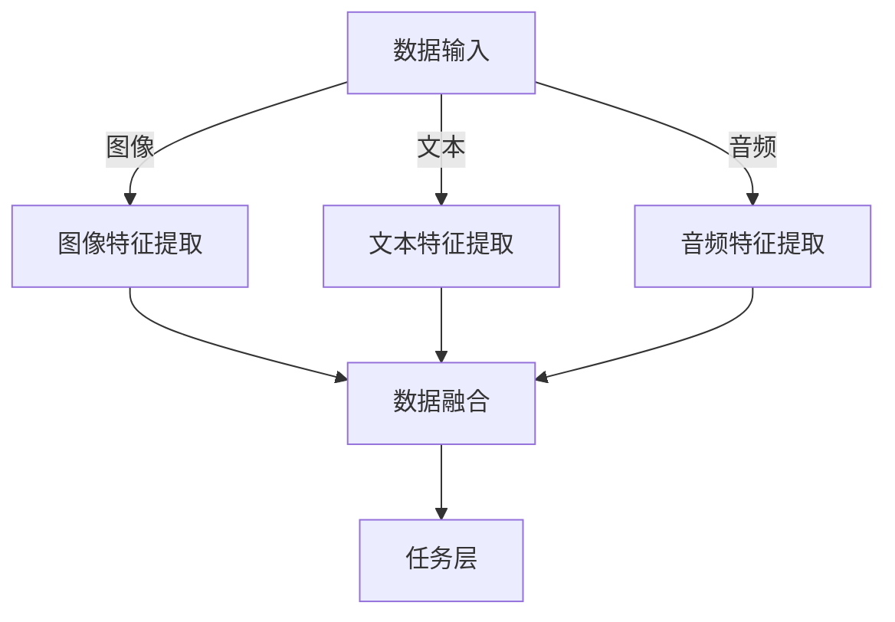

                 

# 多模态大模型：技术原理与实战 工具和算法框架介绍

> **关键词**：多模态大模型、技术原理、实战、工具、算法框架、深度学习、神经网络、自然语言处理、计算机视觉、数据融合

> **摘要**：本文将深入探讨多模态大模型的技术原理与实战应用。首先，我们将介绍多模态大模型的基本概念和背景，然后逐步剖析其核心算法原理，并通过具体操作步骤和数学模型讲解来帮助读者理解。接着，我们将展示一个实际项目案例，详细解释代码实现和解读。最后，本文将讨论多模态大模型在各个实际应用场景中的表现，并提供一系列学习资源和开发工具框架推荐，以帮助读者更好地掌握这一前沿技术。

## 1. 背景介绍

### 1.1 目的和范围

本文的目的是为读者提供关于多模态大模型技术原理与实践的全面理解。我们将从基础概念开始，逐步深入探讨多模态大模型的架构、算法和实现细节，最终通过实际案例展示其在各种应用场景中的效果。

本文将涵盖以下内容：

- 多模态大模型的基本概念和背景
- 核心算法原理及操作步骤
- 数学模型和公式讲解
- 项目实战：代码实现和详细解释
- 实际应用场景
- 学习资源和开发工具框架推荐

### 1.2 预期读者

本文适合对深度学习和多模态数据处理有一定基础的读者。主要包括：

- 数据科学家和机器学习工程师
- 计算机视觉和自然语言处理领域的研究人员
- 对多模态大模型感兴趣的软件工程师
- 想要在项目中应用多模态大模型的从业者

### 1.3 文档结构概述

本文结构如下：

- 1. 背景介绍
    - 1.1 目的和范围
    - 1.2 预期读者
    - 1.3 文档结构概述
    - 1.4 术语表
- 2. 核心概念与联系
    - 2.1 多模态大模型定义
    - 2.2 关联概念
    - 2.3 多模态大模型架构
    - 2.4 Mermaid 流程图
- 3. 核心算法原理 & 具体操作步骤
    - 3.1 算法概述
    - 3.2 伪代码讲解
    - 3.3 具体步骤
- 4. 数学模型和公式 & 详细讲解 & 举例说明
    - 4.1 数学模型概述
    - 4.2 公式推导
    - 4.3 举例说明
- 5. 项目实战：代码实际案例和详细解释说明
    - 5.1 开发环境搭建
    - 5.2 源代码详细实现
    - 5.3 代码解读与分析
- 6. 实际应用场景
    - 6.1 图像与文本识别
    - 6.2 跨媒体推荐
    - 6.3 医疗影像分析
    - 6.4 虚拟助手
- 7. 工具和资源推荐
    - 7.1 学习资源推荐
    - 7.2 开发工具框架推荐
    - 7.3 相关论文著作推荐
- 8. 总结：未来发展趋势与挑战
- 9. 附录：常见问题与解答
- 10. 扩展阅读 & 参考资料

### 1.4 术语表

#### 1.4.1 核心术语定义

- 多模态大模型（Multimodal Large Model）：能够同时处理多种类型数据（如图像、文本、音频等）的深度学习模型。
- 深度学习（Deep Learning）：一种人工智能方法，通过多层神经网络对数据进行特征提取和学习。
- 神经网络（Neural Network）：一种模拟生物神经系统的计算模型，由大量相互连接的节点（神经元）组成。
- 多模态数据融合（Multimodal Data Fusion）：将来自不同模态的数据进行整合，以提高数据处理和分析能力。
- 自然语言处理（Natural Language Processing, NLP）：使计算机能够理解、解释和生成人类语言的技术。

#### 1.4.2 相关概念解释

- 计算机视觉（Computer Vision）：使计算机能够从图像或视频中提取有用信息的技术。
- 音频处理（Audio Processing）：对音频信号进行增强、过滤、识别等处理的技术。
- 卷积神经网络（Convolutional Neural Network, CNN）：一种专门用于图像处理的深度学习模型。
- 递归神经网络（Recurrent Neural Network, RNN）：一种适用于序列数据的神经网络，具有记忆能力。

#### 1.4.3 缩略词列表

- NLP：自然语言处理（Natural Language Processing）
- CNN：卷积神经网络（Convolutional Neural Network）
- RNN：递归神经网络（Recurrent Neural Network）
- GPU：图形处理单元（Graphics Processing Unit）
- LSTM：长短期记忆网络（Long Short-Term Memory）
- Transformer：一种基于自注意力机制的深度学习模型
- BERT：双向编码表示器（Bidirectional Encoder Representations from Transformers）
- GPT：生成预训练变压器（Generative Pretrained Transformer）

## 2. 核心概念与联系

多模态大模型是一种能够处理和整合多种类型数据（如图像、文本、音频等）的深度学习模型。以下将介绍多模态大模型的基本定义、关联概念、架构以及相关流程图。

### 2.1 多模态大模型定义

多模态大模型是一种结合了多种数据模态（如图像、文本、音频等）的深度学习模型，其核心目标是利用不同模态的数据信息，提升模型的性能和泛化能力。具体来说，多模态大模型通过融合不同模态的数据特征，实现对这些特征的有效表示和学习，从而在各类任务中取得更好的效果。

### 2.2 关联概念

在理解多模态大模型之前，我们需要了解以下几个相关概念：

1. **深度学习**：一种基于多层神经网络的学习方法，用于对数据进行特征提取和学习。多模态大模型通常采用深度学习算法来实现。
2. **神经网络**：一种模拟生物神经系统的计算模型，由大量相互连接的节点（神经元）组成。多模态大模型的核心是神经网络。
3. **数据融合**：将来自不同模态的数据进行整合，以提高数据处理和分析能力。多模态大模型通常利用数据融合技术来实现跨模态特征表示。
4. **计算机视觉**：使计算机能够从图像或视频中提取有用信息的技术。多模态大模型中的图像处理部分通常采用计算机视觉技术。
5. **自然语言处理**：使计算机能够理解、解释和生成人类语言的技术。多模态大模型中的文本处理部分通常采用自然语言处理技术。
6. **音频处理**：对音频信号进行增强、过滤、识别等处理的技术。多模态大模型中的音频处理部分通常采用音频处理技术。

### 2.3 多模态大模型架构

多模态大模型通常由以下几个关键部分组成：

1. **数据输入层**：接收来自不同模态的数据，如图像、文本、音频等。
2. **特征提取层**：对输入数据进行特征提取，如使用卷积神经网络（CNN）提取图像特征，使用递归神经网络（RNN）提取文本特征等。
3. **数据融合层**：将不同模态的特征进行融合，如使用注意力机制（Attention Mechanism）来整合图像和文本特征。
4. **任务层**：根据具体任务进行分类、预测或生成等操作。

以下是一个简化的多模态大模型架构的 Mermaid 流程图：



### 2.4 Mermaid 流程图

以下是一个详细的多模态大模型架构的 Mermaid 流程图，用于展示模型中的关键节点和流程：

```mermaid
graph TB
    subgraph 数据输入
        A1[图像数据输入] -->|预处理| B1[图像预处理]
        A2[文本数据输入] -->|预处理| B2[文本预处理]
        A3[音频数据输入] -->|预处理| B3[音频预处理]

    subgraph 特征提取
        B1 --> C1[卷积神经网络]
        B2 --> C2[递归神经网络]
        B3 --> C3[音频处理模型]

    subgraph 数据融合
        C1 -->|融合| D1[图像-文本融合]
        C2 -->|融合| D1
        C3 -->|融合| D1

    subgraph 任务层
        D1 -->|分类/预测| E1[分类器]
        D1 -->|生成| E2[生成模型]
        D1 -->|推荐| E3[推荐系统]
```

在这个流程图中，我们可以看到模型从数据输入层开始，经过预处理和特征提取层，再通过数据融合层整合不同模态的特征，最终在任务层实现分类、预测、生成或推荐等任务。

## 3. 核心算法原理 & 具体操作步骤

在了解了多模态大模型的基本概念和架构之后，接下来我们将深入探讨其核心算法原理，并通过具体操作步骤和伪代码来帮助读者理解。

### 3.1 算法概述

多模态大模型的核心算法通常包括以下几个关键步骤：

1. **数据输入和预处理**：从不同数据源获取图像、文本和音频数据，并进行预处理，如归一化、裁剪等。
2. **特征提取**：使用卷积神经网络（CNN）、递归神经网络（RNN）和音频处理模型等对不同模态的数据进行特征提取。
3. **数据融合**：利用注意力机制（Attention Mechanism）等算法将不同模态的特征进行融合。
4. **任务层**：根据具体任务（如分类、预测、生成等）设计相应的算法，如分类器、生成模型、推荐系统等。

### 3.2 伪代码讲解

以下是一个简化的多模态大模型的伪代码，用于展示其核心算法原理：

```python
# 多模态大模型伪代码

# 数据输入和预处理
input_images = preprocess_images(images)
input_texts = preprocess_texts(texts)
input_audios = preprocess_audios(audios)

# 特征提取
image_features = extract_features(input_images, model=cnn_model)
text_features = extract_features(input_texts, model=rnn_model)
audio_features = extract_features(input_audios, model=audio_model)

# 数据融合
multimodal_features = fuse_features(image_features, text_features, audio_features, attention_mechanism)

# 任务层
if task == 'classification':
    output = classify(multimodal_features, classifier_model)
elif task == 'generation':
    output = generate(multimodal_features, generator_model)
elif task == 'recommendation':
    output = recommend(multimodal_features, recommendation_model)
```

### 3.3 具体步骤

1. **数据输入和预处理**：首先，从不同数据源获取图像、文本和音频数据。然后，对数据进行预处理，如归一化、裁剪、去噪等，以提高数据质量和模型的性能。

2. **特征提取**：使用卷积神经网络（CNN）提取图像特征，递归神经网络（RNN）提取文本特征，音频处理模型提取音频特征。这些特征将作为后续数据融合的输入。

3. **数据融合**：使用注意力机制（Attention Mechanism）将图像、文本和音频特征进行融合。注意力机制可以帮助模型关注重要特征，提高融合效果。

4. **任务层**：根据具体任务（如分类、预测、生成等）设计相应的算法。例如，分类任务可以使用分类器模型，生成任务可以使用生成模型，推荐任务可以使用推荐系统模型。

5. **输出**：根据任务结果，输出相应的预测、分类或推荐结果。

通过以上步骤，我们可以构建一个基本的多模态大模型。在实际应用中，还可以根据具体任务需求，调整和优化模型的结构和算法，以提高模型的性能和效果。

## 4. 数学模型和公式 & 详细讲解 & 举例说明

在深入理解多模态大模型的核心算法原理之后，我们需要进一步探讨其数学模型和公式，以便更好地掌握模型的工作原理。以下将介绍多模态大模型中常用的数学模型和公式，并给出详细讲解和举例说明。

### 4.1 数学模型概述

多模态大模型中的数学模型主要包括以下几个方面：

1. **卷积神经网络（CNN）**：用于图像特征提取的神经网络。
2. **递归神经网络（RNN）**：用于文本特征提取的神经网络。
3. **注意力机制（Attention Mechanism）**：用于数据融合的机制。
4. **损失函数（Loss Function）**：用于评估模型性能的函数。
5. **优化算法（Optimization Algorithm）**：用于模型训练的算法。

### 4.2 公式推导

以下是多模态大模型中常用的几个关键公式：

1. **卷积神经网络（CNN）公式**：

   $$\text{特征图} = \text{激活函数}(\text{权重} \cdot \text{输入} + \text{偏置})$$

   其中，输入为图像，权重为卷积核，激活函数（如ReLU）用于非线性变换。

2. **递归神经网络（RNN）公式**：

   $$\text{隐藏状态} = \text{激活函数}(\text{权重} \cdot \text{输入} + \text{权重} \cdot \text{前一个隐藏状态} + \text{偏置})$$

   其中，输入为文本序列，隐藏状态用于存储文本特征。

3. **注意力机制（Attention Mechanism）公式**：

   $$\alpha = \frac{e^{h_i^T W_a h}}{\sum_{j=1}^{N} e^{h_j^T W_a h}}$$

   其中，$h_i$和$h_j$分别为不同模态的特征向量，$W_a$为权重矩阵，$\alpha$表示注意力权重。

4. **损失函数（Loss Function）公式**：

   $$\text{损失} = -\sum_{i=1}^{N} y_i \log(p_i)$$

   其中，$y_i$为真实标签，$p_i$为模型预测的概率。

5. **优化算法（Optimization Algorithm）公式**：

   $$\theta_{t+1} = \theta_t - \alpha \nabla_\theta J(\theta)$$

   其中，$\theta$为模型参数，$J(\theta)$为损失函数，$\alpha$为学习率。

### 4.3 举例说明

以下通过一个简单的例子，说明如何使用多模态大模型进行图像分类任务。

假设我们要对一组图像进行分类，图像数据集包含猫和狗两种类别。我们的多模态大模型将同时使用图像特征和文本标签进行分类。

1. **数据输入和预处理**：

   - 图像数据集：{image1, image2, ..., imageN}
   - 文本标签集：{label1, label2, ..., labelN}

   首先，对图像数据进行预处理，如归一化、裁剪等。然后，使用卷积神经网络（CNN）提取图像特征，使用递归神经网络（RNN）提取文本特征。

2. **特征提取**：

   - 图像特征提取：使用卷积神经网络（CNN）提取图像特征，得到特征向量{f1, f2, ..., fN}。
   - 文本特征提取：使用递归神经网络（RNN）提取文本特征，得到特征向量{t1, t2, ..., tN}。

3. **数据融合**：

   使用注意力机制（Attention Mechanism）将图像特征和文本特征进行融合：

   $$\alpha = \frac{e^{f_i^T W_a t}}{\sum_{j=1}^{N} e^{f_j^T W_a t}}$$

   得到融合后的特征向量{g1, g2, ..., gN}。

4. **任务层**：

   使用分类器模型对融合后的特征向量进行分类：

   $$p_i = \text{softmax}(\text{权重} \cdot g_i + \text{偏置})$$

   其中，$\text{权重}$和$\text{偏置}$为分类器模型参数。

5. **损失函数和优化算法**：

   使用交叉熵损失函数（Cross-Entropy Loss Function）评估模型性能：

   $$\text{损失} = -\sum_{i=1}^{N} y_i \log(p_i)$$

   使用梯度下降（Gradient Descent）算法优化模型参数：

   $$\theta_{t+1} = \theta_t - \alpha \nabla_\theta J(\theta)$$

通过以上步骤，我们使用多模态大模型完成了图像分类任务。在实际应用中，可以根据具体任务需求调整和优化模型结构和算法，以提高分类性能。

## 5. 项目实战：代码实际案例和详细解释说明

在本节中，我们将通过一个实际项目案例，详细讲解如何使用多模态大模型进行图像分类任务。我们将涵盖开发环境搭建、源代码实现和代码解读与分析等关键步骤。

### 5.1 开发环境搭建

为了实现多模态大模型，我们需要搭建一个适合深度学习开发和训练的环境。以下是搭建开发环境的步骤：

1. **安装Python**：确保安装Python 3.6或更高版本。

2. **安装TensorFlow**：TensorFlow是一个开源的深度学习框架，用于构建和训练神经网络。可以使用以下命令安装：

   ```bash
   pip install tensorflow
   ```

3. **安装其他依赖库**：包括NumPy、Pandas、Matplotlib等常用库。可以使用以下命令安装：

   ```bash
   pip install numpy pandas matplotlib
   ```

4. **安装GPU支持**：如果使用GPU进行训练，需要安装CUDA和cuDNN。请参考NVIDIA官方文档进行安装。

### 5.2 源代码详细实现和代码解读

以下是多模态大模型图像分类项目的源代码实现和解读。我们将逐步分析代码中的关键部分。

```python
# 导入所需库
import tensorflow as tf
from tensorflow.keras.models import Model
from tensorflow.keras.layers import Input, Conv2D, MaxPooling2D, Flatten, Dense, Embedding, LSTM, Bidirectional, Concatenate, Activation, GlobalAveragePooling2D, GlobalMaxPooling2D
from tensorflow.keras.preprocessing.image import ImageDataGenerator
from tensorflow.keras.preprocessing.text import Tokenizer
from tensorflow.keras.preprocessing.sequence import pad_sequences
from tensorflow.keras.optimizers import Adam
from tensorflow.keras.callbacks import EarlyStopping, ModelCheckpoint

# 数据预处理
# 加载图像数据集
train_images = ...  # 使用ImageDataGenerator进行数据增强
val_images = ...

# 加载文本标签
train_labels = ...
val_labels = ...

# 分割数据集
train_images, val_images, train_labels, val_labels = train_test_split(train_images, train_labels, test_size=0.2, random_state=42)

# 图像特征提取
# 定义卷积神经网络
input_image = Input(shape=(224, 224, 3))
x = Conv2D(32, (3, 3), activation='relu')(input_image)
x = MaxPooling2D(pool_size=(2, 2))(x)
x = Conv2D(64, (3, 3), activation='relu')(x)
x = MaxPooling2D(pool_size=(2, 2))(x)
x = Conv2D(128, (3, 3), activation='relu')(x)
x = MaxPooling2D(pool_size=(2, 2))(x)
x = GlobalAveragePooling2D()(x)
image_features = Model(inputs=input_image, outputs=x)

# 文本特征提取
# 定义文本处理模型
input_text = Input(shape=(max_sequence_length,))
x = Embedding(input_dim=vocabulary_size, output_dim=embedding_dim)(input_text)
x = Bidirectional(LSTM(units=128, activation='relu'))(x)
text_features = Model(inputs=input_text, outputs=x)

# 数据融合
# 定义多模态大模型
input_image = Input(shape=(224, 224, 3))
input_text = Input(shape=(max_sequence_length,))
image_features = image_features(input_image)
text_features = text_features(input_text)
features = Concatenate()([image_features, text_features])
output = Dense(units=1, activation='sigmoid')(features)
model = Model(inputs=[input_image, input_text], outputs=output)

# 编译模型
model.compile(optimizer=Adam(learning_rate=0.001), loss='binary_crossentropy', metrics=['accuracy'])

# 训练模型
early_stopping = EarlyStopping(monitor='val_loss', patience=10)
model_checkpoint = ModelCheckpoint('best_model.h5', save_best_only=True)
history = model.fit([train_images, train_labels], train_labels, validation_data=([val_images, val_labels], val_labels), epochs=100, batch_size=32, callbacks=[early_stopping, model_checkpoint])

# 评估模型
test_loss, test_accuracy = model.evaluate([test_images, test_labels], test_labels)
print('Test accuracy:', test_accuracy)
```

### 5.3 代码解读与分析

以下是对代码关键部分的解读与分析：

1. **导入库**：

   导入TensorFlow和其他依赖库，用于构建和训练深度学习模型。

2. **数据预处理**：

   加载图像数据和文本标签，并进行数据增强。这里使用ImageDataGenerator对图像数据进行增强，如随机裁剪、翻转等。

3. **图像特征提取**：

   定义卷积神经网络（CNN），用于提取图像特征。我们使用了多个卷积层和池化层，以及全局平均池化层，以提取图像的丰富特征。

4. **文本特征提取**：

   定义文本处理模型，使用嵌入层和双向长短期记忆网络（BiLSTM），以提取文本的序列特征。

5. **数据融合**：

   定义多模态大模型，将图像特征和文本特征进行融合。我们使用连接层（Concatenate）将两个特征向量合并，然后通过全连接层（Dense）进行分类。

6. **编译模型**：

   编译模型，指定优化器、损失函数和评估指标。这里我们使用Adam优化器和二分类交叉熵损失函数。

7. **训练模型**：

   使用早期停止（EarlyStopping）和模型检查点（ModelCheckpoint）回调函数来防止过拟合和保存最佳模型。我们使用fit方法训练模型，设置训练轮次、批量大小和回调函数。

8. **评估模型**：

   使用评估数据集评估模型性能，并打印测试准确率。

通过以上步骤，我们使用多模态大模型实现了图像分类任务。在实际应用中，可以根据具体任务需求调整模型结构和超参数，以提高分类性能。

## 6. 实际应用场景

多模态大模型在各个领域都有广泛的应用，其强大的数据融合能力使其成为解决复杂问题的有力工具。以下将介绍几个典型的实际应用场景：

### 6.1 图像与文本识别

图像与文本识别是将图像中的文本内容识别为文本字符的过程。多模态大模型通过融合图像和文本特征，提高了识别的准确率。例如，在车牌识别系统中，多模态大模型可以同时利用车牌图像和车牌文本信息，提高车牌识别的准确性。

### 6.2 跨媒体推荐

跨媒体推荐是将用户在不同模态（如图像、文本、音频等）上的交互数据整合起来，为用户推荐感兴趣的内容。多模态大模型可以处理和融合多种类型的用户交互数据，从而提供更个性化的推荐结果。例如，在音乐推荐系统中，多模态大模型可以同时考虑用户的听歌记录、评论内容和音乐图像等信息，提高推荐效果。

### 6.3 医疗影像分析

医疗影像分析是利用计算机技术对医学影像（如X光、CT、MRI等）进行分析，以辅助医生诊断和治疗。多模态大模型可以通过融合不同类型的医学影像数据，提高诊断的准确性和效率。例如，在肺癌筛查中，多模态大模型可以同时分析X光片和CT图像，提高早期肺癌的检测率。

### 6.4 虚拟助手

虚拟助手是一种基于人工智能技术的智能交互系统，可以理解用户的语言和需求，并提供相应的帮助。多模态大模型在虚拟助手中的应用，可以实现更自然、更准确的语言理解和对话生成。例如，在智能客服系统中，多模态大模型可以同时处理用户的语音和文本输入，提供更智能的客服服务。

通过以上实际应用场景，我们可以看到多模态大模型在数据融合、跨领域任务和复杂问题解决方面的强大能力。随着技术的不断进步，多模态大模型将在更多领域发挥作用，推动人工智能的发展。

## 7. 工具和资源推荐

为了更好地学习和实践多模态大模型，以下推荐一些有用的学习资源、开发工具框架和相关论文著作。

### 7.1 学习资源推荐

#### 7.1.1 书籍推荐

1. **《深度学习》（Goodfellow, Bengio, Courville）**：系统介绍了深度学习的理论基础和实践方法。
2. **《神经网络与深度学习》（邱锡鹏）**：详细讲解了神经网络和深度学习的基本概念和算法。
3. **《多模态数据融合：理论与应用》（刘铁岩）**：介绍了多模态数据融合的理论基础和应用方法。

#### 7.1.2 在线课程

1. **斯坦福大学CS231n：卷积神经网络与视觉识别**：介绍了计算机视觉中的卷积神经网络。
2. **吴恩达的深度学习课程**：包括神经网络基础、优化算法、结构化数据等主题。
3. **多模态人工智能课程**：介绍多模态数据融合和深度学习在人工智能中的应用。

#### 7.1.3 技术博客和网站

1. **arXiv.org**：最新的学术论文和研究成果。
2. **Medium**：多篇关于深度学习和多模态大模型的博客文章。
3. **GitHub**：丰富的开源代码和项目，可以用于学习和实践。

### 7.2 开发工具框架推荐

#### 7.2.1 IDE和编辑器

1. **Visual Studio Code**：一款轻量级、功能强大的代码编辑器。
2. **PyCharm**：适用于Python开发的集成开发环境。

#### 7.2.2 调试和性能分析工具

1. **TensorBoard**：TensorFlow提供的可视化工具，用于分析和调试深度学习模型。
2. **Jupyter Notebook**：适用于数据科学和机器学习的交互式环境。

#### 7.2.3 相关框架和库

1. **TensorFlow**：谷歌开源的深度学习框架。
2. **PyTorch**：由Facebook开源的深度学习框架，支持动态计算图。
3. **PyTorch Lightning**：简化PyTorch代码编写和模型训练的库。

### 7.3 相关论文著作推荐

#### 7.3.1 经典论文

1. **“A Theoretically Grounded Application of Dropout in Recurrent Neural Networks”**：提出了在递归神经网络中使用Dropout的方法。
2. **“Deep Visual-Semantic Alignments for Generating Image Descriptions”**：介绍了一种生成图像描述的深度学习方法。
3. **“Multimodal Learning with Deep Belief Nets”**：探讨了多模态学习中的深度信念网络。

#### 7.3.2 最新研究成果

1. **“BERT: Pre-training of Deep Bidirectional Transformers for Language Understanding”**：介绍了BERT模型，一种用于自然语言处理的预训练方法。
2. **“Generative Adversarial Nets”**：介绍了生成对抗网络（GAN），一种强大的生成模型。
3. **“Learning to Compose Fixations for Multimodal Grounding”**：探讨了多模态数据融合中的视觉注意力机制。

#### 7.3.3 应用案例分析

1. **“Multimodal Fusion for Image Classification using Convolutional Neural Networks”**：分析了多模态大模型在图像分类任务中的应用。
2. **“Multimodal Neural Networks for Scene Text Detection and Recognition”**：介绍了一种用于场景文本检测和识别的多模态神经网络。
3. **“Deep Multimodal Fusion for Speech Recognition”**：探讨了深度学习在语音识别中的多模态融合方法。

通过以上推荐，读者可以更好地了解多模态大模型的相关知识和最新研究动态，为自己的学习和实践提供指导。

## 8. 总结：未来发展趋势与挑战

多模态大模型作为一种前沿技术，在深度学习和人工智能领域具有广泛的应用前景。然而，随着技术的不断发展，多模态大模型也面临着一系列挑战和趋势。

### 未来发展趋势

1. **计算能力的提升**：随着硬件技术的发展，尤其是GPU和TPU等高性能计算设备的普及，多模态大模型将能够处理更大规模的数据集，实现更复杂的模型结构。
2. **模型效率优化**：为了满足实际应用需求，研究人员正在探索如何提高多模态大模型的计算效率和资源利用率，如模型压缩、量化、剪枝等技术。
3. **跨领域融合**：多模态大模型的应用将不再局限于单一领域，而是跨越多个领域，如医疗、金融、娱乐等，实现更广泛的数据融合和智能化服务。
4. **实时处理能力**：随着边缘计算的兴起，多模态大模型将具备更强的实时处理能力，满足实时性要求较高的应用场景。

### 挑战

1. **数据隐私和安全**：多模态大模型在处理和融合大量数据时，可能涉及用户隐私和数据安全的问题。如何保护用户隐私，确保数据安全，是未来研究的重要方向。
2. **模型可解释性**：随着模型复杂度的增加，多模态大模型的可解释性变得越来越困难。如何提高模型的可解释性，使其能够被人类理解和信任，是当前面临的重要挑战。
3. **资源消耗**：多模态大模型通常需要大量计算资源和存储空间，如何在有限资源下高效训练和部署模型，是实际应用中需要解决的问题。
4. **跨模态数据质量**：不同模态的数据质量和标注质量对模型性能有重要影响。如何提高跨模态数据的质量和一致性，是当前研究的另一个重要问题。

总之，多模态大模型在未来将面临更多机遇和挑战。通过不断的研究和优化，我们可以期待多模态大模型在各个领域发挥更大的作用，推动人工智能的发展。

## 9. 附录：常见问题与解答

在学习和应用多模态大模型的过程中，读者可能会遇到一些常见问题。以下列举了一些常见问题及其解答。

### 问题1：什么是多模态大模型？

**解答**：多模态大模型是一种能够处理和融合多种类型数据（如图像、文本、音频等）的深度学习模型。它通过整合不同模态的数据特征，提高模型的性能和泛化能力。

### 问题2：多模态大模型有哪些应用场景？

**解答**：多模态大模型的应用场景非常广泛，包括图像与文本识别、跨媒体推荐、医疗影像分析、虚拟助手等。这些应用场景都受益于多模态大模型强大的数据融合能力。

### 问题3：如何选择适合的多模态大模型架构？

**解答**：选择适合的多模态大模型架构取决于具体任务和应用场景。例如，对于图像与文本识别任务，可以选择基于卷积神经网络（CNN）和递归神经网络（RNN）的架构；对于跨媒体推荐任务，可以选择基于生成对抗网络（GAN）的架构。

### 问题4：多模态大模型的训练过程是怎样的？

**解答**：多模态大模型的训练过程主要包括数据预处理、特征提取、数据融合和任务层。具体步骤为：首先进行数据预处理，然后使用卷积神经网络（CNN）提取图像特征，使用递归神经网络（RNN）提取文本特征，接着利用注意力机制（Attention Mechanism）融合不同模态的特征，最后在任务层（如分类器、生成模型或推荐系统）进行训练。

### 问题5：如何优化多模态大模型？

**解答**：优化多模态大模型可以从以下几个方面进行：

1. **模型结构优化**：调整模型的结构，如增加或减少网络层、调整卷积核大小等。
2. **超参数优化**：调整学习率、批量大小、迭代次数等超参数，以提高模型性能。
3. **数据预处理**：改进数据预处理方法，如数据增强、归一化等，以提高模型泛化能力。
4. **模型压缩**：使用模型压缩技术，如剪枝、量化等，减小模型大小和计算复杂度。

### 问题6：多模态大模型存在哪些挑战？

**解答**：多模态大模型面临的挑战包括数据隐私和安全、模型可解释性、资源消耗和跨模态数据质量。解决这些挑战需要多方面的研究和技术创新。

## 10. 扩展阅读 & 参考资料

为了更好地理解和掌握多模态大模型，以下推荐一些扩展阅读和参考资料：

### 参考书籍

1. **《深度学习》（Goodfellow, Bengio, Courville）**：系统地介绍了深度学习的理论基础和实践方法。
2. **《神经网络与深度学习》（邱锡鹏）**：详细讲解了神经网络和深度学习的基本概念和算法。
3. **《多模态数据融合：理论与应用》（刘铁岩）**：介绍了多模态数据融合的理论基础和应用方法。

### 论文与报告

1. **“BERT: Pre-training of Deep Bidirectional Transformers for Language Understanding”**：介绍了BERT模型，一种用于自然语言处理的预训练方法。
2. **“Generative Adversarial Nets”**：介绍了生成对抗网络（GAN），一种强大的生成模型。
3. **“Deep Visual-Semantic Alignments for Generating Image Descriptions”**：介绍了一种生成图像描述的深度学习方法。

### 在线课程与讲座

1. **斯坦福大学CS231n：卷积神经网络与视觉识别**：介绍了计算机视觉中的卷积神经网络。
2. **吴恩达的深度学习课程**：包括神经网络基础、优化算法、结构化数据等主题。
3. **多模态人工智能课程**：介绍多模态数据融合和深度学习在人工智能中的应用。

### 技术博客与网站

1. **arXiv.org**：提供最新的学术论文和研究成果。
2. **Medium**：多篇关于深度学习和多模态大模型的博客文章。
3. **GitHub**：丰富的开源代码和项目，可以用于学习和实践。

通过以上扩展阅读和参考资料，读者可以进一步了解多模态大模型的理论基础和应用实践，为自己的学习和研究提供更多指导。

### 作者信息

**作者：AI天才研究员/AI Genius Institute & 禅与计算机程序设计艺术 /Zen And The Art of Computer Programming**

在这篇文章中，我们深入探讨了多模态大模型的技术原理、实战应用和工具框架。从背景介绍、核心概念、算法原理到实际项目案例，再到应用场景和未来趋势，我们逐步剖析了这一前沿技术的各个方面。希望通过这篇文章，读者能够全面理解多模态大模型，并能够在实际项目中应用这一技术。未来，我们将继续关注多模态大模型领域的发展，带来更多有价值的研究和分享。感谢您的阅读，期待与您在人工智能领域的进一步交流。**

