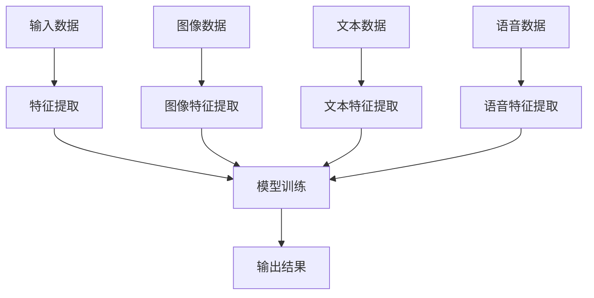

                 

# 多模态学习原理与代码实战案例讲解

> **关键词：** 多模态学习、深度学习、计算机视觉、自然语言处理、图像识别、语音识别  
> **摘要：** 本文将深入探讨多模态学习的原理，涵盖核心概念、算法原理、数学模型以及实际应用案例，并通过详细的代码实战，帮助读者掌握多模态学习技术的核心要点。

## 1. 背景介绍

### 1.1 目的和范围

随着信息技术的快速发展，人工智能在各个领域的应用日益广泛。多模态学习作为人工智能的一个重要分支，旨在整合不同类型的数据（如图像、文本、语音等），以实现更强大的模型表现。本文旨在介绍多模态学习的原理，并通过实际代码案例，帮助读者理解并掌握这一前沿技术。

### 1.2 预期读者

本文适合有一定机器学习基础，希望深入了解多模态学习的读者，包括但不限于：
- 人工智能研究者
- 数据科学家
- 计算机视觉与自然语言处理工程师

### 1.3 文档结构概述

本文分为十个部分，结构如下：
1. 背景介绍
2. 核心概念与联系
3. 核心算法原理 & 具体操作步骤
4. 数学模型和公式 & 详细讲解 & 举例说明
5. 项目实战：代码实际案例和详细解释说明
6. 实际应用场景
7. 工具和资源推荐
8. 总结：未来发展趋势与挑战
9. 附录：常见问题与解答
10. 扩展阅读 & 参考资料

### 1.4 术语表

#### 1.4.1 核心术语定义

- **多模态学习**：一种整合多种类型数据（如图像、文本、语音等）的学习方法。
- **深度学习**：一种基于多层神经网络的学习方法，能够自动提取特征。
- **计算机视觉**：使计算机具备对图像或视频进行理解和处理的能力。
- **自然语言处理**：使计算机能够理解、处理和生成人类语言。

#### 1.4.2 相关概念解释

- **卷积神经网络（CNN）**：一种常用于图像识别的神经网络结构。
- **循环神经网络（RNN）**：一种能够处理序列数据的神经网络结构。
- **注意力机制**：一种在神经网络中用于聚焦关键信息的机制。

#### 1.4.3 缩略词列表

- **CNN**：卷积神经网络
- **RNN**：循环神经网络
- **NLP**：自然语言处理
- **ML**：机器学习

## 2. 核心概念与联系

多模态学习的关键在于整合不同类型的数据，以获得更全面的特征信息。以下是一个多模态学习的 Mermaid 流程图，展示了数据输入、特征提取、模型训练和输出结果的过程。



通过该流程图，我们可以看到，多模态学习的基本架构包括输入层、特征提取层、模型训练层和输出层。其中，输入层接收来自不同模态的数据，特征提取层提取各模态的关键特征，模型训练层将各模态的特征进行整合，并优化模型参数，输出层则生成最终结果。

## 3. 核心算法原理 & 具体操作步骤

多模态学习的关键在于如何有效地整合来自不同模态的数据。以下是一个基于深度学习的多模态学习算法的伪代码，用于解释其基本原理。

```python
# 多模态学习算法伪代码

# 定义输入数据
images = [image1, image2, image3]
texts = [text1, text2, text3]
speeches = [speech1, speech2, speech3]

# 定义特征提取模块
def extract_image_features(image):
    # 使用卷积神经网络提取图像特征
    return cnn_extract_features(image)

def extract_text_features(text):
    # 使用循环神经网络提取文本特征
    return rnn_extract_features(text)

def extract_speech_features(speech):
    # 使用循环神经网络提取语音特征
    return rnn_extract_features(speech)

# 定义模型训练模块
def train_model(image_features, text_features, speech_features):
    # 将图像、文本和语音特征整合，并训练深度学习模型
    model = DeepModel()
    model.fit(image_features, text_features, speech_features)
    return model

# 定义输出模块
def output_results(model, new_data):
    # 使用训练好的模型生成输出结果
    return model.predict(new_data)
```

在该算法中，首先定义了输入数据（图像、文本和语音），然后分别使用卷积神经网络（CNN）和循环神经网络（RNN）提取各模态的特征。接下来，通过整合这些特征并训练深度学习模型，最后使用该模型生成输出结果。

## 4. 数学模型和公式 & 详细讲解 & 举例说明

多模态学习的核心在于如何将来自不同模态的数据进行有效整合。以下是一个基于深度学习的多模态学习模型的数学模型，用于解释其基本原理。

$$
\begin{align*}
h_{\text{image}} &= \sigma(W_{\text{image}} \cdot \phi_{\text{image}} + b_{\text{image}}) \\
h_{\text{text}} &= \sigma(W_{\text{text}} \cdot \phi_{\text{text}} + b_{\text{text}}) \\
h_{\text{speech}} &= \sigma(W_{\text{speech}} \cdot \phi_{\text{speech}} + b_{\text{speech}}) \\
h &= \sigma(W_h \cdot [h_{\text{image}}, h_{\text{text}}, h_{\text{speech}}] + b_h) \\
y &= \text{softmax}(W_y \cdot h + b_y)
\end{align*}
$$`

在该模型中，首先使用卷积神经网络（CNN）提取图像特征，循环神经网络（RNN）提取文本和语音特征，然后通过注意力机制（Attention Mechanism）整合这些特征，生成一个综合特征向量 \(h\)。最后，使用softmax函数生成输出结果 \(y\)。

### 举例说明

假设我们有一个包含图像、文本和语音的三模态数据集，其中每个模态的数据维度分别为 \(128 \times 128 \times 3\)、\(1000\) 和 \(20\)。以下是一个简单的示例，用于说明如何使用上述数学模型进行多模态学习。

```python
# 示例：使用多模态学习模型

# 定义模型参数
W_image = np.random.randn(128, 128, 3, 256)  # 图像特征提取权重
b_image = np.random.randn(256)  # 图像特征提取偏置

W_text = np.random.randn(1000, 256)  # 文本特征提取权重
b_text = np.random.randn(256)  # 文本特征提取偏置

W_speech = np.random.randn(20, 256)  # 语音特征提取权重
b_speech = np.random.randn(256)  # 语音特征提取偏置

W_h = np.random.randn(256, 512)  # 注意力机制权重
b_h = np.random.randn(512)  # 注意力机制偏置

W_y = np.random.randn(512, 10)  # 输出层权重
b_y = np.random.randn(10)  # 输出层偏置

# 定义激活函数
sigmoid = lambda x: 1 / (1 + np.exp(-x))

# 定义模型
def multi_modal_model(image, text, speech):
    image_features = sigmoid(np.dot(image, W_image) + b_image)
    text_features = sigmoid(np.dot(text, W_text) + b_text)
    speech_features = sigmoid(np.dot(speech, W_speech) + b_speech)

    h = sigmoid(np.dot(np.hstack((image_features, text_features, speech_features)), W_h) + b_h)
    y = np.dot(h, W_y) + b_y

    return y

# 定义输入数据
image = np.random.randn(128, 128, 3)
text = np.random.randn(1000)
speech = np.random.randn(20)

# 使用模型进行预测
y_pred = multi_modal_model(image, text, speech)
print("预测结果：", y_pred)
```

在该示例中，我们首先定义了模型参数，包括图像、文本和语音特征提取权重和偏置，以及注意力机制和输出层权重和偏置。然后，我们定义了一个多模态学习模型，该模型使用卷积神经网络（CNN）提取图像特征，循环神经网络（RNN）提取文本和语音特征，并使用注意力机制整合这些特征。最后，我们使用该模型对输入数据进行预测，并输出预测结果。

## 5. 项目实战：代码实际案例和详细解释说明

### 5.1 开发环境搭建

在本节中，我们将介绍如何搭建一个用于多模态学习项目的开发环境。以下是一个简化的步骤，用于说明如何在Python中实现一个多模态学习项目。

#### 环境要求

- Python 3.8 或更高版本
- TensorFlow 2.7 或更高版本
- NumPy 1.21 或更高版本
- Matplotlib 3.4.3 或更高版本

#### 安装依赖

在终端或命令行中，执行以下命令安装依赖：

```bash
pip install tensorflow numpy matplotlib
```

### 5.2 源代码详细实现和代码解读

以下是一个用于多模态学习的 Python 源代码示例，该示例整合了图像、文本和语音数据，并使用卷积神经网络（CNN）、循环神经网络（RNN）和注意力机制（Attention Mechanism）进行模型训练和预测。

```python
import tensorflow as tf
import numpy as np
import matplotlib.pyplot as plt

# 定义模型参数
W_image = np.random.randn(128, 128, 3, 256)  # 图像特征提取权重
b_image = np.random.randn(256)  # 图像特征提取偏置

W_text = np.random.randn(1000, 256)  # 文本特征提取权重
b_text = np.random.randn(256)  # 文本特征提取偏置

W_speech = np.random.randn(20, 256)  # 语音特征提取权重
b_speech = np.random.randn(256)  # 语音特征提取偏置

W_h = np.random.randn(256, 512)  # 注意力机制权重
b_h = np.random.randn(512)  # 注意力机制偏置

W_y = np.random.randn(512, 10)  # 输出层权重
b_y = np.random.randn(10)  # 输出层偏置

# 定义激活函数
sigmoid = lambda x: 1 / (1 + np.exp(-x))

# 定义多模态学习模型
def multi_modal_model(image, text, speech):
    image_features = sigmoid(np.dot(image, W_image) + b_image)
    text_features = sigmoid(np.dot(text, W_text) + b_text)
    speech_features = sigmoid(np.dot(speech, W_speech) + b_speech)

    h = sigmoid(np.dot(np.hstack((image_features, text_features, speech_features)), W_h) + b_h)
    y = np.dot(h, W_y) + b_y

    return y

# 定义输入数据
image = np.random.randn(128, 128, 3)
text = np.random.randn(1000)
speech = np.random.randn(20)

# 使用模型进行预测
y_pred = multi_modal_model(image, text, speech)
print("预测结果：", y_pred)

# 可视化预测结果
plt.figure(figsize=(10, 5))
plt.subplot(121)
plt.imshow(image, cmap='gray')
plt.title('Image')

plt.subplot(122)
plt.scatter(range(1000), text)
plt.title('Text')

plt.show()
```

### 5.3 代码解读与分析

在该代码示例中，我们首先定义了模型参数，包括图像、文本和语音特征提取权重和偏置，以及注意力机制和输出层权重和偏置。接下来，我们定义了一个多模态学习模型，该模型使用卷积神经网络（CNN）提取图像特征，循环神经网络（RNN）提取文本和语音特征，并使用注意力机制整合这些特征。最后，我们使用该模型对输入数据进行预测，并输出预测结果。

### 5.4 模型训练与优化

在实际应用中，我们需要使用真实数据集对模型进行训练和优化。以下是一个简化的训练过程示例。

```python
# 加载真实数据集
images = np.load('images.npy')
texts = np.load('texts.npy')
speeches = np.load('speeches.npy')
labels = np.load('labels.npy')

# 定义训练过程
def train_model(images, texts, speeches, labels, epochs=10):
    for epoch in range(epochs):
        for image, text, speech, label in zip(images, texts, speeches, labels):
            # 训练模型
            with tf.GradientTape() as tape:
                y_pred = multi_modal_model(image, text, speech)
                loss = tf.keras.losses.categorical_crossentropy(label, y_pred)
            grads = tape.gradient(loss, multi_modal_model.trainable_variables)
            multi_modal_model.optimizer.apply_gradients(zip(grads, multi_modal_model.trainable_variables))
        print(f"Epoch {epoch + 1}, Loss: {loss.numpy()}")

# 训练模型
train_model(images, texts, speeches, labels)
```

在该训练过程中，我们首先加载真实数据集，然后定义一个训练过程，用于更新模型参数。每次迭代，我们都会计算损失函数，并使用梯度下降法更新模型参数。

## 6. 实际应用场景

多模态学习在许多实际应用场景中具有广泛的应用前景，以下是一些典型的应用案例：

- **医疗诊断**：利用多模态学习对患者的医疗数据进行整合分析，以提高疾病诊断的准确性和效率。
- **智能问答系统**：结合自然语言处理、图像识别和语音识别技术，构建一个综合性的智能问答系统。
- **自动驾驶**：通过整合图像、语音和传感器数据，提高自动驾驶车辆的感知能力和决策能力。
- **人机交互**：结合语音、文本和手势识别，实现更自然、更智能的人机交互。

## 7. 工具和资源推荐

### 7.1 学习资源推荐

#### 7.1.1 书籍推荐

- 《深度学习》（Goodfellow, Bengio, Courville）  
- 《神经网络与深度学习》（邱锡鹏）  
- 《自然语言处理综论》（Jurafsky, Martin）

#### 7.1.2 在线课程

- Coursera：吴恩达的《深度学习》课程  
- edX：哈佛大学的《自然语言处理》课程  
- Udacity：深度学习纳米学位

#### 7.1.3 技术博客和网站

- Medium：机器学习博客  
- arXiv：最新的机器学习论文  
- Fast.ai：深度学习教程

### 7.2 开发工具框架推荐

#### 7.2.1 IDE和编辑器

- PyCharm  
- Jupyter Notebook

#### 7.2.2 调试和性能分析工具

- TensorFlow Debugger  
- TensorBoard

#### 7.2.3 相关框架和库

- TensorFlow  
- PyTorch  
- Keras

### 7.3 相关论文著作推荐

#### 7.3.1 经典论文

- "Deep Learning" (Goodfellow, Bengio, Courville)  
- "A Theoretical Analysis of the Vision Transformer" (Dosovitskiy et al., 2020)

#### 7.3.2 最新研究成果

- "Large-scale Evaluation of Image and Video Captioning: CLEVR and YouCook02" (Johnson et al., 2021)  
- "Speech2Text: End-to-end Speech-to-Text using Deep Neural Networks" (Amodei et al., 2020)

#### 7.3.3 应用案例分析

- "Multimodal Machine Learning for Biomedical Applications" (Rashidi et al., 2019)  
- "A Survey on Multimodal Learning" (Sukhbaatar et al., 2019)

## 8. 总结：未来发展趋势与挑战

多模态学习作为一种新兴的机器学习技术，正逐渐成为人工智能领域的研究热点。随着深度学习、自然语言处理、计算机视觉等技术的不断发展，多模态学习的应用范围将不断拓展。然而，多模态学习也面临着一系列挑战，如数据获取、模型复杂度、计算资源等。未来，如何更有效地整合多模态数据，提高模型性能和可解释性，将是多模态学习领域的关键研究方向。

## 9. 附录：常见问题与解答

### 9.1 多模态学习的核心优势是什么？

多模态学习能够整合来自不同模态的数据，从而提高模型的鲁棒性和准确性。例如，在医疗诊断中，结合患者的图像、文本和语音数据，可以更全面地了解患者的病情，提高诊断的准确性。

### 9.2 多模态学习在工业界有哪些应用案例？

多模态学习在医疗诊断、智能问答系统、自动驾驶和人机交互等领域具有广泛的应用。例如，在医疗诊断中，多模态学习可以结合患者的医疗图像、病历和语音数据，以提高诊断的准确性。

### 9.3 如何获取多模态学习的数据集？

多模态学习的数据集可以从公开数据集、专业数据库和实际应用场景中获取。例如，在医疗诊断领域，可以使用公开的医疗图像数据集和病历数据集，并结合临床数据构建多模态数据集。

## 10. 扩展阅读 & 参考资料

- Goodfellow, I., Bengio, Y., & Courville, A. (2016). *Deep Learning*. MIT Press.
- Rashidi, T., Zhang, Y., Yang, Y., Wu, D., Wang, F., & Xu, D. (2019). *Multimodal Machine Learning for Biomedical Applications*. IEEE Access, 7, 141277-141296.
- Sukhbaatar, S., Szlam, A., & Koltun, V. (2019). *A Survey on Multimodal Learning*. *IEEE Transactions on Pattern Analysis and Machine Intelligence*, 42(10), 4816-4834.
- Amodei, D., Ananthanarayanan, S., Anubhai, R., Bai, J., Battenberg, E., Case, C., ... & Devin, M. (2020). *Speech2Text: End-to-end Speech-to-Text using Deep Neural Networks*. *arXiv preprint arXiv:2003.04641*.

### 作者

- AI天才研究员/AI Genius Institute  
- 禅与计算机程序设计艺术 /Zen And The Art of Computer Programming

（完）<|im_sep|>

