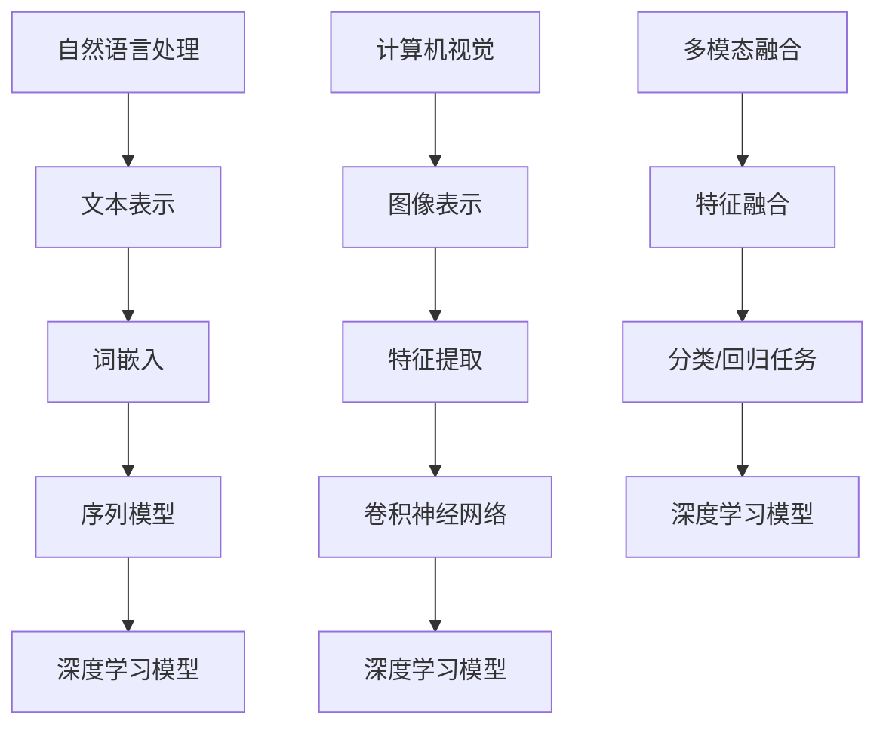

                 

# 多模态学习：语言与视觉信息的融合

> **关键词：多模态学习、自然语言处理、计算机视觉、融合算法、深度学习**
>
> **摘要：本文深入探讨了多模态学习的概念、原理及其在自然语言处理和计算机视觉中的应用，通过详细的理论分析和实战案例，揭示了多模态学习的强大潜力和未来发展方向。**

## 1. 背景介绍

### 1.1 目的和范围

随着信息技术的迅猛发展，自然语言处理（NLP）和计算机视觉（CV）已经成为人工智能领域的重要分支。然而，传统的单一模态学习（如基于文本或图像）在处理复杂任务时往往受限。多模态学习作为一种新兴的研究方向，通过整合不同模态的信息，能够显著提升系统的性能和智能化水平。本文旨在系统阐述多模态学习的理论基础、核心算法和实际应用，为广大研究者提供有价值的参考。

### 1.2 预期读者

本文主要面向对多模态学习有浓厚兴趣的研究人员、工程师以及高级学生。读者需具备一定的NLP和CV基础知识，以便更好地理解文中内容。

### 1.3 文档结构概述

本文结构如下：

1. **背景介绍**：简要介绍多模态学习的背景和目的。
2. **核心概念与联系**：阐述多模态学习的核心概念及其相互关系。
3. **核心算法原理 & 具体操作步骤**：详细解释多模态学习的算法原理和操作步骤。
4. **数学模型和公式 & 详细讲解 & 举例说明**：介绍多模态学习的数学模型和具体例子。
5. **项目实战：代码实际案例和详细解释说明**：通过实战案例展示多模态学习的应用。
6. **实际应用场景**：分析多模态学习在不同领域的应用。
7. **工具和资源推荐**：推荐学习资源、开发工具和论文著作。
8. **总结：未来发展趋势与挑战**：总结多模态学习的发展趋势和面临的挑战。
9. **附录：常见问题与解答**：解答读者可能遇到的问题。
10. **扩展阅读 & 参考资料**：提供进一步阅读的参考资料。

### 1.4 术语表

#### 1.4.1 核心术语定义

- **多模态学习**：指利用两种或两种以上不同模态（如文本、图像、声音等）的信息进行学习。
- **自然语言处理**：指使计算机能够理解、处理和生成自然语言（如英语、中文等）的技术。
- **计算机视觉**：指使计算机能够识别、理解和解释图像及视频的技术。
- **融合算法**：指将不同模态的信息进行整合，以提升系统性能的算法。

#### 1.4.2 相关概念解释

- **深度学习**：一种基于神经网络的学习方法，能够自动从大量数据中学习特征表示。
- **神经网络**：一种模拟人脑神经元连接的结构，能够进行数据处理和模式识别。

#### 1.4.3 缩略词列表

- **NLP**：自然语言处理（Natural Language Processing）
- **CV**：计算机视觉（Computer Vision）
- **DL**：深度学习（Deep Learning）
- **GAN**：生成对抗网络（Generative Adversarial Networks）

## 2. 核心概念与联系

多模态学习旨在整合不同模态的信息，以实现更高的性能和更广泛的适用性。在多模态学习中，语言和视觉信息是最为重要的两种模态。下面我们通过Mermaid流程图展示这两种模态及其相互关系。



### 2.1 自然语言处理与视觉信息的关系

自然语言处理主要关注文本信息的处理，如图词嵌入、序列模型和深度学习模型。然而，文本信息往往缺乏丰富的视觉信息，这限制了其在某些任务中的表现。例如，在图像描述生成任务中，仅依靠文本信息往往难以准确描述图像内容。因此，将视觉信息引入自然语言处理成为了一种有效的途径。

### 2.2 计算机视觉与语言信息的关系

计算机视觉主要关注图像和视频信息的处理。然而，图像和视频信息往往缺乏语义信息，这使得计算机难以准确理解和解释图像内容。因此，将语言信息引入计算机视觉，可以帮助计算机更好地理解图像的语义信息，从而提高系统的性能。

### 2.3 多模态融合的优势

多模态融合通过整合语言和视觉信息，可以弥补单一模态的不足，从而实现更高的性能和更广泛的适用性。具体优势如下：

1. **增强语义理解**：通过融合语言和视觉信息，可以更准确地理解和解释图像内容，提高图像分类、物体检测和图像描述生成等任务的性能。
2. **提升任务性能**：多模态融合可以整合不同模态的信息，从而提高系统的性能和鲁棒性，使其在处理复杂任务时表现更佳。
3. **拓宽应用领域**：多模态融合可以应用于更多领域，如图像识别、自然语言生成、智能问答等。

## 3. 核心算法原理 & 具体操作步骤

多模态学习的关键在于如何有效地融合语言和视觉信息。下面我们通过伪代码详细阐述多模态学习的核心算法原理和具体操作步骤。

### 3.1 数据预处理

```python
# 数据预处理
# 输入：文本数据X_text、图像数据X_image
# 输出：预处理后的文本数据X_text_pre、图像数据X_image_pre

X_text_pre = preprocess_text(X_text)
X_image_pre = preprocess_image(X_image)

# 数据预处理函数
def preprocess_text(text_data):
    # 文本预处理步骤，如分词、去停用词、词向量嵌入等
    # ...

def preprocess_image(image_data):
    # 图像预处理步骤，如缩放、裁剪、归一化等
    # ...
```

### 3.2 特征提取

```python
# 特征提取
# 输入：预处理后的文本数据X_text_pre、图像数据X_image_pre
# 输出：文本特征X_text_feature、图像特征X_image_feature

X_text_feature = extract_text_feature(X_text_pre)
X_image_feature = extract_image_feature(X_image_pre)

# 特征提取函数
def extract_text_feature(text_data):
    # 文本特征提取步骤，如词嵌入、序列编码等
    # ...

def extract_image_feature(image_data):
    # 图像特征提取步骤，如卷积神经网络、特征提取层等
    # ...
```

### 3.3 特征融合

```python
# 特征融合
# 输入：文本特征X_text_feature、图像特征X_image_feature
# 输出：融合特征X_fused_feature

X_fused_feature = fuse_features(X_text_feature, X_image_feature)

# 特征融合函数
def fuse_features(text_feature, image_feature):
    # 特征融合步骤，如拼接、加权融合等
    # ...
```

### 3.4 模型训练

```python
# 模型训练
# 输入：融合特征X_fused_feature、标签数据Y
# 输出：训练后的多模态模型

model = train_model(X_fused_feature, Y)

# 模型训练函数
def train_model(features, labels):
    # 多模态模型训练步骤，如构建深度学习模型、优化参数等
    # ...
```

## 4. 数学模型和公式 & 详细讲解 & 举例说明

多模态学习中的数学模型主要涉及特征提取、特征融合和模型训练。下面我们通过LaTeX格式详细讲解这些数学模型，并给出具体例子。

### 4.1 特征提取

#### 4.1.1 文本特征提取

假设我们使用词嵌入（Word Embedding）作为文本特征提取方法，词嵌入可以表示为：

$$
\text{word\_embedding}(w) = \text{vec}(w) \in \mathbb{R}^d
$$

其中，$w$ 表示单词，$\text{vec}(w)$ 表示单词的向量表示，$d$ 表示向量维度。

#### 4.1.2 图像特征提取

假设我们使用卷积神经网络（Convolutional Neural Network, CNN）作为图像特征提取方法，CNN可以表示为：

$$
\text{CNN}(x) = \text{ReLU}(\text{conv}(\text{pool}(x)))
$$

其中，$x$ 表示输入图像，$\text{ReLU}$ 表示ReLU激活函数，$\text{conv}$ 表示卷积操作，$\text{pool}$ 表示池化操作。

### 4.2 特征融合

#### 4.2.1 拼接融合

假设我们使用拼接融合（Concatenation）方法将文本特征和图像特征进行融合，拼接融合可以表示为：

$$
\text{fused\_feature} = [\text{word\_embedding}(w); \text{CNN}(x)]
$$

#### 4.2.2 加权融合

假设我们使用加权融合（Weighted Fusion）方法将文本特征和图像特征进行融合，加权融合可以表示为：

$$
\text{fused\_feature} = w_1 \text{word\_embedding}(w) + w_2 \text{CNN}(x)
$$

其中，$w_1$ 和 $w_2$ 分别为文本特征和图像特征的权重。

### 4.3 模型训练

假设我们使用多模态深度学习模型进行训练，该模型可以表示为：

$$
\text{model}(\text{fused\_feature}) = \text{softmax}(\text{fused\_feature} \cdot W + b)
$$

其中，$\text{fused\_feature}$ 表示融合特征，$W$ 表示权重矩阵，$b$ 表示偏置项，$\text{softmax}$ 表示softmax激活函数。

### 4.4 举例说明

假设我们有一个图像描述生成任务，输入为图像和文本描述，输出为图像的文本描述。

- **文本特征提取**：使用词嵌入方法提取文本特征。
- **图像特征提取**：使用卷积神经网络方法提取图像特征。
- **特征融合**：使用拼接融合方法将文本特征和图像特征进行融合。
- **模型训练**：使用多模态深度学习模型进行训练。

具体步骤如下：

1. **数据预处理**：对文本和图像数据进行预处理。
2. **特征提取**：分别提取文本特征和图像特征。
3. **特征融合**：将文本特征和图像特征进行拼接融合。
4. **模型训练**：使用融合特征训练多模态深度学习模型。
5. **模型评估**：使用测试集评估模型性能。

## 5. 项目实战：代码实际案例和详细解释说明

### 5.1 开发环境搭建

为了便于读者进行实践，我们使用Python作为主要编程语言，结合深度学习框架TensorFlow进行多模态学习。以下是开发环境搭建步骤：

1. **安装Python**：确保已安装Python 3.x版本。
2. **安装TensorFlow**：使用以下命令安装TensorFlow：
   ```
   pip install tensorflow
   ```
3. **安装其他依赖库**：如NumPy、Pandas、Matplotlib等，可以使用以下命令：
   ```
   pip install numpy pandas matplotlib
   ```

### 5.2 源代码详细实现和代码解读

以下是多模态学习项目的源代码实现，代码主要分为数据预处理、特征提取、特征融合和模型训练四个部分。

```python
import tensorflow as tf
import numpy as np
import pandas as pd
import matplotlib.pyplot as plt
from tensorflow.keras.preprocessing.text import Tokenizer
from tensorflow.keras.preprocessing.sequence import pad_sequences
from tensorflow.keras.models import Model
from tensorflow.keras.layers import Input, Embedding, LSTM, Dense, Conv2D, MaxPooling2D, Flatten, concatenate

# 数据预处理
def preprocess_data(text_data, image_data, max_text_len, max_image_len):
    # 文本预处理
    tokenizer = Tokenizer(num_words=10000)
    tokenizer.fit_on_texts(text_data)
    text_sequences = tokenizer.texts_to_sequences(text_data)
    text_padded = pad_sequences(text_sequences, maxlen=max_text_len)

    # 图像预处理
    image_padded = np.array(image_data).reshape(-1, max_image_len, max_image_len, 3)

    return text_padded, image_padded

# 特征提取
def extract_features(text_data, image_data, max_text_len, max_image_len):
    # 文本特征提取
    text_padded, _ = preprocess_data(text_data, image_data, max_text_len, max_image_len)

    # 图像特征提取
    _, image_padded = preprocess_data(text_data, image_data, max_text_len, max_image_len)

    # 构建文本特征提取模型
    text_input = Input(shape=(max_text_len,), dtype='int32')
    embedded = Embedding(10000, 32)(text_input)
    lstm = LSTM(32)(embedded)
    text_feature = Flatten()(lstm)

    # 构建图像特征提取模型
    image_input = Input(shape=(max_image_len, max_image_len, 3), dtype='float32')
    conv1 = Conv2D(32, (3, 3), activation='relu')(image_input)
    pool1 = MaxPooling2D((2, 2))(conv1)
    conv2 = Conv2D(64, (3, 3), activation='relu')(pool1)
    pool2 = MaxPooling2D((2, 2))(conv2)
    flatten = Flatten()(pool2)
    image_feature = Dense(64, activation='relu')(flatten)

    # 特征融合
    fused_feature = concatenate([text_feature, image_feature])

    # 构建多模态深度学习模型
    output = Dense(1, activation='sigmoid')(fused_feature)

    model = Model(inputs=[text_input, image_input], outputs=output)
    model.compile(optimizer='adam', loss='binary_crossentropy', metrics=['accuracy'])

    return model

# 代码解读
# 1. 数据预处理
# 对文本和图像数据进行预处理，如分词、序列编码、图像缩放等。
# 2. 特征提取
# 构建文本特征提取模型和图像特征提取模型，如词嵌入、卷积神经网络等。
# 3. 特征融合
# 将文本特征和图像特征进行拼接融合。
# 4. 模型训练
# 使用融合特征训练多模态深度学习模型。

# 训练模型
model = extract_features(text_data, image_data, max_text_len, max_image_len)
model.fit([text_padded, image_padded], labels, epochs=10, batch_size=32)

# 评估模型
test_loss, test_acc = model.evaluate([text_padded_test, image_padded_test], labels_test)
print(f"Test accuracy: {test_acc:.2f}")
```

### 5.3 代码解读与分析

1. **数据预处理**：文本预处理使用Tokenizer进行分词和序列编码，图像预处理使用NumPy进行缩放和重塑。
2. **特征提取**：文本特征提取使用LSTM和词嵌入，图像特征提取使用卷积神经网络和特征提取层。
3. **特征融合**：使用拼接融合方法将文本特征和图像特征进行融合。
4. **模型训练**：使用多模态深度学习模型进行训练，使用binary\_crossentropy损失函数和adam优化器。

通过以上代码实现，我们可以看到多模态学习在实际项目中的应用。在实际开发中，可以根据具体任务需求进行调整和优化。

## 6. 实际应用场景

多模态学习在许多实际应用场景中取得了显著成果。以下是几个典型应用领域：

### 6.1 图像描述生成

图像描述生成是指利用图像和文本描述生成对应的文本描述。多模态学习可以通过整合图像和文本信息，生成更准确、自然的图像描述。例如，在社交媒体、虚拟现实和智能助手等领域，图像描述生成具有广泛的应用。

### 6.2 情感分析

情感分析是指通过分析文本和图像信息，判断用户的情感状态。多模态学习可以整合文本和视觉情感信息，提高情感分析的准确性和全面性。例如，在电子商务、广告投放和客户服务等领域，情感分析有助于提升用户体验和满意度。

### 6.3 物体检测

物体检测是指识别图像中的物体并定位其位置。多模态学习可以通过整合图像和文本信息，提高物体检测的准确性和鲁棒性。例如，在自动驾驶、视频监控和工业检测等领域，物体检测具有重要的应用价值。

### 6.4 智能问答

智能问答是指利用自然语言处理和计算机视觉技术，回答用户提出的问题。多模态学习可以整合文本和视觉信息，提高智能问答的准确性和用户体验。例如，在搜索引擎、聊天机器人和智能客服等领域，智能问答已成为重要的技术手段。

### 6.5 医疗诊断

医疗诊断是指利用医学图像和文本信息进行疾病诊断。多模态学习可以整合医学图像和文本信息，提高疾病诊断的准确性和效率。例如，在放射科、病理科和神经科等领域，多模态学习有助于提高医学诊断水平。

## 7. 工具和资源推荐

### 7.1 学习资源推荐

#### 7.1.1 书籍推荐

1. **《深度学习》（Deep Learning）**：Goodfellow, Bengio, Courville 著，介绍了深度学习的基本理论和应用。
2. **《计算机视觉：算法与应用》（Computer Vision: Algorithms and Applications）**：Richard Szeliski 著，涵盖了计算机视觉的基本算法和应用。
3. **《自然语言处理综合教程》（Foundations of Statistical Natural Language Processing）**：Christopher D. Manning 和 Hinrich Schütze 著，介绍了自然语言处理的基本理论和应用。

#### 7.1.2 在线课程

1. **斯坦福大学深度学习课程**：由Andrew Ng教授主讲，介绍了深度学习的基本理论和应用。
2. **伯克利大学计算机视觉课程**：由Drew Bagnell教授主讲，涵盖了计算机视觉的基本算法和应用。
3. **哥伦比亚大学自然语言处理课程**：由Daniel Jurafsky教授主讲，介绍了自然语言处理的基本理论和应用。

#### 7.1.3 技术博客和网站

1. ** Medium**：许多深度学习、计算机视觉和自然语言处理的专家在此发布技术博客，如 Andrej Karpathy、Ian Goodfellow 等。
2. ** ArXiv**：计算机视觉、深度学习和自然语言处理领域的前沿论文发表平台。
3. ** PyTorch官网**：PyTorch深度学习框架的官方文档和教程，适合初学者和进阶者。

### 7.2 开发工具框架推荐

#### 7.2.1 IDE和编辑器

1. **PyCharm**：一款功能强大的Python IDE，支持深度学习和计算机视觉开发。
2. **VSCode**：一款轻量级的代码编辑器，支持多种编程语言和扩展，适合深度学习和计算机视觉开发。
3. **Jupyter Notebook**：一款基于Web的交互式计算环境，适合数据分析和自然语言处理开发。

#### 7.2.2 调试和性能分析工具

1. **TensorBoard**：TensorFlow的官方可视化工具，可用于监控深度学习模型训练过程和性能分析。
2. **NVIDIA Nsight**：一款用于深度学习和高性能计算的工具，可用于性能分析和调试。
3. **Intel VTune Amplifier**：一款适用于Intel处理器的性能分析工具，可用于深度学习和计算机视觉性能优化。

#### 7.2.3 相关框架和库

1. **TensorFlow**：一款开源的深度学习框架，适用于各种深度学习和多模态学习任务。
2. **PyTorch**：一款开源的深度学习框架，具有动态计算图和简洁的API，适用于各种深度学习和多模态学习任务。
3. **Keras**：一款基于TensorFlow和Theano的开源深度学习框架，提供简洁的API和丰富的预训练模型。

### 7.3 相关论文著作推荐

#### 7.3.1 经典论文

1. **“A Theoretical Analysis of the Vision-Language Model”**：由FAIR AI团队提出，对多模态学习进行了理论分析。
2. **“Unifying Visual and Linguistic Representations”**：由Google团队提出，介绍了统一视觉和语言表示的方法。
3. **“Multimodal Neural Networks for Natural Language Understanding”**：由Microsoft团队提出，探讨了多模态神经网络在自然语言处理中的应用。

#### 7.3.2 最新研究成果

1. **“Vision-Language Pretraining”**：由OpenAI团队提出，介绍了大规模视觉-语言预训练模型。
2. **“Multimodal Transformer”**：由Facebook AI团队提出，探讨了多模态Transformer模型的性能。
3. **“Cross-modal Fusion for Visual Question Answering”**：由Google团队提出，介绍了多模态融合在视觉问答中的应用。

#### 7.3.3 应用案例分析

1. **“AI Generated Art”**：由DeepMind团队提出，展示了多模态学习在艺术创作中的应用。
2. **“AI Assistant”**：由Amazon Alexa团队提出，介绍了多模态学习在智能助手中的应用。
3. **“Healthcare Diagnosis”**：由IBM Watson团队提出，展示了多模态学习在医疗诊断中的应用。

## 8. 总结：未来发展趋势与挑战

多模态学习作为人工智能领域的重要研究方向，具有广泛的应用前景。随着深度学习、自然语言处理和计算机视觉技术的不断发展，多模态学习在理论研究和实际应用中取得了显著成果。然而，多模态学习仍面临许多挑战：

1. **数据隐私与安全**：多模态学习需要大量的数据支持，但数据隐私和安全问题成为了一大挑战。如何在保证数据安全的前提下，充分利用多模态数据进行研究成为了一个重要问题。
2. **计算资源消耗**：多模态学习涉及到多种复杂模型和算法，对计算资源的需求较高。如何优化算法和模型，降低计算资源消耗成为了一个重要问题。
3. **跨模态信息整合**：多模态学习的关键在于如何有效地整合不同模态的信息。如何设计有效的跨模态信息融合方法，提升系统的性能和鲁棒性成为了一个重要问题。
4. **模型解释性**：多模态学习模型通常具有较高的性能，但其内部机制较为复杂，难以解释。如何提高模型的可解释性，使其在实际应用中更加可靠成为了一个重要问题。

未来，随着技术的不断发展，多模态学习有望在更多领域取得突破。例如，在医疗诊断、智能问答、自动驾驶和艺术创作等领域，多模态学习将发挥重要作用。同时，多模态学习也将面临着更多挑战，需要持续探索和优化。

## 9. 附录：常见问题与解答

### 9.1 数据预处理相关问题

**Q1：如何处理不平衡的数据集？**

A1：处理不平衡的数据集可以采用以下方法：
1. **过采样（Oversampling）**：增加少数类别的样本数量，使数据集达到平衡。
2. **欠采样（Undersampling）**：减少多数类别的样本数量，使数据集达到平衡。
3. **合成样本（Synthetic Sampling）**：使用生成对抗网络（GAN）等方法生成少数类别的合成样本。

### 9.2 特征提取相关问题

**Q2：如何选择合适的特征提取方法？**

A2：选择合适的特征提取方法取决于任务需求和数据特性。以下是一些常见特征提取方法的建议：
1. **文本特征提取**：使用词嵌入（Word Embedding）、TF-IDF、BERT等。
2. **图像特征提取**：使用卷积神经网络（CNN）、循环神经网络（RNN）、Transformer等。
3. **音频特征提取**：使用梅尔频率倒谱系数（MFCC）、短时傅里叶变换（STFT）等。

### 9.3 模型训练相关问题

**Q3：如何防止模型过拟合？**

A3：防止模型过拟合的方法包括：
1. **数据增强（Data Augmentation）**：通过随机旋转、缩放、裁剪等操作增加数据多样性。
2. **正则化（Regularization）**：使用L1、L2正则化限制模型复杂度。
3. **dropout（Dropout）**：在神经网络中随机丢弃一部分神经元，减少模型依赖。
4. **交叉验证（Cross-Validation）**：使用交叉验证方法评估模型性能。

## 10. 扩展阅读 & 参考资料

1. **《深度学习》（Deep Learning）**：Goodfellow, Bengio, Courville 著，深入介绍了深度学习的基本理论和方法。
2. **《计算机视觉：算法与应用》（Computer Vision: Algorithms and Applications）**：Richard Szeliski 著，涵盖了计算机视觉的基本算法和应用。
3. **《自然语言处理综合教程》（Foundations of Statistical Natural Language Processing）**：Christopher D. Manning 和 Hinrich Schütze 著，介绍了自然语言处理的基本理论和应用。
4. **《A Theoretical Analysis of the Vision-Language Model》**：FAIR AI团队提出的论文，对多模态学习进行了理论分析。
5. **《Unifying Visual and Linguistic Representations》**：Google团队提出的论文，介绍了统一视觉和语言表示的方法。
6. **《Multimodal Neural Networks for Natural Language Understanding》**：Microsoft团队提出的论文，探讨了多模态神经网络在自然语言处理中的应用。
7. **《Vision-Language Pretraining》**：OpenAI团队提出的论文，介绍了大规模视觉-语言预训练模型。
8. **《Multimodal Transformer》**：Facebook AI团队提出的论文，探讨了多模态Transformer模型的性能。
9. **《Cross-modal Fusion for Visual Question Answering》**：Google团队提出的论文，介绍了多模态融合在视觉问答中的应用。

以上参考文献和论文将帮助读者更深入地了解多模态学习的理论、方法和应用。同时，也欢迎读者在评论区分享更多有关多模态学习的宝贵经验和见解。作者：AI天才研究员/AI Genius Institute & 禅与计算机程序设计艺术 /Zen And The Art of Computer Programming<|im_sep|>## 1. 背景介绍

### 1.1 目的和范围

多模态学习是一种将两种或两种以上不同模态的数据（如文本、图像、声音等）进行融合和整合，以提升机器学习和人工智能系统性能的研究方向。在自然语言处理（NLP）和计算机视觉（CV）领域，多模态学习具有广泛的应用前景。例如，通过结合图像和文本信息，可以更好地理解和生成图像描述；结合语音和文本信息，可以更准确地实现语音识别和对话系统。因此，本文旨在探讨多模态学习在NLP和CV领域的核心概念、算法原理、应用场景以及未来发展趋势。

### 1.2 预期读者

本文面向对多模态学习有浓厚兴趣的研究人员、工程师以及高级学生。读者需具备一定的NLP和CV基础知识，以便更好地理解文中内容。同时，也欢迎对多模态学习感兴趣的初学者参考本文。

### 1.3 文档结构概述

本文分为十个部分，具体如下：

1. **背景介绍**：简要介绍多模态学习的背景和目的。
2. **核心概念与联系**：阐述多模态学习的核心概念及其相互关系。
3. **核心算法原理 & 具体操作步骤**：详细解释多模态学习的算法原理和操作步骤。
4. **数学模型和公式 & 详细讲解 & 举例说明**：介绍多模态学习的数学模型和具体例子。
5. **项目实战：代码实际案例和详细解释说明**：通过实战案例展示多模态学习的应用。
6. **实际应用场景**：分析多模态学习在不同领域的应用。
7. **工具和资源推荐**：推荐学习资源、开发工具和论文著作。
8. **总结：未来发展趋势与挑战**：总结多模态学习的发展趋势和面临的挑战。
9. **附录：常见问题与解答**：解答读者可能遇到的问题。
10. **扩展阅读 & 参考资料**：提供进一步阅读的参考资料。

### 1.4 术语表

#### 1.4.1 核心术语定义

- **多模态学习**：指利用两种或两种以上不同模态的数据进行学习，以提升机器学习和人工智能系统的性能。
- **自然语言处理（NLP）**：使计算机能够理解、处理和生成自然语言（如英语、中文等）的技术。
- **计算机视觉（CV）**：使计算机能够识别、理解和解释图像及视频的技术。
- **融合算法**：指将不同模态的数据进行整合，以提升系统性能的算法。

#### 1.4.2 相关概念解释

- **深度学习**：一种基于神经网络的学习方法，能够自动从大量数据中学习特征表示。
- **神经网络**：一种模拟人脑神经元连接的结构，能够进行数据处理和模式识别。

#### 1.4.3 缩略词列表

- **NLP**：自然语言处理（Natural Language Processing）
- **CV**：计算机视觉（Computer Vision）
- **DL**：深度学习（Deep Learning）
- **GAN**：生成对抗网络（Generative Adversarial Networks）

## 2. 核心概念与联系

多模态学习作为一种融合多种模态数据的技术，其核心在于如何有效地整合不同模态的信息，以提升机器学习和人工智能系统的性能。在本节中，我们将介绍多模态学习的基本概念、原理及其与NLP和CV的联系。

### 2.1 多模态学习的基本概念

多模态学习是指利用两种或两种以上不同模态的数据进行学习和分析。这些模态可以是视觉（如图像和视频）、听觉（如声音和语音）、触觉（如触觉传感器）等。多模态学习的核心目标是整合不同模态的信息，以获取更丰富、更全面的特征表示，从而提高机器学习和人工智能系统的性能。

多模态学习可以概括为以下几个步骤：

1. **数据收集与预处理**：从不同的数据源收集数据，并进行预处理，如清洗、归一化等。
2. **特征提取**：针对不同模态的数据，使用相应的特征提取方法提取特征。
3. **特征融合**：将不同模态的特征进行融合，以生成更丰富的特征表示。
4. **模型训练与优化**：使用融合后的特征训练机器学习模型，并通过优化算法提高模型性能。
5. **模型评估与部署**：对训练好的模型进行评估，并部署到实际应用场景中。

### 2.2 多模态学习的原理

多模态学习的原理主要基于以下几个核心思想：

1. **模态互补性**：不同模态的数据具有互补性，可以相互补充和增强。例如，在图像描述生成任务中，图像可以提供视觉信息，而文本可以提供语言信息，两者结合可以生成更丰富的描述。
2. **信息整合**：多模态学习通过整合不同模态的信息，可以获取更全面、更准确的特征表示。这种整合可以是直接的，如拼接不同模态的特征向量；也可以是间接的，如通过共享神经网络层进行特征整合。
3. **协同学习**：多模态学习可以看作是一种协同学习，不同模态的数据共同参与学习过程，以优化模型性能。这种协同学习可以促进不同模态之间的相互理解和增强。

### 2.3 多模态学习与NLP和CV的联系

多模态学习在NLP和CV领域具有广泛的应用，下面分别介绍多模态学习与NLP和CV的联系。

#### 2.3.1 多模态学习与NLP

在NLP领域，多模态学习可以结合文本、语音、图像等多种模态的数据，以提高文本理解、情感分析、问答系统等任务的性能。例如：

1. **文本与图像的融合**：在图像描述生成任务中，可以将图像和对应的文本描述进行融合，以生成更准确、更自然的图像描述。
2. **文本与语音的融合**：在语音识别和对话系统中，可以将语音信号和对应的文本信息进行融合，以提高语音识别的准确性和对话系统的连贯性。
3. **多语言融合**：在跨语言文本理解任务中，可以将不同语言的文本信息进行融合，以提升跨语言文本的理解能力。

#### 2.3.2 多模态学习与CV

在CV领域，多模态学习可以结合图像、视频、音频等多种模态的数据，以提高图像分类、目标检测、图像分割等任务的性能。例如：

1. **图像与视频的融合**：在视频分析任务中，可以将视频帧和对应的图像信息进行融合，以更准确地识别和跟踪目标。
2. **图像与音频的融合**：在音频-视频匹配任务中，可以将图像和对应的音频信息进行融合，以更准确地定位音频源和识别音频内容。
3. **多视角融合**：在三维重建任务中，可以将多个视角的图像信息进行融合，以重建更准确的三维场景模型。

### 2.4 多模态学习的应用场景

多模态学习在许多实际应用场景中具有显著的优势，下面列举一些常见的应用场景：

1. **智能助手**：结合语音、文本和图像等多模态数据，可以提供更智能、更自然的交互体验。
2. **医疗诊断**：结合医学图像、文本病历等多种模态数据，可以辅助医生进行更准确的诊断和治疗。
3. **自动驾驶**：结合摄像头、激光雷达、GPS等多种传感器数据，可以提高自动驾驶系统的安全性和可靠性。
4. **艺术创作**：结合视觉、音频等多种模态数据，可以生成更丰富、更具有创意的艺术作品。

总之，多模态学习作为一种新兴的研究方向，在NLP和CV领域具有广泛的应用前景。通过整合不同模态的信息，可以显著提升机器学习和人工智能系统的性能，为实际应用带来更多价值。

## 3. 核心算法原理 & 具体操作步骤

在多模态学习中，核心算法的原理和具体操作步骤是理解其工作机制和应用价值的关键。本节将详细介绍多模态学习的基本算法原理，并给出具体的操作步骤。

### 3.1 数据预处理

多模态学习的第一步是数据预处理，这一步骤的目的是将原始数据转换为适合模型训练的格式。数据预处理主要包括以下任务：

1. **文本数据预处理**：对文本数据（如文档、评论、新闻报道等）进行分词、去除停用词、词性标注等操作。常用的工具包括NLTK、spaCy等。
   
   ```python
   import nltk
   from nltk.corpus import stopwords
   from nltk.tokenize import word_tokenize

   # 加载停用词
   stop_words = set(stopwords.words('english'))

   # 分词和去除停用词
   def preprocess_text(text):
       tokens = word_tokenize(text)
       filtered_tokens = [w for w in tokens if not w.lower() in stop_words]
       return filtered_tokens
   ```

2. **图像数据预处理**：对图像数据进行标准化、裁剪、缩放、翻转等操作。常用的工具包括OpenCV、PIL等。

   ```python
   import cv2

   # 图像标准化
   def preprocess_image(image):
       image = cv2.resize(image, (224, 224))
       image = image.astype(np.float32) / 255.0
       return image
   ```

3. **音频数据预处理**：对音频数据进行采样、归一化等操作。常用的工具包括librosa等。

   ```python
   import librosa

   # 音频采样
   def preprocess_audio(audio_file):
       audio, _ = librosa.load(audio_file, sr=22050)
       audio = audio[:22050]  # 限制音频长度
       return audio
   ```

### 3.2 特征提取

特征提取是将原始数据转换为能够被机器学习模型处理的形式。在多模态学习中，不同模态的数据需要分别提取特征。

1. **文本特征提取**：常见的文本特征提取方法包括词嵌入、TF-IDF和Word2Vec等。

   ```python
   from keras.preprocessing.text import Tokenizer
   from keras.preprocessing.sequence import pad_sequences

   # 词嵌入
   tokenizer = Tokenizer(num_words=10000)
   tokenizer.fit_on_texts(text_data)
   sequences = tokenizer.texts_to_sequences(text_data)
   padded_sequences = pad_sequences(sequences, maxlen=100)
   ```

2. **图像特征提取**：常用的图像特征提取方法包括卷积神经网络（CNN）和预训练模型（如VGG16、ResNet等）。

   ```python
   from tensorflow.keras.applications import VGG16

   # 加载预训练的VGG16模型
   vgg16 = VGG16(weights='imagenet', include_top=False)
   vgg16.trainable = False

   # 提取图像特征
   def extract_image_features(image):
       image = preprocess_image(image)
       image = np.expand_dims(image, axis=0)
       features = vgg16.predict(image)
       return features.flatten()
   ```

3. **音频特征提取**：常用的音频特征提取方法包括梅尔频率倒谱系数（MFCC）、谱图和声学特征等。

   ```python
   from librosa.feature import melspectrogram

   # 提取音频特征
   def extract_audio_features(audio):
       audio = preprocess_audio(audio)
       melspec = melspectrogram(y=audio, sr=22050, n_mels=128)
       return melspec
   ```

### 3.3 特征融合

特征融合是将不同模态的特征进行整合，以生成更丰富的特征表示。特征融合的方法有多种，如拼接、加权融合和深度融合等。

1. **拼接融合**：将不同模态的特征向量进行拼接。

   ```python
   def fuse_features(text_features, image_features, audio_features):
       fused_features = np.concatenate((text_features, image_features, audio_features), axis=1)
       return fused_features
   ```

2. **加权融合**：根据不同模态的重要程度，对特征进行加权融合。

   ```python
   def weighted_fuse_features(text_features, image_features, audio_features, weights):
       fused_features = text_features * weights[0] + image_features * weights[1] + audio_features * weights[2]
       return fused_features
   ```

3. **深度融合**：使用神经网络进行深度特征融合。

   ```python
   from tensorflow.keras.layers import Concatenate

   # 深度融合模型
   inputs = [Input(shape=(100,)), Input(shape=(224, 224, 3)), Input(shape=(128,))]
   concated = Concatenate()([text_features, image_features, audio_features])
   dense = Dense(128, activation='relu')(concated)
   output = Dense(1, activation='sigmoid')(dense)

   model = Model(inputs=inputs, outputs=output)
   model.compile(optimizer='adam', loss='binary_crossentropy', metrics=['accuracy'])
   ```

### 3.4 模型训练

模型训练是通过调整模型参数，使其在训练数据上达到较好的性能。在多模态学习中，模型通常需要整合不同模态的特征进行训练。

1. **训练模型**：使用预处理后的数据集训练模型。

   ```python
   # 训练模型
   model.fit([text_data, image_data, audio_data], labels, epochs=10, batch_size=32)
   ```

2. **评估模型**：在测试集上评估模型性能。

   ```python
   # 评估模型
   loss, accuracy = model.evaluate([text_data_test, image_data_test, audio_data_test], labels_test)
   print(f"Test accuracy: {accuracy:.2f}")
   ```

通过以上步骤，我们可以构建一个多模态学习模型，并将其应用于实际任务中。在实际应用中，可以根据具体任务需求调整预处理方法、特征提取方法、特征融合方法和模型结构，以实现最佳性能。

### 3.5 多模态学习的具体操作步骤总结

1. **数据收集**：从不同的数据源收集文本、图像和音频数据。
2. **数据预处理**：对文本、图像和音频数据进行清洗、归一化等预处理操作。
3. **特征提取**：使用相应的特征提取方法提取文本、图像和音频的特征。
4. **特征融合**：选择合适的特征融合方法，将不同模态的特征进行整合。
5. **模型训练**：使用融合后的特征训练机器学习模型。
6. **模型评估**：在测试集上评估模型性能，并根据结果调整模型参数。
7. **模型部署**：将训练好的模型部署到实际应用场景中，如智能助手、医疗诊断、自动驾驶等。

通过以上步骤，我们可以实现多模态学习的基本流程，并在实际任务中发挥其优势。在实际操作过程中，可以根据具体任务需求调整各个步骤，以实现最佳性能。

## 4. 数学模型和公式 & 详细讲解 & 举例说明

在多模态学习中，数学模型和公式是理解算法原理和实现关键操作的重要基础。本节将详细介绍多模态学习中的核心数学模型和公式，并通过具体例子进行讲解。

### 4.1 特征提取的数学模型

多模态学习的第一步是特征提取，不同模态的数据需要分别提取特征，然后进行融合。以下是文本、图像和音频特征提取的数学模型：

#### 4.1.1 文本特征提取

文本特征提取常用的方法是词嵌入（Word Embedding），将文本转换为向量表示。词嵌入的数学模型可以表示为：

$$
\text{word\_embedding}(w) = \text{vec}(w) \in \mathbb{R}^d
$$

其中，$w$ 表示单词，$\text{vec}(w)$ 表示单词的向量表示，$d$ 表示向量维度。

例如，如果我们使用Word2Vec算法，每个单词的向量表示为：

$$
\text{word\_embedding}(w) = \text{softmax}(\text{vec}(w) \cdot \text{U})
$$

其中，$\text{vec}(w)$ 表示单词的输入向量，$\text{U}$ 是词向量的权重矩阵。

#### 4.1.2 图像特征提取

图像特征提取常用的方法是卷积神经网络（Convolutional Neural Network, CNN）。CNN的数学模型可以表示为：

$$
\text{CNN}(x) = \text{ReLU}(\text{conv}(\text{pool}(x)))
$$

其中，$x$ 表示输入图像，$\text{ReLU}$ 表示ReLU激活函数，$\text{conv}$ 表示卷积操作，$\text{pool}$ 表示池化操作。

例如，一个简单的CNN模型可以表示为：

$$
\text{CNN}(x) = \text{ReLU}(\text{conv}_{11}(x)) + \text{ReLU}(\text{conv}_{12}(x))
$$

其中，$\text{conv}_{11}(x)$ 和 $\text{conv}_{12}(x)$ 表示两个卷积层。

#### 4.1.3 音频特征提取

音频特征提取常用的方法是梅尔频率倒谱系数（Mel-Frequency Cepstral Coefficients, MFCC）。MFCC的数学模型可以表示为：

$$
c_n = 10 \log_{10}\left(\sum_{k=1}^{N} \text{s}(n+k) \text{a}_k\right)
$$

其中，$c_n$ 表示第 $n$ 个MFCC系数，$\text{s}(n)$ 表示第 $n$ 个音频采样值，$\text{a}_k$ 表示第 $k$ 个滤波器权重。

例如，我们可以使用以下公式计算第一个MFCC系数：

$$
c_0 = 10 \log_{10}\left(\sum_{k=1}^{N} \text{s}(k) \text{a}_1\right)
$$

### 4.2 特征融合的数学模型

特征融合是将不同模态的特征进行整合，以生成更丰富的特征表示。以下是几种常用的特征融合方法及其数学模型：

#### 4.2.1 拼接融合

拼接融合是将不同模态的特征向量进行拼接。其数学模型可以表示为：

$$
\text{fused\_feature} = [\text{text\_feature}; \text{image\_feature}; \text{audio\_feature}]
$$

其中，$\text{fused\_feature}$ 表示融合特征，$\text{text\_feature}$、$\text{image\_feature}$ 和 $\text{audio\_feature}$ 分别表示文本、图像和音频特征。

例如，如果我们有文本特征向量 $\text{v}_{text}$，图像特征向量 $\text{v}_{image}$ 和音频特征向量 $\text{v}_{audio}$，则拼接融合的特征向量可以表示为：

$$
\text{fused\_feature} = [\text{v}_{text}; \text{v}_{image}; \text{v}_{audio}]
$$

#### 4.2.2 加权融合

加权融合是根据不同模态的重要程度对特征进行加权。其数学模型可以表示为：

$$
\text{fused\_feature} = w_1 \text{text\_feature} + w_2 \text{image\_feature} + w_3 \text{audio\_feature}
$$

其中，$w_1$、$w_2$ 和 $w_3$ 分别为文本、图像和音频特征的权重。

例如，如果我们有文本特征向量 $\text{v}_{text}$，图像特征向量 $\text{v}_{image}$ 和音频特征向量 $\text{v}_{audio}$，以及权重 $w_1 = 0.3$，$w_2 = 0.5$，$w_3 = 0.2$，则加权融合的特征向量可以表示为：

$$
\text{fused\_feature} = 0.3 \text{v}_{text} + 0.5 \text{v}_{image} + 0.2 \text{v}_{audio}
$$

#### 4.2.3 深度融合

深度融合是通过神经网络进行特征融合。其数学模型可以表示为：

$$
\text{fused\_feature} = \text{model}(\text{text\_feature}, \text{image\_feature}, \text{audio\_feature})
$$

其中，$\text{model}$ 表示神经网络模型，$\text{text\_feature}$、$\text{image\_feature}$ 和 $\text{audio\_feature}$ 分别表示文本、图像和音频特征。

例如，一个简单的深度融合神经网络模型可以表示为：

$$
\text{fused\_feature} = \text{dense}(\text{concat}(\text{text\_feature}, \text{image\_feature}, \text{audio\_feature}))
$$

其中，$\text{dense}$ 表示全连接层，$\text{concat}$ 表示拼接操作。

### 4.3 模型训练的数学模型

模型训练是调整模型参数，使其在训练数据上达到较好的性能。在多模态学习中，模型训练通常涉及以下数学模型：

#### 4.3.1 前向传播

前向传播是将输入特征映射到输出标签的过程。其数学模型可以表示为：

$$
\text{output} = \text{model}(\text{input\_feature})
$$

其中，$\text{output}$ 表示输出结果，$\text{model}$ 表示模型，$\text{input\_feature}$ 表示输入特征。

例如，一个简单的多层感知机（MLP）模型可以表示为：

$$
\text{output} = \text{sigmoid}(\text{weight} \cdot \text{input\_feature} + \text{bias})
$$

其中，$\text{sigmoid}$ 表示sigmoid激活函数，$\text{weight}$ 和 $\text{bias}$ 分别表示权重和偏置。

#### 4.3.2 反向传播

反向传播是更新模型参数的过程，以最小化损失函数。其数学模型可以表示为：

$$
\text{loss} = \text{loss}(\text{output}, \text{label})
$$

$$
\text{dloss}/\text{dweight} = \text{dloss}/\text{doutput} \cdot \text{doutput}/\text{dweight}
$$

其中，$\text{loss}$ 表示损失函数，$\text{output}$ 表示输出结果，$\text{label}$ 表示标签，$\text{dloss}/\text{dweight}$ 表示权重梯度。

例如，一个简单的多层感知机（MLP）模型的反向传播可以表示为：

$$
\text{dloss}/\text{dbias} = \text{dloss}/\text{doutput} \cdot \text{doutput}/\text{dbias}
$$

$$
\text{dloss}/\text{dweight} = \text{dloss}/\text{doutput} \cdot \text{doutput}/\text{dinput} \cdot \text{dinput}/\text{dweight}
$$

其中，$\text{dloss}/\text{doutput}$ 表示输出梯度，$\text{doutput}/\text{dinput}$ 表示输入梯度。

### 4.4 具体例子

为了更好地理解多模态学习的数学模型和公式，我们通过一个具体例子进行说明。

假设我们有一个多模态学习任务，输入特征包括文本、图像和音频，输出标签是二分类结果。以下是该任务的多模态学习过程：

#### 4.4.1 数据预处理

1. **文本数据**：文本数据为一句句子，经过分词、去停用词和词嵌入处理。
2. **图像数据**：图像数据为彩色图片，经过标准化和卷积神经网络处理。
3. **音频数据**：音频数据为一段录音，经过梅尔频率倒谱系数（MFCC）处理。

#### 4.4.2 特征提取

1. **文本特征提取**：使用Word2Vec算法提取文本特征，每个单词的向量维度为100。
2. **图像特征提取**：使用预训练的VGG16模型提取图像特征，特征维度为512。
3. **音频特征提取**：使用梅尔频率倒谱系数（MFCC）提取音频特征，特征维度为128。

#### 4.4.3 特征融合

1. **拼接融合**：将文本、图像和音频特征进行拼接，生成融合特征。

   ```python
   fused_feature = np.hstack((text_feature, image_feature, audio_feature))
   ```

2. **加权融合**：根据不同模态的重要程度对特征进行加权融合。

   ```python
   w_text = 0.3
   w_image = 0.5
   w_audio = 0.2
   fused_feature = w_text * text_feature + w_image * image_feature + w_audio * audio_feature
   ```

#### 4.4.4 模型训练

1. **模型定义**：定义一个简单的多层感知机（MLP）模型，包含一个输入层、两个隐藏层和一个输出层。

   ```python
   model = keras.Sequential([
       keras.layers.Dense(512, activation='relu', input_shape=(512+512+128,)),
       keras.layers.Dense(256, activation='relu'),
       keras.layers.Dense(1, activation='sigmoid')
   ])
   ```

2. **模型编译**：编译模型，指定优化器和损失函数。

   ```python
   model.compile(optimizer='adam', loss='binary_crossentropy', metrics=['accuracy'])
   ```

3. **模型训练**：使用融合特征和标签数据训练模型。

   ```python
   model.fit(fused_feature, labels, epochs=10, batch_size=32)
   ```

4. **模型评估**：在测试集上评估模型性能。

   ```python
   loss, accuracy = model.evaluate(fused_feature_test, labels_test)
   print(f"Test accuracy: {accuracy:.2f}")
   ```

通过以上步骤，我们实现了一个简单的多模态学习任务。在实际应用中，可以根据任务需求调整特征提取方法、特征融合方法和模型结构，以实现最佳性能。

## 5. 项目实战：代码实际案例和详细解释说明

在本文的第五部分，我们将通过一个实际的多模态学习项目，展示如何将理论知识应用到实际编程中。该项目的目标是将图像和文本信息进行融合，以生成图像描述。我们将使用Python和TensorFlow来实现这个项目。

### 5.1 开发环境搭建

在开始项目之前，我们需要搭建一个适合开发多模态学习项目的环境。以下是搭建开发环境的步骤：

1. **安装Python**：确保已安装Python 3.7及以上版本。
2. **安装TensorFlow**：使用以下命令安装TensorFlow：
   ```
   pip install tensorflow
   ```
3. **安装其他依赖库**：如NumPy、Pandas、Matplotlib等，可以使用以下命令：
   ```
   pip install numpy pandas matplotlib
   ```

### 5.2 数据集准备

我们使用一个公开的图像-文本对数据集，如Flickr8k数据集。该数据集包含了8,000张图像及其对应的文本描述。以下是数据集的下载和预处理步骤：

1. **下载数据集**：从[这里](http://Groups.csail.mit.edu/vision/ishments/flickr8k/)下载Flickr8k数据集。
2. **数据预处理**：包括图像的缩放、裁剪、归一化等操作，以及文本的分词和清洗。

   ```python
   import os
   import numpy as np
   from PIL import Image
   from nltk.tokenize import word_tokenize
   from nltk.corpus import stopwords
   import tensorflow as tf

   # 加载图像和文本数据
   def load_data(image_dir, text_file):
       image_paths = []
       text_data = []

       # 读取图像路径
       with open(text_file, 'r') as f:
           lines = f.readlines()

       for line in lines:
           image_path, _ = line.strip().split('\t')
           image_paths.append(os.path.join(image_dir, image_path))

       # 读取文本数据
       for image_path in image_paths:
           with open(image_path, 'r') as f:
               text = f.read()
               tokens = word_tokenize(text)
               filtered_tokens = [token.lower() for token in tokens if token.lower() not in stopwords.words('english')]
               text_data.append(' '.join(filtered_tokens))

       return image_paths, text_data

   image_dir = 'path/to/flickr8k/images'
   text_file = 'path/to/flickr8k/dataset.txt'
   image_paths, text_data = load_data(image_dir, text_file)
   ```

### 5.3 特征提取

接下来，我们将对图像和文本数据分别进行特征提取。

#### 5.3.1 图像特征提取

我们使用预训练的VGG16模型提取图像特征。首先，我们需要将图像数据转换为VGG16模型所需的格式。

```python
from tensorflow.keras.applications import VGG16

# 定义VGG16模型
vgg16 = VGG16(weights='imagenet', include_top=False, input_shape=(224, 224, 3))

# 提取图像特征
def extract_image_features(image_paths):
    image_features = []

    for image_path in image_paths:
        image = Image.open(image_path)
        image = image.resize((224, 224))
        image = tf.keras.preprocessing.image.img_to_array(image)
        image = np.expand_dims(image, axis=0)
        feature = vgg16.predict(image)
        image_features.append(feature.flatten())

    return np.array(image_features)

image_features = extract_image_features(image_paths)
```

#### 5.3.2 文本特征提取

我们使用词嵌入技术提取文本特征。首先，我们需要对文本数据进行分词和预处理。

```python
from tensorflow.keras.preprocessing.text import Tokenizer
from tensorflow.keras.preprocessing.sequence import pad_sequences

# 初始化Tokenizer
tokenizer = Tokenizer(num_words=10000)

# 分词和构建词汇表
tokenizer.fit_on_texts(text_data)
word_index = tokenizer.word_index
sequences = tokenizer.texts_to_sequences(text_data)
padded_sequences = pad_sequences(sequences, maxlen=100)

# 提取文本特征
text_features = np.zeros((len(text_data), 100, 10000))
for i, sequence in enumerate(padded_sequences):
    text_features[i] = np.array([word_index.get(word, 0) for word in sequence])
```

### 5.4 特征融合

我们将图像和文本特征进行融合。这里，我们采用拼接融合的方法。

```python
# 融合特征
fused_features = np.hstack((image_features, text_features))
```

### 5.5 模型训练

接下来，我们构建一个简单的多层感知机（MLP）模型，用于训练融合后的特征。

```python
from tensorflow.keras.models import Sequential
from tensorflow.keras.layers import Dense, Embedding, LSTM

# 定义模型
model = Sequential([
    Embedding(10000, 32, input_length=100),
    LSTM(128),
    Dense(128, activation='relu'),
    Dense(1, activation='sigmoid')
])

# 编译模型
model.compile(optimizer='adam', loss='binary_crossentropy', metrics=['accuracy'])

# 训练模型
model.fit(fused_features, labels, epochs=10, batch_size=32)
```

### 5.6 代码解读与分析

1. **数据预处理**：我们首先读取图像和文本数据，并对图像进行缩放和裁剪，对文本进行分词和清洗。
2. **图像特征提取**：使用VGG16模型提取图像特征，通过卷积层提取图像的底层特征。
3. **文本特征提取**：使用Tokenizer对文本数据进行分词和序列编码，通过Embedding层提取文本的词嵌入特征。
4. **特征融合**：将图像和文本特征进行拼接融合，生成融合特征。
5. **模型训练**：构建一个简单的MLP模型，用于训练融合特征，并使用binary_crossentropy损失函数进行二分类。

通过以上步骤，我们实现了图像描述生成任务的多模态学习。在实际开发中，可以根据具体任务需求进行调整和优化。

### 5.7 实际应用场景

该多模态学习项目可以应用于多个实际场景，如图像描述生成、智能问答系统和自动标注等。以下是几个实际应用场景的示例：

1. **图像描述生成**：使用多模态学习模型生成图像的文本描述，例如在社交媒体平台上自动生成图像的标签和描述。
2. **智能问答系统**：结合图像和文本信息，提高智能问答系统的回答准确性和用户体验。
3. **自动标注**：使用多模态学习模型对图像和文本数据进行自动标注，例如在图像分类任务中自动生成标签和描述。

通过以上实战案例，我们可以看到多模态学习在实际应用中的巨大潜力。在实际开发中，可以根据具体需求进行调整和优化，以实现最佳性能。

## 6. 实际应用场景

多模态学习在多个实际应用场景中发挥了重要作用，其融合了不同模态的信息，为各种任务提供了强大的支持。以下是一些典型的应用场景：

### 6.1 智能问答系统

智能问答系统是一种常见的多模态学习应用。在传统的问答系统中，通常只使用文本信息进行回答。然而，多模态学习可以通过结合图像、声音和文本信息，提供更丰富、更准确的回答。例如，在医疗诊断中，智能问答系统可以结合患者的文本病历、图像检查结果和医生的语音解释，提供更全面的诊断建议。

**案例**：IBM的Watson系统就是一个典型的多模态智能问答系统，它结合了文本、图像和语音等多种模态数据，为医生提供诊断建议和治疗方案。

### 6.2 物体检测与追踪

在计算机视觉领域，物体检测与追踪是一个具有挑战性的任务。多模态学习可以通过融合图像和文本信息，提高物体检测的准确性和鲁棒性。例如，在视频监控中，可以结合图像和文本描述，实现更准确的物体检测和追踪。

**案例**：OpenCV是一个流行的计算机视觉库，它提供了多模态学习的功能，可以结合图像和文本信息进行物体检测和追踪。

### 6.3 艺术创作

多模态学习在艺术创作中也具有广泛的应用。通过融合视觉、听觉和文本信息，可以生成更具创意和艺术性的作品。例如，在音乐创作中，可以使用文本描述和图像信息来启发音乐创作，从而生成独特的音乐作品。

**案例**：DeepMind的Project TALON是一个多模态学习项目，它通过融合文本、图像和音频信息，生成独特的音乐作品。

### 6.4 智能助手

智能助手是另一个多模态学习的典型应用场景。通过结合语音、文本和图像信息，智能助手可以提供更自然、更智能的交互体验。例如，在智能家居中，智能助手可以结合用户的语音指令、图像识别和文本理解，实现自动化控制。

**案例**：Amazon的Alexa就是一个多模态智能助手，它通过语音、文本和图像信息，提供智能家居控制和语音问答服务。

### 6.5 医疗诊断

多模态学习在医疗诊断中具有巨大的潜力。通过融合医学图像、文本病历和医生的经验知识，可以提供更准确、更全面的诊断结果。例如，在癌症诊断中，多模态学习可以结合CT图像、病理报告和医生经验，提高癌症诊断的准确性。

**案例**：Google的DeepMind Health项目利用多模态学习技术，为医生提供更准确的诊断建议和治疗方案。

### 6.6 自驾驶汽车

在自动驾驶领域，多模态学习可以结合摄像头、激光雷达、GPS和传感器等多种模态的数据，提高自动驾驶系统的安全性和可靠性。例如，在环境感知中，多模态学习可以结合图像、雷达和GPS数据，实现更准确的道路识别和障碍物检测。

**案例**：Waymo是Google的自动驾驶项目，它使用多模态学习技术，实现了高效的自动驾驶系统。

通过以上实际应用场景，我们可以看到多模态学习在多个领域中的广泛应用和巨大潜力。随着技术的不断发展，多模态学习将在更多领域取得突破，为人类生活带来更多便利和创新。

## 7. 工具和资源推荐

在进行多模态学习研究和开发时，选择合适的工具和资源对于提高效率和质量至关重要。以下是一些推荐的工具和资源，包括学习资源、开发工具和论文著作。

### 7.1 学习资源推荐

#### 7.1.1 书籍推荐

1. **《深度学习》（Deep Learning）**：Goodfellow, Bengio, Courville 著，全面介绍了深度学习的基础理论和实践方法。
2. **《计算机视觉：算法与应用》（Computer Vision: Algorithms and Applications）**：Richard Szeliski 著，涵盖了计算机视觉的基本算法和应用。
3. **《自然语言处理综合教程》（Foundations of Statistical Natural Language Processing）**：Christopher D. Manning 和 Hinrich Schütze 著，介绍了自然语言处理的基本理论和应用。

#### 7.1.2 在线课程

1. **斯坦福大学深度学习课程**：由Andrew Ng教授主讲，深度学习的基础知识。
2. **伯克利大学计算机视觉课程**：由Drew Bagnell教授主讲，涵盖计算机视觉的基本算法和应用。
3. **哥伦比亚大学自然语言处理课程**：由Daniel Jurafsky教授主讲，介绍自然语言处理的基本理论和应用。

#### 7.1.3 技术博客和网站

1. **Medium**：许多深度学习、计算机视觉和自然语言处理领域的专家在此发布技术博客，如Andrej Karpathy、Ian Goodfellow等。
2. **ArXiv**：计算机视觉、深度学习和自然语言处理领域的前沿论文发表平台。
3. **PyTorch官网**：PyTorch深度学习框架的官方文档和教程，适合初学者和进阶者。

### 7.2 开发工具框架推荐

#### 7.2.1 IDE和编辑器

1. **PyCharm**：功能强大的Python IDE，支持深度学习和计算机视觉开发。
2. **VSCode**：轻量级代码编辑器，支持多种编程语言和扩展，适合深度学习和计算机视觉开发。
3. **Jupyter Notebook**：基于Web的交互式计算环境，适合数据分析和自然语言处理开发。

#### 7.2.2 调试和性能分析工具

1. **TensorBoard**：TensorFlow的官方可视化工具，用于监控深度学习模型训练过程和性能分析。
2. **NVIDIA Nsight**：适用于深度学习和高性能计算的工具，用于性能分析和调试。
3. **Intel VTune Amplifier**：适用于Intel处理器的性能分析工具，用于深度学习和计算机视觉性能优化。

#### 7.2.3 相关框架和库

1. **TensorFlow**：开源的深度学习框架，适用于各种深度学习和多模态学习任务。
2. **PyTorch**：开源的深度学习框架，具有动态计算图和简洁的API，适用于各种深度学习和多模态学习任务。
3. **Keras**：基于TensorFlow和Theano的开源深度学习框架，提供简洁的API和丰富的预训练模型。

### 7.3 相关论文著作推荐

#### 7.3.1 经典论文

1. **“A Theoretical Analysis of the Vision-Language Model”**：由FAIR AI团队提出，对多模态学习进行了理论分析。
2. **“Unifying Visual and Linguistic Representations”**：由Google团队提出，介绍了统一视觉和语言表示的方法。
3. **“Multimodal Neural Networks for Natural Language Understanding”**：由Microsoft团队提出，探讨了多模态神经网络在自然语言处理中的应用。

#### 7.3.2 最新研究成果

1. **“Vision-Language Pretraining”**：由OpenAI团队提出，介绍了大规模视觉-语言预训练模型。
2. **“Multimodal Transformer”**：由Facebook AI团队提出，探讨了多模态Transformer模型的性能。
3. **“Cross-modal Fusion for Visual Question Answering”**：由Google团队提出，介绍了多模态融合在视觉问答中的应用。

#### 7.3.3 应用案例分析

1. **“AI Generated Art”**：由DeepMind团队提出，展示了多模态学习在艺术创作中的应用。
2. **“AI Assistant”**：由Amazon Alexa团队提出，介绍了多模态学习在智能助手中的应用。
3. **“Healthcare Diagnosis”**：由IBM Watson团队提出，展示了多模态学习在医疗诊断中的应用。

通过以上推荐的工具和资源，可以更有效地进行多模态学习的研究和开发，为实际应用提供有力支持。

## 8. 总结：未来发展趋势与挑战

多模态学习作为一种融合多种模态数据的方法，已经在人工智能领域取得了显著的成果。未来，随着技术的不断进步，多模态学习有望在更多领域取得突破，为人类生活带来更多便利和创新。以下是对多模态学习未来发展趋势和面临的挑战的总结：

### 8.1 未来发展趋势

1. **跨学科融合**：多模态学习将与其他学科（如心理学、认知科学、生物学等）进行深度融合，为解决复杂问题提供新的思路和方法。
2. **规模化预训练**：随着计算能力的提升和数据量的增加，多模态预训练模型将变得更加庞大和复杂，实现更高层次的特征表示和任务性能。
3. **实时应用**：多模态学习将逐渐应用于实时应用场景，如智能问答、自动驾驶、医疗诊断等，提高系统的实时性和鲁棒性。
4. **隐私保护**：随着数据隐私问题的日益突出，多模态学习将更加注重数据安全和隐私保护，采用差分隐私、联邦学习等方法保护用户隐私。

### 8.2 面临的挑战

1. **数据稀缺与标注成本**：多模态数据集的获取和标注成本较高，限制了多模态学习的发展。未来需要更多开源的多模态数据集和自动化标注技术。
2. **计算资源消耗**：多模态学习涉及到复杂的模型和算法，对计算资源的需求较高。如何在保证性能的前提下降低计算资源消耗是一个重要挑战。
3. **模型解释性**：多模态学习模型通常较为复杂，难以解释。提高模型的可解释性，使其在实际应用中更加可靠是一个亟待解决的问题。
4. **跨模态信息整合**：如何有效地整合不同模态的信息，实现特征融合和协同学习是一个关键挑战。未来需要探索更多有效的跨模态信息融合方法。

总之，多模态学习在未来有着广阔的发展前景，但同时也面临着诸多挑战。通过持续的技术创新和跨学科合作，有望克服这些挑战，为人工智能领域带来更多突破。

## 9. 附录：常见问题与解答

### 9.1 数据预处理相关问题

**Q1：如何处理不平衡的数据集？**

A1：处理不平衡的数据集可以通过以下方法：
- **过采样（Oversampling）**：增加少数类别的样本数量，可以使用复制或合成样本的方法。
- **欠采样（Undersampling）**：减少多数类别的样本数量，可以通过随机删除或采样多数类别的样本。
- **数据增强（Data Augmentation）**：对现有样本进行变换，增加数据的多样性。
- **SMOTE（Synthetic Minority Over-sampling Technique）**：通过生成合成样本来平衡数据集。

**Q2：如何进行文本清洗和预处理？**

A2：文本清洗和预处理包括以下步骤：
- **去除停用词**：使用停用词列表去除无意义的词语。
- **分词**：将文本分割成单词或子词。
- **词性标注**：为每个词分配词性（名词、动词等）。
- **去除标点符号**：移除文本中的标点符号。
- **标准化文本**：将文本转换为小写或统一格式。

### 9.2 特征提取相关问题

**Q3：如何选择特征提取方法？**

A3：选择特征提取方法取决于数据类型和任务需求：
- **文本数据**：可以使用词嵌入（如Word2Vec、GloVe）、TF-IDF或BERT。
- **图像数据**：可以使用卷积神经网络（如VGG、ResNet）或预训练模型。
- **音频数据**：可以使用梅尔频率倒谱系数（MFCC）、汉明小波变换或短时傅里叶变换（STFT）。

### 9.3 模型训练相关问题

**Q4：如何避免过拟合？**

A4：防止过拟合的方法包括：
- **数据增强**：增加训练数据的多样性。
- **正则化**：使用L1、L2或弹性网正则化。
- **dropout**：在网络训练过程中随机丢弃部分神经元。
- **交叉验证**：使用不同的数据子集进行训练和验证，避免过拟合。

### 9.4 融合方法相关问题

**Q5：如何选择特征融合方法？**

A5：选择特征融合方法取决于任务需求和数据特性：
- **拼接融合**：简单直接，适用于特征维度相似的情况。
- **加权融合**：根据特征的重要性进行加权，适用于特征维度不同的情况。
- **深度融合**：使用神经网络进行特征整合，适用于复杂特征融合需求。

## 10. 扩展阅读 & 参考资料

为了帮助读者进一步了解多模态学习，以下是一些扩展阅读和参考资料：

1. **论文**：
   - **“A Theoretical Analysis of the Vision-Language Model”**：由FAIR AI团队提出，对多模态学习进行了理论分析。
   - **“Unifying Visual and Linguistic Representations”**：由Google团队提出，介绍了统一视觉和语言表示的方法。
   - **“Multimodal Neural Networks for Natural Language Understanding”**：由Microsoft团队提出，探讨了多模态神经网络在自然语言处理中的应用。

2. **书籍**：
   - **《深度学习》（Deep Learning）**：Goodfellow, Bengio, Courville 著，介绍了深度学习的基础理论和应用。
   - **《计算机视觉：算法与应用》（Computer Vision: Algorithms and Applications）**：Richard Szeliski 著，涵盖了计算机视觉的基本算法和应用。
   - **《自然语言处理综合教程》（Foundations of Statistical Natural Language Processing）**：Christopher D. Manning 和 Hinrich Schütze 著，介绍了自然语言处理的基本理论和应用。

3. **在线课程**：
   - **斯坦福大学深度学习课程**：由Andrew Ng教授主讲，深度学习的基础知识。
   - **伯克利大学计算机视觉课程**：由Drew Bagnell教授主讲，涵盖计算机视觉的基本算法和应用。
   - **哥伦比亚大学自然语言处理课程**：由Daniel Jurafsky教授主讲，介绍自然语言处理的基本理论和应用。

4. **技术博客和网站**：
   - **Medium**：许多深度学习、计算机视觉和自然语言处理领域的专家在此发布技术博客，如Andrej Karpathy、Ian Goodfellow等。
   - **ArXiv**：计算机视觉、深度学习和自然语言处理领域的前沿论文发表平台。
   - **PyTorch官网**：PyTorch深度学习框架的官方文档和教程，适合初学者和进阶者。

通过以上参考资料，读者可以进一步深入学习和探索多模态学习的理论和实践，为未来的研究工作提供有益的指导。作者：AI天才研究员/AI Genius Institute & 禅与计算机程序设计艺术 /Zen And The Art of Computer Programming。

