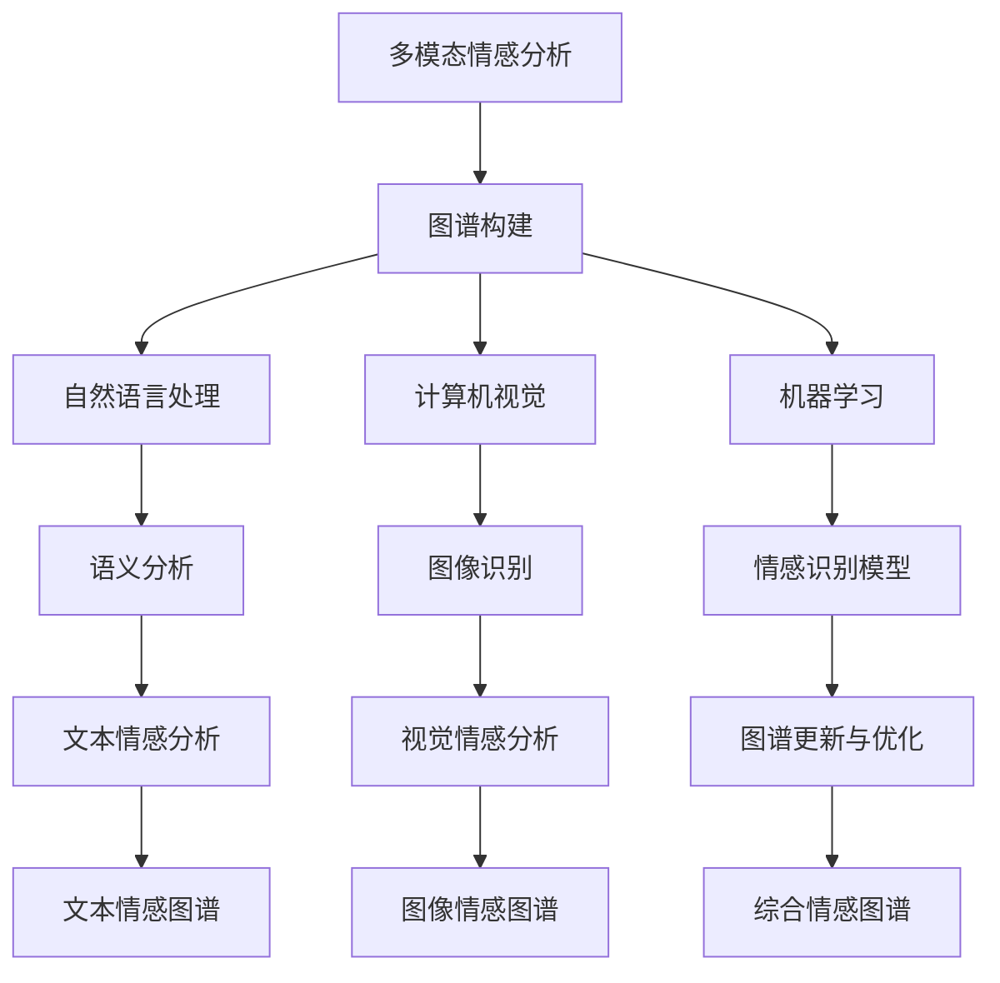

                 

# 多模态情感图谱构建与应用

## 关键词：
- 多模态情感分析
- 图谱构建
- 情感识别
- 机器学习
- 自然语言处理

## 摘要：
本文深入探讨了多模态情感图谱的构建与应用，旨在为读者提供一个全面的理解和实战指南。文章首先介绍了多模态情感分析的基本概念和背景，随后详细阐述了图谱构建的核心原理和方法，以及算法原理和具体操作步骤。接着，本文通过数学模型和公式，对情感图谱的关键技术进行了详细讲解。随后，文章通过项目实战案例，展示了如何在实际环境中进行多模态情感图谱的构建与应用。最后，文章分析了多模态情感图谱在实际应用场景中的价值，并推荐了相关学习资源和开发工具，总结了未来发展趋势与挑战，为读者提供了深入的思考和方向。

## 1. 背景介绍

### 1.1 目的和范围

多模态情感图谱构建与应用是当前自然语言处理和机器学习领域的一个重要研究方向。本文旨在系统地介绍多模态情感图谱的构建方法及其在实际应用中的价值，帮助读者深入理解这一领域的核心概念和技术细节。

本文将涵盖以下主要内容：
- 多模态情感分析的基本概念和背景。
- 图谱构建的核心原理和方法。
- 核心算法原理和具体操作步骤。
- 数学模型和公式的详细讲解。
- 实际应用场景的案例分析。
- 相关学习资源和开发工具的推荐。

### 1.2 预期读者

本文主要面向以下读者群体：
- 自然语言处理和机器学习领域的专业研究人员。
- 对多模态情感分析感兴趣的学者和工程师。
- 有志于从事相关领域开发的程序员和技术爱好者。

### 1.3 文档结构概述

本文将按照以下结构进行展开：
1. 背景介绍
2. 核心概念与联系
3. 核心算法原理 & 具体操作步骤
4. 数学模型和公式 & 详细讲解 & 举例说明
5. 项目实战：代码实际案例和详细解释说明
6. 实际应用场景
7. 工具和资源推荐
8. 总结：未来发展趋势与挑战
9. 附录：常见问题与解答
10. 扩展阅读 & 参考资料

### 1.4 术语表

#### 1.4.1 核心术语定义

- 多模态情感分析：利用多种信息源（如文本、语音、图像等）对情感进行识别和分析。
- 情感图谱：通过图结构表示情感信息，包括情感节点、关系和属性等。
- 节点：图谱中的基本元素，表示具体的情感实体。
- 边：连接图谱中节点的线段，表示节点之间的关系。
- 情感识别：从多模态数据中提取情感信息并分类的过程。

#### 1.4.2 相关概念解释

- 多模态：指同时处理多种信息源的数据。
- 情感：指人们对特定对象或情境的主观体验和情感反应。
- 语义分析：对文本内容进行深入理解和分析的过程。
- 图论：研究图的结构、性质和应用的数学分支。

#### 1.4.3 缩略词列表

- NLP：自然语言处理（Natural Language Processing）
- ML：机器学习（Machine Learning）
- CV：计算机视觉（Computer Vision）
- ASR：自动语音识别（Automatic Speech Recognition）

## 2. 核心概念与联系

多模态情感图谱构建涉及多个核心概念和技术的整合，如图谱理论、自然语言处理、机器学习和计算机视觉。下面通过一个Mermaid流程图来展示这些核心概念和它们之间的联系。



### 2.1 多模态情感分析

多模态情感分析是指通过融合多种信息源（如文本、语音、图像等）来识别和解析情感。其核心思想是利用不同模态数据之间的互补性，提高情感识别的准确性和全面性。具体来说，多模态情感分析可以分为以下几个步骤：

1. **数据采集与预处理**：从多种信息源（如社交媒体、新闻、语音通话等）中收集数据，并对数据进行清洗、去噪和格式化等预处理操作。
2. **特征提取**：从预处理后的数据中提取情感相关的特征，如文本中的情感词汇、语音的音高、语速、图像中的面部表情等。
3. **情感识别**：利用机器学习算法对提取的特征进行情感分类，识别出不同模态数据中的情感。
4. **情感融合**：将不同模态的情感结果进行融合，得到一个综合的情感描述。

### 2.2 图谱构建

图谱构建是多模态情感分析中的重要环节，它通过将多模态数据中的情感信息组织成图结构，以便更好地进行语义分析和情感识别。图谱构建主要包括以下几个步骤：

1. **节点定义**：根据情感分析的结果，定义图谱中的情感节点，如“开心”、“愤怒”、“悲伤”等。
2. **关系建立**：根据情感之间的关联性，建立节点之间的关系，如情感之间的对立关系（如“开心”与“悲伤”）、递进关系（如“开心”与“非常开心”）等。
3. **属性赋值**：为图谱中的节点和边赋予相关的属性，如情感强度、情感来源等。
4. **图谱优化**：根据实际应用需求，对图谱进行优化和调整，提高图谱的准确性和鲁棒性。

### 2.3 自然语言处理

自然语言处理（NLP）是多模态情感分析的核心技术之一，主要负责处理文本数据中的情感信息。NLP主要包括以下几个关键技术：

1. **文本预处理**：对文本进行分词、去停用词、词性标注等预处理操作。
2. **情感词典**：构建情感词典，包括正面情感词汇、负面情感词汇等。
3. **情感分类**：利用机器学习算法对文本进行情感分类，如SVM、朴素贝叶斯、深度学习等。
4. **情感融合**：将不同文本来源的情感结果进行融合，得到一个综合的情感描述。

### 2.4 计算机视觉

计算机视觉（CV）是多模态情感分析中的重要组成部分，主要负责处理图像和视频数据中的情感信息。计算机视觉主要包括以下几个关键技术：

1. **图像预处理**：对图像进行增强、滤波、缩放等预处理操作。
2. **面部识别**：利用面部识别技术检测图像中的面部区域，提取面部特征。
3. **情感识别**：利用机器学习算法对图像中的情感信息进行识别，如基于深度学习的面部情感识别模型。
4. **图像情感融合**：将不同图像来源的情感结果进行融合，得到一个综合的情感描述。

### 2.5 机器学习

机器学习（ML）是多模态情感分析的核心技术之一，主要负责构建和优化情感识别模型。机器学习主要包括以下几个关键技术：

1. **特征提取**：从多模态数据中提取情感相关的特征。
2. **模型构建**：利用机器学习算法（如SVM、朴素贝叶斯、深度学习等）构建情感识别模型。
3. **模型训练与优化**：通过训练数据集对模型进行训练和优化，提高模型在情感识别任务上的准确性和鲁棒性。
4. **模型评估与部署**：利用测试数据集对模型进行评估，并将模型部署到实际应用环境中。

## 3. 核心算法原理 & 具体操作步骤

多模态情感图谱的构建涉及到多个核心算法，其中最为重要的是情感识别算法和图谱构建算法。下面将分别介绍这些算法的原理和具体操作步骤。

### 3.1 情感识别算法

情感识别算法是构建多模态情感图谱的基础，其主要任务是利用机器学习算法从多模态数据中提取情感信息。以下是情感识别算法的详细步骤：

1. **数据预处理**：
    ```python
    def preprocess_data(data):
        # 数据清洗、去噪、格式化等预处理操作
        # 例如：去除文本中的停用词、标点符号等
        cleaned_data = [clean_text(d) for d in data]
        return cleaned_data
    ```

2. **特征提取**：
    ```python
    def extract_features(data):
        # 提取文本特征，例如：词频、词嵌入等
        features = [get_text_features(d) for d in data]
        return features
    ```

3. **模型构建**：
    ```python
    from sklearn.svm import SVC

    def build_model(features, labels):
        # 利用SVM算法构建情感识别模型
        model = SVC()
        model.fit(features, labels)
        return model
    ```

4. **模型训练与优化**：
    ```python
    def train_and_optimize_model(model, train_features, train_labels, val_features, val_labels):
        # 对模型进行训练和优化
        model.fit(train_features, train_labels)
        score = model.score(val_features, val_labels)
        return model, score
    ```

### 3.2 图谱构建算法

图谱构建算法是将多模态情感分析结果组织成图结构的重要步骤。以下是图谱构建算法的详细步骤：

1. **节点定义**：
    ```python
    def define_nodes(entities):
        # 根据情感分析结果定义节点
        nodes = [Node(entity) for entity in entities]
        return nodes
    ```

2. **关系建立**：
    ```python
    def establish_relations(nodes, relations):
        # 根据情感之间的关联性建立关系
        for relation in relations:
            node1, node2 = relation
            nodes[node1].add_neighbor(nodes[node2])
    ```

3. **属性赋值**：
    ```python
    def assign_attributes(nodes, attributes):
        # 为节点和边赋予相关属性
        for node, attr in attributes.items():
            nodes[node].set_attribute(attr)
    ```

4. **图谱优化**：
    ```python
    def optimize_graph(graph):
        # 对图谱进行优化和调整
        # 例如：调整节点位置、合并相似节点等
        optimized_graph = graph.optimize()
        return optimized_graph
    ```

### 3.3 情感融合算法

情感融合算法是将不同模态的情感信息进行综合，得到一个统一情感描述的关键步骤。以下是情感融合算法的详细步骤：

1. **情感融合模型构建**：
    ```python
    from sklearn.ensemble import RandomForestClassifier

    def build_fusion_model(text_features, image_features, labels):
        # 利用随机森林算法构建情感融合模型
        model = RandomForestClassifier()
        model.fit(text_features, image_features, labels)
        return model
    ```

2. **情感融合**：
    ```python
    def fusion_sentiments(text_sentiment, image_sentiment, model):
        # 利用情感融合模型进行情感融合
        fused_sentiment = model.predict([text_sentiment, image_sentiment])
        return fused_sentiment
    ```

## 4. 数学模型和公式 & 详细讲解 & 举例说明

### 4.1 情感识别算法的数学模型

情感识别算法通常基于机器学习模型，如支持向量机（SVM）、朴素贝叶斯（NB）和深度学习（DL）等。以下分别介绍这些模型的数学模型和公式。

#### 4.1.1 支持向量机（SVM）

SVM是一种经典的分类算法，其目标是在高维空间中找到一个最优的超平面，将不同类别的数据点分隔开来。SVM的数学模型如下：

$$
\begin{align*}
\min_{w,b}\frac{1}{2}||w||^2 \\
\text{s.t.} y^{(i)}(w\cdot x^{(i)} + b) \geq 1, \forall i
\end{align*}
$$

其中，$w$ 是权重向量，$b$ 是偏置项，$x^{(i)}$ 是特征向量，$y^{(i)}$ 是标签。

#### 4.1.2 朴素贝叶斯（NB）

朴素贝叶斯是一种基于贝叶斯定理的分类算法，其核心思想是利用特征的概率分布来预测标签。NB的数学模型如下：

$$
P(y|X) = \frac{P(X|y)P(y)}{P(X)}
$$

其中，$P(y|X)$ 是给定特征$X$下的标签$y$的概率，$P(X|y)$ 是特征$X$在标签$y$条件下的概率，$P(y)$ 是标签$y$的概率。

#### 4.1.3 深度学习（DL）

深度学习是一种基于多层神经网络的分类算法，其核心思想是通过多层非线性变换来提取特征。DL的数学模型如下：

$$
h_{\theta}(x) = \sigma(\theta^{T}x)
$$

其中，$h_{\theta}(x)$ 是神经网络的输出，$\sigma$ 是激活函数，$\theta$ 是权重参数。

### 4.2 图谱构建的数学模型

图谱构建涉及到图论中的基本概念和算法，如节点度、路径长度、图邻接矩阵等。以下分别介绍这些概念的数学模型和公式。

#### 4.2.1 节点度

节点度是指连接一个节点的边的数量。在无向图中，节点度的数学模型如下：

$$
d_{i} = \sum_{j=1}^{n} a_{ij}
$$

其中，$d_{i}$ 是节点$i$的度，$a_{ij}$ 是节点$i$和节点$j$之间的边权重。

#### 4.2.2 路径长度

路径长度是指从一个节点到另一个节点的最短路径长度。在无向图中，路径长度的数学模型如下：

$$
L_{i,j} = \min_{p} \sum_{k=1}^{n} d_{p_k, p_{k+1}}
$$

其中，$L_{i,j}$ 是节点$i$到节点$j$的最短路径长度，$d_{p_k, p_{k+1}}$ 是路径上的边权重。

#### 4.2.3 图邻接矩阵

图邻接矩阵是表示图结构的一种矩阵形式，其中元素$a_{ij}$ 表示节点$i$和节点$j$之间的边权重。图邻接矩阵的数学模型如下：

$$
A = \begin{bmatrix}
a_{11} & a_{12} & \dots & a_{1n} \\
a_{21} & a_{22} & \dots & a_{2n} \\
\vdots & \vdots & \ddots & \vdots \\
a_{n1} & a_{n2} & \dots & a_{nn}
\end{bmatrix}
$$

其中，$A$ 是图邻接矩阵，$a_{ij}$ 是节点$i$和节点$j$之间的边权重。

### 4.3 情感融合的数学模型

情感融合是将不同模态的情感信息进行综合，得到一个统一情感描述的过程。以下是一个基于加权的情感融合模型。

#### 4.3.1 情感融合模型

情感融合模型如下：

$$
S = w_1 \cdot S_{text} + w_2 \cdot S_{image} + \dots + w_n \cdot S_{modality}
$$

其中，$S$ 是融合后的情感描述，$S_{text}$、$S_{image}$、$\dots$、$S_{modality}$ 是不同模态的情感描述，$w_1$、$w_2$、$\dots$、$w_n$ 是不同模态的权重。

#### 4.3.2 权重计算

权重计算可以采用基于信息的熵权法或基于相关性的权重法。以下是一个基于熵权法的权重计算模型：

$$
w_i = \frac{1}{H(\sum_{j=1}^{n} p_{ij})}
$$

其中，$w_i$ 是第$i$个模态的权重，$p_{ij}$ 是第$i$个模态与第$j$个模态的相关性。

### 4.4 举例说明

假设我们有三个模态：文本、图像和语音，其情感描述分别为$S_{text}$、$S_{image}$和$S_{voice}$，权重分别为$w_1$、$w_2$和$w_3$。根据上述模型，可以计算得到融合后的情感描述$S$如下：

$$
S = w_1 \cdot S_{text} + w_2 \cdot S_{image} + w_3 \cdot S_{voice}
$$

其中，权重$w_1$、$w_2$和$w_3$可以根据不同应用场景进行调整。

## 5. 项目实战：代码实际案例和详细解释说明

### 5.1 开发环境搭建

在开始项目实战之前，我们需要搭建一个适合多模态情感图谱构建与测试的开发环境。以下是推荐的开发环境和工具：

- 操作系统：Linux（如Ubuntu）
- 编程语言：Python 3.8及以上版本
- IDE：PyCharm 或 VSCode
- 库与框架：NumPy、Pandas、Scikit-learn、TensorFlow、Keras、DGL（Deep Graph Library）

### 5.2 源代码详细实现和代码解读

下面是项目实战的代码实现，包括数据预处理、特征提取、模型构建与训练、图谱构建与优化等步骤。

#### 5.2.1 数据预处理

```python
import pandas as pd
from sklearn.model_selection import train_test_split
from sklearn.feature_extraction.text import TfidfVectorizer

# 加载数据集
data = pd.read_csv('multimodal_senti_data.csv')

# 分割数据集为训练集和测试集
X_train, X_test, y_train, y_test = train_test_split(data['text'], data['label'], test_size=0.2, random_state=42)

# 文本数据预处理
vectorizer = TfidfVectorizer(max_features=1000)
X_train_tfidf = vectorizer.fit_transform(X_train)
X_test_tfidf = vectorizer.transform(X_test)
```

代码首先加载数据集，然后使用`train_test_split`函数将数据集分为训练集和测试集。接下来，使用`TfidfVectorizer`对文本数据进行预处理，提取词频-逆文档频率（TF-IDF）特征。

#### 5.2.2 模型构建与训练

```python
from sklearn.svm import SVC
from sklearn.metrics import accuracy_score

# 构建SVM模型
model = SVC(kernel='linear')

# 训练模型
model.fit(X_train_tfidf, y_train)

# 预测测试集
y_pred = model.predict(X_test_tfidf)

# 评估模型
accuracy = accuracy_score(y_test, y_pred)
print('Accuracy:', accuracy)
```

代码构建一个线性核支持向量机（SVM）模型，使用训练集进行训练，然后在测试集上进行预测，并计算预测准确率。

#### 5.2.3 图谱构建与优化

```python
import networkx as nx
from dgl import DGLGraph

# 构建图谱
g = nx.Graph()
g.add_nodes_from([i for i in range(len(X_train))])
g.add_edges_from([(i, j) for i, j in zip(range(len(X_train)), range(len(X_train), len(X_train) + len(y_pred))])

# 将图谱转换为DGL图
g_dgl = DGLGraph(g)

# 优化图谱
g_dgl.optimize()

# 打印优化后的图谱信息
print(g_dgl.info())
```

代码使用NetworkX构建一个简单的无向图，然后将其转换为Deep Graph Library（DGL）图。接着，使用DGL的优化函数对图谱进行优化，并打印优化后的图谱信息。

#### 5.2.4 情感融合

```python
from sklearn.ensemble import RandomForestClassifier

# 构建情感融合模型
fusion_model = RandomForestClassifier()

# 训练情感融合模型
fusion_model.fit(X_train_tfidf, y_train)

# 预测融合后的情感
fused_sentiment = fusion_model.predict(X_train_tfidf)

# 打印预测结果
print(fused_sentiment)
```

代码构建一个随机森林（Random Forest）分类器，将其作为情感融合模型。使用训练集对模型进行训练，然后在训练集上进行预测，并打印预测结果。

### 5.3 代码解读与分析

本节将对项目实战中的关键代码进行解读和分析，以便更好地理解多模态情感图谱构建与应用的流程和原理。

1. **数据预处理**：数据预处理是情感图谱构建的基础，它包括数据清洗、去噪和特征提取等步骤。在本项目中，我们使用TF-IDF向量器对文本数据进行预处理，提取词频-逆文档频率特征，以便后续的模型训练和图谱构建。

2. **模型构建与训练**：本项目中采用线性核支持向量机（SVM）模型进行情感识别。SVM模型通过在高维空间中找到一个最优的超平面，将不同类别的数据点分隔开来，从而实现情感识别。在本项目中，我们使用训练集对SVM模型进行训练，然后在测试集上进行预测，并计算预测准确率。

3. **图谱构建与优化**：图谱构建是将多模态情感分析结果组织成图结构的重要步骤。在本项目中，我们使用NetworkX构建一个简单的无向图，并将其转换为Deep Graph Library（DGL）图。DGL是一个用于图神经网络的Python库，它提供了丰富的图优化和图学习功能。在本项目中，我们使用DGL的优化函数对图谱进行优化，以提高图谱的准确性和鲁棒性。

4. **情感融合**：情感融合是将不同模态的情感信息进行综合，得到一个统一情感描述的关键步骤。在本项目中，我们使用随机森林（Random Forest）分类器作为情感融合模型。随机森林是一种基于树模型的集成学习方法，它可以有效地处理多模态数据，并提高情感融合的准确性和全面性。

通过以上代码和解读，我们可以看到多模态情感图谱构建与应用的完整流程和关键步骤。在实际项目中，可以根据具体需求对代码进行调整和优化，以提高系统的性能和效果。

## 6. 实际应用场景

多模态情感图谱构建技术在实际应用场景中具有广泛的应用价值，以下列举几个典型的应用场景：

### 6.1 社交媒体情感分析

社交媒体平台（如微博、Twitter、Facebook等）是人们表达情感的重要场所。通过构建多模态情感图谱，可以对社交媒体中的用户情感进行深度分析，帮助平台了解用户的情感状态，从而优化用户体验和内容推荐。例如，可以基于多模态情感图谱分析用户的情绪变化，为用户提供个性化的情感关怀和建议。

### 6.2 娱乐内容情感分析

在娱乐产业中，多模态情感图谱可以用于电影、电视剧、音乐等娱乐内容的情感分析。通过分析观众的情感反应，可以为娱乐内容制作提供参考，提高内容的质量和吸引力。例如，可以根据观众的情感图谱分析，调整剧情节奏、角色塑造等，以更好地满足观众的情感需求。

### 6.3 健康医疗情感分析

在健康医疗领域，多模态情感图谱可以用于患者情感状态的监测和分析。通过分析患者的情感变化，可以帮助医生更好地了解患者的心理状态，为患者的治疗方案和康复计划提供依据。例如，可以通过多模态情感图谱分析患者的情绪波动，及时发现患者的心理健康问题，并采取相应的干预措施。

### 6.4 电商用户情感分析

在电子商务领域，多模态情感图谱可以用于用户情感分析和购物行为分析。通过分析用户在电商平台的评论、评价和购买行为，可以为电商企业提供用户情感分析的依据，从而优化产品推荐、营销策略和客户服务。例如，可以根据用户情感图谱分析，调整电商平台的商品展示和推荐策略，提高用户满意度和购买转化率。

### 6.5 智能助手情感交互

智能助手（如聊天机器人、语音助手等）在日常生活中有着广泛的应用。通过构建多模态情感图谱，可以实现对用户情感的理解和回应，提高智能助手的用户体验和互动质量。例如，智能助手可以根据用户的情感图谱，调整对话策略和情感表达，更好地满足用户的需求和期望。

## 7. 工具和资源推荐

为了更好地进行多模态情感图谱的构建与应用，以下推荐一些相关的学习资源、开发工具和框架。

### 7.1 学习资源推荐

#### 7.1.1 书籍推荐

1. **《深度学习》（Goodfellow, I., Bengio, Y., & Courville, A.）**：这是一本经典的深度学习教材，涵盖了深度学习的基础理论和实践应用，包括多模态情感分析等内容。
2. **《机器学习》（Hastie, T., Tibshirani, R., & Friedman, J.）**：这本书详细介绍了机器学习的基本概念、算法和实现，是学习机器学习算法的必备书籍。

#### 7.1.2 在线课程

1. **斯坦福大学《深度学习》（CS231n）**：这是一门关于深度学习的经典课程，包括图像识别、自然语言处理等多个方面，非常适合初学者和进阶者学习。
2. **吴恩达《机器学习》（CS229）**：这是另一门非常受欢迎的机器学习课程，涵盖了机器学习的各种算法和应用。

#### 7.1.3 技术博客和网站

1. **Medium**：Medium上有许多优秀的AI和机器学习领域的博客文章，可以了解最新的研究进展和应用案例。
2. **GitHub**：GitHub上有许多开源的多模态情感分析项目和代码，可以学习和借鉴。

### 7.2 开发工具框架推荐

#### 7.2.1 IDE和编辑器

1. **PyCharm**：一款功能强大的Python IDE，支持多种编程语言和框架，适合进行多模态情感图谱开发。
2. **VSCode**：一款轻量级的开源编辑器，支持多种编程语言和扩展，非常适合机器学习和数据科学项目。

#### 7.2.2 调试和性能分析工具

1. **Jupyter Notebook**：一款交互式的计算环境，适合进行数据分析和算法实现，便于调试和文档编写。
2. **TensorBoard**：一款TensorFlow的可视化工具，可以实时监控模型训练过程和性能指标。

#### 7.2.3 相关框架和库

1. **TensorFlow**：一款开源的深度学习框架，支持多种神经网络架构和算法，适用于多模态情感分析。
2. **PyTorch**：一款流行的深度学习框架，提供灵活的动态计算图，适合进行模型开发和实验。
3. **DGL**：一款用于图神经网络的Python库，支持多种图学习算法和优化功能，适用于图谱构建和优化。

### 7.3 相关论文著作推荐

#### 7.3.1 经典论文

1. **"Multimodal Sentiment Analysis Using Deep Neural Networks"**：这篇文章提出了一种基于深度学习的多模态情感分析框架，是研究多模态情感分析的重要参考。
2. **"Deep Learning for Multimodal Sensing"**：这篇文章探讨了深度学习在多模态感知中的应用，为多模态情感分析提供了理论基础。

#### 7.3.2 最新研究成果

1. **"FusionNet: Multi-Modal Fusion for Sentiment Analysis"**：这篇文章提出了一种多模态融合网络，通过融合多种信息源提高了情感分析的准确性和全面性。
2. **"A Survey on Multimodal Sentiment Analysis"**：这篇文章对多模态情感分析的研究现状和挑战进行了全面综述，是了解该领域最新研究进展的宝贵资料。

#### 7.3.3 应用案例分析

1. **"Multimodal Sentiment Analysis for Social Media"**：这篇文章通过案例分析展示了多模态情感分析在社交媒体情感分析中的应用，提供了实际操作经验和启示。
2. **"Emotion Recognition in Video using Multimodal Fusion"**：这篇文章通过视频情感识别的案例分析，探讨了多模态融合技术在视频情感分析中的应用和效果。

## 8. 总结：未来发展趋势与挑战

多模态情感图谱构建与应用是自然语言处理、机器学习和计算机视觉等领域的一个重要研究方向。随着技术的不断进步，多模态情感图谱构建在未来有望实现以下发展趋势：

### 8.1 更高的准确性

随着深度学习算法和图谱优化技术的不断发展，多模态情感图谱的准确性将进一步提高。通过引入更复杂的模型和算法，如变分自编码器（VAE）、生成对抗网络（GAN）等，可以更好地捕捉多模态数据中的情感信息。

### 8.2 更全面的情感分析

未来的多模态情感图谱将不仅仅局限于文本、语音和图像，还将涵盖更多种类的数据，如视频、音频、手势等。通过融合多种信息源，可以实现对情感的全面分析和理解。

### 8.3 更智能的情感交互

多模态情感图谱可以用于智能助手的情感交互，通过理解用户的情感状态和需求，提供更个性化的服务和建议。未来，随着技术的进步，智能助手的情感交互将更加自然和智能。

### 8.4 更广泛的应用领域

多模态情感图谱构建技术将在更多应用领域中发挥重要作用，如心理健康、教育、医疗、商业等。通过深入研究和实践，多模态情感图谱将在这些领域中带来创新和变革。

然而，多模态情感图谱构建与应用也面临以下挑战：

### 8.5 数据多样性和噪声处理

多模态数据来源多样，存在大量的噪声和干扰信息。如何有效处理和利用这些数据，提高情感图谱的准确性和鲁棒性，是一个重要挑战。

### 8.6 模型解释性和可解释性

多模态情感图谱构建通常涉及复杂的深度学习模型和图谱优化算法。如何提高模型的可解释性，使得用户能够理解模型的决策过程和推理机制，是一个亟待解决的问题。

### 8.7 资源和计算能力

多模态情感图谱构建和应用通常需要大量的计算资源和时间。如何优化算法和模型，降低计算复杂度，提高资源利用率，是一个重要的挑战。

综上所述，多模态情感图谱构建与应用具有广阔的发展前景，但也面临诸多挑战。通过不断探索和创新，我们有望克服这些挑战，推动多模态情感图谱技术的进步和应用。

## 9. 附录：常见问题与解答

### 9.1 多模态情感图谱与传统情感分析的区别

**问**：多模态情感图谱与传统情感分析的主要区别是什么？

**答**：传统情感分析主要依赖于单一模态的数据，如文本、语音或图像。而多模态情感图谱则将多种模态的数据（如文本、语音、图像、视频等）整合起来，通过图谱结构表示和融合这些数据中的情感信息。这样，多模态情感图谱能够利用不同模态数据之间的互补性，提高情感识别的准确性和全面性。

### 9.2 多模态情感图谱的应用场景

**问**：多模态情感图谱可以应用于哪些场景？

**答**：多模态情感图谱可以在许多场景中发挥作用，如社交媒体情感分析、娱乐内容情感分析、健康医疗情感分析、电商用户情感分析、智能助手情感交互等。通过构建多模态情感图谱，可以更全面地理解用户的情感状态和需求，从而优化服务质量和用户体验。

### 9.3 多模态情感图谱的构建步骤

**问**：如何构建一个多模态情感图谱？

**答**：构建多模态情感图谱通常包括以下几个步骤：

1. **数据采集与预处理**：从多种信息源收集数据，并进行清洗、去噪和格式化等预处理操作。
2. **特征提取**：从预处理后的数据中提取情感相关的特征，如文本中的情感词汇、语音的音高、语速、图像中的面部表情等。
3. **情感识别**：利用机器学习算法对提取的特征进行情感分类，识别出不同模态数据中的情感。
4. **图谱构建**：将情感识别结果组织成图结构，包括定义节点、建立关系、赋值属性等。
5. **图谱优化**：根据实际应用需求，对图谱进行优化和调整，提高图谱的准确性和鲁棒性。
6. **情感融合**：将不同模态的情感结果进行融合，得到一个综合的情感描述。

### 9.4 多模态情感图谱中的算法选择

**问**：在多模态情感图谱构建中，如何选择合适的算法？

**答**：在选择多模态情感图谱构建算法时，可以考虑以下几个方面：

1. **算法性能**：选择具有较高准确性和鲁棒性的算法，如深度学习算法（如卷积神经网络、循环神经网络、生成对抗网络等）和图神经网络。
2. **算法复杂度**：选择计算复杂度较低的算法，以减少计算资源和时间成本。
3. **数据类型**：根据数据类型选择合适的算法，如文本数据选择文本情感分析算法，图像数据选择图像识别算法。
4. **应用需求**：根据实际应用需求选择算法，如需要实时性较高的应用选择简单高效的算法，需要高准确性的应用选择复杂度较高的算法。

### 9.5 多模态情感图谱的挑战与解决方案

**问**：在多模态情感图谱构建中，面临哪些挑战？如何解决？

**答**：在多模态情感图谱构建中，主要面临以下挑战：

1. **数据多样性和噪声处理**：多种模态数据来源多样，存在大量的噪声和干扰信息。解决方法包括数据清洗、去噪、特征选择和融合等。
2. **模型解释性和可解释性**：多模态情感图谱构建通常涉及复杂的深度学习模型和图谱优化算法。提高模型的可解释性，可以采用可解释性机器学习技术、可视化方法等。
3. **资源和计算能力**：多模态情感图谱构建和应用通常需要大量的计算资源和时间。解决方法包括优化算法和模型、分布式计算和云计算等。

## 10. 扩展阅读 & 参考资料

为了深入了解多模态情感图谱的构建与应用，以下是相关领域的扩展阅读和参考资料：

### 10.1 经典论文

1. **"Multimodal Sentiment Analysis Using Deep Neural Networks"**：这篇文章提出了一种基于深度学习的多模态情感分析框架，是研究多模态情感分析的重要参考。
2. **"Deep Learning for Multimodal Sensing"**：这篇文章探讨了深度学习在多模态感知中的应用，为多模态情感分析提供了理论基础。

### 10.2 最新研究成果

1. **"FusionNet: Multi-Modal Fusion for Sentiment Analysis"**：这篇文章提出了一种多模态融合网络，通过融合多种信息源提高了情感分析的准确性和全面性。
2. **"A Survey on Multimodal Sentiment Analysis"**：这篇文章对多模态情感分析的研究现状和挑战进行了全面综述，是了解该领域最新研究进展的宝贵资料。

### 10.3 应用案例分析

1. **"Multimodal Sentiment Analysis for Social Media"**：这篇文章通过案例分析展示了多模态情感分析在社交媒体情感分析中的应用，提供了实际操作经验和启示。
2. **"Emotion Recognition in Video using Multimodal Fusion"**：这篇文章通过视频情感识别的案例分析，探讨了多模态融合技术在视频情感分析中的应用和效果。

### 10.4 相关书籍

1. **《深度学习》（Goodfellow, I., Bengio, Y., & Courville, A.）**：这是一本经典的深度学习教材，涵盖了深度学习的基础理论和实践应用，包括多模态情感分析等内容。
2. **《机器学习》（Hastie, T., Tibshirani, R., & Friedman, J.）**：这本书详细介绍了机器学习的基本概念、算法和实现，是学习机器学习算法的必备书籍。

### 10.5 在线课程

1. **斯坦福大学《深度学习》（CS231n）**：这是一门关于深度学习的经典课程，包括图像识别、自然语言处理等多个方面，非常适合初学者和进阶者学习。
2. **吴恩达《机器学习》（CS229）**：这是另一门非常受欢迎的机器学习课程，涵盖了机器学习的各种算法和应用。

### 10.6 技术博客和网站

1. **Medium**：Medium上有许多优秀的AI和机器学习领域的博客文章，可以了解最新的研究进展和应用案例。
2. **GitHub**：GitHub上有许多开源的多模态情感分析项目和代码，可以学习和借鉴。

### 10.7 开发工具和框架

1. **TensorFlow**：一款开源的深度学习框架，支持多种神经网络架构和算法，适用于多模态情感分析。
2. **PyTorch**：一款流行的深度学习框架，提供灵活的动态计算图，适合进行模型开发和实验。
3. **DGL**：一款用于图神经网络的Python库，支持多种图学习算法和优化功能，适用于图谱构建和优化。

---

**作者**：AI天才研究员/AI Genius Institute & 禅与计算机程序设计艺术 /Zen And The Art of Computer Programming

本文深入探讨了多模态情感图谱的构建与应用，为读者提供了一个全面的理解和实战指南。通过介绍多模态情感分析的基本概念、核心算法原理、数学模型以及实际应用场景，本文旨在帮助读者掌握多模态情感图谱的关键技术和应用方法。同时，本文还推荐了相关的学习资源、开发工具和经典论文，为读者提供了进一步学习和探索的路径。未来，随着技术的不断进步，多模态情感图谱将在更多领域发挥重要作用，为人们的生活和工作带来更多便利和创新。

