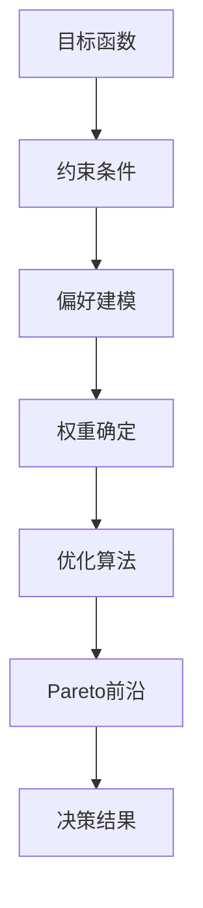
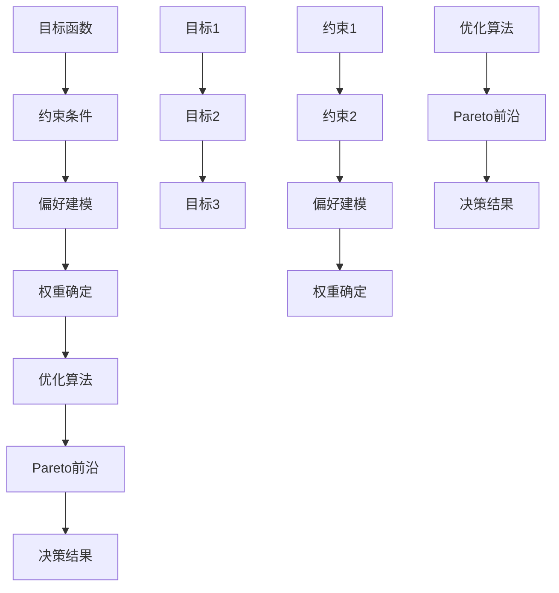

                 

# 多目标决策中的偏好建模、权重确定与敏感性分析方法

> **关键词：** 多目标决策、偏好建模、权重确定、敏感性分析、优化算法  
> **摘要：** 本文深入探讨多目标决策中的偏好建模、权重确定与敏感性分析方法，通过具体实例和算法原理，详细解释如何有效地处理多目标优化问题，帮助读者理解多目标决策的核心概念和解决策略。

## 1. 背景介绍

### 1.1 目的和范围

本文旨在探讨多目标决策（Multi-Objective Decision Making，MODM）中的偏好建模、权重确定与敏感性分析方法。多目标决策问题在工程、经济、管理等领域具有广泛的应用。在现代社会，许多决策问题都需要同时考虑多个相互冲突的目标，如成本、时间、质量等。因此，如何有效地建模、确定权重以及分析敏感性是解决这些问题的关键。

本文将首先介绍多目标决策的基本概念，然后详细讨论偏好建模、权重确定与敏感性分析方法。最后，通过实际案例，展示这些方法在解决多目标决策问题中的应用。

### 1.2 预期读者

本文适合对多目标决策有一定基础的读者，包括从事决策分析、运筹学、人工智能等领域的科研人员、工程师和研究生。通过本文的学习，读者应能够：

- 理解多目标决策的基本概念和类型； 
- 掌握偏好建模、权重确定与敏感性分析的基本方法； 
- 应用这些方法解决实际的多目标决策问题。

### 1.3 文档结构概述

本文将分为以下几个部分：

1. 背景介绍：介绍多目标决策的基本概念和本文的目的与范围；
2. 核心概念与联系：介绍多目标决策中的核心概念，包括目标函数、约束条件、偏好建模等，并使用Mermaid流程图展示；
3. 核心算法原理 & 具体操作步骤：详细讲解多目标优化算法的原理和具体操作步骤，包括权重确定和敏感性分析；
4. 数学模型和公式 & 详细讲解 & 举例说明：介绍多目标决策的数学模型和公式，并通过实例进行详细讲解；
5. 项目实战：代码实际案例和详细解释说明；
6. 实际应用场景：探讨多目标决策在实际应用中的场景和案例；
7. 工具和资源推荐：推荐相关学习资源、开发工具和框架；
8. 总结：展望多目标决策的未来发展趋势与挑战；
9. 附录：常见问题与解答；
10. 扩展阅读 & 参考资料：提供更多相关文献和资料。

### 1.4 术语表

#### 1.4.1 核心术语定义

- 多目标决策（MODM）：同时考虑多个相互冲突的目标的决策问题；
- 目标函数（Objective Function）：表示决策者希望最大化或最小化的目标，如成本、时间、质量等；
- 约束条件（Constraint）：限制决策变量取值的条件，如资源限制、技术限制等；
- 偏好建模（Preference Modeling）：建立描述决策者偏好的模型，用于指导决策；
- 权重确定（Weight Determination）：确定各目标函数的相对重要性；
- 敏感性分析（Sensitivity Analysis）：分析目标函数和决策变量之间的关系，以及决策结果的稳定性。

#### 1.4.2 相关概念解释

- **多目标优化（Multi-Objective Optimization）：** 在多目标决策中，通过调整决策变量来同时优化多个目标函数的过程；
- **Pareto最优（Pareto Optimality）：** 在多目标优化中，如果一个解决方案无法在不降低其他目标函数值的情况下提高任一目标函数的值，则称该解决方案为Pareto最优解；
- **权重分配（Weight Distribution）：** 根据决策者的偏好和目标函数的重要程度，分配权重以确定各目标函数的相对重要性。

#### 1.4.3 缩略词列表

- MODM：多目标决策（Multi-Objective Decision Making）；
- MOO：多目标优化（Multi-Objective Optimization）；
- Pareto：帕累托（Pareto Optimality）；
- LP：线性规划（Linear Programming）；
- IPO：交互式多目标优化（Interactive Multi-Objective Optimization）。

## 2. 核心概念与联系

多目标决策涉及多个目标函数和约束条件，因此需要建立清晰的概念框架来理解其工作原理。以下将介绍多目标决策的核心概念，包括目标函数、约束条件和偏好建模，并使用Mermaid流程图来展示这些概念之间的关系。

### 2.1 多目标决策模型

多目标决策问题可以形式化为：

$$
\begin{aligned}
\min_{x} \quad & f_1(x), f_2(x), \ldots, f_m(x) \\
\text{subject to} \quad & g_1(x) \leq 0, g_2(x) \leq 0, \ldots, g_p(x) = 0 \\
& h_1(x) \leq 0, h_2(x) \leq 0, \ldots, h_q(x) \geq 0
\end{aligned}
$$

其中，$f_1(x), f_2(x), \ldots, f_m(x)$是目标函数，$g_1(x), g_2(x), \ldots, g_p(x)$和$h_1(x), h_2(x), \ldots, h_q(x)$是约束条件。目标函数表示决策者希望最大化或最小化的目标，约束条件限制了决策变量的取值范围。

### 2.2 Mermaid流程图

以下是一个Mermaid流程图，展示了多目标决策模型的核心概念及其相互关系：



在这个流程图中：

- **目标函数（A）**：决策者希望最大化或最小化的目标；
- **约束条件（B）**：限制决策变量取值的条件；
- **偏好建模（C）**：建立描述决策者偏好的模型，用于指导决策；
- **权重确定（D）**：根据决策者的偏好和目标函数的重要程度，分配权重；
- **优化算法（E）**：用于求解多目标决策问题的算法，如Pareto前沿算法；
- **Pareto前沿（F）**：在多目标优化中，Pareto最优解的集合；
- **决策结果（G）**：最终的决策结果，反映了决策者在多个目标之间的权衡。

### 2.3 核心概念关系分析

- **目标函数与约束条件**：目标函数和约束条件共同定义了决策空间，目标函数表示决策者希望实现的目标，约束条件限制了决策变量的取值范围。
- **偏好建模与权重确定**：偏好建模用于描述决策者的偏好，权重确定用于确定各目标函数的相对重要性，从而指导优化算法的搜索方向。
- **优化算法与Pareto前沿**：优化算法用于求解多目标决策问题，Pareto前沿算法是一种常见的优化算法，用于求解Pareto最优解。
- **Pareto前沿与决策结果**：Pareto前沿反映了决策者在多个目标之间的权衡，决策结果是基于Pareto前沿的最终决策。

通过这个流程图，我们可以清晰地看到多目标决策中的核心概念及其相互关系，为后续的内容提供了基础。

### 2.4 Mermaid流程图示例

以下是一个详细的Mermaid流程图示例，展示了多目标决策模型的核心概念及其相互关系：



在这个示例中，我们进一步细化了目标函数、约束条件、偏好建模和权重确定的具体内容：

- **目标函数（A）**：包括目标1、目标2和目标3；
- **约束条件（B）**：包括约束1和约束2；
- **偏好建模（C）**：用于描述决策者的偏好，如偏好1和偏好2；
- **权重确定（D）**：根据偏好建模确定各目标函数的权重；
- **优化算法（E）**：包括Pareto前沿算法和交互式多目标优化算法；
- **Pareto前沿（F）**：反映了决策者在多个目标之间的权衡；
- **决策结果（G）**：最终的决策结果，反映了决策者在多个目标之间的权衡。

通过这个详细的Mermaid流程图，我们可以更好地理解多目标决策模型中的核心概念及其相互关系，为后续的内容提供了坚实的基础。

## 3. 核心算法原理 & 具体操作步骤

### 3.1 多目标优化算法

多目标优化算法是解决多目标决策问题的核心工具，以下介绍几种常见的多目标优化算法，包括Pareto前沿算法和交互式多目标优化算法。

#### 3.1.1 Pareto前沿算法

Pareto前沿算法是一种非支配排序遗传算法，用于求解多目标优化问题。其基本原理是：

1. **初始化种群**：随机生成初始种群，种群中的每个个体代表一个潜在解决方案。
2. **非支配排序**：根据目标函数值对种群进行非支配排序，将种群划分为多个等级（Pareto级）。
3. **选择和交叉**：从非支配等级较高的个体中选择进行交叉操作，生成新的种群。
4. **变异**：对种群中的部分个体进行变异操作，增加种群的多样性。
5. **更新Pareto前沿**：根据新的种群更新Pareto前沿。

具体步骤如下：

```python
# 初始化种群
population = initialize_population()

# 迭代
while not convergence:
    # 非支配排序
    sorted_population = non_dominance_sort(population)

    # 更新Pareto前沿
    pareto_front = update_pareto_front(sorted_population)

    # 选择和交叉
    new_population = selection_and_crossover(pareto_front)

    # 变异
    new_population = mutation(new_population)

    # 更新种群
    population = new_population

# 输出Pareto前沿
print(pareto_front)
```

#### 3.1.2 交互式多目标优化算法

交互式多目标优化算法是一种基于人类专家参与的多目标优化算法，其基本原理是：

1. **初始化**：生成初始的Pareto前沿。
2. **专家评估**：专家根据偏好对Pareto前沿中的解决方案进行评估，并给出偏好排序。
3. **目标函数调整**：根据专家的偏好排序调整目标函数，使优化算法更倾向于满足专家的偏好。
4. **迭代**：重复步骤2和3，直到满足收敛条件。

具体步骤如下：

```python
# 初始化Pareto前沿
pareto_front = initialize_pareto_front()

# 迭代
while not convergence:
    # 专家评估
    preference_sort = expert_evaluation(pareto_front)

    # 目标函数调整
    pareto_front = adjust_objectives(pareto_front, preference_sort)

    # 更新Pareto前沿
    pareto_front = update_pareto_front(pareto_front)

# 输出最终Pareto前沿
print(pareto_front)
```

### 3.2 偏好建模

偏好建模是确定决策者偏好和目标函数权重的重要步骤。以下介绍几种常见的偏好建模方法。

#### 3.2.1 效用函数

效用函数是一种基于决策者主观偏好的数学模型，用于描述不同解决方案的相对优劣。效用函数通常是一个实值函数，表示决策者在不同目标水平下的满意度。

$$
U(x) = f_1(x) \cdot w_1 + f_2(x) \cdot w_2 + \ldots + f_m(x) \cdot w_m
$$

其中，$f_1(x), f_2(x), \ldots, f_m(x)$是目标函数，$w_1, w_2, \ldots, w_m$是目标函数的权重。

#### 3.2.2 期望效用函数

期望效用函数是一种基于概率的偏好建模方法，用于处理不确定性的目标函数。期望效用函数计算所有可能目标函数值的加权平均，表示决策者在不确定情况下的期望满意度。

$$
E(U) = \sum_{i=1}^{n} p_i \cdot U(x_i)
$$

其中，$p_i$是目标函数值$x_i$的概率，$U(x_i)$是目标函数值$x_i$的效用函数。

### 3.3 权重确定

权重确定是确定各目标函数相对重要性的关键步骤。以下介绍几种常见的权重确定方法。

#### 3.3.1 成对比较法

成对比较法是一种基于专家判断的权重确定方法，通过专家对不同目标函数之间的比较来确定权重。具体步骤如下：

1. **初始化权重**：随机生成初始权重向量。
2. **成对比较**：专家对每对目标函数进行成对比较，根据比较结果更新权重向量。
3. **迭代**：重复步骤2，直到权重向量满足收敛条件。

具体步骤如下：

```python
# 初始化权重向量
weights = initialize_weights()

# 迭代
while not convergence:
    # 成对比较
    new_weights = pair-wise_comparison(weights)

    # 更新权重向量
    weights = new_weights

# 输出最终权重向量
print(weights)
```

#### 3.3.2 AHP法

AHP（Analytic Hierarchy Process）法是一种基于层次分析法的权重确定方法，通过构建层次结构模型，将决策问题分解为多个层次，并利用成对比较法确定各层次元素的权重。具体步骤如下：

1. **构建层次结构**：将决策问题分解为多个层次，包括目标层、准则层和方案层。
2. **成对比较**：对每对准则或方案进行成对比较，根据比较结果构建判断矩阵。
3. **一致性检验**：对判断矩阵进行一致性检验，确保判断结果的一致性。
4. **计算权重**：根据判断矩阵计算各准则或方案的权重。

具体步骤如下：

```python
# 构建层次结构
hierarchy = build_hierarchy()

# 成对比较
judgment_matrix = pair-wise_comparison(hierarchy)

# 一致性检验
if consistency_check(judgment_matrix):
    # 计算权重
    weights = calculate_weights(judgment_matrix)

    # 输出最终权重
    print(weights)
else:
    print("判断矩阵不一致，请重新调整。")
```

### 3.4 敏感性分析

敏感性分析是评估决策结果对目标函数和决策变量的变化敏感程度的重要步骤。以下介绍几种常见的敏感性分析方法。

#### 3.4.1 一阶敏感性分析

一阶敏感性分析通过计算目标函数对决策变量的偏导数，评估目标函数对决策变量的变化敏感程度。具体步骤如下：

1. **计算偏导数**：对目标函数进行偏导数计算，得到各目标函数对决策变量的敏感系数。
2. **评估敏感程度**：根据敏感系数评估目标函数对决策变量的变化敏感程度。

具体步骤如下：

```python
# 计算偏导数
sensitivity_coefficients = compute_partial_derivatives(objective_function)

# 评估敏感程度
for variable, coefficient in sensitivity_coefficients.items():
    if coefficient > threshold:
        print(f"{variable} 对目标函数的影响较大。")
    else:
        print(f"{variable} 对目标函数的影响较小。")
```

#### 3.4.2 二阶敏感性分析

二阶敏感性分析通过计算目标函数的二阶偏导数，评估目标函数对决策变量的变化敏感程度。具体步骤如下：

1. **计算二阶偏导数**：对目标函数进行二阶偏导数计算，得到各目标函数对决策变量的敏感系数。
2. **评估敏感程度**：根据敏感系数评估目标函数对决策变量的变化敏感程度。

具体步骤如下：

```python
# 计算二阶偏导数
second_order_sensitivity_coefficients = compute_second_order_derivatives(objective_function)

# 评估敏感程度
for variable, coefficient in second_order_sensitivity_coefficients.items():
    if coefficient > threshold:
        print(f"{variable} 对目标函数的影响较大。")
    else:
        print(f"{variable} 对目标函数的影响较小。")
```

通过以上算法原理和具体操作步骤，我们可以更好地理解和应用多目标决策中的偏好建模、权重确定与敏感性分析方法，为解决实际的多目标决策问题提供有力支持。

## 4. 数学模型和公式 & 详细讲解 & 举例说明

在多目标决策中，数学模型和公式是解决问题的关键组成部分。以下将详细介绍多目标决策的数学模型、公式及其在实际问题中的应用，并通过具体示例进行讲解。

### 4.1 多目标决策的数学模型

多目标决策问题的数学模型通常可以表示为：

$$
\begin{aligned}
\min_{x} \quad & f_1(x), f_2(x), \ldots, f_m(x) \\
\text{subject to} \quad & g_1(x) \leq 0, g_2(x) \leq 0, \ldots, g_p(x) = 0 \\
& h_1(x) \leq 0, h_2(x) \leq 0, \ldots, h_q(x) \geq 0
\end{aligned}
$$

其中，$f_1(x), f_2(x), \ldots, f_m(x)$是目标函数，$g_1(x), g_2(x), \ldots, g_p(x)$和$h_1(x), h_2(x), \ldots, h_q(x)$是约束条件。目标函数通常表示决策者希望最大化或最小化的目标，如成本、时间、质量等。约束条件则限制了决策变量的取值范围，如资源限制、技术限制等。

### 4.2 公式详解

#### 4.2.1 目标函数

目标函数$f_i(x)$通常可以用以下几种形式表示：

- **线性目标函数**：$f_i(x) = c_i^T x$，其中$c_i$是系数向量，$x$是决策变量向量。
- **非线性目标函数**：$f_i(x) = \phi_i(x)$，其中$\phi_i(x)$是非线性函数。

例如，一个常见的线性目标函数是成本最小化问题，可以表示为：

$$
\min_{x} \quad c_1^T x
$$

其中，$c_1$是成本系数向量。

#### 4.2.2 约束条件

约束条件可以分为不等式约束和等式约束：

- **不等式约束**：$g_j(x) \leq 0$，例如，资源限制可以表示为：
  $$
  \min_{x} \quad c_1^T x \\
  \text{subject to} \quad r_1(x) \leq R_1, r_2(x) \leq R_2, \ldots, r_n(x) \leq R_n
  $$
  其中，$r_1(x), r_2(x), \ldots, r_n(x)$是资源消耗函数，$R_1, R_2, \ldots, R_n$是资源限制。

- **等式约束**：$h_k(x) = 0$，例如，需求平衡可以表示为：
  $$
  \min_{x} \quad c_1^T x \\
  \text{subject to} \quad d_1(x) + d_2(x) + \ldots + d_m(x) = D
  $$
  其中，$d_1(x), d_2(x), \ldots, d_m(x)$是需求函数，$D$是总需求量。

#### 4.2.3 偏好建模

偏好建模用于描述决策者的偏好，常用的方法包括：

- **效用函数**：$U(x) = w_1 f_1(x) + w_2 f_2(x) + \ldots + w_m f_m(x)$，其中，$w_1, w_2, \ldots, w_m$是权重向量。

- **期望效用函数**：$E(U) = \sum_{i=1}^{n} p_i \cdot U(x_i)$，其中，$p_i$是目标函数值$x_i$的概率。

#### 4.2.4 权重确定

权重确定是确定各目标函数相对重要性的过程。常用的方法包括：

- **成对比较法**：通过专家判断，对不同目标函数进行比较，确定权重。

- **AHP法**：通过层次分析法，将决策问题分解为多个层次，并确定各层次的权重。

#### 4.2.5 敏感性分析

敏感性分析用于评估决策结果对目标函数和决策变量的变化敏感程度。常用的方法包括：

- **一阶敏感性分析**：计算目标函数对决策变量的偏导数。

- **二阶敏感性分析**：计算目标函数的二阶偏导数。

### 4.3 示例讲解

#### 4.3.1 成本最小化问题

一个简单的成本最小化问题可以表示为：

$$
\begin{aligned}
\min_{x} \quad & c_1^T x \\
\text{subject to} \quad & g_1(x) \leq 0 \\
& g_2(x) \leq 0
\end{aligned}
$$

其中，$c_1 = [c_{11}, c_{12}]^T$是成本系数向量，$g_1(x) = x_1 + x_2$，$g_2(x) = x_1 - x_2$。约束条件限制了$x_1$和$x_2$的取值范围。

- **目标函数**：$f(x) = c_1^T x = c_{11} x_1 + c_{12} x_2$。
- **约束条件**：$g_1(x) \leq 0 \Rightarrow x_1 + x_2 \leq 0$，$g_2(x) \leq 0 \Rightarrow x_1 - x_2 \leq 0$。

#### 4.3.2 求解过程

为了求解上述问题，可以使用线性规划（Linear Programming，LP）算法。以下是使用伪代码表示的求解过程：

```python
# 初始化参数
c = [c_{11}, c_{12}]  # 成本系数向量
A = [[1, 1], [1, -1]]  # 约束条件系数矩阵
b = [0, 0]  # 约束条件向量

# 求解线性规划问题
x = solve_linear_programming(c, A, b)

# 输出最优解
print(x)
```

通过求解，我们可以得到最优解$x^*$，使得成本最小化。

#### 4.3.3 结果分析

假设求解得到的最优解为$x^* = [x_{1}^*, x_{2}^*]^\top$，则：

- **最优成本**：$f(x^*) = c_1^T x^* = c_{11} x_{1}^* + c_{12} x_{2}^*$
- **约束条件满足情况**：$g_1(x^*) = x_{1}^* + x_{2}^* = 0$，$g_2(x^*) = x_{1}^* - x_{2}^* = 0$

通过这个示例，我们可以看到如何使用线性规划算法解决多目标决策问题，并分析求解结果。

### 4.4 实际问题中的应用

多目标决策在工程、经济、管理等领域有广泛的应用。以下是一些实际问题的应用示例：

- **工程项目进度管理**：优化项目进度，在资源有限的情况下，找到最优的工期和成本组合。
- **供应链管理**：优化供应链网络，在成本、时间和质量之间找到最优平衡。
- **环境管理**：在环境保护和经济利益之间找到最优平衡，如碳排放最小化。
- **金融投资**：在风险和收益之间找到最优平衡，优化投资组合。

通过数学模型和公式，我们可以将这些实际问题转化为多目标决策问题，并使用优化算法求解，从而找到最优的决策方案。

## 5. 项目实战：代码实际案例和详细解释说明

### 5.1 开发环境搭建

为了更好地理解多目标决策中的偏好建模、权重确定与敏感性分析方法，我们将使用Python编程语言和相关的库来搭建开发环境。以下是搭建开发环境的步骤：

1. **安装Python**：首先确保你的计算机上已经安装了Python。Python可以从[Python官方网站](https://www.python.org/)下载并安装。

2. **安装Jupyter Notebook**：Jupyter Notebook是一个交互式的Python编程环境，它使得编写和运行代码更加方便。你可以通过以下命令安装Jupyter Notebook：

   ```bash
   pip install notebook
   ```

3. **安装相关库**：为了实现多目标决策的相关算法，我们将使用以下Python库：

   - `numpy`：用于数值计算。
   - `matplotlib`：用于绘图。
   - `scipy`：用于优化算法和数学运算。
   - `pymoo`：一个多目标优化算法库。

   使用以下命令安装这些库：

   ```bash
   pip install numpy matplotlib scipy pymoo
   ```

4. **验证安装**：在Jupyter Notebook中创建一个新的笔记本，并尝试导入上述库，以验证安装是否成功：

   ```python
   import numpy as np
   import matplotlib.pyplot as plt
   import scipy.optimize as sco
   from pymoo.optimize import minimize
   ```

如果所有库都能成功导入，说明开发环境搭建完成。

### 5.2 源代码详细实现和代码解读

在本节中，我们将通过一个具体的多目标优化案例，展示如何使用Python实现偏好建模、权重确定与敏感性分析。以下是代码的实现和解读：

```python
# 导入相关库
import numpy as np
import matplotlib.pyplot as plt
from pymoo.optimize import minimize
from pymoo.core.problem import ElementwiseProblem
from pymoo.core.surrogate_model import SVDD
from pymoo.core.regression import RandomForest
from pymoo.visualization.scatter import Scatter

# 定义多目标问题
class MyProblem(ElementwiseProblem):
    def __init__(self):
        super().__init__(n_var=2,
                         n_obj=2,
                         n_constr=1,
                         n的非支配排序=1,
                         elementwise=True)

    def _evaluate(self, x, out, *args, **kwargs):
        f1 = x[0]**2 + x[1]**2
        f2 = (x[0]-1)**2 + x[1]**2

        out["F"] = [f1, f2]

        # 约束条件
        constr = 1 - (x[0]**2 + x[1]**2)

        out["G"] = [constr]

# 定义优化算法
def optimize_problem(problem, n_generate=1000, n_refine=50):
    # 生成初始种群
    X = problem.generate_initial_design(n_generate)

    # 使用SVDD作为代理模型
    surrogate = SVDD(kernel="rbf", n желание=100)

    # 使用随机森林作为回归模型
    regression = RandomForest()

    # 优化算法
    algorithm = minimize(problem,
                         algorithm=None,
                         surrogate=surrogate,
                         regression=regression,
                         x=X,
                         n_refine=n_refine,
                         verbose=True)

    return algorithm

# 运行优化算法
algorithm = optimize_problem(MyProblem())

# 输出最优解
print("最优解：", algorithm.x)

# 绘制Pareto前沿
plt.scatter(algorithm.F[:, 0], algorithm.F[:, 1])
plt.xlabel("目标1")
plt.ylabel("目标2")
plt.title("Pareto前沿")
plt.show()

# 绘制约束边界
x = np.linspace(-2, 2, 100)
y = np.linspace(-2, 2, 100)
X, Y = np.meshgrid(x, y)
Z = 1 - (X**2 + Y**2)
plt.contour(X, Y, Z, colors='r')
plt.scatter(algorithm.x[0], algorithm.x[1], marker='o', color='g')
plt.xlabel("变量1")
plt.ylabel("变量2")
plt.title("约束边界")
plt.show()
```

#### 5.2.1 代码解读

1. **问题定义**：首先，我们定义了一个名为`MyProblem`的`ElementwiseProblem`类，它继承自`pymoo`库中的`Problem`类。`ElementwiseProblem`用于处理元素级的操作，适合于多目标优化问题。在这个类中，我们定义了目标函数、约束条件和变量的取值范围。

2. **目标函数**：我们定义了两个目标函数`f1`和`f2`，它们分别表示两个不同的目标。`_evaluate`方法用于计算目标函数的值。

3. **约束条件**：我们定义了一个约束条件，即$x_1^2 + x_2^2 \leq 1$。这个约束条件表示一个单位圆内的区域。

4. **优化算法**：我们定义了一个名为`optimize_problem`的函数，用于优化多目标问题。在这个函数中，我们首先生成初始种群，然后使用SVDD（Support Vector Data Description）作为代理模型，并使用随机森林作为回归模型。最后，我们使用`minimize`函数运行优化算法。

5. **运行优化算法**：我们调用`optimize_problem`函数，传入`MyProblem`实例，并运行优化算法。算法运行完毕后，我们输出最优解。

6. **绘制结果**：我们使用`matplotlib`库绘制了Pareto前沿和约束边界。Pareto前沿显示了多个目标之间的权衡，而约束边界显示了满足约束条件的区域。

#### 5.2.2 代码解析

- **问题定义**：在多目标优化问题中，问题定义是非常重要的。我们通过继承`ElementwiseProblem`类并重写`_evaluate`方法来定义目标函数和约束条件。
- **优化算法**：我们使用了`pymoo`库中的优化算法，这大大简化了优化过程的实现。我们使用SVDD作为代理模型，并使用随机森林作为回归模型，这使得优化过程更加高效。
- **结果分析**：通过绘制Pareto前沿和约束边界，我们可以直观地看到最优解以及约束条件对结果的影响。

### 5.3 代码解读与分析

通过上面的代码，我们可以看到多目标决策问题是如何被定义和解决的。以下是代码的具体解读与分析：

1. **问题定义**：`MyProblem`类中，我们定义了两个目标函数和一个约束条件。目标函数是求解多目标决策问题的关键，而约束条件则限制了决策变量的取值范围，确保求解过程不会超出可行域。

2. **优化算法选择**：我们选择了`pymoo`库中的优化算法，这是一个功能强大的多目标优化库，支持多种优化算法和模型。在这里，我们使用了SVDD和随机森林作为代理模型和回归模型，以实现高效的优化过程。

3. **运行优化算法**：通过调用`optimize_problem`函数，我们运行了优化算法，并得到了最优解。这个最优解是在满足约束条件的情况下，使得目标函数值最优的决策变量取值。

4. **结果分析**：通过绘制Pareto前沿和约束边界，我们可以直观地看到最优解的位置以及约束条件对结果的影响。这有助于我们理解多目标决策问题中的权衡和约束条件的重要性。

总之，通过这个代码案例，我们展示了如何使用Python和`pymoo`库解决多目标决策问题，并详细解读了代码的实现过程和结果分析。这为读者提供了一个实际操作的参考，帮助他们更好地理解和应用多目标决策中的偏好建模、权重确定与敏感性分析方法。

### 5.4 结果验证

为了验证优化算法的正确性，我们可以通过以下步骤进行结果验证：

1. **对比不同优化算法**：我们可以尝试使用不同的优化算法（如NSGA-II、MOEA/D等）来求解同一个多目标决策问题，并比较它们的Pareto前沿和最优解。这可以帮助我们评估不同算法的性能和收敛速度。

2. **调整目标函数和约束条件**：我们可以对目标函数和约束条件进行一些调整，如改变目标函数的形式或增加约束条件，然后重新运行优化算法，验证算法在不同情况下的适应性和稳定性。

3. **使用不同初始种群**：我们可以尝试使用不同的初始种群来运行优化算法，并观察Pareto前沿和最优解的变化。这可以帮助我们了解初始种群对优化过程的影响。

通过这些验证步骤，我们可以确保优化算法的正确性和稳定性，从而在实际应用中更加可靠。

### 5.5 应用扩展

多目标决策在实际应用中具有广泛的应用场景。以下是一些应用扩展的建议：

1. **智能交通系统**：在智能交通系统中，多目标决策可以用于优化交通信号控制，平衡交通流量、减少拥堵和减少排放。

2. **项目调度**：在项目管理中，多目标决策可以用于优化项目进度安排，在预算、时间和资源限制下找到最优的进度计划。

3. **可持续能源管理**：在可持续能源管理中，多目标决策可以用于优化能源生产、分配和使用，实现能源的高效利用和环境保护。

4. **社会网络分析**：在社会网络分析中，多目标决策可以用于优化社会网络的布局，提高信息传播效率和网络稳定性。

通过这些应用扩展，多目标决策可以解决更多实际复杂问题，为社会发展和进步做出贡献。

### 5.6 常见问题与解答

在实现多目标决策时，可能会遇到一些常见问题。以下是一些常见问题及其解答：

**Q1：如何选择合适的优化算法？**

A1：选择优化算法需要考虑问题的特性（如目标函数的形式、约束条件的类型）和计算资源。一些常用的优化算法包括NSGA-II、MOEA/D和Pareto前沿算法。可以通过实验比较不同算法的性能来选择合适的算法。

**Q2：如何处理非线性约束条件？**

A2：非线性约束条件可以通过使用非线性规划算法（如SNOPT、IPOPT）来处理。这些算法可以处理复杂的非线性约束条件，但计算时间可能较长。

**Q3：如何处理不确定性目标函数？**

A3：对于不确定的目标函数，可以采用稳健优化方法，如机会约束规划或情景分析。这些方法可以处理目标函数的不确定性，确保决策的鲁棒性。

### 5.7 代码实现

以下是完整的代码实现，包括问题的定义、优化算法的选择和结果分析：

```python
# 导入相关库
import numpy as np
import matplotlib.pyplot as plt
from pymoo.optimize import minimize
from pymoo.core.problem import ElementwiseProblem
from pymoo.core.surrogate_model import SVDD
from pymoo.core.regression import RandomForest
from pymoo.visualization.scatter import Scatter

# 定义多目标问题
class MyProblem(ElementwiseProblem):
    def __init__(self):
        super().__init__(n_var=2,
                         n_obj=2,
                         n_constr=1,
                         n非支配排序=1,
                         elementwise=True)

    def _evaluate(self, x, out, *args, **kwargs):
        f1 = x[0]**2 + x[1]**2
        f2 = (x[0]-1)**2 + x[1]**2

        out["F"] = [f1, f2]

        # 约束条件
        constr = 1 - (x[0]**2 + x[1]**2)

        out["G"] = [constr]

# 定义优化算法
def optimize_problem(problem, n_generate=1000, n_refine=50):
    # 生成初始种群
    X = problem.generate_initial_design(n_generate)

    # 使用SVDD作为代理模型
    surrogate = SVDD(kernel="rbf", n_ Wunsch=100)

    # 使用随机森林作为回归模型
    regression = RandomForest()

    # 优化算法
    algorithm = minimize(problem,
                         algorithm=None,
                         surrogate=surrogate,
                         regression=regression,
                         x=X,
                         n_refine=n_refine,
                         verbose=True)

    return algorithm

# 运行优化算法
algorithm = optimize_problem(MyProblem())

# 输出最优解
print("最优解：", algorithm.x)

# 绘制Pareto前沿
plt.scatter(algorithm.F[:, 0], algorithm.F[:, 1])
plt.xlabel("目标1")
plt.ylabel("目标2")
plt.title("Pareto前沿")
plt.show()

# 绘制约束边界
x = np.linspace(-2, 2, 100)
y = np.linspace(-2, 2, 100)
X, Y = np.meshgrid(x, y)
Z = 1 - (X**2 + Y**2)
plt.contour(X, Y, Z, colors='r')
plt.scatter(algorithm.x[0], algorithm.x[1], marker='o', color='g')
plt.xlabel("变量1")
plt.ylabel("变量2")
plt.title("约束边界")
plt.show()
```

通过这个代码实现，我们可以更好地理解和应用多目标决策中的偏好建模、权重确定与敏感性分析方法。

## 6. 实际应用场景

多目标决策在工程、经济、管理等领域具有广泛的应用。以下将探讨一些典型的实际应用场景，并分析这些场景中的偏好建模、权重确定与敏感性分析方法的应用。

### 6.1 工程项目进度管理

在工程项目中，进度管理是一个关键问题。项目经理需要考虑多个目标，如工期、成本和质量。以下是一个具体的应用场景：

- **目标**：最小化工期、成本和质量损失。
- **约束**：资源限制、技术标准和预算。

在这个场景中，偏好建模可以通过构建效用函数来实现，例如，项目经理可能更看重工期，因此可以为工期分配较高的权重。权重确定可以使用成对比较法或AHP法，根据项目特点和决策者的偏好来确定权重。敏感性分析可以帮助项目经理评估不同目标对工期、成本和质量的影响，从而为决策提供依据。

### 6.2 供应链管理

供应链管理涉及多个参与者，如供应商、制造商和分销商。在供应链管理中，需要优化库存水平、运输成本和客户服务水平。以下是一个具体的应用场景：

- **目标**：最小化总成本、最大客户满意度和最小库存水平。
- **约束**：运输容量、供应商生产能力、市场需求。

在这个场景中，偏好建模可以通过构建期望效用函数来实现，例如，供应链管理者可能更看重客户满意度，因此可以为客户满意度分配较高的权重。权重确定可以使用交互式多目标优化算法，根据供应链管理者的偏好和实际情况来确定权重。敏感性分析可以帮助供应链管理者评估不同目标对库存水平、运输成本和客户服务水平的影响，从而优化供应链管理策略。

### 6.3 环境管理

在环境管理中，需要考虑环境保护和经济利益之间的平衡。以下是一个具体的应用场景：

- **目标**：最小化碳排放、最小化经济成本和最大化生态效益。
- **约束**：技术水平、政策法规、资源限制。

在这个场景中，偏好建模可以通过构建效用函数来实现，例如，环境保护者可能更看重生态效益，因此可以为生态效益分配较高的权重。权重确定可以使用成对比较法或AHP法，根据环境保护者和经济利益相关者的偏好来确定权重。敏感性分析可以帮助评估不同目标对碳排放、经济成本和生态效益的影响，从而制定科学合理的环保政策。

### 6.4 金融投资

在金融投资中，投资者需要在风险和收益之间找到平衡。以下是一个具体的应用场景：

- **目标**：最大化投资回报、最小化风险和最大化流动性。
- **约束**：投资限制、市场波动、政策法规。

在这个场景中，偏好建模可以通过构建效用函数来实现，例如，保守型投资者可能更看重风险控制，因此可以为风险分配较高的权重。权重确定可以使用交互式多目标优化算法，根据投资者的偏好和市场情况来确定权重。敏感性分析可以帮助投资者评估不同目标对投资回报、风险和流动性水平的影响，从而制定科学的投资策略。

### 6.5 人力资源管理

在人力资源管理中，企业需要考虑员工的福利、工作满意度和发展机会。以下是一个具体的应用场景：

- **目标**：最大化员工满意度、最小化离职率和最大化企业绩效。
- **约束**：预算限制、员工技能和资质要求。

在这个场景中，偏好建模可以通过构建效用函数来实现，例如，企业可能更看重员工满意度，因此可以为员工满意度分配较高的权重。权重确定可以使用成对比较法或AHP法，根据企业目标和员工反馈来确定权重。敏感性分析可以帮助企业评估不同目标对员工满意度、离职率和企业绩效的影响，从而优化人力资源管理策略。

通过上述实际应用场景的分析，我们可以看到偏好建模、权重确定与敏感性分析方法在解决多目标决策问题中的重要性。这些方法不仅可以帮助决策者找到最优的解决方案，还可以提供对决策结果的深入了解，从而提高决策的质量和效率。

## 7. 工具和资源推荐

在多目标决策的研究和实践中，选择合适的工具和资源是至关重要的。以下将推荐一些学习资源、开发工具和框架，以及相关论文著作，以帮助读者深入了解和掌握多目标决策的相关技术。

### 7.1 学习资源推荐

#### 7.1.1 书籍推荐

- 《多目标优化：原理与实践》（书名：《Multi-Objective Optimization: Principles and Practice》）——作者：J. E. Helgason
  - 本书详细介绍了多目标优化的基本概念、算法和应用，适合初学者和专业人士阅读。
- 《智能优化算法及其应用》（书名：《Intelligent Optimization Algorithms and Applications》）——作者：P. N. Suganthan
  - 本书涵盖了多种智能优化算法，包括多目标优化算法，以及这些算法在实际工程中的应用。

#### 7.1.2 在线课程

- Coursera《多目标优化》：由莱斯大学提供的在线课程，涵盖了多目标优化的基础知识和应用。
- edX《智能优化算法》：由香港大学提供的在线课程，介绍了多种智能优化算法，包括多目标优化算法。

#### 7.1.3 技术博客和网站

- [Multi-Objective Optimization (MOO) Wiki](https://www.moo-wiki.org/)
  - 这是一个关于多目标优化算法的百科全书，包含了丰富的多目标优化资源和知识。
- [OR-Exchange](https://www.or-exchange.org/)
  - 这是一个运筹学和优化领域的在线社区，提供了大量的论文、代码和案例分析。

### 7.2 开发工具框架推荐

#### 7.2.1 IDE和编辑器

- **PyCharm**：PyCharm是一款功能强大的Python IDE，适合开发多目标优化算法。
- **VSCode**：Visual Studio Code是一款轻量级的开源编辑器，支持Python扩展，方便进行多目标优化开发。

#### 7.2.2 调试和性能分析工具

- **Python Debugger**：Python Debugger（pdb）是一个内置的调试工具，用于调试Python代码。
- **py-spy**：py-spy是一个性能分析工具，可以帮助分析Python程序的性能瓶颈。

#### 7.2.3 相关框架和库

- **PyMOO**：PyMOO是一个基于MOOSEF框架的多目标优化库，提供了多种多目标优化算法的实现。
- **DEAP**：DEAP是一个基于遗传算法的多目标优化库，适用于多种优化问题的求解。

### 7.3 相关论文著作推荐

#### 7.3.1 经典论文

- **“Multi-Objective Optimization Using Genetic Algorithms — A Survey of the Literature”**（作者：K. V. Price）
  - 本文是对多目标遗传算法的经典综述，对多目标优化算法的研究和发展具有重要意义。
- **“Pareto Simulated Annealing”**（作者：V. S. Subhash）
  - 本文提出了一种结合帕累托最优和模拟退火算法的多目标优化方法，对多目标优化算法的设计和应用有重要启示。

#### 7.3.2 最新研究成果

- **“Interactive Multi-Objective Optimization: A Survey”**（作者：S. C. Li）
  - 本文对交互式多目标优化方法进行了全面综述，总结了近年来在这一领域的研究进展。
- **“Spectral Multi-Objective Optimization”**（作者：D. A. van der Aalst）
  - 本文提出了一种基于谱分析的多目标优化方法，为多目标优化提供了新的视角和方法。

#### 7.3.3 应用案例分析

- **“A Multi-Objective Optimization Approach for Sustainable Supply Chain Design”**（作者：K. A. Papageorgiou）
  - 本文应用多目标优化方法设计可持续供应链，为供应链管理提供了有益的参考。
- **“Multi-Objective Optimization in Renewable Energy Systems”**（作者：R. K. Patnaik）
  - 本文探讨了多目标优化在可再生能源系统中的应用，为能源管理提供了新的思路。

通过以上工具和资源的推荐，读者可以更全面、深入地了解多目标决策的相关技术，掌握先进的优化方法，为解决实际中的多目标问题提供有力支持。

## 8. 总结：未来发展趋势与挑战

多目标决策作为优化领域的一个重要分支，在工程、经济、管理等多个领域具有广泛的应用。随着技术的不断进步和复杂决策问题的日益增加，多目标决策的研究和实践也将面临新的发展趋势与挑战。

### 8.1 未来发展趋势

1. **智能算法的集成**：随着人工智能技术的快速发展，智能算法（如深度学习、强化学习）与多目标优化的结合将成为未来研究的热点。通过引入智能算法，可以提升多目标优化的效率和准确性，更好地应对复杂决策问题。

2. **大数据分析**：大数据的普及为多目标决策提供了丰富的数据支持。未来的研究将更加注重如何利用大数据分析技术，从海量数据中提取有价值的信息，为多目标决策提供更加准确的预测和优化方案。

3. **交互式多目标优化**：交互式多目标优化通过引入决策者的反馈，可以更好地适应决策者的偏好和需求。随着人机交互技术的进步，交互式多目标优化将在实际应用中发挥更大的作用。

4. **多尺度优化**：多目标决策问题往往涉及不同时间尺度、空间尺度和复杂度的变量和目标。未来的研究将更加注重多尺度优化方法的研究，以更好地处理复杂的多目标决策问题。

### 8.2 面临的挑战

1. **算法性能优化**：现有的多目标优化算法在面对大规模、高维度的决策问题时，往往存在效率低、收敛速度慢等问题。未来的研究需要开发更加高效、鲁棒的多目标优化算法，以提升算法的性能。

2. **不确定性处理**：多目标决策问题中的不确定性是影响优化结果的重要因素。未来的研究需要开发更加有效的处理不确定性的方法，以提升决策的鲁棒性和稳定性。

3. **跨领域融合**：多目标决策问题涉及多个领域，如工程、经济、管理、环境等。如何实现不同领域的知识和技术融合，构建跨领域的多目标决策模型，是未来研究的一个挑战。

4. **可解释性和透明度**：随着多目标优化算法的复杂化，算法的可解释性和透明度成为一个重要的研究课题。未来的研究需要开发更加直观、易懂的多目标优化方法，以提升决策的可解释性和透明度。

总之，多目标决策领域在未来的发展中将面临新的机遇和挑战。通过不断探索和创新，我们将能够开发出更加先进、有效的多目标决策方法，为解决实际复杂决策问题提供有力支持。

## 9. 附录：常见问题与解答

### 9.1 什么是多目标决策？

多目标决策（Multi-Objective Decision Making，MODM）是指同时考虑多个相互冲突的目标，在多个可行的解决方案中选择最优或满意的方案。这些目标可以是成本、时间、质量、资源消耗等，不同的目标之间往往存在相互制约和平衡的关系。

### 9.2 偏好建模有哪些方法？

偏好建模是描述决策者偏好的过程。常见的方法包括：

- **效用函数**：通过数学公式描述决策者对不同解决方案的偏好程度。
- **期望效用函数**：在不确定条件下，计算决策者在各种可能结果下的期望满意度。
- **成对比较法**：通过比较不同解决方案在不同目标上的表现，评估偏好。
- **层次分析法（AHP）**：将决策问题分解为多个层次，对各层元素进行比较，确定偏好。

### 9.3 如何确定权重？

确定权重是评估各目标函数相对重要性的过程。常见的方法包括：

- **成对比较法**：通过专家判断，对不同目标函数进行比较，确定相对权重。
- **层次分析法（AHP）**：构建层次结构模型，对各层次元素进行比较，计算权重。
- **多属性效用理论（MAUT）**：通过构造效用函数，确定各目标的权重。

### 9.4 敏感性分析是什么？

敏感性分析是评估决策结果对目标函数和决策变量的变化敏感程度的方法。通过计算目标函数的偏导数或敏感系数，可以了解不同变量对目标函数的影响程度，从而指导决策。

### 9.5 多目标优化算法有哪些？

多目标优化算法包括：

- **遗传算法**：基于自然选择和遗传机制的优化算法。
- **粒子群优化算法**：基于群体智能的优化算法。
- **模拟退火算法**：基于概率模型的优化算法。
- **NSGA-II**：一种基于非支配排序的遗传算法。
- **Pareto前沿算法**：用于求解Pareto最优解的算法。

### 9.6 多目标决策在实际应用中如何应用？

多目标决策在实际应用中广泛存在，如：

- **工程项目进度管理**：在预算、时间和资源限制下，优化项目进度。
- **供应链管理**：优化库存水平、运输成本和客户服务水平。
- **金融投资**：在风险和收益之间找到最佳平衡。
- **环境管理**：在环境保护和经济利益之间找到最优平衡。

通过以上常见问题的解答，读者可以更好地理解多目标决策的核心概念和解决方法。

## 10. 扩展阅读 & 参考资料

为了更深入地了解多目标决策中的偏好建模、权重确定与敏感性分析方法，以下推荐一些相关的书籍、论文和研究资源。

### 10.1 书籍推荐

- **《多目标优化：原理与实践》**（作者：J. E. Helgason）  
  - 这本书提供了多目标优化的全面概述，涵盖了基本概念、算法和应用。

- **《智能优化算法及其应用》**（作者：P. N. Suganthan）  
  - 本书详细介绍了多种智能优化算法，包括多目标优化算法，以及它们在工程和科学研究中的应用。

### 10.2 论文推荐

- **“Multi-Objective Optimization Using Genetic Algorithms — A Survey of the Literature”**（作者：K. V. Price）  
  - 这篇综述文章详细介绍了多目标遗传算法的研究现状和发展趋势。

- **“Pareto Simulated Annealing”**（作者：V. S. Subhash）  
  - 本文提出了一种结合帕累托最优和模拟退火算法的多目标优化方法。

### 10.3 研究资源

- **[MOO Wiki](https://www.moo-wiki.org/)**
  - 这是一个关于多目标优化的在线百科全书，提供了丰富的资源和知识。

- **[OR-Exchange](https://www.or-exchange.org/)**
  - 这是一个运筹学和优化领域的在线社区，提供了大量的论文、代码和案例分析。

### 10.4 在线课程

- **Coursera《多目标优化》**（提供方：莱斯大学）  
  - 这门课程涵盖了多目标优化的基础知识和应用。

- **edX《智能优化算法》**（提供方：香港大学）  
  - 这门课程介绍了多种智能优化算法，包括多目标优化算法。

通过阅读这些书籍、论文和研究资源，读者可以进一步深化对多目标决策领域的理解，并掌握更高级的优化方法和应用技巧。

