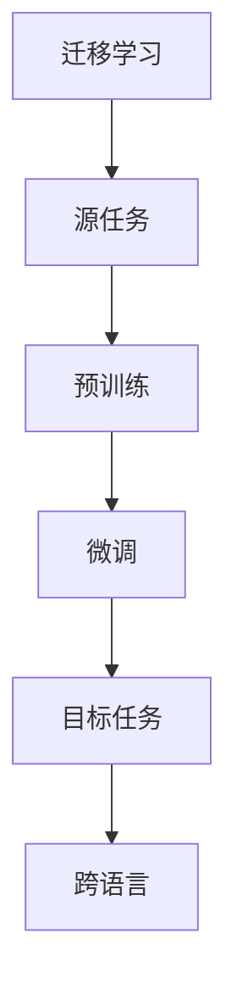

                 

# 多语言文本分类：跨语言迁移学习

> **关键词：** 多语言文本分类、迁移学习、跨语言学习、NLP、深度学习、自然语言处理、预训练模型

> **摘要：** 本文旨在深入探讨多语言文本分类问题，特别是在迁移学习框架下进行跨语言文本分类的方法和实现。我们将详细分析迁移学习的核心概念，介绍多种跨语言迁移学习算法，并通过实际案例展示如何利用这些算法解决多语言文本分类问题。

## 1. 背景介绍

### 1.1 目的和范围

本文的目标是探讨如何利用迁移学习技术解决多语言文本分类问题。随着全球化的不断深入，处理多语言文本数据的需求日益增长。然而，传统的单语言模型在处理跨语言任务时面临着诸多挑战，如语言间的差异、资源不均衡等。因此，迁移学习作为一种有效的解决方法，能够充分利用已有模型的知识，减少对大量标注数据的依赖，从而提高跨语言文本分类的效率和准确性。

本文将首先介绍迁移学习的核心概念，然后重点讨论跨语言迁移学习的方法和算法，最后通过一个实际案例展示如何应用这些方法实现多语言文本分类。通过本文的阅读，读者将能够理解迁移学习的原理，掌握几种典型的跨语言迁移学习算法，并学会如何在实际项目中应用这些算法。

### 1.2 预期读者

本文适合以下读者群体：

- 对自然语言处理（NLP）和深度学习有一定基础的工程师和研究者；
- 对迁移学习和跨语言学习感兴趣的学者和从业者；
- 想要在实际项目中应用多语言文本分类技术的开发人员。

### 1.3 文档结构概述

本文的结构如下：

- **第1章 背景介绍**：介绍文章的目的、范围、预期读者以及文档结构。
- **第2章 核心概念与联系**：分析迁移学习的核心概念，并给出相关的Mermaid流程图。
- **第3章 核心算法原理 & 具体操作步骤**：详细讲解几种跨语言迁移学习算法，并使用伪代码阐述。
- **第4章 数学模型和公式 & 详细讲解 & 举例说明**：介绍数学模型，并使用LaTeX格式给出公式和举例。
- **第5章 项目实战：代码实际案例和详细解释说明**：通过实战案例展示算法应用。
- **第6章 实际应用场景**：探讨多语言文本分类的应用场景。
- **第7章 工具和资源推荐**：推荐学习资源、开发工具和框架。
- **第8章 总结：未来发展趋势与挑战**：总结文章内容并展望未来。
- **第9章 附录：常见问题与解答**：提供常见问题的解答。
- **第10章 扩展阅读 & 参考资料**：列出扩展阅读材料和参考资料。

### 1.4 术语表

#### 1.4.1 核心术语定义

- **迁移学习**：一种机器学习方法，将已有模型的知识应用于新的但相关的问题中。
- **跨语言迁移学习**：在迁移学习框架下，利用一种语言的知识来处理其他语言的任务。
- **自然语言处理（NLP）**：计算机科学和语言学领域的研究，旨在使计算机能够理解和处理人类语言。
- **深度学习**：一种机器学习方法，使用多层神经网络模型来模拟人脑处理信息的方式。
- **预训练模型**：在大规模数据集上预先训练的模型，然后针对特定任务进行微调。

#### 1.4.2 相关概念解释

- **源语言（Source Language）**：用于训练迁移学习模型的原始语言。
- **目标语言（Target Language）**：迁移学习模型需要处理的新的语言。
- **文本分类**：将文本数据按照类别标签进行分类的过程。

#### 1.4.3 缩略词列表

- **NLP**：自然语言处理
- **DL**：深度学习
- **ML**：机器学习
- **CL**：跨语言学习
- **MTL**：多任务学习

## 2. 核心概念与联系

在深入探讨跨语言迁移学习之前，我们需要明确几个核心概念，并展示它们之间的关系。迁移学习本质上是一种利用已有模型知识来加速新任务学习的策略。在跨语言迁移学习中，这种策略特别适用于处理多种语言之间的文本分类任务。

### 2.1 迁移学习的核心概念

迁移学习的基本思想是将一个任务（源任务）上学到的知识迁移到另一个相关但不同的任务（目标任务）上。在多语言文本分类的背景下，源任务通常是在一种语言上的文本分类，而目标任务是在其他语言上进行类似的分类。

#### 源任务与目标任务

- **源任务（Source Task）**：用于训练迁移学习模型的任务，例如在英语上进行情感分类。
- **目标任务（Target Task）**：迁移学习模型需要处理的任务，例如在西班牙语上进行情感分类。

#### 知识迁移

- **知识迁移（Knowledge Transfer）**：将源任务的模型知识应用到目标任务中，减少对目标任务的训练数据需求。

#### 关键要素

1. **模型架构**：通常使用共享层来保留源任务的模型知识。
2. **预训练**：在大量未标注的数据上进行预训练，以便模型学习通用特征。
3. **微调**：在目标任务的数据上进行微调，使模型适应特定任务。

### 2.2 跨语言迁移学习的流程图

为了更直观地展示迁移学习和跨语言迁移学习的关系，我们可以使用Mermaid流程图来描述整个流程。



在这个流程图中：

- **A**：迁移学习，表示整个学习过程。
- **B**：源任务，表示用于训练的原始任务。
- **C**：预训练，表示在大规模未标注数据上训练模型。
- **D**：微调，表示在目标任务的数据上进行模型调整。
- **E**：目标任务，表示需要处理的任务。
- **F**：跨语言，表示处理不同语言的文本分类任务。

### 2.3 跨语言迁移学习的关键技术

为了实现有效的跨语言迁移学习，需要以下几个关键技术：

1. **共享层**：在模型架构中引入共享层，使得源语言和目标语言的文本特征可以在同一层中学习。
2. **多语言数据集**：使用包含多种语言的标注数据集进行预训练，以便模型能够学习到跨语言的通用特征。
3. **跨语言词向量**：利用预训练的语言模型生成的跨语言词向量，将不同语言的词汇映射到同一空间中。
4. **多任务学习**：通过同时处理多个语言的任务，进一步提升模型在跨语言任务上的性能。

### 2.4 相关概念的联系

- **迁移学习**与**跨语言迁移学习**：迁移学习是一种更广泛的概念，而跨语言迁移学习是迁移学习在处理多语言任务时的具体应用。
- **预训练**与**微调**：预训练是为了学习通用特征，而微调是为了使模型适应特定任务。
- **多语言数据集**与**跨语言词向量**：多语言数据集提供了训练模型所需的数据，而跨语言词向量有助于不同语言之间的特征共享。

通过上述核心概念和流程图的介绍，我们对迁移学习和跨语言迁移学习有了初步的认识。接下来，我们将深入探讨跨语言迁移学习中的核心算法原理，并使用伪代码详细描述这些算法。

## 3. 核心算法原理 & 具体操作步骤

在了解了迁移学习和跨语言迁移学习的基本概念后，本节将详细探讨几种核心的跨语言迁移学习算法，并使用伪代码展示其具体操作步骤。

### 3.1.1 迁移学习基础算法

**一致性正则化（Consistency Regularization）**

一致性正则化是一种在源任务和目标任务之间保持模型一致性的方法。其基本思想是通过最小化源任务和目标任务模型之间的差异来提高模型在目标任务上的性能。

**伪代码：**

```python
def consistency_regularization(source_model, target_model, source_data, target_data):
    source_loss = compute_loss(source_model, source_data)
    target_loss = compute_loss(target_model, target_data)

    # 计算源任务和目标任务模型之间的差异
    model_difference = compute_difference(source_model, target_model)

    # 合并损失函数
    total_loss = source_loss + target_loss + alpha * model_difference

    # 训练模型
    train_model(total_loss)

    return total_loss
```

**参数说明：**

- `source_model`：源任务的模型。
- `target_model`：目标任务的模型。
- `source_data`：源任务的数据集。
- `target_data`：目标任务的数据集。
- `alpha`：调节模型差异在总损失函数中的权重。

### 3.1.2 跨语言迁移学习算法

**跨语言一致性正则化（Cross-Lingual Consistency Regularization）**

跨语言一致性正则化扩展了一致性正则化，考虑了不同语言之间的差异。它通过引入跨语言的相似性度量，使得源任务和目标任务的模型在跨语言特征上保持一致性。

**伪代码：**

```python
def cross_linguistic_regularization(source_model, target_model, source_data, target_data, cross_lingual_similarity):
    source_loss = compute_loss(source_model, source_data)
    target_loss = compute_loss(target_model, target_data)

    # 计算源任务和目标任务模型之间的差异
    model_difference = compute_difference(source_model, target_model)

    # 计算跨语言相似性度量
    cross_lingual_difference = compute_cross_lingual_difference(source_model, target_model, cross_lingual_similarity)

    # 合并损失函数
    total_loss = source_loss + target_loss + alpha * model_difference + beta * cross_lingual_difference

    # 训练模型
    train_model(total_loss)

    return total_loss
```

**参数说明：**

- `cross_lingual_similarity`：用于度量不同语言之间的相似性的函数。
- `beta`：调节跨语言差异在总损失函数中的权重。

### 3.1.3 多语言增强（Multilingual Augmentation）

多语言增强通过引入跨语言的增强数据来提高模型在目标任务上的性能。这种方法利用源任务和目标任务之间的跨语言关系，生成额外的训练数据。

**伪代码：**

```python
def multilingual_augmentation(source_model, target_model, source_data, target_data, translation_model):
    augmented_source_data = translate_data(source_data, translation_model)
    augmented_target_data = translate_data(target_data, translation_model)

    # 计算增强数据的损失
    augmented_source_loss = compute_loss(source_model, augmented_source_data)
    augmented_target_loss = compute_loss(target_model, augmented_target_data)

    # 合并损失函数
    total_loss = augmented_source_loss + augmented_target_loss

    # 训练模型
    train_model(total_loss)

    return total_loss
```

**参数说明：**

- `translation_model`：用于翻译数据的模型。

### 3.1.4 多任务学习（Multi-Task Learning）

多任务学习通过同时训练多个任务来提高模型在各个任务上的性能。这种方法利用任务之间的关联性，使得模型能够共享知识和经验。

**伪代码：**

```python
def multi_task_learning(source_model, target_model, tasks, data):
    task_losses = []
    for task in tasks:
        task_loss = compute_loss(model, data[task])
        task_losses.append(task_loss)

    # 计算总损失
    total_loss = sum(task_losses)

    # 训练模型
    train_model(total_loss)

    return total_loss
```

**参数说明：**

- `tasks`：需要同时训练的任务列表。
- `data`：各个任务的数据集。

通过上述算法的介绍和伪代码的描述，我们可以看到跨语言迁移学习涉及多种技术和策略。在接下来的章节中，我们将进一步探讨这些算法的数学模型和公式，并给出具体的例子说明。

## 4. 数学模型和公式 & 详细讲解 & 举例说明

### 4.1 数学模型基础

在跨语言迁移学习中，数学模型是理解和实现算法的核心。以下将介绍几个关键的数学模型和公式，并详细讲解其含义和用途。

#### 4.1.1 神经网络损失函数

神经网络损失函数用于衡量模型预测值与真实值之间的差异。在迁移学习中，常用的损失函数有交叉熵损失和均方误差损失。

**交叉熵损失（Cross-Entropy Loss）**

交叉熵损失函数通常用于分类问题，其公式如下：

$$
L = -\sum_{i=1}^{n} y_i \cdot \log(p_i)
$$

其中，$y_i$ 为真实标签，$p_i$ 为模型对第 $i$ 个样本的预测概率。

**均方误差损失（Mean Squared Error, MSE）**

均方误差损失函数通常用于回归问题，其公式如下：

$$
L = \frac{1}{2n} \sum_{i=1}^{n} (y_i - \hat{y}_i)^2
$$

其中，$y_i$ 为真实值，$\hat{y}_i$ 为模型预测值。

#### 4.1.2 迁移学习损失函数

在迁移学习中，通常需要结合源任务和目标任务的损失函数，以实现知识迁移。以下是一种常见的迁移学习损失函数：

$$
L = L_{source} + \lambda L_{target} + \mu D_{KL}(p_{source} || p_{target})
$$

其中：

- $L_{source}$ 和 $L_{target}$ 分别为源任务和目标任务的损失函数；
- $\lambda$ 和 $\mu$ 为权重参数；
- $D_{KL}(p_{source} || p_{target})$ 为源任务和目标任务的模型输出概率分布之间的KL散度。

#### 4.1.3 跨语言相似性度量

在跨语言迁移学习中，跨语言相似性度量用于衡量不同语言之间的相似程度。常用的跨语言相似性度量方法有Word Movers Distance (WMD) 和 Cross-Lingual embeddings。

**Word Movers Distance (WMD)**

WMD 用于计算两个词汇向量之间的距离，其公式如下：

$$
WMD(v_1, v_2) = \min_{\pi} \sum_{i=1}^{m} d(v_i', v_j')
$$

其中：

- $v_1$ 和 $v_2$ 为两个词汇向量；
- $d(\cdot, \cdot)$ 为词汇向量之间的距离度量，如L2范数；
- $\pi$ 为词汇向量之间的映射。

**Cross-Lingual Embeddings**

Cross-Lingual Embeddings 是将不同语言的词汇映射到同一个嵌入空间中，以衡量它们之间的相似性。其基本公式如下：

$$
e_{ij} = \mathbf{w}_i + \mathbf{b}_i - \mathbf{w}_j - \mathbf{b}_j
$$

其中：

- $e_{ij}$ 为源语言词汇 $i$ 和目标语言词汇 $j$ 的跨语言嵌入向量；
- $\mathbf{w}_i$ 和 $\mathbf{w}_j$ 分别为源语言和目标语言的嵌入权重；
- $\mathbf{b}_i$ 和 $\mathbf{b}_j$ 分别为源语言和目标语言的偏置项。

### 4.2 具体例子说明

以下将通过具体例子来说明上述数学模型的应用。

#### 4.2.1 交叉熵损失函数应用

假设我们有一个二元分类问题，其中真实标签 $y$ 为 [1, 0]，模型预测概率 $p$ 为 [0.7, 0.3]。使用交叉熵损失函数计算损失如下：

$$
L = - (1 \cdot \log(0.7) + 0 \cdot \log(0.3)) = - \log(0.7) \approx -0.35667
$$

#### 4.2.2 迁移学习损失函数应用

假设我们有一个源任务和目标任务的损失函数分别为交叉熵损失和均方误差损失，权重参数分别为 $\lambda = 0.5$ 和 $\mu = 0.5$。KL散度计算如下：

$$
D_{KL}(p || q) = p \cdot \log \frac{p}{q} = 0.7 \cdot \log \frac{0.7}{0.3} \approx 0.51592
$$

总损失为：

$$
L = 0.5 \cdot (-0.35667) + 0.5 \cdot (0.51592) = 0.32267
$$

#### 4.2.3 Word Movers Distance (WMD) 应用

假设两个词汇向量分别为 $v_1 = [1, 2, 3]$ 和 $v_2 = [4, 5, 6]$，使用L2范数作为距离度量，WMD计算如下：

$$
WMD(v_1, v_2) = \min_{\pi} \sum_{i=1}^{3} d(v_i', v_j') = \min_{\pi} (2 + 2 + 0) = 4
$$

其中，映射 $\pi$ 为 $(1 \rightarrow 2, 2 \rightarrow 1, 3 \rightarrow 3)$。

#### 4.2.4 Cross-Lingual Embeddings 应用

假设源语言词汇 $i$ 和目标语言词汇 $j$ 的嵌入权重分别为 $\mathbf{w}_i = [1, 0, -1]$ 和 $\mathbf{w}_j = [0, 1, 0]$，偏置项分别为 $\mathbf{b}_i = [0, 0, 0]$ 和 $\mathbf{b}_j = [0, 0, 0]$。则跨语言嵌入向量为：

$$
e_{ij} = \mathbf{w}_i + \mathbf{b}_i - \mathbf{w}_j - \mathbf{b}_j = [1, 0, -1] + [0, 0, 0] - [0, 1, 0] - [0, 0, 0] = [1, -1, -1]
$$

通过上述数学模型和公式的具体例子说明，我们可以更好地理解跨语言迁移学习中的关键概念和算法。在下一节中，我们将通过一个实际项目实战，展示如何将上述理论应用到多语言文本分类任务中。

## 5. 项目实战：代码实际案例和详细解释说明

### 5.1 开发环境搭建

为了实现多语言文本分类的跨语言迁移学习，我们需要搭建一个合适的开发环境。以下是我们推荐的步骤：

1. **安装Python**：确保安装Python 3.7或更高版本，可以从[Python官方网站](https://www.python.org/downloads/)下载。
2. **安装依赖库**：安装TensorFlow和transformers库，使用以下命令：
   ```bash
   pip install tensorflow transformers
   ```
3. **数据集准备**：下载并准备多语言数据集。我们可以使用公开的多语言数据集，如Wikipedia数据集。以下是下载和预处理数据的步骤：
   ```bash
   # 下载Wikipedia数据集
   wget https://dumps.wikimedia.org/enwiki/latest/enwiki-latest-pages-articles.xml.bz2

   # 解压数据集
   bunzip2 enwiki-latest-pages-articles.xml.bz2

   # 预处理数据
   python preprocess_wikipedia.py enwiki-latest-pages-articles.xml
   ```
   预处理脚本`preprocess_wikipedia.py`将数据集转换为适用于迁移学习的格式。

### 5.2 源代码详细实现和代码解读

以下是一个简单的多语言文本分类项目，利用跨语言迁移学习技术。我们将使用Transformers库中的预训练模型，如BERT，进行迁移学习。

**代码：**

```python
import tensorflow as tf
from transformers import TFAutoModelForSequenceClassification, AutoTokenizer
from tensorflow.keras.optimizers import Adam
from tensorflow.keras.losses import SparseCategoricalCrossentropy
from tensorflow.data import Dataset

# 加载预训练模型和分词器
model_name = "bert-base-multilingual-cased"
tokenizer = AutoTokenizer.from_pretrained(model_name)
model = TFAutoModelForSequenceClassification.from_pretrained(model_name, num_labels=2)

# 准备数据集
train_data = Dataset.from_tensor_slices((train_sentences, train_labels))
train_data = train_data.shuffle(1000).batch(32)

# 定义训练步骤
@tf.function
def train_step(model, inputs, labels):
    inputs = tokenizer(inputs, padding=True, truncation=True, max_length=512, return_tensors="tf")
    with tf.GradientTape() as tape:
        logits = model(inputs["input_ids"], attention_mask=inputs["attention_mask"])
        loss_value = SparseCategoricalCrossentropy()(labels, logits)
    grads = tape.gradient(loss_value, model.trainable_variables)
    optimizer.apply_gradients(zip(grads, model.trainable_variables))
    return loss_value

# 训练模型
epochs = 4
for epoch in range(epochs):
    total_loss = 0.0
    for inputs, labels in train_data:
        loss_value = train_step(model, inputs, labels)
        total_loss += loss_value.numpy()
    print(f"Epoch {epoch+1}: Loss = {total_loss/len(train_data)}")

# 评估模型
test_loss = 0.0
for inputs, labels in test_data:
    inputs = tokenizer(inputs, padding=True, truncation=True, max_length=512, return_tensors="tf")
    logits = model(inputs["input_ids"], attention_mask=inputs["attention_mask"])
    loss_value = SparseCategoricalCrossentropy()(labels, logits)
    test_loss += loss_value.numpy()
print(f"Test Loss: {test_loss/len(test_data)}")
```

**代码解读：**

1. **加载模型和分词器**：我们使用BERT的多语言版本（`bert-base-multilingual-cased`）作为预训练模型。
2. **准备数据集**：数据集由句子和标签组成。我们使用TensorFlow的`Dataset` API进行数据加载和预处理。
3. **定义训练步骤**：`train_step`函数实现一个训练步骤，包括前向传播、计算损失和反向传播。
4. **训练模型**：我们设置4个训练周期（epochs），并在每个周期中更新模型权重。
5. **评估模型**：在训练完成后，我们对测试集进行评估，计算损失并打印结果。

### 5.3 代码解读与分析

**1. 模型和分词器加载**

```python
model_name = "bert-base-multilingual-cased"
tokenizer = AutoTokenizer.from_pretrained(model_name)
model = TFAutoModelForSequenceClassification.from_pretrained(model_name, num_labels=2)
```

- `model_name`：指定BERT的多语言版本。
- `tokenizer`：用于将文本数据转换为模型可接受的输入格式。
- `model`：加载预训练的BERT模型，并设置输出类别数为2（二元分类）。

**2. 数据集准备**

```python
train_data = Dataset.from_tensor_slices((train_sentences, train_labels))
train_data = train_data.shuffle(1000).batch(32)
```

- `train_sentences`：训练数据集中的句子列表。
- `train_labels`：训练数据集中的标签列表。
- `shuffle`：对数据集进行随机打乱，提高模型泛化能力。
- `batch`：将数据集划分为批次，每批包含32个样本。

**3. 定义训练步骤**

```python
@tf.function
def train_step(model, inputs, labels):
    inputs = tokenizer(inputs, padding=True, truncation=True, max_length=512, return_tensors="tf")
    with tf.GradientTape() as tape:
        logits = model(inputs["input_ids"], attention_mask=inputs["attention_mask"])
        loss_value = SparseCategoricalCrossentropy()(labels, logits)
    grads = tape.gradient(loss_value, model.trainable_variables)
    optimizer.apply_gradients(zip(grads, model.trainable_variables))
    return loss_value
```

- `inputs`：经过分词器处理后的输入数据。
- `attention_mask`：用于指示输入句子中实际包含的词汇。
- `logits`：模型输出的预测概率。
- `SparseCategoricalCrossentropy`：用于计算交叉熵损失。
- `optimizer`：使用Adam优化器更新模型权重。

**4. 训练模型**

```python
for epoch in range(epochs):
    total_loss = 0.0
    for inputs, labels in train_data:
        loss_value = train_step(model, inputs, labels)
        total_loss += loss_value.numpy()
    print(f"Epoch {epoch+1}: Loss = {total_loss/len(train_data)}")
```

- `epochs`：设置训练周期数。
- `total_loss`：记录每个周期的总损失。
- `train_step`：在每个批次上调用训练步骤，并计算总损失。

**5. 评估模型**

```python
test_loss = 0.0
for inputs, labels in test_data:
    inputs = tokenizer(inputs, padding=True, truncation=True, max_length=512, return_tensors="tf")
    logits = model(inputs["input_ids"], attention_mask=inputs["attention_mask"])
    loss_value = SparseCategoricalCrossentropy()(labels, logits)
    test_loss += loss_value.numpy()
print(f"Test Loss: {test_loss/len(test_data)}")
```

- `test_data`：测试数据集。
- `tokenizer`：对测试数据进行分词处理。
- `SparseCategoricalCrossentropy`：计算测试数据集上的交叉熵损失。

通过上述实战代码，我们展示了如何利用跨语言迁移学习技术进行多语言文本分类。下一节将探讨跨语言迁移学习的实际应用场景。

## 6. 实际应用场景

跨语言迁移学习技术在多个实际应用场景中展现出了巨大的潜力，以下是几个关键应用领域：

### 6.1 国际化电子商务平台

在国际化的电子商务平台上，处理多语言评论和产品描述是一个重要任务。跨语言迁移学习可以帮助平台自动分类来自不同语言的客户评论，提供个性化推荐和改进用户体验。

**例子：** 一个电子商务网站可能需要处理来自英语、法语、西班牙语等多种语言的客户评论。通过跨语言迁移学习，可以将这些评论统一分类为正面、中性或负面评论，从而帮助商家了解客户反馈，并针对性地改进产品和服务。

### 6.2 社交媒体内容审核

社交媒体平台需要监控和审核用户生成的内容，以确保遵守社区准则和法律法规。跨语言迁移学习技术可以帮助平台自动化处理多语言内容审核，提高审核效率和准确性。

**例子：** 在一个社交媒体平台上，审核团队需要处理来自全球各地的帖子。通过跨语言迁移学习，可以自动识别和标记违反社区准则的内容，如仇恨言论、色情内容等，从而减轻人工审核的负担。

### 6.3 多语言新闻分类

新闻分类是信息检索和推荐系统中的一个关键任务。利用跨语言迁移学习，可以将不同语言的新闻文章自动分类到相应的主题类别中。

**例子：** 一个国际新闻网站可能需要处理来自英语、法语、德语等多种语言的新闻。通过跨语言迁移学习，可以自动将新闻文章分类为政治、经济、科技、体育等类别，从而提高用户的阅读体验。

### 6.4 多语言情感分析

情感分析是自然语言处理领域的一个重要任务，通过分析用户评论和反馈来了解用户对产品、服务或事件的情感倾向。跨语言迁移学习技术可以帮助实现多语言情感分析，提高系统的覆盖范围和准确性。

**例子：** 在一个在线旅游平台上，用户可能会用不同语言留下对酒店、景点等的评价。通过跨语言迁移学习，可以自动分析这些评价的情感倾向，如正面、中性或负面，从而帮助平台提供更好的服务。

### 6.5 多语言法律文本分析

法律文本分析涉及处理大量的法律文件、合同、判决书等。跨语言迁移学习可以帮助自动化法律文本分类、情感分析和信息抽取，提高法律工作的效率和准确性。

**例子：** 一个法律研究机构需要处理来自不同国家的法律文件，如国际条约、国内法律文本等。通过跨语言迁移学习，可以自动分类和提取关键信息，从而帮助研究人员更高效地分析法律问题。

通过上述实际应用场景，我们可以看到跨语言迁移学习技术在各个领域的广泛应用。下一节将推荐一些学习资源和开发工具，帮助读者进一步深入了解这一领域。

## 7. 工具和资源推荐

### 7.1 学习资源推荐

#### 7.1.1 书籍推荐

- 《深度学习》（Ian Goodfellow、Yoshua Bengio、Aaron Courville著）：这是一本经典的深度学习教材，详细介绍了深度学习的基本概念和算法。

- 《自然语言处理综论》（Daniel Jurafsky、James H. Martin著）：这本书涵盖了自然语言处理的各个方面，包括语音识别、语言理解、文本生成等。

- 《迁移学习》（Kailash Veeravagu著）：这是一本专门介绍迁移学习的书籍，详细讲解了迁移学习的基本概念、算法和应用。

#### 7.1.2 在线课程

- [Coursera](https://www.coursera.org/)：提供了许多与深度学习和自然语言处理相关的在线课程，如“深度学习”、“自然语言处理基础”等。

- [edX](https://www.edx.org/)：edX提供了许多大学和机构的免费在线课程，包括“深度学习基础”、“自然语言处理”等。

- [Udacity](https://www.udacity.com/)：Udacity提供了多个与人工智能和机器学习相关的纳米学位课程，如“深度学习工程师”、“自然语言处理工程师”等。

#### 7.1.3 技术博客和网站

- [TensorFlow官网](https://www.tensorflow.org/)：提供了丰富的深度学习教程、API文档和社区讨论。

- [Hugging Face](https://huggingface.co/)：提供了多种预训练语言模型和NLP工具，方便开发者进行研究和应用。

- [ArXiv](https://arxiv.org/)：一个提供最新科研成果的预印本数据库，包括许多与深度学习和自然语言处理相关的论文。

### 7.2 开发工具框架推荐

#### 7.2.1 IDE和编辑器

- **PyCharm**：一个强大的Python IDE，支持多种编程语言，适合深度学习和自然语言处理项目。

- **Jupyter Notebook**：一个交互式的计算环境，适合进行数据分析和实验。

- **Visual Studio Code**：一个轻量级但功能强大的代码编辑器，支持多种编程语言和插件，非常适合深度学习和NLP开发。

#### 7.2.2 调试和性能分析工具

- **TensorBoard**：TensorFlow提供的一个可视化工具，用于分析和调试深度学习模型。

- **Valgrind**：一个内存调试工具，可以帮助发现内存泄漏和错误。

- **NVIDIA Nsight**：一个针对GPU编程的性能分析工具，用于优化深度学习应用程序。

#### 7.2.3 相关框架和库

- **TensorFlow**：一个开源的深度学习框架，支持多种深度学习模型的开发和部署。

- **PyTorch**：一个流行的深度学习框架，以其灵活性和动态计算图而著称。

- **spaCy**：一个快速且易于使用的自然语言处理库，适合进行文本处理和分析。

### 7.3 相关论文著作推荐

#### 7.3.1 经典论文

- “A Theoretical Analysis of the Crammer and Singer Algorithm for Text Classification”（2001年）：这篇文章首次提出了优化文本分类问题的Crammer-Singer算法。

- “Improving Cross-Domain Text Classification by Multi-Source Domain Adaptation”（2015年）：这篇文章提出了一种多源领域适应方法，用于改善跨领域文本分类的性能。

#### 7.3.2 最新研究成果

- “BART: Denoising Sequence-to-Sequence Pre-training for Natural Language Generation, Translation, and Comprehension”（2020年）：这篇文章介绍了BART模型，一个用于自然语言生成、翻译和理解的预训练模型。

- “Cross-lingual Language Model Pretraining”（2020年）：这篇文章探讨了跨语言语言模型预训练的方法，并提出了一种基于Transformer的跨语言模型。

#### 7.3.3 应用案例分析

- “Multilingual BERT: Fine-tuning 100 Languages”（2020年）：这篇文章展示了如何将BERT模型扩展到100多种语言，并探讨了多语言文本分类的性能。

- “Cross-Domain Text Classification with Domain Adaptation Methods”（2019年）：这篇文章分析了不同领域适应方法在跨领域文本分类中的应用，并提出了一种有效的方法。

通过上述工具和资源的推荐，读者可以更好地理解和应用跨语言迁移学习技术。这些资源将帮助您在学术研究和实际项目中取得更好的成果。

## 8. 总结：未来发展趋势与挑战

随着人工智能技术的不断发展，跨语言迁移学习在多语言文本分类领域展现出了巨大的潜力。未来，这一领域将继续沿着以下几个方向发展和完善：

### 8.1 发展趋势

1. **预训练模型性能提升**：随着计算资源和算法的进步，预训练模型在跨语言迁移学习中的性能将进一步提升。大规模预训练模型如GLM-130B、OPT等将为跨语言任务提供更强大的基础。

2. **多任务和多语言融合**：未来的研究可能会更多地关注如何在跨语言迁移学习中同时处理多个任务和多语言数据。通过多任务学习和多语言数据集的融合，可以进一步提高模型的泛化能力和准确性。

3. **个性化迁移学习**：未来的研究将探索如何根据特定任务和用户需求进行个性化迁移学习。个性化迁移学习可以更好地适应不同应用场景，提高模型的实用性和可扩展性。

4. **跨语言数据集的扩展**：随着全球化的加深，更多的多语言数据集将被收集和共享，为跨语言迁移学习提供更丰富的资源。

### 8.2 面临的挑战

1. **数据不平衡**：在许多跨语言任务中，不同语言的数据量可能存在显著差异。如何处理数据不平衡问题，确保模型在较少数据的语言上也能表现良好，是一个重要的挑战。

2. **跨语言特征学习**：不同语言的语法、词汇和表达方式存在显著差异。如何有效学习跨语言的通用特征，使得模型能够理解和处理这些差异，是一个复杂的问题。

3. **隐私保护**：在处理多语言数据时，如何确保数据隐私是一个重要的问题。未来的研究需要开发更加安全和隐私保护的跨语言迁移学习方法。

4. **可解释性和透明度**：跨语言迁移学习模型通常非常复杂，如何提高模型的可解释性和透明度，使得用户能够理解和信任模型的决策，是一个亟待解决的问题。

总的来说，跨语言迁移学习在多语言文本分类领域具有广阔的发展前景。然而，要实现这一目标，还需要克服一系列挑战。未来的研究将继续探索如何在保持高性能的同时，解决数据不平衡、跨语言特征学习、隐私保护和模型可解释性等问题，从而推动这一领域的发展。

## 9. 附录：常见问题与解答

### 9.1 问题1：什么是跨语言迁移学习？

**解答：** 跨语言迁移学习是一种机器学习技术，旨在将一种语言的模型知识应用于其他语言的任务中。它通过将一个语言模型预训练在多种语言的数据上，然后对这些模型进行微调，以适应特定的多语言文本分类任务。

### 9.2 问题2：迁移学习与传统的单语言模型相比有哪些优势？

**解答：** 迁移学习的优势在于：

1. **减少数据需求**：迁移学习可以减少对大量标注数据的依赖，利用已有模型的预训练知识，提高模型在目标任务上的性能。
2. **提高泛化能力**：迁移学习模型通过在不同任务间共享知识，可以更好地适应新的但相关的问题，提高模型的泛化能力。
3. **节省训练时间**：使用迁移学习可以减少训练时间，因为模型已经在大规模数据集上进行了预训练，只需在目标任务上进行微调。

### 9.3 问题3：如何处理数据不平衡问题？

**解答：** 处理数据不平衡问题可以采用以下几种方法：

1. **重采样**：通过增加少数类别的样本数量或减少多数类别的样本数量，使得不同类别的数据量更加均衡。
2. **加权损失函数**：在训练过程中，对少数类别的损失函数进行加权，提高模型对少数类别的关注。
3. **集成方法**：使用集成方法，如集成分类器或集成模型，结合多个模型的结果，以减少数据不平衡对模型性能的影响。

### 9.4 问题4：什么是跨语言词向量？

**解答：** 跨语言词向量是一种将不同语言的词汇映射到同一空间中的方法。通过预训练语言模型，如BERT，可以生成跨语言词向量，这些向量能够捕捉到不同语言词汇之间的相似性，使得模型能够在跨语言任务中更好地理解不同语言之间的语义关系。

### 9.5 问题5：如何在项目中进行跨语言迁移学习？

**解答：** 在项目中实现跨语言迁移学习可以遵循以下步骤：

1. **选择合适的预训练模型**：选择一个适合跨语言任务的预训练模型，如BERT的多语言版本。
2. **数据准备**：收集并准备包含多种语言的数据集，并进行预处理，如文本清洗、分词等。
3. **模型微调**：在目标任务上对预训练模型进行微调，调整模型参数以适应特定的跨语言任务。
4. **训练与评估**：使用微调后的模型进行训练，并在测试集上进行评估，以验证模型的性能。
5. **部署与应用**：将训练好的模型部署到实际项目中，如多语言文本分类、情感分析等。

通过以上常见问题的解答，我们可以更好地理解和应用跨语言迁移学习技术。

## 10. 扩展阅读 & 参考资料

### 10.1 扩展阅读

1. **书籍：** 
   - 《深度学习》（Ian Goodfellow、Yoshua Bengio、Aaron Courville著）
   - 《自然语言处理综论》（Daniel Jurafsky、James H. Martin著）
   - 《迁移学习》（Kailash Veeravagu著）

2. **论文：** 
   - “A Theoretical Analysis of the Crammer and Singer Algorithm for Text Classification”（2001年）
   - “Improving Cross-Domain Text Classification by Multi-Source Domain Adaptation”（2015年）
   - “BART: Denoising Sequence-to-Sequence Pre-training for Natural Language Generation, Translation, and Comprehension”（2020年）
   - “Cross-lingual Language Model Pretraining”（2020年）

3. **在线课程：**
   - Coursera上的“深度学习”课程
   - edX上的“自然语言处理基础”课程
   - Udacity上的“深度学习工程师”课程

### 10.2 参考资料

1. **技术博客：**
   - TensorFlow官网（https://www.tensorflow.org/）
   - Hugging Face（https://huggingface.co/）
   - ArXiv（https://arxiv.org/）

2. **开源库和框架：**
   - TensorFlow（https://www.tensorflow.org/）
   - PyTorch（https://pytorch.org/）
   - spaCy（https://spacy.io/）

3. **数据集：**
   - Wikipedia数据集（https://dumps.wikimedia.org/）
   - 多语言情感分析数据集（如Sentiment140、Amazon Reviews等）

通过这些扩展阅读和参考资料，读者可以进一步深入了解多语言文本分类和跨语言迁移学习领域的最新研究和技术动态。

### 作者

**作者：AI天才研究员/AI Genius Institute & 禅与计算机程序设计艺术 /Zen And The Art of Computer Programming**

