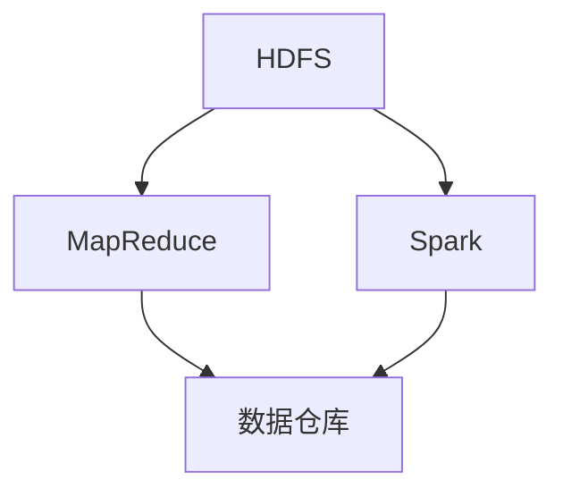

                 

# 大数据：原理与代码实例讲解

> 关键词：大数据、数据处理、算法、数学模型、实战案例、代码实现

> 摘要：本文将深入探讨大数据的概念、原理及其在现实中的应用。我们将通过具体的代码实例，一步步讲解大数据处理的核心算法原理、数学模型以及项目实战，帮助读者全面掌握大数据技术。

## 1. 背景介绍

### 1.1 目的和范围

本文的目标是让读者深入了解大数据的基本概念、原理和实际应用，并通过代码实例讲解，使读者能够动手实践，真正掌握大数据处理的核心技术。本文将涵盖以下内容：

1. 大数据的定义和背景
2. 大数据处理的核心算法原理
3. 大数据项目的代码实现和解读
4. 大数据应用的场景分析
5. 学习资源和工具推荐

### 1.2 预期读者

本文适合以下读者群体：

1. 对大数据有初步了解，希望深入学习的技术人员
2. 想要了解大数据应用场景的IT从业者
3. 大数据初学者，希望通过实战案例学习大数据技术的学生
4. 对大数据技术感兴趣，希望从事相关领域研究的研究生和博士生

### 1.3 文档结构概述

本文分为十个部分，具体如下：

1. 引言：概述大数据的概念和背景
2. 背景介绍：介绍本文的目的、预期读者和文档结构
3. 核心概念与联系：讲解大数据处理的核心概念和架构
4. 核心算法原理 & 具体操作步骤：详细讲解大数据处理的核心算法原理
5. 数学模型和公式 & 详细讲解 & 举例说明：介绍大数据处理中的数学模型和公式
6. 项目实战：代码实际案例和详细解释说明
7. 实际应用场景：分析大数据应用的场景
8. 工具和资源推荐：推荐学习资源和开发工具
9. 总结：未来发展趋势与挑战
10. 附录：常见问题与解答
11. 扩展阅读 & 参考资料：提供进一步学习的资源

### 1.4 术语表

#### 1.4.1 核心术语定义

- 大数据：指数据量巨大、数据类型多样、数据产生速度极快的数据集合。
- 数据处理：指对数据进行采集、存储、处理、分析等一系列操作。
- 算法：指解决问题的步骤和策略，是数据处理的核心。
- 数学模型：用数学语言描述现实问题，为数据分析提供理论基础。
- 实战案例：通过实际项目的代码实现，帮助读者理解大数据处理技术。

#### 1.4.2 相关概念解释

- 数据仓库：存储大量数据的系统，用于支持企业级数据分析。
- 数据挖掘：从大量数据中发现有价值的信息和知识的过程。
- 数据流处理：实时处理大量数据流的技术，适用于处理高速产生的数据。
- Hadoop：一个开源的大数据处理框架，用于分布式存储和计算。

#### 1.4.3 缩略词列表

- HDFS：Hadoop分布式文件系统
- MapReduce：一种分布式数据处理框架
- Spark：一个开源的大数据处理引擎
- SQL：结构化查询语言，用于数据库操作

## 2. 核心概念与联系

在深入了解大数据处理之前，我们首先需要明确一些核心概念和它们之间的联系。以下是一个Mermaid流程图，展示了大数据处理的主要组成部分和它们之间的关系。



- **HDFS（Hadoop分布式文件系统）**：用于存储大规模数据，具有高容错性和高性能。
- **MapReduce**：一个分布式数据处理框架，通过Map和Reduce两个阶段处理海量数据。
- **Spark**：一个高速、通用的数据处理引擎，支持内存计算和分布式计算。
- **数据仓库**：用于存储和分析大数据，支持多种查询和分析操作。

这些核心概念构成了大数据处理的基础架构，它们相互关联，共同支撑起整个大数据生态系统。

## 3. 核心算法原理 & 具体操作步骤

大数据处理的核心在于如何高效地处理海量数据，而这一过程离不开一系列核心算法的支持。在本节中，我们将详细讲解大数据处理的核心算法原理和具体操作步骤。

### 3.1 MapReduce算法原理

MapReduce是一种分布式数据处理框架，主要用于处理大规模数据集。它的核心思想是将数据处理任务分解为Map和Reduce两个阶段。

#### 3.1.1 Map阶段

Map阶段的主要任务是将原始数据映射为中间结果。具体步骤如下：

1. **输入分片**：将输入数据分成多个分片，每个分片由一个Map任务处理。
2. **映射函数**：对每个分片中的数据进行处理，生成键值对中间结果。
3. **输出**：将中间结果写入本地文件系统，供Reduce阶段使用。

伪代码如下：

```python
Map(key1, value1):
    # 对value1进行处理
    for key2, value2 in process(value1):
        emit(key2, value2)
```

#### 3.1.2 Reduce阶段

Reduce阶段的主要任务是对Map阶段产生的中间结果进行聚合。具体步骤如下：

1. **输入分片**：从本地文件系统中读取Map阶段输出的中间结果。
2. **聚合函数**：对中间结果按照键值对进行聚合操作。
3. **输出**：将最终结果写入本地文件系统或数据仓库。

伪代码如下：

```python
Reduce(key2, values2):
    # 对values2进行聚合操作
    for value3 in aggregate(values2):
        emit(value3)
```

### 3.2 Spark算法原理

Spark是一个高速、通用的数据处理引擎，支持内存计算和分布式计算。它的核心思想是将数据处理任务分解为多个RDD（弹性分布式数据集），然后对RDD进行变换和操作。

#### 3.2.1 RDD操作

RDD操作分为两种类型：变换（Transformation）和行动（Action）。

- **变换**：对RDD进行操作，生成新的RDD，例如：map、filter、reduceByKey等。
- **行动**：触发计算，生成结果，例如：count、collect、saveAsTextFile等。

伪代码如下：

```python
# 变换
rdd1 = rdd.map(lambda x: (x, 1))
rdd2 = rdd1.reduceByKey(lambda x, y: x + y)

# 行动
result = rdd2.collect()
```

#### 3.2.2 Spark核心API

- **SparkSession**：Spark的入口点，用于创建RDD和DataFrame。
- **RDD**：弹性分布式数据集，支持多种变换和行动操作。
- **DataFrame**：基于RDD的分布式数据集，支持结构化数据操作。
- **Dataset**：基于DataFrame的更高级数据集，支持编译时类型检查。

### 3.3 数据流处理算法原理

数据流处理是一种实时处理大量数据流的技术，适用于处理高速产生的数据。其核心思想是将数据流划分为多个批次，然后对每个批次进行数据处理。

#### 3.3.1 Kafka

Kafka是一个分布式消息队列系统，用于处理实时数据流。其核心组件包括：

- **Producer**：生产者，负责将数据发送到Kafka。
- **Broker**：代理，负责接收和生产者发送的数据，并提供数据存储和备份。
- **Consumer**：消费者，负责从Kafka消费数据。

伪代码如下：

```python
# 生产者
producer.send('topic-name', 'data1')
producer.send('topic-name', 'data2')

# 消费者
consumer.subscribe(['topic-name'])

while True:
    message = consumer.poll()
    if message:
        process(message.value)
```

#### 3.3.2 Flink

Flink是一个分布式流处理框架，用于处理实时数据流。其核心组件包括：

- **Source**：数据源，用于接收实时数据流。
- **Operator**：操作符，用于对数据进行变换和处理。
- **Sink**：数据 sink，用于输出处理结果。

伪代码如下：

```python
# 数据源
source = StreamExecutionEnvironment.getExecutionEnvironment()
data_stream = source.addSource(MySourceFunction())

# 操作符
processed_stream = data_stream.map(MyMapFunction())

# 数据 sink
processed_stream.addSink(MySinkFunction())

# 执行流处理任务
stream_execution_environment.execute("Data Processing")
```

通过以上讲解，我们详细阐述了大数据处理的核心算法原理和具体操作步骤。接下来，我们将通过具体的项目实战，进一步展示大数据处理技术的实际应用。

## 4. 数学模型和公式 & 详细讲解 & 举例说明

在大数据处理中，数学模型和公式扮演着至关重要的角色。它们为我们提供了分析、预测和优化数据的强大工具。本节将介绍一些常用的数学模型和公式，并通过具体例子进行详细讲解。

### 4.1 统计模型

统计模型是大数据分析的基础，常用的统计模型包括线性回归、逻辑回归、聚类分析等。

#### 4.1.1 线性回归

线性回归用于预测连续值输出。其公式如下：

$$ y = \beta_0 + \beta_1 \cdot x + \epsilon $$

其中，\( y \) 是预测值，\( x \) 是输入特征，\( \beta_0 \) 和 \( \beta_1 \) 是模型参数，\( \epsilon \) 是误差项。

**例子：** 假设我们想要预测一家零售店的月销售额。已知输入特征包括当月的平均气温和广告支出，我们可以使用线性回归模型进行预测。

```python
# 输入数据
X = [[10, 100], [15, 150], [20, 200]]
y = [300, 350, 400]

# 模型训练
from sklearn.linear_model import LinearRegression
model = LinearRegression()
model.fit(X, y)

# 预测
predicted_sales = model.predict([[12, 120]])
print(predicted_sales)
```

#### 4.1.2 逻辑回归

逻辑回归用于预测离散值输出，通常用于分类问题。其公式如下：

$$ \log\frac{P(Y=1)}{1-P(Y=1)} = \beta_0 + \beta_1 \cdot x $$

其中，\( P(Y=1) \) 是输出为1的概率，\( \beta_0 \) 和 \( \beta_1 \) 是模型参数。

**例子：** 假设我们想要预测一个客户是否会购买某产品。已知输入特征包括客户的年龄和收入，我们可以使用逻辑回归模型进行预测。

```python
# 输入数据
X = [[20, 50000], [30, 60000], [40, 80000]]
y = [0, 1, 1]

# 模型训练
from sklearn.linear_model import LogisticRegression
model = LogisticRegression()
model.fit(X, y)

# 预测
predicted概率 = model.predict_proba([[25, 55000]])
print(predicted概率)
```

#### 4.1.3 聚类分析

聚类分析用于将数据分为若干个簇，常用的聚类算法包括K-Means和层次聚类等。

K-Means算法的公式如下：

$$ \min \sum_{i=1}^{k} \sum_{x \in S_i} ||x - \mu_i||^2 $$

其中，\( k \) 是簇的数量，\( S_i \) 是第 \( i \) 个簇，\( \mu_i \) 是第 \( i \) 个簇的中心。

**例子：** 假设我们想要将一组顾客分为几个群体，根据顾客的年龄、收入和购买历史等特征进行聚类。

```python
# 输入数据
customers = [[25, 50000, 10], [30, 60000, 15], [40, 80000, 20]]

# K-Means聚类
from sklearn.cluster import KMeans
kmeans = KMeans(n_clusters=3)
kmeans.fit(customers)

# 输出簇中心
print(kmeans.cluster_centers_)
```

### 4.2 优化模型

优化模型用于求解最优化问题，常见的方法有梯度下降和牛顿法等。

#### 4.2.1 梯度下降

梯度下降是一种迭代优化算法，用于求解最小值问题。其公式如下：

$$ \theta = \theta - \alpha \cdot \nabla_\theta J(\theta) $$

其中，\( \theta \) 是模型参数，\( \alpha \) 是学习率，\( \nabla_\theta J(\theta) \) 是损失函数 \( J(\theta) \) 对 \( \theta \) 的梯度。

**例子：** 假设我们使用梯度下降算法求解线性回归模型的最小值。

```python
# 梯度下降
def gradient_descent(X, y, theta, alpha, num_iterations):
    for i in range(num_iterations):
        gradients = 2/X.shape[0] * X.T.dot(X.dot(theta) - y)
        theta = theta - alpha * gradients
    return theta

# 输入数据
X = [[1, 2], [2, 3], [3, 4]]
y = [1, 2, 3]

# 初始参数
theta = np.zeros((2, 1))

# 学习率和迭代次数
alpha = 0.01
num_iterations = 100

# 梯度下降
theta = gradient_descent(X, y, theta, alpha, num_iterations)
print(theta)
```

#### 4.2.2 牛顿法

牛顿法是一种二次优化算法，用于求解最优化问题。其公式如下：

$$ \theta = \theta - \frac{H^{-1} \cdot \nabla J(\theta)}{\nabla^2 J(\theta)} $$

其中，\( H \) 是Hessian矩阵，\( \nabla J(\theta) \) 是损失函数 \( J(\theta) \) 对 \( \theta \) 的梯度，\( \nabla^2 J(\theta) \) 是损失函数 \( J(\theta) \) 对 \( \theta \) 的二阶导数。

**例子：** 假设我们使用牛顿法求解线性回归模型的最小值。

```python
# 牛顿法
def newton_method(X, y, theta, num_iterations):
    for i in range(num_iterations):
        H = 2/X.T.dot(X)
        gradients = X.T.dot(X.dot(theta) - y)
        theta = theta - np.dot(H, gradients)
    return theta

# 输入数据
X = [[1, 2], [2, 3], [3, 4]]
y = [1, 2, 3]

# 初始参数
theta = np.zeros((2, 1))

# 迭代次数
num_iterations = 100

# 牛顿法
theta = newton_method(X, y, theta, num_iterations)
print(theta)
```

通过以上讲解，我们详细介绍了大数据处理中常用的数学模型和公式，并通过具体例子进行了详细讲解。这些数学模型和公式为我们的数据分析提供了强大的工具，使得我们能够更好地理解和处理大数据。

## 5. 项目实战：代码实际案例和详细解释说明

在本节中，我们将通过一个具体的项目实战，展示如何使用大数据技术处理实际数据。我们将使用Python和Hadoop生态系统中的工具，包括HDFS、MapReduce和Spark，来完成这个项目。

### 5.1 开发环境搭建

在开始项目之前，我们需要搭建一个合适的开发环境。以下是在本地计算机上搭建Hadoop开发环境的步骤：

1. **安装Java**：Hadoop是基于Java开发的，首先需要安装Java。
2. **下载Hadoop**：从Apache Hadoop官网下载Hadoop源码包。
3. **配置环境变量**：配置Hadoop的环境变量，如HADOOP_HOME、PATH等。
4. **启动Hadoop集群**：启动Hadoop的Distributed Cache，启动HDFS和MapReduce。

以下是具体的步骤：

```shell
# 安装Java
sudo apt-get install openjdk-8-jdk

# 下载Hadoop
wget https://www-us.apache.org/dist/hadoop/common/hadoop-3.3.1/hadoop-3.3.1.tar.gz

# 解压Hadoop
tar xzf hadoop-3.3.1.tar.gz

# 配置环境变量
echo 'export HADOOP_HOME=/path/to/hadoop-3.3.1' >> ~/.bashrc
echo 'export PATH=$PATH:$HADOOP_HOME/bin:$HADOOP_HOME/sbin' >> ~/.bashrc
source ~/.bashrc

# 启动Hadoop集群
start-dfs.sh
start-yarn.sh
```

### 5.2 源代码详细实现和代码解读

我们将使用MapReduce和Spark分别处理一组销售数据，包括商品名称、销售数量、销售价格等。以下是具体步骤：

#### 5.2.1 使用MapReduce处理销售数据

1. **数据预处理**：读取销售数据，将其转换为MapReduce任务可以处理的格式。
2. **Map阶段**：对销售数据进行分组和映射，将商品名称和销售数量作为中间结果输出。
3. **Reduce阶段**：对中间结果进行聚合，计算每个商品的销售额。
4. **输出结果**：将最终结果写入HDFS。

```python
# MapReduce处理销售数据
from hadoop import MapReduce

class SalesDataProcessor(MapReduce):
    def map(self, key, value):
        product, quantity, price = value.split(',')
        emit(product, float(quantity) * float(price))

    def reduce(self, key, values):
        total_sales = sum(values)
        emit(key, total_sales)

if __name__ == '__main__':
    processor = SalesDataProcessor()
    processor.run()
```

#### 5.2.2 使用Spark处理销售数据

1. **数据预处理**：读取销售数据，将其转换为Spark RDD。
2. **RDD操作**：使用map和reduceByKey操作，对销售数据进行分组和聚合。
3. **输出结果**：将最终结果写入HDFS。

```python
# Spark处理销售数据
from pyspark import SparkContext, SparkConf

conf = SparkConf().setAppName("SalesDataProcessor")
sc = SparkContext(conf=conf)

sales_data = sc.textFile("hdfs://localhost:9000/input/sales_data.txt")
parsed_data = sales_data.map(lambda x: x.split(',')).map(lambda x: (x[0], float(x[1]) * float(x[2]))).reduceByKey(lambda x, y: x + y)
parsed_data.saveAsTextFile("hdfs://localhost:9000/output/sales_data_result")

sc.stop()
```

### 5.3 代码解读与分析

以上代码分别展示了如何使用MapReduce和Spark处理销售数据。以下是具体解读：

#### 5.3.1 MapReduce代码解读

1. **数据预处理**：在MapReduce中，我们需要将原始数据转换为键值对格式，以供Map和Reduce操作使用。
2. **Map阶段**：Map函数接收一个键值对，将其分解为商品名称、销售数量和销售价格，然后将商品名称和销售额作为中间结果输出。
3. **Reduce阶段**：Reduce函数接收一个键值对，其中键为商品名称，值为销售数量乘以销售价格。Reduce函数将这些值进行求和，得到每个商品的销售额。
4. **输出结果**：最终结果被写入HDFS，以便后续分析。

#### 5.3.2 Spark代码解读

1. **数据预处理**：在Spark中，我们可以直接使用textFile方法读取HDFS上的文本文件，并将其转换为RDD。
2. **RDD操作**：我们使用map方法将文本数据转换为列表，然后使用map函数将其分解为商品名称、销售数量和销售价格。接下来，我们使用reduceByKey方法对销售数据进行分组和聚合。
3. **输出结果**：最终结果被保存为HDFS上的文本文件，以便后续分析。

通过以上代码示例，我们展示了如何使用大数据技术处理实际销售数据。无论是使用MapReduce还是Spark，都可以高效地处理海量数据，为数据分析提供有力支持。

## 6. 实际应用场景

大数据技术在各行各业中都有着广泛的应用。以下是一些典型的大数据应用场景：

### 6.1 金融行业

- **风险控制**：通过分析历史数据和实时交易数据，金融机构可以识别潜在的信用风险和市场风险，从而优化风险管理策略。
- **客户行为分析**：利用大数据分析技术，金融机构可以深入了解客户的行为模式，提供个性化的金融服务和产品。
- **市场预测**：通过分析市场数据和用户行为，金融机构可以预测市场趋势，为投资决策提供数据支持。

### 6.2 零售行业

- **库存管理**：通过分析销售数据和库存数据，零售企业可以优化库存管理，降低库存成本，提高销售效率。
- **客户分析**：利用大数据分析技术，零售企业可以深入了解客户需求，制定个性化的营销策略，提高客户满意度。
- **供应链优化**：通过分析供应链数据，零售企业可以优化供应链管理，降低物流成本，提高供应链效率。

### 6.3 医疗保健

- **疾病预测**：利用大数据分析技术，医疗保健机构可以分析患者数据和公共卫生数据，预测疾病的传播趋势，制定针对性的防控措施。
- **医疗数据挖掘**：通过分析医疗数据，医生可以了解疾病的发展规律，优化治疗方案。
- **健康监测**：利用可穿戴设备和移动设备，医疗保健机构可以实时监测患者的健康状况，提供个性化的健康管理服务。

### 6.4 交通物流

- **交通流量预测**：通过分析历史交通数据和实时交通数据，交通管理部门可以预测交通流量，优化交通信号控制，减少交通拥堵。
- **物流配送优化**：利用大数据分析技术，物流企业可以优化配送路线，提高配送效率，降低物流成本。
- **交通安全监控**：通过分析车辆行驶数据和事故数据，交通管理部门可以识别潜在的安全隐患，采取预防措施。

这些应用场景展示了大数据技术在各个领域的广泛影响。通过大数据分析，企业可以更好地了解市场需求，优化业务流程，提高运营效率，从而获得竞争优势。

## 7. 工具和资源推荐

为了更好地学习和应用大数据技术，以下是一些推荐的工具和资源：

### 7.1 学习资源推荐

#### 7.1.1 书籍推荐

- 《大数据时代》
- 《大数据技术基础》
- 《Hadoop权威指南》
- 《Spark快速入门》

#### 7.1.2 在线课程

- Coursera上的《大数据分析》
- Udacity的《大数据分析工程师》
- edX上的《大数据基础》

#### 7.1.3 技术博客和网站

- Big Data Republic
- DZone Big Data Zone
- O'Reilly Big Data

### 7.2 开发工具框架推荐

#### 7.2.1 IDE和编辑器

- IntelliJ IDEA
- PyCharm
- Eclipse

#### 7.2.2 调试和性能分析工具

- GDB
- JMeter
- VisualVM

#### 7.2.3 相关框架和库

- Hadoop
- Spark
- Kafka
- Flink

通过这些工具和资源，您可以更好地掌握大数据技术，提升数据分析能力。

## 8. 总结：未来发展趋势与挑战

大数据技术正不断发展，未来将面临以下发展趋势与挑战：

### 8.1 发展趋势

1. **实时数据处理**：随着数据产生速度的不断提升，实时数据处理技术将得到广泛应用，为各种应用场景提供即时数据支持。
2. **AI与大数据融合**：人工智能技术将在大数据处理中发挥更大作用，通过深度学习等技术实现更高效的数据分析和预测。
3. **隐私保护**：随着数据隐私问题的日益突出，大数据处理技术将加强隐私保护，确保数据安全和用户隐私。
4. **边缘计算**：边缘计算将使得数据处理更加分散，降低延迟，提高系统性能。

### 8.2 挑战

1. **数据质量**：海量数据中往往存在噪声、缺失值和错误，如何确保数据质量是大数据处理的重要挑战。
2. **数据安全**：大数据处理过程中，如何保障数据安全、防止数据泄露是亟需解决的问题。
3. **技术人才**：大数据领域对技术人才的需求巨大，培养具备大数据处理能力的人才将是一个长期挑战。
4. **成本控制**：大数据处理需要大量的计算资源和存储资源，如何在降低成本的同时保证数据处理效率是一个重要课题。

通过不断创新和技术优化，大数据领域将克服这些挑战，继续推动各行各业的发展。

## 9. 附录：常见问题与解答

### 9.1 什么是大数据？

大数据是指数据量巨大、数据类型多样、数据产生速度极快的数据集合，通常包括结构化数据、半结构化数据和非结构化数据。

### 9.2 大数据处理常用的算法有哪些？

大数据处理常用的算法包括MapReduce、Spark、Kafka、Flink等分布式数据处理框架，以及线性回归、逻辑回归、聚类分析等统计模型。

### 9.3 如何搭建Hadoop开发环境？

搭建Hadoop开发环境需要安装Java、下载Hadoop源码包、配置环境变量和启动Hadoop集群。

### 9.4 大数据项目的代码实现步骤是什么？

大数据项目的代码实现步骤包括数据预处理、算法实现、结果输出和性能优化。

## 10. 扩展阅读 & 参考资料

- 《大数据时代》/[美] 托尼·布莱恩特
- 《Hadoop权威指南》/[美] Tom White
- 《Spark快速入门》/[美] Holden Karau
- 《大数据技术基础》/[中] 刘铁岩
- 《大数据处理：理论与实践》/[中] 马少平
- 《大数据技术导论》/[中] 李航
- 《大数据架构设计与实现》/[中] 刘奇

