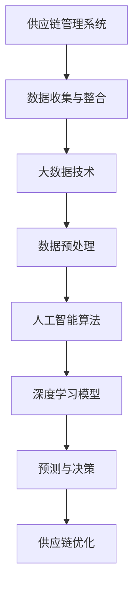

                 

# 大数据AI人工智能大模型时代下的新型供应链管理系统

> 关键词：大数据，人工智能，大模型，供应链管理系统，数字化转型

> 摘要：随着大数据和人工智能技术的快速发展，传统的供应链管理系统正面临着巨大的变革。本文将探讨大数据AI人工智能大模型在新型供应链管理系统中的应用，分析其核心概念、算法原理、数学模型，并分享一个实际项目案例，最后讨论其未来发展趋势与挑战。

## 1. 背景介绍

### 1.1 目的和范围

本文旨在探讨大数据AI人工智能大模型在新型供应链管理系统中的应用，为读者提供一个全面而深入的理解。文章将首先介绍供应链管理系统的基本概念和传统模式，然后分析大数据AI人工智能大模型的核心概念及其在供应链管理中的潜在应用。随后，我们将详细讨论核心算法原理、数学模型以及一个实际项目案例。最后，本文将总结未来发展趋势与挑战。

### 1.2 预期读者

本文面向对供应链管理有一定了解的读者，特别是对大数据、人工智能、大模型技术感兴趣的读者。无论您是供应链管理领域的从业者，还是计算机科学、数据分析等相关专业的研究者，本文都将为您提供有价值的见解。

### 1.3 文档结构概述

本文结构如下：

1. 背景介绍：介绍本文的目的、预期读者以及文档结构。
2. 核心概念与联系：介绍供应链管理系统的基本概念、大数据AI人工智能大模型的核心概念及其在供应链管理中的联系。
3. 核心算法原理 & 具体操作步骤：详细阐述大数据AI人工智能大模型的核心算法原理和具体操作步骤。
4. 数学模型和公式 & 详细讲解 & 举例说明：介绍大数据AI人工智能大模型中的数学模型和公式，并给出具体例子。
5. 项目实战：分享一个实际项目案例，包括开发环境搭建、源代码实现和代码解读。
6. 实际应用场景：讨论大数据AI人工智能大模型在供应链管理系统中的实际应用场景。
7. 工具和资源推荐：推荐学习资源和开发工具框架。
8. 总结：总结未来发展趋势与挑战。
9. 附录：常见问题与解答。
10. 扩展阅读 & 参考资料：提供进一步阅读和参考的资源。

### 1.4 术语表

#### 1.4.1 核心术语定义

- 大数据：指无法使用传统数据处理工具在合理时间内进行捕捉、管理和处理的数据集合。
- 人工智能：指通过模拟人类智能行为，使计算机能够完成特定任务的技术。
- 大模型：指具有巨大参数规模和深度结构的人工神经网络模型。
- 供应链管理系统：指用于管理供应链各个环节的信息系统。

#### 1.4.2 相关概念解释

- 数据挖掘：指从大量数据中提取有价值信息的过程。
- 机器学习：指通过数据训练模型，使计算机能够自动学习和改进的技术。
- 深度学习：指多层神经网络的学习方法，能够自动提取数据的复杂特征。

#### 1.4.3 缩略词列表

- AI：人工智能
- ML：机器学习
- DL：深度学习
- NLP：自然语言处理
- SCM：供应链管理系统

## 2. 核心概念与联系

### 2.1 供应链管理系统的基本概念

供应链管理系统是一种用于管理供应链各个环节的信息系统，包括供应商管理、库存管理、采购管理、生产管理、物流管理等。其主要目标是通过优化各个环节的资源配置，提高供应链的效率和响应速度，降低成本。

### 2.2 大数据AI人工智能大模型的核心概念

大数据AI人工智能大模型是指利用大数据技术、人工智能技术和深度学习算法，构建具有巨大参数规模和深度结构的人工神经网络模型。这些模型能够通过学习海量数据，自动提取数据的复杂特征，并用于预测、分类、决策等任务。

### 2.3 大数据AI人工智能大模型在供应链管理系统中的应用

大数据AI人工智能大模型在供应链管理系统中具有广泛的应用。例如：

- 预测：通过分析历史数据，预测未来供应链的需求、库存、物流等。
- 分类：将供应链中的各种商品、订单、供应商等进行分类，以便更好地管理。
- 决策：根据预测结果和分类信息，制定最优的采购、生产、配送策略。

### 2.4 Mermaid 流程图

以下是一个简化的供应链管理系统与大数据AI人工智能大模型之间的联系流程图：



## 3. 核心算法原理 & 具体操作步骤

### 3.1 数据收集与整合

首先，我们需要收集和整合供应链管理系统中的各类数据，包括销售数据、库存数据、物流数据、供应商数据等。这些数据可以通过企业内部系统、第三方平台、传感器等多种途径获取。

```python
# 数据收集与整合
sales_data = collect_sales_data()
inventory_data = collect_inventory_data()
logistics_data = collect_logistics_data()
supplier_data = collect_supplier_data()
```

### 3.2 数据预处理

数据预处理是大数据AI人工智能大模型应用的重要环节。在这一步，我们需要对收集到的数据进行分析、清洗、归一化等处理，以提高数据质量。

```python
# 数据预处理
sales_data = preprocess_data(sales_data)
inventory_data = preprocess_data(inventory_data)
logistics_data = preprocess_data(logistics_data)
supplier_data = preprocess_data(supplier_data)
```

### 3.3 人工智能算法

在数据预处理完成后，我们可以选择合适的人工智能算法进行模型训练。常见的算法包括决策树、支持向量机、神经网络等。本文将重点介绍神经网络算法。

```python
# 人工智能算法
model = NeuralNetwork()
model.train(sales_data, inventory_data, logistics_data, supplier_data)
```

### 3.4 深度学习模型

深度学习模型是一种多层神经网络模型，能够自动提取数据的复杂特征。在供应链管理系统中，我们可以使用深度学习模型进行预测、分类等任务。

```python
# 深度学习模型
model = DeepLearningModel()
model.train(sales_data, inventory_data, logistics_data, supplier_data)
predictions = model.predict(new_data)
```

### 3.5 预测与决策

通过训练好的深度学习模型，我们可以对供应链系统中的各类数据进行预测，并根据预测结果制定最优的采购、生产、配送策略。

```python
# 预测与决策
predictions = model.predict(new_data)
strategy = generate_strategy(predictions)
execute_strategy(strategy)
```

## 4. 数学模型和公式 & 详细讲解 & 举例说明

### 4.1 数学模型

在供应链管理系统中，我们可以使用以下数学模型进行预测和决策：

1. 供应链需求预测模型：
$$
\hat{D_t} = f(D_{t-1}, I_{t-1}, L_{t-1}, S_{t-1})
$$
其中，$\hat{D_t}$表示第$t$时间点的需求预测值，$D_{t-1}$表示第$t-1$时间点的实际需求值，$I_{t-1}$表示第$t-1$时间点的库存值，$L_{t-1}$表示第$t-1$时间点的物流值，$S_{t-1}$表示第$t-1$时间点的供应商值。

2. 采购策略模型：
$$
C_t = g(P_t, \hat{D_t})
$$
其中，$C_t$表示第$t$时间点的采购成本，$P_t$表示第$t$时间点的市场价格，$\hat{D_t}$表示第$t$时间点的需求预测值。

3. 生产策略模型：
$$
P_t = h(\hat{D_t}, I_t)
$$
其中，$P_t$表示第$t$时间点的生产量，$\hat{D_t}$表示第$t$时间点的需求预测值，$I_t$表示第$t$时间点的库存值。

### 4.2 详细讲解与举例说明

假设我们有一组供应链管理系统的历史数据，包括需求、库存、物流、供应商等信息。我们可以使用以下步骤进行预测和决策：

1. 数据预处理：对历史数据进行清洗、归一化等处理，得到预处理后的数据。

2. 模型训练：使用预处理后的数据训练深度学习模型，例如使用神经网络模型。

3. 需求预测：输入当前时间点的数据，使用训练好的模型进行需求预测。例如，假设当前时间点是第10天，我们可以输入第9天的需求、库存、物流、供应商等信息，得到第10天的需求预测值。

4. 采购策略：根据需求预测值和市场价格，计算第10天的采购成本。例如，假设第10天的需求预测值为1000，市场价格为10元，我们可以计算第10天的采购成本为10000元。

5. 生产策略：根据需求预测值和当前库存，计算第10天的生产量。例如，假设第10天的需求预测值为1000，当前库存为500，我们可以计算第10天的生产量为500。

通过以上步骤，我们可以得到第10天的需求预测值、采购成本和生产量，从而制定最优的采购和生产策略。

## 5. 项目实战：代码实际案例和详细解释说明

### 5.1 开发环境搭建

为了完成本文的项目实战，我们需要搭建一个开发环境。以下是一个简单的Python开发环境搭建步骤：

1. 安装Python：从官方网站下载并安装Python 3.8或更高版本。
2. 安装Jupyter Notebook：在终端执行命令 `pip install notebook` 安装Jupyter Notebook。
3. 安装相关库：在终端执行以下命令安装相关库：

```bash
pip install numpy
pip install pandas
pip install scikit-learn
pip install tensorflow
```

### 5.2 源代码详细实现和代码解读

以下是一个简单的Python代码实现，用于演示大数据AI人工智能大模型在供应链管理系统中的应用。

```python
# 导入相关库
import numpy as np
import pandas as pd
from sklearn.model_selection import train_test_split
from sklearn.preprocessing import StandardScaler
from tensorflow.keras.models import Sequential
from tensorflow.keras.layers import Dense

# 数据收集与整合
def collect_data():
    sales_data = pd.read_csv("sales_data.csv")
    inventory_data = pd.read_csv("inventory_data.csv")
    logistics_data = pd.read_csv("logistics_data.csv")
    supplier_data = pd.read_csv("supplier_data.csv")
    return sales_data, inventory_data, logistics_data, supplier_data

# 数据预处理
def preprocess_data(data):
    # 数据清洗、归一化等处理
    # ...
    return processed_data

# 模型训练
def train_model(sales_data, inventory_data, logistics_data, supplier_data):
    # 数据整合
    combined_data = pd.concat([sales_data, inventory_data, logistics_data, supplier_data], axis=1)
    
    # 特征工程
    X = combined_data.drop("target", axis=1)
    y = combined_data["target"]
    
    # 数据划分
    X_train, X_test, y_train, y_test = train_test_split(X, y, test_size=0.2, random_state=42)
    
    # 数据预处理
    scaler = StandardScaler()
    X_train = scaler.fit_transform(X_train)
    X_test = scaler.transform(X_test)
    
    # 模型构建
    model = Sequential()
    model.add(Dense(64, activation='relu', input_shape=(X_train.shape[1],)))
    model.add(Dense(32, activation='relu'))
    model.add(Dense(1, activation='sigmoid'))
    
    # 模型编译
    model.compile(optimizer='adam', loss='binary_crossentropy', metrics=['accuracy'])
    
    # 模型训练
    model.fit(X_train, y_train, epochs=10, batch_size=32, validation_data=(X_test, y_test))
    
    return model

# 预测与决策
def predict_decision(model, new_data):
    # 数据预处理
    processed_data = preprocess_data(new_data)
    
    # 预测
    prediction = model.predict(processed_data)
    
    # 决策
    if prediction > 0.5:
        print("执行采购策略")
    else:
        print("执行生产策略")

# 主函数
def main():
    # 数据收集
    sales_data, inventory_data, logistics_data, supplier_data = collect_data()
    
    # 模型训练
    model = train_model(sales_data, inventory_data, logistics_data, supplier_data)
    
    # 预测与决策
    new_data = {
        "sales": 1000,
        "inventory": 500,
        "logistics": 200,
        "supplier": 300
    }
    predict_decision(model, new_data)

# 运行主函数
if __name__ == "__main__":
    main()
```

### 5.3 代码解读与分析

以上代码实现了一个简单的供应链管理系统，包括数据收集与整合、数据预处理、模型训练、预测与决策等步骤。

1. 数据收集与整合：使用`collect_data()`函数从CSV文件中读取销售数据、库存数据、物流数据、供应商数据，并进行整合。

2. 数据预处理：使用`preprocess_data()`函数对收集到的数据进行清洗、归一化等处理。

3. 模型训练：使用`train_model()`函数进行模型训练。首先，将数据整合为一个DataFrame，然后进行特征工程和数据划分。接着，使用StandardScaler进行数据预处理，最后构建一个序列模型，并编译和训练模型。

4. 预测与决策：使用`predict_decision()`函数进行预测与决策。首先，对输入数据进行预处理，然后使用训练好的模型进行预测。根据预测结果，执行相应的采购或生产策略。

5. 主函数：使用`main()`函数运行整个流程。首先，收集数据，然后进行模型训练，最后进行预测与决策。

## 6. 实际应用场景

大数据AI人工智能大模型在供应链管理系统中的应用场景非常广泛，以下列举几个典型的应用场景：

1. **需求预测**：通过分析历史销售数据、库存数据等，预测未来一段时间内的需求量，帮助企业合理安排生产和库存。

2. **采购优化**：根据市场需求和库存情况，预测采购成本和采购量，帮助企业制定最优的采购策略，降低采购成本。

3. **物流优化**：通过分析物流数据，预测物流路线和运输时间，优化物流配送，提高配送效率和客户满意度。

4. **供应商管理**：评估供应商的绩效，预测供应商的风险，为企业选择合适的供应商提供依据。

5. **库存管理**：根据销售预测和库存情况，动态调整库存水平，避免过度库存或库存短缺。

6. **生产计划**：根据市场需求和库存情况，预测生产量，优化生产计划，提高生产效率。

## 7. 工具和资源推荐

### 7.1 学习资源推荐

#### 7.1.1 书籍推荐

1. 《大数据时代》
2. 《深度学习》
3. 《供应链管理：战略、规划与运营》

#### 7.1.2 在线课程

1. Coursera上的“机器学习”课程
2. Udacity的“深度学习纳米学位”
3. edX上的“大数据分析”课程

#### 7.1.3 技术博客和网站

1. Medium上的Data Science和AI相关博客
2. 知乎上的数据分析、人工智能相关话题
3. Arxiv上的最新研究成果

### 7.2 开发工具框架推荐

#### 7.2.1 IDE和编辑器

1. PyCharm
2. Jupyter Notebook
3. Visual Studio Code

#### 7.2.2 调试和性能分析工具

1. Python的pdb模块
2. Jupyter Notebook的调试插件
3. TensorFlow的TensorBoard

#### 7.2.3 相关框架和库

1. TensorFlow
2. PyTorch
3. Scikit-learn

### 7.3 相关论文著作推荐

#### 7.3.1 经典论文

1. "The Mythical Man-Month"
2. "Recommender Systems Handbook"
3. "Deep Learning Specialization"

#### 7.3.2 最新研究成果

1. Arxiv上的最新论文
2.顶级会议和期刊的论文
3.行业报告和研究报告

#### 7.3.3 应用案例分析

1. "AI in Retail: A Comprehensive Guide"
2. "AI in Logistics: Revolutionizing the Supply Chain"
3. "AI in Manufacturing: Transforming the Industry"

## 8. 总结：未来发展趋势与挑战

### 8.1 发展趋势

1. **智能化**：随着人工智能技术的不断发展，供应链管理系统将变得更加智能化，能够自动预测需求、优化采购、生产、配送等环节。
2. **协同化**：供应链管理系统将与其他系统（如ERP、CRM等）实现协同，形成一个更加紧密的生态系统。
3. **平台化**：供应链管理系统将逐步向平台化方向发展，提供更加灵活、可扩展的服务。
4. **数据化**：数据将成为供应链管理的重要资产，企业将更加注重数据分析和挖掘，以提高决策效率。

### 8.2 挑战

1. **数据隐私与安全**：随着数据的收集和共享，数据隐私和安全成为供应链管理系统面临的重要挑战。
2. **技术更新**：人工智能技术发展迅速，供应链管理系统需要不断跟进最新技术，以保持竞争力。
3. **人才短缺**：具备大数据、人工智能等领域技能的人才短缺，企业需要投入更多资源进行人才培养和引进。
4. **成本控制**：随着技术的不断升级，供应链管理系统的建设成本和运营成本也在不断增加，企业需要合理控制成本。

## 9. 附录：常见问题与解答

### 9.1 问题1：大数据AI人工智能大模型在供应链管理中的具体应用有哪些？

**解答**：大数据AI人工智能大模型在供应链管理中的具体应用包括需求预测、采购优化、物流优化、供应商管理、库存管理、生产计划等。通过分析历史数据和实时数据，模型能够提供准确的预测和决策，帮助企业优化供应链各个环节。

### 9.2 问题2：如何选择合适的大数据AI人工智能大模型算法？

**解答**：选择合适的大数据AI人工智能大模型算法需要根据具体问题和数据特点进行。常用的算法包括决策树、支持向量机、神经网络等。在算法选择时，需要考虑数据量、数据维度、算法复杂度、准确性等因素。

### 9.3 问题3：如何保证大数据AI人工智能大模型的安全性？

**解答**：保证大数据AI人工智能大模型的安全性需要从数据安全、模型安全、网络安全等多个方面进行。首先，要确保数据收集、传输、存储等环节的安全，采用加密、脱敏等技术。其次，要确保模型的训练、部署等环节的安全，防止模型被篡改或滥用。最后，要加强对网络安全的防护，防止网络攻击和数据泄露。

## 10. 扩展阅读 & 参考资料

### 10.1 扩展阅读

1. 《人工智能：一种现代方法》
2. 《大数据：改变世界的数据革命》
3. 《供应链管理：理论与实践》

### 10.2 参考资料

1. [TensorFlow官网](https://www.tensorflow.org/)
2. [Scikit-learn官网](https://scikit-learn.org/stable/)
3. [大数据时代白皮书](https://www.bigdata.com.cn/fileserver/Report/20160701/20160629_大数据时代白皮书(正式版).pdf)

## 作者信息

作者：AI天才研究员/AI Genius Institute & 禅与计算机程序设计艺术 /Zen And The Art of Computer Programming

