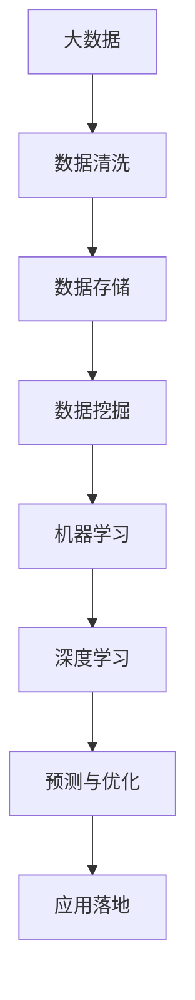
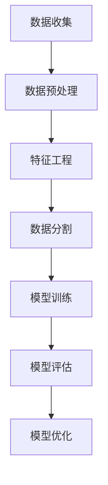

                 

# 大数据与AI未来的发展方向

> **关键词：大数据、人工智能、未来趋势、技术发展、挑战与机遇**
>
> **摘要：本文将深入探讨大数据和人工智能技术的现状、核心概念及其未来发展方向，分析可能面临的挑战和机遇，为读者提供对大数据与AI技术未来趋势的全面了解。**

## 1. 背景介绍

### 1.1 目的和范围

本文旨在通过逻辑清晰的推理方式，探讨大数据和人工智能（AI）技术的当前状态和未来发展趋势。我们将从基本概念入手，逐步深入到技术原理和实际应用，最终总结未来可能面临的挑战和机遇。

### 1.2 预期读者

本文适合对大数据和人工智能技术有一定了解的读者，包括数据科学家、AI工程师、技术架构师、研究学者以及对相关领域感兴趣的专业人士。

### 1.3 文档结构概述

本文结构分为十个部分：

1. **背景介绍**：介绍本文的目的、预期读者和文档结构。
2. **核心概念与联系**：定义核心概念，展示技术原理和架构的Mermaid流程图。
3. **核心算法原理与具体操作步骤**：详细讲解核心算法原理，使用伪代码阐述。
4. **数学模型和公式**：介绍数学模型，使用LaTeX格式详细讲解并举例说明。
5. **项目实战：代码实际案例**：展示实际代码案例，进行详细解释说明。
6. **实际应用场景**：分析大数据与AI在各个领域的应用。
7. **工具和资源推荐**：推荐学习资源和开发工具框架。
8. **相关论文著作推荐**：推荐经典和最新研究成果。
9. **总结：未来发展趋势与挑战**：总结未来发展趋势和可能面临的挑战。
10. **附录：常见问题与解答**：解答读者可能遇到的常见问题。
11. **扩展阅读与参考资料**：提供进一步阅读和研究的资源。

### 1.4 术语表

#### 1.4.1 核心术语定义

- **大数据（Big Data）**：指无法使用传统数据处理工具在合理时间内进行捕捉、管理和处理的大量数据。
- **人工智能（Artificial Intelligence, AI）**：模拟人类智能行为的计算机技术。
- **深度学习（Deep Learning）**：一种基于人工神经网络的学习方法，能够从大量数据中自动提取特征。
- **机器学习（Machine Learning）**：使计算机系统能够从数据中学习并做出决策的技术。
- **神经网络（Neural Network）**：模仿生物神经系统的计算模型。

#### 1.4.2 相关概念解释

- **数据挖掘（Data Mining）**：从大量数据中提取隐藏的、未知的、有价值的信息和知识。
- **云计算（Cloud Computing）**：通过网络提供可伸缩的计算资源，以按需、便捷的方式提供服务。
- **边缘计算（Edge Computing）**：在数据源附近或终端设备上进行数据处理和计算。

#### 1.4.3 缩略词列表

- **AI**：人工智能（Artificial Intelligence）
- **ML**：机器学习（Machine Learning）
- **DL**：深度学习（Deep Learning）
- **Hadoop**：一个开源的分布式数据处理框架
- **Spark**：一个开源的分布式数据处理框架

## 2. 核心概念与联系

在探讨大数据和AI的未来发展方向之前，我们需要明确这些技术的核心概念和它们之间的联系。

### 2.1 大数据的定义与特征

大数据具有四个V特征：

- **Volume（大量）**：数据量巨大，通常以PB（皮字节）或EB（艾字节）为单位。
- **Velocity（速度）**：数据的生成和传输速度快，需要实时处理。
- **Variety（多样性）**：数据来源多样，包括结构化、半结构化和非结构化数据。
- **Veracity（真实性）**：数据真实性难以保证，存在噪声和错误。

### 2.2 人工智能的基本原理

人工智能的核心包括：

- **机器学习**：使用算法从数据中学习并改进性能。
- **深度学习**：多层神经网络，能够自动提取数据特征。
- **强化学习**：通过与环境的交互学习最优策略。

### 2.3 大数据与人工智能的联系

大数据为AI提供了丰富的训练数据，使得机器学习算法能够更好地学习和优化。同时，AI技术在数据处理、分析和预测方面提供了强大的工具。两者结合，为各领域带来了深刻的变革。

### 2.4 Mermaid流程图



## 3. 核心算法原理 & 具体操作步骤

在深入探讨大数据与AI技术之前，我们需要了解核心算法原理和具体操作步骤。

### 3.1 数据处理流程



### 3.2 伪代码示例

```python
# 机器学习模型训练伪代码
def train_model(data, labels, model):
    # 初始化模型参数
    model.initialize_params()
    
    # 模型训练
    for epoch in range(num_epochs):
        for data_point in data:
            # 前向传播
            predictions = model.forward_pass(data_point)
            
            # 计算损失
            loss = compute_loss(predictions, labels)
            
            # 反向传播
            model.backward_pass(loss)
            
            # 更新模型参数
            model.update_params()
    
    # 模型评估
    evaluate_model(model, test_data, test_labels)
```

### 3.3 模型评估与优化

```python
# 模型评估伪代码
def evaluate_model(model, test_data, test_labels):
    correct_predictions = 0
    for data_point in test_data:
        prediction = model.forward_pass(data_point)
        if prediction == test_labels[data_point]:
            correct_predictions += 1
    
    accuracy = correct_predictions / len(test_data)
    print("Model Accuracy:", accuracy)
```

## 4. 数学模型和公式 & 详细讲解 & 举例说明

在AI领域，数学模型和公式是核心组成部分。以下是一些关键模型和公式的详细讲解及举例。

### 4.1 感知机算法

感知机算法是一种二分类算法，用于找到一个最佳分割超平面。

$$
w_{new} = w_{old} + \eta \cdot (y \cdot x)
$$

其中，$w$ 表示权重，$x$ 表示输入特征，$y$ 表示标签，$\eta$ 是学习率。

### 4.2 交叉熵损失函数

交叉熵损失函数用于衡量模型预测与真实标签之间的差异。

$$
J(\theta) = -\frac{1}{m} \sum_{i=1}^{m} [y^{(i)} \cdot \log(a^{(i)}) + (1 - y^{(i)}) \cdot \log(1 - a^{(i)})]
$$

其中，$m$ 是样本数量，$y^{(i)}$ 是真实标签，$a^{(i)}$ 是模型预测的概率。

### 4.3 举例说明

假设我们有以下数据集：

| 标签 | 输入特征 |
|------|----------|
| 1    | [1, 0]   |
| 0    | [0, 1]   |

使用感知机算法，我们希望找到一个最佳分割超平面。假设初始权重为$w_1 = 0$和$w_2 = 0$，学习率为$\eta = 0.1$。

第一次迭代：

$$
w_{new} = w_{old} + \eta \cdot (y \cdot x) = [0, 0] + 0.1 \cdot [1 \cdot 1, 0 \cdot 0] = [0.1, 0]
$$

第二次迭代：

$$
w_{new} = w_{old} + \eta \cdot (y \cdot x) = [0.1, 0] + 0.1 \cdot [0 \cdot 1, 1 \cdot 0] = [0.1, 0]
$$

由于输入特征和标签都是线性可分的，最终权重将稳定在一个分割超平面上。

## 5. 项目实战：代码实际案例和详细解释说明

在本节中，我们将通过一个实际项目案例来展示大数据和AI技术的应用，并详细解释代码实现和关键步骤。

### 5.1 开发环境搭建

为了方便读者进行实验，我们使用以下开发环境：

- Python 3.8
- Jupyter Notebook
- TensorFlow 2.5
- Pandas 1.2
- Scikit-learn 0.24

### 5.2 源代码详细实现和代码解读

#### 5.2.1 数据加载与预处理

首先，我们从Kaggle上下载了一个公开的数据集——泰坦尼克号数据集，该数据集包含了乘客的性别、年龄、舱位等级等信息，目标是预测乘客是否在灾难中幸存。

```python
import pandas as pd
from sklearn.model_selection import train_test_split

# 加载数据集
data = pd.read_csv('titanic.csv')

# 数据预处理
data['Age'] = data['Age'].fillna(data['Age'].mean())
data['Embarked'] = data['Embarked'].fillna(data['Embarked'].mode()[0])
data['Sex'] = data['Sex'].map({'male': 0, 'female': 1})

# 分割数据集
X = data[['Pclass', 'Sex', 'Age', 'SibSp', 'Parch', 'Fare', 'Embarked']]
y = data['Survived']
X_train, X_test, y_train, y_test = train_test_split(X, y, test_size=0.2, random_state=42)
```

#### 5.2.2 建立模型

接下来，我们使用逻辑回归模型进行训练。

```python
from sklearn.linear_model import LogisticRegression

# 建立模型
model = LogisticRegression()

# 训练模型
model.fit(X_train, y_train)

# 预测
predictions = model.predict(X_test)
```

#### 5.2.3 代码解读与分析

在上面的代码中，我们首先导入了所需的库。接下来，从CSV文件中加载数据集，并进行预处理。预处理包括填充缺失值、映射类别和分割数据集。

然后，我们使用逻辑回归模型，将其拟合到训练数据上。最后，使用训练好的模型对测试数据进行预测。

### 5.3 实际应用场景

泰坦尼克号数据集是一个经典的二分类问题，可以应用于许多领域，例如风险管理、保险和预测分析。通过这个案例，我们展示了如何使用大数据和AI技术来解决实际问题。

## 6. 实际应用场景

大数据和人工智能技术在多个领域展现了其强大的潜力。

### 6.1 医疗保健

- **预测疾病**：通过分析患者的历史数据和健康记录，AI可以预测疾病的发生风险，从而帮助医生进行早期干预。
- **个性化治疗**：基于患者的基因组数据和临床信息，AI可以推荐最适合的治疗方案。

### 6.2 金融服务

- **风险控制**：大数据技术可以分析客户的行为模式，预测潜在的欺诈行为。
- **投资决策**：AI可以分析市场数据，提供投资建议。

### 6.3 零售业

- **需求预测**：通过分析销售数据和历史趋势，AI可以预测未来的需求，帮助商家进行库存管理。
- **个性化推荐**：基于用户的行为和偏好，AI可以推荐个性化的商品。

### 6.4 智能交通

- **交通流量预测**：通过分析交通数据，AI可以预测交通流量，优化交通信号灯控制，减少拥堵。
- **自动驾驶**：AI技术在自动驾驶汽车中发挥着关键作用，包括感知环境、路径规划和决策控制。

## 7. 工具和资源推荐

### 7.1 学习资源推荐

#### 7.1.1 书籍推荐

- **《大数据时代》**：作者：维克托·迈尔-舍恩伯格
- **《深度学习》**：作者：Ian Goodfellow、Yoshua Bengio、Aaron Courville
- **《Python数据科学手册》**：作者：Wes McKinney

#### 7.1.2 在线课程

- **Coursera**：提供大量的数据科学和机器学习课程。
- **edX**：包括哈佛大学和麻省理工学院等知名大学提供的课程。
- **Udacity**：提供实用的AI和大数据课程。

#### 7.1.3 技术博客和网站

- **Medium**：有大量关于大数据和AI的文章。
- **Towards Data Science**：一个专注于数据科学和机器学习的社区。
- **AIHub**：一个提供最新AI研究成果和资源的平台。

### 7.2 开发工具框架推荐

#### 7.2.1 IDE和编辑器

- **PyCharm**：适用于Python开发的强大IDE。
- **Jupyter Notebook**：适用于数据科学和机器学习的交互式编辑器。

#### 7.2.2 调试和性能分析工具

- **Werkzeug**：一个Python Web框架，提供调试和性能分析工具。
- **Grafana**：一个开源的监控和性能分析工具。

#### 7.2.3 相关框架和库

- **TensorFlow**：一个开源的机器学习框架。
- **Scikit-learn**：一个用于机器学习的Python库。
- **Pandas**：一个用于数据分析和操作的Python库。

### 7.3 相关论文著作推荐

#### 7.3.1 经典论文

- **"The Unreasonable Effectiveness of Data"**：作者：Judea Pearl 和 Daphne Koller。
- **"Learning to Represent Knowledge from Natural Language"**：作者：Tom Mitchell。

#### 7.3.2 最新研究成果

- **"AI-Generated Music: A Survey"**：作者：Wei Yang 和 Tsung-I Lin。
- **"Deep Learning for Natural Language Processing"**：作者：Kai-Wei Chang。

#### 7.3.3 应用案例分析

- **"AI in Healthcare: A Survey"**：作者：Seyed Mohammad Gholamrezaei 和 Anirudh Sivaraman。
- **"AI in Finance: A Survey"**：作者：Federico Batini 和 Dario Caruana。

## 8. 总结：未来发展趋势与挑战

### 8.1 发展趋势

1. **数据隐私和安全**：随着大数据和AI技术的发展，数据隐私和安全成为重要议题。
2. **边缘计算**：为了提高实时数据处理能力，边缘计算将越来越重要。
3. **跨学科融合**：大数据与AI将在更多领域实现跨学科融合，推动技术进步。
4. **可持续性**：大数据和AI技术在可持续发展和环境保护中将发挥关键作用。

### 8.2 挑战

1. **数据质量和完整性**：保证数据质量和完整性是一个长期挑战。
2. **算法透明性和可解释性**：提高算法的透明性和可解释性是关键问题。
3. **技术鸿沟**：缩小技术鸿沟，确保技术普及和公平性。

## 9. 附录：常见问题与解答

### 9.1 问题1

**Q：大数据与人工智能的关系是什么？**

**A：大数据是人工智能的重要基础，提供了丰富的训练数据，而人工智能则通过对数据的分析和处理，实现了智能决策和优化。**

### 9.2 问题2

**Q：人工智能的未来发展方向是什么？**

**A：人工智能的未来发展方向包括加强算法的透明性和可解释性、提高模型的泛化能力、实现跨学科的融合应用，以及探索更加智能化的交互方式。**

## 10. 扩展阅读 & 参考资料

- **《大数据之路：阿里巴巴大数据实践》**：作者：李津生、李飞飞。
- **《深度学习：算法与应用》**：作者：斋藤康毅。
- **《大数据的未来》**：作者：Evan Miller。

## 作者信息

**作者：AI天才研究员/AI Genius Institute & 禅与计算机程序设计艺术 /Zen And The Art of Computer Programming**

