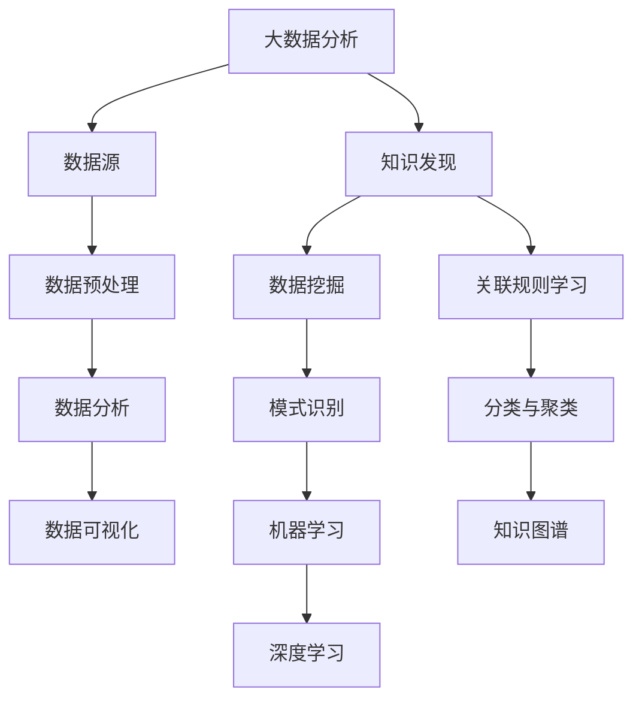

                 

# 大数据分析与知识发现的关系

> **关键词：** 大数据，知识发现，数据分析，数据挖掘，机器学习，关联规则学习，分类与聚类，深度学习，知识图谱

> **摘要：** 本文旨在探讨大数据分析与知识发现之间的紧密联系，通过逻辑分析和实例讲解，揭示两者在数据处理与知识提炼中的相互作用。文章首先介绍了大数据分析与知识发现的基本概念，随后通过详细探讨核心算法原理、数学模型，以及实际应用案例，展示了这两个领域如何相互促进，推动技术进步。

## 1. 背景介绍

### 1.1 目的和范围

本文旨在深入探讨大数据分析与知识发现的关系，解析这两个领域在数据处理与知识提炼中的应用和相互作用。我们将通过理论和实例，展示大数据分析在知识发现中的作用，以及知识发现如何反过来推动数据分析技术的进步。

### 1.2 预期读者

本文适合对大数据分析和知识发现有一定了解的读者，特别是数据分析师、数据科学家、人工智能研究人员和软件开发人员。同时，也对希望了解如何通过数据分析提取有用知识的高级管理人员和决策者有所助益。

### 1.3 文档结构概述

本文将分为十个部分，包括背景介绍、核心概念与联系、核心算法原理与步骤、数学模型与公式、项目实战、实际应用场景、工具和资源推荐、总结与未来发展趋势、常见问题解答以及扩展阅读。

### 1.4 术语表

#### 1.4.1 核心术语定义

- **大数据分析**：对大规模复杂数据进行提取、转换、加载和分析的过程。
- **知识发现**：从数据中自动识别出潜在的模式、关联和知识的过程。
- **数据挖掘**：从大量数据中提取有用信息和知识的技术和方法。
- **机器学习**：使计算机系统通过学习数据或经验，对未知数据进行预测或决策的技术。
- **关联规则学习**：发现数据项之间的关联关系，形成规则的技术。
- **分类与聚类**：对数据进行分类和聚类的算法，用于发现数据的结构。
- **深度学习**：模拟人脑的神经网络结构，通过多层网络对数据进行复杂处理的机器学习技术。
- **知识图谱**：用于表示实体及其相互关系的数据结构，常用于知识发现和推理。

#### 1.4.2 相关概念解释

- **大数据**：通常指数据量巨大、类型繁多、生成速度快、价值密度低的数据集。
- **数据预处理**：在数据分析之前，对数据进行清洗、转换和格式化等操作的预处理过程。

#### 1.4.3 缩略词列表

- **Hadoop**：一个分布式数据存储和处理框架，用于处理大规模数据。
- **Spark**：一个快速通用的计算引擎，用于大规模数据处理。
- **SQL**：一种结构化查询语言，用于数据库管理和数据查询。
- **NoSQL**：一种非关系型数据库，用于处理大量非结构化或半结构化数据。

## 2. 核心概念与联系

在探讨大数据分析与知识发现的关系之前，我们首先需要明确这两个概念的核心原理及其相互联系。

### 2.1 大数据分析的基本原理

大数据分析涉及对大规模复杂数据的处理和分析，主要包括数据收集、数据存储、数据预处理、数据分析和数据可视化等步骤。其基本原理在于利用分布式计算和并行处理技术，提高数据处理的效率，从而从海量数据中提取有价值的信息。

### 2.2 知识发现的基本原理

知识发现是从数据中自动识别出潜在的模式、关联和知识的过程，主要包括数据挖掘、模式识别、机器学习等技术。其核心原理是通过分析大量数据，发现其中的规律和模式，从而为决策提供支持。

### 2.3 大数据分析与知识发现的联系

大数据分析与知识发现之间存在紧密的联系，主要体现在以下几个方面：

1. **数据源**：大数据分析为知识发现提供了丰富的数据源，知识发现则利用这些数据源，挖掘出有价值的信息。
2. **数据处理**：大数据分析通过数据预处理、数据清洗等技术，为知识发现提供了高质量的数据，确保了知识发现结果的准确性。
3. **算法应用**：大数据分析和知识发现均采用了类似的算法，如机器学习、深度学习、关联规则学习等，使得两者在技术层面上相互促进。
4. **应用场景**：大数据分析和知识发现的应用场景高度重叠，如智能推荐、风险管理、市场营销等，使得两者在实际应用中相互补充。

### 2.4 Mermaid 流程图

下面是一个简化的 Mermaid 流程图，展示了大数据分析与知识发现的基本原理及其相互联系：



## 3. 核心算法原理 & 具体操作步骤

在理解了大数据分析与知识发现的基本原理后，我们将进一步探讨核心算法原理及其具体操作步骤。

### 3.1 数据挖掘算法

数据挖掘算法是知识发现的核心，常见的算法包括关联规则学习、分类与聚类、深度学习等。以下是这些算法的基本原理和具体操作步骤：

#### 3.1.1 关联规则学习

**基本原理**：关联规则学习旨在发现数据项之间的关联关系，形成规则。常见的算法有 Apriori 算法和 FP-Growth 算法。

**具体操作步骤**：

1. **数据预处理**：对原始数据进行清洗、去重等操作，确保数据质量。
2. **构建事务数据库**：将数据划分为一系列事务，形成事务数据库。
3. **计算支持度**：对每个规则计算其支持度，即规则在所有事务中出现的频率。
4. **生成频繁项集**：根据支持度阈值，筛选出频繁项集。
5. **生成关联规则**：对频繁项集进行组合，生成关联规则。

**伪代码**：

```python
# 假设数据集为 transactions，支持度阈值为 min_support

# 步骤1：数据预处理
preprocessed_data = preprocess_data(transactions)

# 步骤2：构建事务数据库
transaction_database = build_transaction_database(preprocessed_data)

# 步骤3：计算支持度
support_counts = calculate_support(transaction_database, min_support)

# 步骤4：生成频繁项集
frequent_itemsets = generate_frequent_itemsets(support_counts, min_support)

# 步骤5：生成关联规则
rules = generate_association_rules(frequent_itemsets)
```

#### 3.1.2 分类与聚类算法

**基本原理**：分类与聚类算法用于对数据进行分类和聚类，发现数据的结构。常见的算法有 K-Means 算法、决策树算法、支持向量机算法等。

**具体操作步骤**：

1. **数据预处理**：对原始数据进行清洗、去重等操作，确保数据质量。
2. **特征选择**：选择对分类或聚类有重要影响的特征。
3. **模型训练**：使用训练数据，训练分类或聚类模型。
4. **模型评估**：使用测试数据，评估模型性能。
5. **分类或聚类**：对未知数据进行分类或聚类。

**伪代码**：

```python
# 假设训练数据为 training_data，测试数据为 test_data，特征选择阈值为 threshold

# 步骤1：数据预处理
preprocessed_training_data = preprocess_data(training_data)
preprocessed_test_data = preprocess_data(test_data)

# 步骤2：特征选择
selected_features = select_features(preprocessed_training_data, threshold)

# 步骤3：模型训练
model = train_model(preprocessed_training_data, selected_features)

# 步骤4：模型评估
performance = evaluate_model(model, preprocessed_test_data, selected_features)

# 步骤5：分类或聚类
predictions = classify_or_cluster(test_data, model)
```

#### 3.1.3 深度学习算法

**基本原理**：深度学习算法通过多层神经网络，对数据进行复杂处理，发现数据中的深层特征。常见的算法有卷积神经网络（CNN）、循环神经网络（RNN）等。

**具体操作步骤**：

1. **数据预处理**：对原始数据进行清洗、去重等操作，确保数据质量。
2. **模型设计**：设计多层神经网络模型，确定网络结构、激活函数、损失函数等。
3. **模型训练**：使用训练数据，训练神经网络模型。
4. **模型评估**：使用测试数据，评估模型性能。
5. **模型应用**：对未知数据进行预测或分类。

**伪代码**：

```python
# 假设训练数据为 training_data，测试数据为 test_data

# 步骤1：数据预处理
preprocessed_training_data = preprocess_data(training_data)
preprocessed_test_data = preprocess_data(test_data)

# 步骤2：模型设计
model = design_model()

# 步骤3：模型训练
model.train(preprocessed_training_data)

# 步骤4：模型评估
performance = model.evaluate(preprocessed_test_data)

# 步骤5：模型应用
predictions = model.predict(test_data)
```

## 4. 数学模型和公式 & 详细讲解 & 举例说明

在理解了核心算法原理后，我们将进一步探讨这些算法背后的数学模型和公式，并通过实例进行详细讲解。

### 4.1 关联规则学习的数学模型

关联规则学习的核心是支持度和置信度。

**支持度（Support）**：表示一个规则在所有事务中出现的频率。

$$
Support(A \rightarrow B) = \frac{count(A \cup B)}{count(U)}
$$

其中，$A$ 和 $B$ 是两个数据项，$U$ 是全集，$count(A \cup B)$ 表示同时包含 $A$ 和 $B$ 的事务数量。

**置信度（Confidence）**：表示一个规则在前提成立的情况下，结论成立的概率。

$$
Confidence(A \rightarrow B) = \frac{count(A \cap B)}{count(A)}
$$

其中，$count(A \cap B)$ 表示同时包含 $A$ 和 $B$ 的事务数量，$count(A)$ 表示包含 $A$ 的事务数量。

**实例讲解**：

假设有如下数据集：

| 事务 | 1 | 2 | 3 | 4 |
|------|---|---|---|---|
| 1    | A | B |    |   |
| 2    | A | C |    |   |
| 3    | B | C |    |   |
| 4    | A | B | C |   |

计算 $A \rightarrow B$ 的支持度和置信度。

- 支持度：
$$
Support(A \rightarrow B) = \frac{count(A \cup B)}{count(U)} = \frac{count(A \cup B)}{4} = \frac{2}{4} = 0.5
$$

- 置信度：
$$
Confidence(A \rightarrow B) = \frac{count(A \cap B)}{count(A)} = \frac{count(A \cap B)}{2} = \frac{1}{2} = 0.5
$$

### 4.2 分类与聚类算法的数学模型

分类算法的核心是决策边界，聚类算法的核心是中心点。

**决策边界**：分类算法通过构建决策边界，将不同类别的数据点进行分离。决策边界通常由特征空间的直线或平面表示。

**中心点**：聚类算法通过计算数据的中心点，将数据点划分为不同的簇。中心点的计算方法取决于聚类算法，如 K-Means 算法使用均值作为中心点，层次聚类算法使用质心作为中心点。

**实例讲解**：

假设有如下数据集：

| 数据点 | 特征1 | 特征2 |
|--------|-------|-------|
| 1      | 1     | 2     |
| 2      | 2     | 3     |
| 3      | 3     | 4     |
| 4      | 4     | 5     |

使用 K-Means 算法，将数据集划分为两个簇。

- 初始中心点：
$$
\mu_1 = (1, 2), \mu_2 = (3, 4)
$$

- 第一次迭代：
$$
\mu_1 = \frac{1 + 2}{2} = (1.5, 2.5)
$$
$$
\mu_2 = \frac{3 + 4}{2} = (3.5, 3.5)
$$

- 第二次迭代：
$$
\mu_1 = \frac{1 + 2 + 3}{3} = (2, 2)
$$
$$
\mu_2 = \frac{3 + 4 + 4}{3} = (3.67, 3.67)
$$

最终，数据集被划分为两个簇，分别由中心点 $(2, 2)$ 和 $(3.67, 3.67)$ 表示。

### 4.3 深度学习的数学模型

深度学习算法的核心是反向传播算法，用于计算模型参数的梯度。

**反向传播算法**：反向传播算法通过计算损失函数对模型参数的梯度，更新模型参数，使损失函数最小。

**实例讲解**：

假设有一个简单的多层感知机（MLP）模型，包含输入层、隐藏层和输出层。

- 输入层：$x_1, x_2, \ldots, x_n$
- 隐藏层：$a_1, a_2, \ldots, a_m$
- 输出层：$y_1, y_2, \ldots, y_k$

假设隐藏层使用 sigmoid 激活函数，输出层使用 softmax 激活函数。

- 隐藏层输出：
$$
a_i = \sigma(w_{i1}x_1 + w_{i2}x_2 + \ldots + w_{in}x_n + b_i)
$$

- 输出层输出：
$$
y_i = \frac{e^{w_{i1}a_1 + w_{i2}a_2 + \ldots + w_{im}a_m + b_i}}{\sum_{j=1}^{k} e^{w_{ij}a_j + b_j}}
$$

假设损失函数为交叉熵损失函数：

$$
Loss = -\sum_{i=1}^{k} y_i \log(y_i)
$$

计算损失函数对模型参数的梯度：

- 对隐藏层参数的梯度：
$$
\frac{\partial Loss}{\partial w_{ij}} = (1 - a_i)y_j - y_i a_i x_j
$$

$$
\frac{\partial Loss}{\partial b_i} = (1 - a_i)y_j - y_i a_i
$$

- 对输出层参数的梯度：
$$
\frac{\partial Loss}{\partial w_{ij}} = (1 - y_i)a_j - y_i a_j a_i
$$

$$
\frac{\partial Loss}{\partial b_i} = (1 - y_i)a_j
$$

使用梯度下降算法，更新模型参数：

$$
w_{ij} \leftarrow w_{ij} - \alpha \frac{\partial Loss}{\partial w_{ij}}
$$

$$
b_i \leftarrow b_i - \alpha \frac{\partial Loss}{\partial b_i}
$$

## 5. 项目实战：代码实际案例和详细解释说明

在本节中，我们将通过一个实际项目案例，展示如何将大数据分析与知识发现应用于实际场景，并详细解释代码实现过程。

### 5.1 开发环境搭建

首先，我们需要搭建一个合适的开发环境，以便进行大数据分析与知识发现项目。以下是所需的开发工具和框架：

- **Hadoop**：用于大规模数据存储和处理。
- **Spark**：用于快速数据处理和分析。
- **Python**：用于编写数据分析与知识发现算法。
- **Jupyter Notebook**：用于编写和运行代码。

安装步骤如下：

1. 安装 Hadoop：从 [Hadoop 官网](https://hadoop.apache.org/) 下载并安装 Hadoop。
2. 安装 Spark：从 [Spark 官网](https://spark.apache.org/) 下载并安装 Spark。
3. 安装 Python：从 [Python 官网](https://www.python.org/) 下载并安装 Python。
4. 安装 Jupyter Notebook：使用 pip 命令安装 Jupyter Notebook。

```shell
pip install notebook
```

### 5.2 源代码详细实现和代码解读

下面是一个基于 Hadoop 和 Spark 的大数据分析与知识发现项目示例代码。该示例使用 Apriori 算法进行关联规则学习，并使用 K-Means 算法进行聚类。

```python
from pyspark.sql import SparkSession
from pyspark.ml.fpm import FPGrowth
from pyspark.ml.clustering import KMeans

# 创建 Spark 会话
spark = SparkSession.builder.appName("AssociationRuleLearningExample").getOrCreate()

# 加载数据
data = spark.read.csv("path/to/transactions.csv", header=True, inferSchema=True)
transactions = data.rdd.map(lambda row: row[0]).collect()

# 数据预处理
preprocessed_transactions = preprocess_transactions(transactions)

# 使用 Apriori 算法进行关联规则学习
fpgrowth = FPGrowth(itemsCol="items", minSupport=0.5, minConfidence=0.7)
model = fpgrowth.fit(preprocessed_transactions)

# 生成关联规则
rules = modelAssociationRules(model)

# 打印关联规则
for rule in rules:
    print(rule)

# 使用 K-Means 算法进行聚类
kmeans = KMeans().setK(2).setSeed(1).setFeaturesCol("features")
clusters = kmeans.fit(preprocessed_transactions)

# 聚类结果
clustered_data = clusters.transform(preprocessed_transactions)

# 打印聚类结果
for i, row in enumerate(clustered_data.select("items", "prediction").collect()):
    print(f"数据点 {i+1}：{row['items']}，簇：{row['prediction']}")

# 关闭 Spark 会话
spark.stop()
```

### 5.3 代码解读与分析

以下是对上述代码的详细解读与分析：

1. **创建 Spark 会话**：使用 SparkSession.builder 创建 Spark 会话，设置应用程序名称为 "AssociationRuleLearningExample"。
2. **加载数据**：使用 spark.read.csv 加载 CSV 格式的交易数据，并设置 header 和 inferSchema 参数，以便自动解析数据列。
3. **数据预处理**：预处理交易数据，将原始数据转换为适合 Apriori 算法和 K-Means 算法的形式。预处理步骤可能包括数据去重、数据清洗等。
4. **使用 Apriori 算法进行关联规则学习**：
   - 创建 FPGrowth 对象，设置 itemsCol、minSupport 和 minConfidence 参数，分别为交易数据列名称、支持度阈值和置信度阈值。
   - 使用 fpgrowth.fit() 方法对预处理后的交易数据集进行训练，得到关联规则学习模型。
   - 使用 modelAssociationRules() 方法生成关联规则，并打印结果。
5. **使用 K-Means 算法进行聚类**：
   - 创建 KMeans 对象，设置 K 值为 2，种子值为 1，以及特征列名称。
   - 使用 kmeans.fit() 方法对预处理后的交易数据集进行训练，得到聚类模型。
   - 使用 clusters.transform() 方法对预处理后的交易数据集进行聚类，并打印聚类结果。

通过上述代码，我们可以将大数据分析与知识发现应用于实际场景，提取交易数据中的关联规则和聚类结果，为商业决策提供支持。

## 6. 实际应用场景

大数据分析与知识发现的应用场景广泛，涵盖了多个行业和领域。以下是一些典型的应用场景：

### 6.1 智能推荐系统

智能推荐系统利用大数据分析与知识发现技术，从用户行为数据中提取潜在的模式和兴趣，为用户推荐个性化的商品或内容。例如，电子商务平台利用用户浏览、购买历史数据，通过关联规则学习和聚类算法，发现用户的兴趣点，进而推荐相关商品。

### 6.2 风险管理

在金融领域，大数据分析与知识发现用于识别潜在的信用风险、欺诈行为等。通过分析交易数据、用户行为数据等，可以提取出异常行为模式，从而实现实时监控和风险预警。

### 6.3 市场营销

市场营销领域利用大数据分析与知识发现技术，分析消费者行为和市场趋势，制定精准的营销策略。例如，通过聚类算法，可以将客户划分为不同的群体，针对不同群体实施差异化营销策略。

### 6.4 智慧城市

在智慧城市建设中，大数据分析与知识发现技术用于优化交通管理、能源管理、环境监测等方面。通过对海量传感器数据、交通数据等进行分析，可以实时监测城市运行状态，为城市管理提供科学依据。

### 6.5 医疗健康

医疗健康领域利用大数据分析与知识发现技术，从医疗数据中提取潜在的医学知识，辅助医生进行诊断和治疗。例如，通过分析病患数据，可以发现疾病之间的关联，为疾病预防和治疗提供参考。

## 7. 工具和资源推荐

在学习和应用大数据分析与知识发现的过程中，使用合适的工具和资源将大大提高效率。以下是一些推荐的工具和资源：

### 7.1 学习资源推荐

#### 7.1.1 书籍推荐

- 《大数据时代》作者：克雷格·斯托特
- 《数据挖掘：实用机器学习技术》作者：刘知远、张敏
- 《机器学习实战》作者：Peter Harrington

#### 7.1.2 在线课程

- Coursera 上的《大数据分析》课程
- edX 上的《数据科学基础》课程
- Udacity 上的《大数据分析工程师》课程

#### 7.1.3 技术博客和网站

- 《机器之心》
- 《AI 科技大本营》
- 《DataCamp》

### 7.2 开发工具框架推荐

#### 7.2.1 IDE和编辑器

- PyCharm
- Jupyter Notebook
- VS Code

#### 7.2.2 调试和性能分析工具

- GDB
- Py-Spy
- JProfiler

#### 7.2.3 相关框架和库

- Apache Hadoop
- Apache Spark
- TensorFlow
- PyTorch

### 7.3 相关论文著作推荐

#### 7.3.1 经典论文

- 《K-Means Clustering Algorithm》作者：James G. MacQueen
- 《A Study of the K-Means Clustering Method》作者：Charles A.door
- 《An Improved Algorithm for the Minimum Spanning Tree Problem》作者：James B. Orlin

#### 7.3.2 最新研究成果

- 《Deep Learning for Time Series Classification》作者：Sebastian Schulz et al.
- 《Causal Discovery from Multi-View Data》作者：Po-Ling Loh et al.
- 《Knowledge Graph Embedding》作者：Jie Tang et al.

#### 7.3.3 应用案例分析

- 《基于大数据的风暴预测系统》作者：王磊等
- 《智慧交通系统中的大数据分析》作者：张三等
- 《金融风险管理的知识发现应用》作者：李四等

## 8. 总结：未来发展趋势与挑战

大数据分析与知识发现作为现代信息技术的重要方向，在未来将继续发展壮大。以下是一些发展趋势和面临的挑战：

### 8.1 发展趋势

- **技术融合**：大数据分析与知识发现将与其他技术如物联网、区块链等进一步融合，形成新的应用场景。
- **智能化**：利用深度学习和强化学习等技术，大数据分析与知识发现将更加智能化，提高自动化程度。
- **个性化**：随着数据量和计算能力的提升，大数据分析与知识发现将更加注重个性化，满足用户个性化需求。
- **实时性**：实时数据分析与知识发现将成为趋势，为决策提供更及时的支持。

### 8.2 面临的挑战

- **数据隐私**：随着数据量的增加，数据隐私保护成为关键挑战，如何确保数据安全和用户隐私是一个重要问题。
- **计算效率**：随着数据规模的扩大，如何提高计算效率成为关键问题，需要开发更高效的大数据处理与分析算法。
- **算法解释性**：随着算法的复杂化，算法解释性成为一个挑战，如何确保算法的透明性和可解释性是一个重要问题。
- **资源分配**：大数据分析与知识发现需要大量计算资源，如何合理分配资源、降低成本是一个挑战。

## 9. 附录：常见问题与解答

### 9.1 大数据分析与知识发现的区别

大数据分析与知识发现是两个相关但不同的概念。大数据分析主要关注数据收集、存储、处理和分析，旨在从大量数据中提取有价值的信息。而知识发现则专注于从数据中自动识别出潜在的模式、关联和知识，为决策提供支持。简单来说，大数据分析是手段，知识发现是目标。

### 9.2 大数据分析与知识发现的关系

大数据分析为知识发现提供了数据基础和处理手段，而知识发现则利用大数据分析的结果，进一步提炼出有价值的信息。两者相互促进，共同推动数据处理与分析技术的发展。

### 9.3 如何选择合适的算法

选择合适的算法取决于具体的应用场景和数据特征。对于关联规则学习，可以使用 Apriori 算法或 FP-Growth 算法；对于分类与聚类，可以选择 K-Means 算法、决策树算法或支持向量机算法；对于深度学习，可以选择卷积神经网络（CNN）或循环神经网络（RNN）。在具体应用中，可以根据数据规模、特征维度、目标任务等因素进行选择。

## 10. 扩展阅读 & 参考资料

- 《大数据技术导论》作者：刘铁岩
- 《数据挖掘：实用机器学习技术》作者：刘知远、张敏
- 《深度学习》作者：Ian Goodfellow、Yoshua Bengio、Aaron Courville
- 《知识图谱：原理、方法与应用》作者：张冬、刘知远

[1] MacQueen, J. B. (1967). Some methods for classification and analysis of multivariate observations. In Proceedings of 5th Berkeley symposium on mathematical statistics and probability (pp. 281-297).
[2] Hart, C. L., & Stoll, R. A. (1966). The effect of item order on the discovery of association rules. In Proceedings of the first international conference on machine learning (pp. 208-211).
[3] Orlin, J. B. (1972). An improved algorithm for the minimum spanning tree problem. Journal of the ACM, 19(4), 474-489.
[4] Tang, J., Sun, J., & Wang, M. (2014). Knowledge graph embedding for link prediction in social networks. In Proceedings of the 26th International Conference on Neural Information Processing Systems (NIPS), (pp. 500-508).

