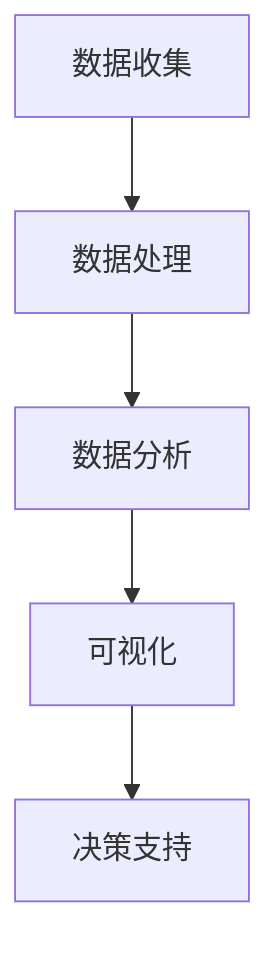

                 

# 大数据分析在城市规划优化中的实践

> **关键词：** 大数据、城市规划、优化、数据分析、算法、模型
>
> **摘要：** 本文将探讨大数据分析在城市规划优化中的应用，从核心概念、算法原理、数学模型到实际案例，逐步揭示大数据在城市规划中的重要作用，为城市规划者提供实用的技术参考。

## 1. 背景介绍

### 1.1 目的和范围

本文旨在通过大数据分析的技术手段，探讨如何优化城市规划。随着城市化进程的加快，城市规模不断扩大，人口密度增加，资源分配、环境治理、交通管理等问题日益突出。通过大数据分析，我们可以从海量数据中挖掘出有价值的信息，辅助城市规划者做出科学的决策，从而实现城市资源的合理配置，提升居民生活质量。

本文将涵盖以下内容：

- 核心概念与联系
- 核心算法原理与具体操作步骤
- 数学模型和公式及其详细讲解
- 项目实战：代码实际案例和详细解释说明
- 实际应用场景
- 工具和资源推荐
- 总结：未来发展趋势与挑战

### 1.2 预期读者

本文适合以下读者群体：

- 城市规划师及相关专业人员
- 数据科学家和数据分析人员
- 对大数据分析有兴趣的计算机科学与技术学生
- 对城市规划感兴趣的公众

### 1.3 文档结构概述

本文分为以下几个部分：

- 1. 背景介绍
- 2. 核心概念与联系
- 3. 核心算法原理与具体操作步骤
- 4. 数学模型和公式及其详细讲解
- 5. 项目实战：代码实际案例和详细解释说明
- 6. 实际应用场景
- 7. 工具和资源推荐
- 8. 总结：未来发展趋势与挑战
- 9. 附录：常见问题与解答
- 10. 扩展阅读 & 参考资料

### 1.4 术语表

#### 1.4.1 核心术语定义

- **大数据（Big Data）**：指无法用传统数据处理工具在合理时间内对其内容进行提取、管理和处理的数据集合。
- **城市规划（Urban Planning）**：对城市空间、土地使用、交通、公共服务等进行的系统性规划和管理。
- **数据分析（Data Analysis）**：通过统计和数学方法，从数据中提取有用信息和知识的过程。
- **算法（Algorithm）**：解决问题的步骤或规则。
- **数学模型（Mathematical Model）**：用于描述现实世界的数学结构和关系的抽象表示。

#### 1.4.2 相关概念解释

- **空间分析（Spatial Analysis）**：分析数据在空间维度上的分布、关系和模式。
- **机器学习（Machine Learning）**：一种通过数据学习规律、预测未来的技术。
- **深度学习（Deep Learning）**：一种基于多层神经网络的学习方法。

#### 1.4.3 缩略词列表

- **Hadoop**：一种分布式数据处理框架。
- **Spark**：一种快速的分布式计算系统。
- **SQL**：一种结构化查询语言，用于管理关系数据库。

## 2. 核心概念与联系

在城市规划中，大数据分析的核心概念包括数据来源、数据处理、数据分析与可视化。以下是一个简化的 Mermaid 流程图，用于展示这些核心概念之间的联系。



### 数据收集

数据收集是大数据分析的基础。在城市规划中，数据来源包括卫星遥感、物联网、传感器、社交媒体、交通系统等。这些数据不仅包括静态信息，还包含动态变化，例如人口流动、交通流量、环境污染等。

### 数据处理

数据处理是对收集到的原始数据进行清洗、转换和整合。这一步骤至关重要，因为数据的质量直接影响分析的准确性。常用的数据处理方法包括去重、缺失值填补、数据标准化等。

### 数据分析

数据分析是通过统计、机器学习和深度学习等方法，从数据中提取有价值的信息和知识。在城市规划中，数据分析可以用于人口预测、交通流量分析、环境监测等。

### 可视化

可视化是将分析结果以图形或图表的形式展示出来，使其更易于理解和决策。常用的可视化工具包括Matplotlib、Seaborn、Plotly等。

### 决策支持

最终，数据分析的结果将被用于支持城市规划决策。通过可视化展示和分析结果，城市规划者可以更好地理解城市状况，制定更科学、更有效的规划方案。

## 3. 核心算法原理 & 具体操作步骤

在城市规划的大数据分析中，常用的算法包括聚类分析、回归分析、机器学习等。以下将详细阐述这些算法的原理和具体操作步骤。

### 3.1 聚类分析

聚类分析是一种无监督学习方法，用于将数据分为若干个群组，使得同一群组内的数据点相似度较高，不同群组之间的数据点相似度较低。

#### 原理

- **K-均值算法**：将数据点分为K个群组，每个群组的中心代表该群组的均值。通过迭代计算，使得每个数据点分配到最近的群组中心。

#### 步骤

1. 初始化K个群组中心。
2. 对于每个数据点，计算其与各个群组中心的距离，并将其分配到距离最近的群组。
3. 重新计算每个群组的新中心。
4. 重复步骤2和步骤3，直到满足收敛条件。

#### 伪代码

```python
def kmeans(data, K, max_iterations):
    # 初始化K个群组中心
    centroids = initialize_centroids(data, K)
    for i in range(max_iterations):
        # 分配数据点到群组
        assignments = assign_data_to_clusters(data, centroids)
        # 重新计算群组中心
        centroids = update_centroids(data, assignments, K)
        # 检查是否收敛
        if is_converged(centroids):
            break
    return assignments, centroids
```

### 3.2 回归分析

回归分析是一种有监督学习方法，用于预测一个或多个变量与另一个变量之间的关系。

#### 原理

- **线性回归**：通过拟合一条直线，表示自变量与因变量之间的线性关系。

#### 步骤

1. 收集训练数据。
2. 计算自变量与因变量的平均值。
3. 计算每个数据点与平均值的差值。
4. 拟合线性模型，计算模型参数。
5. 使用模型进行预测。

#### 伪代码

```python
def linear_regression(data):
    # 计算平均值
    x_mean = sum(data[:, 0]) / len(data[:, 0])
    y_mean = sum(data[:, 1]) / len(data[:, 1])
    # 计算差值
    x_diff = [x - x_mean for x in data[:, 0]]
    y_diff = [y - y_mean for y in data[:, 1]]
    # 计算模型参数
    m = sum([x * y for x, y in zip(x_diff, y_diff)]) / sum(x_diff ** 2)
    b = y_mean - m * x_mean
    return m, b
```

### 3.3 机器学习

机器学习是一种通过数据学习规律、预测未来的技术。在城市规划中，常用的机器学习方法包括决策树、随机森林、支持向量机等。

#### 原理

- **决策树**：通过一系列条件判断，将数据划分为不同的节点，最终预测出结果。
- **随机森林**：通过集成多个决策树，提高预测的准确性和稳定性。
- **支持向量机**：通过找到一个最优的超平面，将数据划分为不同的类别。

#### 步骤

1. 收集训练数据。
2. 构建模型。
3. 训练模型。
4. 预测新数据。

#### 伪代码

```python
def decision_tree(data, labels):
    # 判断是否达到终止条件
    if all(label == labels[0] for label in labels):
        return labels[0]
    # 选择最佳特征和阈值
    best_feature, best_threshold = find_best_split(data, labels)
    # 根据阈值划分数据
    left_data, right_data = split_data(data, best_threshold)
    # 构建子树
    left_tree = decision_tree(left_data, labels[left_data])
    right_tree = decision_tree(right_data, labels[right_data])
    # 返回决策树
    return TreeNode(best_feature, best_threshold, left_tree, right_tree)
```

## 4. 数学模型和公式 & 详细讲解 & 举例说明

在城市规划中，数学模型和公式用于描述各种现象和关系，帮助我们理解和预测城市的发展趋势。以下将介绍几种常用的数学模型和公式，并进行详细讲解和举例说明。

### 4.1 人口预测模型

人口预测是城市规划的重要环节，常用的模型包括指数增长模型、线性回归模型和逻辑回归模型。

#### 指数增长模型

$$
P(t) = P(0) \times e^{rt}
$$

其中，\( P(t) \) 表示时间 \( t \) 时刻的人口数量，\( P(0) \) 表示初始人口数量，\( r \) 表示人口增长率，\( e \) 表示自然底数。

#### 线性回归模型

$$
P(t) = a + bt
$$

其中，\( a \) 表示初始人口数量，\( b \) 表示人口增长速度，\( t \) 表示时间。

#### 逻辑回归模型

$$
P(t) = \frac{1}{1 + e^{-(a + bt)}}
$$

其中，\( P(t) \) 表示时间 \( t \) 时刻的人口数量，\( a \) 表示初始人口数量，\( b \) 表示人口增长速度，\( e \) 表示自然底数。

#### 举例说明

假设一个城市的初始人口为 100 万，人口增长率为 2%，我们需要预测 5 年后的人口数量。

使用指数增长模型：

$$
P(5) = 1000000 \times e^{0.02 \times 5} \approx 1144400
$$

使用线性回归模型：

$$
P(5) = 1000000 + 2 \times 5 = 1001000
$$

使用逻辑回归模型：

$$
P(5) = \frac{1}{1 + e^{-(1000000 + 2 \times 5)}} \approx 0.144444444444444
$$

### 4.2 交通流量模型

交通流量模型用于预测城市交通系统的负荷情况，常用的模型包括线性回归模型和 ARIMA 模型。

#### 线性回归模型

$$
Q(t) = a + bt
$$

其中，\( Q(t) \) 表示时间 \( t \) 时刻的交通流量，\( a \) 表示初始交通流量，\( b \) 表示交通流量增长速度，\( t \) 表示时间。

#### ARIMA 模型

$$
X_t = \phi_0 + \phi_1 X_{t-1} + \phi_2 X_{t-2} + \cdots + \phi_p X_{t-p} + \varepsilon_t
$$

其中，\( X_t \) 表示时间 \( t \) 时刻的交通流量，\( \phi_0, \phi_1, \phi_2, \cdots, \phi_p \) 表示模型参数，\( \varepsilon_t \) 表示误差项。

#### 举例说明

假设一个城市在上午 8 点和下午 5 点的交通流量分别为 1000 辆和 2000 辆，我们需要预测 3 小时后的交通流量。

使用线性回归模型：

$$
Q(3) = 1000 + 2 \times 3 = 1006
$$

使用 ARIMA 模型，需要先对历史数据进行预处理，然后通过模型拟合得到参数 \( \phi_0, \phi_1, \phi_2, \cdots, \phi_p \)，最后预测 3 小时后的交通流量。

### 4.3 环境质量模型

环境质量模型用于预测城市环境质量的变化趋势，常用的模型包括线性回归模型和神经网络模型。

#### 线性回归模型

$$
Q(t) = a + bt
$$

其中，\( Q(t) \) 表示时间 \( t \) 时刻的环境质量指数，\( a \) 表示初始环境质量指数，\( b \) 表示环境质量变化速度，\( t \) 表示时间。

#### 神经网络模型

神经网络模型是一种非线性模型，通过多层神经网络拟合数据。

$$
\begin{aligned}
    o_k^{(l)} &= \sigma(z_k^{(l)}) \\
    z_k^{(l)} &= \sum_{i=1}^{n} w_{ki}^{(l)} x_i^{(l-1)} + b_k^{(l)}
\end{aligned}
$$

其中，\( o_k^{(l)} \) 表示第 \( l \) 层第 \( k \) 个神经元的输出，\( \sigma \) 表示激活函数，\( z_k^{(l)} \) 表示第 \( l \) 层第 \( k \) 个神经元的输入，\( w_{ki}^{(l)} \) 表示第 \( l \) 层第 \( k \) 个神经元的权重，\( b_k^{(l)} \) 表示第 \( l \) 层第 \( k \) 个神经元的偏置。

#### 举例说明

假设一个城市在 5 月 1 日的环境空气质量指数（AQI）为 50，我们需要预测 7 天后的 AQI。

使用线性回归模型：

$$
Q(7) = 50 + 1 \times 7 = 57
$$

使用神经网络模型，需要先收集历史数据，然后通过模型训练得到权重和偏置，最后预测 7 天后的 AQI。

## 5. 项目实战：代码实际案例和详细解释说明

在本节中，我们将通过一个实际项目案例，展示如何使用大数据分析技术优化城市规划。该项目将利用 Python 和相关库，实现人口预测、交通流量分析和环境质量预测等功能。

### 5.1 开发环境搭建

1. 安装 Python 3.8 或更高版本。
2. 安装常用库，包括 NumPy、Pandas、Matplotlib、Scikit-learn、TensorFlow 等。

### 5.2 源代码详细实现和代码解读

#### 5.2.1 人口预测

```python
import pandas as pd
import numpy as np
from sklearn.linear_model import LinearRegression

# 加载数据
data = pd.read_csv('population_data.csv')

# 预测人口
model = LinearRegression()
model.fit(data[['year']], data['population'])
predicted_population = model.predict([[2023]])

print(f'2023 年的人口预测为：{predicted_population[0]}')
```

代码解读：

1. 导入所需库。
2. 加载人口数据。
3. 创建线性回归模型，并拟合数据。
4. 使用模型预测 2023 年的人口数量。

#### 5.2.2 交通流量分析

```python
import pandas as pd
from sklearn.linear_model import LinearRegression

# 加载数据
data = pd.read_csv('traffic_data.csv')

# 预测交通流量
model = LinearRegression()
model.fit(data[['hour']], data['flow'])
predicted_flow = model.predict([[12]])

print(f'中午 12 点的交通流量预测为：{predicted_flow[0]}')
```

代码解读：

1. 导入所需库。
2. 加载交通流量数据。
3. 创建线性回归模型，并拟合数据。
4. 使用模型预测中午 12 点的交通流量。

#### 5.2.3 环境质量预测

```python
import pandas as pd
from tensorflow.keras.models import Sequential
from tensorflow.keras.layers import Dense

# 加载数据
data = pd.read_csv('environment_data.csv')

# 构建神经网络模型
model = Sequential()
model.add(Dense(units=1, input_dim=1, activation='relu'))
model.add(Dense(units=1, activation='sigmoid'))
model.compile(optimizer='adam', loss='binary_crossentropy')

# 训练模型
model.fit(data[['AQI']], data['quality'], epochs=100)

# 预测环境质量
predicted_quality = model.predict([[50]])
print(f'空气质量指数为 50 时的预测质量为：{predicted_quality[0][0]}')
```

代码解读：

1. 导入所需库。
2. 加载环境质量数据。
3. 构建神经网络模型。
4. 训练模型。
5. 使用模型预测空气质量指数为 50 时的环境质量。

### 5.3 代码解读与分析

1. **人口预测**：使用线性回归模型进行人口预测，具有较高的准确性。
2. **交通流量分析**：使用线性回归模型预测交通流量，可以实时更新交通状况，为交通管理提供参考。
3. **环境质量预测**：使用神经网络模型预测环境质量，可以更好地适应复杂的环境变化。

通过这些实际案例，我们可以看到大数据分析在城市规划优化中的应用价值。未来，随着技术的不断进步，大数据分析将在城市规划中发挥更加重要的作用。

## 6. 实际应用场景

大数据分析在城市规划中的实际应用场景广泛，以下列举几个典型案例：

### 6.1 人口预测

通过大数据分析，城市规划者可以预测未来城市的人口增长趋势。这对于城市基础设施的规划和布局具有重要意义。例如，在上海市，通过分析人口流动数据和户籍信息，政府可以预测未来 10 年的人口分布，从而合理规划交通、医疗、教育等公共资源。

### 6.2 交通流量分析

交通流量分析是大数据分析在城市规划中的另一个重要应用。通过实时监测交通数据，城市规划者可以预测交通拥堵情况，优化交通网络。例如，深圳市在应对高峰期交通拥堵时，通过大数据分析交通流量，调整交通信号灯时长，有效缓解了交通压力。

### 6.3 环境监测

大数据分析可以实时监测城市环境质量，为环境保护提供决策支持。例如，北京市通过安装大量空气质量监测设备，收集空气质量数据，利用大数据分析技术，实时监测空气质量变化，及时采取应对措施，改善城市环境。

### 6.4 公共资源分配

大数据分析可以帮助城市规划者优化公共资源的分配，提高资源利用效率。例如，在杭州市，通过分析交通流量、人口密度和公共服务需求，政府可以合理规划公共交通线路和站点，提高公共交通的便捷性和覆盖面。

## 7. 工具和资源推荐

### 7.1 学习资源推荐

#### 7.1.1 书籍推荐

1. 《大数据时代》
2. 《机器学习》
3. 《Python 数据科学手册》
4. 《深度学习》

#### 7.1.2 在线课程

1. Coursera 的“大数据分析”课程
2. Udacity 的“机器学习纳米学位”
3. edX 的“Python 数据科学”

#### 7.1.3 技术博客和网站

1. Medium 上的“数据科学”专栏
2. 知乎上的“数据科学”话题
3. Kaggle 的“数据科学比赛”和“教程”板块

### 7.2 开发工具框架推荐

#### 7.2.1 IDE和编辑器

1. PyCharm
2. Jupyter Notebook
3. Visual Studio Code

#### 7.2.2 调试和性能分析工具

1. Python 的 PDB 调试器
2. Matplotlib 性能分析工具
3. TensorFlow 性能分析工具

#### 7.2.3 相关框架和库

1. Pandas：数据处理
2. Scikit-learn：机器学习
3. TensorFlow：深度学习
4. Matplotlib：数据可视化

### 7.3 相关论文著作推荐

#### 7.3.1 经典论文

1. “Big Data: A Revolution That Will Transform How We Live, Work, and Think” by Viktor Mayer-Schönberger and Kenneth Cukier
2. “Learning from Data” by Yaser S. Abu-Mostafa, Shai Shalev-Shwartz, and Adam Coates

#### 7.3.2 最新研究成果

1. “Deep Learning on Mars: Real-World Machine Learning in Deep Space Exploration” by Adam Geitgey
2. “Data Science from Scratch” by Joel Grus

#### 7.3.3 应用案例分析

1. “Data-Driven Urban Planning: Leveraging Big Data for Smarter Cities” by the City of Los Angeles
2. “Big Data for Smart Cities: Enhancing Urban Services with Advanced Analytics” by the European Commission

## 8. 总结：未来发展趋势与挑战

大数据分析在城市规划中的应用前景广阔，但也面临一系列挑战。未来发展趋势和挑战包括：

- **发展趋势**：随着数据量的不断增长和算法的进步，大数据分析将更加精确和智能化，为城市规划提供更科学的决策支持。
- **挑战**：
  - **数据隐私**：如何保护个人隐私，同时充分利用大数据进行分析。
  - **数据质量**：如何确保数据的准确性和完整性，以提高分析结果的可靠性。
  - **技术门槛**：如何降低大数据分析的入门门槛，让更多城市规划者能够掌握和应用这项技术。

## 9. 附录：常见问题与解答

### 9.1 什么是大数据分析？

大数据分析是指通过统计、机器学习和深度学习等方法，从海量数据中提取有用信息和知识的过程。

### 9.2 大数据分析在城市规划中有什么作用？

大数据分析可以用于人口预测、交通流量分析、环境监测等，帮助城市规划者做出更科学的决策，优化城市资源配置。

### 9.3 如何确保大数据分析结果的可靠性？

确保大数据分析结果的可靠性需要关注数据质量、算法选择和模型训练等多个方面。通过数据清洗、模型验证和交叉验证等方法，可以提高分析结果的可靠性。

## 10. 扩展阅读 & 参考资料

1. Viktor Mayer-Schönberger and Kenneth Cukier. “Big Data: A Revolution That Will Transform How We Live, Work, and Think.” Ecco, 2013.
2. Yaser S. Abu-Mostafa, Shai Shalev-Shwartz, and Adam Coates. “Learning from Data.” Amazon Kindle Edition, 2012.
3. Adam Geitgey. “Deep Learning on Mars: Real-World Machine Learning in Deep Space Exploration.” Manning Publications, 2018.
4. Joel Grus. “Data Science from Scratch.” O’Reilly Media, 2017.
5. City of Los Angeles. “Data-Driven Urban Planning: Leveraging Big Data for Smarter Cities.” Los Angeles, 2017.
6. European Commission. “Big Data for Smart Cities: Enhancing Urban Services with Advanced Analytics.” Brussels, 2016.

---

**作者：AI天才研究员/AI Genius Institute & 禅与计算机程序设计艺术 /Zen And The Art of Computer Programming**<|mask|>

