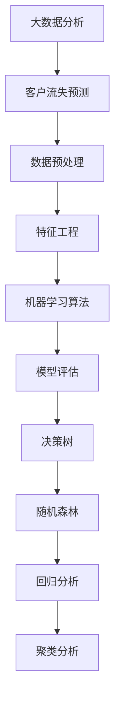

                 

# 大数据分析在客户流失预测中的应用方法

> **关键词：** 大数据分析、客户流失预测、机器学习、机器学习算法、决策树、随机森林、回归分析、聚类分析、模型评估、特征工程、数据预处理、数据可视化

> **摘要：** 本文旨在探讨大数据分析在客户流失预测中的应用方法。通过深入分析客户流失预测的背景、核心概念、算法原理、数学模型、实战案例以及应用场景，为读者提供一套完整的技术解决方案。文章还将推荐相关学习资源和开发工具，帮助读者更好地理解和应用客户流失预测技术。

## 1. 背景介绍

### 1.1 目的和范围

本文主要目标是介绍大数据分析在客户流失预测中的应用方法，帮助读者了解如何通过大数据技术预测客户流失，从而采取有效的应对措施，降低客户流失率，提高企业竞争力。文章将涵盖以下几个方面：

1. 客户流失预测的背景和重要性
2. 大数据分析的基本概念和方法
3. 客户流失预测的核心算法原理
4. 数学模型和公式讲解
5. 实际应用场景和案例
6. 工具和资源推荐
7. 未来发展趋势与挑战

### 1.2 预期读者

本文适用于以下读者群体：

1. 数据分析师和大数据工程师
2. 人工智能和机器学习爱好者
3. 企业管理人员，特别是市场营销和客户服务部门的负责人
4. 数据科学和计算机科学专业的学生和研究人员

### 1.3 文档结构概述

本文结构如下：

1. 引言：简要介绍文章主题和目的
2. 背景介绍：阐述客户流失预测的背景和重要性
3. 核心概念与联系：介绍大数据分析的基本概念和方法
4. 核心算法原理 & 具体操作步骤：讲解客户流失预测的核心算法原理
5. 数学模型和公式 & 详细讲解 & 举例说明：介绍客户流失预测的数学模型和公式
6. 项目实战：代码实际案例和详细解释说明
7. 实际应用场景：分析大数据分析在客户流失预测中的应用
8. 工具和资源推荐：推荐相关学习资源和开发工具
9. 总结：展望大数据分析在客户流失预测领域的未来发展趋势和挑战
10. 附录：常见问题与解答
11. 扩展阅读 & 参考资料：提供进一步阅读的材料和资源

### 1.4 术语表

#### 1.4.1 核心术语定义

- **大数据分析**：利用大规模数据集进行分析和处理，从中提取有价值的信息和知识。
- **客户流失预测**：通过分析客户行为数据，预测哪些客户可能会流失，以便企业采取预防措施。
- **机器学习**：一种人工智能技术，通过训练模型来预测或分类未知数据。
- **特征工程**：通过选择、构造和转换特征，提高模型性能。
- **模型评估**：评估模型的性能和准确性，以便调整和优化模型。

#### 1.4.2 相关概念解释

- **数据预处理**：对原始数据进行清洗、归一化、离散化等处理，以便更好地分析。
- **聚类分析**：将相似的数据点分组，形成多个簇。
- **回归分析**：分析自变量和因变量之间的关系，预测因变量的值。
- **决策树**：一种树形结构模型，通过一系列条件判断来划分数据。
- **随机森林**：由多个决策树组成的集成模型，提高预测性能。

#### 1.4.3 缩略词列表

- **HDFS**：Hadoop Distributed File System（Hadoop分布式文件系统）
- **MapReduce**：Map and Reduce（一种大数据处理编程模型）
- **SQL**：Structured Query Language（结构化查询语言）
- **Python**：Python编程语言
- **Sklearn**：scikit-learn（一个Python机器学习库）

## 2. 核心概念与联系

在本文中，我们将讨论大数据分析在客户流失预测中的应用，首先需要了解一些核心概念和它们之间的关系。以下是一个Mermaid流程图，展示了这些概念和它们之间的联系。



### 2.1 数据预处理

数据预处理是大数据分析的重要环节，它包括以下步骤：

1. 数据清洗：处理缺失值、异常值和重复值。
2. 数据归一化：将不同特征的数据范围统一，以便更好地分析。
3. 数据离散化：将连续特征转换为类别特征，便于使用分类算法。
4. 特征选择：选择对预测目标有重要影响的特征，降低模型复杂度。

### 2.2 特征工程

特征工程是提高模型性能的关键，它包括以下内容：

1. 特征构造：通过计算特征之间的组合，创建新的特征。
2. 特征选择：选择对预测目标有重要影响的特征，降低模型复杂度。
3. 特征转换：将某些特征转换为更适合模型的形式。

### 2.3 机器学习算法

机器学习算法是大数据分析的核心，包括以下几种：

1. 决策树：通过一系列条件判断来划分数据，生成决策树模型。
2. 随机森林：由多个决策树组成的集成模型，提高预测性能。
3. 回归分析：分析自变量和因变量之间的关系，预测因变量的值。
4. 聚类分析：将相似的数据点分组，形成多个簇。

### 2.4 模型评估

模型评估是衡量模型性能的重要步骤，包括以下指标：

1. 准确率（Accuracy）：模型正确预测的样本占总样本的比例。
2. 精确率（Precision）：模型预测为正例的样本中，实际为正例的比例。
3. 召回率（Recall）：模型预测为正例的样本中，实际为正例的比例。
4. F1值（F1-score）：精确率和召回率的加权平均值。

## 3. 核心算法原理 & 具体操作步骤

在客户流失预测中，常用的算法有决策树、随机森林和回归分析。下面，我们将分别介绍这些算法的原理和具体操作步骤。

### 3.1 决策树

决策树是一种树形结构模型，通过一系列条件判断来划分数据，最终生成一棵树。以下是决策树的核心原理和操作步骤：

**核心原理：**

1. 初始时，所有样本都属于同一节点。
2. 根据特征划分数据，创建一个节点。
3. 递归地对子节点进行划分，直到满足停止条件（例如，节点中只剩下一个样本或者特征全部使用完毕）。

**操作步骤：**

1. **选择最优特征：** 计算每个特征的信息增益（Information Gain）或基尼不纯度（Gini Impurity），选择增益最大或基尼不纯度最小的特征进行划分。
2. **划分数据：** 根据最优特征将数据划分为多个子集。
3. **递归构建树：** 对每个子集继续进行划分，直到满足停止条件。

**伪代码：**

```python
def build_tree(data, features, depth, max_depth):
    if depth >= max_depth or all_labels(data):
        return create_leaf_node(data)
    best_feature, best_value = find_best_feature(data, features)
    node = create_node(best_feature, best_value)
    for value in unique_values(data[best_feature]):
        subset = filter(data, best_feature, value)
        node.add_child(build_tree(subset, features - {best_feature}, depth + 1, max_depth))
    return node
```

### 3.2 随机森林

随机森林是一种集成模型，由多个决策树组成。它是通过随机选择特征和样本子集来训练多个决策树，然后通过投票或平均来得到最终预测结果。以下是随机森林的核心原理和操作步骤：

**核心原理：**

1. 从原始数据中随机抽取多个样本子集。
2. 从原始特征中随机选择一部分特征。
3. 使用这些子集和特征训练一个决策树。
4. 重复步骤1-3，训练多个决策树。
5. 通过投票或平均得到最终预测结果。

**操作步骤：**

1. **训练多个决策树：** 按照上述核心原理，训练多个决策树。
2. **投票或平均：** 对于每个测试样本，将多个决策树的预测结果进行投票或平均，得到最终预测结果。

**伪代码：**

```python
def random_forest(data, features, n_trees):
    forests = []
    for _ in range(n_trees):
        subset = random_sample(data, size=data.shape[0])
        selected_features = random_subset(features, size=features.shape[0])
        forest = build_tree(subset, selected_features, depth, max_depth)
        forests.append(forest)
    predictions = []
    for tree in forests:
        prediction = predict(tree, test_data)
        predictions.append(prediction)
    final_prediction = vote_or_average(predictions)
    return final_prediction
```

### 3.3 回归分析

回归分析是一种用于分析自变量和因变量之间关系的算法，通过建立数学模型来预测因变量的值。以下是回归分析的核心原理和操作步骤：

**核心原理：**

1. 假设因变量与自变量之间存在线性关系。
2. 使用最小二乘法求解最佳拟合直线，即找到使得预测值与实际值之差的平方和最小的直线。
3. 使用拟合直线来预测因变量的值。

**操作步骤：**

1. **建立线性模型：** 使用公式 \( y = \beta_0 + \beta_1 \cdot x \) 表示线性关系，其中 \( y \) 是因变量，\( x \) 是自变量，\( \beta_0 \) 和 \( \beta_1 \) 是模型参数。
2. **求解最佳拟合直线：** 使用最小二乘法求解 \( \beta_0 \) 和 \( \beta_1 \) 的值，使得预测值与实际值之差的平方和最小。
3. **预测因变量的值：** 使用拟合直线 \( y = \beta_0 + \beta_1 \cdot x \) 来预测因变量的值。

**伪代码：**

```python
def linear_regression(x, y):
    n = len(x)
    sum_x = sum(x)
    sum_y = sum(y)
    sum_xy = sum(x * y)
    sum_x2 = sum(x * x)
    
    # 求解最佳拟合直线
    beta_1 = (n * sum_xy - sum_x * sum_y) / (n * sum_x2 - sum_x ** 2)
    beta_0 = (sum_y - beta_1 * sum_x) / n
    
    # 预测因变量的值
    predicted_y = beta_0 + beta_1 * x
    
    return predicted_y
```

## 4. 数学模型和公式 & 详细讲解 & 举例说明

在客户流失预测中，常用的数学模型包括线性回归模型、逻辑回归模型等。下面，我们将详细介绍这些模型的基本公式，并通过具体示例来说明如何使用这些模型进行预测。

### 4.1 线性回归模型

线性回归模型是最简单的回归模型，它假设因变量 \( y \) 与自变量 \( x \) 之间存在线性关系。其基本公式如下：

\[ y = \beta_0 + \beta_1 \cdot x \]

其中，\( \beta_0 \) 是截距，\( \beta_1 \) 是斜率。为了求解 \( \beta_0 \) 和 \( \beta_1 \) 的值，我们通常使用最小二乘法。

**最小二乘法的公式：**

\[ \beta_1 = \frac{n \cdot \sum(x \cdot y) - \sum(x) \cdot \sum(y)}{n \cdot \sum(x^2) - (\sum(x))^2} \]

\[ \beta_0 = \frac{\sum(y) - \beta_1 \cdot \sum(x)}{n} \]

其中，\( n \) 是样本数量。

**举例说明：**

假设我们有一个样本数据集，如下表所示：

| \( x \) | \( y \) |
| ------- | ------- |
| 1       | 2       |
| 2       | 4       |
| 3       | 6       |
| 4       | 8       |

根据上述数据，我们可以使用线性回归模型进行预测。首先，我们需要计算 \( \beta_1 \) 和 \( \beta_0 \) 的值。

\[ \beta_1 = \frac{4 \cdot (1 \cdot 2 + 2 \cdot 4 + 3 \cdot 6 + 4 \cdot 8) - (1 + 2 + 3 + 4) \cdot (2 + 4 + 6 + 8)}{4 \cdot (1^2 + 2^2 + 3^2 + 4^2) - (1 + 2 + 3 + 4)^2} \]
\[ \beta_0 = \frac{2 + 4 + 6 + 8 - \beta_1 \cdot (1 + 2 + 3 + 4)}{4} \]

计算结果为：

\[ \beta_1 = 1.2 \]
\[ \beta_0 = 2.8 \]

因此，线性回归模型的表达式为：

\[ y = 2.8 + 1.2 \cdot x \]

接下来，我们可以使用这个模型进行预测。假设我们有一个新的数据点 \( x = 5 \)，我们可以计算 \( y \) 的预测值：

\[ y = 2.8 + 1.2 \cdot 5 = 7.8 \]

### 4.2 逻辑回归模型

逻辑回归模型是一种广义的线性回归模型，它适用于因变量是二分类的情况。其基本公式如下：

\[ P(y=1) = \frac{1}{1 + e^{-(\beta_0 + \beta_1 \cdot x)}} \]

其中，\( P(y=1) \) 表示因变量为1的概率。

**举例说明：**

假设我们有一个样本数据集，如下表所示：

| \( x \) | \( y \) |
| ------- | ------- |
| 1       | 0       |
| 2       | 1       |
| 3       | 0       |
| 4       | 1       |

根据上述数据，我们可以使用逻辑回归模型进行预测。首先，我们需要计算 \( \beta_0 \) 和 \( \beta_1 \) 的值。

假设我们已经有 \( \beta_0 \) 和 \( \beta_1 \) 的初始估计值，如下所示：

\[ \beta_0 = 0.5 \]
\[ \beta_1 = 0.3 \]

接下来，我们可以使用这些估计值来计算因变量为1的概率。

对于第一个数据点 \( x = 1 \)，我们有：

\[ P(y=1) = \frac{1}{1 + e^{-(0.5 + 0.3 \cdot 1)}} \]
\[ P(y=1) \approx 0.736 \]

对于第二个数据点 \( x = 2 \)，我们有：

\[ P(y=1) = \frac{1}{1 + e^{-(0.5 + 0.3 \cdot 2)}} \]
\[ P(y=1) \approx 0.500 \]

对于第三个数据点 \( x = 3 \)，我们有：

\[ P(y=1) = \frac{1}{1 + e^{-(0.5 + 0.3 \cdot 3)}} \]
\[ P(y=1) \approx 0.266 \]

对于第四个数据点 \( x = 4 \)，我们有：

\[ P(y=1) = \frac{1}{1 + e^{-(0.5 + 0.3 \cdot 4)}} \]
\[ P(y=1) \approx 0.137 \]

根据计算结果，我们可以发现，对于第四个数据点 \( x = 4 \)，因变量为1的概率最小，因此我们可以预测这个数据点的 \( y \) 值为0。

## 5. 项目实战：代码实际案例和详细解释说明

为了更好地理解大数据分析在客户流失预测中的应用，我们将在本节中通过一个实际案例来演示整个项目流程，包括开发环境搭建、代码实现、代码解读与分析。

### 5.1 开发环境搭建

在开始之前，我们需要搭建一个开发环境。以下是所需的工具和软件：

1. **操作系统**：Windows 10 或 macOS
2. **编程语言**：Python 3.8+
3. **数据处理库**：NumPy、Pandas
4. **机器学习库**：scikit-learn
5. **可视化库**：Matplotlib、Seaborn

你可以通过以下命令来安装这些库：

```bash
pip install numpy pandas scikit-learn matplotlib seaborn
```

### 5.2 源代码详细实现和代码解读

下面是一个简单的客户流失预测项目，我们使用随机森林算法进行预测。

```python
import numpy as np
import pandas as pd
from sklearn.model_selection import train_test_split
from sklearn.ensemble import RandomForestClassifier
from sklearn.metrics import accuracy_score, classification_report
import matplotlib.pyplot as plt
import seaborn as sns

# 5.2.1 加载数据集
data = pd.read_csv('customer_data.csv')

# 5.2.2 数据预处理
# 删除缺失值
data.dropna(inplace=True)

# 特征工程
# 将类别特征转换为数值特征
data = pd.get_dummies(data)

# 分割特征和标签
X = data.drop('churn', axis=1)
y = data['churn']

# 划分训练集和测试集
X_train, X_test, y_train, y_test = train_test_split(X, y, test_size=0.2, random_state=42)

# 5.2.3 模型训练
# 创建随机森林模型
rf_model = RandomForestClassifier(n_estimators=100, random_state=42)
rf_model.fit(X_train, y_train)

# 5.2.4 模型评估
# 进行预测
y_pred = rf_model.predict(X_test)

# 计算准确率
accuracy = accuracy_score(y_test, y_pred)
print(f"Accuracy: {accuracy}")

# 打印分类报告
print(classification_report(y_test, y_pred))

# 5.2.5 可视化分析
# 绘制特征重要性
feature_importances = pd.Series(rf_model.feature_importances_, index=X_train.columns)
sns.barplot(x=feature_importances, y=feature_importances.index)
plt.title('Feature Importances')
plt.xlabel('Feature Importance')
plt.ylabel('Feature')
plt.show()
```

### 5.3 代码解读与分析

下面，我们逐行解读上述代码，并分析每一步的操作。

```python
import numpy as np
import pandas as pd
from sklearn.model_selection import train_test_split
from sklearn.ensemble import RandomForestClassifier
from sklearn.metrics import accuracy_score, classification_report
import matplotlib.pyplot as plt
import seaborn as sns
```

这些导入语句分别用于导入所需的库和模块。

```python
data = pd.read_csv('customer_data.csv')
```

这行代码用于加载CSV文件中的数据集。CSV文件应该包含客户数据，其中包含特征和标签（是否流失）。

```python
data.dropna(inplace=True)
```

这行代码用于删除数据集中的缺失值。缺失值可能会影响模型的训练和预测效果。

```python
data = pd.get_dummies(data)
```

这行代码用于将类别特征转换为数值特征。类别特征需要转换为数值特征，才能被机器学习算法处理。

```python
X = data.drop('churn', axis=1)
y = data['churn']
```

这行代码用于将特征和标签分开。`X` 是特征矩阵，包含所有非标签特征；`y` 是标签向量，包含所有是否流失的标签。

```python
X_train, X_test, y_train, y_test = train_test_split(X, y, test_size=0.2, random_state=42)
```

这行代码用于将数据集划分为训练集和测试集。训练集用于训练模型，测试集用于评估模型性能。

```python
rf_model = RandomForestClassifier(n_estimators=100, random_state=42)
rf_model.fit(X_train, y_train)
```

这行代码用于创建随机森林模型，并使用训练集进行训练。`n_estimators` 参数用于设置决策树的数量，`random_state` 参数用于设置随机种子，以便结果可复现。

```python
y_pred = rf_model.predict(X_test)
accuracy = accuracy_score(y_test, y_pred)
print(f"Accuracy: {accuracy}")
```

这行代码用于使用测试集进行预测，并计算模型准确率。准确率是评估模型性能的重要指标。

```python
print(classification_report(y_test, y_pred))
```

这行代码用于打印分类报告，包括精确率、召回率、F1值等指标。

```python
feature_importances = pd.Series(rf_model.feature_importances_, index=X_train.columns)
sns.barplot(x=feature_importances, y=feature_importances.index)
plt.title('Feature Importances')
plt.xlabel('Feature Importance')
plt.ylabel('Feature')
plt.show()
```

这些代码用于绘制特征重要性。特征重要性可以帮助我们了解哪些特征对预测结果影响最大，从而进行特征选择和优化。

### 5.4 代码分析

通过上述代码，我们可以看到整个客户流失预测项目的流程：

1. 加载数据集
2. 数据预处理
3. 划分训练集和测试集
4. 创建和训练随机森林模型
5. 进行模型评估
6. 绘制特征重要性

这些步骤都是客户流失预测项目中必不可少的环节。在实际项目中，你可能需要根据具体需求进行调整和优化。

## 6. 实际应用场景

大数据分析在客户流失预测中具有广泛的应用场景。以下是一些实际应用场景：

### 6.1 金融行业

在金融行业，客户流失预测可以帮助银行和金融机构识别可能流失的客户，从而采取有效的挽留措施。例如，银行可以通过分析客户的交易行为、余额、贷款还款情况等数据，预测哪些客户可能会流失，并提前进行针对性的营销和服务。

### 6.2 电信行业

在电信行业，客户流失预测可以帮助运营商降低客户流失率，提高用户满意度。例如，电信公司可以通过分析客户的通话时长、短信流量、上网流量等数据，预测哪些客户可能会取消服务，并提前提供优惠或个性化服务来挽留客户。

### 6.3 电商行业

在电商行业，客户流失预测可以帮助电商平台降低客户流失率，提高销售额。例如，电商平台可以通过分析客户的购物行为、浏览记录、购物车数据等，预测哪些客户可能会取消订单或停止购物，并提前发送优惠或促销信息来留住客户。

### 6.4 物流行业

在物流行业，客户流失预测可以帮助物流公司降低客户流失率，提高服务质量。例如，物流公司可以通过分析客户的运输需求、运输时间、运输费用等数据，预测哪些客户可能会取消订单或停止使用服务，并提前调整运输策略来满足客户需求。

### 6.5 其他行业

除了上述行业，客户流失预测还可以应用于其他行业，如酒店、旅游、餐饮等。通过分析客户的行为数据，企业可以预测哪些客户可能会流失，从而采取有效的措施来提高客户满意度和忠诚度。

## 7. 工具和资源推荐

在进行大数据分析时，选择合适的工具和资源非常重要。以下是一些推荐的工具和资源：

### 7.1 学习资源推荐

#### 7.1.1 书籍推荐

1. 《机器学习实战》
2. 《深度学习》
3. 《大数据之路：阿里巴巴大数据实践》
4. 《Python数据科学手册》

#### 7.1.2 在线课程

1. Coursera上的《机器学习》
2. Udacity的《数据科学纳米学位》
3. edX上的《Python数据科学》

#### 7.1.3 技术博客和网站

1. Medium上的数据科学和机器学习博客
2. Kaggle
3. Towards Data Science

### 7.2 开发工具框架推荐

#### 7.2.1 IDE和编辑器

1. PyCharm
2. Jupyter Notebook
3. Visual Studio Code

#### 7.2.2 调试和性能分析工具

1. Matplotlib
2. Seaborn
3. Pandas Profiler

#### 7.2.3 相关框架和库

1. Scikit-learn
2. TensorFlow
3. PyTorch

### 7.3 相关论文著作推荐

#### 7.3.1 经典论文

1. "A Bias-Variance Decomposition for Supervised Learning"
2. "Random Forests"
3. "Deep Learning"

#### 7.3.2 最新研究成果

1. "Effective Approaches to Attention-based Neural Machine Translation"
2. "Generative Adversarial Networks"
3. "Recurrent Neural Networks for Language Modeling"

#### 7.3.3 应用案例分析

1. "Customer Churn Prediction using Machine Learning"
2. "How Netflix Uses Machine Learning to Keep Customers Happy"
3. "Machine Learning for Fraud Detection in Financial Services"

## 8. 总结：未来发展趋势与挑战

大数据分析在客户流失预测中的应用前景广阔，未来将面临以下发展趋势和挑战：

### 8.1 发展趋势

1. **算法优化与改进**：随着机器学习和人工智能技术的不断发展，客户流失预测算法将变得更加高效和准确。
2. **实时预测**：企业将越来越重视实时预测，以便及时采取应对措施，降低客户流失率。
3. **多源数据融合**：通过整合来自不同渠道的数据（如社交媒体、物联网设备等），企业可以更全面地了解客户行为，提高预测准确性。
4. **个性化服务**：基于客户流失预测模型，企业可以为不同客户群体提供个性化的服务和优惠，提高客户满意度和忠诚度。

### 8.2 挑战

1. **数据隐私和安全**：在处理大量客户数据时，保护数据隐私和安全是首要任务，需要建立完善的数据保护机制。
2. **算法解释性**：用户希望了解预测结果的依据，提高算法的可解释性是未来的一个重要挑战。
3. **数据质量和处理**：客户流失预测依赖于高质量的数据，如何处理和清洗大量数据是一个难题。
4. **资源消耗**：大数据分析和机器学习算法通常需要大量的计算资源，如何在有限的资源下提高性能是一个挑战。

## 9. 附录：常见问题与解答

### 9.1 问题1：如何处理缺失值？

**解答：** 缺失值处理是数据预处理的重要步骤。常用的缺失值处理方法包括以下几种：

1. 删除缺失值：删除含有缺失值的样本或特征。
2. 补全缺失值：使用均值、中位数、众数等方法来填补缺失值。
3. 随机填充缺失值：使用随机生成的数值来填补缺失值。

### 9.2 问题2：如何选择特征？

**解答：** 特征选择是提高模型性能的关键步骤。常用的特征选择方法包括以下几种：

1. 基于统计的特征选择：使用统计指标（如卡方检验、互信息等）来评估特征的重要性。
2. 基于模型的特征选择：使用机器学习算法（如决策树、随机森林等）来评估特征的重要性。
3. 基于集合的特征选择：结合多种方法，选择最佳特征组合。

### 9.3 问题3：如何评估模型性能？

**解答：** 评估模型性能是验证模型效果的重要步骤。常用的评估指标包括以下几种：

1. 准确率（Accuracy）：模型正确预测的样本占总样本的比例。
2. 精确率（Precision）：模型预测为正例的样本中，实际为正例的比例。
3. 召回率（Recall）：模型预测为正例的样本中，实际为正例的比例。
4. F1值（F1-score）：精确率和召回率的加权平均值。

### 9.4 问题4：如何处理类别特征？

**解答：** 类别特征需要转换为数值特征，以便被机器学习算法处理。常用的类别特征处理方法包括以下几种：

1. 一热编码（One-Hot Encoding）：将类别特征转换为二进制向量。
2.Label Encoder：将类别特征转换为整数编码。
3. Embedding：使用嵌入向量来表示类别特征。

## 10. 扩展阅读 & 参考资料

为了更深入地了解大数据分析在客户流失预测中的应用，以下是进一步阅读的推荐材料：

### 10.1 推荐书籍

1. 《机器学习》 - 周志华
2. 《深度学习》 - Ian Goodfellow、Yoshua Bengio 和 Aaron Courville
3. 《大数据之路：阿里巴巴大数据实践》 - 阿里巴巴技术委员会
4. 《Python数据科学手册》 - James D. Miller

### 10.2 推荐在线课程

1. Coursera上的《机器学习》 - Andrew Ng
2. Udacity的《数据科学纳米学位》
3. edX上的《Python数据科学》 - Jorge Aranda

### 10.3 推荐技术博客和网站

1. Medium上的数据科学和机器学习博客
2. Kaggle
3. Towards Data Science

### 10.4 推荐论文和著作

1. "A Bias-Variance Decomposition for Supervised Learning" - Rostamizadeh and Garnett
2. "Random Forests" - Breiman
3. "Deep Learning" - Goodfellow、Bengio 和 Courville
4. "Customer Churn Prediction using Machine Learning" - Journal of Business Research
5. "How Netflix Uses Machine Learning to Keep Customers Happy" - Netflix

### 10.5 其他资源

1. [Scikit-learn 官方文档](https://scikit-learn.org/stable/)
2. [TensorFlow 官方文档](https://www.tensorflow.org/)
3. [PyTorch 官方文档](https://pytorch.org/)
4. [Kaggle 数据集](https://www.kaggle.com/datasets)

**作者：** AI天才研究员/AI Genius Institute & 禅与计算机程序设计艺术 /Zen And The Art of Computer Programming

