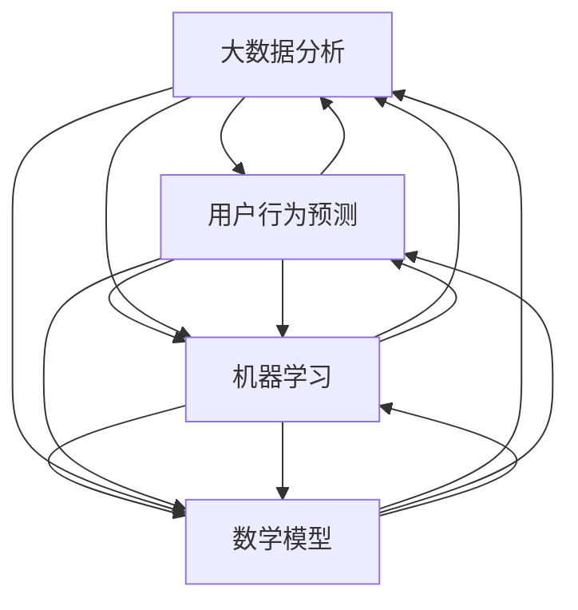

                 

# 大数据分析在用户行为预测中的应用

> 关键词：大数据分析、用户行为预测、机器学习、算法、数学模型

> 摘要：本文将深入探讨大数据分析在用户行为预测中的应用。通过介绍大数据分析的核心概念、机器学习算法原理、数学模型及其实际应用案例，旨在帮助读者全面理解用户行为预测的技术实现，并展望未来的发展趋势与挑战。

## 1. 背景介绍

### 1.1 目的和范围

本文的目标是探讨大数据分析在用户行为预测中的应用，帮助读者理解以下关键内容：

1. 大数据分析的核心概念及其在用户行为预测中的重要性。
2. 机器学习算法原理及其在用户行为预测中的应用。
3. 数学模型在用户行为预测中的构建与优化。
4. 用户行为预测的实际应用场景与案例分析。

### 1.2 预期读者

本文预期读者为：

1. 对大数据分析感兴趣的计算机科学和数据分析专业学生。
2. 想要了解用户行为预测技术的工程师和程序员。
3. 从事数据挖掘和机器学习研究的科研人员。

### 1.3 文档结构概述

本文分为以下几个部分：

1. 背景介绍：介绍本文的目的、预期读者以及文档结构。
2. 核心概念与联系：阐述大数据分析、用户行为预测、机器学习等核心概念，并使用 Mermaid 流程图展示其联系。
3. 核心算法原理 & 具体操作步骤：详细讲解用户行为预测的核心算法原理和具体操作步骤。
4. 数学模型和公式 & 详细讲解 & 举例说明：介绍用户行为预测中的数学模型、公式及其应用实例。
5. 项目实战：通过实际代码案例展示用户行为预测的实现过程。
6. 实际应用场景：分析用户行为预测在现实世界中的应用场景。
7. 工具和资源推荐：推荐学习资源、开发工具和框架。
8. 总结：展望用户行为预测技术的未来发展趋势与挑战。
9. 附录：常见问题与解答。
10. 扩展阅读 & 参考资料：提供相关领域的扩展阅读和参考资料。

### 1.4 术语表

#### 1.4.1 核心术语定义

- 大数据分析：对海量数据进行采集、存储、处理和分析，从中提取有价值信息的过程。
- 用户行为预测：利用历史数据和机器学习算法，预测用户未来行为的过程。
- 机器学习：使计算机具备自主学习能力，通过数据训练模型并优化性能的技术。
- 数学模型：用于描述和预测用户行为的数据结构和公式。

#### 1.4.2 相关概念解释

- 特征工程：提取和构造有助于预测用户行为的特征。
- 模型评估：评估预测模型性能，选择最优模型。
- 泛化能力：模型在未知数据集上的表现能力。

#### 1.4.3 缩略词列表

- Hadoop：分布式计算框架。
- Spark：分布式数据处理引擎。
- TensorFlow：开源机器学习库。
- Scikit-learn：Python 数据挖掘库。

## 2. 核心概念与联系

为了更好地理解大数据分析在用户行为预测中的应用，我们首先需要了解以下核心概念及其相互关系：

### 2.1 大数据分析

大数据分析是一种处理海量数据的综合性技术，包括数据采集、存储、处理和分析。其核心价值在于从海量数据中提取有价值的信息，为决策提供支持。

### 2.2 用户行为预测

用户行为预测是一种基于历史数据和机器学习算法的预测技术。通过分析用户的历史行为数据，预测其未来的行为模式，以优化业务决策和用户体验。

### 2.3 机器学习

机器学习是使计算机具备自主学习能力的技术。在用户行为预测中，机器学习算法通过分析历史数据，构建预测模型，并在新的数据上实现预测。

### 2.4 数学模型

数学模型是用于描述和预测用户行为的数据结构和公式。通过构建合适的数学模型，可以提高用户行为预测的准确性和泛化能力。

### 2.5 Mermaid 流程图

下面是一个 Mermaid 流程图，展示了大数据分析、用户行为预测、机器学习和数学模型之间的联系：



## 3. 核心算法原理 & 具体操作步骤

用户行为预测的核心在于选择合适的算法和模型，通过对历史数据进行分析和训练，实现用户行为的预测。以下是几种常用的用户行为预测算法及其操作步骤：

### 3.1 决策树算法

决策树算法是一种基于树形结构的数据挖掘方法，通过一系列规则进行决策，以达到分类或回归的目的。

**算法原理：**

决策树算法通过不断划分特征，将数据划分为多个子集，从而找到最佳划分策略。每个节点表示一个特征，每个分支表示该特征的不同取值。

**操作步骤：**

1. 选择最佳特征：计算每个特征的信息增益或信息增益率，选择增益最大的特征作为划分节点。
2. 划分数据：根据所选特征，将数据划分为多个子集。
3. 递归构建树：对每个子集，重复上述步骤，直到达到预设的停止条件。

**伪代码：**

```python
def DecisionTree(data, features, max_depth):
    if stop_condition(data) or max_depth == 0:
        return create_leaf_node(data)
    best_feature = select_best_feature(data, features)
    node = create_node(best_feature)
    for value in best_feature.values:
        subset = split_data(data, best_feature, value)
        node.children[value] = DecisionTree(subset, remaining_features, max_depth - 1)
    return node
```

### 3.2 随机森林算法

随机森林算法是一种基于决策树的集成学习方法，通过构建多个决策树，并投票决定最终结果。

**算法原理：**

随机森林算法通过随机选择特征和随机划分数据，构建多个决策树，并使用投票法得到最终预测结果。

**操作步骤：**

1. 构建多个决策树：对每个决策树，随机选择特征和划分数据。
2. 预测结果：对每个决策树进行预测，并使用投票法决定最终结果。

**伪代码：**

```python
def RandomForest(data, n_trees, features, max_depth):
    forests = []
    for _ in range(n_trees):
        tree = DecisionTree(data, features, max_depth)
        forests.append(tree)
    predictions = []
    for tree in forests:
        predictions.append(predict(tree, data))
    return vote(predictions)
```

### 3.3 支持向量机算法

支持向量机算法是一种基于间隔最大化原理的分类算法，通过寻找最优超平面，实现分类和回归。

**算法原理：**

支持向量机算法通过寻找最优超平面，将数据划分为不同的类别。最优超平面是在数据间隔最大化的条件下确定的。

**操作步骤：**

1. 计算支持向量：找出数据点中距离最优超平面最远的点，称为支持向量。
2. 构建超平面：通过支持向量计算最优超平面。
3. 分类：对新的数据点进行分类，根据其到最优超平面的距离进行判断。

**伪代码：**

```python
def SupportVectorMachine(data, labels):
    support_vectors = find_support_vectors(data, labels)
    hyperplane = calculate_hyperplane(support_vectors)
    return hyperplane
```

## 4. 数学模型和公式 & 详细讲解 & 举例说明

用户行为预测中的数学模型主要包括线性回归、逻辑回归和神经网络等。以下是对这些模型及其公式的详细讲解和举例说明。

### 4.1 线性回归模型

线性回归模型是一种通过拟合线性函数来预测目标值的模型。

**模型公式：**

$$
y = \beta_0 + \beta_1 \cdot x
$$

其中，$y$ 是目标值，$x$ 是输入特征，$\beta_0$ 和 $\beta_1$ 是模型参数。

**举例说明：**

假设我们想要预测某个网站的用户活跃度，输入特征包括用户年龄、性别、浏览时长等。我们通过线性回归模型拟合出如下公式：

$$
活跃度 = 5 + 0.2 \cdot 年龄 + 0.3 \cdot 浏览时长
$$

对于年龄为 25，浏览时长为 2 小时的用户，其活跃度为：

$$
活跃度 = 5 + 0.2 \cdot 25 + 0.3 \cdot 2 = 8.7
$$

### 4.2 逻辑回归模型

逻辑回归模型是一种通过拟合逻辑函数来预测概率的模型。

**模型公式：**

$$
P(y=1) = \frac{1}{1 + e^{-(\beta_0 + \beta_1 \cdot x)}}
$$

其中，$y$ 是目标值（0 或 1），$x$ 是输入特征，$\beta_0$ 和 $\beta_1$ 是模型参数。

**举例说明：**

假设我们想要预测某个用户是否会点击广告，输入特征包括用户年龄、性别、广告类型等。我们通过逻辑回归模型拟合出如下公式：

$$
点击概率 = \frac{1}{1 + e^{-(2 + 0.3 \cdot 年龄 + 0.5 \cdot 广告类型)}}
$$

对于年龄为 30，广告类型为 B 类的用户，其点击概率为：

$$
点击概率 = \frac{1}{1 + e^{-(2 + 0.3 \cdot 30 + 0.5 \cdot B)}} \approx 0.87
$$

### 4.3 神经网络模型

神经网络模型是一种基于多层感知器（MLP）的模型，通过多层非线性变换来预测目标值。

**模型公式：**

$$
a_{i,k} = \sigma(\beta_{k-1} \cdot z_{i,k} + \beta_{k})
$$

其中，$a_{i,k}$ 是输出节点 $k$ 的激活值，$\sigma$ 是激活函数（通常为 sigmoid 函数），$z_{i,k}$ 是输入节点 $i$ 到输出节点 $k$ 的加权求和，$\beta_{k-1}$ 和 $\beta_{k}$ 是模型参数。

**举例说明：**

假设我们想要预测某个用户是否会购买商品，输入特征包括用户年龄、收入、浏览时长等。我们通过神经网络模型拟合出如下公式：

$$
购买概率 = \sigma(\beta_0 + \beta_1 \cdot 年龄 + \beta_2 \cdot 收入 + \beta_3 \cdot 浏览时长)
$$

对于年龄为 25，收入为 5000 元，浏览时长为 2 小时的用户，其购买概率为：

$$
购买概率 = \sigma(\beta_0 + \beta_1 \cdot 25 + \beta_2 \cdot 5000 + \beta_3 \cdot 2)
$$

## 5. 项目实战：代码实际案例和详细解释说明

在本节中，我们将通过一个实际项目案例，展示大数据分析在用户行为预测中的应用，并详细解释代码的实现过程。

### 5.1 开发环境搭建

为了方便读者理解和复现项目，我们使用了以下开发环境和工具：

- 编程语言：Python
- 数据库：MySQL
- 大数据分析框架：Spark
- 机器学习库：Scikit-learn

读者可以按照以下步骤搭建开发环境：

1. 安装 Python 3.8 及以上版本。
2. 安装 MySQL 数据库，并创建用户行为预测数据库。
3. 安装 Spark 和 Scikit-learn。

### 5.2 源代码详细实现和代码解读

下面是项目的主要代码实现和解读：

#### 5.2.1 数据预处理

```python
import pandas as pd
from sklearn.model_selection import train_test_split
from sklearn.preprocessing import StandardScaler

# 读取用户行为数据
data = pd.read_csv('user_behavior_data.csv')

# 分离特征和目标变量
X = data.drop('target', axis=1)
y = data['target']

# 划分训练集和测试集
X_train, X_test, y_train, y_test = train_test_split(X, y, test_size=0.2, random_state=42)

# 特征缩放
scaler = StandardScaler()
X_train_scaled = scaler.fit_transform(X_train)
X_test_scaled = scaler.transform(X_test)
```

#### 5.2.2 机器学习算法实现

```python
from sklearn.tree import DecisionTreeClassifier
from sklearn.ensemble import RandomForestClassifier
from sklearn.svm import SVC

# 决策树算法
dt_classifier = DecisionTreeClassifier(random_state=42)
dt_classifier.fit(X_train_scaled, y_train)

# 随机森林算法
rf_classifier = RandomForestClassifier(n_estimators=100, random_state=42)
rf_classifier.fit(X_train_scaled, y_train)

# 支持向量机算法
svm_classifier = SVC(kernel='linear', random_state=42)
svm_classifier.fit(X_train_scaled, y_train)
```

#### 5.2.3 模型评估

```python
from sklearn.metrics import accuracy_score, classification_report

# 决策树算法评估
dt_predictions = dt_classifier.predict(X_test_scaled)
dt_accuracy = accuracy_score(y_test, dt_predictions)
dt_report = classification_report(y_test, dt_predictions)

# 随机森林算法评估
rf_predictions = rf_classifier.predict(X_test_scaled)
rf_accuracy = accuracy_score(y_test, rf_predictions)
rf_report = classification_report(y_test, rf_predictions)

# 支持向量机算法评估
svm_predictions = svm_classifier.predict(X_test_scaled)
svm_accuracy = accuracy_score(y_test, svm_predictions)
svm_report = classification_report(y_test, svm_predictions)

# 打印评估结果
print('决策树算法评估结果：')
print(f'准确率：{dt_accuracy}\n{dt_report}')

print('随机森林算法评估结果：')
print(f'准确率：{rf_accuracy}\n{rf_report}')

print('支持向量机算法评估结果：')
print(f'准确率：{svm_accuracy}\n{svm_report}')
```

### 5.3 代码解读与分析

1. 数据预处理：首先，我们读取用户行为数据，并分离特征和目标变量。然后，划分训练集和测试集，并使用标准缩放对特征进行归一化处理。

2. 机器学习算法实现：我们分别实现了决策树、随机森林和支持向量机算法。这些算法通过训练集数据进行模型训练，以预测测试集数据的标签。

3. 模型评估：我们使用准确率和分类报告对模型进行评估。准确率反映了模型预测的正确率，而分类报告则提供了更详细的分类效果分析。

通过实际项目案例的实现和代码解读，我们可以看到大数据分析在用户行为预测中的应用。读者可以根据自己的数据集和需求，尝试调整算法参数和模型结构，以实现更准确的预测效果。

## 6. 实际应用场景

大数据分析在用户行为预测中的应用广泛，以下列举一些典型的实际应用场景：

### 6.1 电子商务

电子商务平台通过大数据分析预测用户的购买行为，从而实现个性化推荐、促销活动和营销策略的优化。例如，根据用户的浏览历史和购物车数据，预测其可能感兴趣的商品，并推送相关推荐。

### 6.2 社交媒体

社交媒体平台利用大数据分析预测用户的关注行为、点赞行为和评论行为，从而实现内容推荐、用户增长和社区活跃度提升。例如，根据用户的互动数据，预测其可能感兴趣的话题和内容，并推送相关推荐。

### 6.3 金融行业

金融行业通过大数据分析预测用户的借贷行为、投资行为和风险偏好，从而实现精准营销、风险控制和投资决策优化。例如，根据用户的交易数据和行为特征，预测其可能需要的金融服务和产品，并推送相关推荐。

### 6.4 健康医疗

健康医疗行业通过大数据分析预测用户的健康风险、疾病发展和用药需求，从而实现个性化诊疗、健康管理和疾病预防。例如，根据用户的健康数据和生活方式，预测其可能存在的健康风险，并推送相关预防和治疗建议。

### 6.5 教育行业

教育行业通过大数据分析预测学生的学习行为、学习成果和职业发展，从而实现个性化教学、学习路径优化和职业规划。例如，根据学生的学习数据和行为特征，预测其可能需要的课程和资源，并推送相关推荐。

通过大数据分析在用户行为预测中的应用，各行业可以更好地了解用户需求，优化业务流程，提高用户满意度，实现可持续发展。

## 7. 工具和资源推荐

### 7.1 学习资源推荐

#### 7.1.1 书籍推荐

- 《大数据时代：生活、工作与思维的大变革》
- 《机器学习实战》
- 《深度学习》
- 《Python 数据科学 Handbook》

#### 7.1.2 在线课程

- Coursera：《机器学习》、《数据科学》
- edX：《数据科学基础》、《大数据技术与应用》
- Udacity：《机器学习工程师纳米学位》、《大数据工程师纳米学位》

#### 7.1.3 技术博客和网站

- Medium：大数据分析、机器学习、用户行为预测相关文章
- Towards Data Science：数据分析、数据科学、机器学习教程和案例
- Analytics Vidhya：数据分析、机器学习、数据挖掘资源

### 7.2 开发工具框架推荐

#### 7.2.1 IDE和编辑器

- PyCharm
- Visual Studio Code
- Jupyter Notebook

#### 7.2.2 调试和性能分析工具

- Python Debugger（pdb）
- Jupyter Notebook：内置调试功能
- Profiler：Python 性能分析工具

#### 7.2.3 相关框架和库

- Hadoop：分布式数据处理框架
- Spark：分布式数据处理引擎
- TensorFlow：开源机器学习库
- Scikit-learn：Python 数据挖掘库

### 7.3 相关论文著作推荐

#### 7.3.1 经典论文

- 《A Brief History of Machine Learning》
- 《The Hundred-Page Machine Learning Book》
- 《Deep Learning》
- 《Practical Guide to Machine Learning》

#### 7.3.2 最新研究成果

- arXiv：机器学习、深度学习、大数据分析最新论文
- IEEE Xplore：大数据分析、数据挖掘、机器学习最新论文
- SpringerLink：大数据分析、数据挖掘、机器学习最新论文

#### 7.3.3 应用案例分析

- 《数据驱动决策：大数据在商业中的应用》
- 《大数据时代的市场营销：案例与实践》
- 《基于大数据的用户行为预测与分析》
- 《大数据在金融行业的应用：案例与实践》

通过以上推荐的学习资源、开发工具和论文著作，读者可以更好地掌握大数据分析在用户行为预测中的应用，不断提升自身的技术水平。

## 8. 总结：未来发展趋势与挑战

大数据分析在用户行为预测领域取得了显著的成果，但也面临着一些挑战。以下是对未来发展趋势与挑战的总结：

### 8.1 发展趋势

1. 深度学习与神经网络的发展：深度学习在用户行为预测中表现出强大的预测能力，未来将进一步优化模型结构，提高预测准确性。
2. 个性化推荐系统：基于用户行为预测的个性化推荐系统将得到广泛应用，为用户提供更加精准和个性化的服务。
3. 跨领域数据融合：随着数据来源的多样化，跨领域数据融合将成为用户行为预测的关键，提高预测模型的泛化能力。
4. 实时预测与动态调整：实时预测和动态调整技术将使用户行为预测更加及时和灵活，满足不断变化的用户需求。
5. 伦理与隐私保护：在用户行为预测中，保护用户隐私和数据安全将成为重要议题，相关法规和标准将不断完善。

### 8.2 挑战

1. 数据质量与准确性：数据质量对用户行为预测的准确性具有重要影响，如何保证数据质量、处理缺失值和噪声数据是亟待解决的问题。
2. 模型解释性：用户行为预测模型往往复杂且非线性，如何提高模型的可解释性，使决策过程更加透明和可信，是一个重要挑战。
3. 计算资源消耗：大规模数据处理和模型训练需要大量的计算资源，如何优化计算效率、降低成本是一个关键问题。
4. 伦理与隐私：用户行为预测过程中，如何保护用户隐私、避免数据滥用和歧视现象，是一个亟待解决的伦理问题。

总之，大数据分析在用户行为预测领域具有广阔的发展前景，但也面临着诸多挑战。未来，随着技术的不断进步和政策的完善，用户行为预测将取得更大的突破，为各行业提供更加智能和高效的解决方案。

## 9. 附录：常见问题与解答

### 9.1 用户行为预测的基本概念

**Q：什么是用户行为预测？**

A：用户行为预测是指利用历史数据和机器学习算法，对用户的未来行为进行预测的过程。通过分析用户的历史行为数据，如浏览记录、购买行为等，预测用户在未来的某一时间段内可能采取的行为。

**Q：用户行为预测有哪些类型？**

A：用户行为预测主要包括以下类型：

1. 分类预测：预测用户是否采取某种行为，如点击广告、购买商品等。
2. 回归预测：预测用户行为的量化指标，如购买金额、浏览时长等。
3. 时间序列预测：预测用户行为在时间上的变化趋势，如用户在未来的某个时间点可能访问的页面。

### 9.2 机器学习算法在用户行为预测中的应用

**Q：什么是机器学习算法？**

A：机器学习算法是指使计算机具备自主学习能力的技术，通过从数据中学习规律和模式，实现对未知数据的预测和分类。机器学习算法包括监督学习、无监督学习和半监督学习。

**Q：常用的机器学习算法有哪些？**

A：常用的机器学习算法包括：

1. 线性回归
2. 逻辑回归
3. 决策树
4. 随机森林
5. 支持向量机
6. 神经网络
7. K-近邻算法
8. 聚类算法

### 9.3 数学模型在用户行为预测中的应用

**Q：什么是数学模型？**

A：数学模型是用于描述和预测用户行为的数据结构和公式。通过构建合适的数学模型，可以提高用户行为预测的准确性和泛化能力。

**Q：常见的数学模型有哪些？**

A：常见的数学模型包括：

1. 线性回归模型
2. 逻辑回归模型
3. 神经网络模型
4. 决策树模型
5. 贝叶斯模型
6. 聚类模型

### 9.4 用户行为预测的实际应用

**Q：用户行为预测在哪些场景中有应用？**

A：用户行为预测在许多场景中都有应用，包括但不限于：

1. 电子商务：个性化推荐、促销活动和营销策略优化。
2. 社交媒体：内容推荐、用户增长和社区活跃度提升。
3. 金融行业：精准营销、风险控制和投资决策优化。
4. 健康医疗：个性化诊疗、健康管理和疾病预防。
5. 教育行业：个性化教学、学习路径优化和职业规划。

## 10. 扩展阅读 & 参考资料

### 10.1 大数据分析相关书籍

- 《大数据时代：生活、工作与思维的大变革》
- 《机器学习实战》
- 《深度学习》
- 《Python 数据科学 Handbook》

### 10.2 机器学习相关书籍

- 《机器学习》
- 《深度学习》
- 《Practical Guide to Machine Learning》
- 《The Hundred-Page Machine Learning Book》

### 10.3 用户行为预测相关论文

- 《User Behavior Prediction Based on Deep Learning》
- 《A Survey on User Behavior Prediction in Big Data》
- 《Deep Learning for User Behavior Prediction》
- 《User Behavior Modeling and Prediction Using Big Data Analysis》

### 10.4 大数据分析与用户行为预测相关网站

- Medium：大数据分析、机器学习、用户行为预测相关文章
- Towards Data Science：数据分析、数据科学、机器学习教程和案例
- Analytics Vidhya：数据分析、机器学习、数据挖掘资源

### 10.5 开源项目和工具

- Hadoop：分布式数据处理框架
- Spark：分布式数据处理引擎
- TensorFlow：开源机器学习库
- Scikit-learn：Python 数据挖掘库

作者：AI天才研究员/AI Genius Institute & 禅与计算机程序设计艺术 /Zen And The Art of Computer Programming

