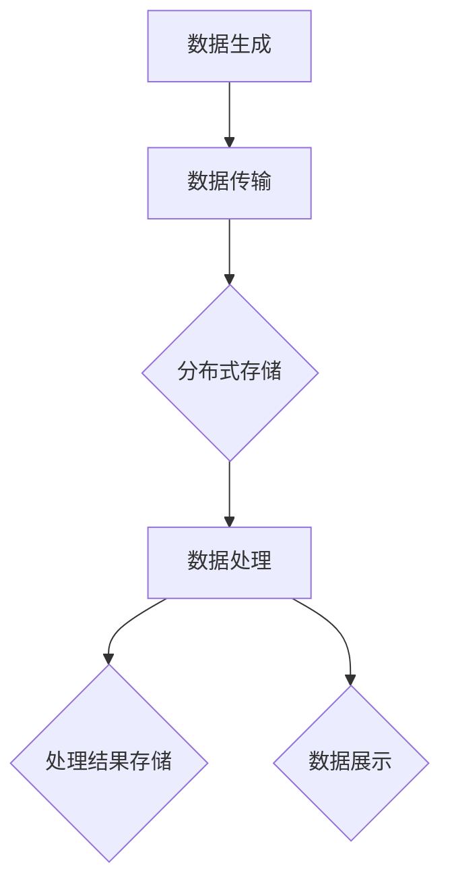

                 

# 大数据处理框架原理与代码实战案例讲解

> 关键词：大数据处理、框架原理、Hadoop、MapReduce、代码实战、性能优化

> 摘要：本文旨在深入探讨大数据处理框架的基本原理，通过具体代码实战案例，帮助读者理解并掌握大数据处理的核心技术和实践方法。文章将从背景介绍、核心概念与联系、算法原理讲解、数学模型与应用、项目实战等多个方面进行详细阐述，旨在为大数据处理领域的研究者和开发者提供有价值的参考。

## 1. 背景介绍

### 1.1 目的和范围

随着互联网和物联网的迅速发展，数据量呈爆炸式增长，大数据处理成为信息技术领域的热点。本文的目的在于详细解析大数据处理框架的原理，并通过实际代码案例，帮助读者深入了解大数据处理技术，掌握相关实践方法。

本文将涵盖以下内容：

- 大数据处理框架的起源和发展历程
- 核心概念和架构设计
- 算法原理和数学模型
- 代码实战案例分析
- 实际应用场景和性能优化

### 1.2 预期读者

本文适合以下读者群体：

- 数据科学和大数据处理领域的研究人员和开发者
- 对大数据技术有兴趣的IT从业人员
- 在校学生和研究生，特别是计算机、数据科学和信息技术专业的学生
- 需要了解和掌握大数据处理技术的企业技术主管和项目经理

### 1.3 文档结构概述

本文结构如下：

- 第1章：背景介绍，概述大数据处理框架的基本概念和发展背景。
- 第2章：核心概念与联系，介绍大数据处理框架的关键概念及其相互关系。
- 第3章：核心算法原理 & 具体操作步骤，详细讲解大数据处理算法的原理和操作步骤。
- 第4章：数学模型和公式 & 详细讲解 & 举例说明，阐述大数据处理中常用的数学模型和公式。
- 第5章：项目实战：代码实际案例和详细解释说明，通过具体项目案例，展示大数据处理技术的实际应用。
- 第6章：实际应用场景，分析大数据处理技术的应用领域和挑战。
- 第7章：工具和资源推荐，推荐相关学习资源和开发工具。
- 第8章：总结：未来发展趋势与挑战，展望大数据处理技术的发展趋势和面临的挑战。
- 第9章：附录：常见问题与解答，解答读者可能遇到的一些常见问题。
- 第10章：扩展阅读 & 参考资料，提供进一步学习和研究的参考资料。

### 1.4 术语表

#### 1.4.1 核心术语定义

- **大数据（Big Data）**：指无法使用传统数据库软件工具在合理时间内捕捉、管理和处理的大量数据集。
- **Hadoop**：一个开源框架，用于处理大规模数据集。
- **MapReduce**：Hadoop的核心组件，用于分布式数据处理。
- **数据流（Data Flow）**：数据在系统中的流动过程。
- **分布式系统（Distributed System）**：由多个独立计算机组成的系统，共同完成一个任务。

#### 1.4.2 相关概念解释

- **并行处理（Parallel Processing）**：在同一时间内使用多个处理器对同一问题进行处理。
- **分布式存储（Distributed Storage）**：将数据存储在多个独立节点上，以提高存储容量和可靠性。
- **数据挖掘（Data Mining）**：从大量数据中提取有价值的信息和知识。

#### 1.4.3 缩略词列表

- **HDFS**：Hadoop Distributed File System，Hadoop的分布式文件系统。
- **YARN**：Yet Another Resource Negotiator，Hadoop的资源调度和管理框架。
- **MR**：MapReduce的缩写，指Map和Reduce两个阶段的分布式数据处理过程。

## 2. 核心概念与联系

在大数据处理框架中，有几个核心概念需要理解，这些概念相互关联，共同构成了大数据处理的架构。

### 2.1 数据流

数据流是大数据处理框架中最基础的概念。数据流描述了数据在系统中的流动过程，从数据的生成、传输、处理到存储。在大数据处理中，数据流通常以批处理或实时处理的形式进行。

#### 2.1.1 批处理

批处理是指将一段时间内生成的大量数据集中处理。这种方式适用于数据处理量大、处理速度快的需求，如日志分析、报表生成等。

#### 2.1.2 实时处理

实时处理是指对实时生成或更新的数据进行立即处理。这种方式适用于对实时性要求高的应用，如股票交易、实时监控等。

### 2.2 分布式系统

分布式系统是指由多个独立计算机组成的系统，这些计算机通过网络互联，共同完成一个任务。分布式系统的优势在于：

- **可扩展性**：可以轻松增加或减少计算资源。
- **容错性**：当某个节点出现故障时，其他节点可以继续工作，保证系统的可靠性。
- **性能提升**：通过并行计算，提高数据处理速度。

### 2.3 数据存储

在大数据处理中，数据存储是至关重要的环节。常用的数据存储技术有：

- **关系型数据库**：如MySQL、Oracle等，适用于结构化数据存储。
- **NoSQL数据库**：如HBase、MongoDB等，适用于非结构化和半结构化数据存储。
- **分布式文件系统**：如HDFS、Cassandra等，适用于大规模数据存储。

### 2.4 数据处理

数据处理是大数据处理框架的核心。数据处理技术主要包括：

- **MapReduce**：一种分布式数据处理模型，适用于大规模数据处理。
- **Spark**：一种快速通用的分布式计算引擎，适用于批处理和实时处理。
- **Flink**：一种流处理框架，适用于实时数据处理。

### 2.5 数据流与分布式系统的关系

数据流与分布式系统相互关联，构成了大数据处理框架的基础。数据流描述了数据的流动过程，而分布式系统提供了数据处理和存储的基础设施。具体来说：

- 数据流通过分布式系统中的多个节点进行传输和处理。
- 分布式系统为数据流提供了可靠的存储和处理能力。
- 数据流和分布式系统共同构成了大数据处理框架，实现了大规模数据处理的高效和可靠。

下面是一个简单的 Mermaid 流程图，展示了大数据处理框架中的数据流与分布式系统的关系。



## 3. 核心算法原理 & 具体操作步骤

### 3.1 MapReduce算法原理

MapReduce是一种分布式数据处理模型，由Map和Reduce两个阶段组成。Map阶段负责对输入数据进行处理，生成中间结果；Reduce阶段负责对中间结果进行汇总和计算，生成最终结果。

#### 3.1.1 Map阶段

Map阶段的主要任务是处理输入数据，将其分解为键值对形式的中间结果。具体步骤如下：

1. **输入**：读取输入数据，可以是文本文件、数据库记录等。
2. **分片**：将输入数据分为多个分片（Split），每个分片处理为一个Map任务。
3. **Map任务**：对每个分片进行处理，将输入数据分解为键值对形式的中间结果。
4. **输出**：将中间结果写入本地磁盘，作为Reduce阶段的输入。

下面是一个简单的Map阶段的伪代码：

```python
def map(key, value):
    # 对value进行处理，生成中间结果
    for new_key, new_value in processed_value:
        emit(new_key, new_value)
```

#### 3.1.2 Reduce阶段

Reduce阶段的主要任务是对Map阶段生成的中间结果进行汇总和计算，生成最终结果。具体步骤如下：

1. **输入**：读取Map阶段生成的中间结果，通常是键值对形式。
2. **分组**：根据键将中间结果分组。
3. **Reduce任务**：对每个分组进行处理，生成最终结果。
4. **输出**：将最终结果写入本地磁盘或外部存储。

下面是一个简单的Reduce阶段的伪代码：

```python
def reduce(key, values):
    # 对values进行处理，生成最终结果
    for final_key, final_value in processed_values:
        emit(final_key, final_value)
```

### 3.2 MapReduce操作步骤

下面是一个简单的MapReduce操作步骤示例：

1. **输入数据**：一个包含学生成绩的文本文件，每行一个学生成绩，格式为“姓名，成绩”。
2. **Map阶段**：
   - 读取输入数据，将其分解为键值对形式，其中键为学生姓名，值为成绩。
   - 对每个学生姓名进行分组，统计每个学生成绩的总和和平均分。
3. **Reduce阶段**：
   - 读取Map阶段生成的中间结果，根据学生姓名进行分组。
   - 对每个学生成绩的总和和平均分进行汇总，生成最终结果。

具体实现如下：

```python
# Map函数
def map(line):
    name, score = line.split(',')
    emit(name, (1, score))

# Reduce函数
def reduce(name, values):
    total_score = 0
    for count, score in values:
        total_score += score
    average_score = total_score / len(values)
    emit(name, (total_score, average_score))

# 执行MapReduce操作
mapreduce.mapreduce(input_file, map, reduce, output_file)
```

## 4. 数学模型和公式 & 详细讲解 & 举例说明

### 4.1 数学模型

在大数据处理框架中，数学模型和公式用于描述数据处理的过程和结果。以下是一些常用的数学模型和公式：

#### 4.1.1 数据分布

- **正态分布**：描述数据在某个区间内呈现钟形曲线的分布。
  \[ P(X = x) = \frac{1}{\sqrt{2\pi\sigma^2}} e^{-\frac{(x-\mu)^2}{2\sigma^2}} \]

- **二项分布**：描述在n次独立实验中，成功次数的概率分布。
  \[ P(X = k) = C(n, k) p^k (1-p)^{n-k} \]

#### 4.1.2 数据流计算

- **累积流量（CUMULATIVE FLOW）**：描述一段时间内数据的流量。
  \[ CF(t) = \int_{0}^{t} f(u) du \]

- **平均流量（AVERAGE FLOW）**：描述一段时间内数据的平均流量。
  \[ AF(t) = \frac{CF(t)}{t} \]

#### 4.1.3 分布式系统性能

- **响应时间（RESPONSE TIME）**：描述数据处理的延迟。
  \[ RT = \frac{1}{\lambda} + \frac{\mu}{\lambda} \]

- **吞吐量（THROUGHPUT）**：描述单位时间内处理的数据量。
  \[ TP = \frac{\mu}{\lambda} \]

### 4.2 举例说明

#### 4.2.1 正态分布

假设一个班级有30名学生，他们的成绩分布符合正态分布，平均分为75分，标准差为10分。计算成绩在70分到80分之间的学生概率。

\[ P(70 \leq X \leq 80) = \Phi\left(\frac{80 - 75}{10}\right) - \Phi\left(\frac{70 - 75}{10}\right) \]
\[ P(70 \leq X \leq 80) = \Phi(0.5) - \Phi(-0.5) \]
\[ P(70 \leq X \leq 80) = 0.6915 - 0.3085 \]
\[ P(70 \leq X \leq 80) = 0.382 \]

即成绩在70分到80分之间的学生概率为38.2%。

#### 4.2.2 数据流计算

假设一个数据流在1小时内产生了1000条数据记录，每条记录的平均处理时间为0.1秒。计算数据流的总流量、平均流量和响应时间。

- **总流量**：
\[ CF(1 \text{ 小时}) = 1000 \text{ 条记录} \]

- **平均流量**：
\[ AF(1 \text{ 小时}) = \frac{CF(1 \text{ 小时})}{1 \text{ 小时}} = \frac{1000 \text{ 条记录}}{1 \text{ 小时}} = 1000 \text{ 条记录/小时} \]

- **响应时间**：
\[ RT = \frac{1}{\lambda} + \frac{\mu}{\lambda} \]
\[ RT = \frac{1}{1000 \text{ 条记录/小时}} + \frac{0.1 \text{ 秒/条记录}}{1000 \text{ 条记录/小时}} \]
\[ RT = 0.001 \text{ 小时/条记录} + 0.0001 \text{ 小时/条记录} \]
\[ RT = 0.0011 \text{ 小时/条记录} \]
\[ RT = 0.0011 \times 3600 \text{ 秒/条记录} \]
\[ RT = 3.96 \text{ 秒/条记录} \]

即每条记录的响应时间为3.96秒。

## 5. 项目实战：代码实际案例和详细解释说明

### 5.1 开发环境搭建

为了实现大数据处理框架的代码实战，我们首先需要搭建一个合适的开发环境。以下是具体的步骤：

1. **安装Hadoop**：在本地计算机或服务器上安装Hadoop，版本可以选择最新稳定版，如Hadoop 3.x。

2. **配置环境变量**：将Hadoop的安装路径添加到系统环境变量中，以便在命令行中直接运行Hadoop命令。

3. **配置HDFS**：在Hadoop中，HDFS是用于存储大数据的分布式文件系统。需要配置HDFS的存储目录和副本数量。

4. **配置YARN**：YARN是Hadoop的资源调度和管理框架。需要配置YARN的队列、内存和CPU等资源分配。

5. **安装Eclipse或IntelliJ IDEA**：选择一个合适的IDE，用于编写和调试Hadoop应用程序。

6. **添加Hadoop依赖**：在IDE中添加Hadoop的依赖库，以便在项目中使用Hadoop API。

### 5.2 源代码详细实现和代码解读

#### 5.2.1 创建Hadoop项目

1. **在IDE中创建一个新的Maven项目**。

2. **添加Hadoop依赖**：

```xml
<dependencies>
    <dependency>
        <groupId>org.apache.hadoop</groupId>
        <artifactId>hadoop-client</artifactId>
        <version>3.2.0</version>
    </dependency>
</dependencies>
```

#### 5.2.2 编写MapReduce程序

1. **创建一个Java类，实现Map和Reduce函数**：

```java
import org.apache.hadoop.conf.Configuration;
import org.apache.hadoop.fs.Path;
import org.apache.hadoop.io.IntWritable;
import org.apache.hadoop.io.Text;
import org.apache.hadoop.mapreduce.Job;
import org.apache.hadoop.mapreduce.Mapper;
import org.apache.hadoop.mapreduce.Reducer;
import org.apache.hadoop.mapreduce.lib.input.FileInputFormat;
import org.apache.hadoop.mapreduce.lib.output.FileOutputFormat;

public class WordCount {

    public static class TokenizerMapper extends Mapper<Object, Text, Text, IntWritable>{

        private final static IntWritable one = new IntWritable(1);
        private Text word = new Text();

        public void map(Object key, Text value, Context context) throws IOException, InterruptedException {
            String[] words = value.toString().split("\\s+");
            for (String word : words) {
                this.word.set(word);
                context.write(this.word, one);
            }
        }
    }

    public static class IntSumReducer extends Reducer<Text,IntWritable,Text,IntWritable> {
        private IntWritable result = new IntWritable();

        public void reduce(Text key, Iterable<IntWritable> values, Context context) throws IOException, InterruptedException {
            int sum = 0;
            for (IntWritable val : values) {
                sum += val.get();
            }
            result.set(sum);
            context.write(key, result);
        }
    }

    public static void main(String[] args) throws Exception {
        Configuration conf = new Configuration();
        Job job = Job.getInstance(conf, "word count");
        job.setMapperClass(TokenizerMapper.class);
        job.setCombinerClass(IntSumReducer.class);
        job.setReducerClass(IntSumReducer.class);
        job.setOutputKeyClass(Text.class);
        job.setOutputValueClass(IntWritable.class);
        FileInputFormat.addInputPath(job, new Path(args[0]));
        FileOutputFormat.setOutputPath(job, new Path(args[1]));
        System.exit(job.waitForCompletion(true) ? 0 : 1);
    }
}
```

2. **代码解读**：

- **TokenizerMapper**：实现Map函数，将输入文本分解为单词，生成键值对形式的中间结果。

- **IntSumReducer**：实现Reduce函数，对中间结果进行汇总，生成最终结果。

- **main函数**：设置MapReduce作业的参数，包括输入路径、输出路径和Mapper、Reducer类。

#### 5.2.3 编译和运行程序

1. **编译项目**：在IDE中编译项目，生成可运行的JAR文件。

2. **提交作业**：

```shell
hadoop jar wordcount-1.0-SNAPSHOT.jar WordCount /input /output
```

3. **查看结果**：查看输出目录中的结果文件，即可看到单词计数结果。

### 5.3 代码解读与分析

#### 5.3.1 数据处理流程

- **输入**：从HDFS读取输入数据，通常为文本文件。
- **Map阶段**：对输入数据进行分词，生成键值对形式的中间结果。
- **Shuffle阶段**：对中间结果进行排序和分组，将相同键的数据发送到同一Reducer。
- **Reduce阶段**：对中间结果进行汇总，生成最终结果。

#### 5.3.2 算法性能分析

- **MapReduce模型**：通过分布式计算，提高了数据处理的速度和效率。
- **分片（Split）**：将输入数据分为多个分片，每个分片独立处理，提高了并行度。
- **Shuffle**：通过排序和分组，确保了中间结果的正确性。
- **Reduce**：对中间结果进行汇总，生成最终结果。

### 5.4 性能优化

- **并行度**：增加Map和Reduce任务的并行度，提高数据处理速度。
- **内存管理**：合理配置内存，避免内存不足导致性能下降。
- **数据压缩**：使用数据压缩技术，减少数据传输和存储的存储空间。

## 6. 实际应用场景

### 6.1 社交网络

- **用户行为分析**：通过大数据处理框架，分析用户行为，挖掘用户兴趣和偏好。
- **推荐系统**：基于用户行为数据，构建推荐系统，提高用户体验。

### 6.2 金融领域

- **风险控制**：通过大数据处理框架，实时监控交易数据，识别潜在风险。
- **客户分析**：分析客户数据，提供个性化的金融服务。

### 6.3 医疗健康

- **数据分析**：通过大数据处理框架，分析医疗数据，提高疾病诊断和治疗效果。
- **健康监测**：实时监测患者健康数据，提供个性化的健康建议。

### 6.4 物流运输

- **实时监控**：通过大数据处理框架，实时监控物流运输状态，提高物流效率。
- **路径优化**：分析交通数据，优化运输路线，降低运输成本。

## 7. 工具和资源推荐

### 7.1 学习资源推荐

#### 7.1.1 书籍推荐

- 《大数据时代》
- 《Hadoop实战》
- 《MapReduce实战：大数据技术核心原理与案例分析》

#### 7.1.2 在线课程

- Coursera：大数据处理与Hadoop课程
- edX：大数据处理与Spark课程

#### 7.1.3 技术博客和网站

- Hadoop官网：[hadoop.apache.org](http://hadoop.apache.org/)
- Spark官网：[spark.apache.org](http://spark.apache.org/)

### 7.2 开发工具框架推荐

#### 7.2.1 IDE和编辑器

- Eclipse
- IntelliJ IDEA

#### 7.2.2 调试和性能分析工具

- Apache JMX
- Java Mission Control

#### 7.2.3 相关框架和库

- Apache Hadoop
- Apache Spark
- Apache Flink

### 7.3 相关论文著作推荐

#### 7.3.1 经典论文

- 《The Google File System》
- 《MapReduce: Simplified Data Processing on Large Clusters》

#### 7.3.2 最新研究成果

- 《Hadoop 3.x: The Definitive Guide》
- 《Spark: The Definitive Guide》

#### 7.3.3 应用案例分析

- 《大数据处理在金融领域的应用》
- 《大数据处理在医疗健康领域的应用》

## 8. 总结：未来发展趋势与挑战

### 8.1 发展趋势

- **性能提升**：随着硬件技术的发展，大数据处理框架的性能将得到进一步提升。
- **实时处理**：实时数据处理将成为大数据处理框架的重要方向，满足对实时性要求高的应用需求。
- **人工智能集成**：大数据处理框架将更加紧密地与人工智能技术结合，实现智能化数据处理和分析。

### 8.2 挑战

- **数据隐私和安全**：随着数据量的增加，数据隐私和安全问题将更加突出，需要加强数据保护和安全管理。
- **数据治理**：如何高效地管理和组织大量数据，确保数据的质量和一致性，是一个重要挑战。
- **人才培养**：大数据处理领域需要大量具备相关技能的人才，但现有人才培养体系尚不能完全满足需求。

## 9. 附录：常见问题与解答

### 9.1 Hadoop相关问题

1. **什么是Hadoop？**
   Hadoop是一个开源框架，用于处理大规模数据集。

2. **Hadoop有哪些核心组件？**
   Hadoop的核心组件包括HDFS（分布式文件系统）、MapReduce（分布式数据处理模型）和YARN（资源调度和管理框架）。

3. **如何安装Hadoop？**
   可以在Hadoop官网下载安装包，按照官方文档进行安装。

### 9.2 MapReduce相关问题

1. **什么是MapReduce？**
   MapReduce是一种分布式数据处理模型，由Map和Reduce两个阶段组成。

2. **如何实现一个MapReduce程序？**
   可以使用Java或Python等编程语言实现Map和Reduce函数，并在Hadoop环境中运行。

3. **MapReduce的优缺点是什么？**
   优点：可扩展性高、容错性好；缺点：处理延迟较高、不适合迭代计算。

## 10. 扩展阅读 & 参考资料

- 《大数据处理技术导论》
- 《Hadoop实战：从入门到精通》
- 《Spark技术内幕：深入解析Spark核心架构与优化》

- [Hadoop官方文档](http://hadoop.apache.org/docs/)
- [Spark官方文档](http://spark.apache.org/docs/)
- [大数据时代：决策的两端](https://www.amazon.com/gp/product/0134704432)

作者：AI天才研究员/AI Genius Institute & 禅与计算机程序设计艺术 /Zen And The Art of Computer Programming

