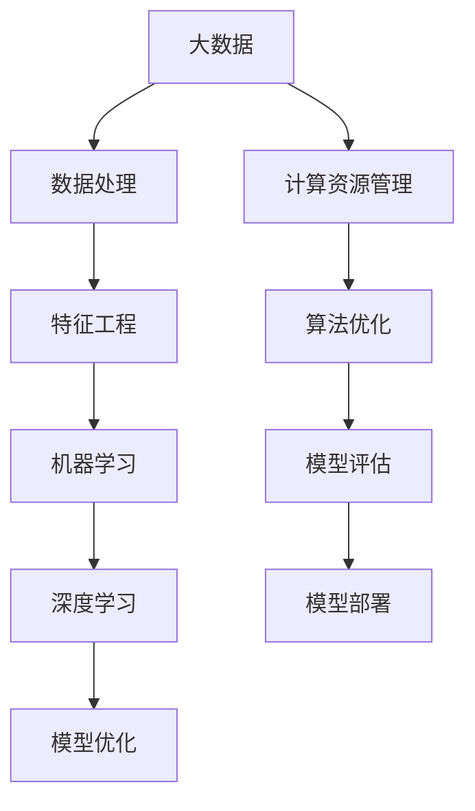

                 

# 大数据对AI发展的影响

> **关键词：** 大数据，人工智能，深度学习，机器学习，算法优化，计算资源

> **摘要：** 本文深入探讨了大数据对人工智能发展的深远影响，分析了大数据技术在机器学习和深度学习中的应用，探讨了大数据带来的计算资源挑战，以及如何通过算法优化和计算资源管理来应对这些挑战。文章旨在为读者提供一个清晰、系统的大数据与AI融合发展的视角，以及未来发展趋势与潜在的研究方向。

## 1. 背景介绍

### 1.1 目的和范围

本文的主要目的是探讨大数据如何影响人工智能的发展，重点分析大数据在机器学习和深度学习中的应用，以及其对算法优化和计算资源管理的推动作用。文章将涵盖以下几个方面：

1. **大数据的定义和特性**
2. **机器学习和深度学习的基本原理**
3. **大数据在AI中的应用**
4. **算法优化与计算资源管理**
5. **未来发展趋势与挑战**

### 1.2 预期读者

本文适合对人工智能、机器学习和深度学习有一定了解的读者，尤其是对大数据技术应用感兴趣的工程师、研究员和学者。同时，对于希望了解大数据如何推动AI发展的普通读者，本文也具备较高的可读性。

### 1.3 文档结构概述

本文的结构如下：

1. **背景介绍**：阐述文章的目的和预期读者，以及文档的结构概述。
2. **核心概念与联系**：介绍大数据、机器学习和深度学习的基本概念，使用Mermaid流程图展示核心架构。
3. **核心算法原理与具体操作步骤**：详细讲解机器学习和深度学习的基本算法原理，使用伪代码进行说明。
4. **数学模型和公式**：介绍相关的数学模型和公式，并进行举例说明。
5. **项目实战**：提供代码实际案例，进行详细解释和分析。
6. **实际应用场景**：探讨大数据在各个领域的应用案例。
7. **工具和资源推荐**：推荐学习资源、开发工具和相关论文著作。
8. **总结**：对未来发展趋势和挑战进行总结。
9. **附录**：常见问题与解答。
10. **扩展阅读与参考资料**：提供进一步学习的资源。

### 1.4 术语表

#### 1.4.1 核心术语定义

- **大数据（Big Data）：** 数据量巨大，数据类型多样，数据生成速度快。
- **机器学习（Machine Learning）：** 一种人工智能技术，通过数据和算法实现自我优化。
- **深度学习（Deep Learning）：** 机器学习的一种，通过多层神经网络实现复杂模式的自动学习。
- **算法优化（Algorithm Optimization）：** 通过改进算法提高其性能的过程。
- **计算资源管理（Computational Resource Management）：** 对计算资源进行优化和配置的过程。

#### 1.4.2 相关概念解释

- **数据处理（Data Processing）：** 对数据进行收集、存储、管理和分析的过程。
- **特征工程（Feature Engineering）：** 通过选择和构造特征来提高模型性能的过程。
- **模型评估（Model Evaluation）：** 通过验证模型在测试数据上的性能来评估模型好坏的过程。
- **数据挖掘（Data Mining）：** 从大量数据中提取有用信息和知识的过程。

#### 1.4.3 缩略词列表

- **Hadoop：** Apache Hadoop，一个开源的分布式数据处理框架。
- **Spark：** Apache Spark，一个开源的分布式数据处理引擎。
- **GPU：** 图形处理器（Graphics Processing Unit），用于加速计算。
- **CUDA：** NVIDIA开发的并行计算平台和编程模型。
- **MLlib：** Apache Spark的机器学习库。

## 2. 核心概念与联系

### 2.1 大数据的基本概念

大数据是指那些无法使用常规软件工具在合理时间内捕捉、管理和处理的大量数据。这些数据具有四个主要特征，通常称为“4V”：

- **Volume（体积）：** 数据量巨大，从GB到TB甚至PB级别。
- **Velocity（速度）：** 数据生成和流动速度快，需要实时处理。
- **Variety（多样性）：** 数据类型多样，包括结构化、半结构化和非结构化数据。
- **Veracity（真实性）：** 数据的真实性和准确性对分析结果至关重要。

### 2.2 机器学习的基本原理

机器学习是一种人工智能技术，通过数据和算法实现自我优化。其基本原理包括：

- **模型训练：** 使用历史数据对模型进行训练，以学习数据中的模式和规律。
- **模型评估：** 使用验证数据集评估模型性能，确保模型泛化能力。
- **模型优化：** 通过调整模型参数和结构，提高模型性能。

### 2.3 深度学习的基本原理

深度学习是机器学习的一种，通过多层神经网络实现复杂模式的自动学习。其核心包括：

- **神经网络（Neural Networks）：** 模仿人脑的神经网络结构，通过前向传播和反向传播算法进行训练。
- **激活函数（Activation Functions）：** 用于引入非线性特性，使神经网络能够学习复杂模式。
- **优化算法（Optimization Algorithms）：** 如随机梯度下降（SGD），用于调整模型参数以优化性能。

### 2.4 大数据与AI的联系

大数据和人工智能之间的联系紧密，大数据为AI提供了丰富的训练数据，使得机器学习和深度学习算法能够更好地学习和预测。同时，大数据处理技术（如Hadoop和Spark）为AI模型的训练提供了强大的计算支持。

### 2.5 Mermaid流程图展示

下面是大数据与AI联系的一个简化的Mermaid流程图：



## 3. 核心算法原理 & 具体操作步骤

### 3.1 机器学习的基本算法原理

机器学习的基本算法包括线性回归、逻辑回归、决策树、支持向量机（SVM）等。以下使用伪代码对线性回归进行简单说明：

```python
# 线性回归伪代码

# 输入：训练数据集 X, Y
# 输出：模型参数 w

# 初始化参数
w = [0] * len(X[0])

# 梯度下降法
for epoch in range(num_epochs):
    # 前向传播
    y_pred = X * w
    
    # 计算损失函数
    loss = (y_pred - Y).pow(2).mean()
    
    # 反向传播
    dW = 2 * X.T * (y_pred - Y)
    
    # 更新参数
    w -= learning_rate * dW

# 返回训练得到的模型参数
return w
```

### 3.2 深度学习的基本算法原理

深度学习的基本算法包括多层感知机（MLP）、卷积神经网络（CNN）和循环神经网络（RNN）等。以下使用伪代码对卷积神经网络进行简单说明：

```python
# 卷积神经网络（CNN）伪代码

# 输入：训练数据集 X, Y
# 输出：模型参数 W, B

# 初始化参数
W = [random_matrix(size) for _ in range(num_layers)]
B = [random_matrix(size) for _ in range(num_layers)]

# 前向传播
def forward_pass(X):
    for layer in range(num_layers):
        if layer == 0:
            Z = X * W[layer] + B[layer]
        else:
            Z = sigmoid(Z * W[layer] + B[layer])
    return Z

# 反向传播
def backward_pass(Z, dZ):
    dW = Z.T * dZ
    dB = dZ.sum(axis=0)
    dZ = dZ * (1 - sigmoid(Z))
    return dW, dB

# 梯度下降法
for epoch in range(num_epochs):
    Z = forward_pass(X)
    dZ = (Z - Y) * (1 - sigmoid(Z))
    for layer in range(num_layers):
        dW[layer] = backward_pass(Z[layer], dZ[layer])

# 返回训练得到的模型参数
return W, B
```

## 4. 数学模型和公式 & 详细讲解 & 举例说明

### 4.1 数学模型的基本概念

在大数据和人工智能领域，数学模型起到了关键作用。常见的数学模型包括线性回归模型、逻辑回归模型、神经网络模型等。

#### 4.1.1 线性回归模型

线性回归模型是一种简单的预测模型，用于预测连续值。其数学公式如下：

$$
y = \beta_0 + \beta_1 \cdot x + \epsilon
$$

其中，$y$ 是预测值，$x$ 是输入特征，$\beta_0$ 和 $\beta_1$ 是模型参数，$\epsilon$ 是误差项。

#### 4.1.2 逻辑回归模型

逻辑回归模型是一种用于预测离散值的模型，通常用于分类任务。其数学公式如下：

$$
\hat{y} = \frac{1}{1 + e^{-(\beta_0 + \beta_1 \cdot x)}}
$$

其中，$\hat{y}$ 是预测的概率值，$x$ 是输入特征，$\beta_0$ 和 $\beta_1$ 是模型参数。

#### 4.1.3 神经网络模型

神经网络模型是一种复杂的非线性模型，用于学习数据的复杂模式。其基本结构包括输入层、隐藏层和输出层。其中，每个层的神经元之间通过权重进行连接，并通过激活函数引入非线性特性。其数学公式如下：

$$
\text{激活函数}(z) = \frac{1}{1 + e^{-z}}
$$

其中，$z$ 是神经元的输入值。

### 4.2 数学公式和举例说明

#### 4.2.1 线性回归模型举例

假设我们有一个简单的线性回归模型，用于预测房价。输入特征包括房屋面积（$x$）和房屋年代（$y$）。我们使用最小二乘法来训练模型，其目标是最小化预测值与真实值之间的误差平方和。

$$
\min_{\beta_0, \beta_1} \sum_{i=1}^{n} (y_i - (\beta_0 + \beta_1 \cdot x_i))^2
$$

通过求导和设置导数为零，我们可以得到最优的模型参数：

$$
\beta_0 = \bar{y} - \beta_1 \cdot \bar{x}
$$

$$
\beta_1 = \frac{\sum_{i=1}^{n} (x_i - \bar{x}) \cdot (y_i - \bar{y})}{\sum_{i=1}^{n} (x_i - \bar{x})^2}
$$

其中，$\bar{x}$ 和 $\bar{y}$ 分别是输入特征和预测值的平均值。

#### 4.2.2 逻辑回归模型举例

假设我们有一个逻辑回归模型，用于预测信用卡欺诈。输入特征包括交易金额（$x$）和交易时间（$y$）。我们使用梯度下降法来训练模型，其目标是最小化损失函数。

$$
\min_{\beta_0, \beta_1} \sum_{i=1}^{n} (-y_i \cdot \log(\hat{y}_i) - (1 - y_i) \cdot \log(1 - \hat{y}_i))
$$

通过求导和设置导数为零，我们可以得到最优的模型参数：

$$
\beta_0 = \bar{y} - \beta_1 \cdot \bar{x}
$$

$$
\beta_1 = \frac{\sum_{i=1}^{n} (y_i - \hat{y}_i) \cdot x_i}{\sum_{i=1}^{n} (x_i - \bar{x})^2}
$$

其中，$\hat{y}_i$ 是预测的概率值。

## 5. 项目实战：代码实际案例和详细解释说明

### 5.1 开发环境搭建

在本节中，我们将使用Python和Scikit-learn库来构建一个简单的线性回归模型。以下是在Linux环境下搭建开发环境的步骤：

1. **安装Python 3.8或更高版本：**

   ```bash
   sudo apt update
   sudo apt install python3.8
   ```

2. **安装Scikit-learn库：**

   ```bash
   sudo apt install python3.8-venv
   python3.8 -m venv myenv
   source myenv/bin/activate
   pip install scikit-learn
   ```

### 5.2 源代码详细实现和代码解读

以下是一个简单的线性回归模型代码示例，用于预测房屋价格：

```python
import numpy as np
from sklearn.linear_model import LinearRegression
from sklearn.model_selection import train_test_split
from sklearn.metrics import mean_squared_error

# 生成模拟数据集
np.random.seed(0)
X = np.random.rand(100, 1) * 100  # 房屋面积
Y = 2 * X + 3 + np.random.randn(100, 1)  # 房屋价格（线性关系 + 偶然噪声）

# 划分训练集和测试集
X_train, X_test, Y_train, Y_test = train_test_split(X, Y, test_size=0.2, random_state=42)

# 创建线性回归模型实例
model = LinearRegression()

# 训练模型
model.fit(X_train, Y_train)

# 预测测试集
Y_pred = model.predict(X_test)

# 计算预测误差
mse = mean_squared_error(Y_test, Y_pred)
print(f"预测误差：{mse}")

# 绘制真实值与预测值的对比图
import matplotlib.pyplot as plt

plt.scatter(X_test, Y_test, color='blue', label='真实值')
plt.plot(X_test, Y_pred, color='red', label='预测值')
plt.xlabel('房屋面积')
plt.ylabel('房屋价格')
plt.legend()
plt.show()
```

**代码解读：**

1. **导入库：** 导入所需的Python库，包括NumPy、Scikit-learn和matplotlib。
2. **生成模拟数据集：** 使用NumPy生成一个模拟的数据集，包括房屋面积（X）和房屋价格（Y）。
3. **划分训练集和测试集：** 使用Scikit-learn的train_test_split函数将数据集划分为训练集和测试集。
4. **创建模型实例：** 创建一个线性回归模型实例。
5. **训练模型：** 使用fit函数对模型进行训练。
6. **预测测试集：** 使用predict函数对测试集进行预测。
7. **计算预测误差：** 使用mean_squared_error函数计算预测误差。
8. **绘制真实值与预测值的对比图：** 使用matplotlib绘制真实值与预测值的对比图，以可视化模型的预测效果。

### 5.3 代码解读与分析

**代码分析：**

- **模拟数据集生成：** 使用NumPy生成模拟数据集，包括100个样本，每个样本包含房屋面积和房屋价格。房屋价格由线性关系（$y = 2x + 3$）和随机噪声组成，以模拟实际数据的复杂性。
- **训练集和测试集划分：** 将数据集划分为训练集和测试集，其中训练集占80%，测试集占20%。这样的划分有助于评估模型在未知数据上的性能。
- **线性回归模型：** 使用Scikit-learn的LinearRegression类创建线性回归模型实例。LinearRegression类实现了线性回归的算法，包括模型训练和预测功能。
- **模型训练：** 使用fit函数对模型进行训练。fit函数使用训练数据集计算模型参数，并存储在模型实例中。
- **预测测试集：** 使用predict函数对测试集进行预测。预测结果存储在Y_pred变量中。
- **计算预测误差：** 使用mean_squared_error函数计算预测误差，即测试集真实值与预测值之间的平均平方误差。这个指标用于评估模型的预测性能。
- **可视化：** 使用matplotlib绘制真实值与预测值的对比图，以可视化模型的预测效果。这有助于直观地理解模型的性能和预测能力。

**代码优化建议：**

- **数据预处理：** 在实际项目中，需要对数据集进行更全面的数据预处理，包括缺失值处理、异常值检测和特征工程等。
- **模型选择：** 根据数据集的特点和任务需求，选择更合适的模型，如岭回归、LASSO回归等，以提高模型的预测性能。
- **模型评估：** 使用更多的评估指标（如均方误差、均方根误差、准确率、召回率等）来全面评估模型的性能。

## 6. 实际应用场景

大数据技术在人工智能领域有着广泛的应用，以下列举几个典型的实际应用场景：

### 6.1 智能推荐系统

智能推荐系统是大数据和人工智能结合的典型应用之一。通过分析用户的历史行为数据和兴趣偏好，推荐系统可以精准地向用户推荐商品、电影、音乐等内容。例如，亚马逊的推荐系统通过分析用户的购物记录、浏览历史和评价信息，为用户提供个性化的商品推荐。

### 6.2 金融风险控制

金融行业是大数据技术的重灾区，其数据量巨大且类型多样。大数据技术可以帮助金融机构进行风险控制和欺诈检测。例如，银行可以通过分析客户的交易行为、信用记录等信息，识别潜在的欺诈行为，从而降低风险。

### 6.3 医疗健康

大数据技术在医疗健康领域的应用也非常广泛。通过分析海量医疗数据，医疗健康系统可以实现疾病预测、个性化诊疗和药物研发。例如，谷歌的DeepMind团队通过分析患者的医疗记录，开发了AI系统来预测疾病发生，帮助医生制定更精准的诊疗计划。

### 6.4 智能交通

智能交通系统利用大数据技术进行交通流量分析、路况预测和交通信号优化。例如，谷歌的Waymo项目通过分析海量的交通数据，实现了自动驾驶技术的落地，提高了交通效率，减少了交通事故。

### 6.5 智能制造

大数据技术在智能制造领域的应用可以帮助企业实现生产过程的优化和自动化。通过分析生产数据，企业可以预测设备故障、优化生产流程和提高产品质量。例如，西门子公司通过大数据技术实现了制造设备的预测性维护，提高了生产效率。

## 7. 工具和资源推荐

### 7.1 学习资源推荐

#### 7.1.1 书籍推荐

1. **《大数据时代》（作者：涂子沛）：** 这本书详细介绍了大数据的概念、技术和应用，对初学者具有很高的参考价值。
2. **《深度学习》（作者：Ian Goodfellow、Yoshua Bengio、Aaron Courville）：** 这本书是深度学习的经典教材，适合对深度学习感兴趣的读者。

#### 7.1.2 在线课程

1. **《机器学习基础教程》（Coursera）：** 这门课程由吴恩达（Andrew Ng）主讲，是机器学习领域的入门课程。
2. **《深度学习与神经网络》（Udacity）：** 这门课程涵盖了深度学习和神经网络的基本概念和实战技巧。

#### 7.1.3 技术博客和网站

1. **《机器之心》：** 提供最新的人工智能技术动态和深度分析文章。
2. **《博客园》：** 汇集了大量关于大数据、机器学习和深度学习的原创技术文章。

### 7.2 开发工具框架推荐

#### 7.2.1 IDE和编辑器

1. **PyCharm：** 功能强大的Python IDE，支持多种编程语言和框架。
2. **Jupyter Notebook：** 适用于数据分析和机器学习的交互式编辑器。

#### 7.2.2 调试和性能分析工具

1. **Visual Studio Code：** 适用于Python编程的轻量级编辑器，支持丰富的扩展和调试功能。
2. **Py-Spy：** Python程序的实时性能分析工具。

#### 7.2.3 相关框架和库

1. **Scikit-learn：** Python的机器学习库，提供多种常用的机器学习算法。
2. **TensorFlow：** Google开发的深度学习框架，适用于构建和训练神经网络模型。

### 7.3 相关论文著作推荐

#### 7.3.1 经典论文

1. **《机器学习的退火法》（作者：Saul H. A. edwards）：** 提出了机器学习的退火算法，对后续的优化算法产生了深远影响。
2. **《深度学习：神经网络的基本原理》（作者：Yoshua Bengio等）：** 详细介绍了深度学习的理论基础和算法实现。

#### 7.3.2 最新研究成果

1. **《大规模深度神经网络的训练策略》（作者：D. P. Kingma，M. Welling）：** 探讨了大规模深度神经网络的训练策略。
2. **《基于深度学习的文本分类方法研究》（作者：李飞飞等）：** 提出了基于深度学习的文本分类方法。

#### 7.3.3 应用案例分析

1. **《深度学习在图像识别中的应用》（作者：谷歌团队）：** 详细介绍了谷歌如何利用深度学习技术实现图像识别。
2. **《大数据技术在金融风险管理中的应用》（作者：张浩等）：** 分析了大数据技术在金融风险管理中的应用案例。

## 8. 总结：未来发展趋势与挑战

随着大数据技术的不断发展，人工智能在各个领域的应用也日益广泛。未来，大数据和人工智能的结合将继续推动技术进步，带来更多的创新和突破。以下是几个可能的发展趋势和面临的挑战：

### 8.1 发展趋势

1. **更高效的数据处理技术：** 随着数据量的增加，如何高效地处理和存储大数据将成为关键问题。未来的发展趋势将包括更高效的数据处理框架和算法，如分布式计算和增量学习。
2. **更智能的模型优化：** 通过对大数据的分析，可以更精准地优化机器学习和深度学习模型，提高其性能和泛化能力。
3. **跨领域融合应用：** 大数据和人工智能将在更多领域实现融合应用，如智能医疗、智能交通和智能制造等。
4. **隐私保护和数据安全：** 在大数据应用中，如何保护用户隐私和数据安全是亟待解决的问题。未来的发展趋势将包括更多的隐私保护技术和安全协议。

### 8.2 挑战

1. **计算资源瓶颈：** 大数据的处理和分析需要大量的计算资源，如何优化计算资源管理和调度是关键挑战。
2. **数据质量和完整性：** 大数据的质量和完整性对分析结果至关重要，如何确保数据的质量和完整性是一个难题。
3. **算法透明性和可解释性：** 随着深度学习模型的复杂度增加，如何确保算法的透明性和可解释性是一个挑战。
4. **法律法规和伦理问题：** 大数据和人工智能的应用涉及个人隐私、数据安全和伦理问题，如何制定合适的法律法规和伦理规范是一个重要挑战。

总之，大数据和人工智能的融合将带来巨大的机遇和挑战。通过不断创新和优化，我们可以期待未来在人工智能领域取得更多突破。

## 9. 附录：常见问题与解答

### 9.1 问题1：大数据和人工智能有什么区别？

**解答：** 大数据和人工智能是两个紧密相关的概念，但它们有不同的含义。大数据指的是数据量巨大、数据类型多样和生成速度快的海量数据。人工智能则是一种通过模拟人类智能实现自我学习和决策的技术。大数据为人工智能提供了丰富的训练数据，使得机器学习和深度学习算法能够更好地学习和预测。简而言之，大数据是人工智能的基础，而人工智能则是大数据的应用。

### 9.2 问题2：机器学习和深度学习有什么区别？

**解答：** 机器学习和深度学习都是人工智能的分支，但深度学习是机器学习的一种。机器学习是指通过数据和算法实现自我优化的过程，包括线性回归、决策树、支持向量机等算法。深度学习则是机器学习的一种，通过多层神经网络实现复杂模式的自动学习，如卷积神经网络（CNN）和循环神经网络（RNN）。深度学习在处理复杂数据（如图像和语音）方面表现出色。

### 9.3 问题3：如何确保大数据分析的结果准确？

**解答：** 要确保大数据分析的结果准确，需要从以下几个方面入手：

1. **数据质量：** 确保数据来源可靠，数据完整，没有错误和异常值。
2. **数据预处理：** 对数据进行清洗、归一化和特征提取等处理，以提高数据的可用性。
3. **模型选择：** 选择合适的机器学习和深度学习模型，并使用交叉验证等方法进行模型评估。
4. **超参数调优：** 通过调整模型的超参数（如学习率、批次大小等），优化模型性能。
5. **结果验证：** 使用独立的测试数据集对模型进行验证，确保模型具有良好的泛化能力。

### 9.4 问题4：大数据处理需要哪些工具和平台？

**解答：** 大数据处理需要多种工具和平台，以下是一些常用的：

1. **分布式计算平台：** 如Hadoop和Spark，用于高效地处理海量数据。
2. **数据存储和管理系统：** 如HBase和MongoDB，用于存储和管理大规模数据。
3. **数据清洗和预处理工具：** 如Pandas和NumPy，用于处理和清洗数据。
4. **机器学习和深度学习框架：** 如Scikit-learn、TensorFlow和PyTorch，用于构建和训练模型。
5. **数据分析工具：** 如Tableau和PowerBI，用于可视化和分析数据。

## 10. 扩展阅读 & 参考资料

### 10.1 书籍推荐

1. **《深度学习》（作者：Ian Goodfellow、Yoshua Bengio、Aaron Courville）：** 详尽介绍了深度学习的理论基础和实践方法。
2. **《大数据实战：从入门到精通》（作者：涂子沛）：** 深入探讨了大数据技术的应用和实践。
3. **《机器学习实战》（作者：Peter Harrington）：** 通过实际案例介绍了机器学习的应用和实现。

### 10.2 在线课程

1. **《机器学习基础教程》（Coursera）：** 由吴恩达主讲，适合机器学习初学者。
2. **《深度学习专项课程》（Udacity）：** 涵盖了深度学习的核心概念和实战技巧。
3. **《大数据专项课程》（Coursera）：** 详细介绍了大数据处理和分析的方法。

### 10.3 技术博客和网站

1. **《机器之心》：** 提供最新的人工智能技术动态和深度分析文章。
2. **《博客园》：** 汇集了大量关于大数据、机器学习和深度学习的原创技术文章。
3. **《AI科技大本营》：** 涵盖了人工智能领域的最新研究进展和应用案例。

### 10.4 相关论文著作

1. **《深度学习：神经网络的基本原理》（作者：Yoshua Bengio等）：** 提供了深度学习的理论基础和算法实现。
2. **《大规模深度神经网络的训练策略》（作者：D. P. Kingma，M. Welling）：** 探讨了大规模深度神经网络的训练策略。
3. **《基于深度学习的文本分类方法研究》（作者：李飞飞等）：** 提出了基于深度学习的文本分类方法。

### 10.5 开发工具框架

1. **PyTorch：** 用于构建和训练深度学习模型的Python库。
2. **TensorFlow：** Google开发的深度学习框架，适用于各种应用场景。
3. **Scikit-learn：** Python的机器学习库，提供了丰富的机器学习算法和工具。

### 10.6 实际应用案例

1. **谷歌的自动驾驶项目：** 使用深度学习技术实现自动驾驶。
2. **亚马逊的智能推荐系统：** 通过大数据分析和机器学习技术提供个性化的商品推荐。
3. **IBM的Watson系统：** 利用大数据和人工智能技术提供智能咨询服务。

**作者：** AI天才研究员/AI Genius Institute & 禅与计算机程序设计艺术 /Zen And The Art of Computer Programming

