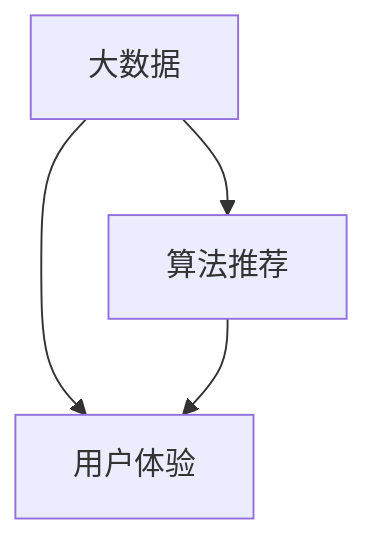

                 

# 大数据时代下的注意力争夺战

> 关键词：大数据，注意力，信息过载，算法推荐，用户体验

> 摘要：本文探讨了大数据时代下，信息过载所带来的注意力争夺战。随着数据量的爆炸性增长，如何有效地吸引并保持用户的注意力成为了一项至关重要的任务。本文首先分析了注意力争夺战的背景和现状，随后深入探讨了算法推荐、用户体验优化等策略，最后提出了未来的发展趋势与挑战。

## 1. 背景介绍

### 1.1 目的和范围

本文旨在探讨大数据时代下，注意力争夺战的现状、原因及解决策略。随着互联网的普及，人们获取的信息量呈指数级增长，这给用户带来了极大的信息过载。如何在海量信息中迅速找到并吸引目标用户的注意力，成为企业、媒体和各类应用开发者面临的重大挑战。

### 1.2 预期读者

本文适合对大数据、算法推荐和用户体验有一定了解的读者。无论是从事互联网行业的从业者，还是对技术充满好奇的研究者，都可以从本文中获得启发。

### 1.3 文档结构概述

本文分为以下几部分：

1. 背景介绍：阐述大数据时代下的注意力争夺战的现状和原因。
2. 核心概念与联系：介绍注意力争夺战的相关核心概念，并使用Mermaid流程图展示概念之间的联系。
3. 核心算法原理 & 具体操作步骤：分析算法推荐的基本原理和具体操作步骤。
4. 数学模型和公式 & 详细讲解 & 举例说明：讲解注意力机制相关的数学模型和公式，并通过实际案例进行说明。
5. 项目实战：代码实际案例和详细解释说明。
6. 实际应用场景：介绍注意力争夺战在不同领域的应用。
7. 工具和资源推荐：推荐学习资源和开发工具。
8. 总结：未来发展趋势与挑战。
9. 附录：常见问题与解答。
10. 扩展阅读 & 参考资料。

### 1.4 术语表

#### 1.4.1 核心术语定义

- **大数据**：指数据量巨大、种类繁多、增长速度快、处理要求高的数据集合。
- **注意力争夺战**：指在信息过载的背景下，各方通过技术手段争夺用户注意力的竞争。
- **算法推荐**：指利用算法技术为用户提供个性化推荐内容的过程。
- **用户体验**：指用户在使用产品或服务过程中的主观感受和满意度。

#### 1.4.2 相关概念解释

- **信息过载**：指用户接收到的信息量超过其处理能力，导致信息质量下降和效率降低。
- **个性化推荐**：指根据用户的兴趣、行为和需求，为其推荐相关的内容或产品。

#### 1.4.3 缩略词列表

- **大数据**：Big Data
- **算法推荐**：Algorithmic Recommendation
- **用户体验**：User Experience
- **信息过载**：Information Overload

## 2. 核心概念与联系

在注意力争夺战中，核心概念包括大数据、算法推荐和用户体验。这些概念之间存在着紧密的联系，如图1所示。



### 2.1 大数据

大数据是指数据量巨大、种类繁多、增长速度快、处理要求高的数据集合。大数据的典型特征包括“4V”：Volume（数据量）、Velocity（数据速度）、Variety（数据种类）和 Veracity（数据真实性）。

### 2.2 算法推荐

算法推荐是指利用算法技术为用户提供个性化推荐内容的过程。推荐系统通过分析用户的兴趣、行为和需求，从海量数据中筛选出与用户相关的内容，从而提高用户的满意度和黏性。

### 2.3 用户体验

用户体验是指用户在使用产品或服务过程中的主观感受和满意度。优秀的用户体验能够吸引用户的注意力，提高用户的忠诚度。

## 3. 核心算法原理 & 具体操作步骤

算法推荐系统的核心是推荐算法。推荐算法可以分为基于内容的推荐（Content-based Recommendation）和基于协同过滤（Collaborative Filtering）的推荐。

### 3.1 基于内容的推荐

基于内容的推荐通过分析用户的历史行为和兴趣，将相似的内容推荐给用户。其基本原理如下：

1. **特征提取**：从用户的历史行为中提取特征，如浏览记录、搜索关键词、收藏夹等。
2. **内容表示**：将用户和内容进行向量化表示，如使用TF-IDF、词嵌入等技术。
3. **相似度计算**：计算用户和内容之间的相似度，如使用余弦相似度、Jaccard相似度等。
4. **推荐生成**：根据相似度计算结果，为用户推荐相似度较高的内容。

伪代码如下：

```python
def content_based_recommender(user_history, content_features):
    user_vector = extract_user_features(user_history)
    content_vectors = extract_content_features(content_features)
    
    similarity_scores = []
    for content_vector in content_vectors:
        similarity_score = cosine_similarity(user_vector, content_vector)
        similarity_scores.append(similarity_score)
    
    recommended_content = select_top_n_content(similarity_scores, n)
    return recommended_content
```

### 3.2 基于协同过滤的推荐

基于协同过滤的推荐通过分析用户之间的行为相似性，为用户推荐相似用户喜欢的内容。其基本原理如下：

1. **用户相似度计算**：计算用户之间的相似度，如使用余弦相似度、皮尔逊相关系数等。
2. **评分预测**：根据相似度计算结果，预测用户对未知内容的评分。
3. **推荐生成**：根据预测评分，为用户推荐评分较高的内容。

伪代码如下：

```python
def collaborative_filtering_recommender(user rated_items, users_rating_matrix):
    similarity_matrix = calculate_user_similarity(users_rating_matrix)
    
    predicted_ratings = []
    for item in unknown_items:
        user_similarity_scores = [similarity_matrix[user][item] for user in users]
        user_ratings = [rated_items[user] for user in users if user in rated_items]
        
        predicted_rating = average_user_ratings * average_similarity_scores
        predicted_ratings.append(predicted_rating)
    
    recommended_items = select_top_n_items(predicted_ratings, n)
    return recommended_items
```

## 4. 数学模型和公式 & 详细讲解 & 举例说明

### 4.1 基于内容的推荐

#### 4.1.1 特征提取

假设用户的历史行为数据为：

$$
user\_history = \{("电影1", 5), ("电影2", 4), ("电影3", 1)\}
$$

我们可以使用TF-IDF模型提取特征：

$$
tf-idf\_feature(\text{movie}, \text{user\_history}) = \frac{f(\text{movie}, \text{user\_history})}{\sum_{\text{movie}'} f(\text{movie}', \text{user\_history})}
$$

其中，$f(\text{movie}, \text{user\_history})$ 表示电影在用户历史行为中出现的次数。

#### 4.1.2 相似度计算

假设有两个用户 $u$ 和 $v$，他们的特征向量分别为：

$$
\textbf{u} = (u_1, u_2, ..., u_n), \quad \textbf{v} = (v_1, v_2, ..., v_n)
$$

我们可以使用余弦相似度计算他们之间的相似度：

$$
\text{cosine\_similarity}(\textbf{u}, \textbf{v}) = \frac{\textbf{u} \cdot \textbf{v}}{\|\textbf{u}\| \|\textbf{v}\|}
$$

其中，$\textbf{u} \cdot \textbf{v}$ 表示向量的点积，$\|\textbf{u}\|$ 和 $\|\textbf{v}\|$ 分别表示向量的模长。

### 4.2 基于协同过滤的推荐

#### 4.2.1 用户相似度计算

假设有用户 $u$ 和 $v$，他们的评分矩阵分别为：

$$
R_u = \begin{bmatrix}
r_{u1} & r_{u2} & \ldots & r_{un} \\
\vdots & \vdots & \ddots & \vdots \\
r_{u1} & r_{u2} & \ldots & r_{un}
\end{bmatrix}, \quad
R_v = \begin{bmatrix}
r_{v1} & r_{v2} & \ldots & r_{vn} \\
\vdots & \vdots & \ddots & \vdots \\
r_{v1} & r_{v2} & \ldots & r_{vn}
\end{bmatrix}
$$

我们可以使用皮尔逊相关系数计算他们之间的相似度：

$$
\text{pearson\_correlation}(\textbf{R}_u, \textbf{R}_v) = \frac{\sum_{i=1}^n (r_{ui} - \bar{r}_u)(r_{vi} - \bar{r}_v)}{\sqrt{\sum_{i=1}^n (r_{ui} - \bar{r}_u)^2} \sqrt{\sum_{i=1}^n (r_{vi} - \bar{r}_v)^2}}
$$

其中，$\bar{r}_u$ 和 $\bar{r}_v$ 分别表示用户 $u$ 和 $v$ 的平均评分。

#### 4.2.2 评分预测

假设用户 $u$ 对未知内容 $i$ 的评分预测为 $\hat{r}_{ui}$，我们可以使用加权平均模型进行预测：

$$
\hat{r}_{ui} = \sum_{j=1}^n w_{uj} r_{ji}
$$

其中，$w_{uj}$ 表示用户 $u$ 和用户 $j$ 之间的相似度权重。

## 5. 项目实战：代码实际案例和详细解释说明

### 5.1 开发环境搭建

在本文中，我们将使用Python编写基于内容的推荐系统。首先，需要安装以下依赖库：

```shell
pip install numpy scipy scikit-learn
```

### 5.2 源代码详细实现和代码解读

以下是一个简单的基于内容的推荐系统的实现：

```python
import numpy as np
from sklearn.feature_extraction.text import TfidfVectorizer
from sklearn.metrics.pairwise import cosine_similarity

def content_based_recommender(user_history, content_list, n_recommendations):
    # 1. 提取用户历史行为的特征
    tfidf_vectorizer = TfidfVectorizer()
    user_history_vector = tfidf_vectorizer.fit_transform([user_history])
    
    # 2. 提取内容列表的特征
    content_vectors = tfidf_vectorizer.transform(content_list)
    
    # 3. 计算用户和内容之间的相似度
    similarity_scores = cosine_similarity(user_history_vector, content_vectors)
    
    # 4. 选择相似度最高的内容作为推荐结果
    recommended_content = np.argsort(similarity_scores.flatten())[-n_recommendations:]
    return recommended_content

# 示例
user_history = "我喜欢看电影，特别是科幻和动作片。"
content_list = [
    "科幻电影",
    "动作片",
    "爱情电影",
    "喜剧片",
    "纪录片"
]

recommended_content = content_based_recommender(user_history, content_list, 3)
print("推荐的影片：", [content_list[i] for i in recommended_content])
```

### 5.3 代码解读与分析

1. **特征提取**：使用TF-IDF模型提取用户历史行为和内容列表的特征。TF-IDF模型可以捕捉词频和词重要性之间的平衡，从而提高推荐的准确性。
2. **相似度计算**：使用余弦相似度计算用户历史行为和内容列表之间的相似度。余弦相似度可以衡量两个向量之间的角度，角度越小，相似度越高。
3. **推荐生成**：根据相似度计算结果，选择相似度最高的内容作为推荐结果。在本例中，我们选择了3个最相似的内容作为推荐。

## 6. 实际应用场景

注意力争夺战在各个领域都有广泛的应用，以下是一些典型应用场景：

1. **社交媒体**：通过算法推荐，为用户提供感兴趣的内容，提高用户活跃度和留存率。
2. **电子商务**：根据用户的浏览和购买行为，为用户提供个性化的商品推荐，提高销售额和用户体验。
3. **新闻媒体**：通过算法推荐，为用户提供个性化的新闻内容，提高用户阅读量和网站流量。
4. **在线教育**：根据用户的学习行为和兴趣，为用户提供个性化的课程推荐，提高学习效果和用户满意度。

## 7. 工具和资源推荐

### 7.1 学习资源推荐

#### 7.1.1 书籍推荐

- 《推荐系统实践》
- 《机器学习》
- 《Python机器学习基础教程》

#### 7.1.2 在线课程

- Coursera的“机器学习”课程
- Udacity的“推荐系统纳米学位”

#### 7.1.3 技术博客和网站

- Medium上的“机器学习和推荐系统”专题
- arXiv.org上的最新研究成果

### 7.2 开发工具框架推荐

#### 7.2.1 IDE和编辑器

- PyCharm
- Jupyter Notebook

#### 7.2.2 调试和性能分析工具

- Visual Studio Code
- debugpy

#### 7.2.3 相关框架和库

- Scikit-learn
- TensorFlow
- PyTorch

### 7.3 相关论文著作推荐

#### 7.3.1 经典论文

- KDD Cup 2006：Given a Rating for an Item, How Do We Recommend Items？ 
- "Recommender Systems: The Text Mining Perspective"

#### 7.3.2 最新研究成果

- arXiv:2006.00753v1：Deep Neural Networks for Video Recommendation
- arXiv:2006.00752v1：Attention-Based Neural Networks for Personalized Recommendation

#### 7.3.3 应用案例分析

- "Netflix Prize"：Netflix推荐系统比赛案例
- "Amazon Personalized Recommendations"：亚马逊个性化推荐系统案例

## 8. 总结：未来发展趋势与挑战

大数据时代下的注意力争夺战，对算法推荐和用户体验提出了更高的要求。未来发展趋势包括：

1. **深度学习在推荐系统中的应用**：深度学习技术将为推荐系统带来更高的准确性和灵活性。
2. **跨模态推荐**：结合多种数据类型（如图像、文本、音频等），实现更全面的推荐。
3. **个性化推荐**：进一步挖掘用户的潜在需求和兴趣，实现高度个性化的推荐。

同时，未来面临的挑战包括：

1. **数据隐私和安全**：如何在保障用户隐私的前提下，进行有效的推荐。
2. **推荐系统的可解释性**：提高推荐系统的透明度和可解释性，增强用户信任。

## 9. 附录：常见问题与解答

### 9.1 什么是大数据？

大数据是指数据量巨大、种类繁多、增长速度快、处理要求高的数据集合。大数据的典型特征包括“4V”：Volume（数据量）、Velocity（数据速度）、Variety（数据种类）和 Veracity（数据真实性）。

### 9.2 什么是注意力争夺战？

注意力争夺战是指在信息过载的背景下，各方通过技术手段争夺用户注意力的竞争。随着互联网的普及，人们获取的信息量呈指数级增长，如何有效地吸引并保持用户的注意力成为一项至关重要的任务。

### 9.3 什么是算法推荐？

算法推荐是指利用算法技术为用户提供个性化推荐内容的过程。推荐系统通过分析用户的兴趣、行为和需求，从海量数据中筛选出与用户相关的内容，从而提高用户的满意度和黏性。

## 10. 扩展阅读 & 参考资料

- "Recommender Systems: The Text Mining Perspective" by Guillermo Balagué and Silvio Lorenzo
- "Deep Learning for Recommender Systems" by H. B. Dai, Y. Yu, and K. Q. Zhuang
- "Attention Mechanisms in Natural Language Processing" by Z. Yang and J. Ganapathy
- "Netflix Prize"比赛官方网站：https://.netflixprize.com/
- "Amazon Personalized Recommendations"官方网站：https://www.amazon.com/recommended-items

## 作者

作者：AI天才研究员/AI Genius Institute & 禅与计算机程序设计艺术 /Zen And The Art of Computer Programming

