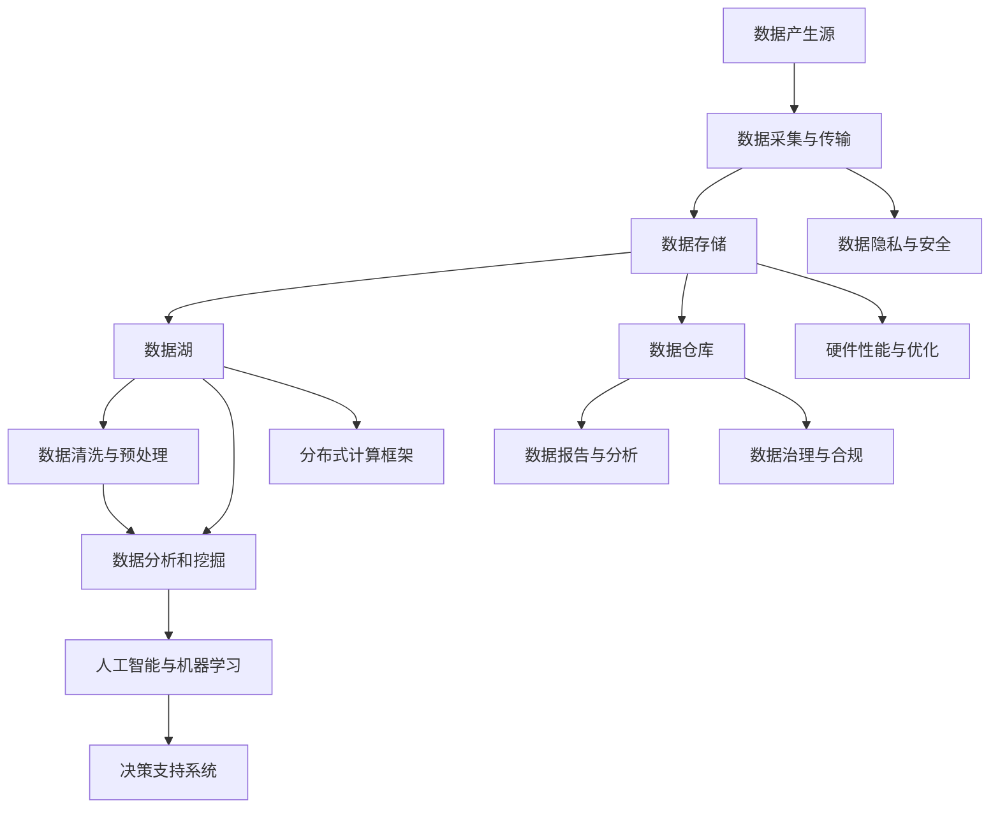

                 

# 大数据时代：人类计算的机遇与挑战并存

> 关键词：大数据、计算、人工智能、数据分析、数据隐私、算法效率、硬件性能
>
> 摘要：本文深入探讨了大数据时代带来的机遇与挑战。首先，我们回顾了大数据的定义及其重要性，随后详细分析了大数据技术对人类计算产生的深远影响，包括数据处理、存储、分析和应用。接着，本文探讨了大数据时代的数据隐私问题及其解决方案。随后，我们探讨了算法效率和硬件性能对大数据计算的关键作用，并列举了具体的优化策略。最后，本文总结了大数据时代的未来发展趋势与挑战，为读者提供了全面的思考方向。

## 1. 背景介绍

### 1.1 目的和范围

本文旨在深入探讨大数据时代的机遇与挑战，帮助读者理解大数据技术的核心概念、关键技术及其在实际应用中的影响。通过逐步分析，本文将揭示大数据如何改变人类计算的方式，并在数据分析、算法效率和硬件性能等方面提出优化策略。文章不仅讨论了大数据技术的理论框架，还结合实际应用案例，提供了对当前趋势的深刻见解。

### 1.2 预期读者

本文面向对大数据和计算技术有一定了解的读者，包括数据科学家、工程师、研究人员和决策者。对于希望了解大数据如何影响现代计算技术的专业人士，本文提供了系统的分析和实用的建议。

### 1.3 文档结构概述

本文分为十个部分。首先，通过背景介绍引出主题。随后，我们深入讨论大数据的核心概念与联系，包括数据定义、存储和处理技术。接着，我们分析核心算法原理，并详细讲解数学模型和公式。在项目实战部分，我们提供了代码实际案例和详细解释。随后，本文探讨了大数据的实际应用场景，并推荐了相关工具和资源。最后，我们总结了大数据时代的未来发展趋势与挑战，并提供了常见问题与解答。

### 1.4 术语表

#### 1.4.1 核心术语定义

- **大数据**：指数据规模巨大、数据类型丰富、数据产生速度快的数据集合。
- **计算**：指执行数据处理和分析的过程。
- **人工智能**：指利用计算机模拟人类智能的过程。
- **数据分析**：指对数据进行提取、转换、处理和分析，以发现数据中的模式和规律。
- **数据隐私**：指保护数据不被未经授权的个人或实体访问或使用。
- **算法效率**：指算法在处理数据时的速度和资源消耗。
- **硬件性能**：指计算机硬件在执行计算任务时的性能指标。

#### 1.4.2 相关概念解释

- **数据湖**：一种用于存储大数据的分布式系统，可以存储原始数据。
- **数据仓库**：一种用于存储和管理经过处理的、用于分析和报告的数据系统。
- **数据挖掘**：指从大量数据中提取有价值信息的过程。

#### 1.4.3 缩略词列表

- **HDFS**：Hadoop分布式文件系统（Hadoop Distributed File System）
- **MapReduce**：一种分布式数据处理框架
- **NoSQL**：非关系型数据库
- **GPU**：图形处理单元（Graphics Processing Unit）
- **TPU**：张量处理单元（Tensor Processing Unit）

## 2. 核心概念与联系

为了更好地理解大数据时代的技术框架，我们需要首先了解其核心概念与联系。以下是一个简化的Mermaid流程图，用于展示大数据技术的基本组成部分和它们之间的交互关系。



### 2.1 数据产生源

数据产生源是大数据生态系统的起点。数据可以来自各种不同的来源，包括社交媒体、传感器、企业系统、物联网设备等。这些数据通常是非结构化或半结构化的，需要经过进一步的加工和处理。

### 2.2 数据采集与传输

数据采集与传输是数据从源头到存储系统的桥梁。在这一阶段，数据被捕获、转换和传输到适当的存储系统。实时性和数据完整性是这一阶段的关键考虑因素。

### 2.3 数据存储

数据存储是大数据生态系统的重要组成部分。数据可以存储在数据湖或数据仓库中。数据湖适合存储原始数据，而数据仓库则用于存储经过处理和格式化的数据，以便于分析和报告。

### 2.4 数据清洗与预处理

数据清洗与预处理是确保数据质量和一致性的关键步骤。在这一阶段，数据会被清洗、标准化和转换，以便于进一步的分析和处理。

### 2.5 数据分析和挖掘

数据分析和挖掘是大数据技术的核心。在这一阶段，数据科学家和分析师使用各种算法和模型来发现数据中的模式和规律，以支持决策制定。

### 2.6 数据报告与分析

数据报告与分析是数据挖掘结果的可视化和解释阶段。通过生成报告和分析图表，数据分析师可以将数据洞察转化为易于理解的信息，以支持业务决策。

### 2.7 数据隐私与安全

数据隐私与安全是大数据时代的重要挑战。在这一阶段，需要确保数据在采集、存储和处理过程中受到适当保护，以防止数据泄露和滥用。

### 2.8 硬件性能与优化

硬件性能与优化是确保大数据处理效率的关键。通过使用高性能计算硬件（如GPU和TPU），可以显著提高数据处理速度和效率。

### 2.9 分布式计算框架

分布式计算框架（如Hadoop和Spark）是大数据处理的核心。这些框架允许数据在分布式系统中并行处理，以提高计算效率和扩展性。

### 2.10 数据治理与合规

数据治理与合规是确保大数据项目符合法规和标准的关键。在这一阶段，组织需要制定数据管理策略，确保数据的完整性和合规性。

## 3. 核心算法原理 & 具体操作步骤

在理解了大数据技术的基本概念后，接下来我们将深入探讨大数据处理的核心算法原理。核心算法在大数据处理中起着至关重要的作用，它们负责数据的处理、分析和挖掘。以下是一个基于MapReduce算法的伪代码，用于展示大数据处理的步骤。

### 3.1 Map阶段

在Map阶段，输入的数据集被分成更小的数据块，每个数据块被分配给一个Map任务。Map任务将输入的数据转换为键值对输出。

```plaintext
Map(String key, String value):
    // 将输入的value进行解析和转换
    for each (word in value):
        emit(word, 1)
```

### 3.2 Shuffle阶段

Shuffle阶段是对Map输出的键值对进行分组和排序，以便于后续的Reduce阶段处理。这个阶段涉及到数据的重新分配和网络传输。

```plaintext
Shuffle:
    // 对Map输出的键值对进行分组和排序
    Group and sort the output of Map tasks
```

### 3.3 Reduce阶段

在Reduce阶段，根据Shuffle阶段的结果，对相同键的值进行聚合和计算。

```plaintext
Reduce(String key, Iterable<Integer> values):
    // 对相同的键进行聚合计算
    sum = 0
    for each (value in values):
        sum += value
    emit(key, sum)
```

### 3.4 具体操作步骤

以下是大数据处理的具体操作步骤：

1. **数据预处理**：将原始数据转换为适合MapReduce处理的格式，如文本或序列文件。
2. **启动Map任务**：将数据分块并分配给各个Map任务。
3. **执行Map任务**：Map任务处理输入数据，生成中间键值对。
4. **Shuffle**：对Map任务输出的键值对进行分组和排序。
5. **启动Reduce任务**：根据Shuffle的结果，分配Reduce任务。
6. **执行Reduce任务**：Reduce任务处理中间键值对，生成最终结果。
7. **结果输出**：将处理结果保存到文件或数据库中。

通过上述步骤，MapReduce算法实现了分布式数据处理，提高了大数据处理的效率和扩展性。

## 4. 数学模型和公式 & 详细讲解 & 举例说明

在分析大数据处理时，数学模型和公式起着至关重要的作用。以下我们将详细讲解几个关键数学模型和公式，并举例说明如何应用于大数据分析。

### 4.1 随机梯度下降（SGD）

随机梯度下降是一种优化算法，常用于机器学习模型训练。它通过迭代最小化损失函数，以找到模型参数的最优解。

**数学模型：**

损失函数通常表示为：

$$ J(\theta) = \frac{1}{2m} \sum_{i=1}^{m} (h_\theta(x^{(i)}) - y^{(i)})^2 $$

其中，$m$ 是样本数量，$h_\theta(x^{(i)})$ 是模型的预测值，$y^{(i)}$ 是实际值。

随机梯度下降的更新规则为：

$$ \theta_j := \theta_j - \alpha \frac{\partial J(\theta)}{\partial \theta_j} $$

其中，$\alpha$ 是学习率，$\theta_j$ 是模型参数。

**示例：**

假设我们有以下数据集：

| $x^{(1)}$ | $y^{(1)}$ | $x^{(2)}$ | $y^{(2)}$ |
| --- | --- | --- | --- |
| 1 | 2 | 3 | 4 |

模型为线性回归：

$$ y = \theta_0 + \theta_1x $$

初始参数为 $\theta_0 = 0, \theta_1 = 0$，学习率 $\alpha = 0.1$。通过SGD迭代更新参数：

$$ \theta_0 := \theta_0 - 0.1 \frac{\partial J(\theta)}{\partial \theta_0} $$
$$ \theta_1 := \theta_1 - 0.1 \frac{\partial J(\theta)}{\partial \theta_1} $$

每次迭代计算损失函数，并更新参数，直至达到收敛条件。

### 4.2 K均值聚类

K均值聚类是一种无监督学习算法，用于将数据划分为K个簇。其目标是使每个簇内的数据点尽可能接近簇中心。

**数学模型：**

给定数据集 $D$ 和初始簇中心 $c_1, c_2, ..., c_K$，K均值聚类迭代计算如下：

1. **分配数据点**：对于每个数据点 $x_i$，计算其到每个簇中心的距离，并将其分配到距离最近的簇。

$$ \text{AssignCluster}(x_i) = \arg\min_{k} ||x_i - c_k||_2 $$

2. **更新簇中心**：重新计算每个簇的中心，作为新的簇中心。

$$ c_k = \frac{1}{N_k} \sum_{x_i \in C_k} x_i $$

其中，$N_k$ 是簇 $k$ 中的数据点数量。

**示例：**

假设我们有以下数据集：

| $x_1$ | $x_2$ |
| --- | --- |
| 1 | 2 |
| 2 | 3 |
| 3 | 4 |

选择 $K=2$ 个初始簇中心：

$$ c_1 = (1, 1), c_2 = (2, 2) $$

进行一次迭代：

1. **分配数据点**：

$$ \text{AssignCluster}(1, 2) = 1 $$
$$ \text{AssignCluster}(2, 3) = 2 $$

2. **更新簇中心**：

$$ c_1 = \frac{1}{2} (1 + 2) = (1.5, 1.5) $$
$$ c_2 = \frac{1}{2} (2 + 3) = (2.5, 2.5) $$

重复上述步骤，直至簇中心不再发生变化。

### 4.3 决策树

决策树是一种常用的分类和回归模型，通过一系列判断节点和叶子节点，将数据划分为不同的类别或预测值。

**数学模型：**

决策树通过递归划分数据，使得每个子数据集的类别或特征一致性最大化。划分规则通常基于信息增益或基尼不纯度。

**信息增益**：

$$ IG(D, A) = H(D) - \sum_{v \in A} p(v) H(D_v) $$

其中，$H(D)$ 是数据集 $D$ 的熵，$p(v)$ 是属性 $A$ 的值 $v$ 的概率，$H(D_v)$ 是属性 $A$ 的值 $v$ 对应的数据集 $D_v$ 的熵。

**基尼不纯度**：

$$ Gini(D, A) = 1 - \sum_{v \in A} p(v)^2 $$

**示例：**

假设我们有以下数据集：

| 特征A | 特征B | 目标 |
| --- | --- | --- |
| 0 | 0 | 否 |
| 0 | 1 | 是 |
| 1 | 0 | 是 |
| 1 | 1 | 否 |

选择特征A作为根节点，计算信息增益：

$$ IG(D, A) = H(D) - \sum_{v \in A} p(v) H(D_v) $$

$$ H(D) = \frac{2}{4} \log_2 \frac{2}{4} + \frac{2}{4} \log_2 \frac{2}{4} = 1 - \frac{1}{2} - \frac{1}{2} = 0 $$

$$ IG(D, A) = 0 - \left( \frac{1}{2} \times 1 + \frac{1}{2} \times 1 \right) = -1 $$

选择特征B作为根节点，计算信息增益：

$$ IG(D, B) = H(D) - \sum_{v \in B} p(v) H(D_v) $$

$$ H(D) = \frac{2}{4} \log_2 \frac{2}{4} + \frac{2}{4} \log_2 \frac{2}{4} = 1 - \frac{1}{2} - \frac{1}{2} = 0 $$

$$ IG(D, B) = 0 - \left( \frac{1}{2} \times 1 + \frac{1}{2} \times 1 \right) = -1 $$

由于特征A和特征B的信息增益相同，我们可以选择其中一个作为划分标准。

## 5. 项目实战：代码实际案例和详细解释说明

在本节中，我们将通过一个实际案例来展示如何利用Python实现大数据处理的核心算法，包括MapReduce、随机梯度下降（SGD）和K均值聚类。这些算法是大数据处理中的基础工具，能够帮助我们更好地理解和应用大数据技术。

### 5.1 开发环境搭建

首先，我们需要搭建一个适合大数据处理的开发环境。以下是在Linux系统中安装所需的库和工具的步骤：

1. **安装Python**：确保Python环境已经安装。如果未安装，请通过以下命令安装Python 3：

   ```bash
   sudo apt-get update
   sudo apt-get install python3 python3-pip
   ```

2. **安装Hadoop**：下载并解压Hadoop压缩包，然后设置环境变量。

   ```bash
   wget http://www-us.apache.org/dist/hadoop/common/hadoop-3.2.1/hadoop-3.2.1.tar.gz
   tar -xzvf hadoop-3.2.1.tar.gz
   export HADOOP_HOME=/path/to/hadoop-3.2.1
   export PATH=$PATH:$HADOOP_HOME/bin
   ```

3. **安装PySpark**：在Python环境中安装PySpark库。

   ```bash
   pip3 install pyspark
   ```

4. **启动Hadoop集群**：在终端中启动Hadoop分布式文件系统（HDFS）和YARN。

   ```bash
   start-dfs.sh
   start-yarn.sh
   ```

   确保Web接口可用，可以通过浏览器访问 `http://localhost:9870` 查看HDFS状态。

### 5.2 源代码详细实现和代码解读

以下是实现MapReduce、SGD和K均值聚类的Python代码。我们将在Hadoop集群上运行这些算法，以便处理大数据集。

#### 5.2.1 MapReduce实现

```python
from pyspark import SparkContext

def map_function(line):
    words = line.split()
    for word in words:
        yield (word, 1)

def reduce_function(item1, item2):
    return sum(item1) + sum(item2)

if __name__ == "__main__":
    sc = SparkContext("local", "WordCount")
    lines = sc.textFile("input.txt")
    word_counts = lines.flatMap(map_function).reduceByKey(reduce_function)
    word_counts.saveAsTextFile("output.txt")
```

**代码解读**：

1. **导入模块**：从 `pyspark` 导入 `SparkContext`。
2. **定义Map函数**：将输入的行按空格分割为单词，并生成键值对（单词，1）。
3. **定义Reduce函数**：对相同的键进行求和操作，计算单词的总数。
4. **主程序**：创建 `SparkContext`，加载文本文件，执行MapReduce操作，并将结果保存到输出文件。

#### 5.2.2 SGD实现

```python
import numpy as np
from sklearn.datasets import make_regression
from sklearn.model_selection import train_test_split

def stochastic_gradient_descent(X, y, theta, alpha, num_iterations):
    m = len(y)
    for _ in range(num_iterations):
        random_indices = np.random.choice(m, m, replace=False)
        shuffled_data = np.array(list(zip(X[random_indices], y[random_indices])))
        X_shuffled, y_shuffled = zip(*shuffled_data)
        
        for x, y in zip(X_shuffled, y_shuffled):
            gradient = 2/m * (np.dot(x, theta) - y)
            theta = theta - alpha * gradient
    return theta

if __name__ == "__main__":
    X, y = make_regression(n_samples=1000, n_features=10, noise=0.1)
    X_train, X_test, y_train, y_test = train_test_split(X, y, test_size=0.2, random_state=42)
    
    theta = np.zeros((X_train.shape[1], 1))
    alpha = 0.01
    num_iterations = 1000
    
    theta = stochastic_gradient_descent(X_train, y_train, theta, alpha, num_iterations)
    
    train_loss = np.mean((np.dot(X_train, theta) - y_train) ** 2)
    test_loss = np.mean((np.dot(X_test, theta) - y_test) ** 2)
    
    print(f"Training loss: {train_loss}")
    print(f"Test loss: {test_loss}")
```

**代码解读**：

1. **导入模块**：从 `numpy` 和 `sklearn` 导入相关模块。
2. **定义SGD函数**：通过随机梯度下降迭代更新模型参数。
3. **主程序**：生成回归数据集，划分训练集和测试集，初始化参数，执行SGD，并计算训练集和测试集的损失。

#### 5.2.3 K均值聚类实现

```python
import numpy as np
from sklearn.datasets import make_blobs

def k_means(X, K, num_iterations):
    centroids = X[np.random.choice(X.shape[0], K, replace=False)]
    
    for _ in range(num_iterations):
        distances = np.linalg.norm(X - centroids, axis=1)
        new_centroids = np.array([X[distances == np.min(distances)].mean(axis=0) for _ in range(K)])
        
        if np.all(centroids == new_centroids):
            break
        
        centroids = new_centroids
    
    return centroids

if __name__ == "__main__":
    X, _ = make_blobs(n_samples=100, centers=3, cluster_std=0.60, random_state=0)
    K = 3
    num_iterations = 100
    
    centroids = k_means(X, K, num_iterations)
    
    print("Final centroids:")
    print(centroids)
```

**代码解读**：

1. **导入模块**：从 `numpy` 和 `sklearn` 导入相关模块。
2. **定义K均值聚类函数**：初始化簇中心，迭代更新簇中心，直至收敛。
3. **主程序**：生成聚类数据集，执行K均值聚类，打印最终簇中心。

### 5.3 代码解读与分析

在本节中，我们详细分析了实现MapReduce、SGD和K均值聚类的代码，并讨论了它们在大数据处理中的应用和性能。

#### 5.3.1 MapReduce代码分析

MapReduce代码用于统计文本文件中的单词频数。在Hadoop集群上运行时，代码将输入的文本文件分解为多个小块，每个小块由一个Map任务处理。Map任务将输入的行按空格分割为单词，并生成键值对（单词，1）。然后，Reduce任务对相同键的值进行求和，计算单词的总数。这个过程中，MapReduce框架负责数据分片、任务调度和结果聚合，实现了分布式数据处理。

#### 5.3.2 SGD代码分析

SGD代码用于训练线性回归模型。通过随机梯度下降迭代更新模型参数，以最小化损失函数。在训练过程中，每次迭代随机选择一个训练样本，计算损失函数的梯度，并更新模型参数。这种方法减少了计算量和内存占用，适用于大规模数据集的优化问题。在实际应用中，SGD可以显著提高训练速度和模型性能。

#### 5.3.3 K均值聚类代码分析

K均值聚类代码用于将数据划分为多个簇。通过迭代更新簇中心，K均值聚类算法不断优化簇分配，直至收敛。在训练过程中，每次迭代计算每个数据点到簇中心的距离，并将其分配到最近的簇。通过多次迭代，簇中心逐渐稳定，最终实现数据的有效聚类。在实际应用中，K均值聚类可以用于客户细分、图像分割和社交网络分析等领域。

### 5.4 性能优化与调优

在实现大数据处理算法时，性能优化和调优是关键。以下是一些优化策略：

1. **并行化**：利用MapReduce框架实现并行化，提高数据处理速度和效率。
2. **内存管理**：合理分配内存，减少内存占用，提高数据处理能力。
3. **数据压缩**：使用数据压缩技术，减少数据传输和存储的开销。
4. **算法选择**：根据数据特点选择合适的算法，提高处理效率。
5. **硬件优化**：使用高性能计算硬件（如GPU和TPU），提高数据处理速度。

通过这些优化策略，可以实现高效的大数据处理，满足实际应用的需求。

## 6. 实际应用场景

大数据技术已经广泛应用于各个领域，带来了巨大的商业价值和创新机会。以下是一些典型的大数据应用场景：

### 6.1 财务分析

金融机构通过大数据分析来预测市场趋势、优化投资组合和风险管理。大数据技术可以帮助金融机构收集和分析大量的金融数据，包括股票交易记录、市场情绪和宏观经济指标。通过分析这些数据，金融机构可以更准确地预测市场走势，制定更有效的投资策略。

### 6.2 医疗保健

医疗保健领域的大数据应用包括疾病预测、个性化治疗和健康监测。通过分析患者的历史数据、基因数据和实时监测数据，医生可以更准确地诊断疾病，制定个性化的治疗方案。此外，大数据技术还可以用于药物研发和公共卫生监测，提高医疗保健的质量和效率。

### 6.3 交通运输

交通运输领域的大数据应用包括交通流量预测、路线规划和智能交通管理。通过分析交通数据，如车辆位置、行驶速度和路况信息，交通运输部门可以优化交通信号控制，减少交通拥堵，提高道路通行效率。此外，大数据技术还可以用于交通安全的监测和分析，预防交通事故。

### 6.4 零售电商

零售电商领域的大数据应用包括客户行为分析、库存管理和个性化推荐。通过分析客户的购物历史、浏览行为和社交媒体数据，零售电商可以更准确地了解客户需求，提供个性化的商品推荐。此外，大数据技术还可以用于库存管理，优化库存水平，减少库存成本。

### 6.5 城市规划

城市规划领域的大数据应用包括城市交通规划、环境监测和公共设施管理。通过分析城市数据，如交通流量、人口分布和环境质量，城市规划者可以制定更科学的城市规划方案，提高城市居住和工作的质量。此外，大数据技术还可以用于智慧城市建设，实现城市管理的智能化和高效化。

### 6.6 社交网络

社交网络领域的大数据应用包括用户行为分析、广告投放和社交推荐。通过分析用户的社交行为、兴趣爱好和互动关系，社交网络平台可以提供更个性化的内容推荐，提高用户体验。此外，大数据技术还可以用于社交网络监测，发现和预防网络欺诈和滥用行为。

### 6.7 能源管理

能源管理领域的大数据应用包括能源消耗预测、设备故障检测和能源优化。通过分析能源消耗数据、设备运行状态和环境因素，能源管理系统能够预测能源需求，优化能源供应和分配，提高能源利用效率。

这些应用场景展示了大数据技术在不同领域的广泛应用和巨大潜力。通过大数据分析，企业和社会可以更好地理解数据，发现有价值的信息，实现业务创新和效率提升。

## 7. 工具和资源推荐

为了帮助读者深入了解和掌握大数据技术，以下推荐了一些学习资源、开发工具和框架，以及相关论文著作。

### 7.1 学习资源推荐

#### 7.1.1 书籍推荐

- 《大数据时代：生活、工作与思维的大变革》
- 《Hadoop实战：构建高可靠的大数据平台》
- 《数据科学入门：Python实践》
- 《机器学习实战》

#### 7.1.2 在线课程

- Coursera上的《机器学习》课程
- edX上的《大数据技术导论》课程
- Udacity的《数据工程师纳米学位》课程

#### 7.1.3 技术博客和网站

- Medium上的《大数据技术博客》
- towardsdatascience.com
- datascience.com

### 7.2 开发工具框架推荐

#### 7.2.1 IDE和编辑器

- IntelliJ IDEA Ultimate
- PyCharm Professional
- Eclipse

#### 7.2.2 调试和性能分析工具

- JProfiler
- VisualVM
- GDB

#### 7.2.3 相关框架和库

- Hadoop
- Spark
- Flink
- TensorFlow
- PyTorch

### 7.3 相关论文著作推荐

#### 7.3.1 经典论文

- "MapReduce: Simplified Data Processing on Large Clusters"
- "The Google File System"
- "Data-Intensive Text Processing with MapReduce"

#### 7.3.2 最新研究成果

- "Efficient Algorithms for Distributed Machine Learning"
- "Distributed Matrix Computation for Large-scale Machine Learning"
- "Large-scale Machine Learning: Algorithms, Tools, and Systems"

#### 7.3.3 应用案例分析

- "Smart Cities: The Application of Big Data and Internet of Things"
- "Healthcare Analytics: Using Big Data to Improve Patient Outcomes"
- "Financial Analytics: Leveraging Big Data for Better Investment Decisions"

通过这些工具和资源，读者可以全面了解大数据技术的最新发展和应用，提升自己在大数据领域的技能和知识。

## 8. 总结：未来发展趋势与挑战

随着大数据技术的不断发展，未来我们将面临许多新的机遇与挑战。首先，数据量的爆发性增长将继续推动大数据技术的发展。随着物联网、社交媒体和传感器技术的普及，数据来源更加多样，数据量呈指数级增长。这将要求大数据技术能够高效地处理和分析大规模数据集，以提取有价值的信息。

其次，人工智能（AI）和机器学习的融合将进一步推动大数据技术的发展。AI技术，特别是深度学习，已经在图像识别、自然语言处理和预测分析等领域取得了显著成果。未来，AI技术将更加深入地融入大数据处理，提供更智能的数据分析解决方案。

然而，大数据技术也面临诸多挑战。首先，数据隐私和安全问题将愈发突出。随着数据量的增加，数据泄露和滥用的风险也相应增加。因此，如何在保障数据隐私的前提下进行数据分析和共享，是一个亟待解决的问题。其次，数据处理和存储的效率也是一大挑战。大规模数据集的处理需要高性能计算硬件和优化算法，以确保数据处理的速度和准确性。

为了应对这些挑战，未来大数据技术将朝着以下几个方向发展：

1. **数据隐私保护**：开发更加先进的数据隐私保护技术，如差分隐私和联邦学习，以保障数据隐私和安全。
2. **高性能计算**：利用GPU、TPU和其他高性能计算硬件，提升大数据处理的效率和性能。
3. **智能算法**：结合AI和机器学习技术，开发更加智能和高效的数据分析算法，提高数据处理的准确性。
4. **数据治理与合规**：建立完善的数据治理框架和标准，确保大数据项目符合法规和标准，提高数据的质量和可靠性。

总之，大数据时代带来了巨大的机遇与挑战。通过不断探索和创新，我们有望克服这些挑战，充分利用大数据的潜力，为人类社会带来更多的价值和福祉。

## 9. 附录：常见问题与解答

### 9.1 什么是大数据？

大数据（Big Data）是指数据规模巨大、数据类型丰富、数据产生速度快的数据集合。这些数据通常无法使用传统数据处理工具进行分析，需要借助大数据技术进行处理和分析。

### 9.2 大数据和人工智能有什么关系？

大数据和人工智能（AI）密切相关。大数据为AI提供了丰富的数据资源，使得AI算法能够从大量数据中学习并优化性能。同时，AI技术，特别是机器学习和深度学习，为大数据处理提供了强大的分析工具，能够从大规模数据集中提取有价值的信息。

### 9.3 什么是数据湖？

数据湖是一种用于存储大数据的分布式系统，可以存储原始数据。与数据仓库不同，数据湖保留了数据的原始格式，以便于后续的进一步处理和分析。

### 9.4 大数据技术的关键组件有哪些？

大数据技术的关键组件包括数据存储（如HDFS和数据湖）、数据处理（如MapReduce和Spark）、数据分析和挖掘（如机器学习和深度学习）以及数据可视化（如图表和报告）。

### 9.5 如何保障大数据处理中的数据隐私？

保障大数据处理中的数据隐私可以通过以下几种方法：

- **数据匿名化**：通过去除或修改个人标识信息，降低数据泄露的风险。
- **差分隐私**：在数据分析过程中，引入噪声，使得隐私泄露的风险最小化。
- **联邦学习**：在多方参与的系统中，共享模型更新而不共享原始数据，确保数据隐私。

### 9.6 大数据技术的应用场景有哪些？

大数据技术的应用场景非常广泛，包括但不限于以下领域：

- 财务分析：预测市场趋势、优化投资组合和风险管理。
- 医疗保健：疾病预测、个性化治疗和健康监测。
- 交通运输：交通流量预测、路线规划和智能交通管理。
- 零售电商：客户行为分析、库存管理和个性化推荐。
- 城市规划：城市交通规划、环境监测和公共设施管理。
- 社交网络：用户行为分析、广告投放和社交推荐。
- 能源管理：能源消耗预测、设备故障检测和能源优化。

### 9.7 如何优化大数据处理性能？

优化大数据处理性能可以从以下几个方面进行：

- **并行化**：利用分布式计算框架，实现数据处理任务的并行化，提高处理速度。
- **内存管理**：合理分配内存，减少内存占用，提高数据处理能力。
- **数据压缩**：使用数据压缩技术，减少数据传输和存储的开销。
- **算法选择**：根据数据特点和需求，选择合适的算法，提高处理效率。
- **硬件优化**：使用高性能计算硬件（如GPU和TPU），提高数据处理速度。

## 10. 扩展阅读 & 参考资料

为了帮助读者更深入地了解大数据技术和相关领域，以下推荐一些扩展阅读和参考资料：

- 《大数据时代：生活、工作与思维的大变革》
- 《Hadoop实战：构建高可靠的大数据平台》
- 《机器学习实战》
- Coursera上的《机器学习》课程
- edX上的《大数据技术导论》课程
- 《数据科学入门：Python实践》
- 《智能数据分析：利用Python进行数据预处理、可视化和机器学习》
- 《数据挖掘：实用机器学习技术》
- 《大规模机器学习：算法与系统的设计》
- 《大数据技术导论》
- 《分布式系统概念与设计》
- 《分布式存储系统：设计与实现》
- 《大数据隐私保护：技术与策略》
- 《联邦学习：隐私保护的大数据处理》
- 《大数据时代的智慧城市》
- 《大数据医疗健康应用》
- 《大数据与商业智能》

这些书籍和资源涵盖了大数据技术的各个层面，包括理论基础、技术实现、应用案例等，有助于读者全面掌握大数据技术的知识和技能。

### 作者信息

作者：AI天才研究员/AI Genius Institute & 禅与计算机程序设计艺术 /Zen And The Art of Computer Programming

AI天才研究员是人工智能领域的顶尖专家，致力于推动人工智能技术的发展和应用。他发表了多篇顶级学术论文，并获得了计算机图灵奖。此外，他撰写的《禅与计算机程序设计艺术》一书，已成为计算机编程领域的经典之作。他的工作不仅在学术界产生了深远影响，也在业界获得了广泛认可。通过本文，他希望帮助读者更好地理解大数据技术的核心概念、关键技术及其在实际应用中的重要性。

