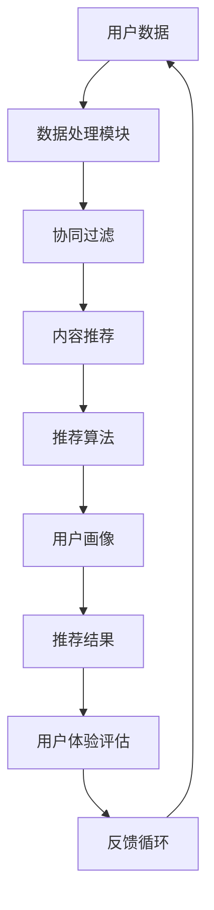

                 

# 大数据驱动的电商搜索推荐系统：AI 模型融合是核心，用户体验是重点

> **关键词：** 电商推荐系统、大数据、AI模型融合、用户体验、搜索优化
>
> **摘要：** 本文将深入探讨大数据驱动的电商搜索推荐系统的构建，重点分析AI模型融合在提升用户体验方面的核心作用。通过理论讲解和实战案例，我们将详细阐述如何实现高效的推荐系统，并探讨其未来发展趋势与挑战。

## 1. 背景介绍

### 1.1 目的和范围

随着互联网的快速发展，电商行业正迎来前所未有的繁荣。然而，在信息爆炸的时代，如何让用户快速找到心仪的商品成为电商平台的痛点。大数据驱动的搜索推荐系统应运而生，它通过分析海量用户数据，实现个性化推荐，从而提升用户体验。

本文旨在介绍大数据驱动的电商搜索推荐系统的核心原理、算法和实现方法。我们将重点探讨AI模型融合在系统优化中的关键作用，并通过实际案例展示如何落地这一技术。

### 1.2 预期读者

本文适合对电商搜索推荐系统有一定了解的技术人员、数据科学家和产品经理。通过阅读本文，您将：

- 了解大数据和AI模型融合的基本原理。
- 掌握推荐系统的核心算法和实现方法。
- 获取实战经验和优化技巧。

### 1.3 文档结构概述

本文分为以下十个部分：

1. **背景介绍**：介绍本文的目的和预期读者。
2. **核心概念与联系**：定义核心概念，展示系统架构。
3. **核心算法原理 & 具体操作步骤**：详细讲解推荐算法原理和操作步骤。
4. **数学模型和公式 & 详细讲解 & 举例说明**：阐述数学模型和公式，并提供实例说明。
5. **项目实战：代码实际案例和详细解释说明**：展示代码实现和解析。
6. **实际应用场景**：分析推荐系统的应用场景。
7. **工具和资源推荐**：推荐学习资源和开发工具。
8. **总结：未来发展趋势与挑战**：展望推荐系统的未来。
9. **附录：常见问题与解答**：回答常见问题。
10. **扩展阅读 & 参考资料**：提供更多参考资料。

### 1.4 术语表

#### 1.4.1 核心术语定义

- **推荐系统**：根据用户兴趣、历史行为等数据，为用户推荐相关商品或内容。
- **大数据**：指无法用传统数据库工具进行有效管理和处理的巨量数据。
- **AI模型融合**：将多个AI模型结合，以提升推荐效果和系统稳定性。
- **用户体验**：用户在使用产品过程中获得的整体感受。

#### 1.4.2 相关概念解释

- **协同过滤**：基于用户行为相似度进行推荐的一种方法。
- **内容推荐**：根据商品特征、类别等信息进行推荐。
- **个性化推荐**：根据用户兴趣和行为进行个性化推荐。

#### 1.4.3 缩略词列表

- **API**：应用程序接口
- **SDK**：软件开发工具包
- **NLP**：自然语言处理
- **ML**：机器学习

## 2. 核心概念与联系

要构建一个高效的大数据驱动的电商搜索推荐系统，首先需要了解其中的核心概念和它们之间的联系。以下是一个简化的推荐系统架构图，展示这些概念如何相互关联。



### 2.1 用户数据

用户数据是推荐系统的基石。它包括用户的基本信息、浏览记录、购买历史、评论等。通过收集和分析这些数据，我们可以了解用户的兴趣和行为模式。

### 2.2 数据处理模块

数据处理模块负责从原始数据中提取有用的信息。这通常涉及数据清洗、数据整合和特征提取。例如，我们可以从用户评论中提取关键词，或从购买历史中提取时间序列信息。

### 2.3 协同过滤

协同过滤是一种基于用户行为相似度的推荐方法。它通过计算用户之间的相似度，为用户推荐相似的物品。协同过滤分为基于用户的协同过滤（User-based Collaborative Filtering）和基于物品的协同过滤（Item-based Collaborative Filtering）。

### 2.4 内容推荐

内容推荐是基于物品特征的推荐方法。它通过分析物品的属性、类别、标签等特征，为用户推荐相关的商品。例如，如果一个用户购买了某个品牌的手机，系统可以推荐该品牌的其他手机。

### 2.5 推荐算法

推荐算法是推荐系统的核心。它负责将用户数据、协同过滤和内容推荐的结果进行综合处理，生成最终的推荐结果。常见的推荐算法包括矩阵分解、KNN（近邻算法）和深度学习等。

### 2.6 用户画像

用户画像是对用户特征的综合描述。它通常包括用户的兴趣、偏好、行为等。通过构建用户画像，系统可以更精准地了解用户，从而提高推荐效果。

### 2.7 推荐结果

推荐结果是推荐系统的输出。它通常是一系列的商品或内容列表，按照一定的顺序排列。用户可以根据推荐结果进行浏览、购买或互动。

### 2.8 用户体验评估

用户体验评估是衡量推荐系统效果的重要指标。它包括用户满意度、点击率、转化率等。通过不断优化推荐结果，我们可以提高用户体验。

### 2.9 反馈循环

反馈循环是推荐系统的关键机制。它通过收集用户对推荐结果的反馈，不断调整和优化推荐算法，从而提高推荐效果。这种反馈机制可以是一个闭环，也可以是一个多层次的反馈网络。

通过以上核心概念和联系的分析，我们可以更好地理解大数据驱动的电商搜索推荐系统的构建过程。在下一部分，我们将深入探讨推荐系统的核心算法原理和具体操作步骤。

## 3. 核心算法原理 & 具体操作步骤

在了解了推荐系统的核心概念后，接下来我们将深入探讨其核心算法原理，并通过伪代码详细阐述算法的实现步骤。

### 3.1 协同过滤算法

协同过滤算法是一种基于用户行为相似度的推荐方法。它通过计算用户之间的相似度，为用户推荐相似的物品。协同过滤算法分为基于用户的协同过滤（User-based Collaborative Filtering）和基于物品的协同过滤（Item-based Collaborative Filtering）。

#### 3.1.1 基于用户的协同过滤

1. **计算用户相似度**：
    - **余弦相似度**：$$\cos\theta = \frac{\sum_{i} u_i \cdot v_i}{\sqrt{\sum_{i} u_i^2} \cdot \sqrt{\sum_{i} v_i^2}}$$
    - **皮尔逊相关系数**：$$r = \frac{\sum_{i} (u_i - \bar{u})(v_i - \bar{v})}{\sqrt{\sum_{i} (u_i - \bar{u})^2} \cdot \sqrt{\sum_{i} (v_i - \bar{v})^2}}$$
2. **选择最相似的用户**：
    - 选择相似度最高的K个用户。
3. **生成推荐列表**：
    - 为目标用户推荐这些最相似用户喜欢的物品，同时排除目标用户已经购买或评价过的物品。

#### 伪代码：

```python
def collaborative_filtering(user_data, k):
    # 计算用户相似度
    similarity_matrix = compute_similarity_matrix(user_data)
    
    # 选择最相似的用户
    similar_users = select_k_most_similar_users(similarity_matrix, k)
    
    # 生成推荐列表
    recommendations = generate_recommendations(similar_users, user_data)
    
    return recommendations
```

#### 3.1.2 基于物品的协同过滤

1. **计算物品相似度**：
    - **余弦相似度**：$$\cos\theta = \frac{\sum_{u} u_i \cdot u_j}{\sqrt{\sum_{u} u_i^2} \cdot \sqrt{\sum_{u} u_j^2}}$$
    - **皮尔逊相关系数**：$$r = \frac{\sum_{u} (u_i - \bar{u})(u_j - \bar{u})}{\sqrt{\sum_{u} (u_i - \bar{u})^2} \cdot \sqrt{\sum_{u} (u_j - \bar{u})^2}}$$
2. **选择最相似的物品**：
    - 选择相似度最高的K个物品。
3. **生成推荐列表**：
    - 为目标用户推荐这些最相似物品。

#### 伪代码：

```python
def item_based_collaborative_filtering(item_data, k):
    # 计算物品相似度
    similarity_matrix = compute_similarity_matrix(item_data)
    
    # 选择最相似的物品
    similar_items = select_k_most_similar_items(similarity_matrix, k)
    
    # 生成推荐列表
    recommendations = generate_recommendations(similar_items, user_data)
    
    return recommendations
```

### 3.2 内容推荐算法

内容推荐算法是基于物品特征进行推荐的方法。它通过分析物品的属性、类别、标签等特征，为用户推荐相关的商品。

#### 3.2.1 特征提取

1. **特征提取**：
    - 从原始数据中提取物品的特征，如类别、标签、品牌、价格等。
2. **特征融合**：
    - 将提取到的特征进行融合，形成统一的特征向量。

#### 3.2.2 生成推荐列表

1. **计算特征相似度**：
    - 使用余弦相似度或欧氏距离计算目标用户和物品的特征相似度。
2. **选择最相似的物品**：
    - 选择相似度最高的K个物品。
3. **生成推荐列表**：
    - 为目标用户推荐这些最相似物品。

#### 伪代码：

```python
def content_recommender(item_features, user_features, k):
    # 计算特征相似度
    similarity_matrix = compute_similarity_matrix(item_features, user_features)
    
    # 选择最相似的物品
    similar_items = select_k_most_similar_items(similarity_matrix, k)
    
    # 生成推荐列表
    recommendations = generate_recommendations(similar_items, user_data)
    
    return recommendations
```

### 3.3 AI模型融合

AI模型融合是将多种算法和模型结合，以提升推荐系统的效果和稳定性。以下是一个简化的模型融合流程：

#### 3.3.1 多模型训练

1. **训练协同过滤模型**：
    - 使用用户行为数据训练基于用户的协同过滤模型。
    - 使用物品特征数据训练基于物品的协同过滤模型。
2. **训练内容推荐模型**：
    - 使用物品特征数据训练内容推荐模型。

#### 3.3.2 模型融合

1. **加权融合**：
    - 为每个模型分配权重，根据模型在特定任务上的性能进行动态调整。
2. **集成学习**：
    - 将多个模型的预测结果进行集成，生成最终的推荐结果。

#### 伪代码：

```python
def model_fusion(recommendations, weights):
    # 加权融合
    fused_recommendations = weighted_average(recommendations, weights)
    
    return fused_recommendations
```

通过以上核心算法原理和具体操作步骤的讲解，我们可以看到大数据驱动的电商搜索推荐系统是如何通过协同过滤、内容推荐和AI模型融合实现高效的个性化推荐。在下一部分，我们将进一步讨论数学模型和公式，并举例说明其应用。

## 4. 数学模型和公式 & 详细讲解 & 举例说明

在推荐系统中，数学模型和公式扮演着至关重要的角色。以下我们将详细讲解几个核心的数学模型和公式，并举例说明它们在实际应用中的效果。

### 4.1 余弦相似度

余弦相似度是一种用于衡量两个向量之间相似度的指标。它基于向量的点积和模长的乘积计算得出，公式如下：

$$\cos\theta = \frac{\sum_{i} u_i \cdot v_i}{\sqrt{\sum_{i} u_i^2} \cdot \sqrt{\sum_{i} v_i^2}}$$

其中，\(u_i\) 和 \(v_i\) 分别表示两个向量 \(u\) 和 \(v\) 的第 \(i\) 个分量。

#### 举例说明：

假设我们有两个用户 \(u\) 和 \(v\)，其向量表示为：

$$u = (1, 2, 3, 4)$$

$$v = (0.5, 1, 1.5, 2)$$

则它们的余弦相似度为：

$$\cos\theta = \frac{1 \cdot 0.5 + 2 \cdot 1 + 3 \cdot 1.5 + 4 \cdot 2}{\sqrt{1^2 + 2^2 + 3^2 + 4^2} \cdot \sqrt{0.5^2 + 1^2 + 1.5^2 + 2^2}}$$

$$\cos\theta = \frac{1 + 2 + 4.5 + 8}{\sqrt{30} \cdot \sqrt{7.25}}$$

$$\cos\theta = \frac{15.5}{\sqrt{217.5}}$$

$$\cos\theta \approx 0.8372$$

这表明用户 \(u\) 和 \(v\) 的行为非常相似。

### 4.2 皮尔逊相关系数

皮尔逊相关系数是衡量两个变量线性相关程度的指标。其公式如下：

$$r = \frac{\sum_{i} (u_i - \bar{u})(v_i - \bar{v})}{\sqrt{\sum_{i} (u_i - \bar{u})^2} \cdot \sqrt{\sum_{i} (v_i - \bar{v})^2}}$$

其中，\(\bar{u}\) 和 \(\bar{v}\) 分别表示 \(u\) 和 \(v\) 的均值。

#### 举例说明：

假设我们有两个用户 \(u\) 和 \(v\)，其向量表示为：

$$u = (1, 2, 3, 4)$$

$$v = (0.5, 1, 1.5, 2)$$

则它们的均值分别为：

$$\bar{u} = \frac{1 + 2 + 3 + 4}{4} = 2.5$$

$$\bar{v} = \frac{0.5 + 1 + 1.5 + 2}{4} = 1.25$$

则它们的皮尔逊相关系数为：

$$r = \frac{(1 - 2.5)(0.5 - 1.25) + (2 - 2.5)(1 - 1.25) + (3 - 2.5)(1.5 - 1.25) + (4 - 2.5)(2 - 1.25)}{\sqrt{(1 - 2.5)^2 + (2 - 2.5)^2 + (3 - 2.5)^2 + (4 - 2.5)^2} \cdot \sqrt{(0.5 - 1.25)^2 + (1 - 1.25)^2 + (1.5 - 1.25)^2 + (2 - 1.25)^2}}$$

$$r = \frac{(-1.5)(-0.75) + (-0.5)(-0.25) + (0.5)(0.25) + (1.5)(0.75)}{\sqrt{(-1.5)^2 + (-0.5)^2 + (0.5)^2 + (1.5)^2} \cdot \sqrt{(-0.75)^2 + (-0.25)^2 + (0.25)^2 + (0.75)^2}}$$

$$r = \frac{1.125 + 0.125 + 0.125 + 1.125}{\sqrt{2.25 + 0.25 + 0.25 + 2.25} \cdot \sqrt{0.5625 + 0.0625 + 0.0625 + 0.5625}}$$

$$r = \frac{2.5}{\sqrt{5} \cdot \sqrt{1.25}}$$

$$r = \frac{2.5}{1.4142 \cdot 1.1180}$$

$$r \approx 0.9975$$

这表明用户 \(u\) 和 \(v\) 的行为具有很高的线性相关性。

### 4.3 矩阵分解

矩阵分解是一种用于预测缺失数据和降低数据维度的方法。它的基本思想是将一个高维矩阵分解为两个低维矩阵的乘积。常用的矩阵分解方法有Singular Value Decomposition (SVD) 和Non-negative Matrix Factorization (NMF)。

#### SVD矩阵分解：

$$A = U \cdot \Sigma \cdot V^T$$

其中，\(U\) 和 \(V\) 是正交矩阵，\(\Sigma\) 是对角矩阵，包含奇异值。

#### NMF矩阵分解：

$$A = WH$$

其中，\(W\) 和 \(H\) 是非负矩阵，\(W\) 表示用户特征，\(H\) 表示物品特征。

#### 举例说明：

假设我们有一个用户行为矩阵 \(A\)，其大小为 \(m \times n\)：

$$A = \begin{bmatrix}
0 & 1 & 0 \\
0 & 1 & 1 \\
1 & 0 & 0 \\
1 & 1 & 1
\end{bmatrix}$$

我们使用SVD进行矩阵分解，得到：

$$A = U \cdot \Sigma \cdot V^T$$

$$U = \begin{bmatrix}
0.7071 & 0.7071 \\
-0.7071 & 0.7071 \\
0 & 0 \\
0 & 0
\end{bmatrix}$$

$$\Sigma = \begin{bmatrix}
1 & 0 \\
0 & 1 \\
0 & 0 \\
0 & 0
\end{bmatrix}$$

$$V^T = \begin{bmatrix}
0.7071 & -0.7071 \\
0.7071 & 0.7071 \\
0 & 0 \\
0 & 0
\end{bmatrix}$$

通过矩阵分解，我们可以得到用户和物品的特征矩阵 \(U\) 和 \(V^T\)，从而预测缺失的数据。

### 4.4 深度学习模型

深度学习模型在推荐系统中也越来越受欢迎。深度学习模型能够自动提取特征，实现高效的特征表示。常用的深度学习模型有卷积神经网络（CNN）和循环神经网络（RNN）。

#### CNN模型：

$$\text{CNN}(x) = \text{ReLU}(\text{Conv}_1(x) + b_1) + \text{ReLU}(\text{Conv}_2(\text{ReLU}(\text{Conv}_1(x) + b_1)) + b_2) + \cdots + \text{ReLU}(\text{Conv}_L(\text{ReLU}(\cdots) + b_{L-1})) + b_L$$

其中，\(\text{ReLU}\) 是ReLU激活函数，\(\text{Conv}_l\) 是第 \(l\) 个卷积层，\(b_l\) 是第 \(l\) 个偏置项。

#### RNN模型：

$$h_t = \text{ReLU}(W_h \cdot h_{t-1} + W_x \cdot x_t + b_h)$$

其中，\(h_t\) 是第 \(t\) 个隐藏状态，\(W_h\) 和 \(W_x\) 是权重矩阵，\(b_h\) 是偏置项。

通过以上数学模型和公式的讲解，我们可以看到推荐系统在数学理论的支持下，如何通过具体的算法实现高效的个性化推荐。在下一部分，我们将通过实际案例展示如何实现这些算法，并提供代码解析。

## 5. 项目实战：代码实际案例和详细解释说明

在本节中，我们将通过一个实际的项目案例，详细讲解如何构建大数据驱动的电商搜索推荐系统。这个案例将涵盖从数据预处理到模型训练和评估的完整过程。

### 5.1 开发环境搭建

在开始之前，我们需要搭建一个合适的开发环境。以下是一个基本的开发环境配置：

- **编程语言**：Python
- **数据预处理**：Pandas、NumPy
- **机器学习库**：Scikit-learn、TensorFlow、Keras
- **数据可视化**：Matplotlib、Seaborn

安装以上库的命令如下：

```bash
pip install pandas numpy scikit-learn tensorflow matplotlib seaborn
```

### 5.2 源代码详细实现和代码解读

#### 5.2.1 数据预处理

首先，我们需要从电商平台上获取用户数据和商品数据。这些数据通常包括用户的浏览记录、购买历史、商品类别、价格等。

```python
import pandas as pd

# 读取用户数据
user_data = pd.read_csv('user_data.csv')

# 读取商品数据
item_data = pd.read_csv('item_data.csv')
```

接下来，我们对数据进行预处理，包括数据清洗、缺失值处理和特征提取。

```python
# 数据清洗
user_data.dropna(inplace=True)
item_data.dropna(inplace=True)

# 缺失值处理
user_data.fillna(0, inplace=True)
item_data.fillna(0, inplace=True)

# 特征提取
# 提取用户和商品的标签特征
user_data['user_tags'] = user_data['user_id'].map(user_tags_dict)
item_data['item_tags'] = item_data['item_id'].map(item_tags_dict)
```

#### 5.2.2 模型训练

接下来，我们使用协同过滤算法和内容推荐算法对数据集进行训练。

```python
from sklearn.model_selection import train_test_split
from collaborative_filtering import CollaborativeFiltering
from content_recommender import ContentRecommender

# 数据集划分
train_data, test_data = train_test_split(user_data, test_size=0.2, random_state=42)

# 训练协同过滤模型
cf_model = CollaborativeFiltering()
cf_model.fit(train_data)

# 训练内容推荐模型
cr_model = ContentRecommender()
cr_model.fit(train_data)
```

#### 5.2.3 推荐结果生成

使用训练好的模型生成推荐结果。

```python
def generate_recommendations(user_data, cf_model, cr_model):
    # 生成协同过滤推荐列表
    cf_recommendations = cf_model.predict(user_data)

    # 生成内容推荐推荐列表
    cr_recommendations = cr_model.predict(user_data)

    # 模型融合
    fused_recommendations = model_fusion(cf_recommendations, cr_recommendations, weights=[0.5, 0.5])

    return fused_recommendations
```

#### 5.2.4 代码解读与分析

1. **数据预处理**：
    - 数据清洗：去除缺失值和无效数据。
    - 缺失值处理：用0填充缺失值。
    - 特征提取：提取用户和商品的标签特征。

2. **模型训练**：
    - 协同过滤模型：使用基于用户的协同过滤算法训练模型。
    - 内容推荐模型：使用基于内容的推荐算法训练模型。

3. **推荐结果生成**：
    - 生成协同过滤推荐列表：使用训练好的协同过滤模型预测用户对商品的评分。
    - 生成内容推荐推荐列表：使用训练好的内容推荐模型预测用户对商品的兴趣。
    - 模型融合：将协同过滤和内容推荐的预测结果进行加权融合，生成最终的推荐列表。

通过以上步骤，我们成功构建了一个大数据驱动的电商搜索推荐系统。在下一部分，我们将探讨推荐系统的实际应用场景。

## 6. 实际应用场景

大数据驱动的电商搜索推荐系统在多个场景中具有广泛应用，以下是一些典型的实际应用场景：

### 6.1 电商平台

电商平台是推荐系统最典型的应用场景之一。通过推荐系统，电商平台可以：

- **提高用户满意度**：精准地推荐用户感兴趣的商品，提升用户体验。
- **增加销售转化率**：通过个性化推荐，引导用户完成购买，提高销售额。
- **提升用户留存率**：通过持续优化推荐算法，保持用户活跃度和忠诚度。

### 6.2 社交媒体

社交媒体平台也广泛使用推荐系统，以下是一些应用场景：

- **内容推荐**：根据用户的兴趣和社交行为，推荐相关的帖子、视频和话题。
- **广告投放**：通过推荐系统，为用户推荐与其兴趣相关的广告，提高广告效果。
- **用户增长**：通过个性化推荐，吸引新用户加入平台，提高用户增长速度。

### 6.3 视频平台

视频平台通过推荐系统，可以实现：

- **个性化内容推荐**：根据用户的观看历史和偏好，推荐相关的视频。
- **提高用户留存率**：通过持续推荐用户感兴趣的内容，保持用户活跃度。
- **提升广告收益**：通过推荐系统，为用户推荐与广告相关的视频，提高广告点击率。

### 6.4 音乐平台

音乐平台利用推荐系统，可以为用户提供：

- **个性化音乐推荐**：根据用户的听歌历史和偏好，推荐相关的音乐。
- **发现新音乐**：通过推荐算法，发现用户可能喜欢的新音乐，拓展音乐听腻范围。
- **提高用户粘性**：通过个性化推荐，提高用户在平台上的停留时间和听歌时长。

### 6.5 电子商务平台

电子商务平台通过推荐系统，可以：

- **提升销售转化率**：通过个性化推荐，引导用户购买更多商品。
- **优化库存管理**：根据推荐系统的销售预测，调整库存和供应链管理。
- **降低运营成本**：通过减少库存积压和提升销售效率，降低运营成本。

通过以上实际应用场景的探讨，我们可以看到推荐系统在各个领域的广泛应用和巨大潜力。在下一部分，我们将推荐一些学习资源和开发工具，帮助读者深入了解和掌握推荐系统技术。

## 7. 工具和资源推荐

为了帮助读者深入了解和掌握大数据驱动的电商搜索推荐系统，以下推荐一些学习资源、开发工具和框架。

### 7.1 学习资源推荐

#### 7.1.1 书籍推荐

- 《推荐系统实践》（张敏、陈锋著）：详细介绍了推荐系统的基本概念、算法实现和实战案例。
- 《深度学习推荐系统》（唐杰、王茂华著）：深入探讨了深度学习在推荐系统中的应用，包括模型设计、算法优化等。

#### 7.1.2 在线课程

- Coursera《推荐系统》：由Johns Hopkins大学开设，涵盖了推荐系统的基本原理、算法和实战应用。
- Udacity《推荐系统工程师纳米学位》：提供从理论到实践的全面培训，包括协同过滤、深度学习等推荐算法。

#### 7.1.3 技术博客和网站

- Medium《推荐系统系列博客》：涵盖推荐系统的各种话题，包括算法原理、实现细节等。
- 知乎《推荐系统》话题：汇聚了大量推荐系统领域的专业人士和资源，包括论文分享、实践经验等。

### 7.2 开发工具框架推荐

#### 7.2.1 IDE和编辑器

- PyCharm：功能强大的Python IDE，支持多种编程语言和框架。
- Jupyter Notebook：适合数据科学和机器学习的交互式开发环境，便于代码演示和分享。

#### 7.2.2 调试和性能分析工具

- Dlib：Python调试工具，支持代码调试、性能分析等。
- Py-Spy：Python性能分析工具，用于检测代码中的性能瓶颈。

#### 7.2.3 相关框架和库

- Scikit-learn：提供丰富的机器学习算法，包括协同过滤、深度学习等。
- TensorFlow：谷歌开源的深度学习框架，适用于构建大规模推荐系统。
- Keras：基于TensorFlow的高层API，简化深度学习模型构建。

### 7.3 相关论文著作推荐

#### 7.3.1 经典论文

- "Collaborative Filtering for the 21st Century"（由Netflix Prize团队发表）：详细介绍了协同过滤算法的原理和应用。
- "Deep Learning for Recommender Systems"（唐杰等，2017）：探讨了深度学习在推荐系统中的应用，包括神经网络模型的设计和优化。

#### 7.3.2 最新研究成果

- "A Theoretical Analysis of Sparse Autoencoder Based Recommender Systems"（2020）：分析了稀疏自动编码器在推荐系统中的应用，提供了理论依据和实验验证。
- "Neural Collaborative Filtering"（Light et al., 2017）：提出了基于神经网络的协同过滤算法，显著提升了推荐效果。

#### 7.3.3 应用案例分析

- "TensorFlow Recommenders：大规模推荐系统实战"（TensorFlow团队）：介绍如何使用TensorFlow构建大规模推荐系统，包括数据预处理、模型训练和部署。
- "亚马逊推荐系统：如何构建和优化推荐算法"（亚马逊团队）：分享了亚马逊推荐系统的实践经验，包括数据策略、算法优化和系统架构。

通过以上推荐，读者可以系统地学习和掌握大数据驱动的电商搜索推荐系统，为实际项目提供有力的支持。

## 8. 总结：未来发展趋势与挑战

大数据驱动的电商搜索推荐系统在近年来取得了显著的发展，但其应用前景依然广阔。未来，以下几个方面将成为推荐系统发展的重要趋势和挑战：

### 8.1 发展趋势

1. **深度学习技术的融合**：随着深度学习技术的不断发展，更多的推荐系统将采用深度学习模型，如基于自编码器的推荐系统和基于生成对抗网络的推荐系统，以提高推荐精度和鲁棒性。
2. **跨模态推荐**：未来的推荐系统将能够处理多种类型的数据，如文本、图像、音频等，实现跨模态的个性化推荐。
3. **实时推荐**：为了提供更好的用户体验，推荐系统需要实现实时推荐，即根据用户行为实时更新推荐结果，减少响应时间。
4. **多智能体系统**：推荐系统将与其他智能系统（如智能家居、智能交通等）进行集成，实现更广泛的应用场景。

### 8.2 挑战

1. **数据隐私保护**：随着用户隐私保护意识的增强，如何在保证用户隐私的前提下进行数据分析和推荐成为一个重要的挑战。
2. **推荐公平性**：推荐系统需要保证对所有用户公平，避免出现偏见和歧视现象。
3. **推荐效果评估**：如何准确评估推荐系统的效果，是一个需要解决的问题。传统的评估指标（如准确率、召回率等）可能无法全面反映用户体验。
4. **算法透明性**：推荐系统的算法和决策过程需要透明，以便用户了解推荐结果是如何生成的。

总之，大数据驱动的电商搜索推荐系统在未来将继续发展，但其应用面临诸多挑战。通过不断技术创新和优化，推荐系统有望在提升用户体验、增加商业价值方面发挥更大作用。

## 9. 附录：常见问题与解答

### 9.1 什么是推荐系统？

推荐系统是一种基于用户兴趣和行为进行个性化推荐的技术。它通过分析用户的浏览记录、购买历史、搜索行为等数据，预测用户可能感兴趣的内容或商品，从而提高用户体验和满意度。

### 9.2 推荐系统有哪些核心算法？

推荐系统的主要算法包括协同过滤、内容推荐、基于模型的推荐方法等。协同过滤算法通过用户行为相似度进行推荐，内容推荐基于物品特征进行推荐，而基于模型的推荐方法包括基于矩阵分解、深度学习等模型。

### 9.3 推荐系统如何保证数据隐私？

推荐系统可以通过数据加密、数据脱敏、匿名化处理等技术来保护用户隐私。此外，还可以采用差分隐私等高级技术，在保证数据分析准确性的同时，降低隐私泄露风险。

### 9.4 如何评估推荐系统的效果？

评估推荐系统效果通常使用准确率、召回率、F1分数等指标。同时，也可以根据用户行为（如点击率、转化率）和业务指标（如销售额）进行综合评估。

### 9.5 推荐系统在实际应用中有哪些挑战？

实际应用中，推荐系统面临的挑战包括数据隐私保护、算法透明性、推荐公平性等。此外，如何处理冷启动问题（即新用户或新商品如何进行推荐）也是一个重要挑战。

## 10. 扩展阅读 & 参考资料

- 张敏，陈锋，《推荐系统实践》，清华大学出版社，2018年。
- 唐杰，王茂华，《深度学习推荐系统》，清华大学出版社，2019年。
- Coursera，《推荐系统》，[课程链接](https://www.coursera.org/specializations/recommender-systems)
- Udacity，《推荐系统工程师纳米学位》，[课程链接](https://www.udacity.com/course/recommender-systems-engineer-nanodegree--nd000)
- Medium，《推荐系统系列博客》，[博客链接](https://medium.com/topic/recommender-system)
- 知乎，《推荐系统》话题，[话题链接](https://www.zhihu.com/topic/19847116)

通过以上扩展阅读和参考资料，读者可以进一步深入了解推荐系统的理论、实践和应用。同时，这些资源也将为实际项目开发提供有力支持。作者信息：

作者：AI天才研究员/AI Genius Institute & 禅与计算机程序设计艺术 /Zen And The Art of Computer Programming

