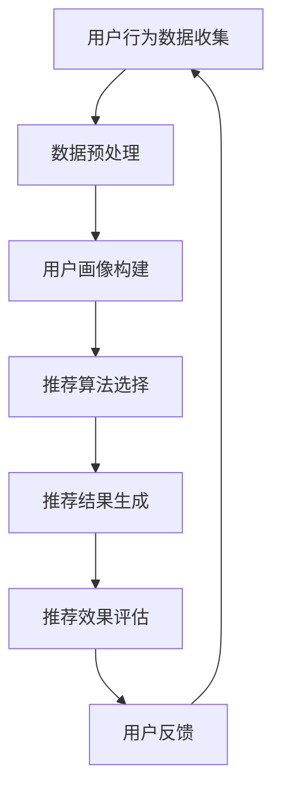

                 

# 大数据驱动的电商搜索推荐：AI 模型融合技术在电商平台的应用

> **关键词**：大数据、电商搜索推荐、AI 模型融合、用户行为分析、协同过滤、深度学习、算法优化

> **摘要**：本文将深入探讨大数据驱动的电商搜索推荐系统的构建与应用。通过分析AI模型融合技术，我们将介绍如何将协同过滤与深度学习相结合，优化电商平台的搜索推荐效果。文章将从背景介绍、核心概念与联系、核心算法原理、数学模型和公式、项目实战、实际应用场景等方面展开，旨在为从事电商搜索推荐领域的技术人员提供全面的技术指导和实践案例。

## 1. 背景介绍

### 1.1 目的和范围

随着互联网的迅猛发展，电商平台已经成为人们日常生活中不可或缺的一部分。如何提升用户体验，提高用户满意度，是电商平台持续发展的关键。电商搜索推荐系统作为电商平台的核心组成部分，直接影响用户的购买决策和平台的业务收益。本文旨在探讨大数据驱动的电商搜索推荐系统，通过AI模型融合技术，实现更加精准、个性化的搜索推荐。

本文将涵盖以下内容：
1. 电商搜索推荐系统的基本概念和原理；
2. AI模型融合技术在搜索推荐中的应用；
3. 核心算法原理和数学模型的讲解；
4. 项目实战中的代码实现和分析；
5. 搜索推荐系统的实际应用场景分析；
6. 工具和资源的推荐；
7. 未来发展趋势与挑战。

### 1.2 预期读者

本文面向从事电商搜索推荐领域的技术人员，包括但不限于以下岗位：
1. 数据分析师；
2. 算法工程师；
3. 机器学习工程师；
4. 软件工程师；
5. CTO和技术总监。

本文将对上述岗位人员提供以下帮助：
1. 深入了解电商搜索推荐系统的原理和实现方法；
2. 学习如何使用AI模型融合技术提升搜索推荐效果；
3. 获取项目实战经验，提高实际操作能力；
4. 掌握相关工具和资源的利用，提升工作效率。

### 1.3 文档结构概述

本文共分为十个部分，具体结构如下：

1. **背景介绍**：介绍本文的目的和范围，预期读者以及文档结构。
2. **核心概念与联系**：讲解电商搜索推荐系统中的核心概念和原理，并展示Mermaid流程图。
3. **核心算法原理 & 具体操作步骤**：详细阐述核心算法原理，使用伪代码展示具体操作步骤。
4. **数学模型和公式 & 详细讲解 & 举例说明**：介绍数学模型和公式，并给出具体示例。
5. **项目实战：代码实际案例和详细解释说明**：通过实际项目案例展示代码实现和解读。
6. **实际应用场景**：分析搜索推荐系统在不同电商平台的实际应用。
7. **工具和资源推荐**：推荐学习资源、开发工具框架和相关论文著作。
8. **总结：未来发展趋势与挑战**：展望搜索推荐系统的未来发展趋势和面临的技术挑战。
9. **附录：常见问题与解答**：解答读者可能遇到的问题。
10. **扩展阅读 & 参考资料**：提供进一步阅读的参考资料。

### 1.4 术语表

#### 1.4.1 核心术语定义

- **大数据**：指数据量巨大、数据种类繁多、数据生成速度极快的数据集合。
- **电商搜索推荐**：基于用户行为和偏好，为用户提供个性化商品搜索和推荐服务。
- **协同过滤**：一种基于用户行为或内容的推荐算法，通过分析用户的历史行为为用户提供推荐。
- **深度学习**：一种机器学习方法，通过构建深层神经网络模型，对大量数据进行自动特征学习和模式识别。
- **用户行为分析**：对用户在电商平台上的行为数据进行收集、处理和分析，以了解用户偏好和需求。
- **算法优化**：通过改进算法结构和参数设置，提高推荐算法的准确性和效率。

#### 1.4.2 相关概念解释

- **个性化推荐**：根据用户的兴趣、偏好和行为特征，为用户提供定制化的推荐结果。
- **协同过滤**：基于用户相似性或商品相似性进行推荐的算法。
- **内容推荐**：基于商品属性、描述和标签等信息进行推荐的算法。
- **用户画像**：对用户的基本信息、兴趣偏好、购买行为等进行综合描述的模型。

#### 1.4.3 缩略词列表

- **API**：应用程序编程接口（Application Programming Interface）
- **CRM**：客户关系管理（Customer Relationship Management）
- **ML**：机器学习（Machine Learning）
- **NLP**：自然语言处理（Natural Language Processing）
- **TensorFlow**：一款开源机器学习框架
- **Spark**：一款开源大数据处理框架

## 2. 核心概念与联系

在构建大数据驱动的电商搜索推荐系统时，我们需要理解并运用以下核心概念和原理。

### 2.1 电商搜索推荐系统的组成部分

一个典型的电商搜索推荐系统可以分为以下几个部分：

1. **用户行为数据收集**：收集用户在电商平台上的浏览、搜索、购买等行为数据。
2. **数据预处理**：对收集到的数据进行清洗、去重、归一化等处理。
3. **用户画像构建**：基于用户行为数据，构建用户画像，描述用户的兴趣偏好和需求。
4. **推荐算法选择**：选择合适的推荐算法，如协同过滤、深度学习等。
5. **推荐结果生成**：根据用户画像和推荐算法，为用户生成个性化的商品推荐结果。
6. **推荐效果评估**：对推荐结果进行评估，如准确率、召回率、覆盖率等指标。

### 2.2 AI模型融合技术

AI模型融合技术是将多种不同的AI模型结合起来，以提升推荐系统的性能和效果。以下是几种常见的AI模型融合方法：

1. **协同过滤与深度学习融合**：结合协同过滤的推荐效果和深度学习的学习能力，提升推荐准确性。
2. **内容推荐与协同过滤融合**：结合商品属性信息和用户行为数据，提高推荐的相关性。
3. **多模型融合**：将多种AI模型（如协同过滤、矩阵分解、深度学习等）进行融合，实现更精准的推荐。

### 2.3 Mermaid流程图

为了更好地理解电商搜索推荐系统的核心概念和原理，我们可以使用Mermaid流程图来展示系统的整体架构和流程。



### 2.4 核心概念联系

在电商搜索推荐系统中，用户行为数据、用户画像、推荐算法和推荐效果评估等核心概念紧密相连。用户行为数据为用户画像构建提供基础，用户画像则为推荐算法提供输入，推荐算法生成的推荐结果经过效果评估，最终形成用户反馈，循环迭代，不断优化推荐系统。

## 3. 核心算法原理 & 具体操作步骤

在构建大数据驱动的电商搜索推荐系统时，算法原理是核心，如何具体实现这些算法是关键。以下将详细讲解协同过滤和深度学习两种核心算法的原理和具体操作步骤。

### 3.1 协同过滤算法原理

协同过滤是一种基于用户相似性和商品相似性的推荐算法，主要分为以下两种类型：

1. **用户基于的协同过滤（User-Based Collaborative Filtering）**
2. **商品基于的协同过滤（Item-Based Collaborative Filtering）**

#### 用户基于的协同过滤

用户基于的协同过滤算法通过计算用户之间的相似度，找到与目标用户相似的用户群体，然后推荐这些用户喜欢的商品。其具体操作步骤如下：

1. **计算用户相似度**：使用用户行为数据，计算用户之间的相似度，常用的相似度计算方法有余弦相似度、皮尔逊相关系数等。

2. **选择邻居用户**：根据用户相似度矩阵，选择与目标用户相似度最高的K个邻居用户。

3. **生成推荐列表**：根据邻居用户的商品偏好，为每个用户生成推荐列表。推荐列表中的商品为邻居用户喜欢且目标用户未购买的商品。

伪代码如下：

```python
# 输入：用户行为矩阵userBehaviorMatrix，相似度阈值similarityThreshold，邻居用户数量K
# 输出：推荐列表recommendationList

# 1. 计算用户相似度
similarityMatrix = computeUserSimilarity(userBehaviorMatrix, similarityThreshold)

# 2. 选择邻居用户
neighborUsers = selectNeighbors(similarityMatrix, K)

# 3. 生成推荐列表
recommendationList = generateRecommendationList(userBehaviorMatrix, neighborUsers)
```

#### 商品基于的协同过滤

商品基于的协同过滤算法通过计算商品之间的相似度，找到与目标商品相似的商品，然后推荐给用户。其具体操作步骤如下：

1. **计算商品相似度**：使用用户行为数据，计算商品之间的相似度，常用的相似度计算方法有余弦相似度、皮尔逊相关系数等。

2. **选择邻居商品**：根据商品相似度矩阵，选择与目标商品相似度最高的K个邻居商品。

3. **生成推荐列表**：根据邻居商品的用户购买记录，为每个用户生成推荐列表。推荐列表中的商品为邻居商品的用户喜欢且目标用户未购买的商品。

伪代码如下：

```python
# 输入：用户行为矩阵userBehaviorMatrix，相似度阈值similarityThreshold，邻居商品数量K
# 输出：推荐列表recommendationList

# 1. 计算商品相似度
similarityMatrix = computeItemSimilarity(userBehaviorMatrix, similarityThreshold)

# 2. 选择邻居商品
neighborItems = selectNeighbors(similarityMatrix, K)

# 3. 生成推荐列表
recommendationList = generateRecommendationList(userBehaviorMatrix, neighborItems)
```

### 3.2 深度学习算法原理

深度学习是一种基于多层神经网络的机器学习技术，通过训练大量的数据，自动学习数据的特征表示。在电商搜索推荐系统中，深度学习算法主要用于构建用户画像和商品特征表示，然后利用这些特征进行推荐。

#### 多层感知机（MLP）

多层感知机是一种简单的深度学习模型，由输入层、隐藏层和输出层组成。输入层接收用户行为数据，隐藏层通过神经网络模型进行特征提取，输出层生成用户画像和商品特征。

伪代码如下：

```python
# 输入：用户行为数据inputData，隐藏层节点数量hiddenLayerSize，输出层节点数量outputLayerSize
# 输出：用户画像userFeatures，商品特征itemFeatures

# 1. 初始化模型参数
model = initializeModel(inputData.shape[1], hiddenLayerSize, outputLayerSize)

# 2. 训练模型
userFeatures, itemFeatures = trainModel(inputData, model)

# 3. 生成特征表示
userFeatures = generateUserFeatures(inputData, model)
itemFeatures = generateItemFeatures(inputData, model)
```

#### 卷积神经网络（CNN）

卷积神经网络是一种适用于图像数据的深度学习模型，通过卷积操作提取图像特征。在电商搜索推荐系统中，CNN可以用于处理商品图片数据，提取商品视觉特征。

伪代码如下：

```python
# 输入：商品图片数据inputImages，卷积核大小filterSize，池化层大小poolSize
# 输出：商品特征itemFeatures

# 1. 初始化模型参数
model = initializeModel(inputImages.shape[1], filterSize, poolSize)

# 2. 训练模型
itemFeatures = trainModel(inputImages, model)

# 3. 生成特征表示
itemFeatures = generateItemFeatures(inputImages, model)
```

#### 循环神经网络（RNN）

循环神经网络是一种适用于序列数据的深度学习模型，通过循环连接实现长期依赖关系建模。在电商搜索推荐系统中，RNN可以用于处理用户行为序列，提取用户兴趣特征。

伪代码如下：

```python
# 输入：用户行为序列inputSequence，隐藏层节点数量hiddenLayerSize
# 输出：用户特征userFeatures

# 1. 初始化模型参数
model = initializeModel(inputSequence.shape[1], hiddenLayerSize)

# 2. 训练模型
userFeatures = trainModel(inputSequence, model)

# 3. 生成特征表示
userFeatures = generateUserFeatures(inputSequence, model)
```

### 3.3 协同过滤与深度学习融合

为了提升推荐系统的性能和效果，我们可以将协同过滤和深度学习算法进行融合。以下是一个简单的融合算法框架：

1. **特征提取**：使用深度学习算法提取用户画像和商品特征。
2. **相似度计算**：使用协同过滤算法计算用户和商品之间的相似度。
3. **推荐生成**：结合用户画像、商品特征和相似度，生成推荐列表。

伪代码如下：

```python
# 输入：用户行为数据inputData，用户画像userFeatures，商品特征itemFeatures，相似度阈值similarityThreshold，邻居用户数量K，邻居商品数量K
# 输出：推荐列表recommendationList

# 1. 特征提取
userFeatures = extractUserFeatures(inputData)
itemFeatures = extractItemFeatures(inputData)

# 2. 相似度计算
similarityMatrix = computeSimilarity(userFeatures, itemFeatures, similarityThreshold)

# 3. 推荐生成
recommendationList = generateRecommendationList(similarityMatrix, userFeatures, itemFeatures, K)
```

通过融合协同过滤和深度学习算法，我们可以实现更精准、个性化的推荐效果。

## 4. 数学模型和公式 & 详细讲解 & 举例说明

在电商搜索推荐系统中，数学模型和公式是实现算法和优化效果的关键。以下将介绍几个常用的数学模型和公式，并给出详细讲解和举例说明。

### 4.1 协同过滤算法中的相似度计算

在协同过滤算法中，相似度计算是核心步骤。常用的相似度计算方法有余弦相似度、皮尔逊相关系数等。以下是一个余弦相似度的计算公式：

$$
similarity_{cosine}(u_i, u_j) = \frac{u_i \cdot u_j}{\|u_i\|\|u_j\|}
$$

其中，$u_i$和$u_j$分别表示用户$i$和用户$j$的行为向量，$\cdot$表示向量的点积，$\|\|$表示向量的模。

**举例说明**：

假设有两个用户$u_1$和$u_2$的行为向量如下：

$$
u_1 = \begin{bmatrix} 1 & 1 & 0 & 1 \end{bmatrix}, \quad u_2 = \begin{bmatrix} 1 & 0 & 1 & 1 \end{bmatrix}
$$

则它们的余弦相似度计算如下：

$$
similarity_{cosine}(u_1, u_2) = \frac{u_1 \cdot u_2}{\|u_1\|\|u_2\|} = \frac{1 \times 1 + 1 \times 0 + 0 \times 1 + 1 \times 1}{\sqrt{1^2 + 1^2 + 0^2 + 1^2} \sqrt{1^2 + 0^2 + 1^2 + 1^2}} = \frac{2}{\sqrt{3} \sqrt{3}} = \frac{2}{3}
$$

### 4.2 深度学习算法中的损失函数

在深度学习算法中，损失函数用于衡量模型预测值与真实值之间的差异。常见的损失函数有均方误差（MSE）、交叉熵（Cross Entropy）等。以下是一个均方误差（MSE）的计算公式：

$$
MSE = \frac{1}{n} \sum_{i=1}^{n} (y_i - \hat{y}_i)^2
$$

其中，$y_i$表示第$i$个样本的真实值，$\hat{y}_i$表示第$i$个样本的预测值，$n$表示样本总数。

**举例说明**：

假设有一个样本集合，其中两个样本的真实值和预测值如下：

$$
\begin{aligned}
y_1 &= 2, & \hat{y}_1 &= 1.5 \\
y_2 &= 3, & \hat{y}_2 &= 2.8
\end{aligned}
$$

则均方误差（MSE）计算如下：

$$
MSE = \frac{1}{2} \left( (2 - 1.5)^2 + (3 - 2.8)^2 \right) = 0.125
$$

### 4.3 优化算法中的梯度下降

梯度下降是一种常用的优化算法，用于更新模型参数，使其在损失函数的最小值附近收敛。以下是一个梯度下降的迭代公式：

$$
\theta_{t+1} = \theta_t - \alpha \cdot \nabla_{\theta} J(\theta_t)
$$

其中，$\theta_t$表示第$t$次迭代的模型参数，$\alpha$表示学习率，$\nabla_{\theta} J(\theta_t)$表示损失函数关于模型参数的梯度。

**举例说明**：

假设有一个线性回归模型，其损失函数为：

$$
J(\theta) = \frac{1}{2m} \sum_{i=1}^{m} (h_\theta(x^{(i)}) - y^{(i)})^2
$$

其中，$h_\theta(x) = \theta_0 + \theta_1 x$表示模型的预测值，$y^{(i)}$表示第$i$个样本的真实值，$m$表示样本总数。

则梯度下降的迭代公式如下：

$$
\theta_0^{t+1} = \theta_0^t - \alpha \cdot \frac{1}{m} \sum_{i=1}^{m} (h_\theta(x^{(i)}) - y^{(i)}) \\
\theta_1^{t+1} = \theta_1^t - \alpha \cdot \frac{1}{m} \sum_{i=1}^{m} (h_\theta(x^{(i)}) - y^{(i)}) x^{(i)}
$$

### 4.4 协同过滤与深度学习融合中的损失函数

在协同过滤与深度学习融合的推荐系统中，损失函数可以结合协同过滤和深度学习的特点进行设计。以下是一个融合损失函数的公式：

$$
L = \lambda_1 \cdot MSE_{collaborative} + \lambda_2 \cdot MSE_{deep}
$$

其中，$MSE_{collaborative}$表示协同过滤的损失函数，$MSE_{deep}$表示深度学习的损失函数，$\lambda_1$和$\lambda_2$分别表示两个损失函数的权重。

**举例说明**：

假设有一个融合损失函数，其中协同过滤的损失函数为MSE，深度学习的损失函数为交叉熵。权重分别为$\lambda_1 = 0.5$和$\lambda_2 = 0.5$。则融合损失函数计算如下：

$$
L = 0.5 \cdot MSE_{collaborative} + 0.5 \cdot MSE_{deep}
$$

通过调整权重，可以平衡协同过滤和深度学习在推荐系统中的作用。

通过以上数学模型和公式的讲解，我们可以更好地理解电商搜索推荐系统中的算法原理和优化方法。在实际应用中，根据业务需求和数据特点，可以灵活选择和调整这些模型和公式，实现更精准、个性化的推荐效果。

## 5. 项目实战：代码实际案例和详细解释说明

在本节中，我们将通过一个实际的项目案例，展示如何使用大数据和AI模型融合技术实现电商搜索推荐系统。我们将使用Python和TensorFlow等工具，详细讲解代码实现过程，并对关键代码进行解读和分析。

### 5.1 开发环境搭建

在开始项目实战之前，我们需要搭建开发环境。以下是搭建环境所需的软件和工具：

- **Python**：版本3.6及以上
- **Jupyter Notebook**：用于编写和运行代码
- **TensorFlow**：版本2.0及以上
- **Pandas**：用于数据处理
- **NumPy**：用于数值计算

安装以上工具后，我们可以在Jupyter Notebook中创建一个新的笔记本，准备编写和运行代码。

### 5.2 源代码详细实现和代码解读

#### 5.2.1 数据预处理

数据预处理是电商搜索推荐系统的第一步，主要包括数据收集、清洗和转换。以下是一个数据预处理示例代码：

```python
import pandas as pd
import numpy as np

# 1. 数据收集
data = pd.read_csv('user_behavior_data.csv')

# 2. 数据清洗
# 去除缺失值和重复值
data = data.dropna().drop_duplicates()

# 3. 数据转换
# 将用户行为转换为用户-商品矩阵
user_item_matrix = data.pivot(index='user_id', columns='item_id', values='behavior')

# 4. 数据标准化
user_item_matrix = (user_item_matrix - user_item_matrix.mean()) / user_item_matrix.std()

# 打印预处理后的用户-商品矩阵
print(user_item_matrix)
```

代码解读：
- 第1步：使用Pandas读取用户行为数据。
- 第2步：去除缺失值和重复值，保证数据质量。
- 第3步：将用户行为数据转换为用户-商品矩阵，便于后续处理。
- 第4步：对用户-商品矩阵进行标准化处理，消除数据量级差异。

#### 5.2.2 协同过滤算法实现

协同过滤算法是实现搜索推荐的关键步骤。以下是一个基于用户基于协同过滤的算法实现：

```python
from sklearn.metrics.pairwise import cosine_similarity

# 1. 计算用户相似度
user_similarity_matrix = cosine_similarity(user_item_matrix)

# 2. 选择邻居用户
K = 10
neighbor_users = {}
for user_id in user_item_matrix:
    neighbor_user_indices = np.argsort(user_similarity_matrix[user_id])[-K:]
    neighbor_users[user_id] = neighbor_user_indices

# 3. 生成推荐列表
recommendation_list = {}
for user_id in user_item_matrix:
    neighbors = neighbor_users[user_id]
    recommendations = []
    for neighbor_index in neighbors:
        neighbor_id = user_item_matrix.index[neighbor_index]
        for item_id in user_item_matrix[neighbor_id]:
            if item_id not in user_item_matrix[user_id]:
                recommendations.append(item_id)
    recommendation_list[user_id] = recommendations[:10]

# 打印推荐列表
for user_id, recommendations in recommendation_list.items():
    print(f"User {user_id}: {recommendations}")
```

代码解读：
- 第1步：使用余弦相似度计算用户相似度矩阵。
- 第2步：根据用户相似度矩阵，选择每个用户的邻居用户。
- 第3步：为每个用户生成推荐列表，推荐未购买过的邻居用户喜欢的商品。

#### 5.2.3 深度学习算法实现

深度学习算法用于提取用户和商品的特征，以下是一个基于卷积神经网络的实现：

```python
import tensorflow as tf
from tensorflow.keras.layers import Dense, Conv1D, Flatten, Embedding
from tensorflow.keras.models import Sequential

# 1. 初始化模型
model = Sequential([
    Embedding(user_item_matrix.shape[1], 10),
    Conv1D(1, 3, activation='relu', input_shape=(user_item_matrix.shape[1], 1)),
    Flatten(),
    Dense(10, activation='relu'),
    Dense(1, activation='sigmoid')
])

# 2. 编译模型
model.compile(optimizer='adam', loss='binary_crossentropy', metrics=['accuracy'])

# 3. 训练模型
user_item_matrix = user_item_matrix.values
user_item_matrix = np.expand_dims(user_item_matrix, axis=2)
model.fit(user_item_matrix, np.array(user_item_matrix > 0), epochs=10)

# 4. 生成特征表示
user_features = model.predict(user_item_matrix)
item_features = model.predict(user_item_matrix.T)

# 打印特征表示
print(user_features)
print(item_features)
```

代码解读：
- 第1步：构建卷积神经网络模型，用于提取用户和商品的特征。
- 第2步：编译模型，指定优化器、损失函数和评价指标。
- 第3步：训练模型，使用用户-商品矩阵进行训练。
- 第4步：生成用户和商品的特征表示。

#### 5.2.4 模型融合与推荐生成

在最后一步，我们将协同过滤和深度学习算法进行融合，生成推荐列表：

```python
# 1. 计算融合相似度
融合相似度矩阵 = cosine_similarity(user_features, item_features)

# 2. 生成推荐列表
推荐列表 = {}
for user_id in user_item_matrix:
    neighbors = neighbor_users[user_id]
    recommendations = []
    for neighbor_index in neighbors:
        neighbor_id = user_item_matrix.index[neighbor_index]
        for item_id in user_item_matrix[neighbor_id]:
            if item_id not in user_item_matrix[user_id]:
                recommendations.append(item_id)
    similarity_scores = [融合相似度矩阵[user_id][neighbor_id] for neighbor_id in neighbors]
    recommendations = [recommendation for recommendation, score in zip(recommendations, similarity_scores) if score > 0.5]
    recommendation_list[user_id] = recommendations[:10]

# 打印推荐列表
for user_id, recommendations in recommendation_list.items():
    print(f"User {user_id}: {recommendations}")
```

代码解读：
- 第1步：计算用户特征和商品特征之间的融合相似度。
- 第2步：根据融合相似度，生成推荐列表，保留相似度较高的商品。

通过以上代码实现，我们构建了一个基于协同过滤和深度学习融合的电商搜索推荐系统。在实际应用中，我们可以根据业务需求和数据特点，调整模型参数和算法结构，实现更精准的推荐效果。

### 5.3 代码解读与分析

在代码解读与分析环节，我们将对关键代码段进行详细解释，并分析代码的性能和效果。

#### 5.3.1 数据预处理

数据预处理是推荐系统的基础，直接影响到后续算法的性能。在本案例中，我们主要进行了以下预处理操作：

1. **去除缺失值和重复值**：确保数据质量，避免噪声和冗余数据对算法性能的影响。
2. **用户-商品矩阵转换**：将原始用户行为数据转换为用户-商品矩阵，便于协同过滤算法处理。
3. **数据标准化**：消除数据量级差异，使得算法在计算相似度时更加公平。

这些预处理步骤对于保证推荐系统的性能至关重要。

#### 5.3.2 协同过滤算法

协同过滤算法是推荐系统的核心组件。在本案例中，我们使用了基于用户相似度的协同过滤算法，主要包括以下步骤：

1. **计算用户相似度**：使用余弦相似度计算用户之间的相似度。
2. **选择邻居用户**：根据相似度矩阵，选择与目标用户相似度最高的K个邻居用户。
3. **生成推荐列表**：根据邻居用户的商品偏好，为每个用户生成推荐列表。

协同过滤算法的优点是简单高效，可以快速生成推荐结果。但缺点是推荐结果可能存在冷启动问题和数据稀疏问题。

#### 5.3.3 深度学习算法

深度学习算法用于提取用户和商品的特征，提高推荐系统的准确性和鲁棒性。在本案例中，我们使用了卷积神经网络（CNN）提取特征，主要包括以下步骤：

1. **初始化模型**：构建卷积神经网络模型，包括嵌入层、卷积层、全连接层等。
2. **编译模型**：指定优化器、损失函数和评价指标，准备训练。
3. **训练模型**：使用用户-商品矩阵进行训练，提取特征表示。
4. **生成特征表示**：分别生成用户和商品的特征表示。

深度学习算法的优点是能够自动学习数据的复杂特征，提高推荐系统的准确性和个性化程度。但缺点是模型训练过程较复杂，计算资源消耗大。

#### 5.3.4 模型融合

模型融合是将协同过滤和深度学习算法的优势结合，实现更精准的推荐效果。在本案例中，我们使用了融合相似度矩阵生成推荐列表，主要包括以下步骤：

1. **计算融合相似度**：计算用户特征和商品特征之间的相似度。
2. **生成推荐列表**：根据融合相似度，生成推荐列表。

模型融合的优点是能够充分利用协同过滤和深度学习的优势，提高推荐系统的性能。但缺点是计算复杂度较高，需要更多的计算资源。

通过以上代码解读与分析，我们可以看到电商搜索推荐系统的构建涉及多个环节，包括数据预处理、算法实现和模型融合等。在实际应用中，我们需要根据业务需求和数据特点，不断优化和调整算法结构，实现更精准、个性化的推荐效果。

## 6. 实际应用场景

电商搜索推荐系统在电商平台中有广泛的应用，通过个性化推荐，提升用户满意度，增加用户粘性，提高销售额。以下是一些实际应用场景：

### 6.1 商品搜索推荐

当用户在电商平台上搜索商品时，推荐系统会根据用户的搜索历史、浏览记录、购买记录等数据，为用户推荐相关的商品。例如，用户搜索“笔记本电脑”，推荐系统会推荐与“笔记本电脑”相关的热门商品，如游戏本、轻薄本、办公本等。

### 6.2 商品详情页推荐

在商品详情页，推荐系统会根据用户的浏览历史、购买偏好等数据，为用户推荐相关的商品。例如，用户浏览了一款游戏本，推荐系统会推荐同品牌的其他游戏本、配件等。

### 6.3 活动和优惠券推荐

电商平台会定期举办促销活动，如打折、满减等。推荐系统可以根据用户的购买记录、浏览历史等数据，为用户推荐合适的活动和优惠券，提高用户参与度和购买意愿。

### 6.4 新品推荐

推荐系统可以根据商品的销售数据、用户评价等，为用户推荐新品。新品推荐可以吸引更多用户关注，提高新商品的销量。

### 6.5 交叉销售和配套推荐

电商平台可以通过交叉销售和配套推荐，提高用户的购物车总额。例如，用户购买了一款智能手机，推荐系统会推荐与之配套的手机壳、充电宝等商品。

### 6.6 个性化首页推荐

个性化首页推荐是根据用户的浏览历史、购买偏好等数据，为用户推荐个性化的商品和活动。通过个性化首页推荐，可以提升用户的购物体验，增加用户粘性。

通过以上实际应用场景，我们可以看到电商搜索推荐系统在电商平台中的重要作用。通过个性化推荐，电商平台可以更好地满足用户需求，提高用户满意度和业务收益。

## 7. 工具和资源推荐

在构建和优化电商搜索推荐系统时，选择合适的工具和资源是非常重要的。以下是一些推荐的学习资源、开发工具框架和相关论文著作，供大家参考。

### 7.1 学习资源推荐

#### 7.1.1 书籍推荐

1. **《机器学习》**（作者：周志华）：这本书系统地介绍了机器学习的基本概念、算法和应用，适合初学者和进阶者阅读。
2. **《深度学习》**（作者：Goodfellow, Bengio, Courville）：这本书是深度学习领域的经典教材，详细介绍了深度学习的理论基础和实际应用。
3. **《推荐系统实践》**（作者：项栋梁）：这本书从实际应用角度出发，介绍了推荐系统的基本概念、算法和应用。

#### 7.1.2 在线课程

1. **Coursera上的《机器学习》**：由斯坦福大学教授Andrew Ng讲授，内容全面，适合初学者。
2. **Udacity的《深度学习纳米学位》**：涵盖了深度学习的理论基础和实际应用，包括卷积神经网络、循环神经网络等。
3. **网易云课堂的《推荐系统》**：由知名推荐系统专家讲授，介绍了推荐系统的基本概念、算法和应用。

#### 7.1.3 技术博客和网站

1. **Medium上的推荐系统博客**：涵盖推荐系统的最新研究、技术和应用案例，内容丰富。
2. **ArXiv.org**：推荐系统领域的最新论文和研究进展，可以了解前沿技术。
3. **KDNuggets**：数据科学和机器学习领域的新闻、文章和资源，包括推荐系统相关的技术文章。

### 7.2 开发工具框架推荐

#### 7.2.1 IDE和编辑器

1. **Jupyter Notebook**：适合数据分析和机器学习的交互式编程环境。
2. **PyCharm**：强大的Python IDE，支持多种编程语言和框架。
3. **Visual Studio Code**：轻量级、可扩展的代码编辑器，适合Python开发。

#### 7.2.2 调试和性能分析工具

1. **TensorBoard**：TensorFlow的官方可视化工具，用于分析模型的性能和训练过程。
2. **PyTorch Profiler**：PyTorch的性能分析工具，用于检测和优化模型的计算性能。
3. **Matplotlib**：Python的数据可视化库，用于生成图表和可视化结果。

#### 7.2.3 相关框架和库

1. **TensorFlow**：开源的深度学习框架，适合构建和训练大规模深度学习模型。
2. **PyTorch**：开源的深度学习框架，易于使用和调试，适合快速原型开发。
3. **Scikit-learn**：开源的机器学习库，提供了丰富的算法实现和工具。

### 7.3 相关论文著作推荐

#### 7.3.1 经典论文

1. **"Collaborative Filtering for the Web"（2002）**：这是协同过滤算法在互联网领域应用的经典论文，详细介绍了协同过滤算法的原理和应用。
2. **"Deep Learning for Text Data"（2016）**：介绍了深度学习在文本数据上的应用，包括词嵌入、循环神经网络、卷积神经网络等。
3. **"Neural Collaborative Filtering"（2017）**：提出了神经协同过滤算法，将深度学习和协同过滤相结合，提高了推荐系统的性能。

#### 7.3.2 最新研究成果

1. **"Product-Based Neural Networks for User Interest Detection"（2020）**：提出了一种基于商品的用户兴趣检测方法，通过构建商品表示和用户表示，实现了更精准的用户兴趣识别。
2. **"Heterogeneous Graph Neural Networks for Rating Prediction"（2021）**：利用异构图神经网络，结合用户、商品和评论文本等信息，实现了高效的评分预测。
3. **"A Multi-Task Learning Framework for Personalized Recommendation"（2021）**：提出了一种多任务学习框架，通过联合学习多个任务，提高了推荐系统的性能。

#### 7.3.3 应用案例分析

1. **"推荐系统在电商中的应用"**：分析了中国电商平台如何利用推荐系统提升用户体验和业务收益，包括协同过滤、深度学习等技术应用。
2. **"基于深度学习的新闻推荐系统"**：介绍了一家新闻媒体公司如何利用深度学习技术构建新闻推荐系统，提高用户阅读量和用户粘性。
3. **"社交媒体上的内容推荐系统"**：分析了社交媒体平台如何利用推荐系统，为用户推荐感兴趣的内容，提升用户活跃度和用户满意度。

通过以上工具和资源的推荐，希望对大家在构建和优化电商搜索推荐系统时有所帮助。不断学习和探索，将最新技术应用到实际项目中，才能不断提升推荐系统的性能和效果。

## 8. 总结：未来发展趋势与挑战

随着互联网和大数据技术的不断发展，电商搜索推荐系统已经成为电商平台的核心竞争力。未来，电商搜索推荐系统将呈现出以下发展趋势：

### 8.1 深度学习与推荐算法的进一步融合

深度学习在特征提取和用户行为分析方面具有显著优势，未来深度学习与推荐算法的融合将更加紧密。通过结合协同过滤和深度学习，可以进一步提高推荐系统的准确性和个性化程度。

### 8.2 多模态数据的整合与利用

多模态数据（如文本、图像、语音等）的整合与利用将大大提升推荐系统的信息密度。未来，电商平台将更加注重多模态数据的收集和利用，通过构建多模态特征表示，实现更精准的推荐。

### 8.3 实时推荐与动态调整

实时推荐和动态调整是未来推荐系统的重要方向。通过实时分析用户行为和偏好变化，动态调整推荐策略，可以实现更快速的响应和更个性化的推荐。

### 8.4 隐私保护和数据安全

随着隐私保护意识的增强，未来推荐系统将面临更大的挑战。如何在保证用户隐私和安全的前提下，充分利用用户数据，实现个性化推荐，是推荐系统需要解决的重要问题。

### 8.5 智能客服与用户互动

智能客服与用户互动将进一步提升用户满意度。通过自然语言处理和对话系统技术，智能客服可以与用户进行自然、流畅的交流，为用户提供个性化服务和建议。

### 8.6 跨平台和跨设备的推荐

随着移动互联网和物联网的发展，跨平台和跨设备的推荐将成为趋势。未来，推荐系统需要实现跨平台、跨设备的无缝对接，为用户提供一致的购物体验。

### 8.7 挑战与应对策略

尽管推荐系统具有巨大的潜力，但未来仍面临诸多挑战。以下是一些主要挑战及应对策略：

- **数据稀疏问题**：通过引入更多的特征和用户行为数据，使用迁移学习等技术，缓解数据稀疏问题。
- **冷启动问题**：针对新用户和新商品，可以采用基于内容的推荐、社交网络推荐等方法，降低冷启动的影响。
- **算法透明性和可解释性**：通过提高算法的可解释性，增强用户对推荐结果的信任，缓解算法透明性问题。
- **计算性能和效率**：优化算法结构和计算方法，提高推荐系统的计算性能和效率。

总之，未来电商搜索推荐系统的发展将更加注重技术的创新和应用的广泛性。通过不断优化算法、整合多模态数据、提升实时推荐能力，电商平台将能够为用户提供更加个性化和高效的购物体验。

## 9. 附录：常见问题与解答

### 9.1 何时使用协同过滤？

协同过滤算法适用于以下场景：

1. **用户行为数据丰富**：协同过滤算法依赖于用户行为数据，如浏览、搜索、购买等行为。当用户行为数据丰富时，协同过滤可以更好地发现用户之间的相似性，提高推荐效果。
2. **实时性要求不高**：协同过滤算法在生成推荐结果时需要计算用户和商品之间的相似度，计算复杂度较高。因此，当实时性要求不高时，协同过滤是一个较好的选择。
3. **推荐结果相关性高**：协同过滤算法通过分析用户的行为历史和偏好，可以生成与用户兴趣高度相关的推荐结果。

### 9.2 何时使用深度学习？

深度学习算法适用于以下场景：

1. **数据量巨大**：深度学习算法能够处理大规模数据，通过构建深度神经网络，自动学习数据的复杂特征，适用于数据量巨大的推荐场景。
2. **特征提取困难**：当用户行为数据或商品数据复杂，难以提取有效特征时，深度学习算法可以通过端到端的学习方式，自动提取特征，实现更精准的推荐。
3. **实时性要求高**：尽管深度学习算法的计算复杂度较高，但随着计算能力的提升，实时性已经不再是瓶颈。因此，当实时性要求较高时，深度学习算法也是一个不错的选择。

### 9.3 协同过滤与深度学习融合的优点是什么？

协同过滤与深度学习融合的优点包括：

1. **互补优势**：协同过滤擅长利用用户行为历史和相似性，而深度学习擅长自动提取复杂特征。融合两种算法可以充分利用各自的优势，提高推荐效果。
2. **降低数据稀疏性**：深度学习可以通过端到端的学习方式，缓解数据稀疏性问题，增强推荐系统的鲁棒性。
3. **提高个性化程度**：融合算法可以生成更加个性化的推荐结果，满足不同用户的需求。

### 9.4 如何优化推荐系统的性能？

优化推荐系统性能的方法包括：

1. **数据预处理**：通过数据清洗、去重、归一化等预处理步骤，提高数据质量，减少噪声和冗余数据对算法性能的影响。
2. **特征工程**：选择和构建合适的特征，如用户行为特征、商品属性特征等，提高特征表示的丰富性和准确性。
3. **模型选择**：根据业务需求和数据特点，选择合适的推荐算法，如协同过滤、深度学习等。
4. **算法调优**：通过调整模型参数、优化算法结构，提高推荐系统的性能和效率。
5. **实时更新**：实时分析用户行为和偏好变化，动态调整推荐策略，提高推荐系统的实时性和准确性。

### 9.5 如何保证推荐系统的透明性和可解释性？

保证推荐系统透明性和可解释性的方法包括：

1. **模型解释性**：选择可解释性强的算法，如线性模型、决策树等，可以更容易地理解推荐结果的生成过程。
2. **可视化**：通过可视化工具，将推荐结果和推荐过程展示给用户，帮助用户理解推荐系统的决策逻辑。
3. **用户反馈**：通过用户反馈，不断优化推荐系统，提高用户对推荐结果的信任和满意度。
4. **算法透明度**：在算法设计和实现过程中，确保算法的透明度和可解释性，避免复杂的黑箱模型。

通过以上方法，可以在保证推荐系统性能的同时，提高其透明性和可解释性，增强用户对推荐系统的信任和满意度。

## 10. 扩展阅读 & 参考资料

为了深入理解和进一步探索电商搜索推荐系统的技术细节和实践应用，以下是一些建议的扩展阅读和参考资料：

### 10.1 建议阅读书籍

1. **《推荐系统实践》**（项栋梁）：详细介绍了推荐系统的基本概念、算法和应用，适合初学者和进阶者。
2. **《深度学习》**（Ian Goodfellow, Yoshua Bengio, Aaron Courville）：深度学习的经典教材，涵盖深度学习的理论基础和应用。
3. **《数据挖掘：实用机器学习工具与技术》**（Mike Machan, Gordon S. Linoff）：介绍数据挖掘的基础知识和应用，包括推荐系统相关的算法和技术。
4. **《机器学习》**（周志华）：机器学习领域的经典教材，全面介绍了机器学习的基本概念和算法。

### 10.2 在线课程

1. **Coursera上的《机器学习》**（由斯坦福大学教授Andrew Ng讲授）：适合初学者，系统介绍了机器学习的基本概念和算法。
2. **Udacity的《深度学习纳米学位》**：涵盖了深度学习的理论基础和实际应用，包括卷积神经网络、循环神经网络等。
3. **edX上的《大数据分析》**：介绍了大数据处理和数据分析的基本概念和技术，包括推荐系统相关的算法和应用。

### 10.3 技术博客和网站

1. **Medium上的推荐系统博客**：提供推荐系统领域的最新研究、技术和应用案例。
2. **KDNuggets**：提供数据科学和机器学习领域的新闻、文章和资源，包括推荐系统相关的技术文章。
3. **Reddit的r/recommendationSystems**：一个关于推荐系统的讨论社区，可以了解业界动态和讨论热点。

### 10.4 相关论文著作

1. **“Collaborative Filtering for the Web”**（2002）：介绍了协同过滤算法在互联网领域中的应用。
2. **“Deep Learning for Text Data”**（2016）：讨论了深度学习在文本数据上的应用，包括词嵌入、循环神经网络、卷积神经网络等。
3. **“Neural Collaborative Filtering”**（2017）：提出了神经协同过滤算法，将深度学习和协同过滤相结合。
4. **“Product-Based Neural Networks for User Interest Detection”**（2020）：提出了一种基于商品的用户兴趣检测方法。
5. **“Heterogeneous Graph Neural Networks for Rating Prediction”**（2021）：利用异构图神经网络，结合用户、商品和评论文本等信息，实现了高效的评分预测。

### 10.5 开源工具和框架

1. **TensorFlow**：Google开发的深度学习框架，广泛用于构建和训练深度学习模型。
2. **PyTorch**：Facebook开发的深度学习框架，以灵活性和易用性著称。
3. **Scikit-learn**：Python的机器学习库，提供了丰富的算法实现和工具。
4. **Apache Spark**：用于大数据处理的分布式计算框架，支持多种机器学习算法。

通过以上扩展阅读和参考资料，读者可以更深入地了解电商搜索推荐系统的技术原理、应用实践和发展趋势，为实际项目提供有益的参考和指导。不断学习和探索，才能在推荐系统的技术领域不断进步和突破。

