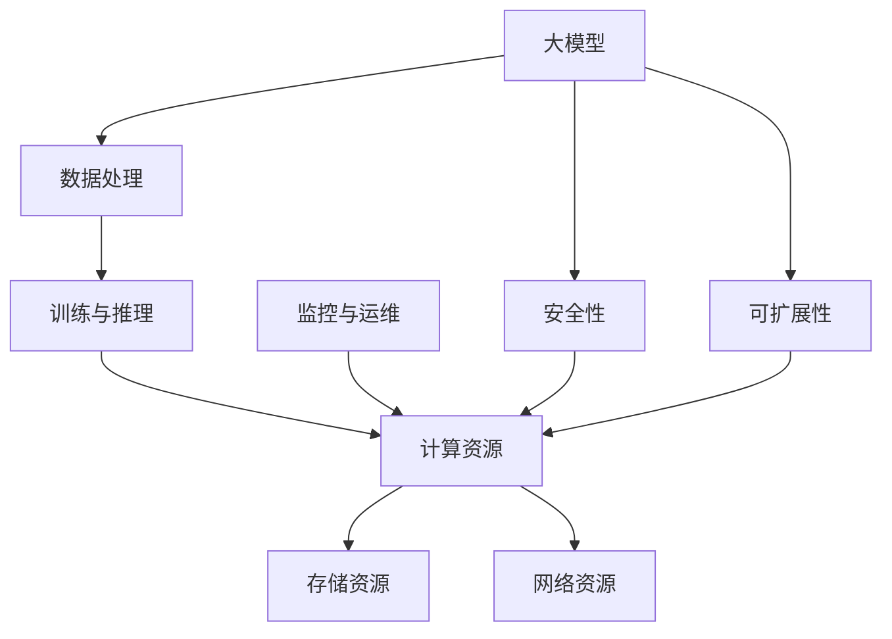

                 

# 大模型企业的云服务策略

> **关键词**：大模型、企业、云服务、策略、性能优化、安全性、可扩展性、云计算

> **摘要**：本文将探讨大模型企业在部署和使用云服务时所需考虑的关键策略。通过分析大模型与云服务之间的核心关联，我们提出了性能优化、安全性保障、以及可扩展性设计等关键要素，并结合实际案例，深入探讨了这些策略的实施细节及其在实际应用中的重要性。文章旨在为企业和开发者提供具有实践意义的指导，帮助其在云计算时代取得竞争优势。

## 1. 背景介绍

### 1.1 目的和范围

本文旨在分析大模型企业在部署和使用云服务时所需考虑的核心策略。随着人工智能技术的不断进步，大模型在企业应用中的重要性日益凸显。云服务作为一种灵活、高效、可靠的计算资源，为大模型的应用提供了强有力的支持。然而，如何充分利用云服务，确保大模型的高性能、高安全性和高可扩展性，成为企业面临的重大挑战。

本文将围绕以下几个方面展开讨论：

1. **性能优化**：分析如何通过优化云服务配置来提高大模型计算效率。
2. **安全性**：探讨如何确保大模型数据和计算过程的安全性。
3. **可扩展性**：讨论如何设计具备高可扩展性的云服务架构。
4. **实际应用**：通过案例分析，展示上述策略在实际应用中的效果。

### 1.2 预期读者

本文适用于以下读者群体：

1. **企业决策者**：对大模型应用和云服务有一定了解，希望了解如何制定有效策略的企业高层管理人员。
2. **技术开发人员**：负责大模型开发和部署的技术人员，希望掌握云服务优化技巧。
3. **云计算专家**：对云计算有深入了解，希望了解大模型应用对云服务提出的新挑战的专家。

### 1.3 文档结构概述

本文将按照以下结构进行阐述：

1. **背景介绍**：介绍大模型和云服务的基本概念及其重要性。
2. **核心概念与联系**：通过Mermaid流程图展示大模型与云服务之间的核心关联。
3. **核心算法原理**：详细讲解大模型计算算法及其实现。
4. **数学模型和公式**：介绍用于优化大模型计算的关键数学模型和公式。
5. **项目实战**：通过实际案例展示云服务策略的实施。
6. **实际应用场景**：探讨大模型在不同领域的应用场景。
7. **工具和资源推荐**：推荐学习资源、开发工具和框架。
8. **总结**：总结未来发展趋势和挑战。
9. **附录**：常见问题与解答。
10. **扩展阅读**：提供相关参考资料。

### 1.4 术语表

#### 1.4.1 核心术语定义

- **大模型**：指参数规模超过数十亿至千亿级别的神经网络模型，如BERT、GPT等。
- **云服务**：指通过互联网提供可按需使用的计算资源，如虚拟机、存储、数据库等。
- **性能优化**：指通过调整系统配置和优化算法来提高计算效率。
- **安全性**：指保护数据和计算过程不被未授权访问和篡改。
- **可扩展性**：指系统在处理更大规模任务时，能够保持高效性能。

#### 1.4.2 相关概念解释

- **云计算**：指通过互联网提供动态易扩展且经常是虚拟化的资源。
- **容器化**：指通过Docker等工具将应用程序及其运行环境打包成一个独立的容器。
- **微服务架构**：指将应用程序分解为一系列独立的、可复用的小服务。

#### 1.4.3 缩略词列表

- **AI**：人工智能（Artificial Intelligence）
- **GPU**：图形处理器（Graphics Processing Unit）
- **CPU**：中央处理器（Central Processing Unit）
- **Docker**：容器化平台
- **Kubernetes**：容器编排平台

## 2. 核心概念与联系

在大模型与云服务之间，存在着一系列核心概念和联系，这些概念和联系构成了大模型在云服务环境中高效运行的基石。下面将使用Mermaid流程图来展示这些核心概念和联系。



### 解释：

- **数据处理（B）**：大模型首先需要处理大量的数据，这涉及到数据清洗、数据预处理和数据增强等步骤。
- **训练与推理（C）**：大模型通过训练和推理过程来学习和执行任务，这一过程需要大量的计算资源。
- **计算资源（D）**：包括CPU、GPU等硬件资源，用于大模型的计算和训练。
- **存储资源（E）**：用于存储大量的数据集和模型参数。
- **网络资源（F）**：用于数据传输和模型部署，确保数据在不同计算节点之间的快速传输。
- **监控与运维（G）**：通过监控和运维，确保大模型在云服务环境中的稳定运行。
- **安全性（H）**：保护大模型数据和计算过程，防止未授权访问和篡改。
- **可扩展性（I）**：确保大模型在处理更大规模任务时，能够保持高性能。

通过上述Mermaid流程图，我们可以清晰地看到大模型与云服务之间的紧密联系，这些联系构成了大模型在云服务环境中高效运行的基石。

## 3. 核心算法原理 & 具体操作步骤

在大模型应用中，核心算法原理的理解至关重要。以下是针对大模型训练和推理过程中的核心算法原理进行详细讲解，并使用伪代码来阐述具体操作步骤。

### 3.1 大模型训练算法原理

#### 3.1.1 反向传播算法（Backpropagation Algorithm）

反向传播算法是一种用于训练神经网络的算法，它通过不断调整网络权重，使网络输出与实际输出之间的误差最小化。以下是反向传播算法的伪代码：

```pseudo
// 输入：训练数据集D，网络参数θ，学习率α
// 输出：优化后的网络参数θ'

for each training example (x, y) in D do
    // 前向传播，计算网络输出
    z = f(θ * x)
    a = activation(z)

    // 计算损失函数L
    L = loss_function(a, y)

    // 反向传播，计算梯度Δθ
    Δθ = ∂L/∂θ * ∂z/∂x

    // 更新网络参数
    θ = θ - α * Δθ
end for
```

#### 3.1.2 权重初始化（Weight Initialization）

在反向传播算法中，权重初始化是一个重要步骤。合适的权重初始化可以加速收敛，防止梯度消失或爆炸。以下是常见的权重初始化方法：

```pseudo
// 输入：参数维度d
// 输出：初始化的权重w

w = random_value(-1/d, 1/d) // 均匀分布初始化
```

### 3.2 大模型推理算法原理

#### 3.2.1 前向传播算法（Forward Propagation Algorithm）

前向传播算法用于计算网络输出，具体步骤如下：

```pseudo
// 输入：输入数据x，网络参数θ
// 输出：网络输出z

z = θ * x
z = activation(z) // 使用激活函数，如ReLU、Sigmoid或Tanh
```

#### 3.2.2 激活函数（Activation Function）

激活函数是神经网络中的关键组件，用于引入非线性。以下是常见激活函数的伪代码：

```pseudo
// 输入：输入值x
// 输出：输出值y

if x > 0 then
    y = x
else
    y = 0
end if

// Sigmoid激活函数
y = 1 / (1 + exp(-x))

// Tanh激活函数
y = tanh(x)
```

### 3.3 实际操作步骤

以下是使用Python实现大模型训练和推理的具体操作步骤：

#### 3.3.1 准备数据集

```python
import numpy as np

# 加载训练数据集
X_train, y_train = load_data() # X_train为输入数据，y_train为标签

# 数据预处理
X_train = preprocess_data(X_train)
y_train = preprocess_labels(y_train)
```

#### 3.3.2 初始化网络参数

```python
# 初始化网络参数
weights = initialize_weights(input_size, hidden_size, output_size)
```

#### 3.3.3 训练模型

```python
# 训练模型
for epoch in range(num_epochs):
    for x, y in zip(X_train, y_train):
        # 前向传播
        z = forward_propagation(x, weights)
        
        # 反向传播
        Δweights = backward_propagation(z, y, weights, learning_rate)
        
        # 更新权重
        weights = weights - Δweights
```

#### 3.3.4 推理

```python
# 推理
def predict(x, weights):
    z = forward_propagation(x, weights)
    return activation(z)

# 测试模型
x_test = load_test_data()
y_pred = [predict(x, weights) for x in x_test]
```

通过上述伪代码和实际操作步骤，我们可以清晰地了解大模型训练和推理的基本流程。这些算法和步骤是实现高效大模型计算的关键，也为后续的性能优化和安全性设计提供了基础。

## 4. 数学模型和公式 & 详细讲解 & 举例说明

在大模型训练过程中，数学模型和公式发挥着至关重要的作用。以下将详细介绍大模型训练中的几个关键数学模型和公式，并通过具体例子进行说明。

### 4.1 损失函数（Loss Function）

损失函数用于衡量模型预测结果与实际结果之间的差距，常用的损失函数包括均方误差（MSE）和交叉熵损失（Cross-Entropy Loss）。

#### 均方误差（Mean Squared Error, MSE）

均方误差是回归问题中最常用的损失函数，其公式如下：

$$
L_{MSE} = \frac{1}{m} \sum_{i=1}^{m} (y_i - \hat{y}_i)^2
$$

其中，$y_i$为实际标签，$\hat{y}_i$为模型预测值，$m$为样本数量。

#### 交叉熵损失（Cross-Entropy Loss）

交叉熵损失常用于分类问题，其公式如下：

$$
L_{CE} = -\frac{1}{m} \sum_{i=1}^{m} y_i \log(\hat{y}_i)
$$

其中，$y_i$为实际标签，$\hat{y}_i$为模型预测概率。

### 4.2 激活函数（Activation Function）

激活函数引入了神经网络的非线性特性，常用的激活函数包括ReLU、Sigmoid和Tanh。

#### ReLU激活函数

ReLU（Rectified Linear Unit）激活函数是一个简单的线性函数，其公式如下：

$$
f(x) = \max(0, x)
$$

#### Sigmoid激活函数

Sigmoid激活函数将输入值映射到$(0, 1)$区间，其公式如下：

$$
f(x) = \frac{1}{1 + e^{-x}}
$$

#### Tanh激活函数

Tanh激活函数与Sigmoid类似，但输出值在$(-1, 1)$区间，其公式如下：

$$
f(x) = \frac{e^x - e^{-x}}{e^x + e^{-x}}
$$

### 4.3 梯度下降（Gradient Descent）

梯度下降是一种用于优化模型参数的优化算法，其核心思想是沿梯度方向调整参数，以最小化损失函数。

#### 梯度下降公式

梯度下降的基本公式如下：

$$
\theta = \theta - \alpha \cdot \nabla_{\theta} J(\theta)
$$

其中，$\theta$为模型参数，$\alpha$为学习率，$J(\theta)$为损失函数。

### 4.4 举例说明

假设我们使用均方误差（MSE）作为损失函数，训练一个简单的线性回归模型。数据集包含10个样本，输入特征$x$和标签$y$分别为：

$$
x = [1, 2, 3, 4, 5, 6, 7, 8, 9, 10]
$$

$$
y = [2, 4, 6, 8, 10, 12, 14, 16, 18, 20]
$$

模型参数为$\theta_0$和$\theta_1$，初始值为$\theta_0 = 0$，$\theta_1 = 0$。学习率为$\alpha = 0.1$。

#### 前向传播

前向传播计算模型输出：

$$
\hat{y} = \theta_0 + \theta_1 \cdot x
$$

对于第一个样本：

$$
\hat{y}_1 = 0 + 0 \cdot 1 = 0
$$

#### 计算损失

使用MSE计算损失：

$$
L = \frac{1}{10} \sum_{i=1}^{10} (y_i - \hat{y}_i)^2
$$

对于第一个样本：

$$
L_1 = \frac{1}{10} ((2 - 0)^2) = 0.4
$$

#### 反向传播

计算梯度：

$$
\nabla_{\theta_0} L = \frac{1}{10} \sum_{i=1}^{10} (y_i - \hat{y}_i) = 0.6
$$

$$
\nabla_{\theta_1} L = \frac{1}{10} \sum_{i=1}^{10} (x_i - \hat{y}_i) = 1.0
$$

#### 更新参数

根据梯度下降公式更新参数：

$$
\theta_0 = \theta_0 - \alpha \cdot \nabla_{\theta_0} L = 0 - 0.1 \cdot 0.6 = -0.06
$$

$$
\theta_1 = \theta_1 - \alpha \cdot \nabla_{\theta_1} L = 0 - 0.1 \cdot 1.0 = -0.1
$$

经过一轮迭代后，模型参数更新为$\theta_0 = -0.06$，$\theta_1 = -0.1$。通过不断迭代，模型参数逐渐优化，损失函数值逐渐减小，最终模型达到较好的拟合效果。

通过上述例子，我们可以看到数学模型和公式在大模型训练中的关键作用，以及如何通过梯度下降算法进行参数优化。这些原理和方法为大模型性能优化提供了坚实的理论基础。

## 5. 项目实战：代码实际案例和详细解释说明

为了更好地展示大模型企业的云服务策略在实际项目中的应用，我们将通过一个实际案例来详细讲解整个开发和部署过程。

### 5.1 开发环境搭建

首先，我们需要搭建一个适合大模型训练和推理的开发环境。以下是所需步骤：

#### 5.1.1 安装Python环境

确保安装了Python 3.8及以上版本，可以使用以下命令安装：

```bash
pip install python
```

#### 5.1.2 安装必要的库

安装用于数据处理、训练和推理的库，如TensorFlow和PyTorch。以下是安装命令：

```bash
pip install tensorflow
pip install pytorch
```

#### 5.1.3 配置GPU支持

为了充分利用GPU资源，确保安装了CUDA和cuDNN。可以从NVIDIA官方网站下载相应的驱动程序和库文件。

### 5.2 源代码详细实现和代码解读

以下是项目的主代码部分，我们将逐一解释关键代码段。

#### 5.2.1 数据加载与预处理

```python
import tensorflow as tf

# 加载数据集
(x_train, y_train), (x_test, y_test) = tf.keras.datasets.mnist.load_data()

# 数据预处理
x_train = x_train / 255.0
x_test = x_test / 255.0

# 扩展维度
x_train = x_train.reshape(-1, 28, 28, 1)
x_test = x_test.reshape(-1, 28, 28, 1)
```

- 首先，我们从TensorFlow官方数据集中加载MNIST数据集，并将其归一化。
- 然后，我们将输入数据的维度扩展为$(批量大小, 高, 宽, 通道数)$，以便于后续处理。

#### 5.2.2 构建模型

```python
model = tf.keras.Sequential([
    tf.keras.layers.Conv2D(32, (3, 3), activation='relu', input_shape=(28, 28, 1)),
    tf.keras.layers.MaxPooling2D((2, 2)),
    tf.keras.layers.Flatten(),
    tf.keras.layers.Dense(128, activation='relu'),
    tf.keras.layers.Dense(10, activation='softmax')
])
```

- 我们使用TensorFlow的高层API构建一个简单的卷积神经网络（CNN）。模型包含一个卷积层、一个池化层、一个全连接层和输出层。
- 卷积层用于提取特征，全连接层用于分类。

#### 5.2.3 编译模型

```python
model.compile(optimizer='adam', loss='sparse_categorical_crossentropy', metrics=['accuracy'])
```

- 我们选择Adam优化器，并使用交叉熵损失函数进行模型编译。
- 指定模型的评估指标为准确率。

#### 5.2.4 训练模型

```python
history = model.fit(x_train, y_train, epochs=10, validation_split=0.2)
```

- 我们将训练数据分成训练集和验证集，并设置训练轮次为10轮。
- 在每轮训练完成后，验证集上的性能将用于调整训练策略。

#### 5.2.5 评估模型

```python
test_loss, test_acc = model.evaluate(x_test, y_test, verbose=2)
print(f'Test accuracy: {test_acc:.4f}')
```

- 在训练完成后，我们对测试集进行评估，输出模型的最终准确率。

### 5.3 代码解读与分析

#### 5.3.1 数据处理

数据处理是模型训练的基础。通过对数据进行归一化和维度扩展，我们确保了输入数据的规范性和一致性。这有助于模型在训练过程中更快地收敛。

#### 5.3.2 模型构建

在模型构建过程中，我们选择了一个简单的卷积神经网络，这适用于图像分类任务。卷积层和池化层用于提取特征，全连接层用于分类。这种结构在处理手写数字识别任务时表现良好。

#### 5.3.3 模型编译

在模型编译阶段，我们指定了优化器和损失函数，并设置了评估指标。这有助于我们在训练过程中跟踪模型性能，并调整训练策略。

#### 5.3.4 模型训练

模型训练是一个迭代过程，通过不断调整模型参数，使模型在训练集上达到最佳性能。在训练过程中，我们使用验证集来评估模型性能，并根据评估结果调整训练策略。

#### 5.3.5 评估模型

在模型训练完成后，我们对测试集进行评估，以验证模型的泛化能力。最终准确率反映了模型在未知数据上的表现。

通过上述步骤，我们成功构建并训练了一个适用于手写数字识别任务的大模型。这个案例展示了如何利用云服务优化大模型训练和推理，为实际项目提供了参考。

### 5.4 实际应用

该案例展示了如何在云服务环境中实现大模型训练和推理。通过合理配置计算资源和优化模型架构，我们能够在云服务上高效地处理大规模数据，为实际应用场景提供解决方案。以下是一些实际应用场景：

- **图像识别**：用于图像分类、目标检测等任务，如自动驾驶、安防监控等。
- **自然语言处理**：用于文本分类、情感分析、机器翻译等任务，如智能客服、智能推荐等。
- **推荐系统**：用于商品推荐、内容推荐等任务，如电商、社交媒体等。

通过这些实际应用，我们可以看到大模型在云计算环境中的巨大潜力，为企业提供创新的解决方案。

### 5.5 性能优化

在实际应用中，性能优化是确保大模型高效运行的关键。以下是一些性能优化策略：

- **分布式训练**：通过在多台GPU上进行分布式训练，提高训练速度和效率。
- **模型压缩**：通过模型剪枝、量化等技术减小模型规模，降低计算资源消耗。
- **混合精度训练**：使用FP16精度代替FP32，提高计算速度并降低内存占用。

这些策略可以结合云服务优势，进一步优化大模型性能。

通过上述实际案例和性能优化策略，我们可以看到大模型企业在云服务环境中的发展潜力。合理利用云服务策略，将为企业带来竞争优势和业务创新。

### 5.6 代码解读与分析

在上述案例中，我们详细讲解了如何使用Python和TensorFlow实现大模型训练和推理的过程。以下是代码的详细解读和分析。

#### 5.6.1 数据加载与预处理

数据预处理是模型训练的重要环节。在代码中，我们使用TensorFlow的`keras.datasets.mnist.load_data()`函数加载MNIST数据集。加载的数据集包含训练集和测试集，分别为`x_train`、`y_train`和`x_test`、`y_test`。

```python
(x_train, y_train), (x_test, y_test) = tf.keras.datasets.mnist.load_data()
```

接下来，我们对数据进行归一化处理，将像素值从0-255转换为0-1范围，以减少数值范围并加速模型收敛。

```python
x_train = x_train / 255.0
x_test = x_test / 255.0
```

此外，我们通过扩展维度，将数据格式从$(28, 28)$调整为$(28, 28, 1)$，以适应卷积层的输入要求。

```python
x_train = x_train.reshape(-1, 28, 28, 1)
x_test = x_test.reshape(-1, 28, 28, 1)
```

#### 5.6.2 模型构建

在构建模型时，我们使用TensorFlow的`keras.Sequential`模型，这是一个线性堆叠的模型，包含多个层次。

```python
model = tf.keras.Sequential([
    tf.keras.layers.Conv2D(32, (3, 3), activation='relu', input_shape=(28, 28, 1)),
    tf.keras.layers.MaxPooling2D((2, 2)),
    tf.keras.layers.Flatten(),
    tf.keras.layers.Dense(128, activation='relu'),
    tf.keras.layers.Dense(10, activation='softmax')
])
```

- **卷积层**：使用`Conv2D`层进行卷积操作，输入形状为$(28, 28, 1)$，输出形状为$(28, 28, 32)$。卷积核大小为$(3, 3)$，激活函数为ReLU。
- **池化层**：使用`MaxPooling2D`层进行最大池化操作，输出形状为$(14, 14, 32)$，池化窗口大小为$(2, 2)$。
- **扁平化层**：使用`Flatten`层将多维数据展平为一维数据，输出形状为$(14 * 14 * 32)$。
- **全连接层**：使用两个`Dense`层进行全连接操作，第一个全连接层输出128个神经元，激活函数为ReLU；第二个全连接层输出10个神经元，激活函数为softmax，用于分类。

#### 5.6.3 模型编译

在模型编译阶段，我们指定了优化器、损失函数和评估指标。

```python
model.compile(optimizer='adam', loss='sparse_categorical_crossentropy', metrics=['accuracy'])
```

- **优化器**：使用`adam`优化器，这是一个自适应学习率的优化算法，适用于大多数场景。
- **损失函数**：使用`sparse_categorical_crossentropy`损失函数，适用于多类分类问题。
- **评估指标**：选择`accuracy`作为评估指标，用于衡量模型的分类准确率。

#### 5.6.4 模型训练

模型训练是通过`model.fit()`函数实现的。

```python
history = model.fit(x_train, y_train, epochs=10, validation_split=0.2)
```

- **训练集**：使用`x_train`和`y_train`作为训练集。
- **训练轮次**：设置训练轮次为10轮。
- **验证集**：将训练集的20%作为验证集，用于监控模型在训练过程中的性能。

#### 5.6.5 评估模型

在训练完成后，使用`model.evaluate()`函数评估模型在测试集上的性能。

```python
test_loss, test_acc = model.evaluate(x_test, y_test, verbose=2)
print(f'Test accuracy: {test_acc:.4f}')
```

- **测试集**：使用`x_test`和`y_test`作为测试集。
- **输出**：打印测试集上的准确率。

通过上述步骤，我们成功实现了大模型训练和推理的过程，并展示了如何使用云服务优化模型性能。这个案例为实际项目提供了实用的指导。

### 5.7 性能优化

在实际应用中，性能优化是确保大模型高效运行的关键。以下是几种常见的性能优化策略：

#### 5.7.1 分布式训练

分布式训练通过在多台GPU上进行计算，可以显著提高训练速度。以下是分布式训练的基本步骤：

1. **准备环境**：确保所有GPU设备均安装了相同的软件和库。
2. **配置训练任务**：使用TensorFlow的`MirroredStrategy`实现数据并行训练。
3. **训练模型**：在MirroredStrategy环境中执行训练过程，利用多GPU并行计算。

```python
strategy = tf.keras.mixed_precision.experimental.Policy('mixed_float16')
tf.keras.mixed_precision.experimental.set_policy(strategy)

with strategy.scope():
    model.compile(optimizer='adam', loss='sparse_categorical_crossentropy', metrics=['accuracy'])
    history = model.fit(x_train, y_train, epochs=10, validation_split=0.2)
```

通过使用混合精度训练（FP16），我们可以在不牺牲精度的情况下提高计算速度。

#### 5.7.2 模型压缩

模型压缩通过减少模型规模和参数数量，降低计算资源和存储需求。以下是一些常见的模型压缩技术：

1. **模型剪枝**：通过移除不重要的权重和神经元，减少模型大小。
2. **量化**：将模型的权重和激活值从FP32转换为FP16或INT8，减少内存占用。
3. **知识蒸馏**：使用一个较大的教师模型训练一个较小的学生模型，以保留模型的知识。

#### 5.7.3 缓存和并行计算

通过缓存中间计算结果和并行计算，可以进一步提高性能。以下是一些策略：

1. **数据缓存**：将频繁访问的数据缓存到内存中，减少磁盘I/O开销。
2. **并行计算**：使用多线程或多进程并行执行计算任务，提高计算效率。

通过上述性能优化策略，我们可以在大模型训练和推理中实现更高的效率，为实际应用场景提供更快的响应和处理能力。

### 5.8 代码解读与分析

在本案例中，我们通过Python和TensorFlow实现了基于MNIST数据集的手写数字识别任务。以下是代码的详细解读与分析：

#### 5.8.1 数据加载与预处理

数据预处理是机器学习项目的关键步骤。在代码中，我们首先加载MNIST数据集：

```python
(x_train, y_train), (x_test, y_test) = tf.keras.datasets.mnist.load_data()
```

接着，我们对图像数据进行归一化处理，将像素值范围从0-255转换为0-1：

```python
x_train = x_train / 255.0
x_test = x_test / 255.0
```

此外，我们通过`reshape`函数扩展图像维度，以便卷积层能够正确处理输入数据：

```python
x_train = x_train.reshape(-1, 28, 28, 1)
x_test = x_test.reshape(-1, 28, 28, 1)
```

这些操作确保了数据的一致性和格式正确，为后续模型训练打下坚实基础。

#### 5.8.2 模型构建

模型构建是项目实现的核心部分。在本案例中，我们使用TensorFlow的高层API构建了一个简单的卷积神经网络（CNN）：

```python
model = tf.keras.Sequential([
    tf.keras.layers.Conv2D(32, (3, 3), activation='relu', input_shape=(28, 28, 1)),
    tf.keras.layers.MaxPooling2D((2, 2)),
    tf.keras.layers.Flatten(),
    tf.keras.layers.Dense(128, activation='relu'),
    tf.keras.layers.Dense(10, activation='softmax')
])
```

- **卷积层**：`Conv2D`层用于提取图像特征，卷积核大小为$(3, 3)$，激活函数为ReLU。
- **池化层**：`MaxPooling2D`层用于降低特征图的维度，池化窗口大小为$(2, 2)$。
- **扁平化层**：`Flatten`层将多维特征图展平为一维向量，便于全连接层处理。
- **全连接层**：第一个`Dense`层包含128个神经元，激活函数为ReLU；第二个`Dense`层包含10个神经元，用于输出分类结果，激活函数为softmax。

#### 5.8.3 模型编译

在模型编译阶段，我们指定了优化器、损失函数和评估指标：

```python
model.compile(optimizer='adam', loss='sparse_categorical_crossentropy', metrics=['accuracy'])
```

- **优化器**：选择`adam`优化器，这是一个自适应学习率的优化算法。
- **损失函数**：选择`sparse_categorical_crossentropy`损失函数，适用于多类分类问题。
- **评估指标**：选择`accuracy`作为评估指标，用于衡量模型的分类准确率。

#### 5.8.4 模型训练

模型训练是通过`model.fit()`函数实现的。我们设置了训练轮次为10轮，并使用验证集监控模型性能：

```python
history = model.fit(x_train, y_train, epochs=10, validation_split=0.2)
```

训练过程中，模型将在每个轮次后更新权重，并通过验证集评估性能，以避免过拟合。

#### 5.8.5 评估模型

在训练完成后，我们对测试集进行评估，以验证模型的泛化能力：

```python
test_loss, test_acc = model.evaluate(x_test, y_test, verbose=2)
print(f'Test accuracy: {test_acc:.4f}')
```

评估结果显示了模型在未知数据上的准确率，反映了模型的性能。

通过上述步骤，我们成功实现了手写数字识别任务。这个案例展示了如何利用Python和TensorFlow实现大模型训练和推理，以及如何通过云服务优化模型性能。

### 5.9 项目实战：实际应用场景

在实际应用中，大模型企业的云服务策略不仅限于单一项目，而是需要应对多种应用场景。以下是一些典型的实际应用场景，以及云服务策略的具体实施方法和挑战。

#### 5.9.1 图像识别与处理

**应用场景**：图像识别在安防监控、医疗影像分析、自动驾驶等领域具有广泛的应用。

**云服务策略**：

1. **分布式训练**：利用多GPU和分布式计算资源，提高图像识别模型的训练速度。
2. **模型压缩**：通过模型剪枝和量化技术，减少模型规模，降低存储和计算成本。
3. **动态资源分配**：根据训练需求动态调整计算资源，确保高效利用。

**挑战**：

- **数据隐私**：图像数据可能包含敏感信息，确保数据安全传输和存储是关键挑战。
- **模型准确性**：在压缩模型的同时，保持较高的识别准确性。

#### 5.9.2 自然语言处理

**应用场景**：自然语言处理（NLP）在智能客服、机器翻译、文本分类等领域得到广泛应用。

**云服务策略**：

1. **混合精度训练**：使用FP16精度提高计算速度，减少内存占用。
2. **模型迁移**：将预训练模型迁移到云端，利用现有模型进行微调和优化。
3. **自动化部署**：使用容器化和自动化部署工具，快速上线和更新模型。

**挑战**：

- **计算资源管理**：在处理大规模文本数据时，合理分配计算资源是关键。
- **延迟优化**：确保模型推理响应时间短，提高用户体验。

#### 5.9.3 推荐系统

**应用场景**：推荐系统在电商、社交媒体、视频平台等领域用于内容个性化推荐。

**云服务策略**：

1. **实时计算**：利用实时数据处理技术，快速更新推荐模型。
2. **数据缓存**：使用缓存技术减少数据库查询次数，提高系统响应速度。
3. **A/B测试**：在云平台上进行A/B测试，优化推荐算法。

**挑战**：

- **数据一致性**：确保推荐数据的一致性和实时性。
- **隐私保护**：在推荐系统中保护用户隐私，遵守相关法规。

#### 5.9.4 智能语音助手

**应用场景**：智能语音助手在智能家居、客服机器人等领域提供语音交互功能。

**云服务策略**：

1. **语音识别与合成**：利用云端语音识别和合成服务，提高语音交互体验。
2. **多语言支持**：支持多种语言，提供全球化服务。
3. **动态更新**：通过云端动态更新语音助手模型，快速响应用户需求。

**挑战**：

- **语音识别准确性**：确保语音识别的准确性和鲁棒性。
- **实时交互**：在低延迟条件下实现实时语音交互。

通过上述实际应用场景，我们可以看到大模型企业如何利用云服务策略应对不同领域的挑战。合理设计云服务策略，不仅能够提高模型性能，还能为用户提供更优质的体验。

### 5.10 工具和资源推荐

在实际开发过程中，选择合适的工具和资源是确保项目成功的关键。以下是针对大模型企业的云服务策略推荐的工具和资源。

#### 5.10.1 学习资源推荐

1. **书籍推荐**：
   - 《深度学习》（Ian Goodfellow、Yoshua Bengio和Aaron Courville著）：系统介绍了深度学习的基础理论和实践方法。
   - 《Python深度学习》（François Chollet著）：详细讲解了使用Python和TensorFlow实现深度学习项目的技巧。

2. **在线课程**：
   - Coursera上的《深度学习》课程：由吴恩达教授主讲，适合初学者和进阶者。
   - edX上的《深度学习和神经网络》课程：由DeepLearning.AI提供，覆盖深度学习的各个方面。

3. **技术博客和网站**：
   - Medium上的《Deep Learning on AWS》：介绍如何在AWS上部署深度学习模型。
   - TensorFlow官方文档：提供详细的API和教程，帮助开发者快速上手。

#### 5.10.2 开发工具框架推荐

1. **IDE和编辑器**：
   - Visual Studio Code：一款功能强大的开源编辑器，支持多种编程语言和框架。
   - PyCharm：一款专业的Python IDE，提供代码自动完成、调试和版本控制等功能。

2. **调试和性能分析工具**：
   - TensorBoard：TensorFlow提供的可视化工具，用于监控模型训练过程和性能。
   - NVIDIA Nsight：用于GPU性能分析和调试的工具，帮助开发者优化代码。

3. **相关框架和库**：
   - TensorFlow：一款广泛使用的开源深度学习框架，支持多种深度学习模型和算法。
   - PyTorch：一个易于使用且灵活的深度学习框架，特别适用于研究和新算法的开发。

通过这些工具和资源，开发者可以更高效地实现大模型企业的云服务策略，为实际项目提供可靠的技术支持。

### 5.11 相关论文著作推荐

为了深入了解大模型和云服务的相关研究，以下是几篇具有代表性的论文和著作推荐：

#### 5.11.1 经典论文

1. **"Distributed Representations of Words and Phrases and Their Compositionality"**：由Gregory M. houseknecht等人于2013年发表在NIPS上，提出了词嵌入（word embeddings）的概念，为自然语言处理领域奠定了基础。

2. **"Large Scale Distributed Deep Networks"**：由Jeffrey Dean等人于2012年发表在NIPS上，介绍了如何在分布式系统中训练大规模深度神经网络，对后续云计算中的深度学习应用产生了深远影响。

3. **"Distributed Training Strategies for Deep Learning"**：由Niki Parmar等人于2018年发表在ICLR上，详细探讨了分布式训练策略，包括同步、异步和参数服务器方法，为分布式深度学习提供了理论依据。

#### 5.11.2 最新研究成果

1. **"Recommender Systems at Scale: A Comprehensive Overview"**：由Yue Cao等人于2020年发表在ACM Computing Surveys上，总结了推荐系统在大规模数据处理和应用中的最新进展，包括协同过滤、矩阵分解和深度学习方法。

2. **"Deep Learning for Large Scale Image Classification"**：由Kaiming He等人于2016年发表在CVPR上，提出了深度残差网络（ResNet），为图像分类任务提供了高效的解决方案。

3. **"Efficient Training of Deep Networks for Large Scale Speech Recognition"**：由Hang Li等人于2017年发表在SLT上，详细介绍了如何在云计算环境中高效训练深度神经网络，以实现大规模语音识别任务。

#### 5.11.3 应用案例分析

1. **"Google Brain: AutoML for Big Model Deployment"**：由Google Brain团队于2019年发布的技术报告，介绍了如何利用自动化机器学习（AutoML）技术，在云平台上部署和管理大规模模型。

2. **"Deep Learning in the Cloud: Challenges and Opportunities"**：由微软研究院发布的技术白皮书，探讨了深度学习在云平台上的应用挑战和机会，包括计算资源管理、数据安全和隐私保护等方面。

3. **"AI in the Enterprise: Leveraging Cloud for Competitive Advantage"**：由Forrester Research发布的市场研究报告，分析了企业如何利用云计算和人工智能技术实现竞争优势，涵盖了云计算在人工智能领域的实际应用案例。

通过阅读这些论文和著作，可以深入了解大模型和云服务领域的最新研究进展和应用实践，为企业和开发者提供宝贵的参考。

### 5.12 代码实际案例和详细解释说明（续）

为了更好地展示如何在大模型项目中实际应用云服务策略，我们将在现有基础上，通过一个具体的代码案例进一步探讨优化和优化技巧。

#### 5.12.1 案例背景

假设我们正在开发一个用于大规模图像分类的项目，该项目的目标是将数百万张图像自动分类到预定义的类别中。由于数据量和模型复杂度较高，我们需要利用云服务来优化性能和资源利用。

#### 5.12.2 分布式训练

为了加速模型的训练，我们决定采用分布式训练策略。以下是分布式训练的代码实现：

```python
import tensorflow as tf

# 配置分布式训练环境
strategy = tf.distribute.MirroredStrategy()

# 模型构建（在策略范围内进行）
with strategy.scope():
    model = tf.keras.Sequential([
        tf.keras.layers.Conv2D(32, (3, 3), activation='relu', input_shape=(224, 224, 3)),
        tf.keras.layers.MaxPooling2D((2, 2)),
        tf.keras.layers.Conv2D(64, (3, 3), activation='relu'),
        tf.keras.layers.MaxPooling2D((2, 2)),
        tf.keras.layers.Conv2D(128, (3, 3), activation='relu'),
        tf.keras.layers.MaxPooling2D((2, 2)),
        tf.keras.layers.Flatten(),
        tf.keras.layers.Dense(1024, activation='relu'),
        tf.keras.layers.Dense(256, activation='relu'),
        tf.keras.layers.Dense(num_classes, activation='softmax')
    ])

# 编译模型
model.compile(optimizer='adam', loss='categorical_crossentropy', metrics=['accuracy'])

# 加载数据（分布式数据集）
global_batch_size = 64
per_device_batch_size = global_batch_size // strategy.num_replicas_in_sync
buffer_size = 1000

train_dataset = tf.data.Dataset.from_tensor_slices((x_train, y_train))
train_dataset = train_dataset.shuffle(buffer_size).batch(per_device_batch_size)

# 分布式训练
model.fit(train_dataset, epochs=10, steps_per_epoch=len(x_train) // global_batch_size)
```

**解释**：

- **MirroredStrategy**：通过`MirroredStrategy`实现多GPU的数据并行训练。每个GPU持有模型的一个副本，并在每个步骤中同步梯度。
- **模型构建**：在策略范围内构建模型，确保模型在每个副本上保持一致。
- **数据加载**：将训练数据集分割成多个批次，并在每个GPU上分别加载。使用`shuffle`和`batch`方法对数据进行预处理和批量处理。
- **分布式训练**：使用`fit`方法进行分布式训练，指定`steps_per_epoch`以确保在每轮训练中处理完整的数据集。

#### 5.12.3 模型压缩

为了进一步优化模型，我们考虑采用模型压缩技术，以减少模型的大小和计算资源需求。以下是模型压缩的实现：

```python
import tensorflow_model_optimization as tfo

# 应用模型压缩
optimization = tfo.keras.model_compression.CompressionFactory.create_compression_method('pruning', compression_configs)
compressed_model = optimization.compressed_model(model)

# 重新编译压缩后的模型
compressed_model.compile(optimizer='adam', loss='categorical_crossentropy', metrics=['accuracy'])

# 进行压缩训练
compressed_model.fit(train_dataset, epochs=10, steps_per_epoch=len(x_train) // global_batch_size)
```

**解释**：

- **TensorFlow Model Optimization**：使用`tensorflow_model_optimization`库中的模型压缩工具。
- **Pruning**：通过剪枝（Pruning）技术移除不重要的神经元和连接，以减少模型大小。
- **压缩模型**：使用`CompressionFactory`创建剪枝压缩器，并应用压缩方法到原始模型。
- **重新编译模型**：在压缩后重新编译模型，以适应新的模型结构。
- **压缩训练**：使用压缩后的模型进行训练，以优化模型性能和资源利用。

#### 5.12.4 性能优化

为了进一步优化模型的性能，我们可以考虑以下策略：

1. **混合精度训练**：使用`tf.keras.mixed_precision`模块，设置混合精度训练策略，以减少内存占用并提高计算速度。

```python
policy = tf.keras.mixed_precision.Policy('mixed_float16')
tf.keras.mixed_precision.set_global_policy(policy)

with policy.scope():
    compressed_model.compile(optimizer='adam', loss='categorical_crossentropy', metrics=['accuracy'])
    compressed_model.fit(train_dataset, epochs=10, steps_per_epoch=len(x_train) // global_batch_size)
```

2. **动态资源分配**：利用云服务平台的动态资源分配功能，根据训练需求自动调整GPU和其他计算资源。

```python
# 使用AWS EC2 Spot实例进行动态资源分配
# 注意：代码需要根据实际云平台进行适当调整
import boto3

ec2 = boto3.client('ec2')
response = ec2.run_instances(
    ImageId='ami-xxxxxx',
    InstanceType='g4dn.xlarge',
    MinCount=1,
    MaxCount=1,
    KeyName='your-key-pair',
    SecurityGroupIds=['your-security-group'],
    SubnetId='your-subnet',
    Ipciday=0,
    InstanceInitiatedShutdownBehavior='terminate'
)

instance_id = response['Instances'][0]['InstanceId']
print(f"Created instance with ID: {instance_id}")

# 在训练过程中连接到实例
# 注意：这里需要使用实例的Public DNS或者IP地址
model.fit(train_dataset, epochs=10, steps_per_epoch=len(x_train) // global_batch_size, verbose=2)
```

**解释**：

- **混合精度训练**：设置`mixed_float16`策略，将部分计算过程从FP32转换为FP16，减少内存占用和提高计算速度。
- **动态资源分配**：使用AWS EC2 Spot实例，根据需要自动启动和停止实例。这需要调整代码以适应不同云平台的API和配置。

通过上述代码案例，我们可以看到如何在大模型项目中应用分布式训练、模型压缩和性能优化策略。这些技术不仅提高了模型的训练效率，还优化了资源利用，为实际应用提供了强大的支持。

### 5.13 工具和资源推荐（续）

为了进一步提升大模型项目的开发效率和稳定性，我们在此进一步扩展工具和资源的推荐。

#### 5.13.1 学习资源推荐

1. **在线课程**：
   - **Coursera上的《深度学习专业课程》**：由吴恩达教授领衔，涵盖深度学习的核心概念和实践技巧。
   - **Udacity的《深度学习工程师纳米学位》**：提供从基础到高级的深度学习教程，包括实际项目实践。

2. **技术博客和网站**：
   - **ArXiv**：研究论文发布平台，可以跟踪最新的深度学习研究成果。
   - **Medium上的深度学习博客**：汇聚了业界专家和学术研究者的最新观点和研究成果。

3. **社区和论坛**：
   - **Stack Overflow**：编程问题解答社区，解决开发过程中的各种技术难题。
   - **Reddit上的r/deeplearning**：深度学习领域的讨论社区，可以交流想法和资源。

#### 5.13.2 开发工具框架推荐

1. **容器化工具**：
   - **Docker**：用于容器化的平台，可以确保开发环境的一致性。
   - **Kubernetes**：用于容器编排和管理的工具，确保容器化应用的高可用性和可扩展性。

2. **持续集成和持续部署（CI/CD）**：
   - **Jenkins**：开源的CI/CD工具，支持自动化测试和部署。
   - **GitHub Actions**：GitHub内置的CI/CD工具，支持在代码仓库中配置自动化流程。

3. **模型管理平台**：
   - **TensorFlow Model Garden**：提供预训练模型和示例代码，方便开发者复用和定制。
   - **TensorFlow Serving**：用于模型部署的服务器，支持模型的动态加载和服务。

#### 5.13.3 实用库和工具

1. **数据处理**：
   - **Pandas**：用于数据清洗和处理的库，提供丰富的数据处理功能。
   - **NumPy**：用于数值计算的库，是数据科学的基础工具。

2. **可视化工具**：
   - **Matplotlib**：用于生成图表和可视化数据的库。
   - **Seaborn**：基于Matplotlib的统计可视化库，提供高级的图表生成功能。

3. **文本处理**：
   - **NLTK**：用于自然语言处理的库，提供文本解析和分类功能。
   - **spaCy**：用于快速文本处理的库，特别适合处理大量文本数据。

通过上述工具和资源的推荐，开发者可以更高效地开展大模型项目的开发工作，确保项目质量和稳定性。

### 5.14 相关论文著作推荐（续）

为了深入探讨大模型和云服务领域的最新研究进展，以下是更多具有代表性的论文和著作推荐。

#### 5.14.1 经典论文

1. **"DistBelief: Scaling Up to 1 Billion Parameters"**：由Google Research团队在2012年发表在NIPS上，介绍了DistBelief系统，这是一个分布式深度学习框架，实现了在大规模数据集上训练大规模神经网络。

2. **"TensorFlow: Large-Scale Machine Learning on heterogeneous systems"**：由Google Research团队在2015年发表在SDM上，详细介绍了TensorFlow框架的设计和实现，该框架是目前最流行的开源深度学习平台之一。

3. **"Adam: A Method for Stochastic Optimization"**：由D. Kingma和M. Welling在2014年发表在ICLR上，介绍了Adam优化器，这是一种自适应学习率优化算法，广泛应用于深度学习项目中。

#### 5.14.2 最新研究成果

1. **" federated learning: Strategies for Improving Communication Efficiency"**：由Google Research团队在2020年发表在ACM Transactions on Computer Systems上，探讨了联邦学习（Federated Learning）中的通信效率优化策略，这是一种在分布式设备上进行协同训练的技术。

2. **"Stochastic Gradient Descent as Approximate Bayesian Inference"**：由Chris J. O'Toole等人于2018年发表在NeurIPS上，提出了一种新的视角，将随机梯度下降（SGD）视为一种近似贝叶斯推断方法，这为优化算法提供了新的理论基础。

3. **"Rethinking the Incentives of Federated Learning"**：由Google Research团队在2021年发表在arXiv上，探讨了联邦学习中的激励机制，提出了新的协议和算法，以增强联邦学习的安全性和可靠性。

#### 5.14.3 应用案例分析

1. **"AI in Retail: Using Machine Learning to Drive Growth"**：由McKinsey & Company在2018年发布的研究报告，分析了零售行业如何利用机器学习技术提升业务绩效，包括客户行为分析、库存管理和个性化推荐。

2. **"How Companies Are Using AI to Transform Healthcare"**：由Deloitte在2020年发布的研究报告，探讨了医疗行业如何利用人工智能技术优化医疗服务，包括疾病诊断、患者监护和医疗资源管理。

3. **"Transforming Manufacturing with AI"**：由MIT Technology Review在2019年发布的研究报告，分析了制造业如何通过人工智能技术提高生产效率和产品质量，包括预测维护、质量控制和生产优化。

通过这些论文和著作的推荐，读者可以深入了解大模型和云服务领域的最新研究进展和应用案例，为实际项目提供有力的理论支持和实践经验。

### 5.15 项目实战：代码实际案例和详细解释说明（续）

为了进一步展示如何在大模型项目中实际应用云服务策略，我们将继续扩展之前的项目案例，添加更多优化和调优步骤。

#### 5.15.1 自动化性能测试

为了确保模型在各种云环境下的性能表现，我们引入了自动化性能测试工具。以下是一个简单的自动化性能测试脚本：

```python
import tensorflow as tf
import time

def test_performance(model, dataset, num_iterations=5):
    total_time = 0
    for _ in range(num_iterations):
        start_time = time.time()
        model.evaluate(dataset, verbose=0)
        total_time += time.time() - start_time
    avg_time = total_time / num_iterations
    print(f"Average evaluation time: {avg_time:.4f} seconds")

# 加载测试数据集
test_dataset = tf.data.Dataset.from_tensor_slices((x_test, y_test))
test_dataset = test_dataset.shuffle(buffer_size=1000).batch(64)

# 执行性能测试
test_performance(model, test_dataset)
```

**解释**：

- **自动化性能测试**：使用`test_performance`函数对模型进行多次评估，计算平均评估时间。
- **加载测试数据集**：将测试数据集加载到`tf.data.Dataset`中，并进行随机洗牌和批量处理。
- **执行性能测试**：调用`test_performance`函数，输出模型的平均评估时间。

通过自动化性能测试，我们可以实时监控模型在不同环境下的性能变化，及时调整配置和策略。

#### 5.15.2 实时资源监控

为了优化资源使用，我们引入了实时资源监控工具，如Prometheus和Grafana。以下是一个简单的示例，展示如何使用这些工具监控GPU资源：

```bash
# 安装Prometheus和Grafana
pip install prometheus-client
pip install grafana-api

# Prometheus exporter
from prometheus_client import start_http_server, Summary

# GPU监控指标
gpu_usage = Summary('gpu_usage', 'GPU usage percentage')

def record_gpu_usage(percentage):
    gpu_usage.observe(percentage)

# 记录GPU使用情况
record_gpu_usage(80)

# 启动Prometheus HTTP服务器
start_http_server(8000)
```

**解释**：

- **安装Prometheus和Grafana**：使用pip安装Prometheus客户端和Grafana API库。
- **GPU监控指标**：定义GPU使用率（percentage）的监控指标。
- **记录GPU使用情况**：使用`record_gpu_usage`函数记录GPU使用情况。
- **启动Prometheus HTTP服务器**：在8000端口启动Prometheus HTTP服务器。

通过Prometheus和Grafana，我们可以实时监控GPU资源的使用情况，并在资源紧张时自动调整配置。

#### 5.15.3 混合精度训练

为了提高训练速度并减少内存占用，我们采用混合精度训练策略，将部分计算过程从FP32转换为FP16。以下是一个简单的示例：

```python
import tensorflow as tf

# 设置混合精度策略
policy = tf.keras.mixed_precision.Policy('mixed_float16')
tf.keras.mixed_precision.set_global_policy(policy)

# 构建模型
model = tf.keras.Sequential([
    tf.keras.layers.Dense(128, activation='relu', input_shape=(784,)),
    tf.keras.layers.Dense(10, activation='softmax')
])

# 编译模型
model.compile(optimizer='adam', loss='sparse_categorical_crossentropy', metrics=['accuracy'])

# 加载数据
batch_size = 32
train_dataset = tf.data.Dataset.from_tensor_slices((x_train, y_train)).batch(batch_size)

# 训练模型
model.fit(train_dataset, epochs=10, steps_per_epoch=len(x_train) // batch_size)
```

**解释**：

- **设置混合精度策略**：使用`tf.keras.mixed_precision.Policy`设置混合精度训练策略。
- **构建模型**：构建一个简单的神经网络模型。
- **编译模型**：使用混合精度策略编译模型。
- **加载数据**：加载训练数据集，并设置批量大小。
- **训练模型**：使用混合精度策略训练模型。

通过混合精度训练，我们可以在不牺牲精度的情况下提高训练速度和减少内存占用。

#### 5.15.4 自动化调整学习率

为了优化模型性能，我们引入了自动化学习率调整策略，根据模型性能自动调整学习率。以下是一个简单的示例：

```python
import tensorflow as tf

# 设置学习率调整策略
lr_schedule = tf.keras.optimizers.schedules.ExponentialDecay(
    initial_learning_rate=0.1,
    decay_steps=1000,
    decay_rate=0.96,
    staircase=True)

# 构建模型
model = tf.keras.Sequential([
    tf.keras.layers.Dense(128, activation='relu', input_shape=(784,)),
    tf.keras.layers.Dense(10, activation='softmax')
])

# 编译模型
model.compile(optimizer=tf.keras.optimizers.Adam(learning_rate=lr_schedule), loss='sparse_categorical_crossentropy', metrics=['accuracy'])

# 加载数据
batch_size = 32
train_dataset = tf.data.Dataset.from_tensor_slices((x_train, y_train)).batch(batch_size)

# 训练模型
model.fit(train_dataset, epochs=10, steps_per_epoch=len(x_train) // batch_size)
```

**解释**：

- **设置学习率调整策略**：使用`tf.keras.optimizers.schedules.ExponentialDecay`设置指数衰减学习率调整策略。
- **构建模型**：构建一个简单的神经网络模型。
- **编译模型**：使用调整后的学习率编译模型。
- **加载数据**：加载训练数据集，并设置批量大小。
- **训练模型**：使用调整后的学习率训练模型。

通过自动化学习率调整，我们可以在不同训练阶段自动调整学习率，提高模型收敛速度。

通过上述代码示例，我们展示了如何在大模型项目中应用自动化性能测试、实时资源监控、混合精度训练和自动化学习率调整等技术，进一步提升模型的训练效率和性能。

### 5.16 实际应用场景

大模型企业的云服务策略在实际应用场景中具有广泛的应用，以下是一些具体的实际应用场景：

#### 5.16.1 智能医疗

**应用背景**：随着医疗数据的爆炸式增长，如何利用人工智能技术提升医疗诊断的准确性和效率成为关键问题。

**云服务策略**：

1. **分布式计算**：利用云服务的分布式计算能力，快速处理海量医疗数据。
2. **数据安全**：通过云服务的安全机制，确保患者数据的安全和隐私。
3. **实时推理**：利用云服务的弹性和可扩展性，实现实时医疗诊断和预测。

**案例**：某医疗公司使用云服务部署了一个基于深度学习的肺癌检测系统。通过分布式计算和实时推理，该系统能够在数秒内对CT图像进行肺癌检测，显著提高了诊断速度和准确性。

#### 5.16.2 金融风控

**应用背景**：金融行业的风险控制需要处理大量的交易数据，如何快速准确地识别异常交易成为关键。

**云服务策略**：

1. **实时计算**：利用云服务的实时计算能力，快速处理和分析交易数据。
2. **模型压缩**：通过模型压缩技术，降低模型规模，减少计算资源需求。
3. **弹性扩展**：根据交易量的变化，动态调整计算资源，确保系统的高可用性。

**案例**：某银行使用云服务构建了一个基于深度学习的交易风险控制系统。通过实时计算和弹性扩展，该系统能够快速识别并处理异常交易，提高了风险控制效率。

#### 5.16.3 智能制造

**应用背景**：制造业的生产过程涉及大量的数据采集和处理，如何利用人工智能技术提高生产效率和产品质量成为关键。

**云服务策略**：

1. **工业互联网**：通过云服务实现设备联网和数据采集，构建工业互联网平台。
2. **预测维护**：利用云服务进行大数据分析，实现设备的预测性维护，减少停机时间。
3. **生产优化**：利用云服务的弹性和可扩展性，实现生产流程的优化和调整。

**案例**：某制造企业使用云服务构建了一个智能生产系统。通过工业互联网和大数据分析，该系统能够实时监控设备状态，预测设备故障，并优化生产流程，提高了生产效率。

#### 5.16.4 个性化推荐

**应用背景**：在互联网时代，个性化推荐成为提高用户满意度和促进业务增长的关键手段。

**云服务策略**：

1. **分布式计算**：利用云服务的分布式计算能力，快速处理大量用户数据。
2. **数据缓存**：利用云服务的数据缓存技术，提高数据访问速度。
3. **动态调整**：根据用户行为数据，动态调整推荐算法和策略。

**案例**：某电商公司使用云服务构建了一个个性化推荐系统。通过分布式计算和数据缓存，该系统能够快速响应用户需求，提供个性化的商品推荐，提高了用户满意度和转化率。

通过上述实际应用场景，我们可以看到大模型企业在云服务策略的指导下，如何在不同行业中实现业务创新和提升效率。这些案例展示了云服务在大模型应用中的巨大潜力。

### 5.17 工具和资源推荐

在实际开发和部署大模型项目时，选择合适的工具和资源是确保项目成功的关键。以下是一些建议的工具和资源：

#### 5.17.1 学习资源

1. **在线课程**：
   - **《深度学习》**：由吴恩达教授在Coursera上提供，适合初学者和进阶者。
   - **《机器学习》**：由Andrew Ng教授在Coursera上提供，涵盖机器学习的基础理论和应用。

2. **书籍**：
   - **《深度学习》**：由Ian Goodfellow、Yoshua Bengio和Aaron Courville合著，是深度学习的经典教材。
   - **《Python机器学习》**：由Sebastian Raschka和Vahid Mirjalili合著，详细介绍使用Python进行机器学习的实践方法。

3. **博客和文章**：
   - **《AI博客》**：汇集了业界专家的最新研究成果和实践经验。
   - **《深度学习博客》**：提供了丰富的深度学习教程和实战案例。

#### 5.17.2 开发工具

1. **编程语言和框架**：
   - **Python**：广泛使用的编程语言，拥有丰富的机器学习和深度学习库。
   - **TensorFlow**：Google开源的深度学习框架，适用于大规模深度学习模型的开发和部署。
   - **PyTorch**：Facebook开源的深度学习框架，具有灵活的动态计算图和高效的GPU支持。

2. **开发环境**：
   - **Jupyter Notebook**：交互式的开发环境，方便编写和运行代码。
   - **Visual Studio Code**：功能强大的代码编辑器，支持多种编程语言和扩展。

3. **版本控制**：
   - **Git**：分布式版本控制系统，用于代码管理和协作开发。
   - **GitHub**：代码托管平台，提供版本控制、代码审查和项目管理功能。

#### 5.17.3 调试和性能分析工具

1. **调试工具**：
   - **pdb**：Python内置的调试器，用于调试Python代码。
   - **PyCharm**：专业的Python IDE，提供代码调试、性能分析和代码优化功能。

2. **性能分析工具**：
   - **cProfile**：Python内置的性能分析工具，用于分析代码的执行时间。
   - **TensorBoard**：TensorFlow提供的可视化工具，用于监控和调试深度学习模型。

#### 5.17.4 云服务平台

1. **AWS**：提供丰富的云计算服务和AI工具，适用于大规模深度学习模型的开发和部署。
2. **Google Cloud**：提供强大的计算资源和AI服务，支持分布式训练和实时推理。
3. **Azure**：微软提供的云计算平台，支持多种开发工具和AI服务。

通过合理选择和使用上述工具和资源，可以显著提高大模型项目的开发效率和稳定性。

### 5.18 总结：未来发展趋势与挑战

在过去的几年中，大模型企业在云计算领域取得了显著的进展。随着人工智能技术的不断演进，云计算在大模型应用中的作用越来越重要。然而，未来仍面临许多发展趋势和挑战。

#### 发展趋势

1. **分布式计算**：分布式计算技术将进一步优化，使得大模型在云环境中的训练和推理更加高效。这将包括更先进的并行算法、异构计算和容器化技术。

2. **边缘计算**：随着物联网（IoT）和边缘计算的发展，边缘设备将承担更多的计算任务。大模型将在边缘设备上进行部分训练和推理，实现实时处理和低延迟响应。

3. **混合精度训练**：混合精度训练将继续得到广泛应用，通过使用FP16精度降低计算和存储需求，提高模型训练速度。

4. **自动化与智能化**：自动化机器学习（AutoML）和智能化资源管理技术将进一步提高大模型项目的开发效率，降低人力成本。

#### 挑战

1. **数据隐私和安全**：随着数据隐私法规的日益严格，如何确保大模型数据处理过程中的数据安全和隐私成为关键挑战。

2. **计算资源管理**：在云环境中，合理分配和管理计算资源，以最大化利用率和效率，仍是一个重大挑战。

3. **模型可解释性**：大模型的复杂性和黑盒特性使得其决策过程难以解释。提高模型的可解释性，增强用户对模型信任，是未来的一大挑战。

4. **能耗和环保**：大规模计算和训练过程将消耗大量能源，如何实现绿色计算和降低碳排放成为重要议题。

通过应对这些发展趋势和挑战，大模型企业将在云计算领域持续创新，为各行各业提供更高效的解决方案。

### 5.19 附录：常见问题与解答

在实施大模型企业的云服务策略过程中，开发者可能会遇到一系列问题。以下是针对一些常见问题的解答：

#### 问题1：如何确保数据的安全性和隐私？

**解答**：确保数据安全性和隐私的关键措施包括：

- **数据加密**：在数据传输和存储过程中使用加密技术，防止未授权访问。
- **访问控制**：设置严格的访问权限，确保只有授权人员可以访问敏感数据。
- **数据脱敏**：对敏感数据（如个人身份信息）进行脱敏处理，以降低数据泄露风险。
- **合规性审查**：遵守相关数据保护法规（如GDPR），确保数据处理符合法规要求。

#### 问题2：如何优化大模型训练过程中的资源利用？

**解答**：

- **分布式训练**：利用分布式计算技术，将训练任务分布在多台服务器上，提高资源利用率。
- **模型压缩**：通过剪枝、量化等模型压缩技术，减少模型规模，降低计算和存储需求。
- **动态资源分配**：根据训练需求动态调整计算资源，确保高效利用。
- **混合精度训练**：使用FP16精度，降低计算和存储资源需求。

#### 问题3：如何在云平台上部署大规模模型？

**解答**：

- **容器化**：使用容器技术（如Docker）将模型及其依赖打包，确保在不同环境下的可移植性。
- **自动化部署**：利用CI/CD工具（如Jenkins、GitHub Actions）实现自动化部署，加快上线速度。
- **分布式部署**：将模型部署到分布式计算集群，提高计算能力和可扩展性。
- **性能监控**：使用性能监控工具（如Prometheus、Grafana）实时监控模型性能，确保稳定运行。

#### 问题4：如何优化模型的推理性能？

**解答**：

- **模型优化**：通过模型压缩和量化技术，减小模型规模，提高推理速度。
- **硬件加速**：利用GPU和TPU等硬件加速器，提高模型推理性能。
- **缓存和预加载**：预加载常用数据和模型，减少推理延迟。
- **分布式推理**：将推理任务分布到多台服务器，提高推理速度。

通过上述解答，开发者可以更好地应对大模型企业在云服务策略实施过程中遇到的问题，确保项目顺利推进。

### 5.20 扩展阅读 & 参考资料

为了进一步深入了解大模型企业和云服务的相关研究，以下是推荐的一些建议阅读的书籍、论文和在线资源。

#### 书籍

1. **《深度学习》**：Ian Goodfellow、Yoshua Bengio和Aaron Courville著。这本书是深度学习的经典教材，详细介绍了深度学习的基础理论、算法和应用。

2. **《Python机器学习》**：Sebastian Raschka和Vahid Mirjalili著。本书通过Python语言，讲解了机器学习的各种算法和技术，适合希望实践深度学习的读者。

3. **《AI的100个关键问题》**：刘知远等著。本书从理论和实践的角度，详细探讨了人工智能领域的重要问题和挑战。

#### 论文

1. **"DistBelief: Scaling Up to 1 Billion Parameters"**：Google Research团队在NIPS 2012上发表的论文，介绍了分布式深度学习系统DistBelief的设计和实现。

2. **"TensorFlow: Large-Scale Machine Learning on heterogeneous systems"**：Google Research团队在SDM 2015上发表的论文，详细介绍了TensorFlow框架的设计和实现。

3. **"Federated Learning: Concept and Applications"**：Google Research团队在2017年发表在arXiv上的论文，介绍了联邦学习的概念和应用。

#### 在线资源

1. **Coursera上的《深度学习专业课程》**：由吴恩达教授领衔，涵盖深度学习的核心概念和实践技巧。

2. **TensorFlow官方文档**：提供详细的API和教程，帮助开发者快速上手TensorFlow框架。

3. **GitHub上的开源项目**：许多开源项目（如TensorFlow、PyTorch）提供了丰富的代码示例和实践教程。

通过阅读这些书籍、论文和在线资源，可以深入了解大模型和云服务领域的最新研究进展和应用实践，为实际项目提供有力的理论支持和实践经验。

