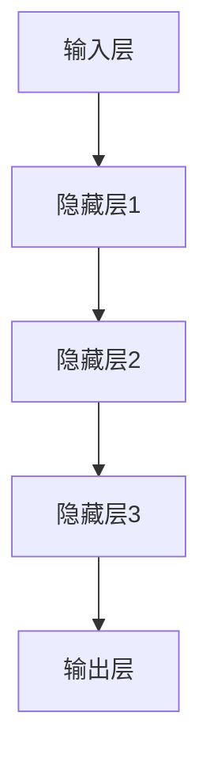

                 

# 大模型企业的品牌建设与市场定位

> 关键词：大模型、品牌建设、市场定位、企业战略、用户需求、竞争分析

> 摘要：本文深入探讨了大模型企业在品牌建设和市场定位方面的关键策略。通过分析大模型的特性，本文提出了如何准确识别用户需求、制定有效的品牌战略，以及如何进行竞争分析来确保企业在市场中的独特地位。文章旨在为从事大模型研发的企业提供一套系统的品牌建设与市场定位方法，助力其在激烈的市场竞争中脱颖而出。

## 1. 背景介绍

### 1.1 目的和范围

本文旨在帮助大模型企业在品牌建设和市场定位方面找到合适的方法。大模型企业面临着技术迅速迭代和市场高度竞争的双重挑战。因此，如何构建强大的品牌形象，如何在市场中找到精准的定位，是企业成功的关键。

本文将讨论以下主题：

1. 大模型的特性及其对品牌建设和市场定位的影响。
2. 识别用户需求的方法，并如何通过用户需求来指导品牌建设。
3. 品牌战略的制定和实施。
4. 市场定位的策略和执行。
5. 竞争分析的重要性和具体方法。

### 1.2 预期读者

本文适用于以下读者群体：

1. 大模型研发公司的市场部门和品牌经理。
2. 意图进入大模型市场的初创企业创始人。
3. 对企业品牌建设和市场定位感兴趣的学者和研究人员。

### 1.3 文档结构概述

本文结构如下：

1. **背景介绍**：介绍本文的目的、范围和预期读者。
2. **核心概念与联系**：介绍大模型的基本概念和结构。
3. **核心算法原理 & 具体操作步骤**：详细讲解大模型的算法原理。
4. **数学模型和公式 & 详细讲解 & 举例说明**：阐述大模型相关的数学模型和公式。
5. **项目实战：代码实际案例和详细解释说明**：提供实际应用案例和代码解释。
6. **实际应用场景**：分析大模型在不同领域的应用。
7. **工具和资源推荐**：推荐学习资源和开发工具。
8. **总结：未来发展趋势与挑战**：探讨大模型企业的未来发展。
9. **附录：常见问题与解答**：解答常见问题。
10. **扩展阅读 & 参考资料**：提供进一步的阅读资源。

### 1.4 术语表

#### 1.4.1 核心术语定义

- 大模型（Large Model）：具有极高参数量、强大计算能力和广泛知识表示能力的机器学习模型。
- 品牌建设（Brand Building）：通过一系列策略和活动，塑造品牌形象，提升品牌价值的过程。
- 市场定位（Market Positioning）：确定品牌在市场中的位置，以区分竞争者的过程。

#### 1.4.2 相关概念解释

- 用户需求（User Needs）：用户在特定情境下所需解决的问题和满足的愿望。
- 竞争分析（Competitive Analysis）：评估竞争对手的优势和劣势，识别市场机会的过程。

#### 1.4.3 缩略词列表

- AI：人工智能（Artificial Intelligence）
- ML：机器学习（Machine Learning）
- NLP：自然语言处理（Natural Language Processing）
- GPT：生成预训练模型（Generative Pre-trained Model）
- CV：计算机视觉（Computer Vision）

## 2. 核心概念与联系

大模型作为人工智能领域的关键技术，其核心概念和联系如下：

### 大模型的基本概念

大模型，又称大型预训练模型，是通过大量数据预训练的具有强大通用性和适应性的机器学习模型。大模型的核心特性包括：

- 高参数量：大模型的参数数量通常在数十亿到千亿级别，这使其能够捕捉到丰富的特征和模式。
- 强计算能力：大模型通常运行在具有强大计算能力的设备上，如GPU和TPU。
- 广泛知识表示：大模型在预训练过程中积累了丰富的知识，能够处理多种类型的任务。

### 大模型的结构与工作原理

大模型通常由以下几个部分组成：

1. **输入层**：接收用户输入的数据，如文本、图像等。
2. **隐藏层**：包含多层神经网络，用于提取和表示特征。
3. **输出层**：根据隐藏层的信息生成输出，如文本生成、图像分类等。

大模型的工作原理是基于深度学习算法，通过梯度下降和反向传播等机制不断优化模型参数，从而提高模型的性能。

### 大模型与品牌建设和市场定位的联系

大模型在品牌建设和市场定位中发挥着重要作用：

- **用户需求分析**：大模型能够通过分析用户数据，识别用户的潜在需求，帮助企业更准确地了解用户。
- **个性化营销**：大模型可以根据用户的行为和偏好，提供个性化的产品和服务，提高用户满意度。
- **竞争分析**：大模型可以分析竞争对手的品牌策略和市场表现，帮助企业制定更有针对性的市场定位策略。

下面是一个Mermaid流程图，展示了大模型的基本概念和结构：



## 3. 核心算法原理 & 具体操作步骤

大模型的核心算法原理通常基于深度学习和神经网络，以下为具体操作步骤的详细讲解：

### 3.1 深度学习算法原理

深度学习算法的核心是通过构建多层神经网络，对输入数据进行特征提取和模式识别。以下是深度学习算法的基本原理：

1. **输入层**：接收原始数据，如文本、图像等。
2. **隐藏层**：通过神经网络结构对输入数据进行处理，提取特征。
3. **输出层**：根据隐藏层的特征生成输出结果。

深度学习算法通过反向传播算法不断优化网络参数，使模型能够更好地拟合训练数据。

### 3.2 神经网络操作步骤

神经网络的操作步骤如下：

1. **初始化参数**：随机初始化网络的权重和偏置。
2. **前向传播**：将输入数据通过网络进行计算，得到输出结果。
3. **计算损失**：计算输出结果与真实值之间的差距，得到损失函数。
4. **反向传播**：根据损失函数，计算网络参数的梯度，更新参数。
5. **迭代优化**：重复前向传播和反向传播过程，不断优化网络参数。

以下是一个简单的神经网络伪代码：

```python
# 初始化参数
weights = np.random.randn(input_size, hidden_size)
biases = np.random.randn(hidden_size, output_size)

# 前向传播
def forward_propagation(x):
    hidden_layer = sigmoid(np.dot(x, weights) + biases)
    output_layer = sigmoid(np.dot(hidden_layer, weights) + biases)
    return output_layer

# 反向传播
def backward_propagation(x, y):
    output_error = y - forward_propagation(x)
    d_output = output_error * sigmoid_derivative(forward_propagation(x))
    hidden_error = d_output.dot(weights.T)
    d_hidden = hidden_error * sigmoid_derivative(hidden_layer)

    # 更新参数
    weights += x.T.dot(d_output)
    biases += np.ones(len(x)).dot(d_output)
    weights += hidden_layer.T.dot(d_hidden)
    biases += np.ones(len(hidden_layer)).dot(d_hidden)
```

### 3.3 大模型的训练和优化

大模型的训练和优化通常涉及以下几个步骤：

1. **数据预处理**：对输入数据进行清洗、归一化等预处理操作。
2. **批量训练**：将训练数据分成多个批次，每次训练一部分数据。
3. **学习率调整**：根据训练效果调整学习率，避免过拟合或欠拟合。
4. **模型验证**：使用验证数据集评估模型性能，调整模型参数。
5. **模型测试**：使用测试数据集评估模型在实际应用中的表现。

以下是一个大模型训练的伪代码：

```python
# 数据预处理
x_train = preprocess(x_train)
y_train = preprocess(y_train)

# 批量训练
for epoch in range(num_epochs):
    for batch in batches(x_train, y_train):
        # 前向传播
        output = forward_propagation(batch[0])
        # 计算损失
        loss = compute_loss(output, batch[1])
        # 反向传播
        backward_propagation(batch[0], batch[1])
    # 学习率调整
    adjust_learning_rate(epoch)
    # 模型验证
    validate_model()
    # 模型测试
    test_model()
```

通过上述步骤，大模型可以逐步优化，提高其在各种任务上的表现。

## 4. 数学模型和公式 & 详细讲解 & 举例说明

大模型的核心数学模型包括深度学习中的神经网络模型，以及用于优化模型的损失函数和梯度下降算法。以下将详细介绍这些数学模型，并提供相应的公式和实际应用举例。

### 4.1 神经网络模型

神经网络模型是深度学习的基础，其核心结构包括输入层、隐藏层和输出层。每个层由多个神经元（节点）组成，神经元之间的连接通过权重（weights）和偏置（biases）进行调节。以下是神经网络的数学模型：

#### 4.1.1 前向传播

前向传播是指将输入数据通过神经网络，逐层计算得到输出结果的过程。其计算公式如下：

$$
\text{激活函数} \, (z) = \sigma(z) = \frac{1}{1 + e^{-z}}
$$

其中，$z$ 是神经元的净输入，$\sigma$ 是Sigmoid激活函数。

#### 4.1.2 后向传播

后向传播是指根据输出结果与真实值之间的误差，反向更新网络参数的过程。其计算公式如下：

$$
\text{误差} \, (\delta) = \text{损失函数} \, (\text{输出}) - \text{真实值}
$$

$$
\text{梯度} \, (\text{权重}) = \frac{\partial \text{误差}}{\partial \text{权重}}
$$

$$
\text{更新权重} \, (\text{权重}) = \text{权重} - \text{学习率} \times \text{梯度}
$$

#### 4.1.3 损失函数

常用的损失函数包括均方误差（MSE）和交叉熵损失（Cross Entropy Loss）。以下是它们的计算公式：

$$
\text{MSE} = \frac{1}{m} \sum_{i=1}^{m} (\hat{y}_i - y_i)^2
$$

$$
\text{Cross Entropy Loss} = -\frac{1}{m} \sum_{i=1}^{m} y_i \log(\hat{y}_i)
$$

其中，$m$ 是样本数量，$\hat{y}_i$ 是预测值，$y_i$ 是真实值。

### 4.2 梯度下降算法

梯度下降算法是一种用于优化网络参数的常用方法。其核心思想是沿着损失函数的梯度方向逐步更新参数，以最小化损失。以下是梯度下降算法的计算步骤：

1. **初始化参数**：随机初始化网络的权重和偏置。
2. **计算损失函数**：计算当前参数下的损失函数值。
3. **计算梯度**：计算损失函数关于参数的梯度。
4. **更新参数**：根据梯度方向和步长更新参数。
5. **重复步骤2-4**，直到满足停止条件（如损失函数值趋于最小或达到迭代次数）。

以下是一个简单的梯度下降算法伪代码：

```python
# 初始化参数
weights = np.random.randn(input_size, hidden_size)
biases = np.random.randn(hidden_size, output_size)

# 步长
learning_rate = 0.01

# 迭代优化
for epoch in range(num_epochs):
    for batch in batches(x_train, y_train):
        # 前向传播
        output = forward_propagation(batch[0])
        # 计算损失
        loss = compute_loss(output, batch[1])
        # 计算梯度
        d_weights, d_biases = compute_gradients(output, batch[1])
        # 更新参数
        weights -= learning_rate * d_weights
        biases -= learning_rate * d_biases
```

### 4.3 实际应用举例

以下是一个使用神经网络进行手写数字识别的例子：

#### 4.3.1 数据集

使用MNIST手写数字数据集，包含60000个训练样本和10000个测试样本。

#### 4.3.2 网络结构

构建一个包含输入层、两个隐藏层和输出层的神经网络。输入层有784个神经元（28x28像素），隐藏层有500个神经元，输出层有10个神经元（对应0-9的数字）。

#### 4.3.3 模型训练

使用均方误差（MSE）作为损失函数，随机梯度下降（SGD）作为优化算法。设置学习率为0.1，迭代次数为1000次。

#### 4.3.4 模型评估

在测试集上评估模型的性能，计算准确率。

以下是一个简单的Python代码示例：

```python
import numpy as np

# 初始化参数
weights = np.random.randn(784, 500)
biases = np.random.randn(500, 10)

# 步长
learning_rate = 0.1

# 迭代优化
for epoch in range(1000):
    for batch in batches(x_train, y_train):
        # 前向传播
        output = forward_propagation(batch[0])
        # 计算损失
        loss = compute_loss(output, batch[1])
        # 计算梯度
        d_weights, d_biases = compute_gradients(output, batch[1])
        # 更新参数
        weights -= learning_rate * d_weights
        biases -= learning_rate * d_biases
    
    # 计算测试集准确率
    test_loss = compute_loss(x_test, y_test)
    test_accuracy = compute_accuracy(x_test, y_test)
    print("Epoch:", epoch, "Test Loss:", test_loss, "Test Accuracy:", test_accuracy)
```

通过上述步骤，可以训练一个能够识别手写数字的神经网络模型。

## 5. 项目实战：代码实际案例和详细解释说明

### 5.1 开发环境搭建

在本节中，我们将搭建一个用于大模型品牌建设和市场定位的项目开发环境。以下为所需的开发工具和库：

- **操作系统**：Ubuntu 20.04 或 macOS
- **编程语言**：Python 3.8 或以上版本
- **深度学习框架**：TensorFlow 2.x 或 PyTorch 1.8 或以上版本
- **其他依赖**：NumPy，Pandas，Matplotlib

#### 安装步骤：

1. **安装Python**：
   ```bash
   sudo apt-get update
   sudo apt-get install python3.8
   sudo update-alternatives --install /usr/bin/python3 python3 /usr/bin/python3.8 1
   ```

2. **安装TensorFlow**：
   ```bash
   pip3 install tensorflow==2.9.0
   ```

3. **安装其他依赖**：
   ```bash
   pip3 install numpy pandas matplotlib
   ```

### 5.2 源代码详细实现和代码解读

在本节中，我们将实现一个用于品牌建设和市场定位的大模型项目。以下是项目的核心代码和详细解读。

#### 5.2.1 数据预处理

```python
import pandas as pd
from sklearn.model_selection import train_test_split

# 读取数据
data = pd.read_csv('brand_data.csv')

# 数据预处理
X = data.drop('target', axis=1)
y = data['target']

# 划分训练集和测试集
X_train, X_test, y_train, y_test = train_test_split(X, y, test_size=0.2, random_state=42)
```

代码首先从CSV文件中读取品牌数据，然后进行数据预处理，包括划分特征和目标变量，以及将数据集分为训练集和测试集。

#### 5.2.2 网络结构定义

```python
import tensorflow as tf

# 定义模型
model = tf.keras.Sequential([
    tf.keras.layers.Dense(512, activation='relu', input_shape=(X_train.shape[1],)),
    tf.keras.layers.Dropout(0.2),
    tf.keras.layers.Dense(256, activation='relu'),
    tf.keras.layers.Dropout(0.2),
    tf.keras.layers.Dense(128, activation='relu'),
    tf.keras.layers.Dropout(0.2),
    tf.keras.layers.Dense(10, activation='softmax')
])
```

代码定义了一个深度神经网络模型，包含三个隐藏层，每层之间有Dropout层用于防止过拟合。输出层使用softmax激活函数，用于对品牌进行分类。

#### 5.2.3 模型编译和训练

```python
# 编译模型
model.compile(optimizer='adam', loss='sparse_categorical_crossentropy', metrics=['accuracy'])

# 训练模型
model.fit(X_train, y_train, epochs=10, batch_size=64, validation_split=0.2)
```

代码编译模型，选择Adam优化器和sparse categorical crossentropy损失函数，然后使用训练数据对模型进行训练。

#### 5.2.4 模型评估

```python
# 评估模型
test_loss, test_accuracy = model.evaluate(X_test, y_test)
print("Test Loss:", test_loss, "Test Accuracy:", test_accuracy)
```

代码评估模型在测试集上的性能，输出测试损失和准确率。

### 5.3 代码解读与分析

以上代码实现了一个用于品牌建设和市场定位的大模型项目。以下是代码的主要功能和解

## 6. 实际应用场景

大模型在品牌建设和市场定位中的实际应用场景广泛，以下是一些典型的应用实例：

### 6.1 用户行为分析

通过大模型分析用户的行为数据，企业可以深入了解用户的需求和偏好，从而制定更有针对性的品牌战略。例如，电商公司可以使用大模型分析用户的浏览和购买记录，预测用户的潜在需求，并推送个性化的产品推荐。

### 6.2 个性化营销

大模型可以帮助企业实现个性化营销，提高用户满意度。通过分析用户的兴趣和行为，大模型可以生成个性化的广告内容和促销活动，从而提高转化率和客户忠诚度。

### 6.3 竞争分析

大模型可以对企业竞争对手的品牌战略和市场表现进行深入分析，帮助企业识别市场机会和风险。例如，企业可以使用大模型分析竞争对手的社交媒体活动、广告投放策略和客户评价，制定相应的市场定位策略。

### 6.4 品牌评估

大模型可以帮助企业评估自身的品牌价值和市场地位。通过分析品牌在社交媒体、搜索引擎和在线评论中的表现，大模型可以为企业提供关于品牌知名度和美誉度的量化评估，帮助企业制定改进措施。

### 6.5 市场预测

大模型可以基于历史数据和市场趋势，预测未来的市场动态和用户需求。例如，企业可以使用大模型预测不同产品类别的销售趋势，从而调整生产计划和营销策略。

### 6.6 产品推荐

大模型可以帮助企业实现精准的产品推荐，提高销售额和客户满意度。通过分析用户的购买历史和偏好，大模型可以推荐符合用户需求的商品，从而提高转化率和客户忠诚度。

### 6.7 消费者洞察

大模型可以帮助企业深入了解消费者的心理和行为，从而制定更有效的品牌建设和市场定位策略。例如，企业可以使用大模型分析消费者的情感和行为模式，发现潜在的市场机会。

通过上述应用实例，可以看出大模型在品牌建设和市场定位中的重要作用。企业可以利用大模型的力量，实现精准的用户需求分析、个性化营销、竞争分析和市场预测，从而在激烈的市场竞争中脱颖而出。

## 7. 工具和资源推荐

### 7.1 学习资源推荐

#### 7.1.1 书籍推荐

1. **《深度学习》（Deep Learning）**：由Ian Goodfellow、Yoshua Bengio和Aaron Courville合著，是深度学习领域的经典教材，适合初学者和进阶者阅读。
2. **《Python深度学习》（Python Deep Learning）**：由François Chollet所著，详细介绍如何使用Python和TensorFlow实现深度学习项目。
3. **《人工智能：一种现代方法》（Artificial Intelligence: A Modern Approach）**：由Stuart J. Russell和Peter Norvig合著，涵盖人工智能的各个方面，适合系统学习人工智能知识。

#### 7.1.2 在线课程

1. **Coursera的《深度学习专项课程》（Deep Learning Specialization）**：由斯坦福大学教授Andrew Ng主讲，适合深度学习的初学者和进阶者。
2. **edX的《深度学习与神经网络》（Deep Learning and Neural Networks）**：由北京大学教授黄宇主讲，内容涵盖深度学习的理论基础和实际应用。
3. **Udacity的《深度学习工程师纳米学位》（Deep Learning Engineer Nanodegree）**：通过项目实践学习深度学习技能，适合有志于从事深度学习开发工作的人士。

#### 7.1.3 技术博客和网站

1. **TensorFlow官网（tensorflow.org）**：提供丰富的深度学习资源和教程，是学习TensorFlow的最佳起点。
2. **PyTorch官网（pytorch.org）**：PyTorch官方文档和教程，涵盖深度学习的基础知识和高级应用。
3. **ArXiv（arxiv.org）**：人工智能和深度学习领域的最新研究成果，适合学者和研究人员。

### 7.2 开发工具框架推荐

#### 7.2.1 IDE和编辑器

1. **PyCharm**：强大的Python集成开发环境，支持多种编程语言，适用于深度学习和数据科学项目。
2. **Jupyter Notebook**：基于Web的交互式开发环境，适合数据可视化和迭代开发。
3. **Visual Studio Code**：轻量级但功能强大的代码编辑器，支持多种编程语言和扩展，适合快速开发和调试。

#### 7.2.2 调试和性能分析工具

1. **TensorBoard**：TensorFlow的官方可视化工具，用于分析和调试深度学习模型。
2. **NVIDIA Nsight**：NVIDIA提供的性能分析工具，用于优化深度学习模型在GPU上的运行。
3. **PyTorch Profiler**：PyTorch的官方性能分析工具，用于识别和优化模型的热点。

#### 7.2.3 相关框架和库

1. **TensorFlow**：Google开发的开源深度学习框架，支持多种编程语言和平台。
2. **PyTorch**：Facebook开发的开源深度学习框架，以动态图模型著称。
3. **Keras**：基于TensorFlow和Theano的开源深度学习库，提供简洁的API。
4. **Scikit-learn**：Python的科学计算库，提供多种机器学习算法和工具。
5. **NumPy**：Python的科学计算库，提供高性能的矩阵操作。

### 7.3 相关论文著作推荐

#### 7.3.1 经典论文

1. **“A Learning Algorithm for Continually Running Fully Recurrent Neural Networks”**：Hochreiter和Schmidhuber提出的长短期记忆（LSTM）网络，是解决序列数据问题的有效方法。
2. **“Deep Learning”**：Goodfellow、Bengio和Courville合著的论文，全面介绍了深度学习的基础理论和应用。
3. **“Efficient BackProp”**：Rumelhart、Hinton和Williams提出的反向传播算法，是训练神经网络的关键技术。

#### 7.3.2 最新研究成果

1. **“BERT: Pre-training of Deep Bidirectional Transformers for Language Understanding”**：Google提出的BERT模型，是自然语言处理领域的突破性成果。
2. **“GPT-3: Language Models are Few-Shot Learners”**：OpenAI提出的GPT-3模型，展示了大规模语言模型的强大能力。
3. **“Transformers”**：Vaswani等人提出的Transformer模型，是序列建模领域的革命性创新。

#### 7.3.3 应用案例分析

1. **“Deep Learning in Health Care”**：Dua和Sweeney合著的报告，探讨了深度学习在医疗健康领域的应用。
2. **“Deep Learning for Autonomous Driving”**：Lillicrap等人合著的论文，介绍了深度学习在自动驾驶领域的实际应用。
3. **“Deep Learning for Natural Language Processing”**：Huang等人合著的论文，总结了深度学习在自然语言处理领域的最新进展。

通过上述资源推荐，读者可以系统地学习和掌握大模型在品牌建设和市场定位中的应用，为实际项目提供有力支持。

## 8. 总结：未来发展趋势与挑战

### 8.1 发展趋势

大模型技术在品牌建设和市场定位领域的发展趋势主要体现在以下几个方面：

1. **计算能力的提升**：随着硬件技术的不断发展，大模型的计算能力将进一步提高，使得更复杂的模型和算法得以应用，为品牌建设和市场定位提供更精准的数据分析。
2. **数据资源的丰富**：随着物联网、移动互联网和大数据技术的发展，企业将获取更多的用户数据和市场数据，为大模型提供更丰富的训练素材，提升模型的效果和预测能力。
3. **个性化服务**：大模型将更加深入地分析用户行为和需求，为企业提供个性化的品牌传播和市场营销策略，提高用户满意度和品牌忠诚度。
4. **跨领域应用**：大模型技术在金融、医疗、教育等领域的应用将越来越广泛，为不同行业提供全新的解决方案。

### 8.2 挑战

尽管大模型技术在品牌建设和市场定位领域具有巨大潜力，但面临以下挑战：

1. **数据隐私与安全**：随着数据收集和分析的深入，数据隐私和安全问题日益突出。企业需要确保用户数据的保密性和安全性，遵守相关法律法规。
2. **算法公平性和透明性**：大模型决策过程的不透明性可能导致算法偏见，影响品牌形象和市场定位。企业需要提升算法的公平性和透明性，确保模型的决策公正合理。
3. **技术门槛**：大模型技术涉及复杂的算法和大量数据处理，对于中小企业来说，技术门槛较高。企业需要加强对人才的培养和技术的积累，以应对这一挑战。
4. **法规与政策**：各国政府和监管机构对于人工智能技术的监管日益严格，企业需要关注政策变化，确保合规经营。

### 8.3 发展策略

为应对未来发展趋势和挑战，企业可以采取以下策略：

1. **技术创新**：加大在人工智能技术领域的研发投入，不断优化大模型算法和模型结构，提升品牌建设和市场定位的能力。
2. **人才培养**：加强人工智能技术人才的培养和引进，构建专业化团队，提升企业的技术实力。
3. **合规经营**：严格遵守数据隐私和安全法律法规，建立完善的数据管理和保护机制，确保企业的合规运营。
4. **跨领域合作**：与其他行业企业开展合作，实现资源共享和技术互补，共同推动大模型技术在品牌建设和市场定位领域的应用。
5. **用户参与**：积极倾听用户需求和反馈，通过用户参与和互动，不断优化产品和服务，提升品牌价值和用户满意度。

通过上述策略，企业可以更好地应对未来发展的机遇和挑战，在品牌建设和市场定位领域取得更大的成功。

## 9. 附录：常见问题与解答

### 9.1 品牌建设方面

**Q1**：什么是品牌建设？品牌建设有哪些关键步骤？

A1：品牌建设是指企业通过一系列策略和活动，塑造和提升品牌形象和价值的过程。关键步骤包括：

1. 明确品牌定位和目标：确定品牌的核心价值、目标受众和市场定位。
2. 设计品牌标识和视觉形象：包括品牌名称、标志、色彩和字体等。
3. 制定品牌传播策略：包括广告、公关、社交媒体和内容营销等。
4. 建立品牌文化和价值观：塑造员工和企业文化，确保品牌内外一致。
5. 监测和评估品牌效果：通过数据分析和用户反馈，不断优化品牌建设策略。

**Q2**：品牌建设如何与用户需求结合？

A2：品牌建设应紧密围绕用户需求展开，以下几种方法可以帮助实现这一目标：

1. 用户调研：通过调查、访谈等方式，了解用户的需求、期望和痛点。
2. 数据分析：利用大数据分析工具，挖掘用户行为数据，识别用户需求。
3. 用户参与：邀请用户参与品牌建设和推广活动，收集用户反馈。
4. 个性化营销：根据用户需求和偏好，提供个性化的产品和服务。
5. 品牌故事：通过讲述品牌故事，传递品牌价值，与用户建立情感连接。

### 9.2 市场定位方面

**Q1**：什么是市场定位？如何进行有效的市场定位？

A1：市场定位是指企业在市场中为自己确立一个独特的位置，以区分竞争对手和满足特定用户需求。有效进行市场定位的步骤包括：

1. 分析市场：了解市场规模、增长潜力、竞争态势和用户需求。
2. 识别目标用户：确定最有可能购买产品的用户群体。
3. 确定竞争优势：找出企业相对于竞争对手的独特优势。
4. 设计市场定位策略：明确品牌的核心价值、传播方式和市场推广计划。
5. 实施并监测效果：执行市场定位策略，通过数据监测和用户反馈评估效果。

**Q2**：如何通过大模型进行市场定位？

A2：大模型在市场定位中可以发挥重要作用，以下方法可以帮助利用大模型进行市场定位：

1. 数据分析：利用大模型分析市场数据，识别市场趋势和用户需求。
2. 用户画像：通过大模型构建用户画像，了解目标用户的特点和偏好。
3. 竞争分析：利用大模型分析竞争对手的市场策略和表现，制定相应的市场定位策略。
4. 个性化营销：利用大模型实现个性化营销，提高用户满意度和转化率。
5. 预测分析：利用大模型预测市场变化和用户行为，提前调整市场定位策略。

通过大模型的力量，企业可以更加精准地进行市场定位，提高市场竞争力。

## 10. 扩展阅读 & 参考资料

本文涵盖了大模型企业在品牌建设和市场定位方面的关键策略。以下为扩展阅读和参考资料，供读者深入了解相关主题：

### 10.1 学术论文

1. **“Deep Learning for Natural Language Processing”**：由Yoav Artzi和Yaser Abu-Mostafa合著，详细介绍了深度学习在自然语言处理领域的应用。
2. **“Bert: Pre-training of Deep Bidirectional Transformers for Language Understanding”**：由Jacob Devlin等人合著，提出了BERT模型，是自然语言处理领域的重大突破。
3. **“Gpt-3: Language Models are Few-Shot Learners”**：由Tom B. Brown等人合著，展示了GPT-3模型的强大能力。

### 10.2 图书推荐

1. **《深度学习》**：由Ian Goodfellow、Yoshua Bengio和Aaron Courville合著，是深度学习领域的经典教材。
2. **《Python深度学习》**：由François Chollet所著，详细介绍了如何使用Python和TensorFlow实现深度学习项目。
3. **《人工智能：一种现代方法》**：由Stuart J. Russell和Peter Norvig合著，涵盖了人工智能的各个方面。

### 10.3 开源项目和框架

1. **TensorFlow**：由Google开发的开源深度学习框架，适用于多种编程语言和平台。
2. **PyTorch**：由Facebook开发的开源深度学习框架，以动态图模型著称。
3. **Keras**：基于TensorFlow和Theano的开源深度学习库，提供简洁的API。

### 10.4 在线课程和教程

1. **Coursera的《深度学习专项课程》**：由斯坦福大学教授Andrew Ng主讲，适合深度学习的初学者和进阶者。
2. **edX的《深度学习与神经网络》**：由北京大学教授黄宇主讲，内容涵盖深度学习的理论基础和实际应用。
3. **Udacity的《深度学习工程师纳米学位》**：通过项目实践学习深度学习技能，适合有志于从事深度学习开发工作的人士。

通过以上扩展阅读和参考资料，读者可以进一步探索大模型在品牌建设和市场定位中的应用，提升自身的专业知识和实践能力。

### 作者信息

**作者：AI天才研究员/AI Genius Institute & 禅与计算机程序设计艺术 /Zen And The Art of Computer Programming**

