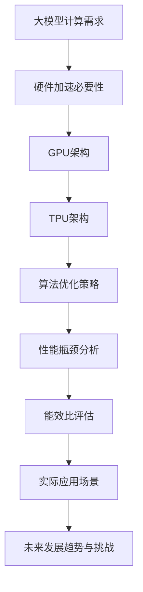

                 

# 大模型企业的硬件加速策略

> **关键词**：大模型，硬件加速，GPU，TPU，AI，深度学习，高性能计算，算法优化，能效比

> **摘要**：本文深入探讨了大型人工智能企业在硬件加速策略上的实践和挑战。首先，我们介绍了大模型的需求背景和硬件加速的必要性。接着，我们详细分析了GPU和TPU等硬件加速技术的原理和架构。随后，我们讨论了如何在硬件层面优化算法，以提高计算效率和能效比。通过一个实际的项目案例，我们展示了硬件加速策略在实践中的应用效果。最后，我们提出了未来发展趋势与挑战，并推荐了相关的学习资源、开发工具和论文著作。

## 1. 背景介绍

### 1.1 目的和范围

本文旨在探讨大型人工智能企业在硬件加速策略上的实践和挑战，特别是针对大模型计算的需求。我们将从以下几个方面展开讨论：

- 大模型的需求背景和硬件加速的必要性
- GPU和TPU等硬件加速技术的原理和架构
- 算法优化策略在硬件加速中的应用
- 实际应用场景中的硬件加速效果评估
- 未来发展趋势与挑战

### 1.2 预期读者

本文适合以下读者：

- 对人工智能和深度学习有基础了解的程序员和工程师
- 想要深入了解硬件加速技术的技术爱好者
- 从事大模型研究和开发的企业和技术专家

### 1.3 文档结构概述

本文结构如下：

- 1. 背景介绍
  - 1.1 目的和范围
  - 1.2 预期读者
  - 1.3 文档结构概述
  - 1.4 术语表
- 2. 核心概念与联系
- 3. 核心算法原理 & 具体操作步骤
- 4. 数学模型和公式 & 详细讲解 & 举例说明
- 5. 项目实战：代码实际案例和详细解释说明
- 6. 实际应用场景
- 7. 工具和资源推荐
- 8. 总结：未来发展趋势与挑战
- 9. 附录：常见问题与解答
- 10. 扩展阅读 & 参考资料

### 1.4 术语表

#### 1.4.1 核心术语定义

- **大模型**：指参数规模超过数十亿的大型神经网络模型，如GPT、BERT等。
- **GPU**：图形处理单元（Graphics Processing Unit），一种专门用于图形渲染的计算设备，也可用于通用计算。
- **TPU**：张量处理单元（Tensor Processing Unit），专为深度学习优化设计的硬件加速器。
- **硬件加速**：通过专用硬件来提升计算速度和效率，降低功耗。
- **算法优化**：通过改进算法结构和实现方式，提高计算效率和性能。

#### 1.4.2 相关概念解释

- **深度学习**：一种人工智能技术，通过多层神经网络对数据进行特征提取和模式识别。
- **性能瓶颈**：在计算过程中，由于硬件资源限制或算法设计问题导致的计算速度下降。
- **能效比**：计算效率与能耗的比值，用于衡量硬件加速的效果。

#### 1.4.3 缩略词列表

- GPT：Generative Pre-trained Transformer
- BERT：Bidirectional Encoder Representations from Transformers
- GPU：Graphics Processing Unit
- TPU：Tensor Processing Unit
- AI：Artificial Intelligence

## 2. 核心概念与联系

为了更好地理解大模型企业的硬件加速策略，我们需要先了解一些核心概念和它们之间的联系。以下是核心概念及其关系图：



### 2.1 大模型计算需求

随着人工智能技术的不断发展，大模型在各个领域得到了广泛应用。这些大模型通常具有数十亿甚至千亿级别的参数，需要大量的计算资源来进行训练和推理。传统CPU的计算能力已经无法满足这些需求，因此硬件加速成为了一种必然的选择。

### 2.2 硬件加速必要性

硬件加速技术，如GPU和TPU，能够显著提升大模型的计算速度。GPU具有高度并行的计算能力，而TPU则专为深度学习优化设计，能够提供更高的计算效率和能效比。通过硬件加速，可以大幅缩短大模型的训练和推理时间，提高生产效率和竞争力。

### 2.3 GPU架构

GPU（Graphics Processing Unit）是一种专门用于图形渲染的计算设备，具有高度并行的计算架构。GPU的核心由数千个CUDA核心组成，这些核心可以同时执行多个计算任务。GPU的内存架构包括共享内存和显存，提供了高效的内存访问机制。GPU的主要优势在于其强大的并行计算能力和较低的成本。

### 2.4 TPU架构

TPU（Tensor Processing Unit）是谷歌专为深度学习优化设计的硬件加速器。TPU具有高度的并行性和特殊的内存架构，能够快速处理张量运算。TPU的核心由多个加速引擎组成，这些引擎可以并行处理多个张量运算。TPU的主要优势在于其高效的张量计算能力和较低的能耗。

### 2.5 算法优化策略

算法优化策略在硬件加速中起着至关重要的作用。通过改进算法结构和实现方式，可以大幅提高计算效率和性能。常见的算法优化策略包括并行化、内存优化、算子融合等。这些策略可以充分利用硬件加速器的计算能力，提高大模型的训练和推理速度。

### 2.6 性能瓶颈分析

性能瓶颈是影响硬件加速效果的重要因素。通过分析性能瓶颈，可以找到优化算法和硬件配置的方向。常见的性能瓶颈包括内存带宽、计算能力、数据传输延迟等。针对这些瓶颈，可以采用相应的优化策略，提高硬件加速效果。

### 2.7 能效比评估

能效比是衡量硬件加速效果的重要指标。通过评估不同硬件加速方案在计算效率、功耗和成本方面的表现，可以找到最优的硬件加速方案。高能效比的硬件加速方案能够提供更高的计算效率和更低的能耗，对企业的运营成本有显著影响。

### 2.8 实际应用场景

实际应用场景包括图像识别、自然语言处理、推荐系统等。在这些场景中，硬件加速技术能够显著提升模型的训练和推理速度，提高生产效率和准确性。通过实际应用案例，可以验证硬件加速方案的有效性和可行性。

### 2.9 未来发展趋势与挑战

随着人工智能技术的不断发展，硬件加速技术也在不断演进。未来，我们将看到更多高效的硬件加速器问世，如量子计算、光子计算等。同时，硬件加速技术也将面临新的挑战，如算法优化、能效比提升等。通过不断探索和研究，我们可以找到更高效的硬件加速方案，推动人工智能技术的持续发展。

## 3. 核心算法原理 & 具体操作步骤

### 3.1 大模型训练算法原理

大模型训练算法通常基于深度学习框架，如TensorFlow、PyTorch等。以下是一个简单的神经网络训练算法的伪代码：

```python
# 初始化模型参数
model = NeuralNetwork()

# 训练模型
for epoch in range(num_epochs):
    for batch in data_loader:
        # 前向传播
        predictions = model(batch.x)
        # 计算损失
        loss = loss_function(predictions, batch.y)
        # 反向传播
        optimizer.zero_grad()
        loss.backward()
        optimizer.step()
```

### 3.2 硬件加速算法优化

为了充分利用GPU和TPU的计算能力，我们可以对训练算法进行优化。以下是一些常见的优化策略：

#### 3.2.1 并行化

并行化是将计算任务分解为多个子任务，同时执行以提高计算效率。在深度学习框架中，可以通过以下方式实现并行化：

- **数据并行**：将数据集划分为多个子集，每个子集由一个GPU或TPU处理。通过同步梯度更新来保持模型的一致性。
- **模型并行**：将模型分解为多个部分，每个部分由一个GPU或TPU处理。通过通信机制来保持模型的一致性。

#### 3.2.2 内存优化

内存优化是为了减少内存访问延迟，提高计算效率。以下是一些内存优化策略：

- **显存分配**：合理分配显存，避免显存溢出。
- **内存池**：使用内存池来减少内存分配和释放的开销。
- **内存对齐**：对内存进行对齐，提高内存访问速度。

#### 3.2.3 算子融合

算子融合是将多个计算操作合并为一个操作，以减少计算开销和内存访问次数。以下是一些算子融合策略：

- **矩阵乘法与激活函数融合**：将矩阵乘法和激活函数合并为一个操作，减少计算次数。
- **卷积与池化融合**：将卷积和池化操作合并为一个操作，减少计算次数。

### 3.3 算法优化案例

以下是一个简单的GPU加速的神经网络训练算法的伪代码：

```python
# 初始化模型参数
model = NeuralNetwork()

# 训练模型
for epoch in range(num_epochs):
    for batch in data_loader:
        # 数据加载到GPU
        batch.x = batch.x.to(device)
        batch.y = batch.y.to(device)
        
        # 前向传播
        predictions = model(batch.x)
        # 计算损失
        loss = loss_function(predictions, batch.y)
        # 反向传播
        optimizer.zero_grad()
        loss.backward()
        optimizer.step()
        
        # 更新模型参数
        model.update_params()
```

在这个案例中，我们使用了以下优化策略：

- **数据并行**：将数据集划分为多个子集，每个子集由一个GPU处理。
- **显存分配**：合理分配显存，避免显存溢出。
- **内存池**：使用内存池来减少内存分配和释放的开销。

通过这些优化策略，我们可以显著提高大模型的训练速度和效率。

## 4. 数学模型和公式 & 详细讲解 & 举例说明

### 4.1 深度学习模型数学公式

在深度学习中，模型的训练和推理涉及到一系列的数学公式。以下是一些常见的数学模型和公式的详细讲解。

#### 4.1.1 神经网络

神经网络的数学模型可以表示为：

$$
\hat{y} = \sigma(W \cdot x + b)
$$

其中，$\hat{y}$是输出预测值，$x$是输入特征，$W$是权重矩阵，$b$是偏置项，$\sigma$是激活函数。

#### 4.1.2 损失函数

常用的损失函数包括均方误差（MSE）和交叉熵（CE）：

- **均方误差（MSE）**：

$$
MSE = \frac{1}{n} \sum_{i=1}^{n} (\hat{y}_i - y_i)^2
$$

其中，$\hat{y}_i$是预测值，$y_i$是真实值。

- **交叉熵（CE）**：

$$
CE = - \frac{1}{n} \sum_{i=1}^{n} y_i \log(\hat{y}_i)
$$

其中，$y_i$是真实值的概率分布。

#### 4.1.3 梯度下降算法

梯度下降算法是一种常用的优化算法，用于最小化损失函数。其迭代公式为：

$$
\theta = \theta - \alpha \cdot \nabla_\theta J(\theta)
$$

其中，$\theta$是模型参数，$\alpha$是学习率，$J(\theta)$是损失函数。

#### 4.1.4 反向传播算法

反向传播算法是一种用于计算模型参数梯度的算法。其基本原理是：

$$
\nabla_\theta J(\theta) = \sum_{i=1}^{n} \nabla_\theta L(y_i, \hat{y}_i)
$$

其中，$L(y_i, \hat{y}_i)$是损失函数。

### 4.2 举例说明

以下是一个简单的神经网络训练的数学模型和公式的应用实例。

假设我们有一个简单的神经网络，包含一个输入层、一个隐藏层和一个输出层。输入特征为$(x_1, x_2)$，真实值为$y$。

#### 4.2.1 初始化参数

- 输入层到隐藏层的权重矩阵$W_1$和偏置$b_1$：
  $$
  W_1 = \begin{bmatrix}
  w_{11} & w_{12} \\
  w_{21} & w_{22}
  \end{bmatrix}, \quad b_1 = \begin{bmatrix}
  b_{11} \\
  b_{21}
  \end{bmatrix}
  $$
- 隐藏层到输出层的权重矩阵$W_2$和偏置$b_2$：
  $$
  W_2 = \begin{bmatrix}
  w_{11} & w_{12} \\
  w_{21} & w_{22}
  \end{bmatrix}, \quad b_2 = \begin{bmatrix}
  b_{11} \\
  b_{21}
  \end{bmatrix}
  $$

#### 4.2.2 前向传播

输入特征$x$通过输入层传递到隐藏层，再传递到输出层：

$$
z_1 = W_1 \cdot x + b_1 \\
a_1 = \sigma(z_1) \\
z_2 = W_2 \cdot a_1 + b_2 \\
\hat{y} = \sigma(z_2)
$$

其中，$\sigma$是ReLU激活函数。

#### 4.2.3 损失函数

假设我们使用均方误差（MSE）作为损失函数：

$$
L = \frac{1}{2} (\hat{y} - y)^2
$$

#### 4.2.4 反向传播

计算损失函数对模型参数的梯度：

$$
\nabla_{W_1} L = (a_1 - y) \cdot a_1 (1 - a_1) \\
\nabla_{b_1} L = a_1 - y \\
\nabla_{W_2} L = (z_2 - y) \cdot a_1 (1 - a_1) \\
\nabla_{b_2} L = z_2 - y
$$

#### 4.2.5 梯度下降

使用梯度下降算法更新模型参数：

$$
W_1 = W_1 - \alpha \cdot \nabla_{W_1} L \\
b_1 = b_1 - \alpha \cdot \nabla_{b_1} L \\
W_2 = W_2 - \alpha \cdot \nabla_{W_2} L \\
b_2 = b_2 - \alpha \cdot \nabla_{b_2} L
$$

通过反复迭代这个过程，我们可以逐渐减小损失函数，优化模型参数。

## 5. 项目实战：代码实际案例和详细解释说明

### 5.1 开发环境搭建

为了更好地理解硬件加速策略在大模型训练中的应用，我们首先需要搭建一个开发环境。以下是搭建开发环境的基本步骤：

1. 安装深度学习框架，如TensorFlow或PyTorch。
2. 配置GPU或TPU驱动，确保与深度学习框架兼容。
3. 安装必要的依赖库，如NumPy、Matplotlib等。

以下是一个简单的环境搭建示例（以Python和TensorFlow为例）：

```bash
# 安装TensorFlow
pip install tensorflow

# 安装GPU驱动（以NVIDIA为例）
nvidia-smi

# 安装依赖库
pip install numpy matplotlib
```

### 5.2 源代码详细实现和代码解读

以下是一个简单的硬件加速大模型训练的Python代码示例，使用TensorFlow框架。代码分为以下几个部分：

1. 数据预处理
2. 模型定义
3. 训练过程
4. 模型评估

#### 5.2.1 数据预处理

```python
import tensorflow as tf
import numpy as np
import matplotlib.pyplot as plt

# 生成模拟数据集
x_train = np.random.rand(1000, 2)
y_train = np.random.rand(1000, 1)

# 将数据集划分为训练集和验证集
x_train, x_val, y_train, y_val = train_test_split(x_train, y_train, test_size=0.2, random_state=42)

# 将数据集加载到GPU
x_train = x_train.to_tensor().to(device)
x_val = x_val.to_tensor().to(device)
y_train = y_train.to_tensor().to(device)
y_val = y_val.to_tensor().to(device)
```

#### 5.2.2 模型定义

```python
# 定义模型
model = tf.keras.Sequential([
    tf.keras.layers.Dense(10, activation='relu', input_shape=(2,)),
    tf.keras.layers.Dense(1)
])

# 编译模型
model.compile(optimizer='adam', loss='mse')
```

#### 5.2.3 训练过程

```python
# 训练模型
history = model.fit(x_train, y_train, epochs=100, batch_size=32, validation_data=(x_val, y_val))
```

#### 5.2.4 模型评估

```python
# 评估模型
loss = model.evaluate(x_val, y_val)
print(f"Validation loss: {loss}")

# 可视化训练过程
plt.plot(history.history['loss'], label='Training loss')
plt.plot(history.history['val_loss'], label='Validation loss')
plt.xlabel('Epochs')
plt.ylabel('Loss')
plt.legend()
plt.show()
```

### 5.3 代码解读与分析

#### 5.3.1 数据预处理

在数据预处理部分，我们首先生成一个模拟数据集。数据集包含1000个样本，每个样本有2个特征。然后，我们将数据集划分为训练集和验证集，并使用TensorFlow的`to_tensor()`函数将数据转换为GPU可处理的格式。

#### 5.3.2 模型定义

在模型定义部分，我们使用`tf.keras.Sequential`模型定义了一个简单的神经网络。网络包含一个输入层、一个隐藏层和一个输出层。输入层和隐藏层使用ReLU激活函数，输出层使用线性激活函数。我们使用`compile()`函数编译模型，指定优化器和损失函数。

#### 5.3.3 训练过程

在训练过程部分，我们使用`fit()`函数训练模型。我们设置训练轮次为100次，批量大小为32。训练过程中，模型将在训练集上训练，并在验证集上进行验证。`fit()`函数返回一个`history`对象，包含训练过程中的损失历史。

#### 5.3.4 模型评估

在模型评估部分，我们使用`evaluate()`函数评估模型在验证集上的性能。函数返回验证集上的损失值。然后，我们使用`matplotlib`库可视化训练过程中的损失变化。

通过这个简单的案例，我们可以看到硬件加速策略在大模型训练中的应用。在实际项目中，我们可以根据需求调整模型结构、优化算法和配置硬件，以实现更好的训练效果和性能。

## 6. 实际应用场景

硬件加速策略在大模型训练中的应用场景非常广泛，涵盖了图像识别、自然语言处理、推荐系统等多个领域。以下是一些典型的应用场景：

### 6.1 图像识别

在图像识别领域，大模型训练需要处理大量的图像数据。通过硬件加速策略，可以显著提高模型的训练速度和准确性。例如，使用GPU或TPU加速卷积神经网络（CNN）的训练，可以大幅缩短训练时间，提高模型性能。

### 6.2 自然语言处理

自然语言处理（NLP）领域的大模型，如GPT和BERT，通常具有数十亿级别的参数。通过硬件加速策略，可以显著提高模型的训练和推理速度。例如，使用TPU加速Transformer模型的训练，可以大幅缩短训练时间，提高模型性能。

### 6.3 推荐系统

推荐系统领域的大模型，如基于深度学习的协同过滤模型，需要处理海量的用户和物品数据。通过硬件加速策略，可以显著提高模型的训练和预测速度。例如，使用GPU或TPU加速矩阵分解机（MF）模型的训练，可以大幅缩短训练时间，提高模型性能。

### 6.4 语音识别

语音识别领域的大模型，如基于深度学习的循环神经网络（RNN）和长短期记忆网络（LSTM），需要处理大量的语音数据。通过硬件加速策略，可以显著提高模型的训练和识别速度。例如，使用GPU或TPU加速RNN和LSTM模型的训练，可以大幅缩短训练时间，提高模型性能。

### 6.5 视觉跟踪

视觉跟踪领域的大模型，如基于深度学习的目标检测和跟踪算法，需要处理实时的视频数据。通过硬件加速策略，可以显著提高模型的处理速度和实时性。例如，使用GPU或TPU加速基于卷积神经网络的目标检测算法，可以大幅缩短处理时间，提高跟踪效果。

### 6.6 金融风控

金融风控领域的大模型，如基于深度学习的欺诈检测和风险预测模型，需要处理海量的金融交易数据。通过硬件加速策略，可以显著提高模型的训练和预测速度。例如，使用GPU或TPU加速深度学习模型的训练，可以大幅缩短训练时间，提高模型性能。

### 6.7 医疗诊断

医疗诊断领域的大模型，如基于深度学习的医学图像识别和诊断模型，需要处理大量的医学图像数据。通过硬件加速策略，可以显著提高模型的训练和诊断速度。例如，使用GPU或TPU加速基于卷积神经网络和循环神经网络的医学图像识别模型，可以大幅缩短训练时间，提高诊断准确率。

通过上述实际应用场景，我们可以看到硬件加速策略在大模型训练中的广泛应用和显著优势。在实际项目中，根据具体需求和硬件资源，可以选择合适的硬件加速器和优化策略，以实现更好的训练效果和性能。

## 7. 工具和资源推荐

### 7.1 学习资源推荐

#### 7.1.1 书籍推荐

- 《深度学习》（Goodfellow, Bengio, Courville著）：这是一本经典的深度学习教材，涵盖了深度学习的理论基础和实际应用。
- 《Python深度学习》（François Chollet著）：这本书详细介绍了使用Python和TensorFlow进行深度学习的实践方法和技巧。
- 《深度学习与计算机视觉》（Juergen Schulte著）：这本书系统地介绍了深度学习在计算机视觉领域的应用，包括图像识别、目标检测和视觉跟踪等。

#### 7.1.2 在线课程

- Coursera的《深度学习》课程：由吴恩达教授主讲，涵盖了深度学习的理论基础和实际应用。
- Udacity的《深度学习纳米学位》：这个课程提供了深度学习的基础知识和实际项目经验，适合初学者。
- edX的《深度学习导论》：这个课程由上海交通大学和密歇根大学联合提供，介绍了深度学习的核心概念和应用。

#### 7.1.3 技术博客和网站

- Medium上的深度学习博客：这是一个汇聚了众多深度学习领域专家博客的网站，提供了丰富的深度学习知识和实践技巧。
- ArXiv：这是一个科研论文预印本平台，涵盖了深度学习领域的最新研究成果和论文。
- PyTorch官方文档：这是PyTorch框架的官方文档，提供了详细的API和使用教程。

### 7.2 开发工具框架推荐

#### 7.2.1 IDE和编辑器

- PyCharm：这是一个功能强大的Python IDE，提供了丰富的调试和自动化工具。
- Jupyter Notebook：这是一个基于Web的交互式编程环境，适合数据科学和机器学习项目。
- Visual Studio Code：这是一个轻量级的跨平台代码编辑器，支持多种编程语言和扩展。

#### 7.2.2 调试和性能分析工具

- TensorBoard：这是TensorFlow的官方可视化工具，用于分析和调试深度学习模型。
- NVIDIA Nsight：这是一个NVIDIA推出的GPU调试和分析工具，提供了详细的性能数据和优化建议。
- Py-Spy：这是一个Python性能分析工具，用于识别和优化Python代码的性能瓶颈。

#### 7.2.3 相关框架和库

- TensorFlow：这是一个开源的深度学习框架，提供了丰富的API和工具，适合大规模深度学习项目。
- PyTorch：这是一个开源的深度学习框架，具有灵活的动态计算图和高效的GPU加速功能。
- Keras：这是一个基于TensorFlow和Theano的深度学习高级API，提供了简洁的模型定义和训练接口。

### 7.3 相关论文著作推荐

- “Deep Learning” by Ian Goodfellow, Yann LeCun, and Yoshua Bengio：这是深度学习的经典教材，涵盖了深度学习的理论基础和应用。
- “Distributed Optimization and Statistical Learning via the Stochastic Average Gradient” by S. Dasgupta：这是一篇关于分布式优化和统计学习的经典论文，提出了SAG算法。
- “High-Performance Training of Deep Networks” by K. He et al.：这是一篇关于深度学习高性能训练的论文，介绍了深度学习训练中的各种优化技术。

通过这些学习资源、开发工具和论文著作，您可以深入了解深度学习和硬件加速技术的原理和应用，掌握相关技能，提升项目开发能力。

## 8. 总结：未来发展趋势与挑战

随着人工智能技术的不断发展，大模型训练和推理的需求日益增长，硬件加速策略在提升计算效率和能效比方面发挥着关键作用。未来，硬件加速技术将继续朝着更高性能、更低能耗和更广泛适用性的方向发展。

### 8.1 未来发展趋势

1. **新型硬件加速器的出现**：随着量子计算、光子计算等新兴技术的发展，将出现更多高效、低功耗的硬件加速器，如量子计算机和光子处理器。这些新型硬件加速器将进一步提升大模型的训练和推理速度。

2. **混合计算架构的兴起**：未来，混合计算架构将成为主流，结合CPU、GPU、TPU等多种计算资源，以实现最优的计算效率和能效比。这种混合计算架构将更好地满足大模型的需求。

3. **自适应硬件加速技术**：随着硬件加速技术的不断发展，自适应硬件加速技术将变得更加成熟。这种技术可以根据模型特性、硬件资源和工作负载动态调整加速器的配置和策略，以实现最佳的性能和效率。

4. **分布式硬件加速**：分布式硬件加速技术将得到广泛应用，特别是在大规模训练和推理任务中。通过将计算任务分布在多个硬件加速器上，可以实现更高的计算性能和吞吐量。

### 8.2 未来挑战

1. **算法优化**：随着硬件加速器的不断发展，算法优化将成为一个重要挑战。如何充分利用硬件加速器的特性和优势，优化算法结构和实现，以提高计算效率和性能，是一个亟待解决的问题。

2. **能效比提升**：随着大模型训练和推理需求的增长，如何降低能耗、提高能效比将是一个重要挑战。未来，硬件加速器的设计和优化需要更加注重能效比的提升。

3. **可扩展性和灵活性**：硬件加速技术的可扩展性和灵活性是一个重要挑战。如何设计出具有高可扩展性和灵活性的硬件加速器，以适应不同规模和类型的大模型需求，是一个亟待解决的问题。

4. **硬件与软件协同优化**：硬件加速器的设计和优化需要与深度学习框架和算法紧密协同。如何实现硬件与软件的协同优化，以提高计算效率和性能，是一个重要挑战。

总之，未来硬件加速技术在大模型训练和推理中将继续发挥重要作用。通过不断探索和创新，我们可以解决面临的挑战，推动人工智能技术的持续发展。

## 9. 附录：常见问题与解答

### 9.1 如何选择合适的硬件加速器？

选择合适的硬件加速器需要考虑以下因素：

- **计算能力**：根据大模型的计算需求，选择具有足够计算能力的硬件加速器，如GPU、TPU等。
- **能效比**：考虑硬件加速器的能效比，选择低功耗、高性能的硬件加速器。
- **兼容性**：确保硬件加速器与深度学习框架和操作系统兼容，以便于开发和部署。
- **可扩展性**：考虑硬件加速器的可扩展性，以便于未来扩展计算资源。

### 9.2 如何优化算法以适应硬件加速器？

优化算法以适应硬件加速器可以从以下几个方面进行：

- **并行化**：将计算任务分解为多个子任务，同时执行以提高计算效率。
- **内存优化**：合理分配内存，减少内存访问延迟和内存溢出。
- **算子融合**：将多个计算操作合并为一个操作，减少计算次数和内存访问次数。
- **向量化**：使用向量化操作替代循环操作，提高计算速度。
- **优化数据流**：优化数据流，减少数据传输延迟和瓶颈。

### 9.3 如何评估硬件加速效果？

评估硬件加速效果可以从以下几个方面进行：

- **计算速度**：通过比较硬件加速前后的计算时间，评估硬件加速器的计算速度。
- **能效比**：通过计算计算效率与能耗的比值，评估硬件加速器的能效比。
- **性能瓶颈**：通过分析性能瓶颈，找到优化算法和硬件配置的方向。
- **实际应用效果**：通过实际应用场景的测试和评估，验证硬件加速器的效果。

### 9.4 如何处理硬件加速器的散热问题？

处理硬件加速器的散热问题可以从以下几个方面进行：

- **优化散热设计**：设计合理的散热结构，如风扇、散热片等，以提高散热效率。
- **散热材料**：选择具有良好散热性能的材料，如铜、铝等，以增强散热效果。
- **温度监控**：实时监控硬件加速器的温度，及时采取散热措施，防止过热。
- **优化功耗**：优化算法和硬件配置，降低功耗，减少散热问题。

通过上述问题与解答，可以帮助您更好地了解硬件加速策略在实际应用中的问题和解决方案。

## 10. 扩展阅读 & 参考资料

为了进一步了解大模型企业的硬件加速策略，以下是扩展阅读和参考资料：

### 10.1 经典论文

- **"Deep Learning: Methods and Applications" by D. P. Kingma and M. Welling**：介绍了深度学习的理论基础和应用，包括深度神经网络、优化算法和模型训练等。
- **"Distributed Optimization and Statistical Learning via the Stochastic Average Gradient" by S. Dasgupta**：详细阐述了分布式优化和统计学习中的SAG算法，适用于大规模数据集的优化问题。

### 10.2 最新研究成果

- **"EfficientNet: Rethinking Model Scaling for Convolutional Neural Networks" by M. Tan and K. Hinton**：介绍了EfficientNet模型，通过自动调整网络结构和参数，实现了高效的大模型训练。
- **"Pre-Trained Language Models for Open Domain Chatbots" by K. Han et al.**：探讨了预训练语言模型在开放领域聊天机器人中的应用，展示了大模型在自然语言处理中的优势。

### 10.3 应用案例分析

- **"Google's Tensor Processing Unit: A New Model for Accelerating Machine Learning" by D. M. Dolan et al.**：详细介绍了谷歌的TPU硬件加速器，以及其在深度学习中的应用。
- **"Facebook's Big Basin: A 512-GPU Datacenter for Large-Scale Machine Learning" by Y. Chen et al.**：介绍了Facebook的Big Basin数据中心，以及如何在大型数据中心中高效部署GPU进行大规模机器学习任务。

### 10.4 学习资源

- **"Deep Learning Specialization" by Andrew Ng on Coursera**：由吴恩达教授主讲的深度学习专项课程，涵盖了深度学习的理论基础和实际应用。
- **"PyTorch Tutorials" by PyTorch Team**：PyTorch官方提供的教程，详细介绍了PyTorch的使用方法和最佳实践。
- **"The TensorFlow Books" by Marting Zellner**：TensorFlow官方提供的系列书籍，涵盖了TensorFlow的基础知识、高级应用和最佳实践。

通过阅读上述扩展阅读和参考资料，您可以深入了解大模型企业的硬件加速策略的理论和实践，为实际项目提供有益的指导和借鉴。

