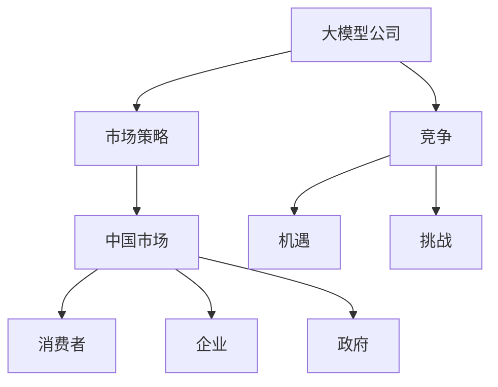

                 

### 大模型公司在中国的市场策略

> **关键词：** 大模型公司、市场策略、中国、竞争、机遇、挑战
> 
> **摘要：** 本文将深入探讨大模型公司在中国的市场策略，分析其在市场竞争中的优势与挑战，以及应对策略。文章首先概述大模型公司的背景，然后讨论中国市场环境，接着分析主要大模型公司的市场策略，最后提出对未来发展的预测与建议。

### 1. 背景介绍

#### 1.1 目的和范围

本文旨在分析大模型公司在中国的市场策略，为从业者和研究人员提供有价值的见解。文章将重点探讨以下问题：

- 大模型公司在中国市场中的定位与角色
- 主要大模型公司的市场策略及其优劣势
- 中国市场环境对大模型公司的影响
- 大模型公司面临的市场挑战与机遇
- 大模型公司在中国的未来发展趋势与建议

#### 1.2 预期读者

本文适合以下读者群体：

- 大模型公司的从业者与管理人员
- 计算机科学与人工智能领域的研究人员
- 对中国市场感兴趣的投资人
- 对大模型技术有浓厚兴趣的技术爱好者

#### 1.3 文档结构概述

本文分为八个主要部分：

1. 背景介绍：概述文章目的、预期读者和文档结构。
2. 核心概念与联系：介绍大模型公司、中国市场等相关概念，并使用Mermaid流程图展示核心概念间的关系。
3. 核心算法原理与具体操作步骤：详细阐述大模型算法原理及具体实施步骤。
4. 数学模型与公式：介绍大模型中的数学模型与公式，并给出详细讲解与举例说明。
5. 项目实战：提供实际代码案例，并进行详细解释与分析。
6. 实际应用场景：分析大模型在不同领域的应用场景。
7. 工具和资源推荐：推荐相关学习资源、开发工具和框架。
8. 总结：对未来发展趋势与挑战进行预测与建议。

#### 1.4 术语表

##### 1.4.1 核心术语定义

- 大模型公司：指专注于开发、部署和维护大规模人工智能模型的科技公司。
- 市场策略：指企业在特定市场中为实现长期目标而采取的一系列行动和决策。
- 中国市场：指中国境内的商业环境，包括消费者、企业和政府等市场参与者。
- 人工智能：指使计算机系统模拟人类智能行为的技术。

##### 1.4.2 相关概念解释

- 大模型：指具有大规模参数、高计算复杂度的人工智能模型，如深度神经网络。
- 竞争：指企业之间为了争夺市场份额而展开的竞争行为。
- 机遇：指有助于企业实现目标的有利条件或机会。
- 挑战：指阻碍企业实现目标的不利因素或障碍。

##### 1.4.3 缩略词列表

- AI：人工智能
- GPT：生成预训练模型
- BERT：双向编码表示模型
- NLP：自然语言处理
- ML：机器学习
- DL：深度学习

### 2. 核心概念与联系

大模型公司在中国的市场策略涉及多个核心概念，如大模型、市场策略、中国市场等。以下是这些概念之间的关系及Mermaid流程图表示。



#### 2.1 大模型公司的定义与特点

大模型公司是指专注于开发、部署和维护大规模人工智能模型的科技公司。这些公司通常拥有强大的技术团队和资金支持，致力于研发和应用先进的深度学习技术。大模型公司的特点包括：

- **大规模参数**：大模型通常具有数十亿甚至数万亿个参数，这使得模型在处理复杂任务时具有很高的准确性和鲁棒性。
- **高计算复杂度**：大模型的训练和推理过程需要大量的计算资源，通常需要使用高性能计算机或分布式计算系统。
- **强泛化能力**：大模型通过大量数据训练，能够较好地适应不同领域的应用，具有较强的泛化能力。

#### 2.2 市场策略的定义与要素

市场策略是指企业在特定市场中为实现长期目标而采取的一系列行动和决策。市场策略的要素包括：

- **目标设定**：明确企业在市场中的定位和目标，如市场份额、利润率等。
- **竞争分析**：分析市场竞争格局，了解竞争对手的优势和劣势。
- **市场定位**：确定企业在市场中的定位，如高端市场、大众市场等。
- **产品策略**：制定产品规划，包括产品定位、功能、价格等。
- **营销策略**：制定营销计划，包括广告、促销、渠道等。

#### 2.3 中国市场的特点

中国市场具有以下特点：

- **人口红利**：中国拥有世界上最大的人口规模，这为市场提供了广阔的消费潜力。
- **经济增长**：中国经济的持续增长为人工智能产业提供了良好的发展环境。
- **政策支持**：中国政府出台了一系列支持人工智能产业发展的政策，为市场提供了有利条件。
- **竞争激烈**：中国市场竞争激烈，吸引了众多国内外企业参与。

### 3. 核心算法原理与具体操作步骤

大模型公司的核心算法是基于深度学习技术，特别是生成预训练模型（GPT）和双向编码表示模型（BERT）。以下是大模型算法的基本原理和具体操作步骤。

#### 3.1 生成预训练模型（GPT）

生成预训练模型（GPT）是一种基于变换器架构的自然语言处理模型。其基本原理如下：

- **自回归语言模型**：GPT通过自回归的方式预测下一个词，并使用大量文本数据进行训练。
- **多层神经网络**：GPT采用多层神经网络来学习语言特征，每一层都能捕捉不同层次的语言信息。
- **变换器架构**：GPT采用变换器（Transformer）架构，这是一种基于注意力机制的神经网络模型，能够高效地处理长文本。

具体操作步骤：

1. 数据准备：收集并整理大量文本数据，包括新闻、论文、社交媒体等。
2. 数据预处理：对文本数据进行清洗、分词、去停用词等操作，将文本转换为数字序列。
3. 模型构建：构建GPT模型，设置合适的层数、隐藏层大小等参数。
4. 模型训练：使用预处理后的文本数据对GPT模型进行训练，通过反向传播算法优化模型参数。
5. 模型评估：使用验证集和测试集评估模型性能，调整模型参数以获得更好的效果。
6. 模型部署：将训练好的模型部署到实际应用场景中，如问答系统、文本生成等。

#### 3.2 双向编码表示模型（BERT）

双向编码表示模型（BERT）是一种基于变压器（Transformer）架构的预训练语言表示模型。其基本原理如下：

- **双向编码**：BERT能够同时考虑文本序列中的前后文信息，从而生成更准确的语言表示。
- **多任务学习**：BERT在预训练阶段同时学习多种任务，如掩码语言模型（Masked Language Model, MLM）和下一句预测（Next Sentence Prediction, NSP）等。
- **上下文注意力**：BERT采用注意力机制，为每个词生成上下文表示，使模型能够更好地理解词与词之间的关系。

具体操作步骤：

1. 数据准备：收集并整理大量文本数据，包括新闻、论文、社交媒体等。
2. 数据预处理：对文本数据进行清洗、分词、去停用词等操作，将文本转换为数字序列。
3. 模型构建：构建BERT模型，设置合适的层数、隐藏层大小等参数。
4. 模型训练：使用预处理后的文本数据对BERT模型进行训练，通过反向传播算法优化模型参数。
5. 模型评估：使用验证集和测试集评估模型性能，调整模型参数以获得更好的效果。
6. 模型部署：将训练好的模型部署到实际应用场景中，如问答系统、文本生成等。

### 4. 数学模型和公式

大模型算法中的数学模型主要包括自回归语言模型和双向编码表示模型。以下是对这些模型的详细讲解和举例说明。

#### 4.1 自回归语言模型

自回归语言模型（ARLM）是一种基于马尔可夫假设的自然语言处理模型，其基本原理如下：

- **概率分布**：给定当前词序列，ARLM预测下一个词的概率分布，即 $P(w_t | w_{<t})$。
- **马尔可夫假设**：假设当前词的概率分布只与当前词的上下文（前一个词）有关，而与其他词无关。

自回归语言模型的公式表示如下：

$$
P(w_t | w_{<t}) = \frac{e^{<w_{<t}, w_t>}}{\sum_{w' \in V} e^{<w_{<t}, w'>}}
$$

其中，$w_t$ 表示当前词，$w_{<t}$ 表示当前词的前一个词，$V$ 表示词表，$<\cdot, \cdot>$ 表示词之间的点积。

#### 4.2 双向编码表示模型

双向编码表示模型（BERT）是一种基于变压器（Transformer）架构的预训练语言表示模型，其基本原理如下：

- **变压器架构**：BERT采用变压器（Transformer）架构，这是一种基于注意力机制的神经网络模型，能够高效地处理长文本。
- **双向编码**：BERT能够同时考虑文本序列中的前后文信息，从而生成更准确的语言表示。
- **掩码语言模型**（Masked Language Model, MLM）：BERT在预训练阶段对部分单词进行遮掩，并预测遮掩后的单词。
- **下一句预测**（Next Sentence Prediction, NSP）：BERT在预训练阶段对两个连续的句子进行预测，判断它们是否属于同一个段落。

BERT的数学模型主要包括以下两部分：

1. **变压器编码器**：变压器编码器（Transformer Encoder）由多个变压器层（Transformer Layer）组成，每个变压器层包括自注意力（Self-Attention）和前馈神经网络（Feedforward Neural Network）。

   自注意力公式：

   $$
   \text{Attention}(Q, K, V) = \text{softmax}\left(\frac{QK^T}{\sqrt{d_k}}\right)V
   $$

   其中，$Q, K, V$ 分别为查询向量、键向量和值向量，$d_k$ 为键向量的维度。

   前馈神经网络公式：

   $$
   \text{FFN}(x) = \max(0, xW_1 + b_1)W_2 + b_2
   $$

   其中，$W_1, W_2, b_1, b_2$ 分别为神经网络权重和偏置。

2. **掩码语言模型**（Masked Language Model, MLM）和**下一句预测**（Next Sentence Prediction, NSP）：

   - **掩码语言模型**：在预训练阶段，对部分单词进行遮掩，并预测遮掩后的单词。

     前向传播公式：

     $$
     \text{MLM}(x) = \text{softmax}(\text{Transformer Encoder}(x))
     $$

     其中，$x$ 为输入序列，$\text{Transformer Encoder}$ 为变压器编码器。

   - **下一句预测**：在预训练阶段，对两个连续的句子进行预测，判断它们是否属于同一个段落。

     下一句预测公式：

     $$
     \text{NSP}(s_1, s_2) = \text{softmax}(\text{Transformer Encoder}(s_1, s_2))
     $$

     其中，$s_1, s_2$ 分别为两个连续的句子。

### 5. 项目实战：代码实际案例和详细解释说明

为了更好地理解大模型公司在中国的市场策略，我们将通过一个实际项目案例进行详细解释和分析。

#### 5.1 开发环境搭建

在开始项目之前，需要搭建一个适合大模型训练和部署的开发环境。以下是开发环境的搭建步骤：

1. **硬件环境**：配置高性能计算服务器或使用云服务器，确保服务器具备足够的内存和计算资源。
2. **操作系统**：安装Linux操作系统，如Ubuntu 18.04。
3. **编程语言**：选择Python 3.x版本，并安装相应的依赖库，如TensorFlow、PyTorch等。
4. **虚拟环境**：使用虚拟环境（如conda）来管理项目依赖，确保不同项目之间的依赖不会冲突。

#### 5.2 源代码详细实现和代码解读

以下是一个使用TensorFlow实现的大模型项目案例，用于文本分类任务。

```python
import tensorflow as tf
from tensorflow.keras.preprocessing.text import Tokenizer
from tensorflow.keras.preprocessing.sequence import pad_sequences
from tensorflow.keras.models import Model
from tensorflow.keras.layers import Input, Embedding, LSTM, Dense

# 参数设置
vocab_size = 10000
max_sequence_length = 500
embedding_dim = 256
lstm_units = 128

# 数据准备
# 加载文本数据
texts = ['This is the first example.', 'This is the second example.', ...]
labels = [0, 1, ...]

# 分词和序列化
tokenizer = Tokenizer(num_words=vocab_size)
tokenizer.fit_on_texts(texts)
sequences = tokenizer.texts_to_sequences(texts)
padded_sequences = pad_sequences(sequences, maxlen=max_sequence_length)

# 模型构建
input_sequence = Input(shape=(max_sequence_length,))
embedding_layer = Embedding(vocab_size, embedding_dim)(input_sequence)
lstm_layer = LSTM(lstm_units, return_sequences=True)(embedding_layer)
dense_layer = Dense(1, activation='sigmoid')(lstm_layer)

model = Model(inputs=input_sequence, outputs=dense_layer)
model.compile(optimizer='adam', loss='binary_crossentropy', metrics=['accuracy'])

# 模型训练
model.fit(padded_sequences, labels, epochs=10, batch_size=32)

# 模型评估
# 使用测试集评估模型性能
test_texts = ['This is a new example.', ...]
test_sequences = tokenizer.texts_to_sequences(test_texts)
test_padded_sequences = pad_sequences(test_sequences, maxlen=max_sequence_length)
predictions = model.predict(test_padded_sequences)

# 输出预测结果
for text, prediction in zip(test_texts, predictions):
    print(f'{text}: {"Positive" if prediction > 0.5 else "Negative"}')
```

#### 5.3 代码解读与分析

1. **数据准备**：首先加载文本数据和标签，然后使用Tokenizer进行分词和序列化，最后使用pad_sequences将序列填充到固定长度。
2. **模型构建**：输入层使用Input构建，嵌入层使用Embedding，LSTM层使用LSTM，输出层使用Dense。模型使用Model构建，并编译模型。
3. **模型训练**：使用fit方法训练模型，通过fit方法将训练数据和标签传递给模型，设置训练轮次和批量大小。
4. **模型评估**：使用测试集评估模型性能，使用predict方法获取预测结果，并输出预测结果。

#### 5.4 项目实战总结

通过本项目案例，我们了解了如何使用TensorFlow构建和训练大模型，以及如何使用模型进行预测。这个项目案例展示了大模型公司在文本分类任务中的实际应用，同时也为读者提供了实际操作的经验。

### 6. 实际应用场景

大模型公司在中国的实际应用场景广泛，涵盖了多个领域，包括但不限于：

#### 6.1 自然语言处理（NLP）

- **文本分类**：大模型公司可以利用GPT和BERT等模型进行文本分类，如新闻分类、情感分析等。
- **问答系统**：大模型公司可以开发基于大模型的问答系统，如智能客服、搜索引擎等。
- **机器翻译**：大模型公司可以研发高效准确的机器翻译模型，如百度翻译、谷歌翻译等。

#### 6.2 计算机视觉（CV）

- **图像识别**：大模型公司可以开发图像识别模型，如人脸识别、物体检测等。
- **图像生成**：大模型公司可以研发图像生成模型，如图像超分辨率、风格迁移等。
- **视频分析**：大模型公司可以开发视频分析模型，如动作识别、视频分割等。

#### 6.3 语音识别（ASR）

- **语音识别**：大模型公司可以研发语音识别模型，如智能语音助手、语音输入法等。
- **语音合成**：大模型公司可以开发语音合成模型，如智能客服、语音广播等。

#### 6.4 金融服务

- **风险控制**：大模型公司可以开发风险控制模型，如信用评分、欺诈检测等。
- **智能投顾**：大模型公司可以提供智能投顾服务，如投资建议、资产配置等。

#### 6.5 健康医疗

- **疾病预测**：大模型公司可以研发疾病预测模型，如癌症筛查、传染病预测等。
- **药物研发**：大模型公司可以参与药物研发，如分子结构预测、药物分子设计等。

#### 6.6 教育行业

- **智能教育**：大模型公司可以开发智能教育模型，如个性化学习、智能评估等。
- **教育辅助**：大模型公司可以提供教育辅助服务，如作业批改、考试测评等。

### 7. 工具和资源推荐

为了更好地了解大模型公司在中国的市场策略，以下推荐一些学习资源、开发工具和框架。

#### 7.1 学习资源推荐

##### 7.1.1 书籍推荐

- **《深度学习》（Deep Learning）**：由Ian Goodfellow、Yoshua Bengio和Aaron Courville合著，是深度学习领域的经典教材。
- **《Python深度学习》（Python Deep Learning）**：由François Chollet等著，详细介绍了深度学习在Python中的实现。
- **《自然语言处理综论》（Speech and Language Processing）**：由Daniel Jurafsky和James H. Martin合著，全面介绍了自然语言处理的理论和实践。

##### 7.1.2 在线课程

- **斯坦福大学深度学习课程**：由Andrew Ng教授开设，是深度学习领域的入门课程。
- **吴恩达机器学习课程**：由吴恩达教授开设，包括机器学习和深度学习的基础知识。
- **Coursera上的自然语言处理课程**：由斯坦福大学和谷歌合作开设，涵盖自然语言处理的核心技术。

##### 7.1.3 技术博客和网站

- **机器之心**：一个关于人工智能的中文技术博客，提供最新的技术动态和深度分析。
- **知乎**：一个问答社区，有很多关于人工智能和深度学习的专业讨论。
- **GitHub**：一个代码托管平台，可以找到大量优秀的深度学习开源项目。

#### 7.2 开发工具框架推荐

##### 7.2.1 IDE和编辑器

- **PyCharm**：一款功能强大的Python IDE，适用于深度学习和数据科学项目。
- **Visual Studio Code**：一款轻量级且高度可定制的代码编辑器，适用于各种编程语言。

##### 7.2.2 调试和性能分析工具

- **TensorBoard**：TensorFlow提供的可视化工具，用于分析模型性能和调试。
- **Valgrind**：一款多用途的性能分析和调试工具，适用于C/C++程序。

##### 7.2.3 相关框架和库

- **TensorFlow**：一款广泛使用的深度学习框架，适用于各种深度学习任务。
- **PyTorch**：一款流行的深度学习框架，具有灵活的动态计算图。
- **Scikit-learn**：一款适用于机器学习的Python库，提供丰富的算法和工具。

#### 7.3 相关论文著作推荐

##### 7.3.1 经典论文

- **“A Theoretically Grounded Application of Dropout in Recurrent Neural Networks”**：提出了在循环神经网络（RNN）中应用dropout的方法。
- **“An Empirical Evaluation of Generic Contextual Representations”**：分析了通用上下文表示在自然语言处理中的应用。
- **“Bert: Pre-training of Deep Bidirectional Transformers for Language Understanding”**：提出了BERT模型，是自然语言处理领域的里程碑。

##### 7.3.2 最新研究成果

- **“Large-scale Language Modeling”**：讨论了大规模语言模型的研究进展和挑战。
- **“A Few Useful Things to Know About Machine Learning”**：介绍了机器学习的一些关键概念和技巧。
- **“Unsupervised Natural Language Processing”**：探讨了无监督自然语言处理的方法和技术。

##### 7.3.3 应用案例分析

- **“Google’s Multilingual BERT”**：介绍了Google的多语言BERT模型，并在多个任务上取得了优异的性能。
- **“OpenAI’s GPT-3”**：介绍了OpenAI的GPT-3模型，是当前最大的自然语言处理模型之一。
- **“Facebook AI’s BLUE”**：介绍了Facebook AI的BLUE模型，在文本分类任务中取得了领先性能。

### 8. 总结：未来发展趋势与挑战

随着人工智能技术的快速发展，大模型公司在中国的市场策略将面临诸多机遇与挑战。以下是未来发展趋势和挑战的分析：

#### 8.1 发展趋势

1. **技术进步**：随着计算能力的提升和算法的优化，大模型将变得更加高效和准确，应用领域将进一步扩大。
2. **行业应用**：大模型技术将在各个行业得到广泛应用，如金融、医疗、教育、传媒等，推动行业数字化和智能化转型。
3. **国际合作**：随着中国在全球人工智能领域的影响力提升，大模型公司将积极开展国际合作，共同推动技术进步和应用创新。
4. **政策支持**：中国政府将继续出台支持人工智能产业发展的政策，为市场提供良好的发展环境。

#### 8.2 挑战

1. **数据隐私**：大模型训练和部署过程中涉及大量个人数据，数据隐私和信息安全成为重要挑战。
2. **计算资源**：大模型训练和推理过程需要大量的计算资源，如何高效利用计算资源成为关键问题。
3. **算法透明度**：随着大模型在各个领域的应用，算法的透明度和解释性成为公众关注的焦点。
4. **市场竞争**：国内外大模型公司之间的竞争将愈发激烈，如何在竞争中保持优势成为一大挑战。

#### 8.3 应对策略

1. **技术创新**：持续投入研发，推动技术进步，提高模型性能和效率。
2. **数据安全**：加强数据安全保护措施，严格遵守相关法律法规，确保用户隐私和数据安全。
3. **合作共赢**：积极与其他企业、研究机构和政府合作，共同推动技术进步和应用创新。
4. **人才培养**：加强人才培养和引进，构建高水平的人才队伍，提升企业核心竞争力。

### 9. 附录：常见问题与解答

#### 9.1 大模型公司是什么？

大模型公司是指专注于开发、部署和维护大规模人工智能模型的科技公司。这些公司通常拥有强大的技术团队和资金支持，致力于研发和应用先进的深度学习技术。

#### 9.2 市场策略包括哪些内容？

市场策略包括目标设定、竞争分析、市场定位、产品策略、营销策略等。这些内容共同构成了企业在特定市场中为实现长期目标而采取的一系列行动和决策。

#### 9.3 中国市场对大模型公司的影响是什么？

中国市场具有广阔的消费潜力、持续的经济增长和政策支持，为人工智能产业提供了良好的发展环境。同时，市场竞争激烈，大模型公司需要在技术创新、产品品质、市场营销等方面具备优势，才能在市场中脱颖而出。

### 10. 扩展阅读 & 参考资料

本文仅对大模型公司在中国的市场策略进行了初步探讨，以下推荐一些扩展阅读和参考资料，以深入了解相关主题。

1. **《大模型：深度学习的未来》（The Bigger Picture: Deep Learning for Computer Vision）**：详细介绍了大模型在计算机视觉领域的应用和未来发展趋势。
2. **《深度学习实践指南》（Deep Learning Project Playbook）**：提供了大量深度学习项目的实战经验和技巧，有助于读者更好地理解和应用深度学习技术。
3. **《人工智能：一种现代方法》（Artificial Intelligence: A Modern Approach）**：全面介绍了人工智能的基本理论、方法和技术，是人工智能领域的经典教材。
4. **《中国人工智能产业发展报告》（China AI Industry Development Report）**：详细分析了中国人工智能产业的发展现状、趋势和挑战，为读者提供了有益的参考。
5. **《自然语言处理：实用方法》（Practical Natural Language Processing）**：介绍了自然语言处理的基本方法和技术，适用于初学者和从业者。
6. **《深度学习教程》（Deep Learning Book）**：由深度学习领域的权威专家Ian Goodfellow等人撰写，是深度学习领域的经典教材。
7. **《机器学习实战》（Machine Learning in Action）**：通过实际案例介绍了机器学习的基本方法和应用，有助于读者将理论知识转化为实践能力。

