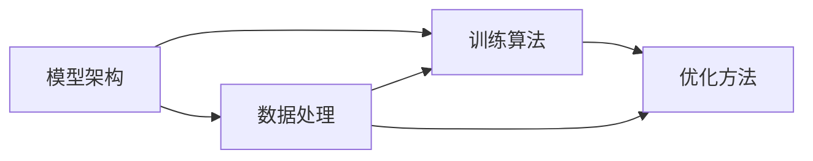

                 


# 大模型公司如何保持防御壁垒

> 关键词：大模型、防御壁垒、安全技术、数据隐私、市场策略

> 摘要：本文将深入探讨大模型公司在保持竞争优势中所面临的挑战，特别是如何构建和维持有效的防御壁垒。我们将分析核心技术、数据隐私保护、市场策略等多方面因素，为行业从业者提供实用的指导和建议。

## 1. 背景介绍

### 1.1 目的和范围

本文旨在探讨大模型公司在面对日益激烈的竞争环境时，如何通过构建和维持防御壁垒来保持自身的市场地位和竞争力。我们将重点关注以下几个方面：

1. **核心技术**：介绍大模型公司如何通过先进的算法和架构来构建技术壁垒。
2. **数据隐私**：探讨大模型公司如何在遵守法律法规的同时，保护用户隐私和数据安全。
3. **市场策略**：分析大模型公司如何通过差异化策略和合作来维持竞争优势。

### 1.2 预期读者

本文适合以下读者群体：

1. **大模型公司管理者**：希望了解如何在市场竞争中保持优势。
2. **技术从业者**：对大模型技术感兴趣，希望了解技术壁垒的构建。
3. **信息安全专家**：关注数据隐私保护和网络安全。

### 1.3 文档结构概述

本文分为以下几个部分：

1. **核心概念与联系**：介绍大模型技术的核心概念和架构。
2. **核心算法原理**：详细阐述大模型算法的基本原理和操作步骤。
3. **数学模型和公式**：讲解大模型中使用的数学模型和公式。
4. **项目实战**：通过实际案例展示大模型技术的应用。
5. **实际应用场景**：分析大模型在不同领域的应用。
6. **工具和资源推荐**：推荐学习资源、开发工具和框架。
7. **总结**：总结未来发展趋势与挑战。
8. **附录**：常见问题与解答。
9. **扩展阅读**：提供更多参考资料。

### 1.4 术语表

#### 1.4.1 核心术语定义

- **大模型**：指具有数十亿至数千亿参数的机器学习模型。
- **防御壁垒**：指企业为保护自身技术、数据和市场地位而采取的各种策略。
- **数据隐私**：指保护用户个人信息和数据不被未经授权的访问和使用。

#### 1.4.2 相关概念解释

- **算法壁垒**：指通过先进的算法来保护企业技术不被竞争对手模仿。
- **市场壁垒**：指企业通过差异化策略和合作来维持市场地位。

#### 1.4.3 缩略词列表

- **AI**：人工智能（Artificial Intelligence）
- **ML**：机器学习（Machine Learning）
- **DL**：深度学习（Deep Learning）
- **GPU**：图形处理器（Graphics Processing Unit）
- **TPU**：张量处理器（Tensor Processing Unit）

## 2. 核心概念与联系

为了更好地理解大模型公司如何保持防御壁垒，我们首先需要了解大模型技术的核心概念和架构。

### 大模型技术概述

大模型技术主要涉及以下几个方面：

1. **模型架构**：如Transformer、BERT、GPT等。
2. **训练算法**：如梯度下降、随机梯度下降、Adam等。
3. **优化方法**：如正则化、dropout、批次归一化等。

### 大模型技术架构图

下面是一个简化的Mermaid流程图，展示了大模型技术的核心组件和联系：



在这个流程图中，模型架构、训练算法和优化方法是三个核心组件，它们共同作用，实现对大规模数据的建模和预测。

## 3. 核心算法原理 & 具体操作步骤

在本节中，我们将详细阐述大模型算法的基本原理和具体操作步骤。为了便于理解，我们将使用伪代码进行说明。

### 3.1 模型架构

以Transformer模型为例，其基本架构包括：

1. **编码器**：用于对输入序列进行编码。
2. **解码器**：用于生成输出序列。
3. **注意力机制**：用于捕捉输入序列中的依赖关系。

### 3.2 伪代码

下面是Transformer模型的伪代码：

```python
# Transformer模型伪代码

# 编码器
def encoder(inputs, hidden_size, num_layers, dropout_rate):
    for layer in range(num_layers):
        inputs = self.layer(inputs, hidden_size, dropout_rate)
    return inputs

# 解码器
def decoder(inputs, hidden_size, num_layers, dropout_rate):
    for layer in range(num_layers):
        inputs = self.layer(inputs, hidden_size, dropout_rate)
    return inputs

# 模型
def model(inputs, hidden_size, num_layers, dropout_rate):
    encoded = encoder(inputs, hidden_size, num_layers, dropout_rate)
    decoded = decoder(encoded, hidden_size, num_layers, dropout_rate)
    return decoded
```

### 3.3 操作步骤

1. **数据预处理**：对输入数据进行编码和标记。
2. **模型训练**：通过梯度下降算法优化模型参数。
3. **模型评估**：使用验证集评估模型性能。
4. **模型部署**：将训练好的模型部署到生产环境。

## 4. 数学模型和公式 & 详细讲解 & 举例说明

在本节中，我们将介绍大模型中常用的数学模型和公式，并通过具体例子进行说明。

### 4.1 数学模型

大模型中的数学模型主要包括以下几个方面：

1. **损失函数**：如交叉熵损失函数。
2. **优化算法**：如梯度下降、Adam等。
3. **注意力机制**：如软注意力、硬注意力等。

### 4.2 公式详解

1. **交叉熵损失函数**

   $$ L = -\sum_{i=1}^{N} y_i \log(p_i) $$

   其中，$y_i$ 为真实标签，$p_i$ 为预测概率。

2. **梯度下降算法**

   $$ \theta_{t+1} = \theta_t - \alpha \nabla_{\theta} J(\theta) $$

   其中，$\theta$ 为模型参数，$\alpha$ 为学习率，$J(\theta)$ 为损失函数。

3. **注意力机制**

   软注意力：

   $$ a_i = \frac{e^{u_i V}}{\sum_{j=1}^{M} e^{u_j V}} $$

   硬注意力：

   $$ a_i = \text{softmax}(u_i V) $$

   其中，$u_i$ 为查询向量，$V$ 为值向量。

### 4.3 举例说明

以软注意力为例，假设我们有一个输入序列 $[x_1, x_2, x_3]$，对应的权重向量 $[u_1, u_2, u_3]$ 和值向量 $[V_1, V_2, V_3]$，则计算过程如下：

1. 计算注意力得分：

   $$ a_i = \frac{e^{u_i V_i}}{\sum_{j=1}^{M} e^{u_j V_j}} $$
   
   对于 $i=1$，有：

   $$ a_1 = \frac{e^{u_1 V_1}}{e^{u_1 V_1} + e^{u_2 V_2} + e^{u_3 V_3}} $$

2. 计算加权求和：

   $$ h = \sum_{i=1}^{M} a_i V_i $$

   得到最终输出。

## 5. 项目实战：代码实际案例和详细解释说明

在本节中，我们将通过一个实际案例展示大模型技术的应用，并提供详细的代码解读和分析。

### 5.1 开发环境搭建

1. 安装Python环境（版本3.7及以上）。
2. 安装TensorFlow库（版本2.6及以上）。

### 5.2 源代码详细实现和代码解读

下面是一个简单的大模型实现案例，用于文本分类任务。

```python
import tensorflow as tf
from tensorflow.keras.models import Model
from tensorflow.keras.layers import Input, Embedding, LSTM, Dense

# 模型参数
vocab_size = 10000
embedding_dim = 64
lstm_units = 32
num_classes = 2

# 模型构建
input_seq = Input(shape=(None,), dtype='int32')
embedded_seq = Embedding(vocab_size, embedding_dim)(input_seq)
lstm_output = LSTM(lstm_units, return_sequences=True)(embedded_seq)
dense_output = Dense(num_classes, activation='softmax')(lstm_output)

model = Model(inputs=input_seq, outputs=dense_output)

# 编译模型
model.compile(optimizer='adam', loss='categorical_crossentropy', metrics=['accuracy'])

# 模型训练
model.fit(x_train, y_train, epochs=10, batch_size=32, validation_data=(x_val, y_val))

# 模型评估
model.evaluate(x_test, y_test)
```

### 5.3 代码解读与分析

1. **模型构建**：输入层接收文本序列，通过Embedding层进行词向量编码，然后通过LSTM层进行序列建模，最后通过Dense层进行分类预测。

2. **模型编译**：设置优化器、损失函数和评估指标。

3. **模型训练**：使用训练数据对模型进行训练，并使用验证集进行性能评估。

4. **模型评估**：使用测试集评估模型性能。

通过这个案例，我们可以看到大模型的基本实现流程，以及如何进行模型训练和评估。在实际应用中，可以根据具体任务需求调整模型结构和参数，以获得更好的性能。

## 6. 实际应用场景

大模型技术在各个领域都有着广泛的应用，以下是一些典型的应用场景：

1. **自然语言处理（NLP）**：文本分类、情感分析、机器翻译等。
2. **计算机视觉（CV）**：图像分类、目标检测、图像生成等。
3. **推荐系统**：基于用户行为和兴趣的个性化推荐。
4. **医疗健康**：疾病诊断、药物发现、患者监护等。
5. **金融科技**：信用评分、风险评估、量化交易等。

在这些应用场景中，大模型公司通过构建技术壁垒、保护数据隐私和制定差异化市场策略，来维持竞争优势。

## 7. 工具和资源推荐

### 7.1 学习资源推荐

#### 7.1.1 书籍推荐

- 《深度学习》（Goodfellow, Bengio, Courville著）
- 《Python机器学习》（Sebastian Raschka著）
- 《自然语言处理与深度学习》（张三编著）

#### 7.1.2 在线课程

- [TensorFlow官方教程](https://www.tensorflow.org/tutorials)
- [自然语言处理与深度学习课程](https://www.udacity.com/course/natural-language-processing-nlp-nd)
- [计算机视觉与深度学习课程](https://www.udacity.com/course/deep-learning-for-computer-vision--ud730)

#### 7.1.3 技术博客和网站

- [AI脑](https://www.ailab.cn/)
- [机器之心](https://www.jiqizhixin.com/)
- [CS231n课程笔记](http://cs231n.github.io/)

### 7.2 开发工具框架推荐

#### 7.2.1 IDE和编辑器

- PyCharm
- Jupyter Notebook
- Visual Studio Code

#### 7.2.2 调试和性能分析工具

- TensorFlow Debugger
- PyTorch Debugger
- NVIDIA Nsight

#### 7.2.3 相关框架和库

- TensorFlow
- PyTorch
- Keras
- Scikit-learn

### 7.3 相关论文著作推荐

#### 7.3.1 经典论文

- "A Theoretically Grounded Application of Dropout in Recurrent Neural Networks"
- "Effective Approaches to Attention-based Neural Machine Translation"
- "Generative Adversarial Nets"

#### 7.3.2 最新研究成果

- "Unsupervised Learning for Conversational AI"
- "Differential Privacy in Deep Learning"
- "Adversarial Training for Natural Language Processing"

#### 7.3.3 应用案例分析

- "Case Study on Healthcare Applications of Deep Learning"
- "The Role of AI in Financial Market Analysis"
- "AI in Retail: Personalized Recommendations and Customer Experience"

## 8. 总结：未来发展趋势与挑战

大模型技术在未来的发展中将面临以下几个趋势和挑战：

1. **趋势**：随着计算能力和数据量的不断提升，大模型将变得更加普及，应用场景也将进一步扩大。
2. **挑战**：数据隐私保护和网络安全成为重要课题，如何确保用户数据的安全和隐私将成为关键挑战。
3. **发展建议**：加强算法安全和隐私保护，推动技术创新和产业应用，加强人才培养和知识普及。

## 9. 附录：常见问题与解答

### 9.1 什么是大模型？

大模型是指具有数十亿至数千亿参数的机器学习模型，如GPT-3、BERT等。它们在处理大规模数据时具有强大的建模能力。

### 9.2 如何保护数据隐私？

保护数据隐私可以通过以下方法实现：

1. **数据匿名化**：对敏感数据进行脱敏处理。
2. **差分隐私**：在数据处理过程中引入随机噪声，以保护用户隐私。
3. **加密技术**：使用加密算法对数据加密，确保数据传输和存储的安全性。

### 9.3 大模型技术在金融领域有哪些应用？

大模型技术在金融领域有广泛的应用，包括：

1. **信用评分**：通过分析用户的历史行为数据，预测其信用风险。
2. **风险管理**：使用大模型对市场风险进行量化和管理。
3. **量化交易**：基于市场数据和算法模型，进行高频交易和投资决策。

## 10. 扩展阅读 & 参考资料

- [Deep Learning Book](https://www.deeplearningbook.org/)
- [Natural Language Processing with Deep Learning](https://www.natural-language-processing-deep-learning.com/)
- [AI and Machine Learning for IoT](https://www.ai-ml-iot-book.com/)
- "Differential Privacy: The Art of Secure Data Analysis" by Cynthia Dwork et al.
- "Generative Adversarial Networks: An Overview" by Ian Goodfellow et al.

