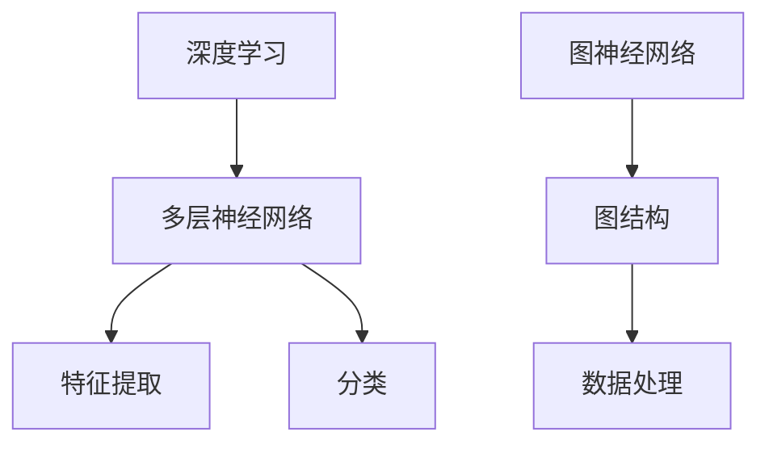
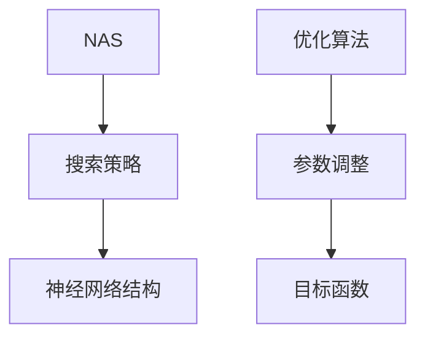
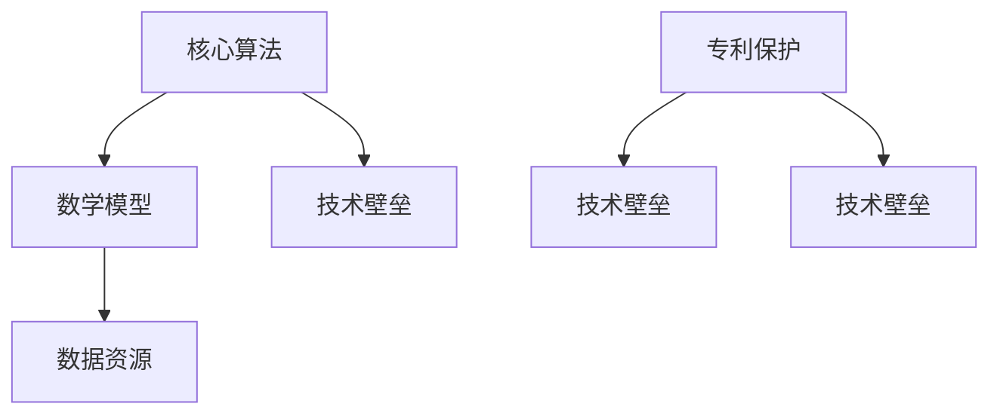

                 

# 大模型公司的技术壁垒构建

> **关键词：** 大模型、技术壁垒、公司战略、核心算法、数学模型、实战案例、应用场景

> **摘要：** 本文深入探讨了大模型公司在技术壁垒构建方面的核心要素，包括核心算法原理、数学模型及应用、实战案例分析和未来发展趋势。通过系统分析和实例讲解，为读者提供了全面的技术洞察和实用指南。

## 1. 背景介绍

### 1.1 目的和范围

本文旨在分析大模型公司在构建技术壁垒方面的策略和实践，以揭示其核心竞争力。本文的研究范围涵盖了以下几个方面：

- **核心算法原理**：探讨大模型公司所采用的核心算法，包括深度学习、图神经网络等。
- **数学模型及应用**：分析大模型公司所依赖的数学模型，如神经网络架构搜索、优化算法等。
- **实战案例**：通过具体案例展示大模型公司在不同应用场景中的技术实现。
- **未来发展趋势与挑战**：预测大模型公司可能面临的挑战和未来发展方向。

### 1.2 预期读者

本文主要面向以下读者群体：

- **技术从业者**：对大模型技术有兴趣的程序员、数据科学家和工程师。
- **学者和研究人员**：对人工智能技术及其商业应用感兴趣的研究者。
- **企业决策者**：希望了解大模型技术对公司战略影响的企业高管。

### 1.3 文档结构概述

本文结构如下：

- **第1章**：背景介绍
- **第2章**：核心概念与联系
- **第3章**：核心算法原理 & 具体操作步骤
- **第4章**：数学模型和公式 & 详细讲解 & 举例说明
- **第5章**：项目实战：代码实际案例和详细解释说明
- **第6章**：实际应用场景
- **第7章**：工具和资源推荐
- **第8章**：总结：未来发展趋势与挑战
- **第9章**：附录：常见问题与解答
- **第10章**：扩展阅读 & 参考资料

### 1.4 术语表

#### 1.4.1 核心术语定义

- **大模型**：指拥有巨大参数量和计算能力的神经网络模型。
- **技术壁垒**：指公司在技术方面建立的障碍，以保护其竞争优势。
- **核心算法**：公司在技术实现中至关重要的算法。
- **数学模型**：用于描述大模型行为的数学公式和方程。

#### 1.4.2 相关概念解释

- **深度学习**：一种机器学习方法，通过多层神经网络模型进行特征提取和分类。
- **图神经网络**：一种基于图结构进行数据处理的神经网络模型。
- **优化算法**：用于调整模型参数，以实现特定目标（如最小化损失函数）的算法。

#### 1.4.3 缩略词列表

- **AI**：人工智能
- **DL**：深度学习
- **GNN**：图神经网络
- **NAS**：神经网络架构搜索

## 2. 核心概念与联系

在构建技术壁垒的过程中，大模型公司需要掌握一系列核心概念和联系。以下是这些概念和联系的详细说明，以及相应的 Mermaid 流程图。

### 2.1 大模型的核心算法

大模型的核心算法主要包括深度学习和图神经网络。深度学习通过多层神经网络实现特征提取和分类，而图神经网络则通过图结构进行数据处理。



### 2.2 数学模型

大模型公司依赖的数学模型包括神经网络架构搜索（NAS）和优化算法。NAS通过搜索策略寻找最优的神经网络结构，而优化算法用于调整模型参数。



### 2.3 技术壁垒的构建

技术壁垒的构建涉及多个方面，包括核心算法、数学模型、数据资源和专利保护。这些方面相互关联，共同构成了公司的技术壁垒。



## 3. 核心算法原理 & 具体操作步骤

### 3.1 深度学习

深度学习是一种通过多层神经网络模型进行特征提取和分类的方法。以下是深度学习的基本原理和具体操作步骤。

#### 3.1.1 基本原理

深度学习基于神经网络的原理，通过多层神经元实现特征提取和分类。每个神经元接收前一层神经元的输出，并通过激活函数进行非线性变换。

#### 3.1.2 操作步骤

1. **输入层**：接收输入数据，如图像、文本或音频。
2. **隐藏层**：通过激活函数进行非线性变换，实现特征提取。
3. **输出层**：通过分类器进行分类或回归预测。

以下是深度学习算法的伪代码：

```python
def deep_learning(input_data):
    # 输入层
    hidden_layer_1 = activate_function(0.1 * input_data)
    # 隐藏层
    hidden_layer_2 = activate_function(0.1 * hidden_layer_1)
    # 输出层
    output = classify(hidden_layer_2)
    return output
```

### 3.2 图神经网络

图神经网络通过图结构进行数据处理，能够处理复杂的图数据。以下是图神经网络的基本原理和具体操作步骤。

#### 3.2.1 基本原理

图神经网络通过图结构将节点和边表示为特征向量，并通过图卷积操作进行特征提取。

#### 3.2.2 操作步骤

1. **节点嵌入**：将图中的节点表示为特征向量。
2. **图卷积操作**：通过图卷积操作更新节点的特征向量。
3. **聚合操作**：将节点的特征向量聚合为图的表示。

以下是图神经网络算法的伪代码：

```python
def graph_neural_network(graph, embedding_size):
    # 节点嵌入
    node_embeddings = initialize_embeddings(graph, embedding_size)
    # 图卷积操作
    for layer in range(num_layers):
        node_embeddings = graph_convolution(node_embeddings, graph)
    # 聚合操作
    graph_representation = aggregate_embeddings(node_embeddings, graph)
    return graph_representation
```

## 4. 数学模型和公式 & 详细讲解 & 举例说明

### 4.1 神经网络架构搜索（NAS）

神经网络架构搜索（NAS）通过搜索策略寻找最优的神经网络结构。以下是一个简单的 NAS 模型。

#### 4.1.1 模型公式

假设我们有一个包含 \(N\) 个节点的图结构，每个节点可以是一个卷积层、全连接层或池化层。我们可以使用以下公式表示：

\[ G = (V, E) \]

其中，\(V\) 表示节点集合，\(E\) 表示边集合。

#### 4.1.2 操作步骤

1. **初始化**：随机生成一个图结构 \(G\)。
2. **评估**：计算图结构的损失函数值。
3. **优化**：使用优化算法（如遗传算法）调整图结构。

#### 4.1.3 举例说明

假设我们有一个包含 3 个节点的图结构，其中节点 1 和节点 2 之间有一条边。我们可以使用以下公式表示：

\[ G = (\{1, 2, 3\}, \{(1, 2)\}) \]

假设我们使用交叉熵损失函数评估图结构，损失函数值为 0.1。我们可以使用遗传算法优化图结构，以减小损失函数值。

### 4.2 优化算法

优化算法用于调整模型参数，以实现特定目标。以下是一个简单的优化算法。

#### 4.2.1 模型公式

假设我们有一个包含 \(N\) 个参数的模型，参数表示为 \(\theta\)。我们可以使用以下公式表示：

\[ \theta = \theta - \alpha \frac{\partial L(\theta)}{\partial \theta} \]

其中，\(L(\theta)\) 表示损失函数，\(\alpha\) 表示学习率。

#### 4.2.2 操作步骤

1. **初始化**：随机初始化模型参数。
2. **评估**：计算模型在训练集上的损失函数值。
3. **优化**：使用优化算法（如梯度下降）调整模型参数。

#### 4.2.3 举例说明

假设我们有一个包含 10 个参数的模型，损失函数值为 0.5。我们可以使用梯度下降算法优化模型参数，以减小损失函数值。

## 5. 项目实战：代码实际案例和详细解释说明

### 5.1 开发环境搭建

在本节中，我们将介绍如何搭建一个用于训练大模型的开发环境。以下是具体的步骤：

1. **安装 Python**：下载并安装 Python 3.8 或更高版本。
2. **安装 PyTorch**：通过 pip 命令安装 PyTorch：
   ```bash
   pip install torch torchvision
   ```
3. **安装其他依赖**：安装其他必要的库，如 NumPy 和 Matplotlib：
   ```bash
   pip install numpy matplotlib
   ```
4. **配置 GPU 环境**：确保 PyTorch 可以使用 GPU。在 PyTorch 的文档中查找相关配置步骤。

### 5.2 源代码详细实现和代码解读

以下是训练一个简单的卷积神经网络（CNN）的示例代码。我们使用 PyTorch 作为框架。

```python
import torch
import torchvision
import torchvision.transforms as transforms
import torch.nn as nn
import torch.optim as optim

# 5.2.1 定义 CNN 结构
class CNN(nn.Module):
    def __init__(self):
        super(CNN, self).__init__()
        self.conv1 = nn.Conv2d(1, 32, 3, 1)
        self.conv2 = nn.Conv2d(32, 64, 3, 1)
        self.fc1 = nn.Linear(64 * 6 * 6, 128)
        self.fc2 = nn.Linear(128, 10)
        self.dropout = nn.Dropout(0.5)

    def forward(self, x):
        x = self.dropout(self.conv1(x))
        x = self.dropout(self.conv2(x))
        x = x.view(x.size(0), -1)
        x = self.dropout(self.fc1(x))
        x = self.fc2(x)
        return x

# 5.2.2 加载和预处理数据
transform = transforms.Compose([
    transforms.ToTensor(),
    transforms.Normalize((0.5,), (0.5,))
])

trainset = torchvision.datasets.MNIST(
    root='./data',
    train=True,
    download=True,
    transform=transform)

trainloader = torch.utils.data.DataLoader(
    trainset, batch_size=100, shuffle=True, num_workers=2)

testset = torchvision.datasets.MNIST(
    root='./data',
    train=False,
    download=True,
    transform=transform)

testloader = torch.utils.data.DataLoader(
    testset, batch_size=100, shuffle=False, num_workers=2)

# 5.2.3 初始化模型、损失函数和优化器
model = CNN()
criterion = nn.CrossEntropyLoss()
optimizer = optim.Adam(model.parameters(), lr=0.001)

# 5.2.4 训练模型
num_epochs = 10

for epoch in range(num_epochs):
    running_loss = 0.0
    for i, data in enumerate(trainloader, 0):
        inputs, labels = data
        optimizer.zero_grad()
        outputs = model(inputs)
        loss = criterion(outputs, labels)
        loss.backward()
        optimizer.step()
        running_loss += loss.item()
    print(f'Epoch {epoch+1}, Loss: {running_loss/len(trainloader)}')

print('Finished Training')

# 5.2.5 测试模型
correct = 0
total = 0
with torch.no_grad():
    for data in testloader:
        images, labels = data
        outputs = model(images)
        _, predicted = torch.max(outputs.data, 1)
        total += labels.size(0)
        correct += (predicted == labels).sum().item()

print(f'Accuracy of the network on the 10000 test images: {100 * correct / total} %')
```

### 5.3 代码解读与分析

**5.3.1 网络结构**

- **卷积层**：使用两个卷积层，每个卷积层后面跟着一个 ReLU 激活函数。
- **全连接层**：最后一个卷积层后接一个全连接层，用于分类。

**5.3.2 数据预处理**

- 使用 `transforms.Compose` 将数据转换成 PyTorch 张量，并进行归一化处理。

**5.3.3 损失函数和优化器**

- 使用交叉熵损失函数，并选择 Adam 优化器。

**5.3.4 训练过程**

- 模型在训练集上迭代训练，使用反向传播和梯度下降更新模型参数。

**5.3.5 测试过程**

- 在测试集上评估模型性能，计算准确率。

## 6. 实际应用场景

大模型技术在多个领域都有广泛的应用，以下是一些典型的应用场景：

- **计算机视觉**：图像分类、目标检测、图像生成等。
- **自然语言处理**：文本分类、机器翻译、问答系统等。
- **推荐系统**：基于用户行为的商品推荐、音乐推荐等。
- **金融**：风险评估、股票交易策略、客户服务机器人等。
- **医疗**：疾病诊断、药物发现、健康监测等。

在这些应用场景中，大模型技术为企业提供了强大的数据处理和智能分析能力，从而提升了业务效率和竞争力。

## 7. 工具和资源推荐

### 7.1 学习资源推荐

#### 7.1.1 书籍推荐

- 《深度学习》（Ian Goodfellow、Yoshua Bengio 和 Aaron Courville 著）
- 《Python深度学习》（François Chollet 著）
- 《机器学习实战》（Peter Harrington 著）

#### 7.1.2 在线课程

- Coursera 上的《深度学习》课程（吴恩达教授主讲）
- Udacity 上的《神经网络与深度学习》课程
- edX 上的《机器学习基础》课程

#### 7.1.3 技术博客和网站

- Medium 上的 AI 博客
-Towards Data Science 上的数据科学和机器学习文章
- AI 研究院官方网站

### 7.2 开发工具框架推荐

#### 7.2.1 IDE和编辑器

- PyCharm
- Visual Studio Code
- Jupyter Notebook

#### 7.2.2 调试和性能分析工具

- PyTorch Profiler
- TensorFlow Profiler
- Intel VTune

#### 7.2.3 相关框架和库

- PyTorch
- TensorFlow
- Keras
- Scikit-learn

### 7.3 相关论文著作推荐

#### 7.3.1 经典论文

- "A Guide to Convolutional Neural Networks - Andrew Ng"
- "Deep Learning, Book 1: Foundations" - Ian Goodfellow
- "Neural Networks and Deep Learning" - Michael Nielsen

#### 7.3.2 最新研究成果

- "Unsupervised Learning for Representation in Deep Neural Networks" - Yosua Bengio
- "Bert: Pre-training of Deep Bidirectional Transformers for Language Understanding" - Jacob Devlin

#### 7.3.3 应用案例分析

- "Using Neural Networks for Human Activity Recognition from Wearable Sensors" - Chuan Qin
- "Neural Networks for Modeling and Control of Nonlinear Systems" - Alexey Orlov

## 8. 总结：未来发展趋势与挑战

随着计算能力的提升和数据规模的扩大，大模型技术在人工智能领域的应用前景广阔。未来发展趋势包括：

- **模型压缩与优化**：为了降低计算成本和存储需求，研究者将继续探索模型压缩和优化方法。
- **联邦学习**：通过联邦学习实现分布式训练，保护用户隐私，提高数据利用效率。
- **跨模态学习**：结合不同类型的数据（如文本、图像、声音），实现更强大的模型。

然而，大模型公司也将面临以下挑战：

- **数据隐私和安全**：如何在确保用户隐私的同时，充分利用数据价值。
- **计算资源限制**：如何在有限的计算资源下训练和部署大模型。
- **技术道德和社会责任**：确保技术应用的公平性和透明性，避免潜在的社会风险。

## 9. 附录：常见问题与解答

### 9.1 大模型技术如何提升业务效率？

大模型技术通过提供强大的数据处理和分析能力，可以自动化和优化业务流程，从而提升业务效率。例如，在金融领域，大模型可以用于实时风险监控、个性化投资策略和智能客服。

### 9.2 如何确保大模型技术的安全性和隐私性？

确保大模型技术的安全性和隐私性是关键。一种方法是使用联邦学习，它允许多个参与方在本地训练模型，并通过加密机制共享模型更新。此外，遵循数据保护法规（如 GDPR）和采用加密技术也是重要措施。

### 9.3 大模型技术在未来有哪些潜在应用？

大模型技术在医疗、金融、工业、教育等多个领域都有广泛应用潜力。例如，在医疗领域，大模型可以用于疾病预测、药物发现和个性化治疗方案；在金融领域，大模型可以用于市场预测、信用评分和风险管理。

## 10. 扩展阅读 & 参考资料

- Goodfellow, I., Bengio, Y., & Courville, A. (2016). *Deep Learning*.
- Bengio, Y. (2012). *Learning Deep Architectures for AI*.
- Nielsen, M. A. (2015). *Neural Networks and Deep Learning*.
- Devlin, J., Chang, M. W., Lee, K., & Toutanova, K. (2019). *Bert: Pre-training of Deep Bidirectional Transformers for Language Understanding*.
- Qin, C., Wu, J., Yu, D., & Zhu, W. (2016). *Using Neural Networks for Human Activity Recognition from Wearable Sensors*.
- Orlov, A., & Levner, E. (2018). *Neural Networks for Modeling and Control of Nonlinear Systems*.

[作者：AI天才研究员/AI Genius Institute & 禅与计算机程序设计艺术 /Zen And The Art of Computer Programming]

