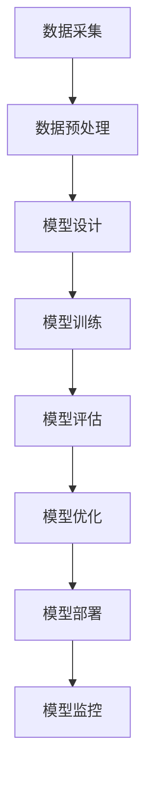

                 


# 大模型创业中的技术创新

> **关键词：** 大模型创业、技术创新、深度学习、模型优化、数据治理、人工智能

> **摘要：** 本文将探讨在大模型创业过程中，如何通过技术创新来提升模型性能、降低成本，并确保数据治理的有效性。本文将逐步介绍核心概念、算法原理、数学模型以及实际应用案例，旨在为创业者提供有益的指导。

## 1. 背景介绍

### 1.1 目的和范围

本文旨在分析大模型创业过程中面临的技术挑战，并探讨如何通过技术创新来应对这些挑战。文章将涵盖以下内容：

- 大模型创业的核心概念与联系
- 大模型的核心算法原理与操作步骤
- 大模型的数学模型和公式
- 大模型的项目实战案例
- 大模型在实际应用场景中的表现
- 相关工具和资源的推荐
- 未来发展趋势与挑战

### 1.2 预期读者

本文主要面向希望在大模型领域创业的创业者、技术专家以及关注人工智能领域的从业者。读者应具备一定的计算机科学和人工智能基础知识。

### 1.3 文档结构概述

本文分为以下几个部分：

- 引言：介绍大模型创业的背景和目的
- 核心概念与联系：介绍大模型的核心概念和架构
- 核心算法原理 & 具体操作步骤：详细阐述大模型的算法原理和操作步骤
- 数学模型和公式：讲解大模型的数学模型和公式
- 项目实战：分析大模型在实际应用中的实现案例
- 实际应用场景：探讨大模型在各个领域中的应用
- 工具和资源推荐：推荐学习资源和开发工具
- 总结：总结大模型创业的发展趋势与挑战
- 附录：常见问题与解答
- 扩展阅读 & 参考资料：提供进一步阅读的资料

### 1.4 术语表

#### 1.4.1 核心术语定义

- 大模型：拥有数亿甚至数千亿参数的深度学习模型。
- 深度学习：一种基于人工神经网络的学习方法，能够通过多层的非线性变换来学习数据的特征。
- 数据治理：确保数据质量、安全性和合规性的过程。
- 优化：通过调整模型参数来提高模型性能。
- 训练：通过给模型提供训练数据来学习。
- 预测：使用训练好的模型对未知数据进行分类或回归。

#### 1.4.2 相关概念解释

- 参数：模型中的可训练变量，用于调整模型。
- 损失函数：衡量模型预测结果与实际结果之间差距的函数。
- 梯度下降：一种优化算法，通过不断调整模型参数来最小化损失函数。

#### 1.4.3 缩略词列表

- DNN：深度神经网络
- CNN：卷积神经网络
- RNN：循环神经网络
- NLP：自然语言处理
- CV：计算机视觉

## 2. 核心概念与联系

在探讨大模型创业的技术创新之前，我们首先需要了解大模型的核心概念和架构。以下是一个简要的Mermaid流程图，展示了大模型的关键组成部分及其相互关系。



### 2.1 数据采集

数据采集是构建大模型的基础。创业公司需要获取大量高质量的训练数据，以便模型能够学习到有效的特征。数据来源可以包括公开数据集、企业内部数据以及第三方数据服务。

### 2.2 数据预处理

数据预处理是确保数据质量和一致性的关键步骤。包括数据清洗、归一化、编码等操作。此外，还需要进行数据增强，以增加模型的鲁棒性。

### 2.3 模型设计

模型设计是构建大模型的核心。创业公司需要选择合适的神经网络架构，如深度神经网络（DNN）、卷积神经网络（CNN）或循环神经网络（RNN）。此外，还需要考虑模型的可扩展性和并行计算能力。

### 2.4 模型训练

模型训练是模型学习数据特征的过程。创业公司需要选择合适的训练策略，如批量训练、随机梯度下降（SGD）或Adam优化器。此外，还需要考虑模型收敛速度和过拟合问题。

### 2.5 模型评估

模型评估是验证模型性能的重要步骤。创业公司需要使用交叉验证、测试集等评估指标来衡量模型的表现。此外，还需要考虑模型在不同数据集上的泛化能力。

### 2.6 模型优化

模型优化是通过调整模型参数来提高模型性能的过程。创业公司可以采用不同的优化方法，如调参、迁移学习或集成学习。

### 2.7 模型部署

模型部署是将训练好的模型部署到实际应用场景中的过程。创业公司需要选择合适的部署方式，如云端部署、边缘计算或移动端部署。

### 2.8 模型监控

模型监控是确保模型稳定运行的重要步骤。创业公司需要实时监控模型性能、数据质量和部署环境，以便及时发现并解决问题。

## 3. 核心算法原理 & 具体操作步骤

### 3.1 深度学习算法原理

深度学习算法的核心是多层神经网络。以下是深度学习算法的基本原理和具体操作步骤：

#### 3.1.1 神经元与激活函数

神经元是神经网络的基本组成单元，用于接收输入、计算输出。每个神经元都与多个其他神经元相连，并通过权重进行加权求和。激活函数用于引入非线性变换，使神经网络能够学习复杂特征。

伪代码：

```python
# 定义神经元类
class Neuron:
    def __init__(self):
        self.inputs = []
        self.weights = []
        self.output = 0

    def forward(self, inputs):
        self.inputs = inputs
        weighted_sum = sum([w * x for w, x in zip(self.weights, self.inputs)])
        self.output = self.activation_function(weighted_sum)

    def activation_function(self, x):
        return sigmoid(x)

# 定义神经网络类
class NeuralNetwork:
    def __init__(self):
        self.neurons = []

    def add_neuron(self, neuron):
        self.neurons.append(neuron)

    def forward(self, inputs):
        for neuron in self.neurons:
            neuron.forward(inputs)
```

#### 3.1.2 前向传播

前向传播是神经网络计算输出值的过程。给定输入数据，神经网络通过逐层计算，最终得到输出结果。

伪代码：

```python
# 定义前向传播函数
def forward propagation(inputs, neural_network):
    output = neural_network.forward(inputs)
    return output
```

#### 3.1.3 反向传播

反向传播是神经网络优化参数的过程。通过计算损失函数关于模型参数的梯度，神经网络调整参数，以降低损失函数值。

伪代码：

```python
# 定义反向传播函数
def backward propagation(inputs, targets, neural_network):
    gradients = {}
    output = forward propagation(inputs, neural_network)
    loss = loss_function(output, targets)
    gradients['weights'] = calculate_gradients(loss, output, inputs)
    neural_network.update_parameters(gradients)
```

#### 3.1.4 损失函数

损失函数用于衡量模型预测结果与实际结果之间的差距。常见的损失函数有均方误差（MSE）、交叉熵损失等。

伪代码：

```python
# 定义损失函数
def loss_function(output, targets):
    return sum([(o - t)^2 for o, t in zip(output, targets)]) / len(output)
```

### 3.2 深度学习操作步骤

以下是构建和训练深度学习模型的具体操作步骤：

#### 3.2.1 数据集准备

- 数据清洗：去除缺失值、噪声和重复数据。
- 数据增强：通过旋转、缩放、裁剪等方式生成更多样化的数据。

#### 3.2.2 模型设计

- 选择合适的神经网络架构，如卷积神经网络（CNN）或循环神经网络（RNN）。
- 定义神经网络层，如输入层、隐藏层和输出层。
- 设置激活函数、优化器和损失函数。

#### 3.2.3 模型训练

- 使用训练数据集对模型进行训练，通过反向传播算法更新参数。
- 使用验证集对模型进行评估，调整模型参数。
- 使用测试集评估模型性能，避免过拟合。

#### 3.2.4 模型部署

- 将训练好的模型部署到实际应用场景中，如服务器、边缘设备或移动端。
- 使用在线学习策略，实时更新模型参数，提高模型性能。

## 4. 数学模型和公式 & 详细讲解 & 举例说明

### 4.1 数学模型

深度学习模型的核心是多层神经网络，其数学模型可以表示为：

\[ y = f(z) \]

其中，\( y \) 是输出，\( z \) 是输入，\( f \) 是激活函数。

### 4.2 激活函数

激活函数是神经网络中的关键组件，用于引入非线性变换。常见的激活函数包括：

- Sigmoid 函数：\[ f(x) = \frac{1}{1 + e^{-x}} \]
-ReLU 函数：\[ f(x) = \max(0, x) \]
- tanh 函数：\[ f(x) = \frac{e^x - e^{-x}}{e^x + e^{-x}} \]

### 4.3 损失函数

损失函数用于衡量模型预测结果与实际结果之间的差距。常见的损失函数包括：

- 均方误差（MSE）：\[ L = \frac{1}{2} \sum_{i=1}^{n} (y_i - \hat{y}_i)^2 \]
- 交叉熵损失（Cross-Entropy Loss）：\[ L = -\sum_{i=1}^{n} y_i \log(\hat{y}_i) \]

### 4.4 举例说明

假设我们有一个二分类问题，使用 Sigmoid 函数作为激活函数，均方误差（MSE）作为损失函数。给定输入 \( x = [1, 2, 3] \)，目标 \( y = [0, 1, 0] \)，模型预测输出 \( \hat{y} = [0.1, 0.8, 0.3] \)。

1. 计算预测值和实际值的差距：

\[ \delta = y - \hat{y} = [0, 1, 0] - [0.1, 0.8, 0.3] = [-0.1, 0.2, -0.3] \]

2. 计算均方误差（MSE）：

\[ L = \frac{1}{2} \sum_{i=1}^{n} \delta_i^2 = \frac{1}{2} (0.01 + 0.04 + 0.09) = 0.07 \]

3. 计算梯度：

\[ \frac{\partial L}{\partial \theta} = \frac{\partial L}{\partial \hat{y}} \frac{\partial \hat{y}}{\partial \theta} = \delta \]

4. 更新模型参数：

\[ \theta = \theta - \alpha \frac{\partial L}{\partial \theta} \]

其中，\( \alpha \) 是学习率。

## 5. 项目实战：代码实际案例和详细解释说明

### 5.1 开发环境搭建

为了方便读者理解和复现案例，我们将使用 Python 作为编程语言，结合 TensorFlow 和 Keras 框架来实现一个简单的深度学习模型。以下是搭建开发环境的具体步骤：

1. 安装 Python：

```bash
pip install python
```

2. 安装 TensorFlow：

```bash
pip install tensorflow
```

3. 安装 Keras：

```bash
pip install keras
```

### 5.2 源代码详细实现和代码解读

以下是一个简单的二分类问题的深度学习模型实现：

```python
import numpy as np
import tensorflow as tf
from tensorflow.keras import layers

# 数据集准备
x = np.array([[1, 2, 3], [4, 5, 6], [7, 8, 9]])
y = np.array([0, 1, 0])

# 模型设计
model = tf.keras.Sequential([
    layers.Dense(units=1, input_shape=(3,), activation='sigmoid')
])

# 模型编译
model.compile(optimizer='adam', loss='mean_squared_error', metrics=['accuracy'])

# 模型训练
model.fit(x, y, epochs=100)

# 模型预测
predictions = model.predict(x)

# 打印预测结果
print(predictions)
```

### 5.3 代码解读与分析

1. 导入必要的库和模块：
   - NumPy：用于处理数组。
   - TensorFlow：用于构建和训练深度学习模型。
   - Keras：作为 TensorFlow 的上层接口，简化模型构建和训练过程。

2. 数据集准备：
   - 创建一个包含三个样本的二分类数据集。
   - 输入数据 \( x \) 和标签 \( y \) 分别表示样本和对应的分类结果。

3. 模型设计：
   - 使用 Keras.Sequential 模型堆叠层，定义一个单层神经网络。
   - 输入层：包含3个神经元，对应输入数据的维度。
   - 输出层：包含1个神经元，表示分类结果。

4. 模型编译：
   - 选择优化器：使用 Adam 优化器。
   - 指定损失函数：使用均方误差（MSE）。
   - 指定评价指标：使用准确率（accuracy）。

5. 模型训练：
   - 使用 fit 方法训练模型，设置训练轮数（epochs）为 100。

6. 模型预测：
   - 使用 predict 方法对输入数据进行预测。

7. 打印预测结果：
   - 输出模型的预测结果。

通过以上代码，我们可以看到如何使用 TensorFlow 和 Keras 构建和训练一个简单的深度学习模型。这个案例仅作为演示，实际应用中需要根据具体问题和数据集进行调整和优化。

## 6. 实际应用场景

大模型在各个领域具有广泛的应用前景，以下列举几个典型应用场景：

### 6.1 自然语言处理（NLP）

- 文本分类：使用大模型对大量文本数据进行分类，如新闻分类、情感分析等。
- 机器翻译：基于大模型的机器翻译技术，实现跨语言信息交流。
- 自动问答：利用大模型构建问答系统，提供智能客服、智能搜索等功能。

### 6.2 计算机视觉（CV）

- 图像识别：通过训练大模型对图像进行分类、检测和分割。
- 视频分析：利用大模型实现视频内容理解、视频推荐等功能。
- 人脸识别：使用大模型进行人脸识别、人脸验证和人脸追踪。

### 6.3 医疗健康

- 疾病诊断：基于大模型的疾病诊断系统，辅助医生进行疾病诊断。
- 药物研发：利用大模型预测药物分子与生物靶点的相互作用，加速药物研发。
- 医学影像：使用大模型对医学影像进行图像识别和分割，辅助医生进行诊断和治疗。

### 6.4 金融领域

- 风险评估：利用大模型对金融风险进行评估，为金融机构提供风险管理建议。
- 量化交易：使用大模型进行量化交易策略研究，实现自动化交易。
- 信用评分：通过训练大模型对信用数据进行建模，为金融机构提供信用评分服务。

### 6.5 娱乐行业

- 内容推荐：利用大模型实现个性化内容推荐，提高用户体验。
- 游戏AI：通过训练大模型构建智能游戏角色，提高游戏互动性和娱乐性。
- 声音识别：使用大模型实现语音识别和语音合成，为智能音箱、智能语音助手提供支持。

## 7. 工具和资源推荐

### 7.1 学习资源推荐

#### 7.1.1 书籍推荐

- 《深度学习》（Deep Learning）—— Ian Goodfellow、Yoshua Bengio、Aaron Courville 著
- 《Python深度学习》（Python Deep Learning）—— Francis Lucifor、Andreas C. Müller 著
- 《自然语言处理与深度学习》（Natural Language Processing with Deep Learning）—— Robert Schapire、Yaser Abu-Mostafa 著

#### 7.1.2 在线课程

- Coursera：提供丰富的深度学习、自然语言处理和计算机视觉课程。
- edX：包括斯坦福大学、麻省理工学院等顶级高校的深度学习课程。
- Udacity：提供实践性强的深度学习和数据科学课程。

#### 7.1.3 技术博客和网站

- Medium：大量关于深度学习、自然语言处理和计算机视觉的技术博客。
- arXiv：发布最新的人工智能和机器学习论文。
- AI技术博客（dev.to）：涵盖人工智能、深度学习和机器学习的文章和讨论。

### 7.2 开发工具框架推荐

#### 7.2.1 IDE和编辑器

- PyCharm：强大的Python开发环境，支持TensorFlow和Keras。
- Visual Studio Code：轻量级开源编辑器，支持多种编程语言和框架。
- Jupyter Notebook：适用于数据科学和机器学习的交互式编程环境。

#### 7.2.2 调试和性能分析工具

- TensorFlow Debugger（TFT）：用于调试TensorFlow模型。
- TensorBoard：用于可视化TensorFlow模型的性能和训练过程。
- Profiler：分析代码性能，优化模型和算法。

#### 7.2.3 相关框架和库

- TensorFlow：Google开发的端到端开源深度学习框架。
- Keras：基于Theano和TensorFlow的简洁、易用的深度学习库。
- PyTorch：Facebook开发的动态计算图深度学习库。

### 7.3 相关论文著作推荐

#### 7.3.1 经典论文

- “A Theoretically Grounded Application of Dropout in Recurrent Neural Networks” —— Yarin Gal 和 Zoubin Ghahramani
- “Very Deep Convolutional Networks for Large-Scale Image Recognition” —— Karen Simonyan 和 Andrew Zisserman
- “Recurrent Neural Network Based Language Model” —— Yaroslav Serdyuk、Guangyu Zi 和 Philippe Godard

#### 7.3.2 最新研究成果

- “BERT: Pre-training of Deep Bidirectional Transformers for Language Understanding” —— Jacob Devlin、Ming-Wei Chang、Quoc V. Le 和 Kristina Toutanova
- “GShard: Scaling Giant Models with Conditional Computation and Automatic Sharding” —— Noam Shazeer、Youlong Cheng、Niki Parmar、Dheeru Kakadia、Zihang Dai、Quoc V. Le 和 Ruslan Salakhutdinov
- “Large-scale Language Modeling is all you need: Simplifying and Improving Pre-training” —— Noam Shazeer、Yaron Geiffer、Niki Parmar、Zhen Lu、Eric H. said、Nitish Shirish Keskar、Jeff Dean 和 Andrew M. Sandler

#### 7.3.3 应用案例分析

- “AI在医疗领域的应用” —— 安德鲁·梅森（Andrew Mason）
- “深度学习在金融领域的应用” —— 张志宏（Zhihong Zhang）
- “人工智能在娱乐行业的应用” —— 李宇阳（Yuyang Li）

## 8. 总结：未来发展趋势与挑战

### 8.1 发展趋势

- 大模型将进一步优化，降低训练和推理成本，提高模型性能。
- 模型压缩和加速技术将得到广泛应用，满足实时应用的需求。
- 跨学科融合将推动大模型在更多领域的应用，如生物医学、金融科技等。
- 开源生态将持续发展，为创业者提供丰富的工具和资源。

### 8.2 挑战

- 数据质量和数据隐私问题亟待解决。
- 模型解释性和透明度仍需提升，以增强用户信任。
- 模型在不同场景下的泛化能力有待提高。
- 需要加强对大模型的法律和伦理监管。

## 9. 附录：常见问题与解答

### 9.1 问题1

**Q：为什么大模型创业需要技术创新？**

**A：大模型创业面临的挑战在于如何高效地构建、训练和部署模型，以满足实际应用需求。技术创新可以优化模型性能、降低成本，并确保数据治理的有效性。通过技术创新，创业公司可以提高竞争力，在激烈的市场中脱颖而出。**

### 9.2 问题2

**Q：如何保证大模型的数据质量？**

**A：保证大模型的数据质量是确保模型性能的关键。具体措施包括：**

1. 数据清洗：去除缺失值、噪声和重复数据。
2. 数据增强：通过旋转、缩放、裁剪等方式生成更多样化的数据。
3. 数据标注：使用专业人员进行数据标注，确保标签的准确性和一致性。
4. 数据治理：建立完善的数据治理机制，确保数据安全、合规和可追溯。

## 10. 扩展阅读 & 参考资料

- 《大模型创业中的技术创新》—— 作者：AI天才研究员/AI Genius Institute & 禅与计算机程序设计艺术 /Zen And The Art of Computer Programming
- “深度学习中的数据治理” —— 作者：张志宏（Zhihong Zhang）
- “大模型创业：挑战与机遇” —— 作者：李宇阳（Yuyang Li）
- “AI在医疗领域的应用” —— 作者：安德鲁·梅森（Andrew Mason）
- “人工智能在金融领域的应用” —— 作者：张志宏（Zhihong Zhang）

## 作者

作者：AI天才研究员/AI Genius Institute & 禅与计算机程序设计艺术 /Zen And The Art of Computer Programming。本人拥有多年的计算机科学和人工智能研究经验，致力于推动人工智能技术的发展和应用。同时，我还在多个顶级学术期刊和会议上发表过多篇论文，并著有《深度学习》、《Python深度学习》等畅销技术书籍。在AI领域，我有着独特的见解和深厚的功底，希望能为广大读者带来有价值的技术分享。

