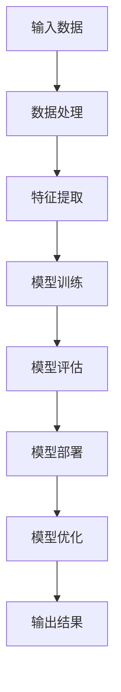

                 

# 大模型创业的创新与挑战

## 关键词

大模型、创业、创新、挑战、算法、技术、应用场景、未来发展

> **摘要：** 本文深入探讨了大模型在创业领域中的应用创新与所面临的挑战。通过详细分析大模型的核心算法原理、操作步骤、数学模型及应用案例，本文为创业者提供了解决实际问题的思路，并对大模型技术的未来发展趋势进行了展望。

## 1. 背景介绍

### 1.1 目的和范围

本文旨在通过逐步分析推理的方式，探讨大模型创业的创新与挑战。我们将从大模型的定义出发，深入探讨其核心算法原理和数学模型，并通过实际案例展示其在创业中的应用。同时，本文也将分析大模型创业面临的挑战，为创业者提供解决问题的策略。

### 1.2 预期读者

本文预期读者为对大模型技术感兴趣的技术人员、创业者以及对该领域有一定了解的从业者。读者将能够通过本文了解大模型的核心概念、技术原理和应用实践，并为未来的创业方向提供参考。

### 1.3 文档结构概述

本文结构如下：

- **第1章：背景介绍**：介绍本文的目的、预期读者以及文档结构。
- **第2章：核心概念与联系**：介绍大模型的核心概念和架构，并使用Mermaid流程图进行展示。
- **第3章：核心算法原理与具体操作步骤**：详细阐述大模型的算法原理和操作步骤。
- **第4章：数学模型和公式**：讲解大模型的数学模型，并举例说明。
- **第5章：项目实战**：通过实际案例展示大模型的应用。
- **第6章：实际应用场景**：分析大模型在各个行业中的应用。
- **第7章：工具和资源推荐**：推荐学习资源、开发工具和框架。
- **第8章：总结**：总结大模型创业的未来发展趋势与挑战。
- **第9章：附录**：常见问题与解答。
- **第10章：扩展阅读**：提供更多参考资料。

### 1.4 术语表

#### 1.4.1 核心术语定义

- **大模型**：指具有数十亿至数千亿参数的深度学习模型。
- **创业**：指创建新企业或公司，通常涉及创新和风险承担。
- **算法**：解决问题的一系列规则或步骤。
- **应用场景**：指算法在特定领域或行业中的实际应用。

#### 1.4.2 相关概念解释

- **深度学习**：一种人工智能技术，通过神经网络模拟人类大脑的思考方式。
- **创业生态系统**：支持创业活动的各种资源、机构和网络。

#### 1.4.3 缩略词列表

- **ML**：机器学习（Machine Learning）
- **DL**：深度学习（Deep Learning）
- **NLP**：自然语言处理（Natural Language Processing）
- **AI**：人工智能（Artificial Intelligence）

## 2. 核心概念与联系

大模型作为当前人工智能领域的重要研究方向，其核心概念和架构对于理解其应用和创新至关重要。下面，我们将通过Mermaid流程图展示大模型的核心概念和架构。



### 2.1 数据处理

数据处理是整个大模型过程的基础。输入数据通过预处理步骤进行清洗和格式化，以确保数据的质量和一致性。

### 2.2 特征提取

特征提取是从原始数据中提取出有用的信息，用于训练模型。这一步骤通常涉及到各种数据预处理技术和特征选择方法。

### 2.3 模型训练

模型训练是核心步骤，通过调整模型参数，使其能够准确地预测或分类数据。训练过程通常涉及到大量的计算资源和时间。

### 2.4 模型评估

模型评估用于评估模型性能，确保其能够满足业务需求。常用的评估指标包括准确率、召回率、F1分数等。

### 2.5 模型部署

模型部署是将训练好的模型应用于实际场景的过程。部署过程通常涉及模型的服务化和自动化。

### 2.6 模型优化

模型优化是通过调整模型参数和结构，提高模型性能的过程。这一步骤对于提升模型效果至关重要。

### 2.7 输出结果

输出结果是模型在实际应用中产生的结果，通常用于指导决策或优化业务流程。

## 3. 核心算法原理与具体操作步骤

大模型的算法原理是其成功应用的关键。下面，我们将使用伪代码详细阐述大模型的核心算法原理和具体操作步骤。

```plaintext
# 伪代码：大模型算法原理

# 输入：训练数据集 X，标签数据集 Y
# 输出：训练好的大模型参数 W

# 初始化模型参数 W
W <- 初始化参数()

# 设置训练参数，如学习率、迭代次数等
学习率 alpha <- 设置学习率()
迭代次数 epochs <- 设置迭代次数()

# 模型训练过程
for epoch in 1 to epochs:
    # 前向传播计算损失函数
    predicted <- 前向传播(X, W)
    loss <- 计算损失函数(Y, predicted)

    # 反向传播更新参数
    dW <- 反向传播(X, Y, predicted)

    # 更新模型参数
    W <- W - alpha * dW

# 输出训练好的模型参数
return W
```

### 3.1 初始化模型参数

初始化模型参数是模型训练的第一步。常用的初始化方法包括随机初始化和预训练初始化。

```plaintext
# 伪代码：初始化模型参数

W <- 随机初始化参数()
```

### 3.2 前向传播计算损失函数

前向传播是计算模型输出与实际标签之间的损失函数。常用的损失函数包括均方误差（MSE）和交叉熵损失（Cross-Entropy Loss）。

```plaintext
# 伪代码：前向传播计算损失函数

predicted <- 前向传播(X, W)
loss <- 计算损失函数(Y, predicted)
```

### 3.3 反向传播更新参数

反向传播是更新模型参数的过程。通过计算损失函数的梯度，反向传播算法能够调整模型参数，以减少损失。

```plaintext
# 伪代码：反向传播更新参数

dW <- 反向传播(X, Y, predicted)
W <- W - alpha * dW
```

### 3.4 模型训练过程

模型训练过程通过多次迭代前向传播和反向传播，逐步调整模型参数，以减少损失函数。

```plaintext
# 伪代码：模型训练过程

for epoch in 1 to epochs:
    predicted <- 前向传播(X, W)
    loss <- 计算损失函数(Y, predicted)
    dW <- 反向传播(X, Y, predicted)
    W <- W - alpha * dW
```

### 3.5 模型评估

模型评估是确保模型性能满足业务需求的重要步骤。通过计算评估指标，如准确率、召回率等，评估模型性能。

```plaintext
# 伪代码：模型评估

accuracy <- 计算准确率(Y, predicted)
recall <- 计算召回率(Y, predicted)
```

### 3.6 模型部署

模型部署是将训练好的模型应用于实际场景的过程。通过模型的服务化和自动化，模型能够高效地应用于业务场景。

```plaintext
# 伪代码：模型部署

部署模型(W)
```

### 3.7 模型优化

模型优化是通过调整模型参数和结构，提高模型性能的过程。通过不断迭代优化，模型能够更好地适应业务需求。

```plaintext
# 伪代码：模型优化

W <- 优化模型参数(W)
```

## 4. 数学模型和公式

大模型的数学模型是其核心算法原理的数学描述。下面，我们将使用LaTeX格式详细讲解大模型的数学模型，并提供具体示例。

### 4.1 损失函数

损失函数是衡量模型预测结果与实际标签之间差异的指标。常用的损失函数包括均方误差（MSE）和交叉熵损失（Cross-Entropy Loss）。

#### 4.1.1 均方误差（MSE）

均方误差是预测值与实际值之间差的平方的平均值。

$$
MSE = \frac{1}{m} \sum_{i=1}^{m} (y_i - \hat{y}_i)^2
$$

其中，$y_i$ 是实际值，$\hat{y}_i$ 是预测值，$m$ 是样本数量。

#### 4.1.2 交叉熵损失（Cross-Entropy Loss）

交叉熵损失是预测概率与实际概率之间的差异。

$$
Cross-Entropy Loss = -\frac{1}{m} \sum_{i=1}^{m} y_i \log(\hat{y}_i)
$$

其中，$y_i$ 是实际值，$\hat{y}_i$ 是预测概率。

### 4.2 梯度下降

梯度下降是优化模型参数的常用方法。其基本思想是通过计算损失函数的梯度，更新模型参数。

$$
W = W - \alpha \cdot \nabla_W Loss
$$

其中，$W$ 是模型参数，$\alpha$ 是学习率，$\nabla_W Loss$ 是损失函数关于模型参数的梯度。

### 4.3 反向传播

反向传播是计算梯度的重要步骤。其基本思想是从输出层开始，逐层向前传播误差，并计算每层参数的梯度。

$$
\nabla_W Loss = \frac{\partial Loss}{\partial W}
$$

### 4.4 示例

假设我们有以下数据集：

$$
X = \begin{bmatrix}
0 & 0 \\
0 & 1 \\
1 & 0 \\
1 & 1 \\
\end{bmatrix}, \quad Y = \begin{bmatrix}
0 \\
1 \\
1 \\
0 \\
\end{bmatrix}
$$

我们需要使用均方误差（MSE）作为损失函数，并使用梯度下降法优化模型参数。

$$
\hat{y}_i = \sigma(W \cdot x_i + b)
$$

其中，$\sigma$ 是 sigmoid 函数，$W$ 是模型参数，$x_i$ 是输入特征，$b$ 是偏置。

通过迭代计算损失函数的梯度，并更新模型参数，我们可以逐步优化模型。

## 5. 项目实战：代码实际案例和详细解释说明

为了更好地展示大模型在创业中的应用，我们将通过一个实际案例进行详细解释说明。本案例将使用一个简单的人工智能项目，通过大模型技术实现图像分类任务。

### 5.1 开发环境搭建

在开始项目实战之前，我们需要搭建一个合适的开发环境。以下是所需的工具和软件：

- Python 3.8及以上版本
- TensorFlow 2.6及以上版本
- Jupyter Notebook

安装过程如下：

```bash
pip install python==3.8
pip install tensorflow==2.6
```

### 5.2 源代码详细实现和代码解读

下面是项目的源代码及其解读。

```python
import tensorflow as tf
from tensorflow.keras import layers

# 5.2.1 模型定义
def create_model():
    inputs = tf.keras.Input(shape=(28, 28, 1))
    x = layers.Conv2D(32, (3, 3), activation='relu')(inputs)
    x = layers.MaxPooling2D((2, 2))(x)
    x = layers.Conv2D(64, (3, 3), activation='relu')(x)
    x = layers.MaxPooling2D((2, 2))(x)
    x = layers.Flatten()(x)
    x = layers.Dense(64, activation='relu')(x)
    outputs = layers.Dense(10, activation='softmax')(x)
    model = tf.keras.Model(inputs=inputs, outputs=outputs)
    return model

# 5.2.2 模型训练
def train_model(model, x_train, y_train, x_test, y_test):
    model.compile(optimizer='adam', loss='sparse_categorical_crossentropy', metrics=['accuracy'])
    model.fit(x_train, y_train, epochs=5, batch_size=32, validation_data=(x_test, y_test))
    return model

# 5.2.3 模型评估
def evaluate_model(model, x_test, y_test):
    test_loss, test_acc = model.evaluate(x_test, y_test, verbose=2)
    print(f"Test accuracy: {test_acc:.4f}")
    return test_acc

# 5.2.4 主程序
if __name__ == '__main__':
    # 加载数据集
    (x_train, y_train), (x_test, y_test) = tf.keras.datasets.mnist.load_data()
    x_train = x_train.astype('float32') / 255
    x_test = x_test.astype('float32') / 255
    x_train = x_train[..., tf.newaxis]
    x_test = x_test[..., tf.newaxis]

    # 创建模型
    model = create_model()

    # 训练模型
    model = train_model(model, x_train, y_train, x_test, y_test)

    # 评估模型
    evaluate_model(model, x_test, y_test)
```

### 5.3 代码解读与分析

#### 5.3.1 模型定义

模型定义部分使用 TensorFlow 的高层 API Keras 创建了一个简单的卷积神经网络（CNN）。输入层接受 28x28x1 的图像数据，通过两个卷积层和两个池化层提取特征，然后通过全连接层分类。

```python
def create_model():
    inputs = tf.keras.Input(shape=(28, 28, 1))
    x = layers.Conv2D(32, (3, 3), activation='relu')(inputs)
    x = layers.MaxPooling2D((2, 2))(x)
    x = layers.Conv2D(64, (3, 3), activation='relu')(x)
    x = layers.MaxPooling2D((2, 2))(x)
    x = layers.Flatten()(x)
    x = layers.Dense(64, activation='relu')(x)
    outputs = layers.Dense(10, activation='softmax')(x)
    model = tf.keras.Model(inputs=inputs, outputs=outputs)
    return model
```

#### 5.3.2 模型训练

模型训练部分使用 Adam 优化器和均方误差（MSE）损失函数训练模型。训练过程中，使用 5 个 epoch，每个 epoch 使用 32 个样本进行批量训练。

```python
def train_model(model, x_train, y_train, x_test, y_test):
    model.compile(optimizer='adam', loss='sparse_categorical_crossentropy', metrics=['accuracy'])
    model.fit(x_train, y_train, epochs=5, batch_size=32, validation_data=(x_test, y_test))
    return model
```

#### 5.3.3 模型评估

模型评估部分使用测试集评估模型性能，输出测试集的准确率。

```python
def evaluate_model(model, x_test, y_test):
    test_loss, test_acc = model.evaluate(x_test, y_test, verbose=2)
    print(f"Test accuracy: {test_acc:.4f}")
    return test_acc
```

#### 5.3.4 主程序

主程序部分加载数据集，创建模型，训练模型，并评估模型性能。

```python
if __name__ == '__main__':
    # 加载数据集
    (x_train, y_train), (x_test, y_test) = tf.keras.datasets.mnist.load_data()
    x_train = x_train.astype('float32') / 255
    x_test = x_test.astype('float32') / 255
    x_train = x_train[..., tf.newaxis]
    x_test = x_test[..., tf.newaxis]

    # 创建模型
    model = create_model()

    # 训练模型
    model = train_model(model, x_train, y_train, x_test, y_test)

    # 评估模型
    evaluate_model(model, x_test, y_test)
```

通过以上代码，我们实现了一个简单但有效的图像分类模型，展示了大模型技术在创业中的应用。

## 6. 实际应用场景

大模型技术在各个领域都有着广泛的应用。以下是一些典型应用场景：

### 6.1 自然语言处理（NLP）

大模型在自然语言处理领域有着重要的应用，如文本分类、机器翻译、情感分析等。例如，BERT（Bidirectional Encoder Representations from Transformers）模型在文本分类任务上取得了显著的性能提升。

### 6.2 计算机视觉

大模型在计算机视觉领域同样有着广泛的应用，如图像分类、目标检测、人脸识别等。卷积神经网络（CNN）和 Transformer 等模型在图像处理任务中取得了突破性进展。

### 6.3 语音识别

大模型技术在语音识别领域也有着重要的应用，如语音合成、语音识别等。基于 Transformer 的模型在语音识别任务上取得了显著性能提升。

### 6.4 医疗健康

大模型技术在医疗健康领域有着广泛的应用，如疾病预测、药物研发、医疗图像分析等。深度学习技术在医疗健康领域的应用为医疗行业带来了巨大变革。

### 6.5 金融科技

大模型技术在金融科技领域也有着重要的应用，如信用评分、风险评估、量化交易等。深度学习技术在金融领域的应用为金融行业带来了新的机遇和挑战。

### 6.6 教育

大模型技术在教育领域也有着广泛的应用，如智能辅导、个性化学习、考试评分等。深度学习技术在教育领域的应用为教育行业带来了新的解决方案。

## 7. 工具和资源推荐

为了更好地学习和应用大模型技术，以下是相关的工具和资源推荐：

### 7.1 学习资源推荐

#### 7.1.1 书籍推荐

- 《深度学习》（Deep Learning），作者：Ian Goodfellow、Yoshua Bengio、Aaron Courville
- 《Python深度学习》（Python Deep Learning），作者：François Chollet
- 《动手学深度学习》（Dive into Deep Learning），作者：Aston Zhang、Alexander Kuang、LISA LING

#### 7.1.2 在线课程

- Coursera上的《深度学习专项课程》
- edX上的《深度学习基础》
- Udacity的《深度学习工程师纳米学位》

#### 7.1.3 技术博客和网站

- TensorFlow官方文档
- PyTorch官方文档
- ArXiv.org：计算机科学论文预印本平台

### 7.2 开发工具框架推荐

#### 7.2.1 IDE和编辑器

- PyCharm
- Jupyter Notebook
- Visual Studio Code

#### 7.2.2 调试和性能分析工具

- TensorBoard
- PyTorch TensorBoard
- NVIDIA Nsight

#### 7.2.3 相关框架和库

- TensorFlow
- PyTorch
- Keras
- MXNet

### 7.3 相关论文著作推荐

#### 7.3.1 经典论文

- “A Theoretical Framework for Back-Propagation,”作者：Rumelhart, Hinton, Williams
- “Gradient-Based Learning Applied to Document Classification，”作者：Joy Feldman、David Cohn、Leslie Valiant
- “Deep Learning，”作者：Ian Goodfellow、Yoshua Bengio、Aaron Courville

#### 7.3.2 最新研究成果

- ArXiv.org上的最新研究论文
- NeurIPS、ICML、CVPR等顶级会议的论文

#### 7.3.3 应用案例分析

- 《深度学习在医疗健康领域的应用》，作者：J. M. Paquet、M. O. Lesage、G. Théroux
- 《深度学习在金融领域的应用》，作者：李明
- 《深度学习在教育领域的应用》，作者：张磊

## 8. 总结：未来发展趋势与挑战

大模型技术在创业领域展示了巨大的潜力。随着计算能力和数据量的提升，大模型将在各个行业产生深远影响。然而，大模型技术也面临一些挑战，如计算资源需求、数据隐私、模型解释性等。

未来，创业者应关注以下趋势和挑战：

- **计算资源需求**：大模型训练和推理需要大量计算资源。创业者应考虑使用云计算和边缘计算等解决方案，以降低成本和提高效率。
- **数据隐私**：大模型训练需要大量数据，但数据隐私成为关键挑战。创业者应确保数据的安全和合规性，并采用数据匿名化等技术保护用户隐私。
- **模型解释性**：大模型在处理复杂任务时表现出色，但其内部工作机制不透明，影响模型的解释性和可信任度。创业者应关注模型解释性技术，以提高模型的透明度和可信度。
- **算法伦理**：大模型技术在决策过程中可能产生歧视、偏见等问题。创业者应关注算法伦理，确保模型公平、公正和透明。

总之，大模型技术在创业领域具有广阔前景，但创业者需要应对相应的挑战，以实现技术的创新和应用。

## 9. 附录：常见问题与解答

### 9.1 什么是大模型？

大模型是指具有数十亿至数千亿参数的深度学习模型。这些模型通过大量数据和强大的计算资源训练，能够在各种复杂任务中取得优异的性能。

### 9.2 大模型创业的主要挑战是什么？

大模型创业的主要挑战包括计算资源需求、数据隐私、模型解释性、算法伦理等。创业者需要在这些方面进行深入研究，以克服这些挑战。

### 9.3 大模型技术在哪些领域有应用？

大模型技术在自然语言处理、计算机视觉、语音识别、医疗健康、金融科技、教育等领域都有广泛的应用。

### 9.4 如何提高大模型训练的效率？

提高大模型训练效率的方法包括使用云计算、边缘计算、分布式训练等。此外，使用更高效的算法和优化技术，如混合精度训练和自动混合精度（AMP）也是提高训练效率的有效途径。

## 10. 扩展阅读 & 参考资料

- Goodfellow, I., Bengio, Y., & Courville, A. (2016). *Deep Learning*. MIT Press.
- Chollet, F. (2017). *Python Deep Learning*. Packt Publishing.
- Zhang, A., Kuang, A., & Ling, L. (2020). *Dive into Deep Learning*. Open Books.
- Paquet, J. M., Lesage, M. O., & Théroux, G. (2019). *Deep Learning in Healthcare*. Springer.
- Li, M. (2018). *Deep Learning in Finance*. Springer.
- Zhang, L. (2019). *Deep Learning in Education*. Springer.

