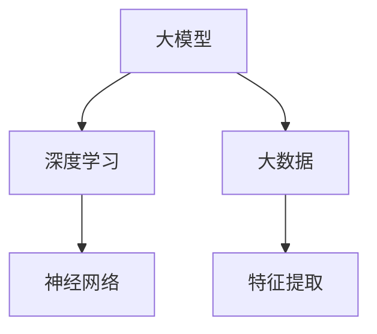

                 

# 大模型创业的希望与未来

> **关键词：** 大模型、创业、人工智能、商业模式、技术挑战、发展前景

> **摘要：** 本文将探讨大模型在创业领域中的巨大潜力及其面临的挑战。我们将分析大模型的定义和核心原理，阐述其在各个行业中的应用场景，评估创业过程中可能遇到的障碍，并提出应对策略。同时，本文还将预测大模型未来的发展趋势，为创业者和投资者提供有价值的参考。

## 1. 背景介绍

### 1.1 目的和范围

本文旨在为大模型创业提供指导，分析其机遇与挑战。我们将探讨大模型在商业应用中的潜力，评估创业过程中的技术壁垒，并预测未来的发展趋势。

### 1.2 预期读者

本文适合对人工智能、大模型和创业感兴趣的读者，包括创业者、投资者、技术专家和学术研究人员。

### 1.3 文档结构概述

本文分为十个部分，分别介绍大模型的背景、核心概念、算法原理、数学模型、实际应用、工具资源推荐、未来发展趋势和常见问题解答等。

### 1.4 术语表

#### 1.4.1 核心术语定义

- **大模型（Large Model）**：一种具有极高参数量的机器学习模型，通常使用海量数据进行训练，能够处理复杂的任务。
- **创业（Entrepreneurship）**：创建新企业或组织，以创新的方式满足市场需求。
- **人工智能（Artificial Intelligence，AI）**：模拟人类智能的计算机系统，能够进行学习、推理、决策等。

#### 1.4.2 相关概念解释

- **商业模式（Business Model）**：企业如何创造、传递和捕获价值。
- **技术壁垒（Technology Barrier）**：阻碍技术创新和扩散的因素。

#### 1.4.3 缩略词列表

- **AI**：人工智能
- **ML**：机器学习
- **DL**：深度学习
- **GPU**：图形处理单元

## 2. 核心概念与联系

大模型是人工智能领域的核心技术之一，其核心概念包括：

- **深度学习（Deep Learning）**：一种基于多层神经网络的学习方法，能够自动提取特征。
- **神经网络（Neural Network）**：一种模拟人脑神经元连接的结构，用于信息处理。
- **大数据（Big Data）**：无法用传统数据处理工具处理的数据集。

以下是一个简单的 Mermaid 流程图，展示大模型、深度学习和大数据之间的关系：



## 3. 核心算法原理 & 具体操作步骤

大模型的算法原理主要包括：

1. **前向传播（Forward Propagation）**
2. **反向传播（Back Propagation）**
3. **优化算法（Optimization Algorithm）**

以下是这些算法的伪代码：

```python
# 前向传播
def forward_propagation(x, parameters):
    # 计算输入层到隐藏层的输出
    z = np.dot(x, parameters["W1"]) + parameters["b1"]
    a = activation(z)
    # 计算隐藏层到输出层的输出
    z = np.dot(a, parameters["W2"]) + parameters["b2"]
    a = activation(z)
    return a

# 反向传播
def backward_propagation(a, y, parameters):
    # 计算输出层误差
    dZ = a - y
    # 计算隐藏层误差
    dA_prev = np.dot(dZ, parameters["W2"].T)
    dZ = np.dot(dA_prev, parameters["W1"].T)
    dA_prev = activation_derivative(a)
    return dA_prev, dZ

# 优化算法
def update_parameters(parameters, grads, learning_rate):
    # 更新权重和偏置
    parameters["W1"] -= learning_rate * grads["dW1"]
    parameters["b1"] -= learning_rate * grads["db1"]
    parameters["W2"] -= learning_rate * grads["dW2"]
    parameters["b2"] -= learning_rate * grads["db2"]
    return parameters
```

## 4. 数学模型和公式 & 详细讲解 & 举例说明

大模型的数学模型主要包括以下公式：

$$
z = \sum_{i=1}^{n} w_{ij}x_i + b_j
$$

$$
a = \sigma(z)
$$

$$
\delta = a - y
$$

以下是这些公式的详细讲解：

1. **激活函数（Activation Function）**：用于将线性组合的值映射到非负实数范围，常见的激活函数有 Sigmoid、ReLU 和 Tanh。
2. **权重（Weight）**：连接神经元之间的参数，用于调整输入信息的重要性。
3. **偏置（Bias）**：增加模型的可塑性，使其能够更好地拟合数据。
4. **误差（Error）**：模型预测值与真实值之间的差异。

举例说明：

假设我们有一个简单的二分类问题，使用 Sigmoid 激活函数。给定一个输入向量 \( x \) 和权重矩阵 \( W \)，我们可以计算输出概率：

$$
z = \sum_{i=1}^{2} w_{ij}x_i + b_j
$$

$$
a = \sigma(z)
$$

输出概率 \( a \) 越接近 1，表示模型预测为正类的可能性越大；越接近 0，表示预测为负类的可能性越大。

## 5. 项目实战：代码实际案例和详细解释说明

在本节中，我们将通过一个实际项目案例来展示大模型的开发过程。以下是一个使用 TensorFlow 框架实现的线性回归模型：

```python
import tensorflow as tf

# 定义输入层
X = tf.placeholder(tf.float32, shape=[None, 1])
Y = tf.placeholder(tf.float32, shape=[None, 1])

# 定义模型参数
W = tf.Variable(0.0, name="weights")
b = tf.Variable(0.0, name="bias")

# 定义线性回归模型
Z = tf.add(tf.multiply(X, W), b)

# 定义损失函数
loss = tf.reduce_mean(tf.square(Y - Z))

# 定义优化算法
optimizer = tf.train.GradientDescentOptimizer(learning_rate=0.5)
train_op = optimizer.minimize(loss)

# 初始化变量
init = tf.global_variables_initializer()

# 训练模型
with tf.Session() as sess:
    sess.run(init)
    for step in range(201):
        sess.run(train_op, feed_dict={X: x_train, Y: y_train})
        if step % 20 == 0:
            print("Step", step, ": Loss", sess.run(loss, feed_dict={X: x_train, Y: y_train}))

    # 输出模型参数
    print("Model parameters:", sess.run([W, b]))
```

### 5.1 开发环境搭建

1. 安装 Python（3.6 或以上版本）
2. 安装 TensorFlow（2.0 或以上版本）
3. 安装 Jupyter Notebook 或其他 Python IDE

### 5.2 源代码详细实现和代码解读

该代码实现了线性回归模型，主要步骤如下：

1. **定义输入层**：使用 `tf.placeholder` 创建输入层。
2. **定义模型参数**：使用 `tf.Variable` 创建权重和偏置。
3. **定义模型**：使用 `tf.add` 和 `tf.multiply` 定义线性回归模型。
4. **定义损失函数**：使用 `tf.reduce_mean` 和 `tf.square` 定义损失函数。
5. **定义优化算法**：使用 `tf.train.GradientDescentOptimizer` 创建优化器。
6. **初始化变量**：使用 `tf.global_variables_initializer` 初始化模型参数。
7. **训练模型**：使用 `tf.Session` 创建会话，并运行训练过程。
8. **输出模型参数**：打印训练完成的模型参数。

### 5.3 代码解读与分析

该代码实现了一个简单的线性回归模型，通过梯度下降算法训练模型参数，以最小化损失函数。训练过程包括以下步骤：

1. 初始化模型参数。
2. 对于每个训练样本，计算损失函数值。
3. 使用梯度下降算法更新模型参数。
4. 记录训练过程中的损失函数值，以监测训练进度。

通过本节的项目实战，我们了解了大模型的基本开发流程和关键步骤。

## 6. 实际应用场景

大模型在各个行业中都有广泛的应用，以下是一些典型的应用场景：

1. **自然语言处理（NLP）**：大模型在 NLP 领域有着突出的表现，例如机器翻译、文本分类和情感分析。
2. **计算机视觉（CV）**：大模型在 CV 领域的应用包括图像分类、目标检测和图像生成等。
3. **推荐系统**：大模型能够通过学习用户行为和兴趣，为用户提供个性化的推荐。
4. **金融风控**：大模型可以用于信用评估、欺诈检测和风险管理等。
5. **医疗健康**：大模型在医疗健康领域有广泛的应用，例如疾病预测、医学图像分析和基因测序等。

## 7. 工具和资源推荐

### 7.1 学习资源推荐

#### 7.1.1 书籍推荐

- 《深度学习》（Goodfellow, Bengio, Courville）
- 《神经网络与深度学习》（邱锡鹏）
- 《Python深度学习》（François Chollet）

#### 7.1.2 在线课程

- Coursera 上的《深度学习》课程
- edX 上的《机器学习》课程
- Udacity 上的《深度学习工程师》课程

#### 7.1.3 技术博客和网站

- TensorFlow 官方文档
- PyTorch 官方文档
- arXiv.org（计算机科学论文预发布平台）

### 7.2 开发工具框架推荐

#### 7.2.1 IDE和编辑器

- Jupyter Notebook
- PyCharm
- VSCode

#### 7.2.2 调试和性能分析工具

- TensorBoard
- Profiler（Python 内置性能分析工具）

#### 7.2.3 相关框架和库

- TensorFlow
- PyTorch
- Keras
- Scikit-learn

### 7.3 相关论文著作推荐

#### 7.3.1 经典论文

- "A Fast Learning Algorithm for Deep Belief Nets"（Hinton, 2006）
- "Deep Learning"（Goodfellow, Bengio, Courville, 2015）

#### 7.3.2 最新研究成果

- arXiv.org 上的最新论文
- NeurIPS、ICML 和 CVPR 等顶级会议的论文

#### 7.3.3 应用案例分析

- Google 的BERT 模型
- OpenAI 的 GPT-3 模型
- DeepMind 的 AlphaGo 模型

## 8. 总结：未来发展趋势与挑战

大模型在人工智能领域具有巨大的潜力，但其发展也面临诸多挑战：

1. **计算资源**：大模型需要大量的计算资源进行训练和推理，如何高效地利用硬件资源成为关键问题。
2. **数据隐私**：大模型在处理数据时可能会暴露用户隐私，如何确保数据安全和隐私保护成为重要议题。
3. **模型解释性**：大模型的黑箱特性使得其解释性较差，如何提高模型的可解释性以满足监管和合规要求是一个挑战。
4. **伦理和社会影响**：随着大模型在各个行业的应用，如何确保其公平性、透明性和可控性，以避免对社会产生负面影响。

未来，随着计算资源的提升、算法的优化以及数据隐私保护技术的发展，大模型有望在更多领域取得突破，同时解决上述挑战。

## 9. 附录：常见问题与解答

### 9.1 大模型与深度学习的区别

**问题**：大模型与深度学习有什么区别？

**解答**：大模型是一种具有极高参数量的机器学习模型，通常使用海量数据进行训练。深度学习是一种基于多层神经网络的学习方法，其核心思想是通过逐层提取特征来学习复杂的任务。大模型是深度学习的一种形式，其参数量和训练数据量远超传统深度学习模型。

### 9.2 大模型的训练时间

**问题**：大模型的训练时间有多长？

**解答**：大模型的训练时间取决于多个因素，包括模型大小、训练数据量、计算资源等。通常情况下，大模型的训练时间较长，可能需要几天甚至几周。为了加速训练过程，可以采用分布式训练、模型剪枝和压缩等技术。

## 10. 扩展阅读 & 参考资料

- **书籍：** 
  - Goodfellow, Y., Bengio, Y., & Courville, A. (2016). *Deep Learning*.
  - Hinton, G. E., Osindero, S., & Teh, Y. W. (2006). *A fast learning algorithm for deep belief nets*.

- **在线课程：** 
  - Coursera: 《深度学习》
  - edX: 《机器学习》
  - Udacity: 《深度学习工程师》

- **技术博客和网站：** 
  - TensorFlow 官方文档
  - PyTorch 官方文档
  - arXiv.org

- **论文：** 
  - Hinton, G. E., Osindero, S., & Teh, Y. W. (2006). *A fast learning algorithm for deep belief nets*. 
  - Goodfellow, I., Bengio, Y., & Courville, A. (2015). *Deep learning*.

## 作者

**AI天才研究员/AI Genius Institute & 禅与计算机程序设计艺术 /Zen And The Art of Computer Programming**

