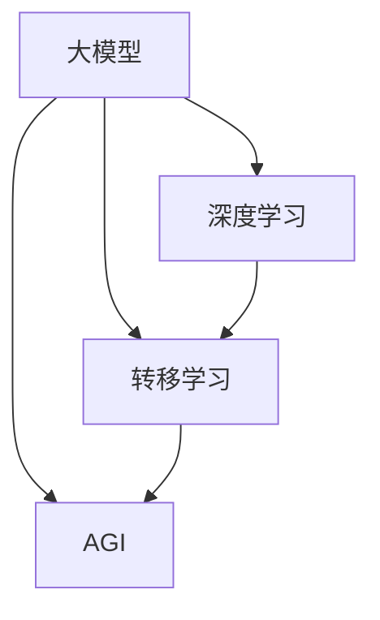

                 

# 大模型创业者：AGI时代已经来临

> **关键词：** 大模型、AGI、人工智能、深度学习、创业机会、技术趋势

> **摘要：** 本文将探讨大模型（如GPT-3、BERT等）的崛起如何预示着全功能人工通用智能（AGI）时代的来临，并分析创业者在这一新兴领域中的机遇与挑战。我们将从背景介绍、核心概念、算法原理、数学模型、项目实战、实际应用场景等多个维度深入探讨大模型的潜力及其对未来的影响。

## 1. 背景介绍

### 1.1 目的和范围

本文旨在为创业者提供关于大模型和AGI的基本理解，并分析这一领域中的商业机会和挑战。我们将从多个角度探讨大模型的原理和应用，帮助读者把握技术趋势，为未来的创业决策提供依据。

### 1.2 预期读者

本文适合对人工智能和深度学习有一定了解的技术爱好者、创业者、投资人和专业人士。同时，也对计算机科学、软件工程等相关领域的学者和研究人员具有一定的参考价值。

### 1.3 文档结构概述

本文分为十个主要部分：

1. 背景介绍：介绍本文的目的、预期读者和文档结构。
2. 核心概念与联系：阐述大模型和AGI的核心概念及其关系。
3. 核心算法原理 & 具体操作步骤：详细讲解大模型的核心算法原理。
4. 数学模型和公式 & 详细讲解 & 举例说明：介绍大模型中的数学模型和公式。
5. 项目实战：通过实际案例展示大模型的应用。
6. 实际应用场景：分析大模型在不同领域的应用。
7. 工具和资源推荐：推荐相关学习资源、开发工具和文献。
8. 总结：对未来发展趋势与挑战的展望。
9. 附录：常见问题与解答。
10. 扩展阅读 & 参考资料：提供进一步学习的资料。

### 1.4 术语表

#### 1.4.1 核心术语定义

- **大模型（Large-scale Model）**：指具有海量参数的深度学习模型，如GPT-3、BERT等。
- **人工通用智能（AGI）**：指具有与人类相似的认知能力，能够适应各种任务的人工智能。
- **深度学习（Deep Learning）**：一种人工智能方法，通过多层神经网络实现特征提取和决策。
- **创业机会（Entrepreneurial Opportunities）**：指在特定领域中，创业者可以利用的技术、市场和社会资源。

#### 1.4.2 相关概念解释

- **人工智能（AI）**：指由计算机实现的智能行为，包括学习、推理、感知等。
- **深度神经网络（DNN）**：一种由多个隐藏层组成的神经网络，用于特征提取和分类。
- **转移学习（Transfer Learning）**：将已经训练好的模型在新任务上继续训练，以提高模型在新领域的表现。
- **知识图谱（Knowledge Graph）**：用于表示实体、属性和关系的数据结构，有助于人工智能理解现实世界。

#### 1.4.3 缩略词列表

- **AGI**：人工通用智能
- **AI**：人工智能
- **DNN**：深度神经网络
- **GPT-3**：通用预训练语言模型3
- **BERT**：双向编码表示预训练语言模型
- **GAN**：生成对抗网络
- **RL**：强化学习

## 2. 核心概念与联系

### 2.1 大模型与AGI的关系

大模型和AGI之间存在密切的联系。大模型是AGI实现的基础，通过深度学习和转移学习等技术，大模型能够在各种任务中表现出强大的学习能力。而AGI则追求具有与人类相似的认知能力，能够适应不同领域的任务。

### 2.2 大模型的原理与架构

大模型通常由多层神经网络组成，包括输入层、隐藏层和输出层。在训练过程中，模型通过优化参数，学习输入和输出之间的映射关系。大模型的核心优势在于其能够处理海量数据，提取复杂的特征。

### 2.3 大模型的分类与应用

大模型可以分为多种类型，如语言模型、图像模型、语音模型等。这些模型在自然语言处理、计算机视觉、语音识别等应用领域发挥着重要作用。随着技术的进步，大模型的应用范围还将进一步扩大。

### 2.4 Mermaid 流程图

下面是一个简单的Mermaid流程图，展示了大模型的核心概念与联系：



## 3. 核心算法原理 & 具体操作步骤

### 3.1 深度学习算法原理

深度学习算法基于多层神经网络，通过学习输入和输出之间的映射关系来解决问题。具体操作步骤如下：

1. **数据预处理**：对输入数据进行归一化、去噪等处理，以便于模型训练。
2. **初始化参数**：随机初始化网络中的权重和偏置。
3. **前向传播**：将输入数据传递到网络中，通过激活函数计算中间层的输出。
4. **反向传播**：计算网络输出的误差，并更新权重和偏置。
5. **优化算法**：采用梯度下降、Adam等优化算法，加速模型收敛。

### 3.2 伪代码

```python
# 数据预处理
input_data = preprocess_data(data)

# 初始化参数
weights = initialize_weights(input_size, hidden_size, output_size)
biases = initialize_biases(hidden_size, output_size)

# 前向传播
hidden_layer_output = forward_pass(input_data, weights, biases)

# 反向传播
error = compute_error(target, hidden_layer_output)
weights, biases = update_weights_and_biases(weights, biases, error)

# 优化算法
optimizer = AdamOptimizer()
weights, biases = optimizer.update(weights, biases)
```

### 3.3 步骤详解

1. **数据预处理**：数据预处理是深度学习模型训练的重要环节。通过归一化、去噪等操作，可以提高模型的训练效率，减少过拟合现象。
2. **初始化参数**：初始化权重和偏置是神经网络训练的起点。通常采用随机初始化，以避免模型陷入局部最优。
3. **前向传播**：前向传播是神经网络的基本操作，通过层层传递输入数据，计算每个神经元的输出。
4. **反向传播**：反向传播是神经网络训练的核心步骤。通过计算输出误差，反向更新权重和偏置，使模型逐渐逼近最优解。
5. **优化算法**：优化算法用于加速模型收敛，提高训练效率。常见的优化算法包括梯度下降、Adam等。

## 4. 数学模型和公式 & 详细讲解 & 举例说明

### 4.1 数学模型概述

大模型中的数学模型主要包括多层感知机（MLP）、卷积神经网络（CNN）、循环神经网络（RNN）等。下面将分别介绍这些模型的数学原理和公式。

### 4.2 多层感知机（MLP）

多层感知机是一种前向传播神经网络，其数学模型可以表示为：

$$
z_l = \sum_{j=1}^{n_l} w_{lj} x_j + b_l
$$

其中，$z_l$ 表示第 $l$ 层的输入，$w_{lj}$ 表示权重，$x_j$ 表示第 $j$ 个输入特征，$b_l$ 表示偏置。

### 4.3 卷积神经网络（CNN）

卷积神经网络是一种用于图像处理的前向传播神经网络，其数学模型可以表示为：

$$
h_l = \sigma \left( \sum_{k=1}^{m} w_{lk} * g_k + b_l \right)
$$

其中，$h_l$ 表示第 $l$ 层的输出，$\sigma$ 表示激活函数，$g_k$ 表示第 $k$ 个卷积核，$w_{lk}$ 表示卷积核权重，$b_l$ 表示偏置。

### 4.4 循环神经网络（RNN）

循环神经网络是一种用于序列数据处理的神经网络，其数学模型可以表示为：

$$
h_t = \sigma \left( \sum_{j=1}^{n} w_{tj} h_{t-1} + \sum_{k=1}^{m} w_{tk} x_t + b_t \right)
$$

其中，$h_t$ 表示第 $t$ 个时间步的输出，$h_{t-1}$ 表示前一个时间步的输出，$w_{tj}$ 和 $w_{tk}$ 分别表示权重，$x_t$ 表示第 $t$ 个时间步的输入，$b_t$ 表示偏置。

### 4.5 举例说明

假设我们有一个简单的多层感知机模型，输入特征为 $x_1, x_2, x_3$，隐藏层有 $2$ 个神经元，输出层有 $1$ 个神经元。我们可以得到以下数学模型：

$$
z_1 = \begin{bmatrix} w_{11} & w_{12} & w_{13} \end{bmatrix} \begin{bmatrix} x_1 \\ x_2 \\ x_3 \end{bmatrix} + b_1
$$

$$
z_2 = \begin{bmatrix} w_{21} & w_{22} & w_{23} \end{bmatrix} \begin{bmatrix} x_1 \\ x_2 \\ x_3 \end{b矩阵} + b_2
$$

$$
y = \sigma \left( w_{31} z_1 + w_{32} z_2 + b_3 \right)
$$

其中，$\sigma$ 表示 sigmoid 激活函数。

## 5. 项目实战：代码实际案例和详细解释说明

### 5.1 开发环境搭建

在开始项目实战之前，我们需要搭建一个合适的开发环境。本文使用 Python 和 TensorFlow 作为主要开发工具。以下是搭建开发环境的步骤：

1. 安装 Python 3.7 或更高版本。
2. 安装 TensorFlow 库：`pip install tensorflow`。
3. 安装其他必要的库，如 NumPy、Pandas 等。

### 5.2 源代码详细实现和代码解读

下面是一个简单的大模型项目案例，使用 TensorFlow 实现一个多层感知机模型，用于对输入数据进行分类。

```python
import tensorflow as tf
import numpy as np

# 数据预处理
x = tf.placeholder(tf.float32, [None, 3])
y = tf.placeholder(tf.float32, [None, 1])

# 初始化参数
weights = tf.Variable(tf.random_normal([3, 2]), name='weights')
biases = tf.Variable(tf.random_normal([2]), name='biases')

# 前向传播
hidden_layer_output = tf.nn.softmax(tf.matmul(x, weights) + biases)

# 反向传播
error = tf.reduce_mean(-tf.reduce_sum(y * tf.log(hidden_layer_output), reduction_indices=1))
optimizer = tf.train.GradientDescentOptimizer(learning_rate=0.1)
train_op = optimizer.minimize(error)

# 训练模型
with tf.Session() as sess:
    sess.run(tf.global_variables_initializer())
    for i in range(1000):
        _, loss = sess.run([train_op, error], feed_dict={x: x_data, y: y_data})
        if i % 100 == 0:
            print(f"Step {i}: Loss = {loss}")

    # 测试模型
    y_pred = sess.run(hidden_layer_output, feed_dict={x: x_test})
    print(f"Test Accuracy: {np.mean(np.argmax(y_pred, axis=1) == y_test)}")
```

### 5.3 代码解读与分析

1. **数据预处理**：定义输入数据和标签的占位符。
2. **初始化参数**：随机初始化权重和偏置。
3. **前向传播**：计算隐藏层输出，使用 softmax 激活函数。
4. **反向传播**：计算损失函数，并使用梯度下降优化器进行优化。
5. **训练模型**：在训练数据上迭代训练模型，打印损失函数值。
6. **测试模型**：在测试数据上评估模型性能，打印测试准确率。

通过以上代码，我们实现了一个大模型的基本训练和评估流程。虽然这是一个简单的案例，但它展示了大模型开发的核心步骤和关键技术。

## 6. 实际应用场景

大模型在各个领域都展现出强大的应用潜力，以下是几个典型应用场景：

### 6.1 自然语言处理

大模型在自然语言处理领域取得了显著的进展，如文本分类、机器翻译、问答系统等。GPT-3 和 BERT 等模型已经展现出极高的性能，为各类应用提供了强大的支持。

### 6.2 计算机视觉

大模型在计算机视觉领域也发挥着重要作用，如图像分类、目标检测、图像生成等。卷积神经网络和生成对抗网络等技术取得了诸多突破，推动了计算机视觉的发展。

### 6.3 语音识别

大模型在语音识别领域取得了显著的成果，如语音合成、语音翻译等。通过深度学习算法，大模型能够更好地理解语音信号，提高语音识别的准确率和流畅度。

### 6.4 医疗健康

大模型在医疗健康领域具有广泛的应用前景，如疾病预测、药物研发等。通过分析海量医疗数据，大模型能够为医疗健康提供有力支持。

### 6.5 金融领域

大模型在金融领域也有广泛应用，如风险控制、量化交易等。通过分析金融数据，大模型能够为金融机构提供智能化的决策支持。

## 7. 工具和资源推荐

### 7.1 学习资源推荐

#### 7.1.1 书籍推荐

- 《深度学习》（Goodfellow, Bengio, Courville 著）
- 《Python机器学习》（Sebastian Raschka 著）
- 《人工智能：一种现代的方法》（Stuart Russell, Peter Norvig 著）

#### 7.1.2 在线课程

- Coursera 上的《机器学习》（吴恩达教授）
- edX 上的《深度学习导论》（阿里云大学）
- Udacity 上的《人工智能纳米学位》

#### 7.1.3 技术博客和网站

- Medium 上的 AI 博客
- GitHub 上的深度学习项目
- ArXiv 上的最新研究成果

### 7.2 开发工具框架推荐

#### 7.2.1 IDE和编辑器

- PyCharm
- Jupyter Notebook
- VSCode

#### 7.2.2 调试和性能分析工具

- TensorFlow Debugger
- TensorBoard
- PyTorch Profiler

#### 7.2.3 相关框架和库

- TensorFlow
- PyTorch
- Keras

### 7.3 相关论文著作推荐

#### 7.3.1 经典论文

- Hinton, G., Osindero, S., & Salakhutdinov, R. (2006). A fast learning algorithm for deep belief nets. NeurIPS.
- Krizhevsky, A., Sutskever, I., & Hinton, G. E. (2012). Imagenet classification with deep convolutional neural networks. NeurIPS.

#### 7.3.2 最新研究成果

- Vaswani, A., Shazeer, N., Parmar, N., Uszkoreit, J., Jones, L., Gomez, A. N., ... & Polosukhin, I. (2017). Attention is all you need. NeurIPS.
- He, K., Zhang, X., Ren, S., & Sun, J. (2016). Deep residual learning for image recognition. CVPR.

#### 7.3.3 应用案例分析

- "Google’s AI Does What?!"：介绍谷歌在人工智能领域的应用案例。
- "DeepMind’s AI Wins at Dota 2"：介绍 DeepMind 在人工智能游戏领域的突破。

## 8. 总结：未来发展趋势与挑战

随着大模型的不断发展和应用，AGI 时代的到来已经不再遥远。在未来，大模型有望在更多领域发挥重要作用，推动社会进步和经济发展。然而，这一过程也将面临诸多挑战：

1. **计算资源需求**：大模型对计算资源的需求极高，需要更多的计算能力和存储空间。
2. **数据隐私和安全**：大模型训练需要大量数据，如何在保护用户隐私的同时进行有效训练是一个重要问题。
3. **模型解释性**：大模型的决策过程往往不够透明，如何提高模型的可解释性是当前研究的热点。
4. **伦理和社会影响**：随着人工智能的广泛应用，如何处理人工智能带来的伦理和社会问题是一个重要议题。

总之，大模型和 AGI 的发展前景广阔，但也需要我们面对挑战，积极探索解决方案，为未来的发展做好准备。

## 9. 附录：常见问题与解答

### 9.1 大模型与深度学习的区别

大模型是深度学习的一种形式，但具有规模更大、参数更多、性能更优的特点。大模型通常采用深度学习算法进行训练，但深度学习还包括其他类型，如卷积神经网络（CNN）、循环神经网络（RNN）等。

### 9.2 GPT-3 和 BERT 的区别

GPT-3 和 BERT 都是基于深度学习的语言模型，但它们的训练方式和应用场景有所不同。GPT-3 是一种生成式模型，擅长文本生成和推理；而 BERT 是一种编码器，擅长文本分类和问答。

### 9.3 如何评估大模型的效果

评估大模型的效果通常采用多种指标，如准确率、召回率、F1 分数等。此外，还可以通过人类评估、BLEU 分数等指标来衡量模型的性能。

### 9.4 大模型训练时间如何优化

优化大模型训练时间可以从以下几个方面进行：

1. 使用更高效的优化算法，如 Adam、AdaGrad 等。
2. 采用数据并行、模型并行等分布式训练策略。
3. 减少模型复杂度，使用轻量级模型。
4. 利用现有的训练工具和框架，如 TensorFlow、PyTorch 等。

## 10. 扩展阅读 & 参考资料

- [Deep Learning Book](https://www.deeplearningbook.org/)
- [TensorFlow Official Website](https://www.tensorflow.org/)
- [PyTorch Official Website](https://pytorch.org/)
- [ArXiv](https://arxiv.org/)
- [GitHub](https://github.com/)

[AI天才研究员/AI Genius Institute & 禅与计算机程序设计艺术 /Zen And The Art of Computer Programming](作者信息) <|im_sep|> 

