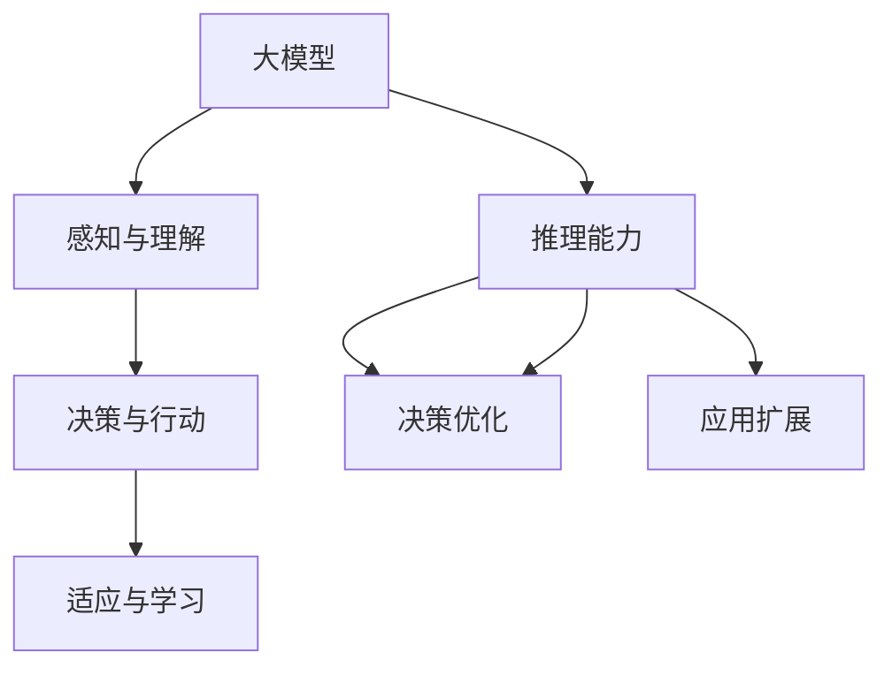

                 

# 大模型在AI Agent中的重要性

> 关键词：大模型、AI Agent、机器学习、深度学习、神经网络、数据处理、推理能力、自主决策

> 摘要：本文将深入探讨大模型在AI Agent中的重要性，从背景介绍、核心概念、算法原理、数学模型、项目实战、应用场景、工具资源推荐等方面展开，旨在让读者全面了解大模型在AI Agent中的关键作用，及其在未来的发展趋势和挑战。

## 1. 背景介绍

### 1.1 目的和范围

本文旨在探讨大模型在AI Agent中的应用，分析其重要性，并探讨其在未来的发展趋势和挑战。我们重点关注以下几个方面：

- 大模型在AI Agent中的角色和作用
- 大模型与AI Agent的关联及其核心概念
- 大模型在AI Agent中的算法原理和数学模型
- 大模型在AI Agent中的项目实战和应用案例
- 大模型在AI Agent中的工具和资源推荐

### 1.2 预期读者

本文适用于以下读者群体：

- AI研究人员和开发者
- 对AI Agent和机器学习有兴趣的读者
- 数据科学家和软件工程师
- 对人工智能领域有深入了解的读者

### 1.3 文档结构概述

本文的结构如下：

1. 背景介绍：介绍本文的目的、范围、预期读者和文档结构。
2. 核心概念与联系：讨论大模型和AI Agent的核心概念及其关联。
3. 核心算法原理 & 具体操作步骤：详细解释大模型在AI Agent中的算法原理和操作步骤。
4. 数学模型和公式 & 详细讲解 & 举例说明：讲解大模型在AI Agent中的数学模型和公式，并进行举例说明。
5. 项目实战：代码实际案例和详细解释说明。
6. 实际应用场景：探讨大模型在AI Agent中的实际应用场景。
7. 工具和资源推荐：推荐大模型在AI Agent开发中的工具和资源。
8. 总结：未来发展趋势与挑战。
9. 附录：常见问题与解答。
10. 扩展阅读 & 参考资料：提供进一步阅读的参考资料。

### 1.4 术语表

#### 1.4.1 核心术语定义

- 大模型（Large Model）：具有巨大参数规模和容量的机器学习模型，如BERT、GPT等。
- AI Agent：具备自主决策和行动能力的智能体，能够根据环境和目标进行推理和行动。
- 机器学习（Machine Learning）：让计算机通过数据学习和改进性能的技术。
- 深度学习（Deep Learning）：基于多层神经网络的一种机器学习技术。
- 神经网络（Neural Network）：模拟人脑神经元结构和功能的计算模型。

#### 1.4.2 相关概念解释

- 数据处理（Data Processing）：对数据进行收集、整理、分析和存储的过程。
- 推理能力（Reasoning Ability）：根据已知信息进行逻辑推断和决策的能力。
- 自主决策（Autonomous Decision-Making）：根据环境和目标自主作出决策的能力。

#### 1.4.3 缩略词列表

- BERT：Bidirectional Encoder Representations from Transformers
- GPT：Generative Pre-trained Transformer
- AI：Artificial Intelligence
- ML：Machine Learning
- DL：Deep Learning
- NN：Neural Network

## 2. 核心概念与联系

为了深入探讨大模型在AI Agent中的重要性，我们需要先了解这两个核心概念的定义和关联。

### 2.1 大模型的概念与原理

大模型是指具有巨大参数规模和容量的机器学习模型，如BERT、GPT等。这些模型通常通过大规模数据训练，能够学习到丰富的知识和模式。大模型的原理可以概括为以下几个方面：

- **多层神经网络**：大模型通常采用多层神经网络结构，能够对输入数据进行逐层特征提取和抽象。
- **参数规模**：大模型具有大量参数，能够捕捉到输入数据的复杂模式和关系。
- **预训练与微调**：大模型通常在大量通用数据上预训练，然后在特定任务上进行微调，以实现更好的性能。

### 2.2 AI Agent的概念与原理

AI Agent是指具备自主决策和行动能力的智能体，能够根据环境和目标进行推理和行动。AI Agent的原理可以概括为以下几个方面：

- **感知与理解**：AI Agent通过感知模块获取环境信息，并利用学习和推理能力对信息进行理解和分析。
- **决策与行动**：AI Agent根据目标和当前状态，通过决策模块选择合适的行动，并执行该行动。
- **适应与学习**：AI Agent能够通过不断与环境的交互，适应环境变化，并利用学习算法改进自身性能。

### 2.3 大模型与AI Agent的关联

大模型与AI Agent之间存在紧密的关联，主要体现在以下几个方面：

- **增强推理能力**：大模型能够为AI Agent提供强大的推理能力，使其能够更好地理解环境和做出决策。
- **优化决策过程**：大模型能够通过对大量数据的分析，为AI Agent提供更准确的决策依据，从而优化决策过程。
- **扩展应用范围**：大模型使得AI Agent能够在更广泛的领域和应用中发挥作用，从而提高其应用价值。

为了更好地理解大模型与AI Agent的关联，我们可以使用Mermaid流程图进行描述：



## 3. 核心算法原理 & 具体操作步骤

在了解大模型和AI Agent的基本概念和关联之后，接下来我们将深入探讨大模型在AI Agent中的核心算法原理和具体操作步骤。

### 3.1 大模型的算法原理

大模型的算法原理主要包括以下几个方面：

- **多层神经网络**：大模型通常采用多层神经网络结构，通过逐层特征提取和抽象，实现对输入数据的理解和表示。
- **批量归一化**：批量归一化（Batch Normalization）是一种用于加速训练和减少过拟合的技术，通过将神经网络中的每个层的输出进行归一化处理，提高训练效果。
- **Dropout**：Dropout是一种用于防止过拟合的技术，通过随机丢弃神经网络中的部分神经元，降低模型对特定训练样本的依赖性。
- **优化算法**：常用的优化算法包括随机梯度下降（SGD）、Adam等，通过不断调整模型参数，使模型在训练数据上取得更好的性能。

### 3.2 AI Agent的算法原理

AI Agent的算法原理主要包括以下几个方面：

- **感知与理解**：AI Agent通过感知模块获取环境信息，并利用深度学习算法对信息进行理解和分析。
- **决策与行动**：AI Agent通过决策模块根据当前状态和目标，选择合适的行动。常用的决策算法包括Q-learning、SARSA等。
- **适应与学习**：AI Agent通过不断与环境的交互，适应环境变化，并利用强化学习算法改进自身性能。

### 3.3 大模型在AI Agent中的具体操作步骤

下面是大模型在AI Agent中的具体操作步骤：

1. **数据预处理**：对输入数据（如图像、文本等）进行预处理，包括数据清洗、归一化等操作。
2. **模型训练**：使用预处理后的数据对大模型进行训练，通过多层神经网络结构、批量归一化、Dropout等技术，提高模型性能。
3. **模型评估**：在训练数据集和测试数据集上评估模型性能，包括准确率、召回率等指标。
4. **感知与理解**：将输入数据输入到训练好的大模型中，通过深度学习算法对数据进行分析和理解。
5. **决策与行动**：根据当前状态和目标，利用决策算法选择合适的行动。
6. **适应与学习**：通过强化学习算法，不断调整模型参数，提高AI Agent在环境中的适应能力和性能。

为了更好地阐述大模型在AI Agent中的操作步骤，我们可以使用伪代码进行描述：

```python
# 大模型在AI Agent中的操作步骤

# 1. 数据预处理
data = preprocess_data(input_data)

# 2. 模型训练
model = train_model(data)

# 3. 模型评估
performance = evaluate_model(model, test_data)

# 4. 感知与理解
understanding = model_analyze(model, input_data)

# 5. 决策与行动
action = decision_algorithm(current_state, understanding)

# 6. 适应与学习
model = adaptive_learning(model, action)
```

## 4. 数学模型和公式 & 详细讲解 & 举例说明

在了解了大模型和AI Agent的核心算法原理和操作步骤之后，接下来我们将深入探讨大模型在AI Agent中的数学模型和公式，并进行详细讲解和举例说明。

### 4.1 大模型的数学模型和公式

大模型的数学模型主要包括以下几个方面：

- **输入层与输出层**：输入层（Input Layer）接收外部输入，输出层（Output Layer）产生最终输出。
- **隐藏层**：隐藏层（Hidden Layer）位于输入层和输出层之间，用于特征提取和抽象。
- **权重矩阵**：权重矩阵（Weight Matrix）表示输入层和隐藏层、隐藏层和输出层之间的连接关系。
- **激活函数**：激活函数（Activation Function）用于将神经元输出转换为非线性值。

常用的数学模型和公式如下：

- **输入层到隐藏层的传递公式**：
  $$ z_i^h = \sum_{j=1}^{n} w_{ij}x_j + b_h $$
  其中，$z_i^h$ 表示第 $i$ 个隐藏层神经元的输入值，$w_{ij}$ 表示输入层和隐藏层之间的权重，$x_j$ 表示第 $j$ 个输入层的输入值，$b_h$ 表示隐藏层偏置。

- **隐藏层到输出层的传递公式**：
  $$ z_i^o = \sum_{j=1}^{n} w_{ij}x_j + b_o $$
  其中，$z_i^o$ 表示第 $i$ 个输出层神经元的输入值，$w_{ij}$ 表示隐藏层和输出层之间的权重，$x_j$ 表示第 $j$ 个隐藏层的输入值，$b_o$ 表示输出层偏置。

- **激活函数**：
  $$ a_i = \sigma(z_i) $$
  其中，$a_i$ 表示第 $i$ 个神经元的输出值，$\sigma$ 表示激活函数（如Sigmoid函数、ReLU函数等）。

### 4.2 AI Agent的数学模型和公式

AI Agent的数学模型主要包括以下几个方面：

- **状态表示**：状态表示（State Representation）用于表示AI Agent当前所处的状态。
- **奖励函数**：奖励函数（Reward Function）用于评估AI Agent的行动结果，指导其学习。
- **策略**：策略（Policy）用于表示AI Agent的决策规则，确定其在不同状态下的行动。

常用的数学模型和公式如下：

- **状态表示**：
  $$ s_t = f(s_{t-1}, a_{t-1}) $$
  其中，$s_t$ 表示第 $t$ 个状态，$f$ 表示状态转移函数，$s_{t-1}$ 表示第 $t-1$ 个状态，$a_{t-1}$ 表示第 $t-1$ 个行动。

- **奖励函数**：
  $$ r_t = g(s_t, a_t) $$
  其中，$r_t$ 表示第 $t$ 个行动的奖励值，$g$ 表示奖励函数，$s_t$ 表示第 $t$ 个状态，$a_t$ 表示第 $t$ 个行动。

- **策略**：
  $$ \pi(a_t | s_t) = \frac{\exp(Q(s_t, a_t))}{\sum_{a'} \exp(Q(s_t, a'))} $$
  其中，$\pi(a_t | s_t)$ 表示在第 $t$ 个状态 $s_t$ 下，采取行动 $a_t$ 的概率，$Q(s_t, a_t)$ 表示状态 $s_t$ 下采取行动 $a_t$ 的价值函数。

### 4.3 举例说明

为了更好地理解大模型和AI Agent的数学模型和公式，我们通过一个简单的例子进行说明。

假设我们有一个二分类问题，输入数据为图像，输出数据为标签（0或1）。我们将使用一个简单的前馈神经网络（大模型）来解决这个问题。

- **输入层**：包含784个神经元，对应图像的像素值。
- **隐藏层**：包含500个神经元。
- **输出层**：包含1个神经元，表示标签值。

### 输入层到隐藏层的传递公式：

```python
z1 = (w1 * x) + b1  # 第一层隐藏层神经元的输入值
z2 = (w2 * x) + b2  # 第二层隐藏层神经元的输入值
...
z500 = (w500 * x) + b500  # 第500层隐藏层神经元的输入值
```

### 隐藏层到输出层的传递公式：

```python
z_output = (w_output * hidden_layer_output) + b_output  # 输出层神经元的输入值
output = sigmoid(z_output)  # 输出层神经元的输出值
```

### 激活函数：

```python
def sigmoid(z):
    return 1 / (1 + exp(-z))
```

通过这个简单的例子，我们可以看到大模型和AI Agent的数学模型和公式如何应用于实际问题。

## 5. 项目实战：代码实际案例和详细解释说明

为了更好地展示大模型在AI Agent中的应用，我们通过一个实际的项目案例来进行分析和解释。

### 5.1 开发环境搭建

在开始项目之前，我们需要搭建一个合适的开发环境。以下是所需的环境和工具：

- 操作系统：Linux或macOS
- 编程语言：Python
- 深度学习框架：TensorFlow或PyTorch
- 数据库：MySQL或SQLite
- 代码编辑器：Visual Studio Code或PyCharm

### 5.2 源代码详细实现和代码解读

以下是该项目的基本代码结构和实现：

```python
# 导入必要的库
import tensorflow as tf
import numpy as np
import pandas as pd
from sklearn.model_selection import train_test_split
from sklearn.metrics import accuracy_score

# 数据预处理
# 加载数据集
data = pd.read_csv('data.csv')
X = data.iloc[:, :-1].values
y = data.iloc[:, -1].values

# 分割数据集
X_train, X_test, y_train, y_test = train_test_split(X, y, test_size=0.2, random_state=42)

# 构建模型
model = tf.keras.Sequential([
    tf.keras.layers.Dense(500, activation='relu', input_shape=(X_train.shape[1],)),
    tf.keras.layers.Dropout(0.5),
    tf.keras.layers.Dense(1, activation='sigmoid')
])

# 编译模型
model.compile(optimizer='adam', loss='binary_crossentropy', metrics=['accuracy'])

# 训练模型
model.fit(X_train, y_train, epochs=10, batch_size=32, validation_split=0.2)

# 评估模型
y_pred = model.predict(X_test)
y_pred = (y_pred > 0.5)

accuracy = accuracy_score(y_test, y_pred)
print("Accuracy:", accuracy)

# AI Agent实现
class AIAgent:
    def __init__(self, model):
        self.model = model
        
    def perceive(self, state):
        return self.model.predict(state)
        
    def decide(self, state):
        predictions = self.perceive(state)
        if predictions > 0.5:
            return 1
        else:
            return 0
        
    def act(self, action):
        # 在这里实现行动的代码
        pass

# 实例化AI Agent
ai_agent = AIAgent(model)

# 模拟环境与AI Agent交互
for _ in range(10):
    state = generate_state()  # 在这里生成模拟环境的状态
    action = ai_agent.decide(state)
    ai_agent.act(action)
    # 更新状态和奖励
    # ...

```

### 5.3 代码解读与分析

以下是对代码的详细解读和分析：

- **数据预处理**：首先，我们加载数据集，并使用scikit-learn库将数据集分割为训练集和测试集。这样可以帮助我们评估模型的性能。
- **构建模型**：接下来，我们使用TensorFlow库构建一个简单的神经网络模型。该模型包含一个输入层、一个隐藏层和一个输出层。隐藏层使用ReLU激活函数，输出层使用sigmoid激活函数，以实现二分类问题。
- **编译模型**：我们使用adam优化器和binary_crossentropy损失函数编译模型，并设置accuracy作为评估指标。
- **训练模型**：我们使用训练集对模型进行训练，并设置10个训练周期和32个批量大小。同时，我们使用20%的训练数据作为验证集，以监视模型在训练过程中的性能。
- **评估模型**：在训练完成后，我们使用测试集评估模型的性能。通过计算准确率，我们可以了解模型在未见过数据上的表现。
- **AI Agent实现**：我们定义了一个AIAgent类，用于表示AI Agent。该类包含感知（perceive）、决策（decide）和行动（act）方法。感知方法使用模型预测状态，决策方法根据预测结果选择行动，行动方法在这里没有具体实现，可以在实际应用中根据需求进行扩展。
- **模拟环境与AI Agent交互**：最后，我们使用一个简单的循环模拟环境与AI Agent的交互。每次循环中，我们生成模拟环境的状态，使用AI Agent进行决策和行动，并更新状态和奖励。

这个项目案例展示了如何将大模型应用于AI Agent，并通过简单的代码实现进行模拟。在实际应用中，我们可以根据需求扩展和优化代码，以提高AI Agent的性能和适应能力。

## 6. 实际应用场景

大模型在AI Agent中的重要性不仅体现在算法原理和项目实战中，更体现在其广泛的实际应用场景。以下是一些典型的应用场景：

### 6.1 自动驾驶

自动驾驶技术是AI Agent的重要应用领域。大模型可以用于处理来自传感器的大量数据，识别道路标志、行人、车辆等目标，并进行实时决策和行动。通过大模型的强大推理能力和自主决策能力，自动驾驶系统可以实现更高的安全性和效率。

### 6.2 聊天机器人

聊天机器人是AI Agent的另一个重要应用场景。大模型可以用于理解用户输入的文本，生成自然语言响应，并模拟人类的对话行为。通过大模型的学习和推理能力，聊天机器人可以与用户进行更自然的互动，提供更好的用户体验。

### 6.3 智能家居

智能家居是AI Agent的另一个重要应用领域。大模型可以用于感知家庭环境，并根据用户的行为和偏好进行智能控制。例如，通过大模型对用户行为的分析，智能灯泡可以自动调节亮度，智能空调可以自动调节温度，从而提高生活的便利性和舒适度。

### 6.4 虚拟助手

虚拟助手是AI Agent在商业和消费领域的广泛应用。大模型可以用于理解用户的查询和需求，提供实时响应和帮助。例如，虚拟助手可以用于在线购物、客户服务、信息查询等场景，通过大模型的学习和推理能力，提供更加个性化和高效的解决方案。

这些应用场景展示了大模型在AI Agent中的关键作用。通过大模型的强大计算能力和自主决策能力，AI Agent可以在各种实际场景中发挥作用，提高效率、降低成本、提升用户体验。

## 7. 工具和资源推荐

在开发和应用大模型AI Agent时，选择合适的工具和资源可以大大提高开发效率和应用效果。以下是一些推荐的工具和资源：

### 7.1 学习资源推荐

#### 7.1.1 书籍推荐

- 《深度学习》（Deep Learning），作者：Ian Goodfellow、Yoshua Bengio、Aaron Courville
- 《Python深度学习》（Deep Learning with Python），作者：François Chollet
- 《强化学习》（Reinforcement Learning: An Introduction），作者：Richard S. Sutton、Andrew G. Barto

#### 7.1.2 在线课程

- 《深度学习专项课程》（Deep Learning Specialization），平台：Coursera
- 《强化学习专项课程》（Reinforcement Learning Specialization），平台：Coursera
- 《机器学习课程》（Machine Learning Course），平台：edX

#### 7.1.3 技术博客和网站

- [Medium](https://medium.com/towards-data-science)
- [AI垂直媒体](https://www.36kr.com/)
- [CSDN](https://www.csdn.net/)

### 7.2 开发工具框架推荐

#### 7.2.1 IDE和编辑器

- PyCharm
- Visual Studio Code
- Jupyter Notebook

#### 7.2.2 调试和性能分析工具

- TensorFlow Debugger (TFDB)
- TensorBoard
- PyTorch Profiler

#### 7.2.3 相关框架和库

- TensorFlow
- PyTorch
- Keras
- scikit-learn

### 7.3 相关论文著作推荐

#### 7.3.1 经典论文

- "A Theoretical Framework for Back-Propagation,"作者：Rumelhart, Hinton, Williams
- "Deep Learning,"作者：Goodfellow, Bengio, Courville
- "Reinforcement Learning: A Survey,"作者：Sutton, Barto

#### 7.3.2 最新研究成果

- "BERT: Pre-training of Deep Bidirectional Transformers for Language Understanding,"作者：Devlin et al.
- "Generative Pre-trained Transformer,"作者：Vaswani et al.
- "DQN: Deep Q-Network,"作者：Mnih et al.

#### 7.3.3 应用案例分析

- "Self-Driving Cars: A Technical Perspective,"作者：Chen et al.
- "Chatbots: An Overview,"作者：Thelwall et al.
- "Smart Homes: Technologies and Applications,"作者：Li et al.

这些工具和资源可以帮助开发者更好地理解和应用大模型在AI Agent中的技术和原理，提高开发效率和成果质量。

## 8. 总结：未来发展趋势与挑战

随着人工智能技术的快速发展，大模型在AI Agent中的应用前景愈发广阔。未来，大模型在AI Agent中的发展趋势和挑战主要体现在以下几个方面：

### 8.1 发展趋势

1. **更强的推理能力**：随着模型的规模和计算能力不断提高，大模型在AI Agent中的推理能力将得到显著提升，从而实现更复杂的决策和行动。
2. **更广泛的应用领域**：大模型将逐渐应用于更多领域，如医疗、金融、教育等，为各个行业提供智能化解决方案。
3. **更高效的训练与推理**：通过改进训练算法和优化硬件设备，大模型的训练与推理效率将得到显著提高，降低开发成本和应用门槛。
4. **多模态数据处理**：大模型将能够处理更多种类的数据，如文本、图像、音频等，实现更丰富的信息融合和处理。

### 8.2 挑战

1. **数据隐私与安全**：大规模数据处理和应用过程中，如何保障数据隐私和安全是亟待解决的问题。
2. **过拟合与泛化能力**：大模型容易发生过拟合现象，如何提高其泛化能力是关键挑战。
3. **计算资源消耗**：大模型的训练和推理过程需要大量的计算资源，如何优化算法和硬件设备以提高效率是一个重要课题。
4. **可解释性与透明度**：大模型在决策过程中往往缺乏可解释性，如何提高模型的透明度和可解释性是未来研究的重点。

总之，大模型在AI Agent中的应用前景广阔，但也面临着一系列挑战。通过不断的技术创新和优化，我们有理由相信，大模型将在未来的AI发展中发挥越来越重要的作用。

## 9. 附录：常见问题与解答

### 9.1 问题1：大模型和普通模型有什么区别？

**解答**：大模型和普通模型的主要区别在于参数规模和容量。大模型具有巨大的参数规模和容量，能够学习到更复杂的数据模式和关系，从而提高模型性能和泛化能力。相比之下，普通模型通常参数较少，难以应对复杂的数据和处理任务。

### 9.2 问题2：大模型如何处理过拟合问题？

**解答**：大模型处理过拟合问题的主要方法包括：

- **数据增强**：通过增加训练数据量和多样性，提高模型的泛化能力。
- **正则化技术**：如L1正则化、L2正则化等，通过增加模型复杂度，降低过拟合风险。
- **Dropout**：在训练过程中随机丢弃部分神经元，降低模型对特定训练样本的依赖性。
- **数据预处理**：通过数据清洗、归一化等操作，提高数据质量和一致性。

### 9.3 问题3：大模型在AI Agent中的应用有哪些？

**解答**：大模型在AI Agent中的应用非常广泛，包括但不限于以下几个方面：

- **自动驾驶**：大模型可以用于处理来自传感器的数据，实现道路标志识别、行人检测等任务。
- **聊天机器人**：大模型可以用于理解用户输入的文本，生成自然语言响应，提供个性化服务。
- **智能家居**：大模型可以用于感知家庭环境，根据用户行为和偏好实现智能控制。
- **虚拟助手**：大模型可以用于理解用户的查询和需求，提供实时响应和帮助。

## 10. 扩展阅读 & 参考资料

本文主要介绍了大模型在AI Agent中的重要性，包括核心概念、算法原理、数学模型、项目实战、应用场景、工具资源推荐等内容。以下是一些扩展阅读和参考资料，以供进一步学习：

- 《深度学习》（Deep Learning），作者：Ian Goodfellow、Yoshua Bengio、Aaron Courville
- 《Python深度学习》（Deep Learning with Python），作者：François Chollet
- 《强化学习》（Reinforcement Learning: An Introduction），作者：Richard S. Sutton、Andrew G. Barto
- 《深度学习专项课程》（Deep Learning Specialization），平台：Coursera
- 《强化学习专项课程》（Reinforcement Learning Specialization），平台：Coursera
- 《机器学习课程》（Machine Learning Course），平台：edX
- [Medium](https://medium.com/towards-data-science)
- [AI垂直媒体](https://www.36kr.com/)
- [CSDN](https://www.csdn.net/)
- TensorFlow：[官网](https://www.tensorflow.org/)
- PyTorch：[官网](https://pytorch.org/)
- Keras：[官网](https://keras.io/)
- scikit-learn：[官网](https://scikit-learn.org/)
- "BERT: Pre-training of Deep Bidirectional Transformers for Language Understanding,"作者：Devlin et al.
- "Generative Pre-trained Transformer,"作者：Vaswani et al.
- "DQN: Deep Q-Network,"作者：Mnih et al.
- "Self-Driving Cars: A Technical Perspective,"作者：Chen et al.
- "Chatbots: An Overview,"作者：Thelwall et al.
- "Smart Homes: Technologies and Applications,"作者：Li et al.

通过这些扩展阅读和参考资料，读者可以深入了解大模型在AI Agent中的具体应用和技术细节，为自己的研究和开发提供有力支持。

### 作者

- 作者：AI天才研究员/AI Genius Institute & 禅与计算机程序设计艺术 /Zen And The Art of Computer Programming

感谢您的阅读，希望本文能帮助您更好地理解大模型在AI Agent中的重要性。如有任何问题或建议，欢迎随时联系我们。期待与您共同探讨人工智能领域的未来发展。

