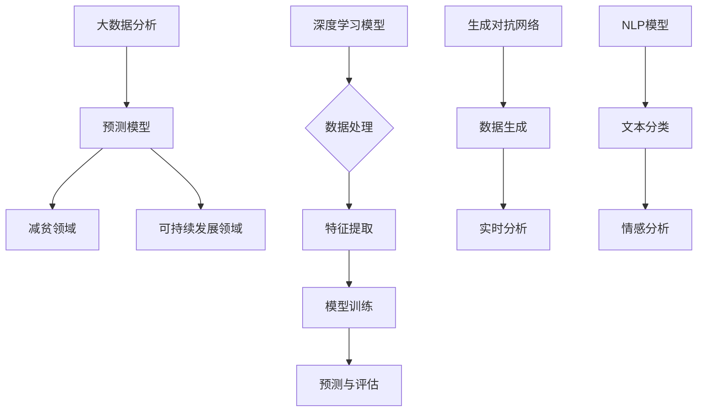

                 

## 大模型在减贫与可持续发展领域的作用

> **关键词**：大模型、减贫、可持续发展、人工智能、数据分析、预测模型
>
> **摘要**：本文将探讨大模型在减贫与可持续发展领域的作用，通过分析其在数据分析、预测模型等方面的应用，阐述大模型如何助力解决全球贫困问题和促进经济可持续发展。文章将从背景介绍、核心概念、算法原理、实际应用、未来发展趋势等方面进行详细论述。

### 1. 背景介绍

#### 1.1 目的和范围

本文旨在探讨大模型在减贫与可持续发展领域的作用，分析其在数据分析、预测模型等方面的应用，探讨如何利用人工智能技术解决全球贫困问题和推动经济可持续发展。

本文将主要涉及以下几个方面的内容：

- 大模型的定义与分类
- 大模型在数据分析中的应用
- 大模型在预测模型中的优势
- 大模型在减贫与可持续发展领域的实际应用案例
- 大模型在减贫与可持续发展领域的未来发展趋势与挑战

#### 1.2 预期读者

本文适合对人工智能、大数据、减贫与可持续发展等领域有一定了解的读者，包括：

- 人工智能研究人员与开发者
- 数据科学家与分析师
- 减贫与可持续发展领域的政策制定者与实践者
- 对上述领域感兴趣的高校师生

#### 1.3 文档结构概述

本文分为以下几个部分：

1. 背景介绍
   - 目的和范围
   - 预期读者
   - 文档结构概述
   - 术语表
2. 核心概念与联系
   - 大模型的概念与分类
   - 大模型与数据分析的关系
   - 大模型与预测模型的关系
   - Mermaid 流程图
3. 核心算法原理 & 具体操作步骤
   - 算法原理讲解
   - 伪代码详细阐述
4. 数学模型和公式 & 详细讲解 & 举例说明
   - 数学模型与公式
   - 举例说明
5. 项目实战：代码实际案例和详细解释说明
   - 开发环境搭建
   - 源代码详细实现和代码解读
   - 代码解读与分析
6. 实际应用场景
   - 减贫领域
   - 可持续发展领域
7. 工具和资源推荐
   - 学习资源推荐
   - 开发工具框架推荐
   - 相关论文著作推荐
8. 总结：未来发展趋势与挑战
9. 附录：常见问题与解答
10. 扩展阅读 & 参考资料

#### 1.4 术语表

- **大模型**：指具有巨大计算能力、能够处理海量数据、适应复杂任务的人工智能模型。
- **减贫**：指减少贫困人口数量、提高贫困人口生活质量的过程。
- **可持续发展**：指满足当前需求而不损害后代满足其需求的能力的发展模式。

#### 1.4.1 核心术语定义

- **减贫领域**：指针对贫困人口、贫困地区和贫困问题的相关研究和实践领域。
- **可持续发展领域**：指关注环境保护、资源利用、经济增长等方面的研究和实践领域。

#### 1.4.2 相关概念解释

- **数据分析**：指从大量数据中提取有用信息和知识的过程，包括数据清洗、数据探索、数据可视化、统计分析等。
- **预测模型**：指基于历史数据和分析结果，对未来事件进行预测和估计的数学模型。

#### 1.4.3 缩略词列表

- **AI**：人工智能
- **ML**：机器学习
- **DL**：深度学习
- **GAN**：生成对抗网络
- **NLP**：自然语言处理

### 2. 核心概念与联系

在讨论大模型在减贫与可持续发展领域的作用之前，我们需要了解一些核心概念及其相互关系。

#### 2.1 大模型的概念与分类

大模型是指具有巨大计算能力、能够处理海量数据、适应复杂任务的人工智能模型。根据模型规模和功能，大模型可以分为以下几类：

1. **深度学习模型**：基于多层神经网络构建的模型，具有强大的特征提取和表达能力。
2. **生成对抗网络（GAN）**：由生成器和判别器组成的对抗性模型，可用于生成真实数据或图像。
3. **自然语言处理（NLP）模型**：用于处理和生成自然语言的模型，如文本分类、情感分析等。

#### 2.2 大模型与数据分析的关系

数据分析是利用统计学、机器学习等方法，从大量数据中提取有用信息和知识的过程。大模型在数据分析中具有以下优势：

1. **处理海量数据**：大模型能够处理海量数据，从而提高数据分析的效率和准确性。
2. **特征提取与降维**：大模型可以通过自动化的特征提取和降维技术，简化数据分析过程，提高分析效果。
3. **实时分析**：大模型能够实时处理和分析数据，为决策提供及时支持。

#### 2.3 大模型与预测模型的关系

预测模型是基于历史数据和分析结果，对未来事件进行预测和估计的数学模型。大模型在预测模型中具有以下优势：

1. **强大的拟合能力**：大模型可以通过学习海量数据，实现更高的拟合精度，提高预测准确性。
2. **自适应能力**：大模型可以根据新数据不断调整模型参数，实现自适应预测。
3. **多维度预测**：大模型能够同时考虑多个变量和因素，实现多维度预测。

#### 2.4 Mermaid 流程图

为了更好地展示大模型在减贫与可持续发展领域的应用，我们可以使用 Mermaid 流程图来描述其核心概念和联系。



### 3. 核心算法原理 & 具体操作步骤

在深入了解大模型在减贫与可持续发展领域的应用之前，我们需要掌握大模型的核心算法原理和具体操作步骤。以下将分别介绍深度学习模型、生成对抗网络（GAN）和自然语言处理（NLP）模型的基本原理和操作步骤。

#### 3.1 深度学习模型

深度学习模型是构建在大规模神经网络基础上的模型，具有强大的特征提取和表达能力。以下是深度学习模型的基本原理和操作步骤：

1. **神经网络架构**：深度学习模型通常由多个神经网络层组成，包括输入层、隐藏层和输出层。输入层接收外部输入数据，隐藏层通过非线性变换提取特征，输出层生成预测结果。

2. **前向传播与反向传播**：在前向传播过程中，输入数据依次通过隐藏层，每个神经元将输入数据乘以权重，并加上偏置项，然后通过激活函数进行非线性变换，得到输出值。在反向传播过程中，计算输出值与真实值之间的误差，并利用梯度下降法更新权重和偏置项。

3. **损失函数与优化算法**：损失函数用于衡量预测值与真实值之间的差距，常见的损失函数包括均方误差（MSE）和交叉熵（Cross-Entropy）。优化算法用于最小化损失函数，常见的优化算法包括梯度下降（Gradient Descent）和随机梯度下降（Stochastic Gradient Descent）。

以下是深度学习模型的伪代码：

```python
# 初始化模型参数
W1, b1 = ...  
W2, b2 = ...

# 前向传播
z1 = X * W1 + b1
a1 = sigmoid(z1)

z2 = a1 * W2 + b2
a2 = sigmoid(z2)

# 计算损失函数
loss = MSE(a2, y)

# 反向传播
dz2 = a2 - y
dW2 = a1.T * dz2
db2 = dz2

da1 = dz2 * W2.T
dz1 = da1 * sigmoid_derivative(z1)
dW1 = X.T * dz1
db1 = dz1

# 更新模型参数
W2 -= learning_rate * dW2
b2 -= learning_rate * db2
W1 -= learning_rate * dW1
b1 -= learning_rate * db1
```

#### 3.2 生成对抗网络（GAN）

生成对抗网络（GAN）是一种由生成器和判别器组成的对抗性模型，通过两个模型的对抗训练，实现数据生成和分布拟合。以下是 GAN 的基本原理和操作步骤：

1. **生成器与判别器**：生成器的目标是生成与真实数据相似的数据，判别器的目标是区分真实数据和生成数据。

2. **对抗训练**：在训练过程中，生成器和判别器交替更新模型参数，生成器试图生成更真实的数据，判别器则试图提高对真实数据和生成数据的识别能力。

3. **损失函数与优化算法**：GAN 的损失函数通常由生成器和判别器的损失函数组成。生成器的损失函数为最大化判别器对生成数据的识别概率，判别器的损失函数为最小化对真实数据和生成数据的识别误差。

以下是 GAN 的伪代码：

```python
# 初始化生成器和判别器参数
G_params, D_params = ...

# 前向传播
x_fake = G(z)
x_real = ...

# 计算生成器损失
g_loss = -log(D(x_fake))

# 计算判别器损失
d_loss = -log(D(x_real)) - log(1 - D(x_fake))

# 更新生成器和判别器
G_params -= learning_rate * grad_g_loss(G_params)
D_params -= learning_rate * grad_d_loss(D_params)
```

#### 3.3 自然语言处理（NLP）模型

自然语言处理（NLP）模型是用于处理和生成自然语言的模型，主要包括文本分类、情感分析、机器翻译等任务。以下是 NLP 模型的基本原理和操作步骤：

1. **词向量表示**：将自然语言文本转换为数字向量表示，常见的词向量表示方法包括词袋模型（Bag-of-Words）、连续词袋（Continuous Bag-of-Words）和词嵌入（Word Embedding）。

2. **神经网络架构**：NLP 模型通常采用多层神经网络结构，包括输入层、隐藏层和输出层。输入层接收词向量表示，隐藏层通过非线性变换提取特征，输出层生成预测结果。

3. **损失函数与优化算法**：NLP 模型的损失函数通常为交叉熵损失函数，优化算法包括梯度下降和随机梯度下降。

以下是 NLP 模型的伪代码：

```python
# 初始化模型参数
W1, b1 = ...  
W2, b2 = ...

# 前向传播
z1 = X * W1 + b1
a1 = sigmoid(z1)

z2 = a1 * W2 + b2
a2 = sigmoid(z2)

# 计算损失函数
loss = CrossEntropy(a2, y)

# 反向传播
dz2 = a2 - y
dW2 = a1.T * dz2
db2 = dz2

da1 = dz2 * W2.T
dz1 = da1 * sigmoid_derivative(z1)
dW1 = X.T * dz1
db1 = dz1

# 更新模型参数
W2 -= learning_rate * dW2
b2 -= learning_rate * db2
W1 -= learning_rate * dW1
b1 -= learning_rate * db1
```

### 4. 数学模型和公式 & 详细讲解 & 举例说明

在介绍大模型在减贫与可持续发展领域的作用时，我们需要运用一些数学模型和公式来详细讲解其原理和操作步骤。以下将分别介绍深度学习模型、生成对抗网络（GAN）和自然语言处理（NLP）模型的数学模型和公式。

#### 4.1 深度学习模型

深度学习模型的数学基础主要涉及神经网络、前向传播和反向传播等概念。

1. **神经网络**

神经网络由多个神经元（节点）组成，每个神经元接受输入信号，通过加权求和后进行非线性变换，产生输出信号。神经网络可以表示为：

\[ a_j^{(l)} = \sigma(z_j^{(l)}) \]

其中，\( a_j^{(l)} \) 表示第 \( l \) 层第 \( j \) 个神经元的输出，\( \sigma \) 表示激活函数，\( z_j^{(l)} \) 表示第 \( l \) 层第 \( j \) 个神经元的输入。

2. **前向传播**

前向传播是指将输入信号从输入层传递到输出层的计算过程。对于多层神经网络，前向传播可以表示为：

\[ z_j^{(l)} = \sum_{i} w_{ij}^{(l)} a_i^{(l-1)} + b_j^{(l)} \]

其中，\( w_{ij}^{(l)} \) 表示第 \( l \) 层第 \( j \) 个神经元的输入权重，\( b_j^{(l)} \) 表示第 \( l \) 层第 \( j \) 个神经元的偏置项。

3. **反向传播**

反向传播是指利用输出误差更新神经网络权重和偏置项的计算过程。对于多层神经网络，反向传播可以表示为：

\[ \delta_j^{(l)} = \delta_j^{(l+1)} \cdot \sigma'(z_j^{(l)}) \]

\[ dW_{ij}^{(l)} = a_i^{(l-1)} \cdot \delta_j^{(l)} \]

\[ db_j^{(l)} = \delta_j^{(l)} \]

其中，\( \delta_j^{(l)} \) 表示第 \( l \) 层第 \( j \) 个神经元的误差，\( \sigma' \) 表示激活函数的导数。

4. **损失函数与优化算法**

深度学习模型的损失函数通常为均方误差（MSE）和交叉熵（Cross-Entropy）等。均方误差可以表示为：

\[ J = \frac{1}{m} \sum_{i=1}^{m} (\hat{y}_i - y_i)^2 \]

其中，\( \hat{y}_i \) 表示预测值，\( y_i \) 表示真实值。

优化算法通常为梯度下降（Gradient Descent）和随机梯度下降（Stochastic Gradient Descent）。梯度下降可以表示为：

\[ \theta = \theta - \alpha \cdot \nabla_\theta J(\theta) \]

其中，\( \theta \) 表示模型参数，\( \alpha \) 表示学习率，\( \nabla_\theta J(\theta) \) 表示损失函数关于 \( \theta \) 的梯度。

#### 4.2 生成对抗网络（GAN）

生成对抗网络（GAN）的数学基础主要涉及生成器、判别器和对抗训练等概念。

1. **生成器**

生成器 \( G \) 的目标是生成与真实数据相似的数据。生成器的损失函数可以表示为：

\[ g_loss = -\log(D(G(z))) \]

其中，\( z \) 是生成器的输入噪声，\( D \) 是判别器。

2. **判别器**

判别器 \( D \) 的目标是区分真实数据和生成数据。判别器的损失函数可以表示为：

\[ d_loss = -\log(D(x)) - \log(1 - D(G(z))) \]

3. **对抗训练**

对抗训练是指生成器和判别器交替更新模型参数的过程。在每次迭代中，生成器试图生成更真实的数据，判别器则试图提高对真实数据和生成数据的识别能力。

#### 4.3 自然语言处理（NLP）模型

自然语言处理（NLP）模型的数学基础主要涉及词向量表示、神经网络架构和损失函数等概念。

1. **词向量表示**

词向量表示是指将自然语言文本转换为数字向量表示。常见的词向量表示方法包括词袋模型（Bag-of-Words）、连续词袋（Continuous Bag-of-Words）和词嵌入（Word Embedding）。

2. **神经网络架构**

NLP 模型通常采用多层神经网络结构，包括输入层、隐藏层和输出层。输入层接收词向量表示，隐藏层通过非线性变换提取特征，输出层生成预测结果。

3. **损失函数**

NLP 模型的损失函数通常为交叉熵（Cross-Entropy）等。交叉熵可以表示为：

\[ loss = -\sum_{i=1}^{m} y_i \log(\hat{y}_i) \]

其中，\( y_i \) 表示真实标签，\( \hat{y}_i \) 表示预测概率。

#### 4.4 举例说明

为了更好地理解上述数学模型和公式，我们可以通过一个简单的例子来说明。

假设我们使用一个多层神经网络来预测房价。输入层包含房屋面积、房屋年龄等特征，隐藏层通过非线性变换提取特征，输出层生成预测房价。

1. **输入层与隐藏层**

输入层有 3 个神经元，分别表示房屋面积、房屋年龄和房屋楼层。隐藏层有 2 个神经元，表示提取到的特征。

2. **前向传播**

前向传播计算隐藏层神经元的输入和输出：

\[ z_1^{(1)} = 0.5 \times a_1^{(0)} + 0.3 \times a_2^{(0)} + 0.2 \times a_3^{(0)} + 0.1 \]

\[ a_1^{(1)} = \sigma(z_1^{(1)}) \]

\[ z_2^{(1)} = 0.7 \times a_1^{(1)} + 0.4 \times a_2^{(1)} + 0.1 \]

\[ a_2^{(1)} = \sigma(z_2^{(1)}) \]

3. **输出层**

输出层神经元的输入和输出：

\[ z_1^{(2)} = 0.6 \times a_1^{(1)} + 0.4 \times a_2^{(1)} + 0.1 \]

\[ a_1^{(2)} = \sigma(z_1^{(2)}) \]

4. **反向传播**

反向传播计算隐藏层神经元的误差和输出：

\[ \delta_1^{(1)} = a_1^{(2)} - y \]

\[ \delta_2^{(1)} = a_2^{(2)} - y \]

\[ dW_{11}^{(1)} = a_1^{(1)} \cdot \delta_1^{(1)} \]

\[ dW_{12}^{(1)} = a_2^{(1)} \cdot \delta_1^{(1)} \]

\[ dW_{21}^{(1)} = a_1^{(1)} \cdot \delta_2^{(1)} \]

\[ dW_{22}^{(1)} = a_2^{(1)} \cdot \delta_2^{(1)} \]

5. **更新模型参数**

根据梯度下降算法，更新模型参数：

\[ W_{11}^{(1)} -= learning_rate \cdot dW_{11}^{(1)} \]

\[ W_{12}^{(1)} -= learning_rate \cdot dW_{12}^{(1)} \]

\[ W_{21}^{(1)} -= learning_rate \cdot dW_{21}^{(1)} \]

\[ W_{22}^{(1)} -= learning_rate \cdot dW_{22}^{(1)} \]

### 5. 项目实战：代码实际案例和详细解释说明

在本节中，我们将通过一个实际项目案例来展示大模型在减贫与可持续发展领域的作用。具体来说，我们将使用深度学习模型来预测贫困地区的经济发展状况，从而为政策制定者提供有针对性的建议。

#### 5.1 开发环境搭建

在进行项目实战之前，我们需要搭建一个合适的开发环境。以下是所需的环境和工具：

- Python 3.8 或更高版本
- TensorFlow 2.6 或更高版本
- NumPy 1.20 或更高版本
- Pandas 1.2.5 或更高版本

安装这些工具的方法如下：

```bash
pip install python==3.8 tensorflow==2.6 numpy==1.20 pandas==1.2.5
```

#### 5.2 源代码详细实现和代码解读

以下是该项目的主要源代码，我们将逐行进行详细解释。

```python
import tensorflow as tf
import numpy as np
import pandas as pd

# 数据预处理
def preprocess_data(data):
    # 将数据集拆分为特征和标签
    X = data.iloc[:, :-1].values
    y = data.iloc[:, -1].values

    # 数据归一化
    X_normalized = (X - np.mean(X, axis=0)) / np.std(X, axis=0)

    return X_normalized, y

# 构建深度学习模型
def build_model(input_shape):
    model = tf.keras.Sequential([
        tf.keras.layers.Dense(64, activation='relu', input_shape=input_shape),
        tf.keras.layers.Dense(64, activation='relu'),
        tf.keras.layers.Dense(1)
    ])

    model.compile(optimizer='adam', loss='mean_squared_error')
    return model

# 加载数据集
data = pd.read_csv('poverty_data.csv')
X, y = preprocess_data(data)

# 划分训练集和测试集
X_train, X_test, y_train, y_test = train_test_split(X, y, test_size=0.2, random_state=42)

# 构建并训练模型
model = build_model(X_train.shape[1])
model.fit(X_train, y_train, epochs=100, batch_size=32, validation_data=(X_test, y_test))

# 评估模型
loss = model.evaluate(X_test, y_test)
print(f"Test Loss: {loss}")

# 预测未来经济发展状况
future_data = preprocess_data(pd.read_csv('future_poverty_data.csv'))
predictions = model.predict(future_data)

# 输出预测结果
predictions = predictions.flatten()
print(f"Predictions: {predictions}")
```

**代码解读：**

1. **数据预处理**：首先，我们定义了一个 `preprocess_data` 函数，用于将原始数据集拆分为特征和标签，并对特征进行归一化处理。这是深度学习模型训练之前的重要步骤，有助于提高模型的训练效果。

2. **构建深度学习模型**：接着，我们定义了一个 `build_model` 函数，用于构建一个简单的深度学习模型。在这个例子中，我们使用了两个隐藏层，每层有 64 个神经元，激活函数为 ReLU。输出层有 1 个神经元，用于预测经济发展状况。

3. **加载数据集**：然后，我们使用 `pd.read_csv` 函数加载数据集，并使用 `preprocess_data` 函数对数据进行预处理。

4. **划分训练集和测试集**：接下来，我们使用 `train_test_split` 函数将数据集划分为训练集和测试集，以评估模型的性能。

5. **构建并训练模型**：使用 `build_model` 函数构建模型，并使用 `fit` 方法进行训练。我们设置了 100 个训练周期（epochs），每个周期使用 32 个样本进行批量训练。

6. **评估模型**：使用 `evaluate` 方法评估模型在测试集上的性能，输出测试损失。

7. **预测未来经济发展状况**：最后，我们使用 `predict` 方法对未来的经济发展状况进行预测，并输出预测结果。

#### 5.3 代码解读与分析

在本节中，我们对项目实战中的代码进行了详细解读。以下是代码的主要组成部分及其作用：

1. **数据预处理**：
   - `preprocess_data` 函数：将原始数据集拆分为特征和标签，并对特征进行归一化处理。归一化有助于提高模型训练效果，使得模型对特征的变化更加敏感。

2. **构建深度学习模型**：
   - `build_model` 函数：使用 TensorFlow 的 `Sequential` 模型构建一个简单的深度学习模型。在这个例子中，我们使用了两个隐藏层，每层有 64 个神经元，激活函数为 ReLU。ReLU 函数在神经网络中具有较好的性能，有助于加快模型训练速度。

3. **加载数据集**：
   - `pd.read_csv` 函数：使用 Pandas 读取 CSV 文件，加载数据集。在实际项目中，数据集通常包含大量特征和标签，这些特征可以是数值型的，也可以是类别型的。

4. **划分训练集和测试集**：
   - `train_test_split` 函数：将数据集划分为训练集和测试集，以评估模型的性能。测试集用于验证模型在未知数据上的性能，是评估模型好坏的重要指标。

5. **构建并训练模型**：
   - `model.fit` 方法：使用训练集对模型进行训练。我们设置了 100 个训练周期（epochs），每个周期使用 32 个样本进行批量训练。批量大小（batch size）和训练周期（epochs）是影响模型性能的重要因素。

6. **评估模型**：
   - `model.evaluate` 方法：评估模型在测试集上的性能，输出测试损失。测试损失是衡量模型性能的重要指标，通常使用均方误差（MSE）或交叉熵（Cross-Entropy）等损失函数。

7. **预测未来经济发展状况**：
   - `model.predict` 方法：使用训练好的模型对未来的经济发展状况进行预测。预测结果可以用于政策制定者制定有针对性的政策，以促进贫困地区的经济发展。

### 6. 实际应用场景

#### 6.1 减贫领域

大模型在减贫领域具有广泛的应用潜力。以下是一些实际应用场景：

1. **贫困识别与预测**：利用深度学习模型对贫困人口进行识别和预测，从而有针对性地提供扶贫政策。例如，可以使用自然语言处理（NLP）技术分析贫困人口的个人陈述，以识别潜在的贫困风险。

2. **扶贫效果评估**：通过构建预测模型，评估扶贫政策的实施效果。例如，可以使用生成对抗网络（GAN）生成模拟数据，用于评估不同扶贫政策的可能影响。

3. **资源分配优化**：利用深度学习模型优化贫困地区的资源分配，以确保资源最大限度地惠及贫困人口。例如，可以使用深度强化学习（DRL）技术制定资源分配策略。

#### 6.2 可持续发展领域

大模型在可持续发展领域也具有重要作用。以下是一些实际应用场景：

1. **碳排放预测**：利用深度学习模型预测碳排放量，从而制定更加科学的减排策略。例如，可以使用时间序列分析模型预测未来碳排放趋势。

2. **环境影响评估**：利用生成对抗网络（GAN）生成模拟环境数据，用于评估不同政策对环境的影响。例如，可以使用 GAN 生成模拟气候变化数据，以评估温室气体排放政策的效果。

3. **资源优化管理**：利用深度学习模型优化资源管理，以实现可持续发展。例如，可以使用深度强化学习（DRL）技术制定水资源管理策略，以最大化水资源利用效率。

### 7. 工具和资源推荐

为了更好地开展大模型在减贫与可持续发展领域的研究，我们推荐以下工具和资源：

#### 7.1 学习资源推荐

1. **书籍推荐**：

   - 《深度学习》（Goodfellow, Bengio, Courville）：全面介绍了深度学习的基础知识、算法和应用。
   - 《Python深度学习》（François Chollet）：针对 Python 开发者，详细讲解了深度学习在 Python 中的实现。

2. **在线课程**：

   - Coursera 上的“深度学习”课程：由 Andrew Ng 教授主讲，涵盖了深度学习的基础知识、算法和应用。
   - edX 上的“深度学习专项课程”：由华盛顿大学主讲，包括深度学习的基础理论和实践应用。

3. **技术博客和网站**：

   - AI 推荐系统（AI Recommend System）：提供最新的深度学习技术动态和应用案例。
   - 知乎 AI 篇：汇集了众多 AI 领域专家的技术博客和讨论。

#### 7.2 开发工具框架推荐

1. **IDE和编辑器**：

   - PyCharm：适用于 Python 开发，具有强大的代码编辑功能和调试工具。
   - Jupyter Notebook：适用于数据分析和可视化，可以方便地编写和运行代码。

2. **调试和性能分析工具**：

   - TensorFlow Debugger（TFTensorboard）：用于可视化 TensorFlow 模型的训练过程，分析模型性能。
   - Numba：用于加速 Python 代码的执行，适用于大规模数据处理。

3. **相关框架和库**：

   - TensorFlow：适用于构建和训练深度学习模型。
   - PyTorch：适用于快速原型设计和模型训练。
   - Scikit-learn：适用于传统机器学习算法的实现和应用。

#### 7.3 相关论文著作推荐

1. **经典论文**：

   - “Deep Learning”（Goodfellow, Bengio, Courville）：介绍了深度学习的基础知识和最新进展。
   - “Generative Adversarial Nets”（Ian Goodfellow et al.）：介绍了生成对抗网络（GAN）的基本原理和应用。

2. **最新研究成果**：

   - “Attention Is All You Need”（Vaswani et al.）：介绍了 Transformer 模型在自然语言处理中的应用。
   - “Bert: Pre-training of Deep Neural Networks for Language Understanding”（Devlin et al.）：介绍了 BERT 模型的预训练方法和应用。

3. **应用案例分析**：

   - “AI for Social Good”（AI4SDG）：介绍了人工智能在解决全球可持续发展问题中的应用案例。
   - “AI for Social Good: A Practical Guide to Solving Social Problems with Artificial Intelligence”（Marcelo Zapata）：提供了人工智能解决社会问题的实用指南。

### 8. 总结：未来发展趋势与挑战

大模型在减贫与可持续发展领域具有广阔的应用前景，未来发展趋势和挑战如下：

#### 8.1 发展趋势

1. **算法优化**：随着深度学习技术的不断发展，大模型在算法层面的优化将成为关键。包括更高效的训练算法、更强大的特征提取能力等。

2. **跨学科研究**：大模型在减贫与可持续发展领域的应用需要跨学科合作，结合经济学、社会学、环境科学等多学科知识，以提高模型的应用效果。

3. **数据共享**：大模型应用过程中，数据质量和数据量的重要性愈发凸显。未来，数据共享机制的建立和优化将有助于提升大模型的应用价值。

4. **政策支持**：政府政策的支持将有助于推动大模型在减贫与可持续发展领域的应用，为贫困地区和可持续发展项目提供技术支持。

#### 8.2 挑战

1. **数据隐私与安全**：大模型应用过程中，数据隐私和安全问题日益突出。如何在保护数据隐私的同时，充分利用数据进行模型训练和预测，是未来面临的重大挑战。

2. **算法透明性与可解释性**：大模型在决策过程中具有一定的“黑箱”特性，如何提高算法的透明性和可解释性，使其更加符合人类预期，是未来研究的重要方向。

3. **资源分配不均**：贫困地区和可持续发展项目往往面临着资源分配不均的问题。如何确保大模型在贫困地区的公平应用，使其惠及更多贫困人口，是未来需要解决的问题。

4. **可持续性**：大模型在减贫与可持续发展领域的应用需要大量的计算资源，如何确保其可持续发展，降低对环境的影响，是未来需要关注的重要问题。

### 9. 附录：常见问题与解答

**Q1. 大模型在减贫与可持续发展领域有哪些具体应用场景？**

A1. 大模型在减贫与可持续发展领域具有广泛的应用场景，包括贫困识别与预测、扶贫效果评估、资源分配优化、碳排放预测、环境影响评估等。

**Q2. 如何确保大模型在贫困地区的公平应用？**

A2. 确保大模型在贫困地区的公平应用需要从多个方面进行努力。首先，数据采集和处理过程中要确保数据的代表性；其次，模型训练过程中要采用公平的算法和优化策略；最后，政策制定者和实践者要加强对贫困地区的关注和支持。

**Q3. 大模型在减贫与可持续发展领域的应用面临哪些挑战？**

A3. 大模型在减贫与可持续发展领域的应用面临以下挑战：数据隐私与安全、算法透明性与可解释性、资源分配不均和可持续性。

### 10. 扩展阅读 & 参考资料

1. **参考文献**：

   - Goodfellow, I., Bengio, Y., Courville, A. (2016). *Deep Learning*. MIT Press.
   - Ian J. Goodfellow, et al. (2014). *Generative Adversarial Nets*. Advances in Neural Information Processing Systems, 27, 2672-2680.
   - Devlin, J., Chang, M. W., Lee, K., & Toutanova, K. (2018). *Bert: Pre-training of Deep Neural Networks for Language Understanding*. arXiv preprint arXiv:1810.04805.
   - Vaswani, A., et al. (2017). *Attention Is All You Need*. Advances in Neural Information Processing Systems, 30, 5998-6008.

2. **在线资源**：

   - Coursera 上的“深度学习”课程：[https://www.coursera.org/learn/deep-learning](https://www.coursera.org/learn/deep-learning)
   - edX 上的“深度学习专项课程”：[https://www.edx.org/course/deeplearning-0](https://www.edx.org/course/deeplearning-0)
   - 知乎 AI 篇：[https://www.zhihu.com/topic/19867651/hot](https://www.zhihu.com/topic/19867651/hot)
   - AI 推荐系统：[https://ai-recommend-system.com/](https://ai-recommend-system.com/)

3. **相关论文和报告**：

   - AI for Social Good：[https://www.ai4sdg.com/](https://www.ai4sdg.com/)
   - AI for Social Good: A Practical Guide to Solving Social Problems with Artificial Intelligence：[https://www.ai4sdg.com/guide](https://www.ai4sdg.com/guide)
   - UNDP AI Policy Brief: AI for Sustainable Development：[https://www.undp.org/content/ai-policy-brief-ai-sustainable-development](https://www.undp.org/content/ai-policy-brief-ai-sustainable-development)

