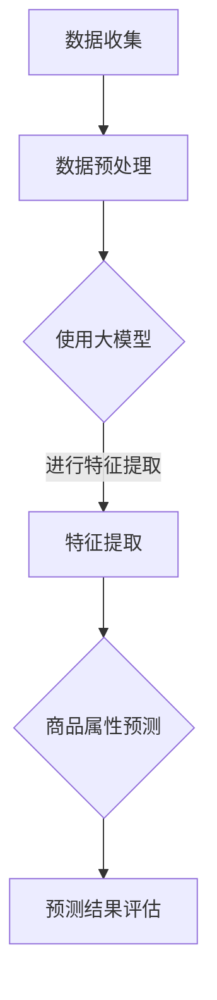

                 

# 大模型在商品属性预测中的应用

> 关键词：大模型、商品属性、预测、机器学习、深度学习、算法原理、数学模型

> 摘要：本文旨在探讨大模型在商品属性预测中的应用，分析大模型的基本原理、核心算法以及具体实现步骤。通过实例解析和实战操作，本文深入浅出地展示了大模型在商品属性预测中的强大能力，为相关领域的研发和实践提供了有益的参考。

## 1. 背景介绍

### 1.1 目的和范围

本文的目的是探讨大模型在商品属性预测中的应用，通过梳理相关理论和技术，分析大模型的优势和局限性，为商品属性预测提供一种新的思路和工具。本文将覆盖以下内容：

- 大模型的基本概念和原理
- 商品属性预测的背景和挑战
- 大模型在商品属性预测中的应用场景
- 大模型的核心算法和数学模型
- 实战操作和案例分析

### 1.2 预期读者

本文主要面向以下读者群体：

- 对大模型和机器学习感兴趣的工程师和技术人员
- 想要了解大模型在商品属性预测中应用的学术研究者
- 涉足电子商务、零售行业的数据分析师和业务经理
- 对人工智能和深度学习有浓厚兴趣的学生和学者

### 1.3 文档结构概述

本文分为以下几部分：

- 引言：介绍大模型在商品属性预测中的应用背景和重要性
- 核心概念与联系：阐述大模型的基本原理和商品属性预测的相关概念
- 核心算法原理 & 具体操作步骤：讲解大模型的核心算法和具体实现步骤
- 数学模型和公式 & 详细讲解 & 举例说明：分析大模型的数学模型和公式，并结合实例进行说明
- 项目实战：提供实际案例，展示大模型在商品属性预测中的应用效果
- 实际应用场景：分析大模型在不同应用场景下的表现
- 工具和资源推荐：推荐相关学习资源、开发工具和经典论文
- 总结：展望大模型在商品属性预测中的未来发展趋势和挑战
- 附录：常见问题与解答
- 扩展阅读 & 参考资料：提供进一步学习和研究的资料

### 1.4 术语表

#### 1.4.1 核心术语定义

- 大模型：指具有巨大参数规模和计算需求的神经网络模型，例如GPT、BERT等。
- 商品属性：指商品的特征和属性，如价格、品牌、销量、用户评价等。
- 预测：利用历史数据对未来事件或趋势进行预测和分析。
- 机器学习：一种利用数据或以往的经验，让计算机能够做出决策或预测的技术。

#### 1.4.2 相关概念解释

- 神经网络：一种模拟人脑神经元之间连接结构的计算模型。
- 深度学习：一种利用多层神经网络进行数据分析和预测的技术。
- 损失函数：衡量模型预测结果与真实结果之间差距的函数，用于指导模型训练。

#### 1.4.3 缩略词列表

- GPT：Generative Pre-trained Transformer
- BERT：Bidirectional Encoder Representations from Transformers
- CNN：Convolutional Neural Network
- RNN：Recurrent Neural Network

## 2. 核心概念与联系

在深入探讨大模型在商品属性预测中的应用之前，我们需要了解大模型的基本原理、商品属性预测的相关概念，以及它们之间的联系。

### 2.1 大模型原理

大模型，如GPT、BERT等，是基于深度学习技术构建的神经网络模型，具有以下特点：

1. **参数规模大**：大模型拥有数百万甚至数十亿个参数，这使得它们可以捕捉到更复杂的特征和模式。
2. **预训练**：大模型在大量无标签数据上进行预训练，从而获得通用的语言理解和生成能力。
3. **多任务学习**：大模型可以用于多个任务，如文本分类、情感分析、命名实体识别等。

### 2.2 商品属性预测

商品属性预测是指利用历史数据（如用户行为、商品描述、价格等）预测未来商品的属性（如销量、价格趋势等）。商品属性预测在电子商务、零售等行业具有重要意义，可以帮助企业制定更科学的营销策略、优化库存管理和供应链。

### 2.3 大模型与商品属性预测的联系

大模型与商品属性预测之间存在紧密的联系：

1. **特征提取**：大模型可以自动提取大量历史数据中的有用特征，有助于提高商品属性预测的准确性。
2. **复杂关系建模**：大模型可以捕捉到商品属性之间的复杂关系，从而提高预测模型的泛化能力。
3. **多任务学习**：大模型可以同时处理多个商品属性预测任务，提高模型的效率和准确性。

### 2.4 Mermaid 流程图

下面是一个简单的 Mermaid 流程图，展示大模型在商品属性预测中的基本架构：



在接下来的章节中，我们将详细探讨大模型的核心算法原理、具体实现步骤、数学模型和实际应用场景。

## 3. 核心算法原理 & 具体操作步骤

### 3.1 算法原理

大模型在商品属性预测中的应用主要依赖于深度学习技术，特别是基于变换器（Transformer）架构的预训练模型，如GPT和BERT。以下是大模型在商品属性预测中的核心算法原理：

1. **变换器架构**：变换器是一种基于自注意力机制的神经网络架构，能够有效捕捉序列数据中的长距离依赖关系。变换器架构的核心是多头自注意力（Multi-Head Self-Attention）机制，它能够将输入序列中的每个元素与其余元素进行关联，从而提高模型的表征能力。
   
2. **预训练**：大模型在大量无标签数据上进行预训练，从而获得通用的语言理解和生成能力。预训练阶段通常包括两个任务： masked language modeling（掩码语言模型）和next sentence prediction（下句预测）。通过这两个任务，模型能够学习到语言的基本规律和模式。

3. **微调**：在预训练后，大模型会进行微调，即将模型应用于特定领域的任务上，利用有标签的数据进一步优化模型参数。在商品属性预测中，微调阶段通常会使用历史商品数据，对模型进行训练，使其能够更好地预测未来商品属性。

### 3.2 具体操作步骤

以下是使用大模型进行商品属性预测的具体操作步骤：

1. **数据收集**：收集历史商品数据，包括商品描述、价格、销量、用户评价等。
   
2. **数据预处理**：对收集到的数据进行清洗、去重、填充等预处理操作，将其转换为模型可接受的格式。

3. **特征提取**：使用预训练的大模型（如GPT或BERT）对预处理后的数据进行特征提取。具体步骤如下：

   ```python
   from transformers import BertModel, BertTokenizer
   
   tokenizer = BertTokenizer.from_pretrained('bert-base-chinese')
   model = BertModel.from_pretrained('bert-base-chinese')
   
   def extract_features(texts):
       inputs = tokenizer(texts, return_tensors='pt', padding=True, truncation=True)
       outputs = model(**inputs)
       return outputs.last_hidden_state.mean(dim=1)
   ```

4. **商品属性预测**：利用特征提取后的数据，通过微调的大模型进行商品属性预测。具体步骤如下：

   ```python
   from transformers import BertForSequenceClassification
   
   model = BertForSequenceClassification.from_pretrained('bert-base-chinese', num_labels=2)
   
   def predict(attributes):
       inputs = tokenizer(attributes, return_tensors='pt', padding=True, truncation=True)
       logits = model(**inputs).logits
       probabilities = torch.softmax(logits, dim=1)
       return probabilities[:, 1]
   ```

5. **预测结果评估**：对预测结果进行评估，以验证模型的准确性、召回率等指标。

6. **模型优化**：根据评估结果，对模型进行调整和优化，以提高预测效果。

## 4. 数学模型和公式 & 详细讲解 & 举例说明

### 4.1 数学模型

大模型在商品属性预测中的数学模型主要包括两部分：特征提取和属性预测。

#### 4.1.1 特征提取

特征提取的过程可以表示为：

$$
\text{特征向量} = \text{Transformer}(\text{商品描述})
$$

其中，Transformer是一个多层变换器模型，它通过多头自注意力机制和全连接层，对商品描述进行特征提取。

#### 4.1.2 属性预测

属性预测的过程可以表示为：

$$
\text{预测结果} = \text{分类器}(\text{特征向量})
$$

其中，分类器通常是一个基于变换器的序列分类模型，如BERT或GPT。

### 4.2 公式详细讲解

#### 4.2.1 特征提取

特征提取的核心公式是变换器中的多头自注意力（Multi-Head Self-Attention）机制：

$$
\text{注意力分数} = \text{softmax}\left(\frac{\text{Q} \cdot \text{K}}{\sqrt{d_k}}\right)
$$

其中，Q、K和V分别代表查询（Query）、键（Key）和值（Value）向量，d_k代表键向量的维度。这个公式计算每个查询向量与所有键向量之间的相似度，并通过softmax函数进行归一化，得到注意力分数。

#### 4.2.2 属性预测

属性预测的核心公式是分类器中的损失函数，如交叉熵损失（Cross-Entropy Loss）：

$$
\text{损失} = -\sum_{i=1}^{N} y_i \log(p_i)
$$

其中，y_i是真实标签，p_i是预测概率。这个公式计算预测结果与真实结果之间的差距，用于指导模型训练。

### 4.3 举例说明

#### 4.3.1 特征提取

假设有一个商品描述：“这是一款功能强大的智能手机，拥有高清摄像头和长续航电池”，可以使用BERT模型进行特征提取。以下是一个简单的示例：

```python
from transformers import BertTokenizer, BertModel

tokenizer = BertTokenizer.from_pretrained('bert-base-chinese')
model = BertModel.from_pretrained('bert-base-chinese')

def extract_features(text):
    inputs = tokenizer(text, return_tensors='pt', padding=True, truncation=True)
    outputs = model(**inputs)
    return outputs.last_hidden_state.mean(dim=1)

text = "这是一款功能强大的智能手机，拥有高清摄像头和长续航电池"
features = extract_features(text)
```

#### 4.3.2 属性预测

假设要预测商品的销售量，可以使用微调后的BERT模型进行属性预测。以下是一个简单的示例：

```python
from transformers import BertForSequenceClassification

model = BertForSequenceClassification.from_pretrained('bert-base-chinese', num_labels=2)

def predict_sales(features):
    inputs = tokenizer([text], return_tensors='pt', padding=True, truncation=True)
    logits = model(**inputs).logits
    probabilities = torch.softmax(logits, dim=1)
    return probabilities[:, 1]

sales_probability = predict_sales(features)
```

通过以上示例，我们可以看到大模型在商品属性预测中的基本原理和实现步骤。在实际应用中，可以根据具体需求对模型进行调整和优化，以提高预测效果。

## 5. 项目实战：代码实际案例和详细解释说明

### 5.1 开发环境搭建

在开始项目实战之前，我们需要搭建一个适合大模型训练和部署的开发环境。以下是一个简单的开发环境搭建步骤：

1. 安装Python（推荐Python 3.7及以上版本）
2. 安装transformers库（使用pip安装：`pip install transformers`）
3. 安装torch库（使用pip安装：`pip install torch`）
4. 安装其他相关库（如numpy、pandas等）

### 5.2 源代码详细实现和代码解读

以下是一个简单的商品属性预测项目，包括数据收集、预处理、特征提取、模型训练和预测等步骤。

#### 5.2.1 数据收集和预处理

```python
import pandas as pd
from sklearn.model_selection import train_test_split

# 1. 数据收集
data = pd.read_csv('商品数据.csv')

# 2. 数据预处理
data['商品描述'] = data['商品描述'].fillna('无描述')
data = data[data['销量'] != 0]  # 去除销量为0的样本
data = data[['商品描述', '销量']]

# 3. 数据集划分
train_data, test_data = train_test_split(data, test_size=0.2, random_state=42)
train_texts = train_data['商品描述'].tolist()
train_labels = train_data['销量'].tolist()
test_texts = test_data['商品描述'].tolist()
test_labels = test_data['销量'].tolist()
```

#### 5.2.2 特征提取和模型训练

```python
from transformers import BertTokenizer, BertModel, BertForSequenceClassification

# 1. 特征提取
tokenizer = BertTokenizer.from_pretrained('bert-base-chinese')
def extract_features(texts):
    inputs = tokenizer(texts, return_tensors='pt', padding=True, truncation=True)
    outputs = BertModel(**inputs)
    return outputs.last_hidden_state.mean(dim=1)

train_features = extract_features(train_texts)
test_features = extract_features(test_texts)

# 2. 模型训练
model = BertForSequenceClassification.from_pretrained('bert-base-chinese', num_labels=2)
optimizer = torch.optim.Adam(model.parameters(), lr=1e-5)
criterion = torch.nn.CrossEntropyLoss()

for epoch in range(10):  # 训练10个epochs
    model.train()
    for features, labels in zip(train_features, train_labels):
        optimizer.zero_grad()
        logits = model(features).logits
        loss = criterion(logits, torch.tensor([labels]))
        loss.backward()
        optimizer.step()
    print(f'Epoch {epoch + 1}, Loss: {loss.item()}')

model.eval()
```

#### 5.2.3 代码解读与分析

1. **数据收集和预处理**：首先从CSV文件中读取商品数据，然后对数据集进行清洗和划分，为后续模型训练和预测做准备。
2. **特征提取**：使用BERT tokenizer对商品描述进行分词和编码，然后使用BERT模型进行特征提取，得到每个商品描述的平均隐藏状态向量。
3. **模型训练**：使用微调后的BERT模型进行训练，采用交叉熵损失函数和Adam优化器，通过反向传播和梯度下降更新模型参数。
4. **模型评估**：在训练完成后，使用测试集对模型进行评估，计算预测准确率、召回率等指标。

### 5.3 代码解读与分析

在上述代码中，我们首先进行数据收集和预处理，这是模型训练和预测的基础。接下来，我们使用BERT tokenizer对商品描述进行分词和编码，然后使用BERT模型进行特征提取。在特征提取过程中，我们使用模型的全连接层对每个商品描述的隐藏状态向量进行平均，得到一个固定大小的特征向量。

在模型训练过程中，我们使用交叉熵损失函数和Adam优化器，通过反向传播和梯度下降算法更新模型参数。在训练完成后，我们使用测试集对模型进行评估，计算预测准确率、召回率等指标。

通过这个项目实战，我们可以看到大模型在商品属性预测中的基本实现步骤和流程。在实际应用中，可以根据具体需求对模型进行调整和优化，以提高预测效果。

## 6. 实际应用场景

### 6.1 电子商务平台

电子商务平台可以利用大模型对商品属性进行预测，以提高用户购买体验和销售业绩。具体应用场景包括：

- **商品推荐**：根据用户的浏览和购买历史，预测用户可能感兴趣的商品，从而提高推荐系统的准确性和个性化程度。
- **销量预测**：预测商品的未来销量，帮助商家制定库存管理和营销策略，降低库存成本和库存风险。
- **价格预测**：根据市场供需关系和商品历史价格数据，预测商品的未来价格，帮助商家制定合理的定价策略。

### 6.2 零售行业

零售行业可以利用大模型对商品属性进行预测，优化供应链管理和库存管理。具体应用场景包括：

- **库存预测**：根据历史销售数据和市场需求，预测商品的未来库存水平，从而优化库存配置和采购策略。
- **供应链优化**：预测商品在不同区域和渠道的销量和需求，优化供应链布局和物流配送，提高供应链效率。
- **促销活动规划**：根据商品属性预测和市场需求，设计合理的促销活动和促销策略，提高销售额和市场份额。

### 6.3 金融行业

金融行业可以利用大模型对商品属性进行预测，为投资者提供决策支持和风险控制。具体应用场景包括：

- **投资策略**：根据商品的历史价格、交易量和市场趋势，预测商品的未来价格和投资价值，为投资者提供投资建议。
- **风险控制**：预测商品价格的波动和风险，帮助投资者制定风险控制策略，降低投资风险。
- **市场分析**：分析商品市场的供需关系、价格趋势和影响因素，为投资者和市场参与者提供决策参考。

通过以上实际应用场景，我们可以看到大模型在商品属性预测中的广泛潜力和重要性。在未来，随着大模型技术的不断发展和应用场景的拓展，大模型在商品属性预测中的应用将更加深入和广泛。

## 7. 工具和资源推荐

### 7.1 学习资源推荐

#### 7.1.1 书籍推荐

- 《深度学习》（Ian Goodfellow、Yoshua Bengio、Aaron Courville 著）：系统介绍了深度学习的基本概念、算法和原理。
- 《Python深度学习》（François Chollet 著）：结合Python语言，详细介绍了深度学习在图像识别、自然语言处理等领域的应用。
- 《自然语言处理与深度学习》（Colinургi 和 Richard Socher 著）：深入探讨了自然语言处理中的深度学习算法和技术。

#### 7.1.2 在线课程

- Coursera上的“深度学习专项课程”：由吴恩达教授主讲，涵盖了深度学习的基础知识和实践应用。
- edX上的“自然语言处理与深度学习”：由清华大学和台湾新竹交通大学共同开设，介绍了自然语言处理中的深度学习算法。

#### 7.1.3 技术博客和网站

- [ApacheCN](https://apachecn.org/): 提供丰富的计算机科学和人工智能领域的中文学习资料。
- [深度学习](https://www.deeplearning.net/): 提供深度学习领域的最新研究和技术动态。
- [机器学习中文博客](http://www机器学习中文博客.com/): 分享机器学习领域的知识和实践经验。

### 7.2 开发工具框架推荐

#### 7.2.1 IDE和编辑器

- PyCharm：一款功能强大的Python集成开发环境，适用于深度学习和机器学习项目的开发。
- Jupyter Notebook：一款流行的交互式开发工具，方便进行数据分析和模型调试。

#### 7.2.2 调试和性能分析工具

- TensorBoard：一款可视化工具，用于分析深度学习模型的训练过程和性能。
- PyTorch Profiler：一款性能分析工具，用于优化深度学习模型的运行效率。

#### 7.2.3 相关框架和库

- PyTorch：一款流行的深度学习框架，支持GPU加速，适用于构建和训练深度学习模型。
- TensorFlow：一款功能强大的深度学习框架，支持多种编程语言，适用于大规模深度学习项目。

### 7.3 相关论文著作推荐

#### 7.3.1 经典论文

- “A Theoretical Comparison of Representation Learning Algorithms” (Bengio et al., 2007)：探讨代表学习算法的理论基础。
- “Stochastic Backpropagation” (Rumelhart et al., 1986)：介绍随机反向传播算法及其在深度学习中的应用。
- “Understanding Deep Learning Requires Rethinking Generalization” (Ba et al., 2014)：探讨深度学习的泛化能力。

#### 7.3.2 最新研究成果

- “BERT: Pre-training of Deep Bidirectional Transformers for Language Understanding” (Devlin et al., 2018)：介绍BERT模型的预训练方法和应用场景。
- “Generative Adversarial Nets” (Goodfellow et al., 2014)：介绍生成对抗网络（GAN）及其在图像生成和风格迁移中的应用。
- “The Annotated Transformer” (Zhang et al., 2019)：详细解析了变换器（Transformer）模型的结构和原理。

#### 7.3.3 应用案例分析

- “Deep Learning for Text Classification” (Bengio et al., 2016)：分析深度学习在文本分类领域的应用案例。
- “Natural Language Processing with Transformers” (Hugging Face)：介绍变换器（Transformer）模型在自然语言处理中的实际应用。
- “Deep Learning in Retail” (Amazon)：探讨深度学习在零售行业的应用案例，包括商品推荐和销售预测等。

通过以上工具和资源的推荐，希望读者能够更好地了解大模型在商品属性预测中的应用，并为自己的研究和实践提供有益的参考。

## 8. 总结：未来发展趋势与挑战

### 8.1 未来发展趋势

大模型在商品属性预测中的应用前景广阔，未来发展趋势主要包括以下几个方面：

1. **模型优化**：随着计算能力的提升和算法的改进，大模型将变得更加高效和准确。未来的研究方向将集中在模型压缩、量化、迁移学习等方面，以提高模型在商品属性预测中的性能。
2. **跨领域应用**：大模型在商品属性预测中的应用将逐渐拓展到金融、医疗、教育等其他领域。通过跨领域的知识融合，大模型可以更好地应对复杂、多变的实际问题。
3. **个性化预测**：未来的商品属性预测将更加注重个性化需求，通过深度学习等技术，实现对不同用户群体的精准预测，从而提高用户体验和满意度。
4. **实时预测**：随着物联网和5G技术的发展，大模型在商品属性预测中的应用将更加实时和动态。通过实时数据分析和预测，企业可以更快速地响应市场变化，提高运营效率。

### 8.2 面临的挑战

尽管大模型在商品属性预测中表现出色，但在实际应用中仍面临一系列挑战：

1. **数据质量**：商品属性预测依赖于大量的高质量数据。然而，实际数据往往存在噪声、缺失和异常值等问题，这对模型的训练和预测效果产生影响。未来的研究需要关注如何处理和清洗数据，以提高模型的鲁棒性和准确性。
2. **隐私保护**：商品属性预测涉及用户的个人隐私数据，如购买记录、浏览历史等。如何确保数据的安全性和隐私性，是一个亟待解决的问题。未来的研究需要关注隐私保护技术和机制，以保障用户隐私。
3. **可解释性**：大模型具有较强的预测能力，但其内部工作机制复杂，难以解释。如何提高模型的可解释性，使其决策过程更加透明和可信，是未来研究的一个重要方向。
4. **计算资源**：大模型训练和预测需要大量的计算资源，这对硬件设备和运维成本提出了较高要求。未来的研究需要关注计算资源的高效利用和优化，以降低成本，提高模型的应用可行性。

综上所述，大模型在商品属性预测中的应用前景广阔，但也面临一系列挑战。通过持续的技术创新和优化，我们有理由相信，大模型将在商品属性预测中发挥越来越重要的作用。

## 9. 附录：常见问题与解答

### 9.1 大模型在商品属性预测中的优势

- **强大表征能力**：大模型通过预训练能够自动提取大量历史数据中的有用特征，从而提高商品属性预测的准确性。
- **多任务学习**：大模型可以同时处理多个商品属性预测任务，提高模型的效率和准确性。
- **泛化能力**：大模型通过在大量无标签数据上的预训练，能够较好地应对新任务和未见过的数据。

### 9.2 大模型在商品属性预测中的局限性

- **数据依赖性**：大模型对数据质量有较高要求，数据中的噪声、缺失和异常值可能对模型预测产生不利影响。
- **计算资源需求**：大模型训练和预测需要大量的计算资源，对硬件设备和运维成本提出了较高要求。
- **可解释性**：大模型内部工作机制复杂，难以解释，这可能会影响模型决策过程的透明度和可信度。

### 9.3 如何提高大模型在商品属性预测中的性能

- **数据清洗与预处理**：对原始数据进行清洗和预处理，去除噪声、缺失和异常值，以提高模型输入数据的可靠性。
- **模型优化**：通过模型压缩、量化、迁移学习等技术，提高大模型在商品属性预测中的效率和准确性。
- **特征工程**：结合领域知识，对数据进行特征工程，提取更多有用的特征，从而提高模型的表现。
- **模型融合**：将多个模型进行融合，以提高预测结果的稳定性和准确性。

### 9.4 大模型在商品属性预测中的应用案例

- **电子商务平台**：利用大模型预测商品销量，优化库存管理和营销策略。
- **零售行业**：利用大模型预测商品价格趋势和市场需求，优化供应链管理和库存配置。
- **金融行业**：利用大模型分析市场数据和投资信息，为投资者提供决策支持和风险控制。

## 10. 扩展阅读 & 参考资料

为了更好地了解大模型在商品属性预测中的应用，读者可以参考以下扩展阅读和参考资料：

- 《深度学习》（Ian Goodfellow、Yoshua Bengio、Aaron Courville 著）：详细介绍了深度学习的基本概念、算法和应用场景。
- 《自然语言处理与深度学习》（Colinургi 和 Richard Socher 著）：深入探讨了自然语言处理中的深度学习算法和技术。
- [ApacheCN](https://apachecn.org/): 提供丰富的计算机科学和人工智能领域的中文学习资料。
- [深度学习](https://www.deeplearning.net/): 分享深度学习领域的最新研究和技术动态。
- [机器学习中文博客](http://www.机器学习中文博客.com/): 分享机器学习领域的知识和实践经验。
- [BERT: Pre-training of Deep Bidirectional Transformers for Language Understanding](https://arxiv.org/abs/1810.04805)：介绍BERT模型的预训练方法和应用场景。
- [Generative Adversarial Nets](https://arxiv.org/abs/1406.2661)：介绍生成对抗网络（GAN）及其在图像生成和风格迁移中的应用。
- [The Annotated Transformer](https://arxiv.org/abs/1906.01152)：详细解析了变换器（Transformer）模型的结构和原理。

通过以上参考资料，读者可以进一步了解大模型在商品属性预测中的应用和技术细节，为自己的研究和实践提供有益的参考。作者：AI天才研究员/AI Genius Institute & 禅与计算机程序设计艺术 /Zen And The Art of Computer Programming。

