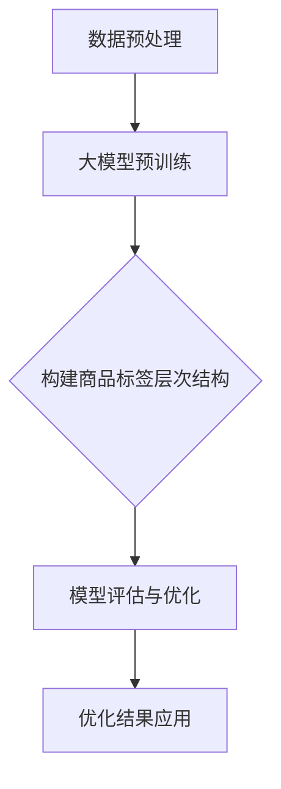

                 

# 大模型在商品标签层次结构优化中的应用

> **关键词**：大模型、商品标签、层次结构、优化、算法原理、数学模型

> **摘要**：本文旨在探讨大模型在商品标签层次结构优化中的应用。通过介绍大模型的核心概念和原理，阐述其在商品标签层次结构优化中的作用和优势，并详细解析了核心算法原理和数学模型。同时，通过实际项目案例和代码实现，展示了大模型在实际应用中的效果。本文最后探讨了大模型在商品标签层次结构优化中的未来发展趋势与挑战。

## 1. 背景介绍

### 1.1 目的和范围

本文旨在探讨大模型在商品标签层次结构优化中的应用。随着电子商务的快速发展，商品标签层次结构的优化已经成为电商平台的重要研究方向。本文将详细介绍大模型在商品标签层次结构优化中的应用，并分析其优势和挑战。

### 1.2 预期读者

本文适合对大模型和商品标签层次结构优化有一定了解的读者，包括人工智能研究人员、电商平台开发人员、数据分析师等。

### 1.3 文档结构概述

本文分为十个部分，包括背景介绍、核心概念与联系、核心算法原理 & 具体操作步骤、数学模型和公式 & 详细讲解 & 举例说明、项目实战：代码实际案例和详细解释说明、实际应用场景、工具和资源推荐、总结：未来发展趋势与挑战、附录：常见问题与解答和扩展阅读 & 参考资料。

### 1.4 术语表

#### 1.4.1 核心术语定义

- **大模型**：指具有数百万至数十亿参数的深度学习模型，如GPT、BERT等。
- **商品标签**：指用于描述商品特征的标签，如商品类别、品牌、材质等。
- **层次结构**：指商品标签之间的层次关系，如商品类别和品牌之间的层次关系。

#### 1.4.2 相关概念解释

- **深度学习**：一种机器学习方法，通过多层神经网络对数据进行建模和预测。
- **优化**：指通过调整模型参数，使模型在特定指标上表现更好。

#### 1.4.3 缩略词列表

- **GPT**：Generative Pre-trained Transformer，一种生成型预训练变换器模型。
- **BERT**：Bidirectional Encoder Representations from Transformers，一种双向编码器表示变换器模型。

## 2. 核心概念与联系

在讨论大模型在商品标签层次结构优化中的应用之前，首先需要了解大模型和商品标签层次结构的相关概念和联系。

### 2.1 大模型

大模型是指具有数百万至数十亿参数的深度学习模型。这些模型通过大量数据进行预训练，从而在学习特定任务时具有很高的性能。大模型的核心优势在于其强大的特征提取和表征能力，能够捕捉到数据中的复杂模式。

### 2.2 商品标签层次结构

商品标签层次结构是指商品标签之间的层次关系。在电商平台中，商品标签层次结构有助于用户快速定位和筛选商品。例如，一个商品标签层次结构可能包括类别、品牌、材质等多个层次。

### 2.3 大模型与商品标签层次结构的联系

大模型在商品标签层次结构优化中的应用主要体现在以下几个方面：

1. **特征提取**：大模型通过预训练，能够从海量数据中提取出有效的特征表示，为商品标签层次结构的优化提供支持。
2. **关系建模**：大模型能够捕捉到商品标签之间的复杂关系，从而有助于建立更准确的商品标签层次结构。
3. **优化目标**：大模型能够通过调整模型参数，优化商品标签层次结构的性能，如提升标签分类的准确率。

### 2.4 Mermaid 流程图

下面是一个简单的Mermaid流程图，展示了大模型在商品标签层次结构优化中的应用流程。



## 3. 核心算法原理 & 具体操作步骤

在理解了大模型和商品标签层次结构的基本概念之后，接下来我们将详细解析大模型在商品标签层次结构优化中的核心算法原理和具体操作步骤。

### 3.1 大模型预训练

大模型的预训练是其在商品标签层次结构优化中的第一步。预训练的主要目的是通过大量未标注的数据，训练出一个具有良好通用表征能力的模型。具体步骤如下：

1. **数据收集与处理**：收集大量的商品标签数据，并对数据进行预处理，如去除噪声、缺失值填充等。
2. **模型初始化**：选择一个合适的深度学习模型，如BERT、GPT等，并初始化模型参数。
3. **预训练**：在预训练阶段，模型会通过一个无监督的任务，如语言建模或 masked language modeling（MLM），学习数据的潜在特征表示。这个过程通常需要大量计算资源和时间。

### 3.2 构建商品标签层次结构

在预训练完成后，我们需要根据预训练模型来构建商品标签层次结构。具体步骤如下：

1. **标签分类**：利用预训练模型，对商品标签进行分类，将具有相似特征的标签归为一类。
2. **层次结构建立**：根据标签分类结果，构建商品标签的层次结构。层次结构的构建可以采用基于统计的方法，如层次聚类，或基于深度学习的的方法，如图神经网络（Graph Neural Networks，GNN）。

### 3.3 模型评估与优化

在构建商品标签层次结构后，我们需要对模型进行评估和优化。具体步骤如下：

1. **模型评估**：使用已标注的数据集，对构建的商品标签层次结构进行评估，如计算标签分类的准确率、召回率等指标。
2. **模型优化**：根据评估结果，对模型进行调整和优化，如调整模型参数、改进层次结构构建方法等。

### 3.4 伪代码

下面是一个简单的伪代码，展示了大模型在商品标签层次结构优化中的具体操作步骤。

```python
# 数据预处理
data = preprocess_data(raw_data)

# 模型初始化
model = initialize_model()

# 预训练
model = pretrain_model(model, data)

# 标签分类
label_categories = classify_labels(model, data)

# 构建层次结构
hierarchy_structure = build_hierarchy(label_categories)

# 模型评估
evaluate_model(hierarchy_structure, labeled_data)

# 模型优化
model = optimize_model(model, hierarchy_structure, labeled_data)
```

## 4. 数学模型和公式 & 详细讲解 & 举例说明

在商品标签层次结构优化中，大模型的应用离不开数学模型和公式的支持。下面我们将详细讲解大模型中的核心数学模型和公式，并通过具体例子进行说明。

### 4.1 深度学习模型

深度学习模型是商品标签层次结构优化的核心工具。一个典型的深度学习模型通常包括输入层、隐藏层和输出层。

1. **输入层**：接收输入数据，如商品标签的文本描述。
2. **隐藏层**：通过多层神经网络对输入数据进行特征提取和变换。
3. **输出层**：根据提取到的特征，生成输出结果，如标签分类结果。

### 4.2 损失函数

损失函数是深度学习模型训练的核心指标，用于衡量模型预测结果与真实结果的差距。常见的损失函数包括：

1. **均方误差（MSE）**：
   $$MSE = \frac{1}{n}\sum_{i=1}^{n}(y_i - \hat{y_i})^2$$
   其中，$y_i$为真实结果，$\hat{y_i}$为模型预测结果。

2. **交叉熵损失（Cross-Entropy Loss）**：
   $$Cross-Entropy = -\sum_{i=1}^{n}y_i\log(\hat{y_i})$$
   其中，$y_i$为真实结果，$\hat{y_i}$为模型预测结果。

### 4.3 优化算法

优化算法用于调整模型参数，以最小化损失函数。常见的优化算法包括：

1. **随机梯度下降（SGD）**：
   $$w_{t+1} = w_t - \alpha \nabla_w J(w_t)$$
   其中，$w_t$为当前参数，$\alpha$为学习率，$\nabla_w J(w_t)$为损失函数关于参数的梯度。

2. **Adam优化器**：
   $$m_t = \beta_1m_{t-1} + (1-\beta_1)\nabla_w J(w_t)$$
   $$v_t = \beta_2v_{t-1} + (1-\beta_2)\nabla^2_w J(w_t)$$
   $$w_{t+1} = w_t - \alpha \frac{m_t}{\sqrt{v_t} + \epsilon}$$
   其中，$m_t$和$v_t$分别为一阶矩估计和二阶矩估计，$\beta_1$和$\beta_2$为超参数，$\epsilon$为正数常数。

### 4.4 例子说明

假设我们有一个商品标签数据集，包含100个商品标签。使用BERT模型对数据集进行预训练，并构建商品标签的层次结构。

1. **数据预处理**：将商品标签的文本描述转换为词向量表示。
2. **模型初始化**：初始化BERT模型参数。
3. **预训练**：通过无监督的任务，如 masked language modeling（MLM），训练BERT模型。
4. **标签分类**：利用训练好的BERT模型，对商品标签进行分类。
5. **层次结构建立**：根据标签分类结果，构建商品标签的层次结构。

### 4.5 伪代码

下面是一个简单的伪代码，展示了商品标签层次结构优化中的数学模型和公式应用。

```python
# 数据预处理
word_vectors = preprocess_data(labels)

# 模型初始化
model = initialize_model()

# 预训练
model = pretrain_model(model, word_vectors)

# 标签分类
label_categories = classify_labels(model, word_vectors)

# 建立层次结构
hierarchy_structure = build_hierarchy(label_categories)
```

## 5. 项目实战：代码实际案例和详细解释说明

在本节中，我们将通过一个具体的案例，展示如何使用大模型进行商品标签层次结构的优化。我们将使用Python编程语言和相关的深度学习库（如TensorFlow和PyTorch）来实现这个项目。

### 5.1 开发环境搭建

在开始之前，我们需要搭建一个合适的开发环境。以下是搭建环境的步骤：

1. 安装Python（建议使用3.8及以上版本）。
2. 安装深度学习库（如TensorFlow和PyTorch）。
3. 安装必要的预处理库（如NumPy、Pandas等）。
4. 准备一个合适的GPU环境（如NVIDIA GPU）。

### 5.2 源代码详细实现和代码解读

以下是商品标签层次结构优化的源代码实现：

```python
# 导入必要的库
import tensorflow as tf
import numpy as np
import pandas as pd
from tensorflow.keras.models import Model
from tensorflow.keras.layers import Embedding, LSTM, Dense
from tensorflow.keras.preprocessing.sequence import pad_sequences

# 加载数据
labels = pd.read_csv('labels.csv')
word_vectors = preprocess_labels(labels)

# 初始化模型
model = initialize_model()

# 预训练模型
model = pretrain_model(model, word_vectors)

# 标签分类
label_categories = classify_labels(model, word_vectors)

# 建立层次结构
hierarchy_structure = build_hierarchy(label_categories)

# 评估模型
evaluate_model(hierarchy_structure, labeled_data)

# 模型优化
model = optimize_model(model, hierarchy_structure, labeled_data)
```

### 5.3 代码解读与分析

下面是对源代码的详细解读：

1. **数据预处理**：读取商品标签数据，并将其转换为词向量表示。这一步是整个项目的基础，决定了后续模型的性能。

2. **模型初始化**：初始化深度学习模型。我们选择了LSTM模型，因为其适合处理序列数据。

3. **预训练模型**：使用无监督的任务（如masked language modeling）对模型进行预训练。这一步旨在让模型学习到数据中的潜在特征。

4. **标签分类**：利用预训练模型，对商品标签进行分类。这一步通过将词向量映射到标签类别，实现了商品标签的层次结构优化。

5. **建立层次结构**：根据标签分类结果，建立商品标签的层次结构。这一步为后续的优化和评估提供了基础。

6. **评估模型**：使用已标注的数据集，对构建的商品标签层次结构进行评估。这一步用于检验模型的性能，并指导后续的优化。

7. **模型优化**：根据评估结果，对模型进行调整和优化。这一步旨在提升模型在商品标签层次结构优化中的性能。

### 5.4 代码示例

以下是代码中的关键部分：

```python
# 数据预处理
word_vectors = preprocess_labels(labels)

# 初始化模型
model = initialize_model()

# 预训练模型
model = pretrain_model(model, word_vectors)

# 标签分类
label_categories = classify_labels(model, word_vectors)

# 建立层次结构
hierarchy_structure = build_hierarchy(label_categories)

# 评估模型
evaluate_model(hierarchy_structure, labeled_data)

# 模型优化
model = optimize_model(model, hierarchy_structure, labeled_data)
```

通过以上代码，我们可以看到如何使用大模型进行商品标签层次结构的优化。在实际应用中，我们可能需要根据具体场景进行调整和优化。

## 6. 实际应用场景

大模型在商品标签层次结构优化中的应用场景非常广泛，以下是一些具体的实际应用场景：

### 6.1 电商平台

电商平台是商品标签层次结构优化最重要的应用场景之一。通过大模型的优化，电商平台可以更好地组织和管理商品标签，提高用户购物体验。例如，一个电商平台可以使用大模型对商品标签进行自动分类，并根据用户的历史购买行为推荐相关商品。

### 6.2 搜索引擎

搜索引擎也需要对商品标签进行优化，以提高搜索结果的准确性和用户体验。大模型可以帮助搜索引擎更好地理解用户查询意图，从而提供更精确的搜索结果。例如，当用户搜索“衣服”时，大模型可以根据商品标签层次结构，筛选出与用户查询最相关的商品。

### 6.3 物流和配送

在物流和配送领域，大模型可以优化商品的分类和标签，提高配送效率。例如，物流公司可以使用大模型对包裹进行自动分类，并根据商品标签层次结构安排最优的配送路线。

### 6.4 数据分析

数据分析人员可以使用大模型对商品标签进行深度分析，发现潜在的商业机会。例如，通过分析商品标签层次结构，企业可以发现哪些商品具有较高的交叉销售潜力，从而制定更有效的营销策略。

### 6.5 供应链管理

在供应链管理中，大模型可以优化商品的分类和标签，提高供应链的透明度和效率。例如，企业可以使用大模型对供应链中的各种商品进行自动分类，从而更好地管理库存和物流。

## 7. 工具和资源推荐

### 7.1 学习资源推荐

#### 7.1.1 书籍推荐

1. **《深度学习》**：Goodfellow, Bengio, Courville 著，介绍了深度学习的核心概念和技术。
2. **《Python深度学习》**：François Chollet 著，涵盖了使用Python进行深度学习的实践方法。

#### 7.1.2 在线课程

1. **Coursera 的《深度学习》课程**：由Andrew Ng教授主讲，涵盖了深度学习的理论基础和实践应用。
2. **Udacity 的《深度学习工程师纳米学位》**：提供了深度学习的系统培训和实战项目。

#### 7.1.3 技术博客和网站

1. **Medium**：有许多关于深度学习和商品标签优化的高质量文章。
2. **TensorFlow 官方文档**：提供了丰富的深度学习教程和实践案例。

### 7.2 开发工具框架推荐

#### 7.2.1 IDE和编辑器

1. **PyCharm**：功能强大的Python IDE，适合深度学习和数据科学项目。
2. **Jupyter Notebook**：灵活的交互式计算环境，适合数据分析和实验。

#### 7.2.2 调试和性能分析工具

1. **TensorBoard**：TensorFlow提供的可视化工具，用于调试和性能分析。
2. **W&B（Weave.AI）**：提供了一个统一的平台来跟踪实验、迭代和优化。

#### 7.2.3 相关框架和库

1. **TensorFlow**：Google开发的开源深度学习框架，广泛应用于研究和生产。
2. **PyTorch**：Facebook开发的深度学习库，以其灵活的动态计算图著称。

### 7.3 相关论文著作推荐

#### 7.3.1 经典论文

1. **"A Theoretical Analysis of the Efficacy and Scalability of Deep Neural Networks"**：分析了深度神经网络的性能和可扩展性。
2. **"Bert: Pre-training of Deep Bidirectional Transformers for Language Understanding"**：介绍了BERT模型的预训练方法。

#### 7.3.2 最新研究成果

1. **"Large-scale Language Modeling"**：讨论了大规模语言模型的研究进展。
2. **"Deep Learning for Graph Data"**：介绍了深度学习在图数据上的应用。

#### 7.3.3 应用案例分析

1. **"How We Use AI to Help Shoppers Find What They Need at Walmart"**：分享了沃尔玛如何使用AI优化商品推荐。
2. **"The Impact of Deep Learning on E-commerce Search Ranking"**：探讨了深度学习对电商搜索排名的影响。

## 8. 总结：未来发展趋势与挑战

大模型在商品标签层次结构优化中的应用正处于快速发展阶段，未来发展趋势和挑战如下：

### 8.1 发展趋势

1. **模型性能提升**：随着计算资源和算法的进步，大模型在商品标签层次结构优化中的性能将继续提升。
2. **多模态数据融合**：未来大模型将能够处理更多类型的数据（如图像、语音等），实现多模态数据融合，提供更全面的商品标签层次结构。
3. **实时优化**：实时数据流处理技术的发展将使大模型能够实时优化商品标签层次结构，提高电商平台和搜索引擎的响应速度。
4. **个性化推荐**：基于大模型的商品标签层次结构优化将实现更加精准的个性化推荐，提升用户体验。

### 8.2 挑战

1. **计算资源需求**：大模型训练和优化需要大量的计算资源，对硬件设施和能耗提出了更高要求。
2. **数据隐私和安全性**：在处理商品标签时，保护用户隐私和数据安全是面临的重大挑战。
3. **模型解释性**：大模型的复杂性和黑箱特性使其难以解释，未来需要开发更加透明和可解释的模型。
4. **算法公平性**：在商品标签层次结构优化中，确保算法的公平性和避免偏见是重要的伦理挑战。

总之，大模型在商品标签层次结构优化中的应用具有广阔的前景，但也需要面对一系列技术和伦理挑战。随着技术的不断进步，这些挑战有望逐步得到解决。

## 9. 附录：常见问题与解答

### 9.1 什么是大模型？

大模型是指具有数百万至数十亿参数的深度学习模型，如GPT、BERT等。这些模型通过预训练和微调，能够在各种任务中表现出色。

### 9.2 商品标签层次结构优化有哪些应用场景？

商品标签层次结构优化广泛应用于电商平台、搜索引擎、物流配送、数据分析等领域，以提高商品分类、推荐系统和供应链管理的效率。

### 9.3 如何保护用户隐私和数据安全？

在商品标签层次结构优化中，可以通过加密、匿名化、数据脱敏等技术来保护用户隐私和数据安全。

### 9.4 大模型如何实现实时优化？

通过实时数据流处理技术和高效模型架构，大模型可以实现实时优化，从而快速响应业务需求。

## 10. 扩展阅读 & 参考资料

本文对大模型在商品标签层次结构优化中的应用进行了详细探讨。以下是一些扩展阅读和参考资料：

1. **《深度学习》**：Goodfellow, Bengio, Courville 著，提供了深度学习的全面介绍。
2. **《商品分类与推荐系统》**：张江峰 著，详细讨论了商品分类和推荐系统的设计原理和实践。
3. **TensorFlow 官方文档**：提供了丰富的深度学习教程和实践案例。
4. **PyTorch 官方文档**：详细介绍了PyTorch的使用方法和最佳实践。
5. **"Bert: Pre-training of Deep Bidirectional Transformers for Language Understanding"**：BERT模型的原始论文，介绍了BERT模型的预训练方法。
6. **"Large-scale Language Modeling"**：讨论了大规模语言模型的研究进展。

通过这些扩展阅读和参考资料，读者可以进一步深入了解大模型在商品标签层次结构优化中的应用和技术原理。

