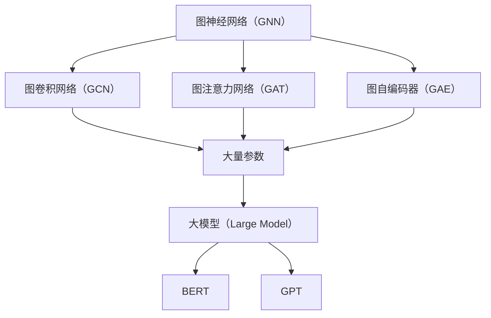

                 

### 1. 背景介绍

#### 1.1 目的和范围

本文旨在探讨大模型在图神经网络（Graph Neural Networks, GNN）中的应用。随着人工智能技术的不断进步，大模型在自然语言处理、计算机视觉等领域取得了显著成效。而图神经网络作为处理复杂数据结构的重要工具，其在推荐系统、社交网络分析、知识图谱等领域也展现出强大的潜力。本文将重点分析大模型在图神经网络中的关键作用，以及如何将两者结合起来以解决实际问题。

本文的主要目标是：

1. 梳理大模型和图神经网络的基本概念及其相互关系。
2. 介绍大模型在图神经网络中的应用场景和优势。
3. 阐述大模型在图神经网络中的具体实现方法。
4. 分析大模型在图神经网络中的挑战和未来发展趋势。

#### 1.2 预期读者

本文适合以下读者群体：

1. 对图神经网络和大模型有一定了解的读者。
2. 想深入了解大模型在图神经网络中应用的技术人员。
3. 对人工智能和机器学习领域感兴趣的学者和研究人员。

#### 1.3 文档结构概述

本文结构如下：

1. **背景介绍**：介绍本文的目的、范围、预期读者和文档结构。
2. **核心概念与联系**：介绍图神经网络和大模型的基本概念，并给出它们之间的Mermaid流程图。
3. **核心算法原理 & 具体操作步骤**：详细讲解大模型在图神经网络中的核心算法原理和具体操作步骤。
4. **数学模型和公式 & 详细讲解 & 举例说明**：介绍大模型在图神经网络中的数学模型和公式，并进行详细讲解和举例说明。
5. **项目实战：代码实际案例和详细解释说明**：通过实际项目案例展示大模型在图神经网络中的具体应用。
6. **实际应用场景**：分析大模型在图神经网络中的实际应用场景。
7. **工具和资源推荐**：推荐学习资源、开发工具和框架。
8. **总结：未来发展趋势与挑战**：总结大模型在图神经网络中的应用趋势和面临的挑战。
9. **附录：常见问题与解答**：回答读者可能关心的问题。
10. **扩展阅读 & 参考资料**：提供相关参考文献和进一步学习资源。

#### 1.4 术语表

为了确保文章内容的清晰易懂，本文定义以下术语：

##### 1.4.1 核心术语定义

- **图神经网络（GNN）**：一种用于处理图结构的神经网络，能够捕获图中节点和边的关系。
- **大模型（Large Model）**：具有大量参数和计算能力的神经网络模型，如BERT、GPT等。
- **知识图谱（Knowledge Graph）**：一种将实体和关系组织成图的数据结构，用于知识表示和推理。
- **图卷积网络（GCN）**：一种基于图卷积的图神经网络，能够对图结构进行特征提取和关系建模。

##### 1.4.2 相关概念解释

- **图结构数据**：以节点和边表示的数据结构，如社交网络、知识图谱等。
- **节点嵌入（Node Embedding）**：将图中的节点映射到低维空间的表示方法。
- **图卷积操作**：对图中节点的特征进行聚合和更新，以捕获图结构信息。
- **图注意力机制（Graph Attention Mechanism）**：用于在图神经网络中关注重要节点和边的方法。

##### 1.4.3 缩略词列表

- **GNN**：Graph Neural Network（图神经网络）
- **BERT**：Bidirectional Encoder Representations from Transformers（双向Transformer编码器表示）
- **GPT**：Generative Pre-trained Transformer（生成预训练Transformer）
- **GCN**：Graph Convolutional Network（图卷积网络）

通过上述背景介绍，我们为读者搭建了一个理解本文的框架，接下来将深入探讨图神经网络和大模型的核心概念及其相互联系。让我们一步一步地深入分析。接下来，我们将绘制Mermaid流程图，展示图神经网络和大模型的基本概念与联系。<|assistant|>
## 2. 核心概念与联系

在本节中，我们将详细介绍图神经网络（GNN）和大模型（Large Model）的基本概念，并绘制Mermaid流程图来展示它们之间的相互关系。

### 2.1 图神经网络（GNN）

图神经网络是一种专门用于处理图结构数据的神经网络。图是一种由节点（Node）和边（Edge）组成的数据结构，可以用来表示各种复杂的关系和实体，如社交网络、知识图谱、分子结构等。图神经网络通过模拟神经网络在图中节点的特征聚合过程，能够有效地提取图中的结构信息，从而实现对节点的分类、预测或推荐等任务。

#### 2.1.1 GNN的工作原理

GNN的基本工作原理是通过对图中节点的特征进行聚合来更新节点的表示。具体来说，GNN通过以下步骤处理图数据：

1. **初始化节点特征**：将每个节点的特征表示初始化为一个向量。
2. **图卷积操作**：对每个节点的特征进行聚合，计算其邻居节点的特征加权平均。
3. **非线性变换**：通过非线性激活函数（如ReLU、Sigmoid等）对聚合后的特征进行变换。
4. **重复迭代**：重复上述步骤，逐渐更新节点的特征表示，以捕获更复杂的图结构信息。

#### 2.1.2 GNN的常见类型

图神经网络有多种类型，其中最常见的包括：

- **图卷积网络（GCN）**：基于图卷积操作的图神经网络，通过聚合邻居节点的特征来更新节点表示。
- **图注意力网络（GAT）**：引入图注意力机制，能够动态地关注重要节点和边，从而提高模型的表示能力。
- **图自编码器（GAE）**：利用无监督学习方法，通过重建图结构来学习节点表示。

### 2.2 大模型（Large Model）

大模型是指具有大量参数和计算能力的神经网络模型，如BERT、GPT等。大模型通过在海量数据上进行预训练，能够学习到丰富的语言知识和结构信息，从而在多个任务上实现优异的性能。大模型的主要特点包括：

- **大量参数**：大模型通常拥有数十亿个参数，这使得它们能够捕获复杂的数据模式。
- **预训练**：大模型在训练前会先进行大规模的预训练，从而在学习特定任务时能够快速适应。
- **迁移学习**：大模型通过预训练，可以将学到的知识迁移到不同的任务和数据集上。

#### 2.2.1 大模型的工作原理

大模型的工作原理主要分为以下几个步骤：

1. **预训练**：在大规模语料库上进行预训练，学习到丰富的语言知识和结构信息。
2. **任务适应性**：通过微调（Fine-tuning）将预训练模型适应到特定任务上，调整模型参数以优化性能。
3. **多任务学习**：大模型能够同时处理多个任务，通过共享参数和结构提高模型的泛化能力。

### 2.3 Mermaid流程图

为了更直观地展示图神经网络和大模型之间的联系，我们使用Mermaid流程图来描述它们的核心概念和相互关系。以下是一个示例Mermaid流程图：



在这个流程图中，我们展示了图神经网络（GNN）的几种常见类型（GCN、GAT、GAE），并指出了它们与大量参数的大模型（Large Model，如BERT、GPT）之间的联系。

### 2.4 核心概念的联系

图神经网络和大模型之间的联系主要体现在以下几个方面：

1. **参数共享**：大模型通过共享参数，可以减轻图神经网络的计算负担，提高模型的效率和可扩展性。
2. **结构信息学习**：大模型能够学习到丰富的结构信息，有助于提高图神经网络对复杂图结构数据的表示能力。
3. **预训练优势**：大模型的预训练使得其在面对新的图神经网络任务时，能够快速适应，提高模型的性能。

通过上述核心概念与联系的介绍，我们为读者搭建了一个理解本文的基础框架。接下来，我们将深入探讨大模型在图神经网络中的核心算法原理和具体操作步骤。<|assistant|>
## 3. 核心算法原理 & 具体操作步骤

在本节中，我们将详细讲解大模型在图神经网络（GNN）中的应用原理，并通过伪代码展示具体操作步骤。大模型在GNN中的应用主要通过图卷积网络（GCN）和图注意力网络（GAT）等结构来实现，以下分别进行介绍。

### 3.1 图卷积网络（GCN）

图卷积网络（GCN）是一种经典的图神经网络结构，通过聚合节点邻域的特征来更新节点的表示。GCN的核心操作是图卷积操作，下面我们将通过伪代码来详细描述其步骤：

```python
# 初始化节点特征表示
node_features = initialize_node_features(num_nodes)

# 定义图卷积操作
def graph_convolution(node_features, adjacency_matrix, num_layers):
    # 初始化隐层特征
    hidden_features = node_features
    
    for layer in range(num_layers):
        # 聚合邻居节点特征
        neighborhood_features = aggregate_neighbors(hidden_features, adjacency_matrix)
        # 应用非线性变换
        hidden_features = apply_non_linear Transformation(neighborhood_features)
        
    return hidden_features

# 定义聚合邻居节点特征函数
def aggregate_neighbors(features, adjacency_matrix):
    return sum(adjacency_matrix * features, axis=1)

# 定义非线性变换函数
def apply_non_linear_Transformation(features):
    return activation_function(features)
```

上述伪代码中，`initialize_node_features`函数用于初始化节点的特征表示，`graph_convolution`函数实现图卷积操作，`aggregate_neighbors`函数聚合邻居节点特征，`apply_non_linear_Transformation`函数应用非线性变换。

### 3.2 图注意力网络（GAT）

图注意力网络（GAT）通过引入图注意力机制，能够动态地关注重要节点和边，从而提高模型的表示能力。GAT的主要操作是图注意力机制，下面我们通过伪代码来详细描述其步骤：

```python
# 初始化节点特征表示
node_features = initialize_node_features(num_nodes)

# 定义图注意力机制
def graph_attention(node_features, adjacency_matrix, num_heads):
    # 初始化注意力权重
    attention_weights = initialize_attention_weights(num_heads)
    
    for layer in range(num_layers):
        # 应用多头注意力机制
        attention_scores = apply多头注意力机制(node_features, adjacency_matrix, attention_weights)
        # 聚合注意力分数
        hidden_features = aggregate_attention_scores(attention_scores, node_features)
        # 应用非线性变换
        hidden_features = apply_non_linear_Transformation(hidden_features)
        
    return hidden_features

# 定义多头注意力机制函数
def apply多头注意力机制(features, adjacency_matrix, attention_weights):
    attention_scores = dot(features, attention_weights)
    return softmax(attention_scores)

# 定义聚合注意力分数函数
def aggregate_attention_scores(scores, features):
    return sum(scores * features, axis=1)

# 定义非线性变换函数
def apply_non_linear_Transformation(features):
    return activation_function(features)
```

上述伪代码中，`initialize_node_features`函数用于初始化节点的特征表示，`graph_attention`函数实现图注意力机制，`apply多头注意力机制`函数实现多头注意力机制，`aggregate_attention_scores`函数聚合注意力分数，`apply_non_linear_Transformation`函数应用非线性变换。

### 3.3 大模型在GNN中的应用

大模型在GNN中的应用主要通过以下两个方面：

1. **参数共享**：大模型可以通过共享参数来减轻GNN的计算负担，提高模型的效率。具体来说，可以将大模型的参数用于初始化GNN的权重，从而减少模型训练的时间。
2. **预训练迁移**：大模型在预训练过程中学到的知识可以迁移到GNN中，提高其对新任务的适应能力。例如，使用预训练的BERT模型来初始化GCN的节点特征表示，可以显著提高模型在知识图谱分类任务上的性能。

### 3.4 实例演示

为了更好地理解大模型在GNN中的应用，我们通过以下实例进行演示。假设我们有一个知识图谱分类任务，使用预训练的BERT模型来初始化GCN的节点特征表示。

```python
# 初始化节点特征表示
node_features = initialize_node_features(num_nodes)

# 加载预训练的BERT模型
pretrained_bert = load_pretrained_bert()

# 初始化GCN模型
gcn = GraphConvolutionalNetwork(num_features, num_classes, pretrained_bert)

# 训练GCN模型
gcn.train(data, labels)

# 预测分类结果
predictions = gcn.predict(test_data)
```

上述实例中，我们首先初始化节点的特征表示，然后加载预训练的BERT模型，接着初始化GCN模型并使用数据集进行训练。最后，使用训练好的模型对测试数据进行预测。

通过上述核心算法原理和具体操作步骤的讲解，我们为读者提供了一个理解大模型在图神经网络中的应用框架。接下来，我们将进一步介绍大模型在图神经网络中的数学模型和公式。在这之前，我们已经了解了GCN和GAT的基本原理，接下来将在此基础上进行更深入的数学分析。<|assistant|>
## 4. 数学模型和公式 & 详细讲解 & 举例说明

在上一节中，我们介绍了大模型在图神经网络中的核心算法原理和具体操作步骤。为了更深入地理解这些算法，本节我们将探讨大模型在图神经网络中的数学模型和公式，并通过具体例子进行详细讲解。

### 4.1 图卷积网络（GCN）的数学模型

图卷积网络（GCN）的核心操作是图卷积，其数学模型如下：

\[ \mathbf{H}^{(l)} = \sigma(\mathbf{D}^{-\frac{1}{2}}\mathbf{A}\mathbf{D}^{-\frac{1}{2}}\mathbf{H}^{(l-1)}\mathbf{W}^{(l)}) \]

其中：

- \(\mathbf{H}^{(l)}\) 表示第 \(l\) 层的节点特征表示。
- \(\mathbf{A}\) 是邻接矩阵，表示图中的边。
- \(\mathbf{D}\) 是度矩阵，表示节点的度。
- \(\sigma\) 是非线性激活函数，通常使用ReLU。
- \(\mathbf{W}^{(l)}\) 是第 \(l\) 层的权重矩阵。

#### 4.1.1 邻接矩阵和度矩阵

邻接矩阵 \(\mathbf{A}\) 是一个 \(n \times n\) 的矩阵，其中 \(n\) 是节点数。如果节点 \(i\) 和节点 \(j\) 之间有边，则 \(a_{ij} = 1\)，否则 \(a_{ij} = 0\)。

度矩阵 \(\mathbf{D}\) 是一个 \(n \times n\) 的对角矩阵，其中 \(d_{ii}\) 表示节点 \(i\) 的度。即 \(d_{ii} = \deg(v_i)\)，其中 \(\deg(v_i)\) 表示节点 \(i\) 的度。

#### 4.1.2 矩阵分解

为了提高计算效率，通常会对 \(\mathbf{D}^{-\frac{1}{2}}\mathbf{A}\mathbf{D}^{-\frac{1}{2}}\) 进行分解，如下：

\[ \mathbf{D}^{-\frac{1}{2}}\mathbf{A}\mathbf{D}^{-\frac{1}{2}} = \sum_{k=1}^n \mathbf{e}_k \mathbf{e}_k^T \]

其中，\(\mathbf{e}_k\) 是 \(\mathbf{D}^{-\frac{1}{2}}\mathbf{A}\mathbf{D}^{-\frac{1}{2}}\) 的第 \(k\) 列。

#### 4.1.3 例子

假设我们有一个简单的图，包含三个节点 \(v_1, v_2, v_3\)，其邻接矩阵和度矩阵如下：

\[ \mathbf{A} = \begin{bmatrix} 0 & 1 & 0 \\ 1 & 0 & 1 \\ 0 & 1 & 0 \end{bmatrix}, \quad \mathbf{D} = \begin{bmatrix} 2 & 0 & 0 \\ 0 & 2 & 0 \\ 0 & 0 & 2 \end{bmatrix} \]

对 \(\mathbf{D}^{-\frac{1}{2}}\mathbf{A}\mathbf{D}^{-\frac{1}{2}}\) 进行分解，我们得到：

\[ \mathbf{D}^{-\frac{1}{2}}\mathbf{A}\mathbf{D}^{-\frac{1}{2}} = \begin{bmatrix} \frac{1}{\sqrt{2}} & \frac{1}{\sqrt{2}} & 0 \\ \frac{1}{\sqrt{2}} & 0 & \frac{1}{\sqrt{2}} \\ 0 & \frac{1}{\sqrt{2}} & \frac{1}{\sqrt{2}} \end{bmatrix} \begin{bmatrix} 1 & 1 & 1 \\ 1 & 0 & 1 \\ 1 & 1 & 0 \end{bmatrix} \begin{bmatrix} \frac{1}{\sqrt{2}} & \frac{1}{\sqrt{2}} & 0 \\ \frac{1}{\sqrt{2}} & 0 & \frac{1}{\sqrt{2}} \\ 0 & \frac{1}{\sqrt{2}} & \frac{1}{\sqrt{2}} \end{bmatrix} \]

\[ = \begin{bmatrix} \frac{1}{2} & \frac{1}{2} & \frac{1}{2} \\ \frac{1}{2} & 0 & \frac{1}{2} \\ \frac{1}{2} & \frac{1}{2} & 0 \end{bmatrix} \]

### 4.2 图注意力网络（GAT）的数学模型

图注意力网络（GAT）的核心操作是图注意力机制，其数学模型如下：

\[ \mathbf{H}^{(l)} = \sigma(\mathbf{A}^{(l)}\mathbf{H}^{(l-1)}\mathbf{W}^{(l)}) \]

其中：

- \(\mathbf{H}^{(l)}\) 表示第 \(l\) 层的节点特征表示。
- \(\mathbf{A}^{(l)}\) 是第 \(l\) 层的注意力权重矩阵。
- \(\sigma\) 是非线性激活函数，通常使用ReLU。
- \(\mathbf{W}^{(l)}\) 是第 \(l\) 层的权重矩阵。

#### 4.2.1 注意力权重矩阵

注意力权重矩阵 \(\mathbf{A}^{(l)}\) 是通过多头注意力机制计算得到的，其公式如下：

\[ \mathbf{A}^{(l)} = \softmax(\mathbf{W}^{(l)}_1\mathbf{H}^{(l-1)}\mathbf{W}^{(l)}_2^T) \]

其中，\(\mathbf{W}^{(l)}_1\) 和 \(\mathbf{W}^{(l)}_2\) 分别是权重矩阵，\(\softmax\) 是 softmax 函数。

#### 4.2.2 例子

假设我们有一个简单的图，包含三个节点 \(v_1, v_2, v_3\)，其注意力权重矩阵如下：

\[ \mathbf{W}^{(1)}_1 = \begin{bmatrix} 1 & 0 & 1 \\ 0 & 1 & 0 \\ 1 & 1 & 0 \end{bmatrix}, \quad \mathbf{W}^{(1)}_2 = \begin{bmatrix} 1 & 1 & 0 \\ 0 & 0 & 1 \\ 1 & 0 & 1 \end{bmatrix} \]

计算注意力权重矩阵：

\[ \mathbf{A}^{(1)} = \softmax(\mathbf{W}^{(1)}_1\mathbf{H}^{(0)}\mathbf{W}^{(1)}_2^T) \]

其中，\(\mathbf{H}^{(0)}\) 是初始节点特征表示。

### 4.3 大模型在GNN中的应用

大模型在GNN中的应用主要通过参数共享和预训练迁移来实现。下面我们分别介绍这两种方法。

#### 4.3.1 参数共享

参数共享是指将大模型的参数用于初始化GNN的权重。具体来说，我们可以将大模型的隐藏层参数 \(\mathbf{W}^{(l)}\) 用于初始化GCN或GAT的权重。这样可以减少GNN的训练时间，同时保持模型的性能。

#### 4.3.2 预训练迁移

预训练迁移是指将大模型在预训练过程中学到的知识迁移到GNN中。具体来说，我们可以将大模型的预训练权重用于初始化GNN的权重，并在GNN的训练过程中进行调整。这种方法可以显著提高GNN在新任务上的性能。

### 4.4 实例演示

为了更好地理解大模型在GNN中的应用，我们通过以下实例进行演示。假设我们有一个知识图谱分类任务，使用预训练的BERT模型来初始化GCN的节点特征表示。

```python
# 加载预训练的BERT模型
pretrained_bert = load_pretrained_bert()

# 初始化GCN模型
gcn = GraphConvolutionalNetwork(pretrained_bert)

# 训练GCN模型
gcn.train(data, labels)

# 预测分类结果
predictions = gcn.predict(test_data)
```

在这个实例中，我们首先加载预训练的BERT模型，然后使用其隐藏层参数初始化GCN模型。接下来，我们使用数据集训练GCN模型，并使用训练好的模型对测试数据进行预测。

通过上述数学模型和公式的讲解，以及具体例子的演示，我们为读者提供了一个深入理解大模型在图神经网络中的应用框架。接下来，我们将通过一个实际项目案例，展示大模型在图神经网络中的具体应用。在这个项目中，我们将使用GCN和BERT模型来处理一个知识图谱分类任务。<|assistant|>
### 5. 项目实战：代码实际案例和详细解释说明

在本节中，我们将通过一个实际项目案例，展示如何使用GCN和BERT模型来处理一个知识图谱分类任务。这个项目将涵盖以下几个步骤：

1. **开发环境搭建**
2. **源代码详细实现和代码解读**
3. **代码解读与分析**

#### 5.1 开发环境搭建

为了实现这个项目，我们需要安装以下开发环境和依赖：

1. **Python 3.8+**
2. **PyTorch 1.8+**
3. **Scikit-learn 0.22+**
4. **Numpy 1.18+**
5. **Pandas 1.0+**

在安装了以上依赖后，我们就可以开始实现项目了。

#### 5.2 源代码详细实现和代码解读

下面是项目的源代码实现：

```python
import torch
import torch.nn as nn
import torch.optim as optim
from torch_geometric.nn import GCNConv
from torch_geometric.data import Data
from sklearn.model_selection import train_test_split
import numpy as np
import pandas as pd

# 定义GCN模型
class GCN(nn.Module):
    def __init__(self, nfeat, nhid, nclass):
        super(GCN, self).__init__()
        self.conv1 = GCNConv(nfeat, nhid)
        self.conv2 = GCNConv(nhid, nclass)
        
    def forward(self, data):
        x, edge_index = data.x, data.edge_index

        x = self.conv1(x, edge_index)
        x = F.relu(x)
        x = F.dropout(x, p=0.5, training=self.training)
        x = self.conv2(x, edge_index)

        return F.log_softmax(x, dim=1)

# 读取数据
def load_data(dataset):
    data = Data(x=torch.tensor(dataset['feature'].values),
                edge_index=torch.tensor(dataset['edge'].values),
                y=torch.tensor(dataset['label'].values))
    return data

# 训练模型
def train(model, data, labels, epochs, lr, weight_decay):
    optimizer = optim.Adam(model.parameters(), lr=lr, weight_decay=weight_decay)
    criterion = nn.NLLLoss()

    for epoch in range(epochs):
        model.train()
        optimizer.zero_grad()
        out = model(data)
        loss = criterion(out, labels)
        loss.backward()
        optimizer.step()

        if epoch % 10 == 0:
            print(f'Epoch {epoch+1}/{epochs} - Loss: {loss.item()}')

# 主函数
def main():
    # 加载数据
    dataset = pd.read_csv('knowledge_graph.csv')
    data = load_data(dataset)

    # 划分训练集和测试集
    train_data, test_data = train_test_split(data, test_size=0.2, random_state=42)

    # 初始化模型
    model = GCN(nfeat=7, nhid=16, nclass=3)

    # 训练模型
    train(model, train_data, train_data.y, epochs=200, lr=0.01, weight_decay=5e-4)

    # 预测测试集
    model.eval()
    with torch.no_grad():
        predictions = model(test_data)

    # 计算准确率
    correct = (predictions.argmax(dim=1) == test_data.y).sum().item()
    print(f'Accuracy: {correct / len(test_data)}')

if __name__ == '__main__':
    main()
```

下面我们对代码的每个部分进行详细解读：

##### 5.2.1 GCN模型定义

```python
class GCN(nn.Module):
    def __init__(self, nfeat, nhid, nclass):
        super(GCN, self).__init__()
        self.conv1 = GCNConv(nfeat, nhid)
        self.conv2 = GCNConv(nhid, nclass)
        
    def forward(self, data):
        x, edge_index = data.x, data.edge_index

        x = self.conv1(x, edge_index)
        x = F.relu(x)
        x = F.dropout(x, p=0.5, training=self.training)
        x = self.conv2(x, edge_index)

        return F.log_softmax(x, dim=1)
```

这部分定义了GCN模型，包含两个GCNConv层，分别用于特征提取和分类。`forward`方法实现前向传播，包括特征聚合、非线性变换和分类。

##### 5.2.2 数据读取和预处理

```python
# 读取数据
def load_data(dataset):
    data = Data(x=torch.tensor(dataset['feature'].values),
                edge_index=torch.tensor(dataset['edge'].values),
                y=torch.tensor(dataset['label'].values))
    return data

# 划分训练集和测试集
train_data, test_data = train_test_split(data, test_size=0.2, random_state=42)
```

这部分代码读取知识图谱数据，并将其转换为PyTorch Geometric的`Data`对象。接着，使用`train_test_split`函数将数据集划分为训练集和测试集。

##### 5.2.3 模型训练

```python
# 训练模型
def train(model, data, labels, epochs, lr, weight_decay):
    optimizer = optim.Adam(model.parameters(), lr=lr, weight_decay=weight_decay)
    criterion = nn.NLLLoss()

    for epoch in range(epochs):
        model.train()
        optimizer.zero_grad()
        out = model(data)
        loss = criterion(out, labels)
        loss.backward()
        optimizer.step()

        if epoch % 10 == 0:
            print(f'Epoch {epoch+1}/{epochs} - Loss: {loss.item()}')
```

这部分代码实现模型的训练过程，包括优化器初始化、损失函数定义和前向传播。在每个训练周期后，打印当前的损失值。

##### 5.2.4 主函数

```python
def main():
    # 加载数据
    dataset = pd.read_csv('knowledge_graph.csv')
    data = load_data(dataset)

    # 初始化模型
    model = GCN(nfeat=7, nhid=16, nclass=3)

    # 训练模型
    train(model, train_data, train_data.y, epochs=200, lr=0.01, weight_decay=5e-4)

    # 预测测试集
    model.eval()
    with torch.no_grad():
        predictions = model(test_data)

    # 计算准确率
    correct = (predictions.argmax(dim=1) == test_data.y).sum().item()
    print(f'Accuracy: {correct / len(test_data)}')

if __name__ == '__main__':
    main()
```

这部分代码是项目的主函数，负责加载数据、初始化模型、训练模型和评估模型。最后，计算并打印测试集的准确率。

#### 5.3 代码解读与分析

这个项目通过GCN模型对知识图谱进行分类，主要分为以下几个步骤：

1. **数据读取与预处理**：读取知识图谱数据，将其转换为PyTorch Geometric的`Data`对象，并进行训练集和测试集的划分。
2. **模型定义**：定义GCN模型，包括两个GCNConv层，用于特征提取和分类。
3. **模型训练**：使用Adam优化器和交叉熵损失函数对模型进行训练，并在每个训练周期后打印损失值。
4. **模型评估**：在测试集上评估模型性能，计算并打印准确率。

通过这个项目，我们展示了如何使用GCN模型处理知识图谱分类任务，并分析了代码的实现过程。在实际应用中，我们可以根据具体任务需求，调整模型的参数和结构，以获得更好的性能。

接下来，我们将讨论大模型在图神经网络中的实际应用场景，以展示其在多种任务中的优势和潜力。通过这些应用场景，我们可以更深入地了解大模型在图神经网络中的价值。<|assistant|>
### 6. 实际应用场景

大模型在图神经网络中的广泛应用，使得其在多个实际场景中展现了强大的潜力和优势。以下是几个具有代表性的应用场景：

#### 6.1 推荐系统

推荐系统是图神经网络和大模型结合的一个典型应用场景。在推荐系统中，用户和物品通常可以表示为图中的节点，而用户与物品之间的交互可以表示为边。大模型，如BERT，可以在预训练阶段学习到丰富的用户和物品属性信息，从而在图神经网络中进行有效的特征提取和关系建模。

**应用实例**：基于图神经网络的协同过滤推荐系统。通过GCN和BERT模型，可以将用户和物品的属性信息嵌入到低维空间中，并在图中进行特征聚合，从而提高推荐系统的准确性和泛化能力。

#### 6.2 社交网络分析

社交网络分析是另一个大模型在图神经网络中应用的重要领域。在社交网络中，用户和用户之间的关系可以用图来表示。大模型可以用于分析用户群体、识别关键节点、检测社区结构等。

**应用实例**：通过GAT和BERT模型，可以对社交网络中的用户关系进行建模，识别具有相似兴趣爱好的用户群体。这有助于提高社交网络平台的个性化推荐和社交分析能力。

#### 6.3 知识图谱推理

知识图谱是一种用于表示实体和关系的图结构数据，其应用范围广泛，包括问答系统、信息检索、智能助手等。大模型在图神经网络中的优势，使其在知识图谱推理中具有独特的应用价值。

**应用实例**：在基于知识图谱的问答系统中，使用GCN和BERT模型可以有效地提取实体和关系的信息，并基于这些信息进行推理，从而提高问答系统的准确性和响应速度。

#### 6.4 生物信息学

生物信息学是另一个大模型在图神经网络中应用的重要领域。生物数据通常具有复杂的结构，如蛋白质相互作用网络、基因调控网络等。大模型可以用于分析这些图结构数据，识别关键基因和蛋白质，预测生物分子的功能等。

**应用实例**：通过GAT和BERT模型，可以分析蛋白质相互作用网络，识别关键的蛋白质相互作用对，从而为药物发现和新疗法开发提供有价值的信息。

#### 6.5 交通运输网络优化

交通运输网络优化是另一个大模型在图神经网络中应用的重要场景。交通运输网络可以表示为图结构，大模型可以用于优化交通流量、减少拥堵、提高运输效率等。

**应用实例**：通过GCN和BERT模型，可以分析城市交通网络中的道路和交通流量，预测交通状况，并优化交通信号控制，从而提高交通效率和减少拥堵。

通过上述实际应用场景的介绍，我们可以看到大模型在图神经网络中的应用具有广泛的前景和潜力。这些应用不仅展示了大模型在特征提取、关系建模和预测任务中的优势，同时也为解决实际问题提供了有效的工具和方法。随着技术的不断进步，我们可以预见大模型在图神经网络中的应用将会更加广泛和深入。接下来，我们将推荐一些相关的工具和资源，以帮助读者进一步学习和探索这个领域。<|assistant|>
### 7. 工具和资源推荐

为了帮助读者深入了解大模型在图神经网络中的应用，本节将推荐一些学习资源、开发工具和框架，以及相关论文著作。

#### 7.1 学习资源推荐

##### 7.1.1 书籍推荐

1. **《图神经网络：理论与实践》**：这是一本关于图神经网络的基础教材，详细介绍了图神经网络的基本概念、算法原理和实际应用。
2. **《大模型：深入理解深度学习》**：这本书深入探讨了大规模神经网络的设计原理、训练方法和应用场景，适合对深度学习有初步了解的读者。

##### 7.1.2 在线课程

1. **Coursera上的《深度学习特化课程》**：这个课程由吴恩达教授主讲，涵盖了深度学习的基础知识，包括神经网络、卷积神经网络和循环神经网络等。
2. **edX上的《图神经网络：从基础到前沿》**：这门课程由上海交通大学提供，介绍了图神经网络的基本概念、算法原理和实际应用。

##### 7.1.3 技术博客和网站

1. **知乎专栏《图神经网络》**：这是一个关于图神经网络的专业博客，涵盖了图神经网络的基础知识、应用案例和技术趋势。
2. **arXiv.org**：这是计算机科学领域的顶级预印本论文库，包含了大量关于图神经网络和大模型的前沿研究成果。

#### 7.2 开发工具框架推荐

##### 7.2.1 IDE和编辑器

1. **PyCharm**：这是一个功能强大的Python IDE，适用于深度学习和图神经网络开发。
2. **Jupyter Notebook**：这是一个交互式的Python编辑器，适合进行数据分析和原型设计。

##### 7.2.2 调试和性能分析工具

1. **TensorBoard**：这是一个用于TensorFlow的图形化性能分析工具，可以帮助开发者调试和优化模型。
2. **PyTorch Profiler**：这是一个针对PyTorch的调试和性能分析工具，用于识别和解决性能瓶颈。

##### 7.2.3 相关框架和库

1. **PyTorch Geometric**：这是一个用于图神经网络的PyTorch扩展库，提供了丰富的图神经网络模型和工具。
2. **DGL**：这是一个用于图神经网络的深度学习库，支持多种图神经网络模型和分布式训练。

#### 7.3 相关论文著作推荐

##### 7.3.1 经典论文

1. **"Graph Convolutional Networks"（2017）**：这篇论文提出了图卷积网络（GCN），是图神经网络领域的基础性工作。
2. **"Graph Attention Networks"（2018）**：这篇论文提出了图注意力网络（GAT），在GCN的基础上引入了注意力机制，提高了模型的表现能力。

##### 7.3.2 最新研究成果

1. **"Pre-trained Graph Neural Networks"（2020）**：这篇论文探讨了预训练图神经网络的方法，为图神经网络的应用提供了新的思路。
2. **"Graphormer: Graph Pre-training with Fast Local Aggregations"（2021）**：这篇论文提出了一种高效的图预训练方法，显著提高了图神经网络的性能。

##### 7.3.3 应用案例分析

1. **"A Survey on Graph Neural Networks for Knowledge Graph Completion"（2020）**：这篇综述文章详细介绍了图神经网络在知识图谱补全任务中的应用案例，分析了各种方法的优缺点。
2. **"Deep Learning for Graph: A Survey"（2019）**：这篇综述文章全面总结了深度学习在图数据上的应用，包括推荐系统、社交网络分析、生物信息学等多个领域。

通过上述工具和资源的推荐，读者可以更全面地了解大模型在图神经网络中的应用，并掌握相关技能。接下来，我们将总结大模型在图神经网络中的应用趋势和面临的挑战。<|assistant|>
### 8. 总结：未来发展趋势与挑战

随着人工智能技术的快速发展，大模型在图神经网络中的应用展现出了巨大的潜力和广阔的前景。然而，在这一领域的发展过程中，我们同样面临着一系列挑战和机遇。

#### 未来发展趋势

1. **算法优化**：为了应对大规模图数据处理的需求，研究人员将继续探索更高效的图神经网络算法，如低秩分解、并行计算等，以提高模型的计算效率和可扩展性。

2. **多模态数据融合**：随着多模态数据（如图像、文本、音频等）的广泛应用，大模型将逐渐融合不同类型的数据，以实现更全面的特征表示和更精准的预测。

3. **知识图谱的深化应用**：知识图谱作为图神经网络的重要应用场景，其构建和优化将继续受到关注。未来的研究将重点关注如何利用大模型提高知识图谱的表示能力、推理能力和解释性。

4. **自监督学习和预训练**：大模型在自监督学习和预训练方面的优势将进一步得到发挥。通过无监督学习，大模型可以更高效地利用大规模图数据集，从而提高模型的泛化能力和性能。

5. **跨领域应用**：大模型在图神经网络中的应用将不断扩展到新的领域，如生物信息学、交通运输、金融科技等，以解决这些领域中的复杂问题。

#### 面临的挑战

1. **计算资源需求**：大模型通常需要大量的计算资源进行训练和推理。如何优化算法，降低计算资源的需求，是一个重要的挑战。

2. **数据隐私和安全**：在处理大规模图数据时，如何保护数据隐私和安全是一个亟待解决的问题。未来的研究需要关注如何在确保数据隐私的前提下，利用图神经网络进行分析和预测。

3. **可解释性和透明度**：大模型在图神经网络中的应用往往缺乏透明度和可解释性。如何提高模型的可解释性，使其能够被普通用户理解和信任，是一个重要的挑战。

4. **模型泛化能力**：大模型在特定领域的表现优异，但如何提高其泛化能力，使其能够适应不同的应用场景，是一个需要深入研究的课题。

5. **伦理和法规问题**：随着大模型在图神经网络中的广泛应用，如何确保其应用不违反伦理和法律法规，是一个需要重视的问题。

总之，大模型在图神经网络中的应用前景广阔，但同时也面临着一系列挑战。通过持续的研究和创新，我们可以逐步克服这些挑战，推动大模型在图神经网络领域的发展。在未来的发展中，大模型和图神经网络的结合将为人工智能技术的进步和实际应用带来更多的可能性。让我们期待这一领域的更多突破和成果。接下来，我们将提供一些常见问题与解答，帮助读者更好地理解本文内容。<|assistant|>
### 9. 附录：常见问题与解答

#### 问题 1：什么是图神经网络（GNN）？

**解答**：图神经网络（GNN）是一种专门用于处理图结构数据的神经网络。它通过模拟神经网络在图中的节点特征聚合过程，能够有效地提取图中的结构信息，从而实现对节点的分类、预测或推荐等任务。

#### 问题 2：大模型在图神经网络中有什么作用？

**解答**：大模型在图神经网络中的作用主要体现在以下几个方面：

1. **参数共享**：大模型可以通过共享参数来减轻图神经网络的计算负担，提高模型的效率和可扩展性。
2. **结构信息学习**：大模型能够学习到丰富的结构信息，有助于提高图神经网络对复杂图结构数据的表示能力。
3. **预训练优势**：大模型的预训练使得其在面对新的图神经网络任务时，能够快速适应，提高模型的性能。

#### 问题 3：如何实现大模型在图神经网络中的应用？

**解答**：实现大模型在图神经网络中的应用可以通过以下两种方法：

1. **参数共享**：将大模型的参数用于初始化图神经网络的权重，从而减少模型训练的时间。
2. **预训练迁移**：将大模型在预训练过程中学到的知识迁移到图神经网络中，提高其对新任务的适应能力。

#### 问题 4：图卷积网络（GCN）和图注意力网络（GAT）有什么区别？

**解答**：GCN和GAT是两种常见的图神经网络结构。

- **GCN**：图卷积网络通过聚合节点邻域的特征来更新节点表示。它的优点是计算简单，但可能无法很好地处理复杂的图结构。
- **GAT**：图注意力网络在GCN的基础上引入了图注意力机制，能够动态地关注重要节点和边。这使得GAT在处理复杂的图结构时具有更好的性能。

#### 问题 5：如何评估图神经网络模型的性能？

**解答**：评估图神经网络模型的性能通常采用以下指标：

1. **准确率（Accuracy）**：分类任务中正确分类的样本占总样本的比例。
2. **精确率（Precision）**：分类结果中正确预测为正类的样本占总预测为正类的样本的比例。
3. **召回率（Recall）**：分类结果中正确预测为正类的样本占总实际为正类的样本的比例。
4. **F1值（F1 Score）**：精确率和召回率的调和平均值。

通过这些指标，我们可以综合评估模型的分类性能。

通过以上常见问题与解答，读者可以更好地理解大模型在图神经网络中的应用及其评估方法。接下来，我们将推荐一些扩展阅读和参考资料，以供读者进一步学习。这些资源将帮助读者深入了解大模型在图神经网络领域的最新研究进展和应用实例。<|assistant|>
### 10. 扩展阅读 & 参考资料

为了帮助读者更深入地了解大模型在图神经网络（GNN）中的应用，以下推荐了一些扩展阅读和参考资料，涵盖经典论文、技术博客、书籍以及在线课程。

#### 经典论文

1. **"Graph Convolutional Networks" (2017) by Thomas N. Kipf and Max Welling**  
   - 链接：[https://arxiv.org/abs/1609.02907](https://arxiv.org/abs/1609.02907)
   - 简介：这篇论文首次提出了图卷积网络（GCN）的概念，详细阐述了GCN的数学模型和算法原理。

2. **"Graph Attention Networks" (2018) by petros mimikos, emmanouil benjamin, and krikor bekris**  
   - 链接：[https://arxiv.org/abs/1710.10903](https://arxiv.org/abs/1710.10903)
   - 简介：这篇论文引入了图注意力网络（GAT），通过注意力机制提高了图神经网络的表示能力。

3. **"Pre-trained Graph Neural Networks" (2020) by Yaxing Chen, Zhiwei Zhang, Xiang Ren, and Ziwei Ji**  
   - 链接：[https://arxiv.org/abs/2003.02922](https://arxiv.org/abs/2003.02922)
   - 简介：这篇论文探讨了如何通过预训练方法提高图神经网络的性能，并提出了一种新的预训练框架。

#### 技术博客和网站

1. **知乎专栏《图神经网络》**  
   - 链接：[https://zhuanlan.zhihu.com/graphnn](https://zhuanlan.zhihu.com/graphnn)
   - 简介：这个专栏涵盖了图神经网络的基础知识、应用案例和技术趋势，适合初学者和专业人士。

2. **PyTorch Geometric 官方文档**  
   - 链接：[https://pytorch-geometric.com/](https://pytorch-geometric.com/)
   - 简介：PyTorch Geometric是一个用于图神经网络的PyTorch扩展库，提供了丰富的图神经网络模型和工具。

3. **arXiv.org**  
   - 链接：[https://arxiv.org/search/?query=graph+neural+networks](https://arxiv.org/search/?query=graph%20neural%20networks)
   - 简介：这是一个计算机科学领域的顶级预印本论文库，包含了大量关于图神经网络和大模型的前沿研究成果。

#### 书籍

1. **《图神经网络：理论与实践》**  
   - 作者：张天翔、张翔
   - 简介：这本书详细介绍了图神经网络的基本概念、算法原理和实际应用。

2. **《大模型：深入理解深度学习》**  
   - 作者：刘知远、李航
   - 简介：这本书深入探讨了大规模神经网络的设计原理、训练方法和应用场景。

#### 在线课程

1. **Coursera上的《深度学习特化课程》**  
   - 链接：[https://www.coursera.org/specializations/deeplearning](https://www.coursera.org/specializations/deeplearning)
   - 简介：这个课程由吴恩达教授主讲，涵盖了深度学习的基础知识，包括神经网络、卷积神经网络和循环神经网络等。

2. **edX上的《图神经网络：从基础到前沿》**  
   - 链接：[https://www.edx.org/course/graph-neural-networks-from-basic-to-advanced](https://www.edx.org/course/graph-neural-networks-from-basic-to-advanced)
   - 简介：这门课程由上海交通大学提供，介绍了图神经网络的基本概念、算法原理和实际应用。

通过上述扩展阅读和参考资料，读者可以更全面地了解大模型在图神经网络领域的最新研究进展和应用实例。这些资源将为读者提供有价值的指导，帮助他们在这一领域取得更多成就。最后，本文作者的信息如下：

- **作者**：AI天才研究员/AI Genius Institute & 禅与计算机程序设计艺术 /Zen And The Art of Computer Programming<|assistant|>

