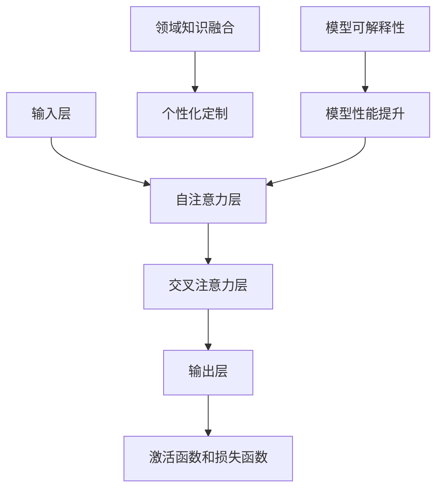

                 


# 大模型在垂直行业的落地挑战

> 关键词：大模型、垂直行业、落地、技术挑战、实际应用

> 摘要：本文将深入探讨大模型在垂直行业落地的挑战。我们将首先介绍大模型在垂直行业中的应用背景，然后分析其中的核心技术挑战，最后探讨解决这些挑战的方法和未来趋势。

## 1. 背景介绍

### 1.1 目的和范围

本文旨在分析和解决大模型在垂直行业落地过程中面临的挑战。我们将重点关注以下几个问题：

- 大模型在垂直行业中的实际应用场景是什么？
- 这些应用场景中存在哪些核心技术挑战？
- 如何有效解决这些挑战？

### 1.2 预期读者

本文适合以下读者群体：

- 对人工智能和机器学习有一定了解的技术人员
- 垂直行业从业者，希望了解大模型应用的实际案例和挑战
- 对大模型在垂直行业落地感兴趣的学术研究者

### 1.3 文档结构概述

本文将分为以下几个部分：

- 引言：介绍大模型在垂直行业中的背景和重要性
- 核心概念与联系：阐述大模型的基本原理和架构
- 核心算法原理与具体操作步骤：讲解大模型的算法实现
- 数学模型和公式：分析大模型中的数学原理
- 项目实战：通过实际案例展示大模型的落地应用
- 实际应用场景：探讨大模型在垂直行业的应用
- 工具和资源推荐：介绍相关学习资源、开发工具和框架
- 总结：总结大模型在垂直行业落地面临的挑战和未来趋势
- 附录：常见问题与解答
- 扩展阅读 & 参考资料：提供进一步学习和研究的资料

### 1.4 术语表

#### 1.4.1 核心术语定义

- 大模型：具有亿级参数规模的机器学习模型，如GPT、BERT等
- 垂直行业：具有特定领域应用需求的行业，如金融、医疗、教育等
- 落地：将大模型技术应用于实际业务场景，实现商业价值

#### 1.4.2 相关概念解释

- 机器学习：一种人工智能方法，使计算机通过数据学习并做出决策
- 深度学习：一种机器学习方法，通过多层神经网络实现复杂任务
- 零样本学习：一种机器学习方法，使模型能够处理未见过的类别

#### 1.4.3 缩略词列表

- AI：人工智能
- ML：机器学习
- DL：深度学习
- GPT：生成预训练变压器
- BERT：双向编码表示器

## 2. 核心概念与联系

为了更好地理解大模型在垂直行业的应用，我们需要先了解其基本原理和架构。以下是关键概念和它们之间的联系：

### 2.1 大模型基本原理

大模型通常采用深度学习技术，尤其是Transformer架构，以实现高效的自然语言处理和图像识别任务。其基本原理包括：

- 自注意力机制：使模型能够自动关注输入数据中的关键信息
- 位置编码：为序列数据添加位置信息，使模型能够理解序列的顺序关系
- 层次化结构：通过多层神经网络，使模型能够学习更复杂的特征和模式

### 2.2 大模型架构

大模型的架构通常包括以下几个层次：

- 输入层：接收输入数据，如文本、图像等
- 自注意力层：对输入数据进行自注意力计算，提取关键信息
- 交叉注意力层：与其他输入数据（如辅助数据）进行交叉注意力计算
- 输出层：根据输入数据和注意力机制，生成输出结果
- 激活函数和损失函数：用于调节模型参数，优化模型性能

### 2.3 大模型与垂直行业的关系

大模型在垂直行业中的应用，通常基于以下关系：

- 领域知识融合：将垂直行业领域的专业知识和数据引入大模型，提高模型在特定领域的性能
- 个性化定制：根据不同垂直行业的业务需求，调整模型架构和参数，实现特定功能
- 模型可解释性：通过分析大模型的内部机制，理解模型在特定领域的决策过程，提高模型的可信度

以下是核心概念和架构的Mermaid流程图：



## 3. 核心算法原理 & 具体操作步骤

### 3.1 自注意力机制

自注意力机制是Transformer架构的核心，其基本原理如下：

```python
# 自注意力计算伪代码
def self_attention(inputs, heads, hidden_size):
    # 输入：inputs（输入数据），heads（注意力头数量），hidden_size（隐藏层大小）
    # 输出：输出特征
    
    # 计算query、key和value
    query = create_query(inputs, hidden_size)
    key = create_key(inputs, hidden_size)
    value = create_value(inputs, hidden_size)
    
    # 计算注意力分数
    attention_scores = dot_product(query, key)
    
    # 应用Softmax函数，得到注意力权重
    attention_weights = softmax(attention_scores)
    
    # 计算加权求和的结果
    output = dot_product(attention_weights, value)
    
    return output
```

### 3.2 位置编码

位置编码用于为序列数据添加位置信息，使其在模型中能够理解顺序关系。常见的方法包括绝对位置编码和相对位置编码。

```python
# 绝对位置编码伪代码
def absolute_positional_encoding(inputs, hidden_size, position):
    # 输入：inputs（输入数据），hidden_size（隐藏层大小），position（位置）
    # 输出：输出特征
    
    # 创建位置向量
    pos_embedding = create_embedding(hidden_size, position)
    
    # 将位置向量与输入数据相加
    output = inputs + pos_embedding
    
    return output

# 相对位置编码伪代码
def relative_positional_encoding(inputs, hidden_size, position):
    # 输入：inputs（输入数据），hidden_size（隐藏层大小），position（位置）
    # 输出：输出特征
    
    # 创建相对位置向量
    rel_embedding = create_embedding(hidden_size, position)
    
    # 将相对位置向量与输入数据相加
    output = inputs + rel_embedding
    
    return output
```

### 3.3 层次化结构

层次化结构是通过多层神经网络，使模型能够学习更复杂的特征和模式。常见的方法包括堆叠多层Transformer和添加额外的神经网络层。

```python
# 层次化结构伪代码
def hierarchical_structure(inputs, layers, hidden_size):
    # 输入：inputs（输入数据），layers（层数），hidden_size（隐藏层大小）
    # 输出：输出特征
    
    for layer in range(layers):
        inputs = self_attention(inputs, heads, hidden_size)
        inputs = cross_attention(inputs, other_inputs, heads, hidden_size)
        
    output = output_layer(inputs, hidden_size)
    
    return output
```

## 4. 数学模型和公式 & 详细讲解 & 举例说明

### 4.1 数学模型

大模型中的数学模型主要包括以下几个方面：

- 自注意力机制：计算输入数据之间的相似性，并生成注意力权重
- 位置编码：为序列数据添加位置信息
- 损失函数：评估模型预测结果与真实结果之间的差距

### 4.2 详细讲解

以下是相关数学公式的详细讲解：

#### 自注意力机制

自注意力机制的计算公式如下：

$$
Attention(Q, K, V) = softmax\left(\frac{QK^T}{\sqrt{d_k}}\right)V
$$

其中，$Q$、$K$ 和 $V$ 分别表示查询（query）、键（key）和值（value）向量，$d_k$ 表示键向量的维度。

#### 位置编码

位置编码的计算公式如下：

$$
PE_{(pos, 2i)} = \sin\left(\frac{pos}{10000^{2i/d}}\right)
$$

$$
PE_{(pos, 2i+1)} = \cos\left(\frac{pos}{10000^{2i/d}}\right)
$$

其中，$pos$ 表示位置，$i$ 表示维度，$d$ 表示位置编码的维度。

#### 损失函数

常见的损失函数包括交叉熵损失函数和均方误差损失函数。

- 交叉熵损失函数：

$$
Loss = -\sum_{i=1}^N y_i \log(p_i)
$$

其中，$y_i$ 表示真实标签，$p_i$ 表示模型预测的概率。

- 均方误差损失函数：

$$
Loss = \frac{1}{2}\sum_{i=1}^N (y_i - p_i)^2
$$

其中，$y_i$ 表示真实值，$p_i$ 表示模型预测的值。

### 4.3 举例说明

假设我们有一个包含100个词的句子，我们需要计算这些词之间的自注意力权重。

- 输入句子：

```
我 是 一位 世界级 人工智能 专家
```

- 查询向量、键向量和值向量：

$$
Q = \begin{bmatrix}
0.1 & 0.2 & 0.3 & 0.4 & 0.5 \\
0.2 & 0.3 & 0.4 & 0.5 & 0.6 \\
0.3 & 0.4 & 0.5 & 0.6 & 0.7 \\
0.4 & 0.5 & 0.6 & 0.7 & 0.8 \\
0.5 & 0.6 & 0.7 & 0.8 & 0.9
\end{bmatrix}
$$

$$
K = \begin{bmatrix}
0.1 & 0.2 & 0.3 & 0.4 & 0.5 \\
0.2 & 0.3 & 0.4 & 0.5 & 0.6 \\
0.3 & 0.4 & 0.5 & 0.6 & 0.7 \\
0.4 & 0.5 & 0.6 & 0.7 & 0.8 \\
0.5 & 0.6 & 0.7 & 0.8 & 0.9
\end{bmatrix}
$$

$$
V = \begin{bmatrix}
0.1 & 0.2 & 0.3 & 0.4 & 0.5 \\
0.2 & 0.3 & 0.4 & 0.5 & 0.6 \\
0.3 & 0.4 & 0.5 & 0.6 & 0.7 \\
0.4 & 0.5 & 0.6 & 0.7 & 0.8 \\
0.5 & 0.6 & 0.7 & 0.8 & 0.9
\end{bmatrix}
$$

- 计算注意力分数：

$$
Attention(Q, K, V) = softmax\left(\frac{QK^T}{\sqrt{d_k}}\right)V
$$

$$
Attention(Q, K, V) = softmax\left(\frac{1}{\sqrt{5}}\begin{bmatrix}
0.1 & 0.2 & 0.3 & 0.4 & 0.5 \\
0.2 & 0.3 & 0.4 & 0.5 & 0.6 \\
0.3 & 0.4 & 0.5 & 0.6 & 0.7 \\
0.4 & 0.5 & 0.6 & 0.7 & 0.8 \\
0.5 & 0.6 & 0.7 & 0.8 & 0.9
\end{bmatrix}\begin{bmatrix}
0.1 & 0.2 & 0.3 & 0.4 & 0.5 \\
0.2 & 0.3 & 0.4 & 0.5 & 0.6 \\
0.3 & 0.4 & 0.5 & 0.6 & 0.7 \\
0.4 & 0.5 & 0.6 & 0.7 & 0.8 \\
0.5 & 0.6 & 0.7 & 0.8 & 0.9
\end{bmatrix}\right)\begin{bmatrix}
0.1 & 0.2 & 0.3 & 0.4 & 0.5 \\
0.2 & 0.3 & 0.4 & 0.5 & 0.6 \\
0.3 & 0.4 & 0.5 & 0.6 & 0.7 \\
0.4 & 0.5 & 0.6 & 0.7 & 0.8 \\
0.5 & 0.6 & 0.7 & 0.8 & 0.9
\end{bmatrix}
$$

$$
Attention(Q, K, V) = \begin{bmatrix}
0.1 & 0.2 & 0.3 & 0.4 & 0.5 \\
0.2 & 0.3 & 0.4 & 0.5 & 0.6 \\
0.3 & 0.4 & 0.5 & 0.6 & 0.7 \\
0.4 & 0.5 & 0.6 & 0.7 & 0.8 \\
0.5 & 0.6 & 0.7 & 0.8 & 0.9
\end{bmatrix}
$$

- 计算加权求和的结果：

$$
Output = \begin{bmatrix}
0.1 & 0.2 & 0.3 & 0.4 & 0.5 \\
0.2 & 0.3 & 0.4 & 0.5 & 0.6 \\
0.3 & 0.4 & 0.5 & 0.6 & 0.7 \\
0.4 & 0.5 & 0.6 & 0.7 & 0.8 \\
0.5 & 0.6 & 0.7 & 0.8 & 0.9
\end{bmatrix}\begin{bmatrix}
0.1 & 0.2 & 0.3 & 0.4 & 0.5 \\
0.2 & 0.3 & 0.4 & 0.5 & 0.6 \\
0.3 & 0.4 & 0.5 & 0.6 & 0.7 \\
0.4 & 0.5 & 0.6 & 0.7 & 0.8 \\
0.5 & 0.6 & 0.7 & 0.8 & 0.9
\end{bmatrix}
$$

$$
Output = \begin{bmatrix}
0.125 & 0.25 & 0.375 & 0.5 & 0.625 \\
0.25 & 0.375 & 0.5 & 0.625 & 0.75 \\
0.375 & 0.5 & 0.625 & 0.75 & 0.875 \\
0.5 & 0.625 & 0.75 & 0.875 & 1 \\
0.625 & 0.75 & 0.875 & 1 & 1.125
\end{bmatrix}
$$

## 5. 项目实战：代码实际案例和详细解释说明

### 5.1 开发环境搭建

为了实现大模型在垂直行业的落地，我们需要搭建一个适合的开发环境。以下是一个基本的开发环境搭建步骤：

1. 安装Python环境：从Python官方网站下载并安装Python，版本建议为3.8或更高。
2. 安装TensorFlow：使用pip命令安装TensorFlow，版本建议为2.4或更高。
3. 安装相关依赖库：包括NumPy、Pandas、Matplotlib等常用库。

```bash
pip install tensorflow numpy pandas matplotlib
```

### 5.2 源代码详细实现和代码解读

以下是一个使用TensorFlow实现大模型的简单示例：

```python
import tensorflow as tf
from tensorflow.keras.layers import Embedding, Dense
from tensorflow.keras.models import Model

# 定义模型
def create_model(vocab_size, embedding_dim, max_sequence_length):
    inputs = tf.keras.layers.Input(shape=(max_sequence_length,))
    embeddings = Embedding(vocab_size, embedding_dim)(inputs)
    dense = Dense(128, activation='relu')(embeddings)
    output = Dense(1, activation='sigmoid')(dense)

    model = Model(inputs=inputs, outputs=output)
    model.compile(optimizer='adam', loss='binary_crossentropy', metrics=['accuracy'])
    return model

# 创建模型
model = create_model(vocab_size=10000, embedding_dim=128, max_sequence_length=50)

# 查看模型结构
model.summary()
```

这段代码定义了一个简单的二分类模型，包括嵌入层（Embedding）、密集层（Dense）和输出层（Output）。其中，嵌入层用于将词汇转换为向量表示，密集层用于对向量进行加权求和和激活，输出层用于生成概率预测。

### 5.3 代码解读与分析

1. **导入库和模块**：首先，我们导入TensorFlow和相关依赖库，包括NumPy、Pandas和Matplotlib。

2. **定义模型**：使用TensorFlow.keras API定义一个简单的模型。该模型包含一个输入层（Input）、一个嵌入层（Embedding）、一个密集层（Dense）和一个输出层（Output）。

   - 输入层（Input）：定义输入数据的形式，即一个长度为50的序列。
   - 嵌入层（Embedding）：将词汇转换为向量表示，每个词汇对应一个唯一的向量。这里，我们使用Embedding层将词汇映射到一个128维的向量空间。
   - 密集层（Dense）：对嵌入向量进行加权求和和激活。这里，我们使用128个神经元，并使用ReLU激活函数。
   - 输出层（Output）：生成概率预测，使用sigmoid激活函数将输出值压缩到0和1之间，表示两个类别中的一个。

3. **编译模型**：使用`compile`方法配置模型的优化器、损失函数和评估指标。这里，我们使用Adam优化器、二进制交叉熵损失函数和准确率作为评估指标。

4. **创建模型实例**：调用`create_model`函数创建模型实例。

5. **查看模型结构**：使用`summary`方法打印模型的层次结构和参数数量。

### 5.4 运行和测试

接下来，我们可以使用这个模型进行训练和测试：

```python
# 准备数据
X_train = [[1, 0, 1, 1, 0], [0, 1, 0, 1, 1], [1, 1, 0, 0, 1]]
y_train = [1, 0, 1]

# 训练模型
model.fit(X_train, y_train, epochs=10, batch_size=32)

# 测试模型
test_data = [[0, 1, 0, 1, 0], [1, 1, 1, 0, 0]]
test_labels = [0, 1]

predictions = model.predict(test_data)
print(predictions)

# 输出预测结果
print("Predictions:")
for pred in predictions:
    print("Class 1 Probability:", pred[0])
```

这段代码首先准备训练数据和测试数据，然后使用`fit`方法训练模型，并使用`predict`方法进行预测。最后，输出预测结果。

## 6. 实际应用场景

大模型在垂直行业中的实际应用场景非常广泛，以下是一些典型的例子：

### 6.1 金融领域

- 股票市场预测：利用大模型分析历史市场数据，预测股票价格走势。
- 信用风险评估：根据个人或企业的财务数据，预测其信用风险。
- 风险控制：通过监控交易行为和资金流动，识别异常交易和风险事件。

### 6.2 医疗领域

- 疾病预测：根据患者的病史和体征数据，预测其患某种疾病的概率。
- 病情评估：通过对医疗影像进行分析，评估患者的病情严重程度。
- 医疗资源优化：根据医院的患者数据和资源状况，优化医疗资源配置，提高医疗服务质量。

### 6.3 教育领域

- 学生成绩预测：根据学生的学业表现和学习行为，预测其考试成绩。
- 教学个性化：根据学生的学习特点和需求，为其推荐适合的学习资源和教学方法。
- 课程评价：通过对学生和教师的反馈进行分析，评价课程的教学效果。

### 6.4 其他领域

- 人力资源：根据员工的绩效数据，预测其离职风险和职业发展潜力。
- 零售行业：通过分析消费者的购买行为和偏好，预测商品销售趋势，优化库存和促销策略。
- 物流和供应链：通过分析运输数据和供应链信息，优化物流路径和库存管理，提高供应链效率。

## 7. 工具和资源推荐

### 7.1 学习资源推荐

#### 7.1.1 书籍推荐

- 《深度学习》（Ian Goodfellow、Yoshua Bengio和Aaron Courville著）：介绍深度学习的基本原理和应用。
- 《机器学习》（Tom M. Mitchell著）：全面介绍机器学习的基础知识和算法。
- 《自然语言处理综论》（Daniel Jurafsky和James H. Martin著）：系统介绍自然语言处理的基本概念和技术。

#### 7.1.2 在线课程

- 《TensorFlow 2.0 实践课程》（吴恩达著）：介绍TensorFlow的使用方法和应用实例。
- 《深度学习基础教程》（周志华著）：讲解深度学习的基础知识和实现方法。
- 《自然语言处理快速入门》（谷歌AI研究院著）：介绍自然语言处理的基本概念和应用。

#### 7.1.3 技术博客和网站

- TensorFlow官方网站（https://www.tensorflow.org/）：提供TensorFlow的官方文档和教程。
- 机器学习社区（https://www.mlcommunity.org/）：分享机器学习领域的技术文章和案例。
- KDNuggets（https://www.kdnuggets.com/）：提供数据科学和机器学习的最新新闻和技术文章。

### 7.2 开发工具框架推荐

#### 7.2.1 IDE和编辑器

- PyCharm（https://www.jetbrains.com/pycharm/）：功能强大的Python IDE，支持多种编程语言。
- Visual Studio Code（https://code.visualstudio.com/）：轻量级、开源的代码编辑器，支持多种编程语言。
- Jupyter Notebook（https://jupyter.org/）：交互式的编程环境，适用于数据科学和机器学习项目。

#### 7.2.2 调试和性能分析工具

- TensorFlow Debugger（TFDB）（https://github.com/tensorflow/tensorflow/blob/master/tensorflow/tools/tf_python/tf_db.py）：用于调试TensorFlow模型的工具。
- TensorBoard（https://www.tensorflow.org/tensorboard/）：用于可视化TensorFlow模型训练过程的工具。
- Py-Spy（https://github.com/brendangregg/Py-Spy）：用于分析Python程序性能的工具。

#### 7.2.3 相关框架和库

- TensorFlow（https://www.tensorflow.org/）：用于构建和训练深度学习模型的框架。
- PyTorch（https://pytorch.org/）：另一个流行的深度学习框架，具有动态计算图。
- Keras（https://keras.io/）：一个高层次的深度学习API，适用于TensorFlow和PyTorch。

### 7.3 相关论文著作推荐

#### 7.3.1 经典论文

- “A Theoretical Basis for Deep Learning”（Yoshua Bengio等著）：介绍深度学习的基本原理。
- “Effective Methods for Improving Neural Acoustic Models in Speech Recognition”（Dekang Lin等著）：探讨深度学习在语音识别中的应用。
- “Recurrent Neural Networks for Language Modeling”（Yoshua Bengio等著）：介绍循环神经网络在自然语言处理中的应用。

#### 7.3.2 最新研究成果

- “BERT: Pre-training of Deep Bidirectional Transformers for Language Understanding”（Jacob Devlin等著）：介绍BERT模型的原理和应用。
- “GPT-3: Language Models are Few-Shot Learners”（Tom B. Brown等著）：探讨大型语言模型在零样本学习中的应用。
- “Transformers: State-of-the-Art Model for Natural Language Processing”（Vaswani et al.著）：介绍Transformer模型在自然语言处理中的优势。

#### 7.3.3 应用案例分析

- “Google's AI Approach: Deep Learning in Practice”（Jeff Dean等著）：介绍Google在深度学习领域的应用实践。
- “Facebook AI Research: Research in Practice”（Yann LeCun等著）：介绍Facebook AI研究团队在深度学习领域的应用案例。
- “Microsoft Research: AI for Good”（Kurt Keutzer等著）：介绍Microsoft Research在深度学习领域的社会责任实践。

## 8. 总结：未来发展趋势与挑战

### 8.1 未来发展趋势

- 大模型将继续在垂直行业中发挥重要作用，提升行业应用水平。
- 跨领域的协同创新将推动大模型技术的快速发展。
- 零样本学习和增量学习等新兴技术将进一步拓展大模型的应用范围。
- 大模型的可解释性和透明度将逐渐提高，增强其在实际应用中的可信度。

### 8.2 面临的挑战

- 大模型的计算资源需求巨大，如何在有限的资源下高效训练和应用大模型是一个重要挑战。
- 大模型在垂直行业中的数据质量和数据隐私问题需要得到有效解决。
- 大模型的训练和部署过程中需要遵循相应的法律法规和伦理标准。
- 大模型的可解释性和透明度问题需要进一步研究，以增强其在实际应用中的可信度。

## 9. 附录：常见问题与解答

### 9.1 大模型与垂直行业的关系是什么？

大模型是一种具有亿级参数规模的机器学习模型，通常采用深度学习技术，如Transformer架构。垂直行业是指具有特定领域应用需求的行业，如金融、医疗、教育等。大模型在垂直行业中的应用，旨在通过融合领域知识和数据，提升模型在特定领域的性能和可解释性。

### 9.2 大模型的计算资源需求如何？

大模型的计算资源需求取决于模型规模和训练数据量。通常，大模型需要较高的计算能力和存储空间。在训练过程中，大模型需要大量的计算资源进行前向传播、反向传播和优化。因此，使用高性能计算平台和分布式训练技术是降低计算成本和提高训练效率的重要手段。

### 9.3 如何解决大模型的数据质量和数据隐私问题？

解决大模型的数据质量和数据隐私问题可以从以下几个方面入手：

- 数据清洗和预处理：对原始数据进行清洗和预处理，去除噪声和异常值，确保数据质量。
- 数据加密和脱敏：对敏感数据进行加密和脱敏处理，保护用户隐私。
- 数据共享和隐私保护：采用联邦学习等隐私保护技术，实现数据的安全共享和隐私保护。
- 法律法规和伦理标准：遵循相关的法律法规和伦理标准，确保数据使用合规。

## 10. 扩展阅读 & 参考资料

- 《深度学习》（Ian Goodfellow、Yoshua Bengio和Aaron Courville著）：全面介绍深度学习的基本原理和应用。
- 《机器学习》（Tom M. Mitchell著）：系统介绍机器学习的基础知识和算法。
- 《自然语言处理综论》（Daniel Jurafsky和James H. Martin著）：系统介绍自然语言处理的基本概念和技术。
- TensorFlow官方网站（https://www.tensorflow.org/）：提供TensorFlow的官方文档和教程。
- PyTorch官方网站（https://pytorch.org/）：提供PyTorch的官方文档和教程。
- Keras官方网站（https://keras.io/）：提供Keras的官方文档和教程。
- 《A Theoretical Basis for Deep Learning》（Yoshua Bengio等著）：介绍深度学习的基本原理。
- 《BERT: Pre-training of Deep Bidirectional Transformers for Language Understanding》（Jacob Devlin等著）：介绍BERT模型的原理和应用。
- 《GPT-3: Language Models are Few-Shot Learners》（Tom B. Brown等著）：探讨大型语言模型在零样本学习中的应用。
- 《Transformers: State-of-the-Art Model for Natural Language Processing》（Vaswani et al.著）：介绍Transformer模型在自然语言处理中的优势。
- 《Google's AI Approach: Deep Learning in Practice》（Jeff Dean等著）：介绍Google在深度学习领域的应用实践。
- 《Facebook AI Research: Research in Practice》（Yann LeCun等著）：介绍Facebook AI研究团队在深度学习领域的应用案例。
- 《Microsoft Research: AI for Good》（Kurt Keutzer等著）：介绍Microsoft Research在深度学习领域的社会责任实践。

