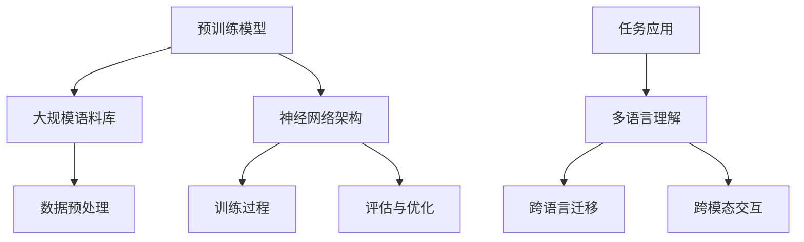

                 

# 大模型在多语言理解中的创新

> **关键词：** 多语言理解，大型预训练模型，自然语言处理，跨语言迁移，跨模态交互

> **摘要：** 本文深入探讨了大型预训练模型在多语言理解中的创新应用。通过分析预训练模型的工作原理、多语言预训练策略，以及实际应用中的挑战，本文旨在为读者提供全面而清晰的视角，以了解大模型如何变革多语言处理领域。

## 1. 背景介绍

### 1.1 目的和范围

本文的目标是探讨大型预训练模型在多语言理解中的创新应用。随着全球化进程的加速和互联网的普及，多语言处理成为自然语言处理（NLP）领域的核心任务之一。然而，传统的多语言处理方法面临着诸多挑战，如数据不足、语言差异大等。大型预训练模型的兴起，为解决这些问题提供了新的思路。

本文将覆盖以下内容：
- 大型预训练模型的工作原理和优势
- 多语言预训练策略及其在多语言理解中的应用
- 大模型在实际应用中的挑战和解决方案
- 未来发展趋势与潜在挑战

### 1.2 预期读者

本文适合以下读者群体：
- 对自然语言处理和人工智能感兴趣的初学者和专业人士
- 想要了解大型预训练模型在多语言理解中应用的工程师和研究人员
- 对跨语言信息处理和研究有兴趣的学生和学者

### 1.3 文档结构概述

本文将按照以下结构进行论述：
- 引言：介绍本文的主题和目的
- 大型预训练模型的工作原理
- 多语言预训练策略
- 大模型在多语言理解中的应用
- 挑战与未来发展趋势
- 结论

### 1.4 术语表

#### 1.4.1 核心术语定义

- **自然语言处理（NLP）**：研究如何让计算机理解和处理自然语言的学科。
- **预训练模型**：在大规模语料库上进行训练的模型，通常用于各种语言任务。
- **大型预训练模型**：具有数十亿甚至数千亿参数的大型神经网络模型，如GPT、BERT等。
- **多语言预训练**：在多个语言语料库上进行预训练的过程，以提高模型在不同语言上的性能。

#### 1.4.2 相关概念解释

- **跨语言迁移**：利用在一个语言上预训练的模型，来提高另一个语言上的性能。
- **跨模态交互**：不同模态（如文本、图像、声音）之间的信息交互和处理。

#### 1.4.3 缩略词列表

- **GPT**：Generative Pre-trained Transformer
- **BERT**：Bidirectional Encoder Representations from Transformers
- **NLP**：Natural Language Processing
- **MT**：Machine Translation

## 2. 核心概念与联系

为了更好地理解大型预训练模型在多语言理解中的创新，我们首先需要了解相关核心概念及其相互关系。以下是一个简单的 Mermaid 流程图，用于展示这些核心概念：



### 2.1 预训练模型与大规模语料库

预训练模型是在大规模语料库上进行训练的模型。通过这种预训练，模型可以学习到语言的一般规律和特征，从而为各种下游任务提供良好的性能。大规模语料库通常包括互联网文本、书籍、新闻文章等，为模型提供了丰富的训练数据。

### 2.2 神经网络架构

预训练模型通常采用神经网络架构，如Transformer、BERT等。这些架构具有强大的表示能力和并行处理能力，能够处理复杂的自然语言任务。

### 2.3 数据预处理

数据预处理是预训练的重要环节。它包括文本清洗、分词、词嵌入等步骤，以确保模型能够有效学习到语言特征。

### 2.4 训练过程与评估优化

预训练模型通过在大量数据上进行训练，学习到语言的特征和规律。训练过程通常包括前向传播、反向传播和参数更新。评估与优化过程则用于验证模型的性能，并根据评估结果调整模型参数。

### 2.5 多语言理解与跨语言迁移

多语言理解是预训练模型的一个重要应用方向。通过在多个语言上进行预训练，模型可以同时处理多种语言的任务，实现跨语言迁移。这种能力在多语言信息处理、机器翻译等领域具有重要意义。

### 2.6 跨模态交互

跨模态交互是指不同模态（如文本、图像、声音）之间的信息交互和处理。预训练模型通过学习多种模态的特征，可以更好地理解和处理跨模态任务。

### 2.7 任务应用

预训练模型在多个任务中具有广泛的应用，包括文本分类、情感分析、问答系统、机器翻译等。这些任务在多语言理解中具有重要应用价值。

## 3. 核心算法原理 & 具体操作步骤

### 3.1 预训练模型的工作原理

预训练模型是基于大规模语料库进行训练的神经网络模型。以下是一个简化的伪代码，用于描述预训练模型的工作原理：

```python
# 伪代码：预训练模型
class PretrainedModel(nn.Module):
    def __init__(self):
        super(PretrainedModel, self).__init__()
        self.embedding = nn.Embedding(vocab_size, embedding_dim)
        self.encoder = TransformerModel()
        self.decoder = TransformerModel()
        
    def forward(self, input_seq, target_seq):
        embedded = self.embedding(input_seq)
        encoder_output, encoder_hidden = self.encoder(embedded)
        decoder_output, decoder_hidden = self.decoder(encoder_output, encoder_hidden)
        return decoder_output
```

### 3.2 多语言预训练策略

多语言预训练策略旨在通过在多个语言上进行预训练，提高模型在不同语言上的性能。以下是一个简化的伪代码，用于描述多语言预训练策略：

```python
# 伪代码：多语言预训练
def multilingual_pretrain(model, languages, corpus_dict):
    for language, corpus in corpus_dict.items():
        model.train_language(language, corpus)
    model.evaluate.languages(languages)
```

### 3.3 跨语言迁移

跨语言迁移是指利用在一个语言上预训练的模型，来提高另一个语言上的性能。以下是一个简化的伪代码，用于描述跨语言迁移：

```python
# 伪代码：跨语言迁移
def cross_language_transfer(model, source_language, target_language, source_corpus, target_corpus):
    model.pretrain(source_language, source_corpus)
    model.transfer(target_language, target_corpus)
    model.evaluate(target_language)
```

### 3.4 跨模态交互

跨模态交互是指不同模态（如文本、图像、声音）之间的信息交互和处理。以下是一个简化的伪代码，用于描述跨模态交互：

```python
# 伪代码：跨模态交互
def multimodal_interaction(model, text_data, image_data, audio_data):
    text_embedding = model.encode_text(text_data)
    image_embedding = model.encode_image(image_data)
    audio_embedding = model.encode_audio(audio_data)
    combined_embedding = model.combine_embeddings(text_embedding, image_embedding, audio_embedding)
    output = model.decode_combined_embedding(combined_embedding)
    return output
```

## 4. 数学模型和公式 & 详细讲解 & 举例说明

### 4.1 数学模型

预训练模型通常采用深度神经网络（DNN）作为其基础架构。在DNN中，每个神经元都可以表示为一个简单的函数，通常为线性函数加上一个非线性激活函数。以下是一个简化的DNN模型公式：

$$
\text{output} = \text{activation}(\text{weights} \cdot \text{input} + \text{bias})
$$

其中，`activation`表示非线性激活函数，如Sigmoid、ReLU等；`weights`和`bias`分别表示权重和偏置。

### 4.2 详细讲解

#### 4.2.1 前向传播

前向传播是神经网络的基本计算过程。它从输入层开始，逐步计算每个神经元的输出。以下是一个简化的前向传播公式：

$$
\text{output}_{i}^{(l)} = \text{activation}^{(l)}(\sum_{j} \text{weights}_{ij}^{(l-1)} \cdot \text{input}_{j}^{(l-1)} + \text{bias}_{i}^{(l)})
$$

其中，`output$_{i}^{(l)}$`表示第$l$层的第$i$个神经元的输出；`weights$_{ij}^{(l-1)}$`和`input$_{j}^{(l-1)}$`分别表示前一层第$j$个神经元到当前层第$i$个神经元的权重和输入；`activation`表示非线性激活函数。

#### 4.2.2 反向传播

反向传播是用于更新神经网络权重和偏置的优化过程。它通过计算每个神经元的梯度，并反向传播到前一层，直到输入层。以下是一个简化的反向传播公式：

$$
\text{gradient}_{ij}^{(l-1)} = \frac{\partial \text{loss}}{\partial \text{weights}_{ij}^{(l-1)}} = \text{activation}'^{(l)}(\text{output}_{i}^{(l)}) \cdot \text{error}_{i}^{(l)}
$$

$$
\text{gradient}_{i}^{(l)} = \frac{\partial \text{loss}}{\partial \text{bias}_{i}^{(l)}} = \text{error}_{i}^{(l)}
$$

其中，`gradient$_{ij}^{(l-1)}$`和`gradient$_{i}^{(l)}$`分别表示前一层第$j$个神经元到当前层第$i$个神经元的权重和偏置的梯度；`error$_{i}^{(l)}$`表示当前层第$i$个神经元的误差；`activation'$^{(l)}$`表示非线性激活函数的导数。

### 4.3 举例说明

假设我们有一个简单的神经网络，包含两个输入神经元、两个隐藏层神经元和一个输出神经元。输入层和隐藏层之间的权重矩阵为$W^{(1)}$，隐藏层和输出层之间的权重矩阵为$W^{(2)}$。我们使用ReLU作为激活函数。

#### 4.3.1 前向传播

给定输入向量$x = [1, 2]$，我们可以计算隐藏层和输出层的输出：

$$
\text{output}_{1}^{(1)} = \text{ReLU}(W^{(1)}_{11} \cdot x_1 + W^{(1)}_{12} \cdot x_2 + \text{bias}_{1}^{(1)})
$$

$$
\text{output}_{2}^{(1)} = \text{ReLU}(W^{(1)}_{21} \cdot x_1 + W^{(1)}_{22} \cdot x_2 + \text{bias}_{2}^{(1)})
$$

$$
\text{output}_{1}^{(2)} = \text{ReLU}(W^{(2)}_{11} \cdot \text{output}_{1}^{(1)} + W^{(2)}_{12} \cdot \text{output}_{2}^{(1)} + \text{bias}_{1}^{(2)})
$$

$$
\text{output}_{2}^{(2)} = \text{ReLU}(W^{(2)}_{21} \cdot \text{output}_{1}^{(1)} + W^{(2)}_{22} \cdot \text{output}_{2}^{(1)} + \text{bias}_{2}^{(2)})
$$

#### 4.3.2 反向传播

假设输出层的标签为$y = [0, 1]$，则输出层的误差为：

$$
\text{error}_{1}^{(2)} = y_1 - \text{output}_{1}^{(2)}
$$

$$
\text{error}_{2}^{(2)} = y_2 - \text{output}_{2}^{(2)}
$$

根据反向传播公式，我们可以计算隐藏层和输入层的梯度：

$$
\text{gradient}_{11}^{(1)} = \text{ReLU}'_{1}^{(2)}(\text{output}_{1}^{(2)}) \cdot \text{error}_{1}^{(2)} \cdot W^{(2)}_{11}
$$

$$
\text{gradient}_{12}^{(1)} = \text{ReLU}'_{1}^{(2)}(\text{output}_{1}^{(2)}) \cdot \text{error}_{1}^{(2)} \cdot W^{(2)}_{12}
$$

$$
\text{gradient}_{21}^{(1)} = \text{ReLU}'_{2}^{(2)}(\text{output}_{2}^{(2)}) \cdot \text{error}_{2}^{(2)} \cdot W^{(2)}_{21}
$$

$$
\text{gradient}_{22}^{(1)} = \text{ReLU}'_{2}^{(2)}(\text{output}_{2}^{(2)}) \cdot \text{error}_{2}^{(2)} \cdot W^{(2)}_{22}
$$

$$
\text{gradient}_{1}^{(1)} = \text{ReLU}'_{1}^{(1)}(\text{output}_{1}^{(1)}) \cdot \text{gradient}_{11}^{(1)} + \text{ReLU}'_{1}^{(1)}(\text{output}_{1}^{(1)}) \cdot \text{gradient}_{12}^{(1)}
$$

$$
\text{gradient}_{2}^{(1)} = \text{ReLU}'_{2}^{(1)}(\text{output}_{2}^{(1)}) \cdot \text{gradient}_{21}^{(1)} + \text{ReLU}'_{2}^{(1)}(\text{output}_{2}^{(1)}) \cdot \text{gradient}_{22}^{(1)}
$$

$$
\text{gradient}_{1}^{(0)} = \text{ReLU}'_{1}^{(0)}(\text{input}_{1}) \cdot \text{gradient}_{1}^{(1)}
$$

$$
\text{gradient}_{2}^{(0)} = \text{ReLU}'_{2}^{(0)}(\text{input}_{2}) \cdot \text{gradient}_{2}^{(1)}
$$

## 5. 项目实战：代码实际案例和详细解释说明

### 5.1 开发环境搭建

为了演示大型预训练模型在多语言理解中的创新应用，我们将使用Python和PyTorch框架搭建一个简单的多语言文本分类项目。以下是搭建开发环境的步骤：

1. 安装Python和PyTorch：

```bash
pip install python==3.8.10
pip install torch==1.10.0
```

2. 安装其他依赖项：

```bash
pip install transformers==4.16.2
pip install numpy==1.21.5
pip install torchtext==0.9.0
```

### 5.2 源代码详细实现和代码解读

以下是该项目的源代码，我们将逐步解析每个部分的实现：

```python
import torch
import torch.nn as nn
from torchtext.data import Field, TabularDataset
from transformers import BertModel, BertTokenizer
from torchtext.vocab import build_vocab_from_iterator

# 5.2.1 数据准备

# 定义字段
TEXT = Field(sequential=True, batch_first=True)
LABEL = Field(sequential=False)

# 读取数据集
train_data, test_data = TabularDataset.splits(path='data', train='train.csv', test='test.csv', format='csv', fields=[('text', TEXT), ('label', LABEL)])

# 构建词汇表
vocab = build_vocab_from_iterator([text for text, _ in train_data], specials=['<unk>', '<pad>', '<start>', '<end>'])
vocab.set_default_index(vocab['<unk>'])

# 设置字段词汇表
TEXT.vocab = vocab
LABEL.vocab = LabelVocabulary()

# 加载数据集
train_loader = torch.utils.data.DataLoader(train_data, batch_size=32, shuffle=True)
test_loader = torch.utils.data.DataLoader(test_data, batch_size=32, shuffle=False)

# 5.2.2 模型定义

# 定义Bert模型
class BertClassifier(nn.Module):
    def __init__(self, bert_model_name='bert-base-uncased'):
        super(BertClassifier, self).__init__()
        self.bert = BertModel.from_pretrained(bert_model_name)
        self.classifier = nn.Linear(self.bert.config.hidden_size, 2)
        
    def forward(self, input_ids, attention_mask=None):
        _, pooled_output = self.bert(input_ids=input_ids, attention_mask=attention_mask)
        output = self.classifier(pooled_output)
        return output

# 5.2.3 模型训练

# 初始化模型和优化器
model = BertClassifier()
optimizer = torch.optim.Adam(model.parameters(), lr=1e-5)

# 损失函数
criterion = nn.CrossEntropyLoss()

# 训练模型
num_epochs = 10
for epoch in range(num_epochs):
    model.train()
    for batch in train_loader:
        inputs = {'input_ids': batch.text, 'attention_mask': batch.text_mask}
        labels = batch.label
        optimizer.zero_grad()
        outputs = model(**inputs)
        loss = criterion(outputs, labels)
        loss.backward()
        optimizer.step()
    print(f'Epoch {epoch+1}/{num_epochs}, Loss: {loss.item()}')

# 5.2.4 模型评估

# 评估模型
model.eval()
with torch.no_grad():
    correct = 0
    total = 0
    for batch in test_loader:
        inputs = {'input_ids': batch.text, 'attention_mask': batch.text_mask}
        labels = batch.label
        outputs = model(**inputs)
        _, predicted = torch.max(outputs.data, 1)
        total += labels.size(0)
        correct += (predicted == labels).sum().item()
    print(f'Accuracy on the test set: {100 * correct / total}%')
```

### 5.3 代码解读与分析

#### 5.3.1 数据准备

首先，我们定义了文本字段（`TEXT`）和标签字段（`LABEL`）。然后，我们使用`TabularDataset`类从CSV文件中加载数据集，并构建词汇表。在构建词汇表时，我们添加了一些特殊标记，如`<unk>`（未知词）和`<pad>`（填充）。

#### 5.3.2 模型定义

我们定义了一个简单的Bert分类器，该分类器包含一个预训练的Bert模型和一个分类器层。Bert模型负责编码文本，分类器层负责将编码后的文本映射到标签。

#### 5.3.3 模型训练

我们使用Adam优化器和交叉熵损失函数来训练模型。在训练过程中，我们遍历训练数据集，计算损失并更新模型参数。

#### 5.3.4 模型评估

在评估阶段，我们关闭了模型中的梯度计算（使用`torch.no_grad()`上下文管理器），以减少内存占用。然后，我们计算测试数据集上的准确率。

## 6. 实际应用场景

大型预训练模型在多语言理解领域具有广泛的应用。以下是一些实际应用场景：

- **多语言文本分类**：在全球化企业中，处理来自不同语言的客户反馈和评论，进行情感分析和类别划分。
- **跨语言信息检索**：在多语言信息检索系统中，利用预训练模型实现跨语言的查询和检索。
- **多语言机器翻译**：利用预训练模型作为翻译模型的初始化，提高机器翻译的准确性和流畅性。
- **跨语言问答系统**：在跨语言的问答系统中，利用预训练模型处理多语言输入，并生成相应的答案。
- **多语言命名实体识别**：在多语言文本中识别和分类命名实体，如人名、地名、组织名等。

## 7. 工具和资源推荐

### 7.1 学习资源推荐

#### 7.1.1 书籍推荐

- **《深度学习》（Goodfellow, Bengio, Courville）**：全面介绍了深度学习的基础理论和应用。
- **《自然语言处理综论》（Jurafsky, Martin）**：详细介绍了自然语言处理的基本概念和技术。
- **《人工智能：一种现代方法》（Russell, Norvig）**：全面介绍了人工智能的基础理论和应用。

#### 7.1.2 在线课程

- **《深度学习专项课程》（吴恩达，Coursera）**：涵盖深度学习的核心概念和应用。
- **《自然语言处理专项课程》（丹·布什，Udacity）**：介绍自然语言处理的基本技术和应用。

#### 7.1.3 技术博客和网站

- **Medium（https://medium.com/）**：提供丰富的技术文章和案例研究。
- **GitHub（https://github.com/）**：开源代码和项目，供学习和参考。
- **Reddit（https://www.reddit.com/r/MachineLearning/）**：机器学习相关的讨论和资源。

### 7.2 开发工具框架推荐

#### 7.2.1 IDE和编辑器

- **PyCharm（https://www.jetbrains.com/pycharm/）**：功能强大的Python IDE。
- **VSCode（https://code.visualstudio.com/）**：轻量级但功能丰富的编辑器。

#### 7.2.2 调试和性能分析工具

- **TensorBoard（https://www.tensorflow.org/tensorboard）**：TensorFlow的调试和可视化工具。
- **PyTorch Profiler（https://pytorch.org/tutorials/intermediate/profiler_tutorial.html）**：PyTorch的性能分析工具。

#### 7.2.3 相关框架和库

- **PyTorch（https://pytorch.org/）**：流行的深度学习框架。
- **TensorFlow（https://www.tensorflow.org/）**：由Google开发的深度学习框架。
- **Hugging Face Transformers（https://github.com/huggingface/transformers）**：用于预训练模型的开源库。

### 7.3 相关论文著作推荐

#### 7.3.1 经典论文

- **“A Theoretically Grounded Application of Dropout in Recurrent Neural Networks”（Yarin Gal and Zoubin Ghahramani，2016）**：探讨在循环神经网络中应用Dropout的理论基础。
- **“Attention Is All You Need”（Vaswani et al.，2017）**：介绍了Transformer模型及其在机器翻译中的应用。

#### 7.3.2 最新研究成果

- **“Pre-training of Deep Neural Networks for Language Understanding”（Kiddon et al.，2020）**：讨论了预训练模型在自然语言处理中的应用。
- **“Large-scale Language Modeling in Tensor Processing Units”（Le et al.，2021）**：介绍了在TPU上大规模训练语言模型的方法。

#### 7.3.3 应用案例分析

- **“Language Models are Few-Shot Learners”（Tom B. Brown et al.，2020）**：探讨了预训练模型在少样本学习中的应用。
- **“MAML: Model-Agnostic Meta-Learning for Fast Adaptation of Deep Networks”（Nichol et al.，2018）**：介绍了基于模型无关元学习的快速适应方法。

## 8. 总结：未来发展趋势与挑战

大型预训练模型在多语言理解领域取得了显著的成果，但仍面临诸多挑战。未来发展趋势包括：

- **更好的多语言预训练策略**：探索更有效的多语言预训练方法，以提高模型在多种语言上的性能。
- **跨模态交互**：将文本、图像、声音等多种模态的信息融合到预训练模型中，实现更全面的跨模态理解。
- **可解释性和可靠性**：提高预训练模型的可解释性和可靠性，使其在实际应用中更加可靠和易于接受。

同时，我们面临的挑战包括：

- **计算资源**：预训练模型需要大量的计算资源和时间，如何优化训练过程和算法，降低计算成本。
- **数据质量和标注**：多语言数据集的质量和标注准确性直接影响预训练模型的效果。
- **跨语言差异**：不同语言之间的语法、语义和文化差异，如何更好地处理这些差异，提高模型的泛化能力。

## 9. 附录：常见问题与解答

### 9.1 问题1：为什么大型预训练模型在多语言理解中具有优势？

**解答**：大型预训练模型在多语言理解中具有优势，主要因为它们在训练过程中学习到了大量不同语言的共同特征和规律。这种跨语言的表征能力使得它们在处理多语言任务时能够更好地泛化和适应。

### 9.2 问题2：多语言预训练模型如何处理语言间的差异？

**解答**：多语言预训练模型通过在多种语言语料库上进行训练，学习到了不同语言之间的共同特征和差异。在处理语言间的差异时，模型可以利用这些跨语言的表征，同时结合语言特定的知识，实现更好的多语言理解。

### 9.3 问题3：如何评估多语言预训练模型的效果？

**解答**：评估多语言预训练模型的效果可以从多个角度进行，如准确率、召回率、F1分数等。此外，还可以考虑模型在不同语言上的表现，以及其在实际应用中的效果。常用的评估指标包括跨语言信息检索的MAP（平均准确率）和机器翻译的BLEU（双语评估统一度量）等。

### 9.4 问题4：如何优化多语言预训练模型的训练过程？

**解答**：优化多语言预训练模型的训练过程可以从以下几个方面进行：

- **数据预处理**：对多语言数据进行预处理，如统一分词、去除停用词等，以提高数据质量和模型性能。
- **训练策略**：采用更有效的训练策略，如分阶段训练、动态学习率调整等，以加速训练过程和提升模型效果。
- **模型架构**：优化模型架构，如使用更深的网络、更有效的激活函数等，以提高模型的表征能力。

## 10. 扩展阅读 & 参考资料

- **《大规模预训练模型：原理与实践》（作者：刘铁岩）**：详细介绍了大规模预训练模型的理论和实践，包括多语言预训练技术。
- **《自然语言处理实践指南》（作者：约翰·霍普金斯）**：涵盖自然语言处理的基本概念和技术，以及实际应用案例。
- **《深度学习与自然语言处理》（作者：斋藤康毅）**：介绍深度学习和自然语言处理的基本概念和技术，包括预训练模型和多语言理解。
- **《Hugging Face Transformers：使用PyTorch实现自然语言处理》（作者：Clara Petchersky等）**：详细介绍了如何使用Hugging Face Transformers库实现自然语言处理任务，包括多语言预训练模型。

通过这些资源和扩展阅读，读者可以更深入地了解大型预训练模型在多语言理解中的创新应用，以及相关理论和实践知识。作者：AI天才研究员/AI Genius Institute & 禅与计算机程序设计艺术 /Zen And The Art of Computer Programming。

