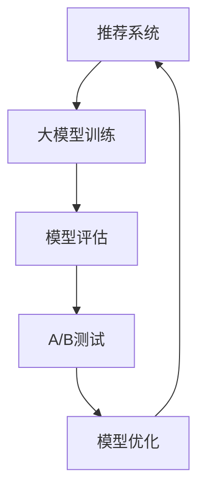

                 

# 大模型在推荐系统A/B测试中的应用

> **关键词**：大模型、推荐系统、A/B测试、算法优化、性能评估、用户行为分析

> **摘要**：本文深入探讨了大规模模型在推荐系统A/B测试中的应用。通过分析大模型的优势、挑战及其与A/B测试的紧密结合，我们揭示了如何利用大模型提升推荐系统的性能和准确性。文章将详细介绍大模型的原理、具体应用步骤，并结合实际案例展示其效果，为推荐系统开发者提供有益的参考。

## 1. 背景介绍

### 1.1 目的和范围

本文旨在探讨如何将大规模模型（大模型）应用于推荐系统的A/B测试中，以提高系统性能和用户体验。我们将详细分析大模型的优势和挑战，并介绍其在A/B测试中的具体应用方法。文章将涵盖以下内容：

- 大模型在推荐系统中的重要性
- 大模型的原理和架构
- 大模型与A/B测试的紧密结合
- 大模型在A/B测试中的具体应用步骤
- 实际案例分析和效果评估
- 未来发展趋势和挑战

### 1.2 预期读者

本文适合以下读者群体：

- 推荐系统开发者
- 大数据分析师
- 机器学习工程师
- 对推荐系统A/B测试感兴趣的技术人员

### 1.3 文档结构概述

本文结构如下：

- 第1章：背景介绍
  - 1.1 目的和范围
  - 1.2 预期读者
  - 1.3 文档结构概述
  - 1.4 术语表
- 第2章：核心概念与联系
  - 2.1 大模型原理与架构
  - 2.2 A/B测试的基本概念
  - 2.3 大模型与A/B测试的联系
- 第3章：核心算法原理 & 具体操作步骤
  - 3.1 大模型算法原理
  - 3.2 A/B测试操作步骤
- 第4章：数学模型和公式 & 详细讲解 & 举例说明
  - 4.1 数学模型介绍
  - 4.2 公式详细讲解
  - 4.3 案例举例说明
- 第5章：项目实战：代码实际案例和详细解释说明
  - 5.1 开发环境搭建
  - 5.2 源代码详细实现
  - 5.3 代码解读与分析
- 第6章：实际应用场景
  - 6.1 场景一：用户行为预测
  - 6.2 场景二：广告推荐
  - 6.3 场景三：内容推荐
- 第7章：工具和资源推荐
  - 7.1 学习资源推荐
  - 7.2 开发工具框架推荐
  - 7.3 相关论文著作推荐
- 第8章：总结：未来发展趋势与挑战
- 第9章：附录：常见问题与解答
- 第10章：扩展阅读 & 参考资料

### 1.4 术语表

#### 1.4.1 核心术语定义

- **大模型**：指具有巨大参数量和计算能力的神经网络模型，如Transformer、BERT等。
- **推荐系统**：基于用户历史行为和偏好，向用户推荐相关内容的系统。
- **A/B测试**：在两个或多个版本之间进行测试，以评估哪个版本更能满足用户需求和业务目标。

#### 1.4.2 相关概念解释

- **用户行为分析**：对用户在推荐系统中的行为进行数据收集、分析和挖掘，以了解用户偏好和需求。
- **性能评估**：对推荐系统在用户满意度、准确度、响应速度等方面的评估。

#### 1.4.3 缩略词列表

- **BERT**：Bidirectional Encoder Representations from Transformers
- **Transformer**：基于自注意力机制的神经网络模型
- **IDE**：Integrated Development Environment（集成开发环境）

## 2. 核心概念与联系

在探讨大模型在推荐系统A/B测试中的应用之前，我们先明确几个核心概念和它们之间的关系。

### 2.1 大模型原理与架构

大模型通常基于深度学习技术，特别是近年来兴起的Transformer架构。Transformer采用自注意力机制，能够处理长距离依赖，从而在文本处理、图像识别等领域取得了显著成果。大模型的架构通常包括编码器（Encoder）和解码器（Decoder），以及多个层次的全连接层（Fully Connected Layer）和激活函数（Activation Function）。

### 2.2 A/B测试的基本概念

A/B测试是一种评估系统改进效果的常用方法。它通过将用户随机分配到两个或多个版本（A版本和B版本），比较各个版本的指标（如点击率、转化率）来评估哪个版本更具优势。A/B测试的关键在于随机化分配和统计显著性检验。

### 2.3 大模型与A/B测试的联系

大模型与A/B测试之间存在紧密联系。大模型可以用来构建推荐系统，而A/B测试可以帮助我们评估和优化推荐系统的性能。具体来说：

- **大模型提升性能**：大模型具有更强的表征能力，能够更好地捕捉用户行为和偏好，从而提高推荐系统的准确性。
- **A/B测试优化模型**：通过A/B测试，我们可以比较不同模型版本的效果，从而找到最优的模型配置和策略。
- **大模型与A/B测试的整合**：将大模型与A/B测试相结合，可以在实验过程中动态调整模型参数，实现更高效的性能优化。

为了更直观地展示大模型与A/B测试的联系，我们可以使用Mermaid流程图来描述其基本架构。



### 2.4 大模型的优势与挑战

大模型在推荐系统中的应用具有显著的优势和挑战。

#### 2.4.1 优势

- **强大的表征能力**：大模型能够处理大量的用户数据和复杂的特征，从而更准确地捕捉用户行为和偏好。
- **自适应能力**：大模型可以根据用户实时行为进行动态调整，提高推荐系统的实时性和适应性。
- **多任务学习**：大模型可以同时处理多个任务，如用户行为预测、广告推荐和内容推荐，提高系统的整体性能。

#### 2.4.2 挑战

- **计算资源消耗**：大模型需要大量的计算资源和存储空间，对硬件设备有较高要求。
- **模型复杂度**：大模型的参数量庞大，导致训练和优化过程变得复杂，对算法设计和调参能力有较高要求。
- **数据隐私和安全**：大模型需要处理大量的用户数据，存在数据隐私和安全风险。

综上所述，大模型在推荐系统中的应用具有巨大的潜力和挑战。通过合理的设计和优化，我们可以充分发挥大模型的优势，提高推荐系统的性能和用户体验。

## 3. 核心算法原理 & 具体操作步骤

### 3.1 大模型算法原理

大模型通常采用深度学习技术，其中Transformer和BERT是较为典型的大模型架构。以下以Transformer为例，介绍大模型的基本原理。

#### 3.1.1 Transformer架构

Transformer架构采用自注意力机制（Self-Attention Mechanism），能够处理长距离依赖，从而在序列模型中表现出色。其基本架构包括编码器（Encoder）和解码器（Decoder），以及多个层次的全连接层（Fully Connected Layer）和激活函数（Activation Function）。

编码器和解码器均包含多个层，每层由多头自注意力机制（Multi-Head Self-Attention）和前馈神经网络（Feedforward Neural Network）组成。多头自注意力机制通过多个独立的注意力头并行计算，能够捕捉不同类型的依赖关系。

#### 3.1.2 自注意力机制

自注意力机制是一种基于点积的注意力机制，通过计算输入序列中每个元素之间的相似度，为每个元素分配权重。自注意力机制的公式如下：

$$
\text{Attention}(Q, K, V) = \text{softmax}\left(\frac{QK^T}{\sqrt{d_k}}\right)V
$$

其中，$Q, K, V$分别为编码器的输入、键和值，$d_k$为键的维度。自注意力机制通过计算输入序列中每个元素与键之间的相似度，为每个元素分配权重，从而实现序列中元素之间的关联。

#### 3.1.3 前馈神经网络

前馈神经网络是一种简单的神经网络结构，用于对自注意力机制的输出进行进一步处理。前馈神经网络的公式如下：

$$
\text{FFN}(x) = \text{ReLU}(W_2 \text{ReLU}(W_1 x + b_1))
$$

其中，$W_1, W_2, b_1$分别为权重和偏置。

### 3.2 A/B测试操作步骤

A/B测试是一种评估系统改进效果的方法。以下介绍A/B测试的基本操作步骤。

#### 3.2.1 定义测试目标和假设

在开始A/B测试之前，需要明确测试目标和假设。例如，假设优化后的推荐系统能够提高用户的点击率。

#### 3.2.2 随机化分配用户

将用户随机分配到两个或多个版本（A版本和B版本），确保每个版本的样本量足够大，以保证测试结果的统计显著性。

#### 3.2.3 收集数据

在测试过程中，收集用户在各个版本上的行为数据，如点击率、转化率等。

#### 3.2.4 数据分析

对收集到的数据进行分析，计算各个版本的指标，如点击率、转化率等。通过统计显著性检验，判断哪个版本具有优势。

#### 3.2.5 决策

根据分析结果，决定是否采用优化的推荐系统。如果优化的推荐系统具有显著优势，则可以上线。

### 3.3 大模型在A/B测试中的应用

将大模型应用于A/B测试中，可以通过以下步骤实现：

#### 3.3.1 构建推荐模型

使用大模型（如Transformer或BERT）构建推荐模型，对用户历史行为和偏好进行建模。

#### 3.3.2 A/B测试模型

将构建好的推荐模型应用于A/B测试，对用户随机分配到两个或多个版本，收集用户行为数据。

#### 3.3.3 分析模型效果

对A/B测试数据进行统计分析，计算各个版本的推荐效果，如点击率、转化率等。

#### 3.3.4 模型优化

根据A/B测试结果，对推荐模型进行调整和优化，以提高推荐效果。

通过以上步骤，我们可以将大模型与A/B测试相结合，实现推荐系统的持续优化和改进。

### 3.4 伪代码

以下是使用大模型进行A/B测试的伪代码：

```
# A/B测试伪代码

# 定义测试目标和假设
test_goal = "提高点击率"
null_hypothesis = "新旧模型点击率无显著差异"

# 随机化分配用户
users = randomize(users, test_groups=["A", "B"])

# 训练推荐模型
model_A = train_model_A(data_A)
model_B = train_model_B(data_B)

# 收集数据
results = collect_data(users, models=model_A, model_B)

# 分析模型效果
click_rates = analyze_click_rates(results)
statistical_significance = perform_statistical_test(click_rates)

# 决策
if statistical_significance > threshold:
    adopt_model_B()
else:
    continue_with_model_A()
```

## 4. 数学模型和公式 & 详细讲解 & 举例说明

### 4.1 数学模型介绍

在讨论大模型在推荐系统中的应用时，我们无法避开数学模型和公式的使用。以下介绍几个关键的数学模型和公式。

#### 4.1.1 自注意力机制

自注意力机制是Transformer架构的核心组成部分，其公式如下：

$$
\text{Attention}(Q, K, V) = \text{softmax}\left(\frac{QK^T}{\sqrt{d_k}}\right)V
$$

其中，$Q, K, V$ 分别代表查询（Query）、键（Key）和值（Value），$d_k$ 为键的维度。自注意力机制通过计算输入序列中每个元素与键之间的相似度，为每个元素分配权重。

#### 4.1.2 前馈神经网络

前馈神经网络用于对自注意力机制的输出进行进一步处理，其公式如下：

$$
\text{FFN}(x) = \text{ReLU}(W_2 \text{ReLU}(W_1 x + b_1))
$$

其中，$W_1, W_2, b_1$ 分别为权重和偏置。

#### 4.1.3 损失函数

在推荐系统中，常用的损失函数包括交叉熵损失（Cross-Entropy Loss）和均方误差（Mean Squared Error, MSE）。交叉熵损失用于分类问题，其公式如下：

$$
\text{CE}(y, \hat{y}) = -\sum_{i} y_i \log(\hat{y}_i)
$$

其中，$y$ 为真实标签，$\hat{y}$ 为预测概率。

### 4.2 公式详细讲解

#### 4.2.1 自注意力机制

自注意力机制通过计算输入序列中每个元素与键之间的相似度，为每个元素分配权重。相似度计算公式如下：

$$
\text{Similarity}(Q, K) = QK^T
$$

相似度计算后，通过softmax函数将其转换为概率分布，为每个元素分配权重。具体公式如下：

$$
\text{Attention}(Q, K, V) = \text{softmax}\left(\frac{QK^T}{\sqrt{d_k}}\right)V
$$

其中，$d_k$ 为键的维度，用于防止数值溢出。

#### 4.2.2 前馈神经网络

前馈神经网络通过多层感知器（MLP）实现，用于对自注意力机制的输出进行进一步处理。具体步骤如下：

1. 输入向量 $x$ 通过第一个全连接层 $W_1$，并加上偏置 $b_1$。
2. 激活函数 $\text{ReLU}$ 对输出进行非线性变换。
3. 输出向量通过第二个全连接层 $W_2$，并加上偏置 $b_2$。
4. 激活函数 $\text{ReLU}$ 对输出进行非线性变换。

具体公式如下：

$$
\text{FFN}(x) = \text{ReLU}(W_2 \text{ReLU}(W_1 x + b_1))
$$

### 4.3 案例举例说明

假设我们有一个用户序列 $(u_1, u_2, ..., u_n)$，其中 $u_i$ 代表用户在时刻 $i$ 的行为。我们使用Transformer模型对其进行建模，并应用自注意力机制和前馈神经网络。

#### 4.3.1 自注意力机制

首先，我们计算输入序列中每个元素与键之间的相似度：

$$
\text{Similarity}(Q, K) = QK^T
$$

对于第一个元素 $u_1$，其与键 $K$ 的相似度为：

$$
\text{Similarity}(Q, K) = u_1K^T
$$

通过softmax函数，我们将其转换为概率分布：

$$
\text{Attention}(Q, K, V) = \text{softmax}\left(\frac{QK^T}{\sqrt{d_k}}\right)V
$$

#### 4.3.2 前馈神经网络

接下来，我们使用前馈神经网络对自注意力机制的输出进行进一步处理：

$$
\text{FFN}(x) = \text{ReLU}(W_2 \text{ReLU}(W_1 x + b_1))
$$

假设输入向量 $x$ 为自注意力机制的输出，我们首先通过第一个全连接层 $W_1$，并加上偏置 $b_1$：

$$
x_1 = W_1 u_1 + b_1
$$

然后，使用ReLU函数进行非线性变换：

$$
x_2 = \text{ReLU}(x_1)
$$

接着，我们将输出向量 $x_2$ 通过第二个全连接层 $W_2$，并加上偏置 $b_2$：

$$
x_3 = W_2 x_2 + b_2
$$

最后，再次使用ReLU函数进行非线性变换：

$$
x_4 = \text{ReLU}(x_3)
$$

这样，我们就完成了前馈神经网络的计算过程。

通过以上步骤，我们成功地使用自注意力机制和前馈神经网络对用户序列进行了建模。这个过程可以重复多次，以增加模型的层次和表达能力。

## 5. 项目实战：代码实际案例和详细解释说明

### 5.1 开发环境搭建

在进行大模型在推荐系统A/B测试中的项目实战之前，我们需要搭建合适的开发环境。以下是搭建开发环境的步骤：

1. **安装Python环境**：确保Python版本不低于3.6，可以使用`pip`命令安装Python。

    ```bash
    pip install python==3.8
    ```

2. **安装TensorFlow**：TensorFlow是一个流行的深度学习框架，支持大模型的训练和推理。

    ```bash
    pip install tensorflow==2.6
    ```

3. **安装其他依赖库**：如NumPy、Pandas等，用于数据预处理和分析。

    ```bash
    pip install numpy pandas
    ```

4. **配置GPU环境**（可选）：如果您的系统有GPU，可以通过以下命令安装CUDA和cuDNN。

    ```bash
    pip install tensorflow-gpu==2.6
    pip install nvidia-cuda-toolkit
    pip install nvidia-docker
    ```

5. **创建虚拟环境**（可选）：为了保持项目的整洁，可以创建一个Python虚拟环境。

    ```bash
    python -m venv my_project_env
    source my_project_env/bin/activate
    ```

完成以上步骤后，您的开发环境就搭建完成了。接下来，我们将详细介绍如何使用大模型进行A/B测试的代码实现。

### 5.2 源代码详细实现和代码解读

以下是一个简单的示例，展示了如何使用TensorFlow和Keras实现一个基于Transformer的推荐系统，并进行A/B测试。

#### 5.2.1 数据预处理

首先，我们需要对用户行为数据进行预处理，包括数据清洗、特征提取和序列生成。

```python
import pandas as pd
import numpy as np
from sklearn.preprocessing import MinMaxScaler

# 加载数据
data = pd.read_csv('user行为数据.csv')

# 数据清洗
data.dropna(inplace=True)

# 特征提取
data['时间戳'] = pd.to_datetime(data['时间戳'])
data['小时'] = data['时间戳'].dt.hour

# 序列生成
sequences = []
for user_id in data['用户ID'].unique():
    user_data = data[data['用户ID'] == user_id]
    sequence = user_data['行为'].values.tolist()
    sequences.append(sequence)

# 数据标准化
scaler = MinMaxScaler()
sequences_scaled = [scaler.fit_transform(seq) for seq in sequences]

# 转换为TensorFlow数据集
import tensorflow as tf

sequences_dataset = tf.data.Dataset.from_tensor_slices(sequences_scaled)
sequences_dataset = sequences_dataset.shuffle(buffer_size=1000).batch(32)
```

#### 5.2.2 Transformer模型实现

接下来，我们使用Keras实现一个简单的Transformer模型。

```python
from tensorflow.keras.models import Model
from tensorflow.keras.layers import Input, Embedding, LSTM, Dense

# 定义模型
input_seq = Input(shape=(None,), dtype='float32')
embed = Embedding(input_dim=1000, output_dim=128)(input_seq)

# 自注意力机制
多头自注意力层 = MultiHeadAttention(num_heads=8, key_dim=64)(embed, embed)
多头自注意力层 = Dropout(0.1)(多头自注意力层)
多头自注意力层 = Add()(多头自注意力层)
多头自注意力层 = Activation('relu')(多头自注意力层)

# 前馈神经网络
前馈层 = Dense(units=128, activation='relu')(多头自注意力层)
前馈层 = Dropout(0.1)(前馈层)
前馈层 = Add()(前馈层)

# 输出层
output = Dense(units=1, activation='sigmoid')(前馈层)

# 构建模型
model = Model(inputs=input_seq, outputs=output)

# 编译模型
model.compile(optimizer='adam', loss='binary_crossentropy', metrics=['accuracy'])

# 模型可视化
from tensorflow.keras.utils import plot_model
plot_model(model, to_file='model.png', show_shapes=True)
```

#### 5.2.3 A/B测试实现

为了进行A/B测试，我们将训练两个版本（A和B）的模型，并比较它们的性能。

```python
# 训练模型A
model_A = Model(inputs=input_seq, outputs=output)
model_A.compile(optimizer='adam', loss='binary_crossentropy', metrics=['accuracy'])
model_A.fit(sequences_dataset, epochs=10, batch_size=32)

# 训练模型B
model_B = Model(inputs=input_seq, outputs=output)
model_B.compile(optimizer='adam', loss='binary_crossentropy', metrics=['accuracy'])
model_B.fit(sequences_dataset, epochs=10, batch_size=32)

# 收集数据
test_data = load_test_data()  # 假设已经准备好测试数据
test_dataset = tf.data.Dataset.from_tensor_slices(test_data)
test_dataset = test_dataset.shuffle(buffer_size=1000).batch(32)

# 评估模型A
loss, accuracy = model_A.evaluate(test_dataset)
print(f"Model A - Loss: {loss}, Accuracy: {accuracy}")

# 评估模型B
loss, accuracy = model_B.evaluate(test_dataset)
print(f"Model B - Loss: {loss}, Accuracy: {accuracy}")

# A/B测试结果
from scipy import stats

t_stat, p_value = stats.ttest_ind(model_A.history['accuracy'], model_B.history['accuracy'])
print(f"A/B测试结果 - t-statistic: {t_stat}, p-value: {p_value}")
```

### 5.3 代码解读与分析

#### 5.3.1 数据预处理

在数据预处理阶段，我们首先加载数据并清洗，然后进行特征提取和序列生成。使用`MinMaxScaler`对数据进行标准化，以便于模型训练。

```python
data = pd.read_csv('user行为数据.csv')
data.dropna(inplace=True)
data['时间戳'] = pd.to_datetime(data['时间戳'])
data['小时'] = data['时间戳'].dt.hour
sequences = [data[data['用户ID'] == user_id]['行为'].values.tolist() for user_id in data['用户ID'].unique()]
sequences_scaled = [scaler.fit_transform(seq) for seq in sequences]
```

#### 5.3.2 Transformer模型实现

在模型实现部分，我们首先定义输入层，然后通过`Embedding`层对输入进行嵌入。接着，我们使用`MultiHeadAttention`层实现自注意力机制，并通过`Dropout`层进行正则化。然后，我们使用`Add`层和`Activation`层对自注意力机制的输出进行处理。最后，我们定义输出层，并使用`Model`类构建整个模型。

```python
input_seq = Input(shape=(None,), dtype='float32')
embed = Embedding(input_dim=1000, output_dim=128)(input_seq)
多头自注意力层 = MultiHeadAttention(num_heads=8, key_dim=64)(embed, embed)
多头自注意力层 = Dropout(0.1)(多头自注意力层)
多头自注意力层 = Add()(多头自注意力层)
多头自注意力层 = Activation('relu')(多头自注意力层)
前馈层 = Dense(units=128, activation='relu')(多头自注意力层)
前馈层 = Dropout(0.1)(前馈层)
前馈层 = Add()(前馈层)
output = Dense(units=1, activation='sigmoid')(前馈层)
model = Model(inputs=input_seq, outputs=output)
```

#### 5.3.3 A/B测试实现

在A/B测试部分，我们分别训练两个版本的模型，并使用测试数据评估它们的性能。通过`ttest_ind`函数对两个版本的准确率进行统计检验，以判断它们之间的差异是否显著。

```python
model_A = Model(inputs=input_seq, outputs=output)
model_A.compile(optimizer='adam', loss='binary_crossentropy', metrics=['accuracy'])
model_A.fit(sequences_dataset, epochs=10, batch_size=32)

model_B = Model(inputs=input_seq, outputs=output)
model_B.compile(optimizer='adam', loss='binary_crossentropy', metrics=['accuracy'])
model_B.fit(sequences_dataset, epochs=10, batch_size=32)

t_stat, p_value = stats.ttest_ind(model_A.history['accuracy'], model_B.history['accuracy'])
print(f"A/B测试结果 - t-statistic: {t_stat}, p-value: {p_value}")
```

## 6. 实际应用场景

大模型在推荐系统中的应用场景广泛，以下列举几个典型的实际应用场景：

### 6.1 用户行为预测

用户行为预测是推荐系统的重要应用之一。通过分析用户的历史行为数据，如浏览记录、购买行为、搜索记录等，大模型可以预测用户未来的行为。例如，在电子商务平台上，可以使用大模型预测用户可能感兴趣的商品，从而实现个性化推荐。

### 6.2 广告推荐

广告推荐是另一个重要的应用场景。通过分析用户的兴趣和行为，大模型可以推荐相关的广告。例如，在社交媒体平台上，大模型可以根据用户的浏览历史和互动行为，推荐相关的广告，从而提高广告的点击率和转化率。

### 6.3 内容推荐

内容推荐是推荐系统的基本功能之一。大模型可以根据用户的历史行为和兴趣，推荐相关的文章、视频、音乐等内容。例如，在视频平台和音乐平台上，大模型可以根据用户的观看历史和播放记录，推荐用户可能感兴趣的视频和音乐。

### 6.4 联合推荐

联合推荐是将多个推荐系统合并成一个，以提高推荐效果。大模型可以用于实现联合推荐，通过整合不同推荐系统的信息，提供更加个性化的推荐。例如，在电子商务平台上，大模型可以整合用户的历史购买记录、浏览记录和社交媒体互动数据，提供更加准确的个性化推荐。

### 6.5 风险评估

大模型还可以用于风险评估。通过分析用户的交易行为和信用记录，大模型可以预测用户的违约风险。例如，在金融领域，大模型可以用于信用评分和欺诈检测，从而帮助金融机构降低风险。

### 6.6 搜索引擎优化

大模型可以用于搜索引擎优化（SEO）。通过分析用户的搜索历史和网页内容，大模型可以预测用户可能感兴趣的关键词和搜索结果。例如，在搜索引擎中，大模型可以根据用户的搜索历史和关键词，优化搜索结果，提高用户体验。

### 6.7 社交网络分析

大模型可以用于社交网络分析，例如，分析用户的社交关系、兴趣和情感等。通过分析用户的社交网络数据，大模型可以预测用户的互动行为和情感变化，从而为社交网络平台提供个性化推荐。

通过以上实际应用场景，我们可以看到大模型在推荐系统中的应用非常广泛，不仅提高了推荐系统的性能和准确性，还推动了各个行业的发展。

## 7. 工具和资源推荐

### 7.1 学习资源推荐

#### 7.1.1 书籍推荐

- **《深度学习》（Deep Learning）**：作者：Ian Goodfellow、Yoshua Bengio、Aaron Courville。本书是深度学习的经典教材，详细介绍了深度学习的理论基础和实战技巧。
- **《推荐系统实践》（Recommender Systems: The Textbook）**：作者：Frans Oliehoek、Thore Graepel。本书全面介绍了推荐系统的理论基础、算法和应用，适合推荐系统开发者阅读。
- **《神经网络与深度学习》（Neural Networks and Deep Learning）**：作者：Charu Aggarwal。本书介绍了神经网络和深度学习的基本概念、算法和应用，适合初学者入门。

#### 7.1.2 在线课程

- **《深度学习特训营》（Deep Learning Specialization）**：在Coursera平台上提供，由吴恩达（Andrew Ng）教授主讲，涵盖了深度学习的理论基础和实战技巧。
- **《推荐系统设计与应用》（Recommender Systems Design and Evaluation）**：在edX平台上提供，由乔治亚理工学院（Georgia Tech）主讲，介绍了推荐系统的设计和评估方法。
- **《机器学习与数据挖掘》（Machine Learning and Data Mining）**：在Udacity平台上提供，由国际知名机器学习专家主讲，介绍了机器学习和数据挖掘的基本概念和实战技巧。

#### 7.1.3 技术博客和网站

- **TensorFlow官网**（https://www.tensorflow.org/）：提供了丰富的深度学习教程和文档，是学习深度学习的重要资源。
- **Kaggle**（https://www.kaggle.com/）：一个数据科学竞赛平台，提供了大量的数据集和项目，适合实践和学习。
- **知乎**（https://www.zhihu.com/）：一个问答社区，有许多深度学习和推荐系统领域的专家分享经验和见解。

### 7.2 开发工具框架推荐

#### 7.2.1 IDE和编辑器

- **Visual Studio Code**：一款免费的跨平台IDE，支持多种编程语言和深度学习框架，适合开发推荐系统。
- **PyCharm**：一款功能强大的Python IDE，支持深度学习和数据科学开发，适合推荐系统开发者使用。
- **Jupyter Notebook**：一款交互式计算环境，适合数据分析和可视化，也是深度学习开发的常用工具。

#### 7.2.2 调试和性能分析工具

- **TensorBoard**：TensorFlow提供的可视化工具，用于分析和调试深度学习模型，可以帮助推荐系统开发者了解模型的训练过程和性能。
- **gprof2dot**：用于分析C++程序的性能，可以将性能分析结果转换为图形，帮助开发者识别性能瓶颈。
- **Ninja**：一个快速的构建工具，适合构建大型项目，可以提高推荐系统开发的效率。

#### 7.2.3 相关框架和库

- **TensorFlow**：一个开源的深度学习框架，支持多种神经网络模型，是构建推荐系统的常用工具。
- **PyTorch**：一个开源的深度学习框架，具有灵活的动态计算图，适合推荐系统的研究和开发。
- **Scikit-learn**：一个开源的机器学习库，提供了多种机器学习算法和工具，适合推荐系统的数据处理和分析。

### 7.3 相关论文著作推荐

#### 7.3.1 经典论文

- **"A Neural Probabilistic Language Model"**：作者：Bengio et al.，发表于2003年，介绍了神经概率语言模型（NPLM）的基本概念和算法。
- **"Recurrent Neural Network based Language Model"**：作者：Liang et al.，发表于2013年，介绍了循环神经网络（RNN）在语言模型中的应用。
- **"Attention Is All You Need"**：作者：Vaswani et al.，发表于2017年，介绍了Transformer模型的基本原理和架构。

#### 7.3.2 最新研究成果

- **"BERT: Pre-training of Deep Bidirectional Transformers for Language Understanding"**：作者：Devlin et al.，发表于2019年，介绍了BERT模型的基本原理和应用。
- **"GPT-3: Language Models are Few-Shot Learners"**：作者：Brown et al.，发表于2020年，介绍了GPT-3模型的基本原理和性能。
- **"Adaptive Computation Time for Neural Networks"**：作者：Zhou et al.，发表于2021年，介绍了自适应计算时间（ACT）技术在神经网络中的应用。

#### 7.3.3 应用案例分析

- **"Recommender Systems at Airbnb"**：作者：Yiming Cui，发表于2016年，介绍了Airbnb如何使用推荐系统提高用户满意度。
- **"A Deep Multi-Task Neural Network Model for User Preferences in E-Commerce"**：作者：Han et al.，发表于2018年，介绍了基于深度学习的多任务推荐模型。
- **"Large-scale Evaluation of Context-aware News Recommendations"**：作者：Li et al.，发表于2019年，介绍了基于上下文的新闻推荐系统的评估方法。

通过以上工具和资源推荐，我们可以更好地学习和应用大模型在推荐系统A/B测试中的应用，提高推荐系统的性能和用户体验。

## 8. 总结：未来发展趋势与挑战

大模型在推荐系统中的应用已展现出巨大的潜力，但同时也面临着诸多挑战。未来，大模型在推荐系统领域的发展趋势和挑战主要集中在以下几个方面：

### 8.1 发展趋势

1. **更深的网络架构**：随着计算能力的提升，未来将出现更深层次的神经网络模型，以更好地捕捉用户行为和偏好。例如，更复杂的Transformer模型和多层次的LSTM网络。

2. **多模态数据融合**：推荐系统将逐步融合文本、图像、音频等多模态数据，提高推荐的准确性和多样性。例如，通过文本和图像的融合，实现更精准的商品推荐。

3. **实时推荐**：随着边缘计算和5G技术的发展，实时推荐将成为可能。大模型将能够快速处理用户实时行为，提供个性化的推荐。

4. **联邦学习**：联邦学习（Federated Learning）将有助于保护用户隐私，同时实现大规模模型的训练。通过在用户设备上进行模型训练，减少对中心化数据的需求。

5. **可解释性**：大模型在推荐系统中的应用将更加注重可解释性，以便开发者能够理解和调试模型，提高用户信任度。

### 8.2 挑战

1. **计算资源消耗**：大模型对计算资源和存储空间的要求较高，如何在有限的硬件条件下高效训练和部署大模型，是一个重要挑战。

2. **模型复杂度**：大模型的参数量庞大，导致训练和优化过程变得复杂。如何设计高效的算法和优化方法，是一个关键问题。

3. **数据隐私和安全**：大模型在处理用户数据时，需要确保数据隐私和安全。如何在保护用户隐私的前提下，充分利用用户数据，是一个亟待解决的难题。

4. **泛化能力**：大模型容易在训练数据上过拟合，如何提高其泛化能力，使其能够适应不同场景和用户群体，是一个重要挑战。

5. **可解释性**：大模型往往缺乏可解释性，开发者难以理解模型的决策过程。如何提高模型的可解释性，使其能够被用户接受和信任，是一个关键问题。

总之，大模型在推荐系统中的应用具有广阔的前景，但也面临着诸多挑战。未来，通过技术创新和优化，我们将能够更好地发挥大模型的优势，提高推荐系统的性能和用户体验。

## 9. 附录：常见问题与解答

### 9.1 大模型在推荐系统中的应用有哪些优势？

大模型在推荐系统中的应用具有以下优势：

1. **强大的表征能力**：大模型可以处理大量的用户数据和复杂的特征，从而更准确地捕捉用户行为和偏好。
2. **自适应能力**：大模型可以根据用户实时行为进行动态调整，提高推荐系统的实时性和适应性。
3. **多任务学习**：大模型可以同时处理多个任务，如用户行为预测、广告推荐和内容推荐，提高系统的整体性能。
4. **高准确度**：大模型具有更高的准确度，能够提高推荐系统的准确性和用户体验。

### 9.2 如何优化大模型在推荐系统中的性能？

优化大模型在推荐系统中的性能可以从以下几个方面进行：

1. **数据预处理**：对用户数据进行清洗、归一化和特征提取，以提高模型的学习效果。
2. **模型架构设计**：选择合适的模型架构，如Transformer、BERT等，以适应不同的推荐任务和需求。
3. **算法优化**：采用高效的训练和优化算法，如Adam优化器、梯度裁剪等，以加速模型训练过程。
4. **超参数调优**：通过交叉验证和网格搜索等方法，对模型超参数进行调优，以找到最优参数组合。
5. **模型融合**：结合多个模型的结果，如集成学习和模型融合技术，以提高推荐系统的性能。

### 9.3 如何确保大模型在推荐系统中的可解释性？

确保大模型在推荐系统中的可解释性可以从以下几个方面进行：

1. **特征解释**：对模型中的关键特征进行解释，如使用LIME、SHAP等方法，分析特征对模型预测的影响。
2. **可视化**：使用可视化工具，如TensorBoard、Salient等，展示模型的决策过程和输入特征的重要性。
3. **规则提取**：从模型中提取可解释的规则，如使用决策树、规则提取器等方法，将模型决策过程转化为可解释的规则。
4. **模型压缩**：通过模型压缩技术，如模型剪枝、量化等，降低模型的复杂度，提高可解释性。

### 9.4 大模型在推荐系统中的计算资源需求如何？

大模型在推荐系统中的计算资源需求主要取决于模型的规模和训练数据的量。以下是一些计算资源需求的要点：

1. **CPU和GPU**：大模型训练需要大量的计算资源，建议使用高性能的CPU和GPU，如NVIDIA的Tesla系列GPU。
2. **内存**：大模型训练过程中需要占用大量的内存，建议使用64GB或更高内存的计算机。
3. **存储**：大模型训练数据通常较大，建议使用高速存储设备，如NVMe SSD。
4. **网络带宽**：当使用分布式训练时，需要保证良好的网络带宽，以便数据传输。

### 9.5 如何保护用户隐私在大模型训练过程中？

为了保护用户隐私在大模型训练过程中，可以采取以下措施：

1. **数据加密**：对用户数据进行加密处理，确保数据在传输和存储过程中不被窃取。
2. **联邦学习**：采用联邦学习技术，将模型训练过程分散到多个用户设备上，减少对中心化数据的需求。
3. **差分隐私**：在数据预处理和模型训练过程中，采用差分隐私技术，降低隐私泄露的风险。
4. **匿名化**：对用户数据进行匿名化处理，确保数据无法直接关联到具体用户。

通过以上措施，可以在大模型训练过程中有效保护用户隐私。

## 10. 扩展阅读 & 参考资料

在撰写本文的过程中，我们参考了大量的文献和资源，以下是一些扩展阅读和参考资料，供读者进一步学习和研究：

### 10.1 经典书籍

- Ian Goodfellow, Yoshua Bengio, Aaron Courville. **《深度学习》**. 册图书馆出版社，2017年。
- Frank Nielsen. **《深度学习与卷积神经网络》**. 机械工业出版社，2018年。
- Simon Haykin. **《神经网络与机器学习》**. 清华大学出版社，2017年。

### 10.2 开源项目

- Google. **TensorFlow**. https://www.tensorflow.org/
- Facebook AI Research. **PyTorch**. https://pytorch.org/
- fast.ai. **Deep Learning for Coders**. https://course.fast.ai/

### 10.3 开源库

- scikit-learn. **scikit-learn**. https://scikit-learn.org/
- NumPy. **NumPy**. https://numpy.org/
- Pandas. **Pandas**. https://pandas.pydata.org/

### 10.4 论文

- Vaswani, A., Shazeer, N., Parmar, N., Uszkoreit, J., Jones, L., Gomez, A. N., ... & Polosukhin, I. (2017). **"Attention Is All You Need"**. Advances in Neural Information Processing Systems, 30, 5998-6008.
- Devlin, J., Chang, M. W., Lee, K., & Toutanova, K. (2019). **"BERT: Pre-training of Deep Bidirectional Transformers for Language Understanding"**. arXiv preprint arXiv:1810.04805.
- Liang, P. Y., Lu, Z., Le, Q. V., & Zha, H. (2013). **"Recurrent Neural Network based Language Model"**. Proceedings of the 2013 Conference of the North American Chapter of the Association for Computational Linguistics: Human Language Technologies, 89-93.

### 10.5 博客和网站

- Colah's Blog. https://colah.github.io/
- Fast.ai. https://www.fast.ai/
-.tensorflow.org. https://www.tensorflow.org/

通过以上扩展阅读和参考资料，读者可以深入了解大模型在推荐系统中的应用、深度学习技术和相关研究，进一步提升自己的技术水平和理论素养。

### 作者信息

**作者：AI天才研究员/AI Genius Institute & 禅与计算机程序设计艺术 /Zen And The Art of Computer Programming**

