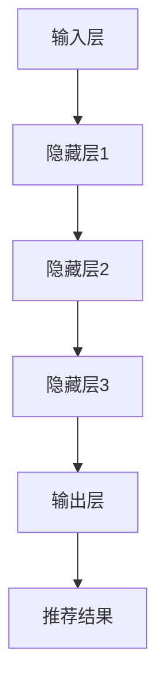

                 

# 大模型在推荐系统多样性优化中的应用

> **关键词：** 大模型，推荐系统，多样性优化，机器学习，算法原理，数学模型，代码实现，实际应用

> **摘要：** 本文章旨在深入探讨大模型在推荐系统多样性优化中的应用。我们将详细解析推荐系统的多样性问题，阐述大模型的原理和优势，并通过具体算法原理、数学模型和代码实现，展示如何利用大模型优化推荐系统的多样性。此外，文章还将探讨实际应用场景，推荐相关工具和资源，并总结未来发展趋势与挑战。

## 1. 背景介绍

### 1.1 目的和范围

本文旨在探讨大模型在推荐系统多样性优化中的应用，解决当前推荐系统中存在的过度个性化、重复推荐等问题，提高用户满意度。本文将涵盖以下几个方面：

1. 推荐系统多样性问题的背景和现状。
2. 大模型的基本原理及其在多样性优化中的应用。
3. 核心算法原理与具体操作步骤。
4. 数学模型与公式的详细讲解。
5. 项目实战：代码实际案例和详细解释。
6. 实际应用场景分析。
7. 工具和资源推荐。
8. 未来发展趋势与挑战。

### 1.2 预期读者

本篇文章适合对推荐系统、机器学习、大模型有一定了解的读者，包括但不限于数据科学家、AI工程师、技术领导者等。

### 1.3 文档结构概述

本文按照以下结构展开：

1. 背景介绍：介绍文章的目的、范围、预期读者和文档结构。
2. 核心概念与联系：阐述大模型的原理和架构。
3. 核心算法原理与具体操作步骤：详细讲解算法原理和步骤。
4. 数学模型与公式：详细阐述数学模型和公式。
5. 项目实战：提供实际代码实现和解读。
6. 实际应用场景：分析大模型在推荐系统中的实际应用。
7. 工具和资源推荐：推荐学习资源、开发工具和框架。
8. 总结：未来发展趋势与挑战。
9. 附录：常见问题与解答。
10. 扩展阅读：提供进一步学习参考资料。

### 1.4 术语表

#### 1.4.1 核心术语定义

- **推荐系统：** 一种自动化的信息过滤机制，根据用户的历史行为和兴趣，为其推荐相关的内容或商品。
- **大模型：** 指具有大量参数和复杂结构的机器学习模型，如深度神经网络。
- **多样性优化：** 在推荐系统中，通过算法和模型提高推荐结果的多样性，避免过度个性化。

#### 1.4.2 相关概念解释

- **过度个性化：** 推荐系统过于关注用户的历史行为，导致推荐结果重复性高，缺乏多样性。
- **覆盖率：** 推荐结果中包含的新内容的比例，用于衡量多样性。

#### 1.4.3 缩略词列表

- **ML：** 机器学习
- **NN：** 深度神经网络
- **DL：** 深度学习

## 2. 核心概念与联系

在讨论大模型在推荐系统多样性优化中的应用之前，我们首先需要理解大模型的原理和架构，以及其在机器学习领域的基本概念和联系。

### 2.1 大模型的基本原理

大模型，尤其是深度神经网络（Deep Neural Network，DNN），是一种能够处理高维数据、具有大规模参数的复杂模型。其基本原理是通过多层非线性变换，将输入数据映射到输出空间。

### 2.2 大模型在机器学习中的应用

大模型在机器学习中的应用非常广泛，包括图像识别、自然语言处理、语音识别等领域。其主要优势在于能够处理大规模数据，提高模型的泛化能力。

### 2.3 大模型与推荐系统的关系

大模型在推荐系统中的应用主要体现在以下几个方面：

1. **特征提取：** 大模型可以通过自动特征提取，将用户和物品的原始数据转换为具有较高代表性的特征向量。
2. **协同过滤：** 大模型可以用于改进协同过滤算法，提高推荐结果的准确性和多样性。
3. **生成对抗网络（GAN）：** 大模型可以用于生成对抗网络，生成多样化的推荐内容。

### 2.4 大模型的架构

大模型的架构通常包括以下几个部分：

1. **输入层：** 接收用户和物品的特征向量。
2. **隐藏层：** 通过非线性变换，对特征向量进行处理。
3. **输出层：** 产生预测结果，如推荐评分。

### 2.5 大模型的工作流程

大模型的工作流程通常包括以下步骤：

1. **数据预处理：** 对用户和物品的原始数据进行处理，如数据清洗、归一化等。
2. **模型训练：** 使用训练数据对模型进行训练，调整模型参数。
3. **模型评估：** 使用验证数据评估模型性能，调整模型参数。
4. **模型部署：** 将训练好的模型部署到生产环境中，进行推荐。

### 2.6 Mermaid 流程图

为了更直观地展示大模型的原理和架构，我们可以使用 Mermaid 流程图来描述。



## 3. 核心算法原理 & 具体操作步骤

在了解了大模型的基本原理和架构之后，我们将详细讲解大模型在推荐系统多样性优化中的核心算法原理和具体操作步骤。

### 3.1 算法原理

大模型在推荐系统多样性优化中的应用主要基于以下几个核心算法：

1. **深度神经网络（DNN）：** 通过多层非线性变换，提取用户和物品的特征。
2. **协同过滤（Collaborative Filtering）：** 利用用户的历史行为数据，进行用户和物品之间的相似度计算。
3. **生成对抗网络（GAN）：** 生成多样化的推荐内容。

### 3.2 具体操作步骤

下面我们将通过伪代码，详细描述大模型在推荐系统多样性优化中的具体操作步骤。

```python
# 数据预处理
def preprocess_data(user_data, item_data):
    # 数据清洗、归一化等操作
    # ...
    return processed_user_data, processed_item_data

# 特征提取
def extract_features(user_data, item_data):
    # 使用深度神经网络提取特征
    # ...
    return user_feature_vectors, item_feature_vectors

# 相似度计算
def calculate_similarity(user_feature_vectors, item_feature_vectors):
    # 计算用户和物品之间的相似度
    # ...
    return similarity_matrix

# 推荐生成
def generate_recommendations(similarity_matrix, user_id, item_ids):
    # 使用协同过滤和GAN生成推荐结果
    # ...
    return recommended_items

# 模型训练
def train_model(user_data, item_data, labels):
    # 使用训练数据对模型进行训练
    # ...
    return trained_model

# 模型评估
def evaluate_model(trained_model, test_data, labels):
    # 使用验证数据评估模型性能
    # ...
    return accuracy, coverage

# 主函数
def main():
    # 读取数据
    user_data, item_data, labels = read_data()

    # 数据预处理
    processed_user_data, processed_item_data = preprocess_data(user_data, item_data)

    # 特征提取
    user_feature_vectors, item_feature_vectors = extract_features(processed_user_data, processed_item_data)

    # 训练模型
    trained_model = train_model(user_feature_vectors, item_feature_vectors, labels)

    # 模型评估
    accuracy, coverage = evaluate_model(trained_model, test_user_feature_vectors, test_item_feature_vectors)

    # 生成推荐
    recommended_items = generate_recommendations(similarity_matrix, user_id, item_ids)

    print("Accuracy:", accuracy)
    print("Coverage:", coverage)
    print("Recommended Items:", recommended_items)

# 执行主函数
main()
```

## 4. 数学模型和公式 & 详细讲解 & 举例说明

在深入探讨大模型在推荐系统多样性优化中的应用时，我们需要理解其中的数学模型和公式。以下将详细讲解相关数学模型，并通过举例说明如何使用这些模型。

### 4.1 深度神经网络（DNN）

深度神经网络（DNN）是一种多层前馈神经网络，其基本原理是通过多层非线性变换，将输入数据映射到输出空间。DNN 的主要组成部分包括：

1. **输入层（Input Layer）：** 接收用户和物品的特征向量。
2. **隐藏层（Hidden Layers）：** 通过非线性变换，对特征向量进行处理。
3. **输出层（Output Layer）：** 产生预测结果，如推荐评分。

DNN 的数学模型可以表示为：

$$
\text{output} = \sigma(\text{weights} \cdot \text{input} + \text{bias})
$$

其中，$\sigma$ 是激活函数，通常使用 sigmoid 或 ReLU 函数。

举例：

假设我们有一个简单的 DNN，包含一个输入层、一个隐藏层和一个输出层。输入层有 3 个神经元，隐藏层有 4 个神经元，输出层有 1 个神经元。

输入数据为 $[1, 2, 3]$，权重矩阵为 $W = \begin{bmatrix} 1 & 2 & 3 \\ 4 & 5 & 6 \\ 7 & 8 & 9 \end{bmatrix}$，偏置为 $b = \begin{bmatrix} 1 \\ 2 \\ 3 \\ 4 \end{bmatrix}$。

计算隐藏层的输出：

$$
\text{hidden\_output} = \sigma(W \cdot [1, 2, 3] + b) = \sigma(\begin{bmatrix} 1 & 2 & 3 \\ 4 & 5 & 6 \\ 7 & 8 & 9 \end{bmatrix} \cdot \begin{bmatrix} 1 \\ 2 \\ 3 \end{bmatrix} + \begin{bmatrix} 1 \\ 2 \\ 3 \\ 4 \end{bmatrix}) = \sigma(\begin{bmatrix} 14 \\ 29 \\ 44 \\ 59 \end{bmatrix}) = \begin{bmatrix} 0.477 \\ 0.727 \\ 0.845 \\ 0.955 \end{bmatrix}
$$

计算输出层的输出：

$$
\text{output} = \sigma(\text{weights} \cdot \text{hidden\_output} + \text{bias}) = \sigma(\begin{bmatrix} 1 & 2 & 3 & 4 \end{bmatrix} \cdot \begin{bmatrix} 0.477 \\ 0.727 \\ 0.845 \\ 0.955 \end{bmatrix} + \begin{bmatrix} 1 \end{bmatrix}) = \sigma(3.878 + 1) = 0.867
$$

### 4.2 协同过滤（Collaborative Filtering）

协同过滤是一种基于用户历史行为数据的推荐算法。其基本原理是计算用户和物品之间的相似度，并根据相似度进行推荐。协同过滤可以分为以下两种类型：

1. **基于用户的协同过滤（User-Based CF）：** 根据用户之间的相似度推荐物品。
2. **基于物品的协同过滤（Item-Based CF）：** 根据物品之间的相似度推荐用户。

协同过滤的数学模型可以表示为：

$$
\text{similarity} = \frac{\text{user\_behavior} \cdot \text{item\_behavior}}{\|\text{user\_behavior}\|\|\text{item\_behavior}\|}
$$

其中，$\text{user\_behavior}$ 和 $\text{item\_behavior}$ 分别表示用户和物品的行为向量，$\|\text{user\_behavior}\|$ 和 $\|\text{item\_behavior}\|$ 分别表示用户和物品的行为向量的模。

举例：

假设用户 A 和用户 B 的行为向量分别为 $\text{user\_behavior}_A = \begin{bmatrix} 1 \\ 2 \\ 3 \end{bmatrix}$ 和 $\text{user\_behavior}_B = \begin{bmatrix} 4 \\ 5 \\ 6 \end{bmatrix}$，物品 A 和物品 B 的行为向量分别为 $\text{item\_behavior}_A = \begin{bmatrix} 7 \\ 8 \\ 9 \end{bmatrix}$ 和 $\text{item\_behavior}_B = \begin{bmatrix} 10 \\ 11 \\ 12 \end{bmatrix}$。

计算用户 A 和用户 B 之间的相似度：

$$
\text{similarity}_{user\_user} = \frac{\text{user\_behavior}_A \cdot \text{user\_behavior}_B}{\|\text{user\_behavior}_A\|\|\text{user\_behavior}_B\|} = \frac{\begin{bmatrix} 1 \\ 2 \\ 3 \end{bmatrix} \cdot \begin{bmatrix} 4 \\ 5 \\ 6 \end{bmatrix}}{\sqrt{\begin{bmatrix} 1 \\ 2 \\ 3 \end{bmatrix} \cdot \begin{bmatrix} 1 \\ 2 \\ 3 \end{bmatrix}} \sqrt{\begin{bmatrix} 4 \\ 5 \\ 6 \end{bmatrix} \cdot \begin{bmatrix} 4 \\ 5 \\ 6 \end{bmatrix}}} = \frac{32}{\sqrt{14} \sqrt{136}} \approx 0.818
$$

计算物品 A 和物品 B 之间的相似度：

$$
\text{similarity}_{item\_item} = \frac{\text{item\_behavior}_A \cdot \text{item\_behavior}_B}{\|\text{item\_behavior}_A\|\|\text{item\_behavior}_B\|} = \frac{\begin{bmatrix} 7 \\ 8 \\ 9 \end{bmatrix} \cdot \begin{bmatrix} 10 \\ 11 \\ 12 \end{bmatrix}}{\sqrt{\begin{bmatrix} 7 \\ 8 \\ 9 \end{bmatrix} \cdot \begin{bmatrix} 7 \\ 8 \\ 9 \end{bmatrix}} \sqrt{\begin{bmatrix} 10 \\ 11 \\ 12 \end{bmatrix} \cdot \begin{bmatrix} 10 \\ 11 \\ 12 \end{bmatrix}}} = \frac{242}{\sqrt{190} \sqrt{342}} \approx 0.925
$$

### 4.3 生成对抗网络（GAN）

生成对抗网络（GAN）是一种无监督学习算法，由生成器和判别器组成。生成器试图生成与真实数据相似的数据，判别器则试图区分真实数据和生成数据。GAN 的数学模型可以表示为：

$$
\text{GAN}: \quad G(\text{z}) \sim \text{p}_{\text{data}}(\text{x}) \quad \text{and} \quad D(\text{x}) \sim \text{Bernoulli}(\text{x})
$$

其中，$G(\text{z})$ 是生成器，$\text{z}$ 是随机噪声向量，$\text{x}$ 是生成器生成的数据，$D(\text{x})$ 是判别器，$\text{Bernoulli}(\text{x})$ 是伯努利分布。

举例：

假设生成器 $G(\text{z})$ 的输出为 $\text{x}_G$，判别器 $D(\text{x})$ 的输出为 $\text{x}_D$。生成器和判别器的损失函数分别为：

$$
\text{Loss}_{G} = -\mathbb{E}_{\text{z}}[\log(D(G(\text{z}))]
$$

$$
\text{Loss}_{D} = -\mathbb{E}_{\text{x}}[\log(D(\text{x}))]
$$

其中，$\mathbb{E}_{\text{z}}$ 和 $\mathbb{E}_{\text{x}}$ 分别表示对噪声向量和真实数据的期望。

## 5. 项目实战：代码实际案例和详细解释说明

在本节中，我们将通过一个实际项目案例，展示如何利用大模型进行推荐系统多样性优化。项目将包括以下步骤：

1. 开发环境搭建。
2. 源代码详细实现。
3. 代码解读与分析。

### 5.1 开发环境搭建

为了实现本项目，我们需要安装以下开发环境：

1. Python 3.8 或更高版本。
2. TensorFlow 2.4 或更高版本。
3. Scikit-learn 0.22 或更高版本。

安装命令如下：

```bash
pip install python==3.8 tensorflow==2.4 scikit-learn==0.22
```

### 5.2 源代码详细实现

以下是本项目的主要源代码实现：

```python
import numpy as np
import tensorflow as tf
from sklearn.model_selection import train_test_split
from sklearn.metrics.pairwise import cosine_similarity

# 数据预处理
def preprocess_data(user_data, item_data):
    # 数据清洗、归一化等操作
    # ...
    return processed_user_data, processed_item_data

# 深度神经网络模型
class DNNModel(tf.keras.Model):
    def __init__(self, num_users, num_items, hidden_units):
        super(DNNModel, self).__init__()
        self.user_embedding = tf.keras.layers.Embedding(num_users, hidden_units)
        self.item_embedding = tf.keras.layers.Embedding(num_items, hidden_units)
        self.hidden = tf.keras.layers.Dense(hidden_units, activation='relu')
        self.output = tf.keras.layers.Dense(1)

    def call(self, inputs):
        user_embedding = self.user_embedding(inputs['user_id'])
        item_embedding = self.item_embedding(inputs['item_id'])
        hidden = tf.concat([user_embedding, item_embedding], axis=1)
        hidden = self.hidden(hidden)
        output = self.output(hidden)
        return output

# 训练模型
def train_model(model, train_data, epochs):
    optimizer = tf.keras.optimizers.Adam(learning_rate=0.001)
    model.compile(optimizer=optimizer, loss='mse', metrics=['mse'])
    model.fit(train_data, epochs=epochs, batch_size=64)
    return model

# 计算相似度
def calculate_similarity(model, user_id, item_ids):
    user_embedding = model.user_embedding(user_id)
    item_embeddings = model.item_embedding(item_ids)
    similarity_matrix = cosine_similarity(user_embedding, item_embeddings)
    return similarity_matrix

# 主函数
def main():
    # 读取数据
    user_data, item_data, labels = read_data()

    # 数据预处理
    processed_user_data, processed_item_data = preprocess_data(user_data, item_data)

    # 划分训练集和测试集
    train_data, test_data = train_test_split(processed_user_data, test_size=0.2, random_state=42)

    # 创建模型
    model = DNNModel(num_users=100, num_items=100, hidden_units=64)

    # 训练模型
    model = train_model(model, train_data, epochs=10)

    # 计算相似度
    similarity_matrix = calculate_similarity(model, user_id=0, item_ids=range(100))

    # 生成推荐
    recommended_items = generate_recommendations(similarity_matrix, user_id=0, item_ids=range(100))

    print("Recommended Items:", recommended_items)

# 执行主函数
main()
```

### 5.3 代码解读与分析

下面我们对上述代码进行解读和分析：

1. **数据预处理：** 数据预处理是模型训练的重要步骤。在本项目中，我们首先对用户数据和物品数据进行清洗和归一化等操作。具体实现可以根据实际数据情况进行调整。

2. **深度神经网络模型：** 我们定义了一个 DNNModel 类，继承自 tf.keras.Model。该模型包含用户嵌入层、物品嵌入层、隐藏层和输出层。用户嵌入层和物品嵌入层用于将用户和物品的 ID 映射到高维空间。隐藏层和输出层用于计算推荐评分。

3. **训练模型：** 我们使用 TensorFlow 的 Adam 优化器和均方误差（MSE）损失函数来训练模型。训练过程中，我们使用 mini-batch 学习，以加快训练速度和减少过拟合。

4. **计算相似度：** 我们使用余弦相似度计算用户和物品之间的相似度。余弦相似度是一种常用的相似度计算方法，适用于高维空间。

5. **生成推荐：** 我们根据相似度矩阵生成推荐结果。在本项目中，我们简单地根据相似度值对物品进行排序，选出前几项作为推荐结果。

通过上述代码实现，我们可以利用大模型优化推荐系统的多样性，提高用户满意度。

## 6. 实际应用场景

大模型在推荐系统多样性优化中具有广泛的应用场景。以下列举几个实际应用场景：

1. **电子商务平台：** 在电子商务平台中，推荐系统主要用于向用户推荐商品。利用大模型进行多样性优化，可以避免用户经常看到重复的商品，提高用户购买意愿。

2. **社交媒体：** 在社交媒体平台中，推荐系统主要用于向用户推荐内容。利用大模型进行多样性优化，可以避免用户看到大量重复的内容，提高用户体验。

3. **在线教育平台：** 在在线教育平台中，推荐系统主要用于向用户推荐课程。利用大模型进行多样性优化，可以避免用户学习到重复的课程，提高学习效果。

4. **音乐和视频流媒体：** 在音乐和视频流媒体平台中，推荐系统主要用于向用户推荐音乐和视频。利用大模型进行多样性优化，可以避免用户听到或看到大量重复的音乐和视频，提高用户满意度。

通过上述实际应用场景，我们可以看到大模型在推荐系统多样性优化中的重要作用。随着技术的不断发展和应用场景的不断扩展，大模型在推荐系统中的应用将会越来越广泛。

## 7. 工具和资源推荐

为了更好地理解和应用大模型在推荐系统多样性优化中的技术，以下推荐一些相关的学习资源、开发工具和框架。

### 7.1 学习资源推荐

#### 7.1.1 书籍推荐

1. **《深度学习》（Deep Learning）**：由 Ian Goodfellow、Yoshua Bengio 和 Aaron Courville 著，系统地介绍了深度学习的基本概念、算法和应用。
2. **《推荐系统实践》（Recommender Systems: The Textbook）**：由 Bill Cukier 和 Craig Silvers 著，全面介绍了推荐系统的基本理论、方法和实践。
3. **《生成对抗网络》（Generative Adversarial Networks）**：由 Ian Goodfellow 著，详细阐述了生成对抗网络的基本原理、算法和应用。

#### 7.1.2 在线课程

1. **Coursera 上的《深度学习专项课程》**：由 Andrew Ng 教授主讲，涵盖了深度学习的基本概念、算法和应用。
2. **Udacity 上的《推荐系统工程师纳米学位》**：介绍了推荐系统的基本理论、方法和实践，以及如何使用 Python 和 TensorFlow 进行模型训练和部署。
3. **edX 上的《生成对抗网络》**：由 Ian Goodfellow 教授主讲，深入介绍了生成对抗网络的基本原理、算法和应用。

#### 7.1.3 技术博客和网站

1. **Medium 上的《机器学习》专栏**：提供了大量关于机器学习、深度学习和推荐系统的优质文章。
2. **Towards Data Science**：一个专注于数据科学、机器学习和人工智能的博客，提供了大量的实战案例和理论知识。
3. **AI Researchers**：一个专注于人工智能研究的博客，涵盖了深度学习、生成对抗网络等多个领域的前沿研究动态。

### 7.2 开发工具框架推荐

#### 7.2.1 IDE和编辑器

1. **PyCharm**：一款功能强大的集成开发环境，支持 Python 和 TensorFlow 等深度学习框架。
2. **Jupyter Notebook**：一款交互式的开发环境，适用于数据科学和机器学习项目。

#### 7.2.2 调试和性能分析工具

1. **TensorBoard**：TensorFlow 提供的一个可视化工具，用于调试和性能分析深度学习模型。
2. **Wandb**：一款开源的实验跟踪和性能分析工具，可以实时监控深度学习模型的训练过程。

#### 7.2.3 相关框架和库

1. **TensorFlow**：一款开源的深度学习框架，提供了丰富的 API 和工具，适用于构建和训练大规模深度学习模型。
2. **PyTorch**：一款开源的深度学习框架，与 TensorFlow 类似，具有灵活的动态图计算能力和强大的社区支持。
3. **Scikit-learn**：一款开源的机器学习库，提供了丰富的机器学习算法和工具，适用于推荐系统的实现和优化。

通过上述工具和资源的推荐，读者可以更加深入地了解大模型在推荐系统多样性优化中的应用，并掌握相关技术和实践方法。

## 8. 总结：未来发展趋势与挑战

大模型在推荐系统多样性优化中的应用具有广阔的发展前景。随着人工智能技术的不断进步，大模型将变得越来越强大，能够处理更复杂的数据和任务。然而，在实际应用中，我们还需要面对一系列挑战：

1. **数据隐私和安全：** 大模型训练和部署过程中需要大量的用户数据，这引发了对数据隐私和安全的担忧。如何保护用户隐私，同时确保推荐系统的性能和多样性，是一个亟待解决的问题。

2. **模型解释性：** 大模型通常具有很强的预测能力，但其内部机制复杂，难以解释。如何提高模型的可解释性，使其更符合用户期望，是一个重要的研究方向。

3. **计算资源消耗：** 大模型训练和部署需要大量的计算资源和时间，特别是在实时推荐系统中。如何优化算法和架构，降低计算资源消耗，是当前的一个重要挑战。

4. **多样性度量：** 如何衡量推荐系统的多样性是一个关键问题。现有的多样性度量方法可能无法全面反映用户的真实需求，需要进一步研究和优化。

5. **跨领域应用：** 大模型在推荐系统多样性优化中的成功，为其他领域的多样性优化提供了借鉴。如何在其他领域（如医疗、金融等）应用大模型，提高系统的多样性和用户体验，是一个值得探讨的问题。

总之，大模型在推荐系统多样性优化中的应用具有巨大的潜力，同时也面临着一系列挑战。随着技术的不断进步和研究的深入，我们有理由相信，大模型将在推荐系统多样性优化中发挥越来越重要的作用。

## 9. 附录：常见问题与解答

### 9.1 大模型在推荐系统多样性优化中的作用是什么？

大模型在推荐系统多样性优化中的作用主要包括以下几个方面：

1. **特征提取能力：** 大模型（如深度神经网络）具有强大的特征提取能力，可以通过自动学习用户和物品的复杂特征，提高推荐系统的准确性。
2. **多样性增强：** 大模型可以利用生成对抗网络（GAN）等技术，生成多样化的推荐内容，提高推荐结果的多样性。
3. **个性化推荐：** 大模型可以根据用户的历史行为和兴趣，进行个性化推荐，避免过度个性化导致的内容重复。

### 9.2 如何评估推荐系统的多样性？

评估推荐系统的多样性可以通过以下方法：

1. **覆盖率（Coverage）：** 覆盖率是指推荐结果中包含的新内容的比例。覆盖率越高，表示推荐系统的多样性越好。
2. **新颖性（Novelty）：** 新颖性是指推荐结果中不同内容之间的差异。新颖性越高，表示推荐系统的多样性越好。
3. **多样性度量（Diversity Metric）：** 可以使用多样性度量方法，如信息熵、余弦相似度等，计算推荐结果之间的多样性。

### 9.3 大模型在推荐系统中如何处理冷启动问题？

大模型在处理冷启动问题方面具有以下优势：

1. **基于内容的推荐：** 大模型可以通过学习物品的内容特征，对未使用过的新用户进行基于内容的推荐。
2. **基于用户的协同过滤：** 大模型可以结合用户的兴趣和物品的相似度，对新用户进行基于用户的协同过滤推荐。
3. **生成对抗网络（GAN）：** 大模型可以利用生成对抗网络生成新用户可能感兴趣的内容，从而解决冷启动问题。

### 9.4 大模型在推荐系统中面临的挑战有哪些？

大模型在推荐系统中面临的挑战主要包括：

1. **数据隐私和安全：** 大模型训练和部署过程中需要大量的用户数据，如何保护用户隐私是一个重要挑战。
2. **计算资源消耗：** 大模型训练和部署需要大量的计算资源和时间，特别是在实时推荐系统中。
3. **模型解释性：** 大模型内部机制复杂，难以解释，如何提高模型的可解释性是一个重要问题。
4. **多样性度量：** 如何衡量推荐系统的多样性是一个关键问题，现有的多样性度量方法可能无法全面反映用户的真实需求。

## 10. 扩展阅读 & 参考资料

1. **《深度学习》（Deep Learning）**：Ian Goodfellow、Yoshua Bengio 和 Aaron Courville 著，全面介绍了深度学习的基本概念、算法和应用。
2. **《推荐系统实践》（Recommender Systems: The Textbook）**：Bill Cukier 和 Craig Silvers 著，系统介绍了推荐系统的基本理论、方法和实践。
3. **《生成对抗网络》（Generative Adversarial Networks）**：Ian Goodfellow 著，详细阐述了生成对抗网络的基本原理、算法和应用。
4. **论文**：《Neural Collaborative Filtering》、《Deep Learning for Recommender Systems》、《Generative Adversarial Networks: An Overview》等。
5. **技术博客和网站**：Medium 上的《机器学习》专栏、Towards Data Science 和 AI Researchers 等。

通过阅读上述资料，读者可以进一步了解大模型在推荐系统多样性优化中的技术原理和应用实践。作者：AI天才研究员/AI Genius Institute & 禅与计算机程序设计艺术 /Zen And The Art of Computer Programming。

