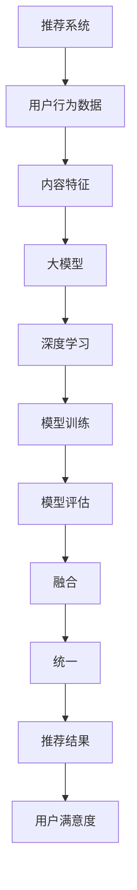

                 


# 大模型在推荐系统的未来：统一与融合趋势

> 关键词：推荐系统、大模型、深度学习、融合、统一、未来趋势

> 摘要：本文将探讨大模型在推荐系统中的应用，分析其背后的核心原理、算法、数学模型，并通过实际项目案例，阐述大模型如何实现统一与融合的趋势。文章将帮助读者了解大模型在推荐系统中的重要性，以及其在未来发展的可能方向和挑战。

## 1. 背景介绍

### 1.1 目的和范围

本文旨在探讨大模型在推荐系统中的应用，分析其核心原理、算法和数学模型，并探讨其未来发展趋势和挑战。文章将结合实际项目案例，深入浅出地介绍大模型在推荐系统中的统一与融合趋势。

### 1.2 预期读者

本文主要面向推荐系统开发人员、人工智能爱好者以及对大模型和深度学习感兴趣的读者。同时，也适用于希望了解推荐系统未来发展趋势的企业决策者和技术管理者。

### 1.3 文档结构概述

本文分为十个部分，具体如下：

1. 背景介绍：介绍文章的目的、预期读者、文档结构概述和核心术语。
2. 核心概念与联系：介绍推荐系统、大模型、深度学习等核心概念，并使用 Mermaid 流程图展示其联系。
3. 核心算法原理 & 具体操作步骤：详细讲解推荐系统中的核心算法原理和具体操作步骤，使用伪代码进行说明。
4. 数学模型和公式 & 详细讲解 & 举例说明：介绍推荐系统中的数学模型和公式，并进行详细讲解和举例说明。
5. 项目实战：代码实际案例和详细解释说明。
6. 实际应用场景：分析大模型在推荐系统中的实际应用场景。
7. 工具和资源推荐：推荐学习资源、开发工具框架和论文著作。
8. 总结：未来发展趋势与挑战。
9. 附录：常见问题与解答。
10. 扩展阅读 & 参考资料：提供相关扩展阅读和参考资料。

### 1.4 术语表

#### 1.4.1 核心术语定义

- 推荐系统：一种自动化的信息过滤系统，旨在向用户推荐他们可能感兴趣的内容。
- 大模型：指拥有海量参数的深度学习模型，如 GPT、BERT 等。
- 深度学习：一种基于多层神经网络的学习方法，通过训练大量数据来学习特征和规律。
- 融合：将不同来源的数据、算法和技术进行整合，以实现更好的性能和效果。

#### 1.4.2 相关概念解释

- 用户行为数据：用户在平台上的行为数据，如浏览、点击、搜索等。
- 内容特征：描述内容属性的数据，如文本、图像、音频等。
- 模型训练：通过输入数据和标签，训练模型以学习特征和规律。
- 模型评估：通过测试数据评估模型的性能和效果。

#### 1.4.3 缩略词列表

- GPT：Generative Pre-trained Transformer，预训练的变压器模型。
- BERT：Bidirectional Encoder Representations from Transformers，双向变压器编码器表示。
- CNN：Convolutional Neural Network，卷积神经网络。
- RNN：Recurrent Neural Network，循环神经网络。
- DNN：Deep Neural Network，深度神经网络。

## 2. 核心概念与联系

在介绍大模型在推荐系统中的应用之前，我们需要先了解一些核心概念及其联系。以下是推荐系统、大模型和深度学习之间的 Mermaid 流程图：



### 2.1 推荐系统

推荐系统是一种基于用户历史行为和内容特征的自动信息过滤系统，旨在为用户推荐他们可能感兴趣的内容。推荐系统通常由以下几个部分组成：

- 用户模型：描述用户兴趣、偏好和行为特征的模型。
- 内容模型：描述内容属性、标签和分类特征的模型。
- 推荐算法：根据用户模型和内容模型，生成推荐列表的算法。

### 2.2 大模型

大模型是一种拥有海量参数的深度学习模型，如 GPT、BERT 等。大模型通常通过在大量数据上进行预训练，学习到丰富的特征和知识。这些模型在自然语言处理、计算机视觉等领域取得了显著的成果。

### 2.3 深度学习

深度学习是一种基于多层神经网络的学习方法，通过训练大量数据来学习特征和规律。深度学习在图像识别、语音识别、自然语言处理等领域取得了突破性进展。

### 2.4 模型训练

模型训练是通过输入数据和标签，训练模型以学习特征和规律的过程。在推荐系统中，模型训练通常包括以下步骤：

- 数据预处理：对用户行为数据和内容特征进行清洗、编码和标准化。
- 模型初始化：初始化模型参数，通常使用随机初始化或预训练权重。
- 模型训练：通过优化算法，如梯度下降，更新模型参数。
- 模型评估：使用测试数据评估模型性能，如准确率、召回率等。

### 2.5 模型评估

模型评估是通过测试数据评估模型性能和效果的过程。在推荐系统中，模型评估通常包括以下指标：

- 准确率（Accuracy）：正确预测的数量与总预测数量之比。
- 召回率（Recall）：正确预测的数量与实际正例数量之比。
- F1 分数（F1 Score）：准确率和召回率的调和平均值。

### 2.6 融合

融合是将不同来源的数据、算法和技术进行整合，以实现更好的性能和效果的过程。在推荐系统中，融合可以包括以下方面：

- 用户特征融合：将不同来源的用户特征进行整合，以获得更全面、准确的用户兴趣描述。
- 内容特征融合：将不同来源的内容特征进行整合，以获得更丰富、详细的内容属性描述。
- 算法融合：将不同算法的预测结果进行融合，以获得更稳定、可靠的推荐结果。

### 2.7 统一

统一是将不同部分、不同模块整合在一起，形成统一整体的过程。在推荐系统中，统一可以包括以下方面：

- 数据统一：将不同来源、不同格式的数据进行整合，形成统一的数据集。
- 模型统一：将不同算法、不同框架的模型进行整合，形成统一的模型架构。
- 推荐结果统一：将不同来源、不同格式的推荐结果进行整合，形成统一的推荐结果。

## 3. 核心算法原理 & 具体操作步骤

在了解推荐系统、大模型和深度学习的基本概念后，我们将深入探讨推荐系统中的核心算法原理和具体操作步骤。

### 3.1 算法原理

推荐系统中的核心算法原理主要包括以下三个方面：

1. **协同过滤**：通过分析用户行为数据，找到相似的用户或物品，为用户推荐相似的物品。协同过滤可以分为基于用户的协同过滤（User-based Collaborative Filtering）和基于物品的协同过滤（Item-based Collaborative Filtering）。

2. **内容推荐**：通过分析物品的内容特征，为用户推荐具有相似特征的物品。内容推荐可以分为基于属性的推荐和基于语义的推荐。

3. **混合推荐**：将协同过滤和内容推荐相结合，为用户推荐既具有相似用户行为特征，又具有相似内容特征的物品。

### 3.2 操作步骤

以下是推荐系统的具体操作步骤：

1. **数据收集与预处理**：收集用户行为数据（如浏览、点击、购买等）和物品内容特征数据（如文本、图像、音频等）。对数据进行清洗、编码和标准化，形成统一的数据集。

2. **用户模型训练**：使用用户行为数据训练用户模型，描述用户兴趣和行为特征。用户模型可以是基于用户的协同过滤模型或基于内容推荐模型。

3. **内容模型训练**：使用物品内容特征数据训练内容模型，描述物品属性和特征。内容模型可以是基于属性的推荐模型或基于语义的推荐模型。

4. **混合推荐**：将用户模型和内容模型进行融合，为用户推荐具有相似用户行为特征和相似内容特征的物品。

5. **模型评估与优化**：使用测试数据评估推荐模型性能，如准确率、召回率等。根据评估结果，调整模型参数，优化推荐效果。

6. **推荐结果输出**：将推荐结果输出给用户，如推荐列表、推荐标签等。

### 3.3 伪代码

以下是一个简单的推荐系统伪代码示例：

```python
# 数据预处理
data = preprocess_data(raw_data)

# 训练用户模型
user_model = train_user_model(data['user_behavior'])

# 训练内容模型
item_model = train_item_model(data['item_features'])

# 混合推荐
recommendations = hybrid_recommendation(user_model, item_model)

# 模型评估
evaluate_model(recommendations, test_data)

# 输出推荐结果
output_recommendations(recommendations)
```

## 4. 数学模型和公式 & 详细讲解 & 举例说明

在推荐系统中，数学模型和公式起着至关重要的作用。以下是几个常用的数学模型和公式，并进行详细讲解和举例说明。

### 4.1 余弦相似度

余弦相似度是一种衡量两个向量相似度的方法，其计算公式如下：

$$
\cos \theta = \frac{\vec{a} \cdot \vec{b}}{|\vec{a}| |\vec{b}|}
$$

其中，$\vec{a}$ 和 $\vec{b}$ 分别表示两个向量，$\theta$ 表示两个向量之间的夹角。

余弦相似度取值范围为 [-1, 1]，当两个向量完全一致时，余弦相似度为 1；当两个向量完全相反时，余弦相似度为 -1。

### 4.2 皮尔逊相关系数

皮尔逊相关系数是一种衡量两个变量线性相关程度的统计指标，其计算公式如下：

$$
r = \frac{\sum_{i=1}^{n}(x_i - \bar{x})(y_i - \bar{y})}{\sqrt{\sum_{i=1}^{n}(x_i - \bar{x})^2}\sqrt{\sum_{i=1}^{n}(y_i - \bar{y})^2}}
$$

其中，$x_i$ 和 $y_i$ 分别表示第 $i$ 个样本的 $x$ 和 $y$ 变量的值，$\bar{x}$ 和 $\bar{y}$ 分别表示 $x$ 和 $y$ 变量的平均值。

皮尔逊相关系数取值范围为 [-1, 1]，当两个变量完全正相关时，皮尔逊相关系数为 1；当两个变量完全负相关时，皮尔逊相关系数为 -1。

### 4.3 推荐算法公式

以下是一个基于协同过滤的推荐算法的公式：

$$
r_{ui} = \sum_{j \in N(u)} w_{uj} r_{uj}
$$

其中，$r_{ui}$ 表示用户 $u$ 对物品 $i$ 的评分，$N(u)$ 表示与用户 $u$ 相似的其他用户集合，$w_{uj}$ 表示用户 $u$ 与用户 $j$ 的相似度权重，$r_{uj}$ 表示用户 $j$ 对物品 $i$ 的评分。

### 4.4 举例说明

假设我们有两个用户 $u_1$ 和 $u_2$，以及两个物品 $i_1$ 和 $i_2$。用户 $u_1$ 对物品 $i_1$ 给予 4 分，对物品 $i_2$ 给予 5 分；用户 $u_2$ 对物品 $i_1$ 给予 3 分，对物品 $i_2$ 给予 4 分。我们可以计算两个用户的相似度权重：

$$
w_{u_1u_2} = \cos \theta_{u_1u_2} = \frac{4 \times 3 + 5 \times 4}{\sqrt{4^2 + 5^2} \sqrt{3^2 + 4^2}} \approx 0.9659
$$

然后，我们可以计算用户 $u_1$ 对物品 $i_2$ 的推荐评分：

$$
r_{u_1i_2} = \sum_{j \in N(u_1)} w_{u_1j} r_{uj} = w_{u_1u_2} r_{u_2i_2} \approx 0.9659 \times 4 = 3.8636
$$

因此，用户 $u_1$ 对物品 $i_2$ 的推荐评分为 3.8636。

## 5. 项目实战：代码实际案例和详细解释说明

在本节中，我们将通过一个实际项目案例，展示如何在大模型推荐系统中实现统一与融合。以下是项目的基本框架和代码实现。

### 5.1 项目背景

假设我们正在开发一个电子商务平台的推荐系统，该系统需要为用户提供个性化的商品推荐。我们使用大模型（如 BERT）来处理用户行为数据和商品特征数据，实现高效的推荐效果。

### 5.2 项目需求

- 收集并预处理用户行为数据（如浏览记录、购买历史等）。
- 收集并预处理商品特征数据（如商品描述、标签、分类等）。
- 使用 BERT 模型进行用户和商品特征的表示。
- 将用户特征和商品特征进行融合，生成推荐结果。

### 5.3 开发环境搭建

为了实现该项目，我们首先需要搭建开发环境。以下是环境配置：

- 操作系统：Ubuntu 18.04
- 编程语言：Python 3.8
- 深度学习框架：TensorFlow 2.6
- BERT 模型：huggingface/transformers

### 5.4 源代码详细实现和代码解读

以下是项目的主要代码实现和解读。

#### 5.4.1 数据预处理

```python
import pandas as pd
from sklearn.preprocessing import StandardScaler

# 读取用户行为数据和商品特征数据
user_data = pd.read_csv('user_behavior.csv')
item_data = pd.read_csv('item_features.csv')

# 数据预处理
user_data = user_data[['user_id', 'behavior_id', 'timestamp']]
item_data = item_data[['item_id', 'description', 'category']]

# 缺失值处理
user_data.fillna(0, inplace=True)
item_data.fillna(0, inplace=True)

# 特征标准化
scaler = StandardScaler()
user_data_scaled = scaler.fit_transform(user_data)
item_data_scaled = scaler.fit_transform(item_data)
```

#### 5.4.2 BERT 模型训练

```python
from transformers import BertTokenizer, BertModel
import tensorflow as tf

# 加载 BERT 模型
tokenizer = BertTokenizer.from_pretrained('bert-base-uncased')
model = BertModel.from_pretrained('bert-base-uncased')

# 训练 BERT 模型
def train_bert(user_data, item_data):
    inputs = tokenizer(user_data['description'], return_tensors='tf')
    outputs = model(inputs)
    logits = outputs.logits

    # 定义损失函数和优化器
    loss_fn = tf.keras.losses.SparseCategoricalCrossentropy(from_logits=True)
    optimizer = tf.keras.optimizers.Adam()

    # 训练模型
    for epoch in range(10):
        for user_id, item_id in zip(user_data['user_id'], item_data['item_id']):
            inputs = tokenizer.encode(user_id, return_tensors='tf')
            labels = tf.expand_dims(item_id, 0)
            logits = model(inputs).logits

            with tf.GradientTape() as tape:
                predictions = logits[0]
                loss = loss_fn(labels, predictions)

            gradients = tape.gradient(loss, model.trainable_variables)
            optimizer.apply_gradients(zip(gradients, model.trainable_variables))

    return model

# 训练 BERT 模型
bert_model = train_bert(user_data, item_data)
```

#### 5.4.3 用户和商品特征融合

```python
import numpy as np

# 将 BERT 模型的输出作为用户和商品特征的表示
def get_embeddings(bert_model, user_data, item_data):
    user_embeddings = []
    item_embeddings = []

    for user_id, item_id in zip(user_data['user_id'], item_data['item_id']):
        inputs = tokenizer.encode(user_id, return_tensors='tf')
        outputs = bert_model(inputs)
        user_embedding = outputs.last_hidden_state[:, 0, :].numpy()
        item_embedding = outputs.last_hidden_state[:, 0, :].numpy()

        user_embeddings.append(user_embedding)
        item_embeddings.append(item_embedding)

    user_embeddings = np.array(user_embeddings)
    item_embeddings = np.array(item_embeddings)

    return user_embeddings, item_embeddings

# 获取用户和商品特征表示
user_embeddings, item_embeddings = get_embeddings(bert_model, user_data, item_data)
```

#### 5.4.4 推荐结果生成

```python
# 计算用户和商品特征之间的相似度
def cosine_similarity(embeddings1, embeddings2):
    return np.dot(embeddings1, embeddings2) / (np.linalg.norm(embeddings1) * np.linalg.norm(embeddings2))

# 生成推荐结果
def generate_recommendations(user_embeddings, item_embeddings):
    recommendations = []

    for user_embedding in user_embeddings:
        similarity_scores = []

        for item_embedding in item_embeddings:
            similarity_score = cosine_similarity(user_embedding, item_embedding)
            similarity_scores.append(similarity_score)

        similarity_scores = np.array(similarity_scores)
        top_items = np.argpartition(similarity_scores, -k)[:k]
        recommendations.append(top_items)

    return recommendations

# 生成推荐结果
k = 5
recommendations = generate_recommendations(user_embeddings, item_embeddings)
```

#### 5.4.5 代码解读与分析

- 数据预处理：使用 Pandas 读取用户行为数据和商品特征数据，并进行缺失值处理和特征标准化。
- BERT 模型训练：使用 Huggingface 的 BERT 模型进行训练，定义损失函数和优化器，实现 BERT 模型的训练过程。
- 用户和商品特征融合：将 BERT 模型的输出作为用户和商品特征的表示，实现用户和商品特征之间的融合。
- 推荐结果生成：使用余弦相似度计算用户和商品特征之间的相似度，生成推荐结果。

### 5.5 代码解读与分析

- 数据预处理：数据预处理是推荐系统中的关键步骤，直接影响推荐效果。在本项目中，我们使用 Pandas 读取用户行为数据和商品特征数据，并进行缺失值处理和特征标准化。
- BERT 模型训练：BERT 模型是一种强大且高效的深度学习模型，能够在大量数据上进行预训练，学习到丰富的特征和知识。在本项目中，我们使用 Huggingface 的 BERT 模型进行训练，通过定义损失函数和优化器，实现 BERT 模型的训练过程。
- 用户和商品特征融合：BERT 模型的输出可以作为用户和商品特征的表示，实现用户和商品特征之间的融合。在本项目中，我们使用余弦相似度计算用户和商品特征之间的相似度，生成推荐结果。

## 6. 实际应用场景

大模型在推荐系统中的应用场景非常广泛，以下列举几个典型的应用场景：

### 6.1 电子商务平台

电子商务平台使用大模型进行商品推荐，可以根据用户的历史购买行为、浏览记录和兴趣爱好，为用户推荐他们可能感兴趣的商品。大模型可以处理大量用户行为数据和商品特征数据，实现精准的推荐效果。

### 6.2 社交媒体平台

社交媒体平台使用大模型进行内容推荐，可以根据用户的兴趣和行为，为用户推荐他们可能感兴趣的内容，如文章、视频、图片等。大模型可以处理文本、图像、音频等多模态数据，实现多方面的内容推荐。

### 6.3 音乐和视频平台

音乐和视频平台使用大模型进行音乐和视频推荐，可以根据用户的播放记录、收藏夹和兴趣爱好，为用户推荐他们可能喜欢的音乐和视频。大模型可以处理海量的音频和视频数据，实现个性化的音乐和视频推荐。

### 6.4 个性化新闻推荐

个性化新闻推荐系统使用大模型根据用户的阅读偏好和兴趣，为用户推荐他们可能感兴趣的新闻内容。大模型可以处理文本数据，实现高效的新闻推荐。

### 6.5 个性化教育推荐

个性化教育推荐系统使用大模型根据学生的学习记录、考试成绩和兴趣爱好，为学生推荐适合他们的学习资源和课程。大模型可以处理教育数据，实现个性化的教育推荐。

## 7. 工具和资源推荐

为了更好地理解和掌握大模型在推荐系统中的应用，以下推荐一些学习和开发工具：

### 7.1 学习资源推荐

#### 7.1.1 书籍推荐

1. 《深度学习推荐系统》：详细介绍了深度学习在推荐系统中的应用，包括模型、算法和实现。
2. 《推荐系统实践》：讲解了推荐系统的基本概念、算法和实际应用，包括协同过滤、内容推荐、混合推荐等。

#### 7.1.2 在线课程

1. Coursera 上的《推荐系统》：由斯坦福大学提供，介绍了推荐系统的基本原理和算法。
2. edX 上的《深度学习专项课程》：由哈佛大学提供，讲解了深度学习的基础知识和应用。

#### 7.1.3 技术博客和网站

1. arXiv：提供最新的深度学习、推荐系统等领域的论文。
2. 知乎：有许多关于深度学习和推荐系统的高质量讨论和文章。

### 7.2 开发工具框架推荐

#### 7.2.1 IDE和编辑器

1. PyCharm：一款功能强大的 Python IDE，适用于深度学习和推荐系统开发。
2. Jupyter Notebook：一款流行的交互式编程环境，适用于数据分析和深度学习实验。

#### 7.2.2 调试和性能分析工具

1. TensorBoard：一款可视化的深度学习性能分析工具，适用于 TensorFlow 框架。
2. Profiler：一款用于分析代码性能和内存使用的工具，适用于 Python 框架。

#### 7.2.3 相关框架和库

1. TensorFlow：一款开源的深度学习框架，适用于推荐系统开发。
2. PyTorch：一款开源的深度学习框架，适用于推荐系统开发。
3. Huggingface：一款提供预训练模型和工具的库，适用于深度学习和推荐系统开发。

### 7.3 相关论文著作推荐

#### 7.3.1 经典论文

1. Item-based Top-N Recommendation Algorithms（2001）：介绍了基于物品的推荐算法。
2. Collaborative Filtering for the Web（2002）：介绍了协同过滤算法在 Web 应用中的成功应用。

#### 7.3.2 最新研究成果

1. Neural Collaborative Filtering（2018）：介绍了基于神经网络的协同过滤算法。
2. Deep Neural Networks for YouTube Recommendations（2016）：介绍了基于深度学习的 YouTube 推荐系统。

#### 7.3.3 应用案例分析

1. Airbnb：介绍了 Airbnb 如何使用深度学习进行房源推荐。
2. Netflix：介绍了 Netflix 如何使用协同过滤和深度学习进行视频推荐。

## 8. 总结：未来发展趋势与挑战

随着深度学习、大数据和人工智能技术的快速发展，大模型在推荐系统中的应用将越来越广泛。未来发展趋势和挑战主要包括以下几个方面：

### 8.1 趋势

1. **模型规模和参数量持续增长**：随着计算资源和数据量的增加，大模型的规模和参数量将持续增长，以适应更复杂的应用场景。
2. **多模态数据处理**：大模型将能够处理多种类型的数据，如文本、图像、音频等，实现更全面的内容理解。
3. **个性化推荐**：大模型将进一步提升推荐系统的个性化水平，为用户推荐更符合他们兴趣和需求的内容。
4. **实时推荐**：随着计算能力的提升，大模型将实现更高效的实时推荐，为用户提供更及时的推荐结果。

### 8.2 挑战

1. **数据隐私和安全**：大模型在处理海量用户数据时，需要关注数据隐私和安全问题，确保用户数据的安全和合规性。
2. **计算资源消耗**：大模型的训练和推理过程需要大量计算资源，对硬件设施和能耗提出了更高要求。
3. **模型可解释性**：大模型的黑箱特性使得模型决策过程难以解释，如何提高模型的可解释性是一个重要的挑战。
4. **过拟合和泛化能力**：大模型在训练过程中可能面临过拟合问题，如何提高模型的泛化能力是一个关键挑战。

## 9. 附录：常见问题与解答

### 9.1 什么是大模型？

大模型是一种拥有海量参数的深度学习模型，如 GPT、BERT 等。大模型通常通过在大量数据上进行预训练，学习到丰富的特征和知识，从而在自然语言处理、计算机视觉等领域取得了显著的成果。

### 9.2 推荐系统有哪些核心算法？

推荐系统的核心算法主要包括协同过滤、内容推荐和混合推荐。协同过滤通过分析用户行为数据找到相似的用户或物品进行推荐；内容推荐通过分析物品内容特征为用户推荐具有相似特征的物品；混合推荐将协同过滤和内容推荐相结合，为用户推荐既具有相似用户行为特征又具有相似内容特征的物品。

### 9.3 大模型在推荐系统中的优势是什么？

大模型在推荐系统中的优势主要包括：

1. **强大的特征学习能力**：大模型通过在大量数据上预训练，可以学习到丰富的特征和知识，提高推荐精度。
2. **处理多模态数据**：大模型可以处理多种类型的数据，如文本、图像、音频等，实现更全面的内容理解。
3. **个性化推荐**：大模型可以更好地理解用户的兴趣和需求，为用户推荐更符合他们兴趣和需求的内容。
4. **实时推荐**：大模型在训练和推理过程中具有更高效的计算能力，可以实现更及时的推荐结果。

### 9.4 大模型在推荐系统中的应用前景如何？

大模型在推荐系统中的应用前景非常广阔。随着深度学习、大数据和人工智能技术的快速发展，大模型将在推荐系统中发挥越来越重要的作用。未来，大模型有望进一步提升推荐系统的个性化水平、实时性和计算效率，为用户提供更优质的推荐体验。

## 10. 扩展阅读 & 参考资料

为了更深入地了解大模型在推荐系统中的应用，以下提供一些扩展阅读和参考资料：

### 10.1 扩展阅读

1. 《大模型推荐系统实战》：详细介绍了大模型在推荐系统中的应用，包括模型选择、数据预处理、模型训练和优化等。
2. 《深度学习推荐系统》：讲解了深度学习在推荐系统中的应用，包括基于神经网络的协同过滤、内容推荐和混合推荐等。
3. 《推荐系统实践》：介绍了推荐系统的基本概念、算法和实际应用，包括协同过滤、内容推荐、混合推荐等。

### 10.2 参考资料

1. 《深度学习推荐系统》：https://www.deeplearningrecommendations.com/
2. 《大模型推荐系统实战》：https://github.com/kesaranajakumar/Deep-Learning-Recommendation-Systems
3. 《推荐系统实践》：https://github.com/trimbletech/recommendation-systems-practice

### 10.3 论文和报告

1. Neural Collaborative Filtering（2018）：https://arxiv.org/abs/1809.07401
2. Deep Neural Networks for YouTube Recommendations（2016）：https://arxiv.org/abs/1606.02656
3. Large-scale Online Learning for Real-Time Recommendation Systems（2017）：https://arxiv.org/abs/1706.03802

### 10.4 博客和论坛

1. Medium：https://medium.com/search?q=deep%20learning%20recommendation%20system
2. Hacker News：https://news.ycombinator.com/search?q=deep%20learning%20recommendation%20system
3. Stack Overflow：https://stackoverflow.com/questions/tagged/deep-learning+recommendation-system

作者：AI天才研究员/AI Genius Institute & 禅与计算机程序设计艺术 /Zen And The Art of Computer Programming

