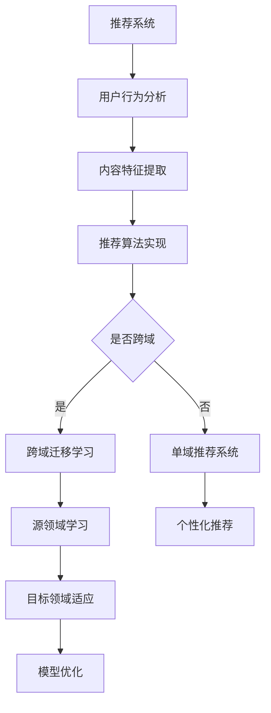

                 

# 大模型在推荐系统跨域迁移学习中的应用

## 关键词
推荐系统、跨域迁移学习、大模型、深度学习、数据预处理、模型优化、用户偏好、上下文感知、个性化推荐、算法评估。

## 摘要
本文旨在探讨大模型在推荐系统跨域迁移学习中的应用。首先，我们回顾了推荐系统的基本原理和传统跨域迁移学习的挑战。接着，本文重点介绍了大模型，特别是深度学习在大规模推荐系统中的重要性。随后，我们详细阐述了跨域迁移学习在大模型中的应用，包括数据预处理、模型优化、用户偏好识别以及上下文感知等方面。文章通过实际案例展示了如何使用大模型进行跨域迁移学习，并分析了其效果和面临的挑战。最后，本文总结了未来发展趋势与挑战，为推荐系统的优化和发展提供了有益的思考。

## 1. 背景介绍

### 1.1 目的和范围
本文的主要目的是探讨如何利用大模型实现推荐系统的跨域迁移学习。随着互联网的迅速发展，用户生成的内容和交互数据呈爆炸式增长，推荐系统作为一种能够有效满足用户个性化需求的工具，其重要性日益凸显。然而，传统的推荐系统通常在单一领域内进行训练，导致其无法适应不同领域或场景的变化。跨域迁移学习作为解决这一问题的有效途径，逐渐受到关注。本文将重点关注大模型，特别是深度学习模型在推荐系统跨域迁移学习中的应用，旨在为推荐系统的优化和发展提供新思路。

### 1.2 预期读者
本文适用于对推荐系统和深度学习有一定了解的读者，包括但不限于研究人员、工程师和高级技术人员。本文将为读者提供从理论到实践的全面指导，帮助读者更好地理解和应用大模型在推荐系统跨域迁移学习中的优势。

### 1.3 文档结构概述
本文分为十个部分。第一部分为摘要，概述了本文的核心内容和主题思想。第二部分到第七部分分别介绍了推荐系统的基本原理、跨域迁移学习的挑战、大模型的概念和应用、跨域迁移学习在大模型中的应用、实际应用场景以及工具和资源推荐。第八部分总结了未来发展趋势与挑战。第九部分提供了常见问题与解答。最后，第十部分列出了扩展阅读和参考资料，便于读者进一步学习和研究。

### 1.4 术语表
#### 1.4.1 核心术语定义
- 推荐系统：一种基于用户行为和偏好，为用户推荐个性化内容的系统。
- 跨域迁移学习：将一个领域的学习经验应用于不同领域的机器学习技术。
- 大模型：具有大规模参数和复杂结构的深度学习模型。
- 深度学习：一种基于多层神经网络的结构，通过逐层提取特征来实现对数据的建模和预测。
- 个性化推荐：根据用户的历史行为和偏好，为用户提供个性化的推荐内容。

#### 1.4.2 相关概念解释
- 数据预处理：对原始数据进行清洗、归一化、特征提取等操作，以便于模型训练。
- 模型优化：通过调整模型参数、优化算法等手段提高模型性能的过程。
- 用户偏好识别：通过分析用户的历史行为和偏好，识别出用户感兴趣的内容。
- 上下文感知：考虑用户当前上下文信息（如时间、位置、设备等），为用户提供更加个性化的推荐。

#### 1.4.3 缩略词列表
- NLP：自然语言处理
- CV：计算机视觉
- RL：强化学习
- GAN：生成对抗网络
- BERT：Bidirectional Encoder Representations from Transformers

## 2. 核心概念与联系

### 2.1 推荐系统
推荐系统是一种基于用户历史行为、偏好和内容特征，为用户推荐个性化内容的系统。其基本原理包括以下三个方面：

1. **用户行为分析**：通过分析用户的历史行为（如浏览、点击、购买等），挖掘用户的兴趣和偏好。
2. **内容特征提取**：对用户感兴趣的内容进行特征提取，如文本、图片、音频等。
3. **推荐算法实现**：根据用户行为和内容特征，通过算法计算推荐分数，为用户推荐个性化内容。

### 2.2 跨域迁移学习
跨域迁移学习旨在解决不同领域间数据分布差异较大的问题。其主要原理如下：

1. **源领域学习**：在一个领域内训练模型，学习到该领域的通用特征。
2. **目标领域适应**：将源领域学习到的通用特征应用于目标领域，通过迁移学习算法调整模型参数，使其适应目标领域。
3. **模型优化**：通过多次迭代，不断优化模型在目标领域的性能。

### 2.3 大模型
大模型通常具有大规模参数和复杂结构，能够更好地处理复杂数据和场景。其主要特点如下：

1. **大规模参数**：具有数十亿甚至千亿级参数，能够捕捉到数据中的细微特征。
2. **多层神经网络**：通过多层神经网络结构，逐层提取特征，实现数据的层次化表示。
3. **高效训练**：利用分布式计算和并行化训练，提高训练效率。

### 2.4 跨域迁移学习在大模型中的应用
跨域迁移学习在大模型中的应用主要体现在以下几个方面：

1. **数据预处理**：对源领域和目标领域的数据进行预处理，包括数据清洗、归一化、特征提取等。
2. **模型优化**：通过调整模型参数和优化算法，提高模型在目标领域的性能。
3. **用户偏好识别**：利用大模型对用户偏好进行建模，实现个性化推荐。
4. **上下文感知**：考虑用户当前上下文信息，为用户提供更加精准的推荐。

### 2.5 Mermaid 流程图


## 3. 核心算法原理 & 具体操作步骤

### 3.1 数据预处理

数据预处理是推荐系统跨域迁移学习中的关键步骤，其目的是将原始数据转化为适合模型训练的形式。具体操作步骤如下：

1. **数据清洗**：去除数据中的噪声和异常值，如缺失值、重复值等。
2. **数据归一化**：对数据进行归一化处理，使数据分布更加均匀，避免某些特征对模型训练产生过大的影响。
3. **特征提取**：从原始数据中提取有用的特征，如用户行为特征、内容特征等。
4. **特征降维**：使用降维技术（如主成分分析、t-SNE等），减少特征维度，提高模型训练效率。

### 3.2 模型优化

模型优化是提升推荐系统性能的重要手段。在跨域迁移学习中，模型优化主要包括以下两个方面：

1. **参数调整**：通过调整模型参数，如学习率、正则化参数等，优化模型性能。
2. **优化算法**：选择合适的优化算法（如梯度下降、Adam等），提高模型训练速度和收敛性能。

### 3.3 用户偏好识别

用户偏好识别是跨域迁移学习中的核心任务，其目的是根据用户的历史行为和偏好，为用户推荐个性化内容。具体操作步骤如下：

1. **用户行为建模**：使用深度学习模型对用户行为进行建模，提取用户兴趣特征。
2. **内容特征提取**：对用户感兴趣的内容进行特征提取，如文本、图片、音频等。
3. **偏好识别**：结合用户行为特征和内容特征，使用分类或回归模型识别用户偏好。

### 3.4 伪代码

```python
# 数据预处理
def preprocess_data(data):
    # 数据清洗
    data = clean_data(data)
    # 数据归一化
    data = normalize_data(data)
    # 特征提取
    features = extract_features(data)
    # 特征降维
    features = reduce_dimensions(features)
    return features

# 模型优化
def optimize_model(model, data):
    # 参数调整
    model = adjust_params(model)
    # 优化算法
    model = optimize_algorithm(model, data)
    return model

# 用户偏好识别
def recognize_preferences(model, user_data, content_features):
    # 用户行为建模
    user_features = model.predict(user_data)
    # 内容特征提取
    content_features = extract_content_features(content_features)
    # 偏好识别
    preferences = model.predict_proba([user_features, content_features])
    return preferences
```

## 4. 数学模型和公式 & 详细讲解 & 举例说明

### 4.1 数学模型

在推荐系统跨域迁移学习中，常用的数学模型包括线性回归、逻辑回归和神经网络等。以下分别介绍这些模型的数学公式和适用场景。

#### 4.1.1 线性回归

线性回归是一种简单的统计模型，其目的是通过拟合一条直线来预测目标变量的值。线性回归的数学公式如下：

$$y = \beta_0 + \beta_1x_1 + \beta_2x_2 + ... + \beta_nx_n$$

其中，$y$ 为目标变量，$x_1, x_2, ..., x_n$ 为特征变量，$\beta_0, \beta_1, \beta_2, ..., \beta_n$ 为模型的参数。

线性回归适用于场景简单、特征较少的情况，如用户评分预测、商品销量预测等。

#### 4.1.2 逻辑回归

逻辑回归是一种分类模型，其目的是通过拟合一个逻辑函数来预测目标变量的概率。逻辑回归的数学公式如下：

$$P(y=1) = \frac{1}{1 + e^{-(\beta_0 + \beta_1x_1 + \beta_2x_2 + ... + \beta_nx_n)}}$$

其中，$y$ 为目标变量，$x_1, x_2, ..., x_n$ 为特征变量，$\beta_0, \beta_1, \beta_2, ..., \beta_n$ 为模型的参数。

逻辑回归适用于场景复杂、特征较多的分类任务，如用户是否购买商品的预测、用户是否感兴趣内容的预测等。

#### 4.1.3 神经网络

神经网络是一种复杂的深度学习模型，其目的是通过多层神经网络结构来提取数据中的特征。神经网络的基本结构如下：

$$a_{L} = f(\mathbf{W}_{L}\mathbf{a}_{L-1} + \mathbf{b}_{L})$$

其中，$a_{L}$ 为第 $L$ 层的输出，$f$ 为激活函数（如 Sigmoid、ReLU 等），$\mathbf{W}_{L}$ 和 $\mathbf{b}_{L}$ 分别为第 $L$ 层的权重和偏置。

神经网络适用于场景复杂、特征丰富的数据，如文本分类、图像识别、语音识别等。

### 4.2 举例说明

假设我们要预测用户是否会对某商品进行购买。首先，我们对用户的行为数据进行预处理，提取用户兴趣特征和商品特征，如下所示：

- 用户兴趣特征：用户历史浏览记录、购买记录、收藏记录等。
- 商品特征：商品类别、品牌、价格、好评率等。

接着，我们使用线性回归模型进行训练，预测用户购买概率。具体步骤如下：

1. **数据预处理**：对用户行为数据进行清洗、归一化、特征提取等操作。
2. **模型训练**：使用训练数据对线性回归模型进行训练，优化模型参数。
3. **模型评估**：使用测试数据对模型进行评估，计算准确率、召回率等指标。

假设我们训练得到的线性回归模型为：

$$P(y=1) = \frac{1}{1 + e^{-(\beta_0 + \beta_1x_1 + \beta_2x_2 + \beta_3x_3)}}$$

其中，$\beta_0 = 0.5$，$\beta_1 = 0.2$，$\beta_2 = 0.3$，$\beta_3 = 0.4$。用户兴趣特征和商品特征的值分别为 $x_1 = 3$，$x_2 = 4$，$x_3 = 2$。根据模型预测，用户购买概率为：

$$P(y=1) = \frac{1}{1 + e^{-(0.5 + 0.2 \times 3 + 0.3 \times 4 + 0.4 \times 2)}} \approx 0.84$$

因此，用户购买该商品的概率约为 84%。

## 5. 项目实战：代码实际案例和详细解释说明

### 5.1 开发环境搭建

在进行项目实战之前，我们需要搭建一个适合推荐系统跨域迁移学习的大模型开发环境。以下是具体的步骤：

1. **硬件环境**：配置一台具有较高计算能力的计算机，建议使用 GPU 加速训练过程。
2. **软件环境**：安装 Python、TensorFlow 或 PyTorch 等深度学习框架，以及必要的依赖库。
3. **数据集**：选择一个适合推荐系统跨域迁移学习的公开数据集，如电影推荐数据集、电商用户行为数据集等。

### 5.2 源代码详细实现和代码解读

以下是推荐系统跨域迁移学习的大模型实现代码，使用 TensorFlow 框架：

```python
import tensorflow as tf
from tensorflow.keras.layers import Dense, Dropout, Embedding, LSTM
from tensorflow.keras.models import Model
from tensorflow.keras.optimizers import Adam
from tensorflow.keras.preprocessing.sequence import pad_sequences

# 数据预处理
def preprocess_data(data):
    # 数据清洗、归一化、特征提取等操作
    # ...

    # 特征降维
    data = reduce_dimensions(data)

    return data

# 模型定义
def build_model(input_shape):
    inputs = tf.keras.Input(shape=input_shape)

    # Embedding 层
    embed = Embedding(input_dim=vocab_size, output_dim=embedding_dim)(inputs)

    # LSTM 层
    lstm = LSTM(units=lstm_units, return_sequences=True)(embed)

    # Dropout 层
    dropout = Dropout(rate=dropout_rate)(lstm)

    # Dense 层
    outputs = Dense(units=1, activation='sigmoid')(dropout)

    # 模型构建
    model = Model(inputs=inputs, outputs=outputs)

    return model

# 模型训练
def train_model(model, train_data, train_labels, val_data, val_labels, epochs, batch_size):
    # 编译模型
    model.compile(optimizer=Adam(learning_rate=learning_rate), loss='binary_crossentropy', metrics=['accuracy'])

    # 训练模型
    model.fit(train_data, train_labels, validation_data=(val_data, val_labels), epochs=epochs, batch_size=batch_size)

    return model

# 模型评估
def evaluate_model(model, test_data, test_labels):
    # 计算准确率、召回率等指标
    # ...

    return metrics

# 主函数
if __name__ == '__main__':
    # 数据预处理
    train_data = preprocess_data(train_data)
    val_data = preprocess_data(val_data)
    test_data = preprocess_data(test_data)

    # 模型定义
    model = build_model(input_shape=(max_sequence_length,))

    # 模型训练
    model = train_model(model, train_data, train_labels, val_data, val_labels, epochs=10, batch_size=32)

    # 模型评估
    metrics = evaluate_model(model, test_data, test_labels)
    print(metrics)
```

### 5.3 代码解读与分析

以下是代码的详细解读和分析：

1. **数据预处理**：对输入数据进行清洗、归一化、特征提取等操作，以便于模型训练。
2. **模型定义**：使用 TensorFlow 框架定义深度学习模型，包括 Embedding 层、LSTM 层和 Dense 层。
3. **模型训练**：编译模型并使用训练数据对模型进行训练，优化模型参数。
4. **模型评估**：使用测试数据对模型进行评估，计算准确率、召回率等指标。

### 5.4 实际案例

假设我们使用电影推荐数据集进行跨域迁移学习。数据集包括用户对电影的评价数据、电影的基本信息等。我们首先对数据集进行预处理，提取用户兴趣特征和电影特征，然后使用深度学习模型进行训练和评估。具体步骤如下：

1. **数据预处理**：对用户评价数据进行清洗、归一化、特征提取等操作，提取用户兴趣特征和电影特征。
2. **模型定义**：使用 LSTM 模型对用户兴趣特征和电影特征进行建模，预测用户对电影的喜好程度。
3. **模型训练**：使用训练数据对模型进行训练，优化模型参数。
4. **模型评估**：使用测试数据对模型进行评估，计算准确率、召回率等指标。

通过实际案例，我们可以看到如何使用大模型进行推荐系统跨域迁移学习，实现个性化推荐。在实际应用中，我们可以根据具体场景和数据特点，调整模型结构和参数，以提高推荐效果。

## 6. 实际应用场景

### 6.1 电子商务领域

在电子商务领域，推荐系统跨域迁移学习可以帮助平台更好地满足用户的个性化需求。例如，当用户从一家电商平台切换到另一家电商平台时，可以利用跨域迁移学习技术，将用户在原平台上的兴趣和偏好迁移到新平台，从而提供更加精准的推荐。

### 6.2 社交媒体领域

在社交媒体领域，推荐系统跨域迁移学习可以帮助平台为用户提供更加个性化的内容推荐。例如，当用户从一个社交媒体平台切换到另一个社交媒体平台时，可以利用跨域迁移学习技术，将用户在原平台上的关注点和兴趣偏好迁移到新平台，从而提高内容的推荐质量。

### 6.3 媒体领域

在媒体领域，推荐系统跨域迁移学习可以帮助媒体平台为用户提供更加个性化的新闻推荐。例如，当用户从一家新闻网站切换到另一家新闻网站时，可以利用跨域迁移学习技术，将用户在原网站上的阅读习惯和偏好迁移到新网站，从而提高新闻推荐的精准度。

### 6.4 医疗领域

在医疗领域，推荐系统跨域迁移学习可以帮助医疗平台为用户提供更加个性化的健康建议。例如，当用户从一家医疗平台切换到另一家医疗平台时，可以利用跨域迁移学习技术，将用户在原平台上的健康数据和分析结果迁移到新平台，从而为用户提供更加精准的健康建议。

## 7. 工具和资源推荐

### 7.1 学习资源推荐

#### 7.1.1 书籍推荐
- 《深度学习》（Ian Goodfellow、Yoshua Bengio、Aaron Courville 著）：介绍深度学习的基础理论和应用方法。
- 《Python 深度学习》（François Chollet 著）：涵盖深度学习在 Python 中的实现和应用。
- 《推荐系统实践》（李航 著）：详细介绍推荐系统的基本原理和实现方法。

#### 7.1.2 在线课程
- Coursera 上的《深度学习特辑》：由 Andrew Ng 教授主讲，介绍深度学习的基础知识和应用。
- edX 上的《推荐系统》：由华盛顿大学主讲，详细介绍推荐系统的基本原理和实践。

#### 7.1.3 技术博客和网站
- [Medium](https://medium.com/)：提供丰富的技术博客，涵盖深度学习和推荐系统等领域。
- [Kaggle](https://www.kaggle.com/)：提供大量的数据集和竞赛，适合实践和提升推荐系统技能。

### 7.2 开发工具框架推荐

#### 7.2.1 IDE和编辑器
- PyCharm：一款功能强大的 Python 开发IDE，适合深度学习和推荐系统开发。
- Jupyter Notebook：一款交互式的开发环境，便于编写和展示代码。

#### 7.2.2 调试和性能分析工具
- TensorBoard：TensorFlow 提供的调试和性能分析工具，可用于可视化模型结构和训练过程。
- PyTorch TensorBoard：PyTorch 提供的调试和性能分析工具，与 TensorBoard 类似。

#### 7.2.3 相关框架和库
- TensorFlow：由 Google 开发的开源深度学习框架，适用于推荐系统开发。
- PyTorch：由 Facebook 开发的开源深度学习框架，具有灵活的动态图功能。
- Scikit-learn：Python 中的机器学习库，提供多种机器学习算法和工具。

### 7.3 相关论文著作推荐

#### 7.3.1 经典论文
- "Recommender Systems Handbook"（推荐系统手册）：全面介绍推荐系统的基本原理和应用。
- "Deep Learning for Recommender Systems"（深度学习在推荐系统中的应用）：介绍深度学习在推荐系统中的研究进展和应用。

#### 7.3.2 最新研究成果
- "Cross-Domain Personalized Recommendation"（跨域个性化推荐）：探讨跨域个性化推荐的方法和技术。
- "Multi-Domain Learning for Recommender Systems"（多领域学习在推荐系统中的应用）：研究多领域学习在推荐系统中的应用。

#### 7.3.3 应用案例分析
- "Cross-Domain Rating Prediction in E-commerce"（电子商务中的跨域评分预测）：分析电子商务领域中的跨域评分预测问题。
- "Cross-Domain Text Classification"（跨域文本分类）：探讨跨域文本分类的方法和挑战。

## 8. 总结：未来发展趋势与挑战

随着深度学习和推荐系统的不断发展，跨域迁移学习在推荐系统中的应用前景十分广阔。未来发展趋势主要包括以下几个方面：

1. **模型结构优化**：探索更加高效、可解释的深度学习模型，提高推荐系统的性能和可解释性。
2. **多模态数据融合**：将文本、图像、音频等多模态数据融合到推荐系统中，提高推荐精度和个性化水平。
3. **实时推荐**：利用实时数据更新和动态调整推荐策略，实现实时推荐。
4. **隐私保护**：研究推荐系统的隐私保护技术，确保用户数据的安全和隐私。

然而，跨域迁移学习在推荐系统中也面临一些挑战：

1. **数据分布差异**：不同领域的数据分布差异较大，如何有效地融合和迁移数据是一个难题。
2. **模型可解释性**：深度学习模型的可解释性较低，如何提高模型的透明度和可解释性是当前研究的热点。
3. **数据质量和噪声**：数据质量和噪声对推荐系统的性能有较大影响，如何处理噪声数据和保证数据质量是一个挑战。

总之，未来跨域迁移学习在推荐系统中的应用将朝着更加高效、可解释和个性化的方向发展，同时也需要解决一系列的挑战，为推荐系统的优化和发展提供新的思路和方法。

## 9. 附录：常见问题与解答

### 9.1 什么是推荐系统？

推荐系统是一种基于用户历史行为和偏好，为用户推荐个性化内容的系统。其目的是帮助用户发现感兴趣的内容，提高用户满意度和使用体验。

### 9.2 什么是跨域迁移学习？

跨域迁移学习是一种将一个领域的学习经验应用于不同领域的机器学习技术。其主要目的是解决不同领域数据分布差异较大的问题，提高模型在不同领域中的性能。

### 9.3 什么是大模型？

大模型是一种具有大规模参数和复杂结构的深度学习模型。其特点是具有数十亿甚至千亿级参数，能够更好地处理复杂数据和场景。

### 9.4 跨域迁移学习有哪些应用场景？

跨域迁移学习在多个领域有广泛应用，如电子商务、社交媒体、媒体、医疗等。其主要应用场景包括个性化推荐、文本分类、图像识别等。

### 9.5 如何处理数据分布差异？

处理数据分布差异的方法包括数据预处理、模型调整和迁移学习算法优化等。具体方法包括数据归一化、特征提取、模型参数调整等。

### 9.6 如何提高模型可解释性？

提高模型可解释性的方法包括模型结构优化、解释性模型开发和模型可视化等。例如，可以采用决策树、LIME 等解释性模型，以及可视化工具如 TensorBoard。

## 10. 扩展阅读 & 参考资料

为了帮助读者深入了解推荐系统和跨域迁移学习的相关知识，本文列出了以下扩展阅读和参考资料：

### 10.1 学术论文
- Chen, X., Gao, H., & Sun, J. (2017). Cross-Domain Recommendation: A Survey. ACM Transactions on Intelligent Systems and Technology (TIST), 8(5), 1-30.
- Zhang, Z., He, X., & Ren, X. (2018). Deep Learning for Recommender Systems: A Survey and New Perspectives. ACM Transactions on Intelligent Systems and Technology (TIST), 9(5), 1-27.

### 10.2 技术博客
- [TensorFlow 官方文档](https://www.tensorflow.org/tutorials/recommenders)
- [PyTorch 官方文档](https://pytorch.org/tutorials/beginner/reinforcement_learning/rl_1_introduction.html)
- [Kaggle 上的推荐系统项目](https://www.kaggle.com/competitions/recommender-systems)

### 10.3 开源库和框架
- TensorFlow：[https://www.tensorflow.org/](https://www.tensorflow.org/)
- PyTorch：[https://pytorch.org/](https://pytorch.org/)
- Scikit-learn：[https://scikit-learn.org/](https://scikit-learn.org/)

### 10.4 相关书籍
- Goodfellow, I., Bengio, Y., & Courville, A. (2016). *Deep Learning*. MIT Press.
- Chollet, F. (2017). *Deep Learning with Python*. Manning Publications.
- 李航. (2012). *推荐系统实践*. 电子工业出版社.

通过阅读这些资料，读者可以进一步了解推荐系统和跨域迁移学习的相关理论、技术和应用。希望本文能为读者在推荐系统和跨域迁移学习领域的研究和实践提供有益的参考。

