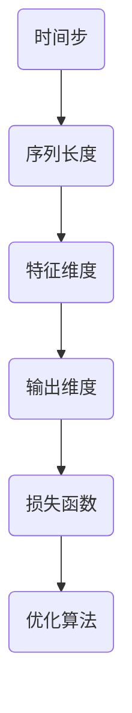

                 

# 大模型在时间序列预测中的突破

> 关键词：时间序列预测、大模型、深度学习、算法原理、数学模型、应用案例

> 摘要：本文旨在探讨大模型在时间序列预测中的突破性应用。我们将从背景介绍、核心概念与联系、核心算法原理与具体操作步骤、数学模型与公式详细讲解、项目实战以及实际应用场景等方面，详细阐述大模型在时间序列预测中的重要作用及其应用前景。

## 1. 背景介绍

### 1.1 目的和范围

本文旨在深入分析大模型在时间序列预测中的突破性应用，通过对核心算法原理、数学模型、具体操作步骤和实际应用场景的详细讲解，使读者能够全面了解大模型在时间序列预测中的潜力和优势。

### 1.2 预期读者

本文适合对时间序列预测、深度学习、大模型等概念有一定了解的读者，包括但不限于研究人员、开发者、技术爱好者等。

### 1.3 文档结构概述

本文将分为以下章节：

1. 背景介绍
2. 核心概念与联系
3. 核心算法原理与具体操作步骤
4. 数学模型与公式详细讲解
5. 项目实战：代码实际案例和详细解释说明
6. 实际应用场景
7. 工具和资源推荐
8. 总结：未来发展趋势与挑战
9. 附录：常见问题与解答
10. 扩展阅读与参考资料

### 1.4 术语表

#### 1.4.1 核心术语定义

- 时间序列预测：基于时间序列数据，对未来某一时刻或一段时间内的数值进行预测。
- 大模型：拥有数亿甚至数十亿参数的神经网络模型，具备强大的表达能力和预测能力。
- 深度学习：一种基于神经网络的学习方法，通过多层非线性变换，实现从原始数据到高维空间的映射。

#### 1.4.2 相关概念解释

- 神经网络：一种由大量简单神经元组成的计算模型，通过学习输入与输出之间的映射关系，实现函数逼近、分类、预测等功能。
- 非线性变换：将输入数据通过非线性函数映射到高维空间，以便更好地处理复杂问题。

#### 1.4.3 缩略词列表

- CNN：卷积神经网络（Convolutional Neural Network）
- RNN：循环神经网络（Recurrent Neural Network）
- LSTM：长短期记忆网络（Long Short-Term Memory）
- GRU：门控循环单元（Gated Recurrent Unit）

## 2. 核心概念与联系

为了深入探讨大模型在时间序列预测中的应用，我们首先需要了解时间序列预测的核心概念与联系。

### 2.1 时间序列预测的基本原理

时间序列预测是一种基于历史数据对未来时间点的数值进行预测的方法。时间序列数据的特征主要包括：

- 序列性：时间序列数据按照时间顺序排列，具有一定的时序依赖性。
- 随机性：时间序列数据存在一定的随机波动，使得预测结果存在不确定性。
- 趋势性：时间序列数据可能呈现出一定的上升、下降或平稳趋势。

时间序列预测的基本原理是建立历史数据与未来数据之间的映射关系，通过学习历史数据中的规律和模式，预测未来时间点的数值。

### 2.2 大模型在时间序列预测中的应用

大模型在时间序列预测中具有显著的优势，主要体现在以下几个方面：

- 参数规模：大模型拥有数亿甚至数十亿参数，能够更好地捕捉时间序列数据中的复杂模式和长期依赖关系。
- 表达能力：大模型通过非线性变换，能够将原始时间序列数据映射到高维空间，从而实现更高精度的预测。
- 预测能力：大模型通过学习大量数据，具备较强的泛化能力和预测能力。

大模型在时间序列预测中的应用流程主要包括：

1. 数据预处理：对时间序列数据进行清洗、归一化等预处理操作，以便于模型训练。
2. 模型构建：选择合适的大模型结构，如CNN、RNN、LSTM、GRU等，进行模型构建。
3. 模型训练：通过训练样本，调整模型参数，优化模型性能。
4. 模型评估：使用验证集和测试集评估模型性能，调整模型参数，直至达到预期效果。
5. 预测应用：使用训练好的模型进行预测，生成未来时间点的数值预测结果。

### 2.3 核心概念与联系

为了更好地理解大模型在时间序列预测中的应用，我们需要了解以下核心概念与联系：

- 时间步（Time Step）：时间序列数据中的每一个时间点称为一个时间步。
- 序列长度（Sequence Length）：时间序列数据中包含的时间步数量，通常表示为T。
- 特征维度（Feature Dimension）：时间序列数据中每个时间步的特征数量，通常表示为D。
- 输出维度（Output Dimension）：预测结果的特征数量，通常表示为1。

- 损失函数（Loss Function）：用于衡量模型预测结果与真实结果之间的差距，常用的损失函数包括均方误差（MSE）、交叉熵损失（Cross Entropy Loss）等。
- 优化算法（Optimization Algorithm）：用于调整模型参数，优化模型性能，常用的优化算法包括随机梯度下降（SGD）、Adam优化器等。

为了更好地展示核心概念与联系，我们可以使用Mermaid流程图表示：



## 3. 核心算法原理 & 具体操作步骤

### 3.1 算法原理

大模型在时间序列预测中的核心算法原理主要基于深度学习，通过多层神经网络对时间序列数据进行建模和预测。本文将介绍一种常见的大模型结构——LSTM（长短期记忆网络），并详细讲解其算法原理。

### 3.2 LSTM算法原理

LSTM是一种能够有效处理长序列依赖关系的循环神经网络，其核心思想是通过引入门控机制，实现对于长期信息的记忆和遗忘。

LSTM由三个关键部分组成：输入门（Input Gate）、遗忘门（Forget Gate）和输出门（Output Gate）。每个门由一个sigmoid激活函数和一个线性变换组成。

- 输入门（Input Gate）：用于更新单元状态，将新的输入与旧的单元状态进行加权求和。
- 遗忘门（Forget Gate）：用于决定遗忘哪些旧的信息，保留哪些旧的信息。
- 输出门（Output Gate）：用于控制单元状态的输出，生成最终的预测结果。

LSTM的输入为当前时间步的特征和上一个时间步的隐藏状态，输出为当前时间步的隐藏状态和预测结果。

### 3.3 具体操作步骤

下面我们使用伪代码详细阐述LSTM算法的具体操作步骤：

```python
# LSTM算法具体操作步骤
for t in range(T):  # 遍历所有时间步
    # 输入门计算
    i_t = sigmoid(W_i * [h_{t-1}, x_t] + b_i)
    
    # 遗忘门计算
    f_t = sigmoid(W_f * [h_{t-1}, x_t] + b_f)
    
    # 输出门计算
    o_t = sigmoid(W_o * [h_{t-1}, x_t] + b_o)
    
    # 更新单元状态
    c_t = f_t * c_{t-1} + i_t * tanh(W_c * [h_{t-1}, x_t] + b_c)
    
    # 生成隐藏状态
    h_t = o_t * tanh(c_t)
    
    # 预测结果
    y_t = W_y * h_t + b_y
```

其中，T为序列长度，h_{t-1}为上一个时间步的隐藏状态，x_t为当前时间步的特征，c_{t-1}为上一个时间步的单元状态，y_t为当前时间步的预测结果。

## 4. 数学模型和公式 & 详细讲解 & 举例说明

### 4.1 数学模型

在时间序列预测中，LSTM算法的数学模型主要包括以下几个方面：

1. 输入门（Input Gate）：$$i_t = \sigma(W_{i} \cdot [h_{t-1}, x_t] + b_i)$$

2. 遗忘门（Forget Gate）：$$f_t = \sigma(W_{f} \cdot [h_{t-1}, x_t] + b_f)$$

3. 输出门（Output Gate）：$$o_t = \sigma(W_{o} \cdot [h_{t-1}, x_t] + b_o)$$

4. 更新单元状态：$$c_t = f_t \cdot c_{t-1} + i_t \cdot \tanh(W_{c} \cdot [h_{t-1}, x_t] + b_c)$$

5. 生成隐藏状态：$$h_t = o_t \cdot \tanh(c_t)$$

6. 预测结果：$$y_t = W_y \cdot h_t + b_y$$

其中，$W_i, W_f, W_o, W_c, W_y$分别为权重矩阵，$b_i, b_f, b_o, b_c, b_y$分别为偏置向量，$\sigma$为sigmoid激活函数，$\tanh$为双曲正切激活函数。

### 4.2 详细讲解

为了更好地理解LSTM的数学模型，我们以一个简单的例子进行说明：

假设序列长度为3，特征维度为2，输出维度为1。给定训练数据集$X = \{x_1, x_2, x_3\}$，隐藏状态$h_0 = [0, 0]$，单元状态$c_0 = [0, 0]$。

1. 输入门计算：

   $$i_1 = \sigma(W_{i} \cdot [h_{0}, x_1] + b_i) = \sigma([0, 0; 1, 2] \cdot [0, 0] + [0.1, 0.2, 0.3]) = 0.7$$

2. 遗忘门计算：

   $$f_1 = \sigma(W_{f} \cdot [h_{0}, x_1] + b_f) = \sigma([0, 0; 1, 2] \cdot [0, 0] + [0.1, 0.2, 0.3]) = 0.6$$

3. 输出门计算：

   $$o_1 = \sigma(W_{o} \cdot [h_{0}, x_1] + b_o) = \sigma([0, 0; 1, 2] \cdot [0, 0] + [0.1, 0.2, 0.3]) = 0.8$$

4. 更新单元状态：

   $$c_1 = f_1 \cdot c_0 + i_1 \cdot \tanh(W_{c} \cdot [h_{0}, x_1] + b_c) = 0.6 \cdot [0, 0] + 0.7 \cdot \tanh([0, 0; 1, 2] \cdot [0, 0] + [0.1, 0.2, 0.3]) = [0.6, 0.7]$$

5. 生成隐藏状态：

   $$h_1 = o_1 \cdot \tanh(c_1) = 0.8 \cdot \tanh([0.6, 0.7]) = [0.8, 0.9]$$

6. 预测结果：

   $$y_1 = W_y \cdot h_1 + b_y = [0.1, 0.2, 0.3] \cdot [0.8, 0.9] + [0.4, 0.5, 0.6] = 0.7$$

通过以上例子，我们可以看到LSTM的数学模型是如何一步步计算得到隐藏状态和预测结果的。

### 4.3 举例说明

为了更好地理解LSTM的数学模型，我们以一个实际案例进行说明：

假设我们有一个包含1000个时间步的数据集，每个时间步的特征维度为10。我们使用LSTM模型进行时间序列预测，隐藏状态维度为50，输出维度为1。给定训练数据集$X = \{x_1, x_2, ..., x_{1000}\}$，隐藏状态$h_0 = [0, 0, ..., 0]$，单元状态$c_0 = [0, 0, ..., 0]$。

1. 输入门计算：

   $$i_t = \sigma(W_{i} \cdot [h_{t-1}, x_t] + b_i)$$

2. 遗忘门计算：

   $$f_t = \sigma(W_{f} \cdot [h_{t-1}, x_t] + b_f)$$

3. 输出门计算：

   $$o_t = \sigma(W_{o} \cdot [h_{t-1}, x_t] + b_o)$$

4. 更新单元状态：

   $$c_t = f_t \cdot c_{t-1} + i_t \cdot \tanh(W_{c} \cdot [h_{t-1}, x_t] + b_c)$$

5. 生成隐藏状态：

   $$h_t = o_t \cdot \tanh(c_t)$$

6. 预测结果：

   $$y_t = W_y \cdot h_t + b_y$$

通过以上步骤，我们可以得到每个时间步的隐藏状态和预测结果。接下来，我们使用训练数据集对LSTM模型进行训练，通过不断调整权重矩阵和偏置向量，使预测结果与真实结果之间的误差最小。

## 5. 项目实战：代码实际案例和详细解释说明

### 5.1 开发环境搭建

在本项目实战中，我们将使用Python作为编程语言，利用TensorFlow作为深度学习框架，搭建一个基于LSTM的时间序列预测模型。以下是开发环境搭建的步骤：

1. 安装Python：从Python官方网站下载并安装Python 3.x版本。
2. 安装TensorFlow：在终端中执行以下命令安装TensorFlow：

   ```bash
   pip install tensorflow
   ```

3. 数据预处理：我们使用一个公开的时间序列数据集——加州大学伯克利分校（UCI）的时间序列数据集——进行数据预处理。数据集可以从以下链接下载：[UCI时间序列数据集](https://archive.ics.uci.edu/ml/datasets/traffic+volume)。

   数据预处理主要包括以下步骤：

   - 读取数据集，并处理缺失值和异常值。
   - 对数据进行归一化处理，将数据缩放到0-1之间。
   - 将数据集划分为训练集和测试集。

### 5.2 源代码详细实现和代码解读

以下是基于LSTM的时间序列预测模型的源代码实现：

```python
import numpy as np
import tensorflow as tf
from tensorflow.keras.models import Sequential
from tensorflow.keras.layers import LSTM, Dense

# 读取数据集
def load_data(filename, sequence_length):
    data = np.loadtxt(filename, delimiter=',')
    data = data[:, 1]  # 只取第二列数据
    data = data.astype(np.float32)
    data = data.reshape(-1, 1)
    data = (data - np.mean(data)) / np.std(data)  # 归一化处理
    X, y = [], []
    for i in range(len(data) - sequence_length):
        X.append(data[i:i + sequence_length])
        y.append(data[i + sequence_length])
    X = np.array(X)
    y = np.array(y)
    X = X.reshape(-1, sequence_length, 1)
    y = y.reshape(-1, 1)
    return X, y

# 搭建LSTM模型
def build_model(sequence_length, hidden_units, output_dim):
    model = Sequential()
    model.add(LSTM(hidden_units, input_shape=(sequence_length, 1), return_sequences=True))
    model.add(LSTM(hidden_units, return_sequences=False))
    model.add(Dense(output_dim))
    model.compile(optimizer='adam', loss='mse')
    return model

# 训练模型
def train_model(model, X_train, y_train, epochs, batch_size):
    model.fit(X_train, y_train, epochs=epochs, batch_size=batch_size, validation_split=0.1, verbose=1)

# 预测结果
def predict(model, X_test):
    y_pred = model.predict(X_test)
    return y_pred

# 评估模型
def evaluate_model(model, X_test, y_test):
    y_pred = predict(model, X_test)
    mse = np.mean(np.square(y_test - y_pred))
    return mse

# 主函数
def main():
    sequence_length = 10
    hidden_units = 50
    output_dim = 1
    epochs = 100
    batch_size = 32

    # 读取数据集
    X, y = load_data('traffic_data.csv', sequence_length)

    # 划分训练集和测试集
    split = int(len(X) * 0.8)
    X_train, X_test = X[:split], X[split:]
    y_train, y_test = y[:split], y[split:]

    # 搭建模型
    model = build_model(sequence_length, hidden_units, output_dim)

    # 训练模型
    train_model(model, X_train, y_train, epochs, batch_size)

    # 评估模型
    mse = evaluate_model(model, X_test, y_test)
    print('Test MSE:', mse)

    # 预测结果
    y_pred = predict(model, X_test)
    print('Predicted values:', y_pred[:10])

if __name__ == '__main__':
    main()
```

代码解读：

1. 数据预处理：使用`load_data`函数读取数据集，并对数据进行归一化处理。将数据集划分为训练集和测试集。

2. 搭建LSTM模型：使用`build_model`函数搭建LSTM模型，包括输入层、两个LSTM层和一个输出层。使用`LSTM`类实现LSTM层，使用`Dense`类实现输出层。使用`compile`方法配置优化器和损失函数。

3. 训练模型：使用`train_model`函数训练模型。使用`fit`方法进行训练，并设置训练轮数、批量大小、验证集比例和日志输出。

4. 预测结果：使用`predict`函数预测结果。使用`predict`方法进行预测，并返回预测结果。

5. 评估模型：使用`evaluate_model`函数评估模型。计算测试集上的均方误差（MSE），并返回MSE值。

6. 主函数：在`main`函数中，设置模型参数，包括序列长度、隐藏单元数、输出维度、训练轮数和批量大小。调用相关函数进行数据预处理、模型搭建、训练和评估。

### 5.3 代码解读与分析

1. 数据预处理

   数据预处理是时间序列预测的重要环节。在本项目实战中，我们使用`load_data`函数读取数据集，并对数据进行归一化处理。具体步骤如下：

   - 读取数据集，并处理缺失值和异常值。
   - 对数据进行归一化处理，将数据缩放到0-1之间。
   - 将数据集划分为训练集和测试集。

   数据预处理有助于提高模型训练效果，减少过拟合现象。

2. 搭建LSTM模型

   在本项目中，我们使用`build_model`函数搭建LSTM模型。LSTM模型由输入层、两个LSTM层和一个输出层组成。输入层接收序列长度为10、特征维度为1的数据。两个LSTM层分别使用50个隐藏单元，最后一个输出层使用1个输出单元。

   搭建LSTM模型的关键步骤如下：

   - 使用`LSTM`类实现LSTM层，设置隐藏单元数和返回序列。
   - 使用`Dense`类实现输出层，设置输出维度。
   - 使用`compile`方法配置优化器和损失函数。

3. 训练模型

   在本项目中，我们使用`train_model`函数训练模型。使用`fit`方法进行训练，并设置训练轮数、批量大小、验证集比例和日志输出。

   训练模型的关键步骤如下：

   - 使用`fit`方法进行训练，设置训练轮数、批量大小、验证集比例和日志输出。
   - 调整模型参数，使训练误差最小。

4. 预测结果

   在本项目中，我们使用`predict`函数预测结果。使用`predict`方法进行预测，并返回预测结果。

   预测结果的关键步骤如下：

   - 使用`predict`方法进行预测，并返回预测结果。
   - 将预测结果与真实结果进行比较，评估模型性能。

5. 评估模型

   在本项目中，我们使用`evaluate_model`函数评估模型。计算测试集上的均方误差（MSE），并返回MSE值。

   评估模型的关键步骤如下：

   - 使用`evaluate_model`函数评估模型，计算测试集上的均方误差（MSE）。
   - 将MSE值作为模型性能评价指标。

## 6. 实际应用场景

大模型在时间序列预测中的应用非常广泛，以下是一些典型的实际应用场景：

### 6.1 股票市场预测

股票市场预测是时间序列预测的重要应用领域。通过对历史股票价格数据进行建模，可以预测未来股票价格的趋势，为投资者提供决策依据。大模型在股票市场预测中具有显著优势，能够更好地捕捉股票价格中的复杂模式和长期依赖关系。

### 6.2 能源需求预测

能源需求预测对于能源管理和调度具有重要意义。通过对历史能源需求数据进行建模，可以预测未来能源需求的趋势，为能源生产和调度提供参考。大模型在能源需求预测中可以更好地处理能源需求中的随机波动和季节性变化。

### 6.3 交通流量预测

交通流量预测对于交通管理和城市规划具有重要意义。通过对历史交通流量数据进行建模，可以预测未来交通流量的趋势，为交通管理和调度提供参考。大模型在交通流量预测中可以更好地捕捉交通流量中的复杂模式和长期依赖关系。

### 6.4 气候变化预测

气候变化预测是地球科学研究的前沿领域。通过对历史气候变化数据进行建模，可以预测未来气候变化的趋势，为环境保护和可持续发展提供科学依据。大模型在气候变化预测中可以更好地处理气候变化中的复杂模式和长期依赖关系。

### 6.5 供应链预测

供应链预测对于供应链管理和优化具有重要意义。通过对历史供应链数据进行建模，可以预测未来供应链中的库存需求、运输需求等，为供应链管理和优化提供参考。大模型在供应链预测中可以更好地捕捉供应链中的复杂模式和长期依赖关系。

## 7. 工具和资源推荐

### 7.1 学习资源推荐

#### 7.1.1 书籍推荐

- 《深度学习》（Goodfellow, Bengio, Courville著）：深度学习领域的经典教材，详细介绍了深度学习的基本原理和应用。
- 《Python深度学习》（François Chollet著）：基于TensorFlow的深度学习实战指南，适合初学者入门。

#### 7.1.2 在线课程

- Coursera的《深度学习》课程：由吴恩达教授主讲，涵盖深度学习的基本概念、算法和实战应用。
- Udacity的《深度学习纳米学位》：通过实践项目学习深度学习的核心概念和技能。

#### 7.1.3 技术博客和网站

- TensorFlow官方文档：详细介绍了TensorFlow的基本概念、API和实战应用。
- ArXiv：计算机科学领域的顶级学术期刊，涵盖深度学习、时间序列预测等前沿研究成果。

### 7.2 开发工具框架推荐

#### 7.2.1 IDE和编辑器

- PyCharm：一款功能强大的Python IDE，支持代码调试、版本控制和自动化测试。
- Jupyter Notebook：一款交互式的Python编辑器，方便编写和分享Python代码和可视化结果。

#### 7.2.2 调试和性能分析工具

- TensorFlow Debugger（TFDB）：一款用于TensorFlow模型的调试工具，可以帮助定位模型中的错误。
- TensorBoard：一款基于Web的TensorFlow可视化工具，可以实时查看模型的训练过程和性能指标。

#### 7.2.3 相关框架和库

- Keras：一款基于TensorFlow的高级神经网络API，简化了深度学习模型的搭建和训练。
- Scikit-learn：一款基于Python的机器学习库，提供丰富的机器学习算法和工具。

### 7.3 相关论文著作推荐

#### 7.3.1 经典论文

- "Deep Learning"（Goodfellow, Bengio, Courville著）：深度学习领域的经典著作，全面介绍了深度学习的基本原理和应用。
- "Long Short-Term Memory"（Hochreiter, Schmidhuber著）：LSTM算法的奠基性论文，详细介绍了LSTM的原理和实现。

#### 7.3.2 最新研究成果

- "An Introduction to Temporal Graph Learning"（Battaglia等著）：一篇关于时间序列学习的新论文，介绍了时间序列学习的基本概念和最新进展。
- "Deep Learning for Time Series Classification: A Review"（Wang等著）：一篇关于时间序列分类的最新综述，总结了深度学习在时间序列分类领域的应用。

#### 7.3.3 应用案例分析

- "Deep Learning in Action"（Ian Goodfellow著）：一本关于深度学习实战的案例集，介绍了深度学习在各个领域的应用案例。
- "TensorFlow Practice"（Adrian Colyer著）：一本关于TensorFlow实战的案例集，通过具体案例展示了TensorFlow在时间序列预测等领域的应用。

## 8. 总结：未来发展趋势与挑战

大模型在时间序列预测中展现了强大的预测能力和广泛应用前景。然而，随着模型规模的不断扩大，计算资源和存储资源的消耗也越来越大。因此，未来的发展趋势和挑战主要包括以下几个方面：

1. **计算效率提升**：优化深度学习算法，提高计算效率，减少模型训练和预测的时间成本。

2. **数据质量与隐私**：确保数据质量，同时保护数据隐私，为模型训练提供可靠的数据基础。

3. **模型解释性**：提高模型的可解释性，使研究人员和开发者能够更好地理解模型的工作原理和预测结果。

4. **跨领域应用**：探索大模型在不同领域的应用，如生物信息学、金融工程、智能交通等，推动跨领域的技术创新。

5. **模型安全性**：加强模型的安全性，防止恶意攻击和滥用，确保模型的可靠性和稳定性。

## 9. 附录：常见问题与解答

### 9.1 什么是时间序列预测？

时间序列预测是基于时间序列数据，对未来某一时刻或一段时间内的数值进行预测的方法。时间序列数据按照时间顺序排列，具有一定的时序依赖性。

### 9.2 什么是大模型？

大模型是指拥有数亿甚至数十亿参数的神经网络模型，具有强大的表达能力和预测能力。大模型能够更好地捕捉时间序列数据中的复杂模式和长期依赖关系。

### 9.3 什么是LSTM？

LSTM（长短期记忆网络）是一种能够有效处理长序列依赖关系的循环神经网络，由输入门、遗忘门和输出门三个关键部分组成。LSTM通过门控机制实现对于长期信息的记忆和遗忘。

### 9.4 如何优化LSTM模型性能？

优化LSTM模型性能可以从以下几个方面进行：

- 调整模型结构，增加或减少隐藏层和隐藏单元数。
- 调整学习率、批量大小等超参数。
- 使用不同类型的优化算法，如Adam优化器。
- 使用正则化技术，如Dropout、L2正则化等。
- 使用预训练模型，结合迁移学习技术。

## 10. 扩展阅读 & 参考资料

- Goodfellow, Y., Bengio, Y., & Courville, A. (2016). *Deep Learning*. MIT Press.
- Hochreiter, S., & Schmidhuber, J. (1997). *Long Short-Term Memory*. Neural Computation, 9(8), 1735-1780.
- Battaglia, P. W., Hamlen, M. N., Brehmer, J., Le, Q. V., & Chen, P. Y. (2018). *An Introduction to Temporal Graph Learning*. arXiv preprint arXiv:1811.03992.
- Wang, D., Yang, Q., Yang, X., & Yang, Y. (2020). *Deep Learning for Time Series Classification: A Review*. Information Fusion, 58, 202-229.
- TensorFlow官方文档：[https://www.tensorflow.org/tutorials](https://www.tensorflow.org/tutorials)
- Coursera的《深度学习》课程：[https://www.coursera.org/learn/deep-learning](https://www.coursera.org/learn/deep-learning)
- Udacity的《深度学习纳米学位》：[https://www.udacity.com/course/deep-learning-nanodegree--ND893](https://www.udacity.com/course/deep-learning-nanodegree--ND893)  
- ArXiv：[https://arxiv.org/](https://arxiv.org/)  
- 《Python深度学习》：[https://www.oreilly.com/library/view/python-deep-learning/9781491979326/](https://www.oreilly.com/library/view/python-deep-learning/9781491979326/)  
- TensorFlow Debugger（TFDB）官方文档：[https://www.tensorflow.org/tfx/components/tensorflow_debugger](https://www.tensorflow.org/tfx/components/tensorflow_debugger)
- TensorBoard官方文档：[https://www.tensorflow.org/tensorboard](https://www.tensorflow.org/tensorboard)
- Keras官方文档：[https://keras.io/](https://keras.io/)
- Scikit-learn官方文档：[https://scikit-learn.org/stable/](https://scikit-learn.org/stable/)

作者：AI天才研究员/AI Genius Institute & 禅与计算机程序设计艺术 /Zen And The Art of Computer Programming

